**Autoencoder for defect modeling in mechanical components (Oct. 2020)**

Objectifs de l'exercice: tester différentes dimensions de l'espace latent 50, 1 ou 450. Proposer une façon de comparer les résultats. Proposer un schéma numérique pour interpoler des images. Proposer une visualisation de l'espace latent.  


```python
import sys
print(sys.version)

import matplotlib.pyplot as plt
import numpy as np
from sklearn.manifold import TSNE, Isomap, MDS

import tensorflow as tf
from tensorflow.keras.layers import Input, Dense, Concatenate, Lambda, Flatten, Reshape
from tensorflow.keras.layers import Conv2D, Conv2DTranspose
from tensorflow.keras.models import Model, load_model
from tensorflow.keras import backend as K
from tensorflow.keras import metrics
from tensorflow.keras.datasets import mnist, fashion_mnist
from tensorflow.keras.optimizers import Adam, SGD, Nadam
from tensorflow import stack
from tensorflow.keras.losses import MeanSquaredError
import tensorflow_probability as tfp

from PIL import Image
```

    3.7.14 (default, Sep  8 2022, 00:06:44) 
    [GCC 7.5.0]


```python
class AutoEncoder_defects:
    
    def __init__(self, shape, filters=16, latent_dim=2, lr=0.001, verbose=True, callbacks=None):
        """
        Autoencoder for grey level images.

        Arguments:
            shape: shape of the input image [size_x, size_y, 1]
            filters: number of filters of the first conv layer
            latent_dim = size of the latent space (dimensions of the reduced space)
            lr: learning rate
            verbose = Boolean, if True, will print information about the models
        """
        
        self.input_shape = shape
        self.latent_dim = latent_dim
        self.verbose = verbose

        # Build the Autoencoder Model
        layer_filters = [filters, filters*2]

        # First build the Encoder Model
        inputs = Input(shape=self.input_shape, name='encoder_input')
        x = inputs
        # Stack of Conv2D blocks
        for filters in layer_filters:
            x = Conv2D(filters=filters,
                        kernel_size=3,
                        strides=1,
                        activation='relu',
                        padding='same')(x)
            x = Conv2D(filters=filters,
                        kernel_size=3,
                        strides=2,
                        activation='relu',
                        padding='same')(x)

        # Shape info needed to build Decoder Model
        last_shape = K.int_shape(x)

        # Generate the latent vector
        x = Flatten()(x)
        latent = Dense(self.latent_dim)(x)

        # Instantiate Encoder Model
        self.encoder = Model(inputs, latent)
        if self.verbose:
            self.encoder.summary()

        # Build the Decoder Model
        latent_inputs = Input(shape=(latent_dim,))
        x = Dense(last_shape[1] * last_shape[2] * last_shape[3])(latent_inputs)
        x = Reshape((last_shape[1], last_shape[2], last_shape[3]))(x)

        # Stack of Transposed Conv2D blocks
        for filters in layer_filters[::-1]:
            x = Conv2DTranspose(filters=filters,
                                kernel_size=3,
                                strides=2,
                                activation='relu',
                                padding='same')(x)
            x = Conv2D(filters=filters,
                                kernel_size=3,
                                strides=1,
                                activation='relu',
                                padding='same')(x)                            

        # The activation of the output layer is a sigmoid, so that output values
        # are in the same range as input values
        outputs = Conv2D(filters=1,
                        kernel_size=3,
                        strides=1,
                        activation='sigmoid',
                        padding='same')(x)

        # Instantiate Decoder Model
        self.decoder = Model(latent_inputs, outputs)
        if self.verbose:
            self.decoder.summary()

        # Autoencoder = Encoder + Decoder
        # Instantiate Autoencoder Model
        self.autoencoder = Model(inputs, 
                                self.decoder(self.encoder(inputs)),
                                name='autoencoder')
        if self.verbose:
            self.autoencoder.summary()
        
        ## Compile it with an appropriate loss function
        loss_ = 'mse' #loss_jaccard #'mse'
        self.autoencoder.compile(optimizer=Adam(learning_rate=lr), loss=loss_)
        self.autoencoder.summary()
        
    def fit(self, data, epochs, batch_size, validation_split=0.2):
        return self.autoencoder.fit(x=data, 
                             y=data, 
                             validation_split=validation_split,
                             shuffle=True, 
                             epochs=epochs, 
                             batch_size=batch_size)

    def predict(self, batch):
        """Autoencode batch of images"""
        return self.autoencoder.predict(batch)

    def save(self, path):
      self.autoencoder.save(path + '/my_autoencoder')
      self.encoder.save(path + '/my_encoder')
      self.decoder.save(path + '/my_decoder')

    def load_model(self, path):
      self.autoencoder = load_model(path + '/my_autoencoder')
      self.encoder = load_model(path + '/my_encoder')
      self.decoder = load_model(path + '/my_decoder')
```


```python
import os
from google.colab import drive
drive.mount('/content/drive')

path = "/content/drive/My Drive/IDSC"

os.chdir(path)
os.listdir(path)
```

    Drive already mounted at /content/drive; to attempt to forcibly remount, call drive.mount("/content/drive", force_remount=True).


    ['TensorOfData_ImageNet.ipynb',
     'TensorFormatDisplacementField.ipynb',
     'Data',
     'Decouverte_Conv2D.ipynb',
     'Exercice_Images_defects.ipynb',
     'Exercice_AE_dof_Aout_2022.ipynb',
     'Untitled0.ipynb',
     'imgs',
     'dqn_tp.ipynb',
     'ae_defects_model',
     'model.png',
     'ae_mechanics_model',
     'MMAE_defect_dof_Sept_2022.ipynb',
     'model_final_defects',
     'main.ipynb']


```python
image_2D_defects = np.load('Data/All_images.npy')
```


```python
n = 10

plt.figure(figsize=(20, 4))
for i in range(n):
    # display original
    ax = plt.subplot(1, n, i + 1)
    plt.imshow(image_2D_defects[i],cmap='jet')
#    plt.gray()
    ax.get_xaxis().set_visible(False)
    ax.get_yaxis().set_visible(False)

plt.show()
```


```python
N = image_2D_defects.shape[0]
coeff = 0.2

N_split = int(N*(1-coeff))

x = image_2D_defects

x_train = x[:N_split]
x_test = x[N_split:]
```


```python
x_train = np.expand_dims(x_train, axis = 3)
x_test = np.expand_dims(x_test, axis = 3)
im = np.expand_dims(image_2D_defects, axis = 3)
x_min= x_train.min()
x_max= x_train.max()
x_train = (x_train-x_min)/(x_max-x_min)
x_test = (x_test-x_min)/(x_max-x_min)
```


```python
x_train.shape
```


    (3200, 48, 48, 1)


```python
LATENT_DIM = 60

shape = x_train.shape[1:4]
ae_defects = AutoEncoder_defects(shape, filters=20, latent_dim=LATENT_DIM, lr=1.e-4, verbose=False)
ae_defects.load_model('ae_defects_model')
```

    Model: "autoencoder"
    _________________________________________________________________
     Layer (type)                Output Shape              Param #   
    =================================================================
     encoder_input (InputLayer)  [(None, 48, 48, 1)]       0         
                                                                     
     model_2 (Functional)        (None, 60)                371160    
                                                                     
     model_3 (Functional)        (None, 48, 48, 1)         391261    
                                                                     
    =================================================================
    Total params: 762,421
    Trainable params: 762,421
    Non-trainable params: 0
    _________________________________________________________________


    WARNING:tensorflow:No training configuration found in save file, so the model was *not* compiled. Compile it manually.
    WARNING:tensorflow:No training configuration found in save file, so the model was *not* compiled. Compile it manually.


```python
from keras.utils.vis_utils import plot_model
plot_model(ae_defects.encoder, show_shapes=True, show_layer_names=True)
```


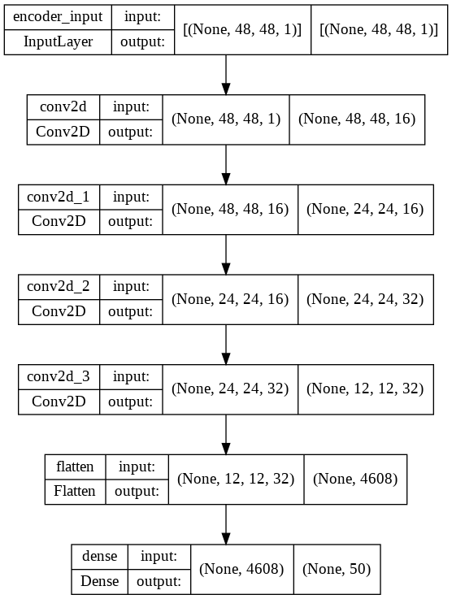


```python
plot_model(ae_defects.decoder, show_shapes=True, show_layer_names=True)
```


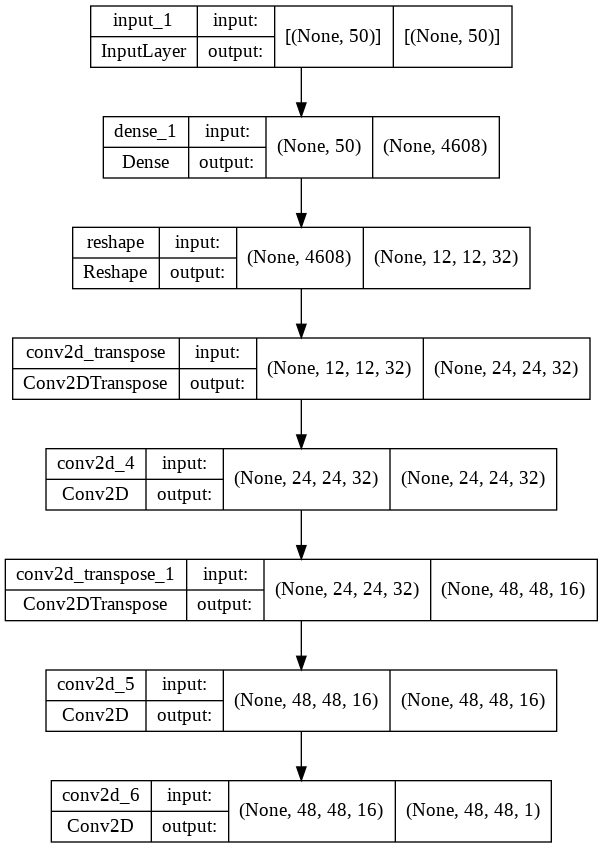


```python
#epochs = 150 #150
#batch_size = 64 #128
#history = ae_defects.fit(x_train, epochs, batch_size, validation_split=0.2)
```


```python
# plt.semilogy(history.epoch, history.history['loss'], label='train')
# plt.semilogy(history.epoch, history.history['val_loss'], label='val')
# plt.title('Training performance')
# plt.ylabel('loss')
# plt.xlabel('epoch')
# plt.legend()
# plt.show()
```


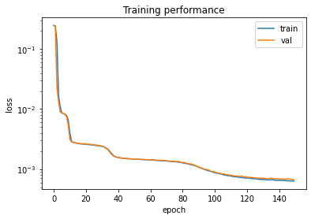


```python
#ae_defects.save('ae_defects_model')
```

    WARNING:tensorflow:Compiled the loaded model, but the compiled metrics have yet to be built. `model.compile_metrics` will be empty until you train or evaluate the model.
    WARNING:tensorflow:Compiled the loaded model, but the compiled metrics have yet to be built. `model.compile_metrics` will be empty until you train or evaluate the model.


Latent variables for defects


```python
Z_latent_defects_train = ae_defects.encoder(x_train)
Z_latent_defects_test = ae_defects.encoder(x_test)
```


```python
print(Z_latent_defects_train.shape)
```

    (3200, 50)


```python
class AutoEncoder_mechanics:
    
    def __init__(self, shape, filters=16, latent_dim=2, lr=0.001, verbose=True):
        """
        Autoencoder for grey level images.

        Arguments:
            shape: shape of the input image [size_x, size_y, 1]
            filters: number of filters of the first conv layer
            latent_dim = size of the latent space (dimensions of the reduced space)
            lr: learning rate
            verbose = Boolean, if True, will print information about the models
        """

        self.input_shape = shape
        self.latent_dim = latent_dim
        self.verbose = verbose

        # Build the Autoencoder Model
        layer_filters = [filters] #, filters*2] #, filters*4]

        # First build the Encoder Model
        inputs = Input(shape=self.input_shape, name='encoder_input')
        x = inputs
        # Stack of Conv2D blocks
        for filters in layer_filters:
            x = Conv2D(filters=filters,
                        kernel_size=3,
                        strides=1,
                        activation='relu',
                        padding='same')(x)
            x = Conv2D(filters=filters,
                        kernel_size=3,
                        strides=2,
                        activation='relu',
                        padding='same')(x)


        # Shape info needed to build Decoder Model
        last_shape = K.int_shape(x)

        # Generate the latent vector
        x = Flatten()(x)
        latent = Dense(self.latent_dim)(x)

        # Instantiate Encoder Model
        self.encoder = Model(inputs, latent)
        if self.verbose:
            self.encoder.summary()

        # Build the Decoder Model
        latent_inputs = Input(shape=(latent_dim,))
        x = Dense(last_shape[1] * last_shape[2] * last_shape[3])(latent_inputs)
        x = Reshape((last_shape[1], last_shape[2], last_shape[3]))(x)
        ## NOTE : LES ACTIVATIONS ONT ETE CHANGEES A TANH DANS LES 
        ## DEUX CAS. AVANT IL N'Y AVAIT AUCUN DECODAGE (TOUT ETAIT
        ## REMIS A ZERO)
        # Stack of Transposed Conv2D blocks
        for filters in layer_filters[::-1]:
            x = Conv2DTranspose(filters=filters,
                                kernel_size=3,
                                strides=2,
                                activation='linear',
                                padding='same')(x)
            x = Conv2D(filters=filters,
                                kernel_size=3,
                                strides=1,
                                activation='linear',
                                padding='same')(x)                            

        # The activation of the output layer is a sigmoid, so that output values
        # are in the same range as input values
        outputs = Conv2D(filters=1,
                        kernel_size=3,
                        strides=1,
                        activation='linear',
                        padding='same')(x)

        # Instantiate Decoder Model
        self.decoder = Model(latent_inputs, outputs)
        if self.verbose:
            self.decoder.summary()

        # Autoencoder = Encoder + Decoder
        # Instantiate Autoencoder Model
        self.autoencoder = Model(inputs, 
                                self.decoder(self.encoder(inputs)),
                                name='autoencoder')
        if self.verbose:
            self.autoencoder.summary()
        
        ## Compile it with an appropriate loss function
        loss_ = 'mse'
        self.autoencoder.compile(optimizer=Adam(learning_rate=lr), loss=loss_)
        self.autoencoder.summary()
        
    def fit(self, data, epochs, batch_size, validation_split=0.2,callbacks=None):
        return self.autoencoder.fit(x=data, 
                             y=data, 
                             validation_split=validation_split,
                             shuffle=True, 
                             epochs=epochs, 
                             batch_size=batch_size,
                             callbacks=callbacks)

    def predict(self, batch):
        """Autoencode batch of images"""
        return self.autoencoder.predict(batch)

    def save(self, path):
        self.autoencoder.save(path + '/my_autoencoder')
        self.encoder.save(path + '/my_encoder')
        self.decoder.save(path + '/my_decoder')

    def load_model(self, path):
        self.autoencoder = load_model(path + '/my_autoencoder')
        self.encoder = load_model(path + '/my_encoder')
        self.decoder = load_model(path + '/my_decoder')
```

Train for all displacement images (all direction and all loading conditions as instances)


```python
image_o = np.load('Data/All_dof_fluctuations.npy').reshape(4000,48,48,6)
image_mechanics = np.vstack((image_o[:,:,:,0],image_o[:,:,:,1],image_o[:,:,:,2],image_o[:,:,:,3],image_o[:,:,:,4],image_o[:,:,:,5]))
#image_mechanics = image_o[:,:,:,0]
image_mechanics = np.expand_dims(image_mechanics, axis = 3)
```


```python
print(image_mechanics.shape)
```

    (24000, 48, 48, 1)


```python
n = 10

plt.figure(figsize=(20, 4))
for i in range(n):
    # display original
    ax = plt.subplot(1, n, i + 1)
    plt.imshow(image_mechanics[i,:,:,0],cmap='jet')
#    plt.gray()
    ax.get_xaxis().set_visible(False)
    ax.get_yaxis().set_visible(False)

plt.show()
```


```python
x_train_mechanics = image_mechanics[:N_split]
x_test_mechanics = image_mechanics[N_split:]
del image_mechanics
```

**Scaling**


```python
x_mean_mechanics = x_train_mechanics.mean(axis=0)
x_train_mechanics = x_train_mechanics-x_mean_mechanics
x_test_mechanics = x_test_mechanics-x_mean_mechanics
x_max_mechanics= abs(x_train_mechanics).max()
x_train_mechanics = x_train_mechanics/x_max_mechanics
x_test_mechanics = x_test_mechanics/x_max_mechanics
```


```python
x_train_mechanics.shape
```


    (3200, 48, 48, 1)


```python
plt.figure(figsize=(20, 4))
for i in range(n):
    # display original
    ax = plt.subplot(1, n, i + 1)
    plt.imshow(x_train_mechanics[i,:,:,0],cmap='jet')
#    plt.gray()
    ax.get_xaxis().set_visible(False)
    ax.get_yaxis().set_visible(False)

plt.show()
```


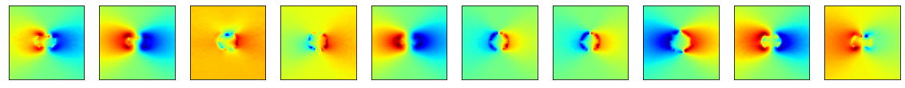


```python
shape = x_train_mechanics.shape[1:4]
ae_mechanics = AutoEncoder_mechanics(shape, filters=32, latent_dim=LATENT_DIM, lr=2.5e-6, verbose=False)
ae_mechanics.load_model('ae_mechanics_model')
```

    Model: "autoencoder"
    _________________________________________________________________
     Layer (type)                Output Shape              Param #   
    =================================================================
     encoder_input (InputLayer)  [(None, 48, 48, 1)]       0         
                                                                     
     model_4 (Functional)        (None, 60)                1115548   
                                                                     
     model_5 (Functional)        (None, 48, 48, 1)         1143137   
                                                                     
    =================================================================
    Total params: 2,258,685
    Trainable params: 2,258,685
    Non-trainable params: 0
    _________________________________________________________________


    WARNING:tensorflow:No training configuration found in save file, so the model was *not* compiled. Compile it manually.
    WARNING:tensorflow:No training configuration found in save file, so the model was *not* compiled. Compile it manually.


```python
from keras.utils.vis_utils import plot_model
plot_model(ae_mechanics.encoder, show_shapes=True, show_layer_names=True)
```


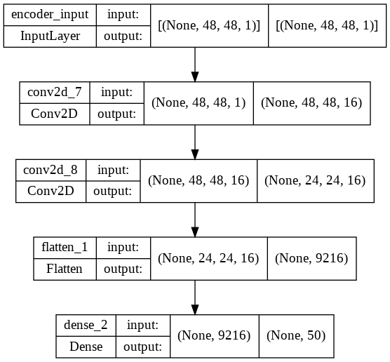


```python
plot_model(ae_mechanics.decoder, show_shapes=True, show_layer_names=True)
```


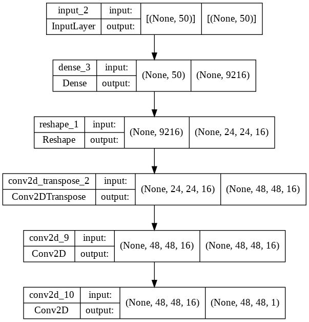


```python
# epochs = 1600 # 120 #50 150
# batch_size = 64 #64 128
# history_mechanics = ae_mechanics.fit(x_train_mechanics, epochs, batch_size, validation_split=0.2,callbacks=[tf.keras.callbacks.EarlyStopping(patience=20,)])
```


```python
# plt.semilogy(history_mechanics.epoch, history_mechanics.history['loss'], label='train')
# plt.semilogy(history_mechanics.epoch, history_mechanics.history['val_loss'], label='val')
# plt.title('Training performance for ae_mechanics')
# plt.ylabel('loss')
# plt.xlabel('epoch')
# plt.legend()
# plt.show()
```


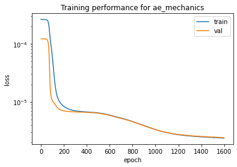


```python
#ae_mechanics.save('ae_mechanics_model')
```

Multimodal AE for defect and displacement 0 only


```python
image_dof0 = np.load('Data/All_dof_fluctuations.npy').reshape(4000,48,48,6)
image_dof0 = image_dof0[:,:,:,0]
image_dof0 = np.expand_dims(image_dof0, axis = 3)
image_dof0_train = image_dof0[:N_split]
image_dof0_test = image_dof0[N_split:]
del image_dof0
image_dof0_train = (image_dof0_train - x_mean_mechanics)/x_max_mechanics
image_dof0_test = (image_dof0_test - x_mean_mechanics)/x_max_mechanics
Z_latent_mechanics_train = ae_mechanics.encoder(image_dof0_train)
Z_latent_mechanics_test = ae_mechanics.encoder(image_dof0_test)
```


```python
Z_latent_mechanics_train.shape
```


    TensorShape([3200, 50])


MMAE for latent variables

(Z_defect,Z_mechanics) -> Z -> (Z_defect,Z_mechanics)


```python
class MultiAutoEncoder:
    
    def __init__(self, shapes, latent_dim=2, lr=0.004, verbose=True, loss="mse",alpha=0.5):
        """
        Autoencoder for multimodal latent variables.

        Arguments:
            shapes: shapes of the input image [size_x, size_y, 1], [size_x, size_y, 2]
            latent_dim = size of the latent space (dimensions of the reduced space)
            lr: learning rate
            verbose = Boolean, if True, will print information about the models

        1 - latent variable for defect images 
        2 - letent variable for mechanical variable
        """
        
        self.input_shape1 = shapes[0]
        self.input_shape2 = shapes[0]
        self.latent_dim = latent_dim
        self.verbose = verbose

        # First build the Encoder Model
        inputs1 = Input(shape=self.input_shape1, name='encoder_input')
        inputs2 = Input(shape=self.input_shape2, name='encoder_input')
        x1 = inputs1
        x2 = inputs2

        last_shape1 = K.int_shape(x1)
        last_shape2 = K.int_shape(x2)
        if verbose :
            print(f"last_shape1 = {last_shape1}, last_shape2 = {last_shape2}")

        # Generate the latent vector
        latent1 = Dense(self.latent_dim)(Dense(self.latent_dim)(x1))
        latent2 = Dense(self.latent_dim)(Dense(self.latent_dim)(x2))

        # Instantiate Encoders Model
        self.encoder1 = Model(inputs1, latent1, name="encoder1")
        self.encoder2 = Model(inputs2, latent2, name="encoder2")
        
        if self.verbose:
            self.encoder1.summary()
            self.encoder2.summary()

        #Instantiate global encoder model
        inputs_global = Input(shape=(last_shape1[1],2))
        input1 = inputs_global[:,:,0]
        input2 = inputs_global[:,:,1]
        latent1 = self.encoder1(input1)
        latent2 = self.encoder2(input2)
        latent = (latent1 + 3*latent2)/4
        self.encoder = Model(inputs_global,latent,name="encoder")
        if self.verbose:
            self.encoder.summary()

        # Build the Decoder Model
        latent_inputs = Input(shape=(latent_dim,))
        outputs1 = Dense(last_shape1[1] )(latent_inputs)
        outputs2 = Dense(last_shape2[1] )(latent_inputs)
        
        # Instantiate Decoder Model
        self.decoder1 = Model(latent_inputs, outputs1, name="decoder1",)
        self.decoder2 = Model(latent_inputs, outputs2, name="decoder2")
        outputs = stack([outputs1,outputs2],axis=2)
        self.decoder = Model(latent_inputs,outputs, name="decoder")
        if self.verbose:
            self.decoder1.summary()
            self.decoder2.summary()
            self.decoder.summary()

        # Autoencoder = Encoder + Decoder
        # Instantiate Autoencoder Model
        self.autoencoder = Model(inputs_global, 
                                self.decoder(self.encoder(inputs_global)),
                                name='autoencoder')
        if self.verbose:
            self.autoencoder.summary()

        #predictor
        self.predictor = Model(inputs1,self.decoder2(self.encoder1(inputs1)),
                               name="predictor")

        self.predictor2 = Model(inputs1,self.decoder1(self.encoder1(inputs1)),
                               name="predictor2")

        if self.verbose:
            self.predictor.summary()
            self.predictor2.summary()

        #personalized loss
        mse = MeanSquaredError()

        def my_loss(x,y) :
            x1 = x[:,:,0]
            x2 = x[:,:,1]

            #latent space
            z1 = self.encoder1(x1)
            z2 = self.encoder2(x2)
            z = self.encoder(x)

            #losses for reconstructions
            y1 = self.decoder1(z)
            y2 = self.decoder2(z)

            #variance in the latent space
            #corr = tfp.stats.correlation(z1,z2,event_axis=None,sample_axis=1)
            var1 = tfp.stats.variance(z1,sample_axis = 0)
            var2 = tfp.stats.variance(z2,sample_axis = 0)

            #losses for predictions
            #y2_pred = self.decoder2(z1)
            #y1_pred = self.decoder1(z2)
            
            return  mse(z1,z2) + (mse(x1,y1) + 10*mse(x2,y2)) #+ 10*mse(z,x2)


        
        ## Compile it with an appropriate loss function             
        self.autoencoder.compile(optimizer= Nadam(learning_rate=lr), loss=my_loss) 
        self.predictor.compile(optimizer= Nadam(learning_rate=lr), loss=my_loss)
        self.predictor2.compile(optimizer= Nadam(learning_rate=lr), loss=my_loss)


    def fit(self, data, epochs, batch_size, validation_split=0.2,callbacks=None):
        return self.autoencoder.fit(x=data, 
                             y=data, 
                             validation_split=validation_split,
                             shuffle=True, 
                             epochs=epochs, 
                             batch_size=batch_size,
                             callbacks=callbacks)

    def predict(self, batch):
        """Autoencode batch of images"""
        return self.autoencoder.predict(batch)

    def predict_mechanics(self,batch):
        """for a given image, predict deformations"""
        return self.predictor.predict(batch)
    
    def predict_image(self,batch):
        """for given image, predict the image for error estimation"""
        return self.predictor2.predict(batch)

    def predict_latent_representation(self,batch):
        """for a given (image,deformations), predict the latent space representation"""
        input1 = batch[:,0]
        input2 = batch[:,1]
        latent1 = self.encoder1.predict(input1)
        latent2 = self.encoder2.predict(input2)
        latent1 = np.expand_dims(latent1,axis=2)
        latent2 = np.expand_dims(latent2,axis=2)
        return np.concatenate((latent1,latent2), axis =2)
    
    def decode(self,batch):
        """for a given code, decode and print the images/deformations"""
        output1 = self.decoder1(batch)
        output2 = self.decoder2(batch)
        return output1, output2

    def save(self, path):
        self.autoencoder.save(path + '/my_autoencoder')
        self.encoder.save(path + '/my_encoder')
        self.decoder.save(path + '/my_decoder')

    def load_model(self, path):
        self.autoencoder = load_model(path + '/my_autoencoder')
        self.encoder = load_model(path + '/my_encoder')
        self.decoder = load_model(path + '/my_decoder')
```


```python
Z_train_mmae = stack([Z_latent_defects_train,Z_latent_mechanics_train],axis=2)
Z_test_mmae = stack([Z_latent_defects_test,Z_latent_mechanics_test],axis=2)
shape = Z_train_mmae.shape[1:]
print('shape',shape)
LATENT_DIM_MMAE = LATENT_DIM #np.round(LATENT_DIM / 2).astype(int)
print('LATENT_DIM_MMAE',LATENT_DIM_MMAE)
mmae = MultiAutoEncoder(shape, latent_dim=LATENT_DIM_MMAE, lr=5.e-5, verbose=False)
```

    shape (50, 2)
    LATENT_DIM_MMAE 60


```python
epochs = 3000 # 120 #50 150
batch_size = 64
history_mmae = mmae.fit(Z_train_mmae, epochs, batch_size, validation_split=0.2,callbacks=[tf.keras.callbacks.EarlyStopping(patience=20,)])
```

```python
plt.semilogy(history_mmae.epoch, history_mmae.history['loss'], label='train')
plt.semilogy(history_mmae.epoch, history_mmae.history['val_loss'], label='val')
plt.title('Training performance')
plt.ylabel('loss')
plt.xlabel('epoch')
plt.legend()
plt.show()
```


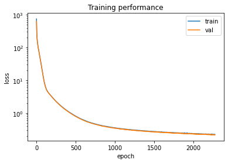


```python
def show_latent_space(mmae, x):
  batch = x
  input1, input2 = batch[:, :, 0], batch[:, :, 1]
  latent1, latent2 = mmae.encoder1.predict(input1), mmae.encoder2.predict(input2)
  latent1, latent2 = np.expand_dims(latent1, axis=2), np.expand_dims(latent2, axis=2)
  return np.concatenate((latent1, latent2), axis=2)
```


```python
y_mechanics = np.array(ae_mechanics.decoder(mmae.predict_mechanics(ae_defects.encoder(x_test))))
y_latent = show_latent_space(mmae, Z_test_mmae)
y_defect = np.array(ae_defects.decoder(mmae.predict_image(ae_defects.encoder(x_test))))
print(y_mechanics.shape)
```

    (800, 48, 48, 1)


```python
n = 10  # how many digits we will display
shift = 10 * n  # change this value to look at other test images
plt.figure(figsize=(20, 4))
for i in range(n):
    iii = shift+i
    # display original
    ax = plt.subplot(2, n, i + 1)
    plt.imshow(x_test[iii].reshape(48, 48),cmap='gray')
    ax.get_xaxis().set_visible(False)
    ax.get_yaxis().set_visible(False)

    # display reconstruction
    ax = plt.subplot(2, n, i + 1 + n)
    plt.imshow(y_defect[iii].reshape(48, 48),cmap='gray')
    ax.get_xaxis().set_visible(False)
    ax.get_yaxis().set_visible(False)
plt.show()
plt.figure(figsize=(20, 4))
for i in range(n):
    iii = shift+i
    # display original
    ax = plt.subplot(2, n, i + 1)
    plt.imshow(x_test_mechanics[iii].reshape(48, 48),cmap='jet')
    ax.get_xaxis().set_visible(False)
    ax.get_yaxis().set_visible(False)

    # display reconstruction
    ax = plt.subplot(2, n, i + 1 + n)
    plt.imshow(y_mechanics[iii].reshape(48, 48),cmap='jet')
    ax.get_xaxis().set_visible(False)
    ax.get_yaxis().set_visible(False)
plt.show()

plt.figure(figsize=(20, 30))
for i in range(n):
  iii = shift + i
  #display latent
  ax = plt.subplot(2, n, i+1)

  plt.imshow(y_latent[iii], cmap='jet')
  ax.get_xaxis().set_visible(False)
  ax.get_yaxis().set_visible(False)

plt.show()
```


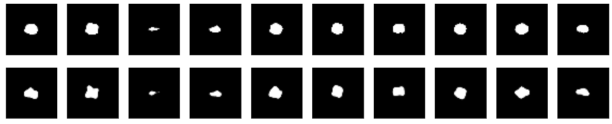


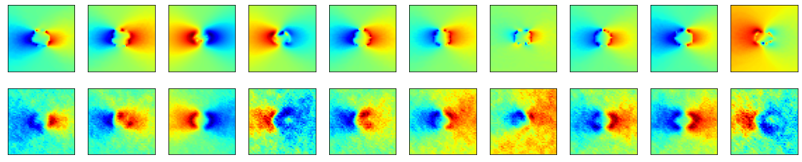


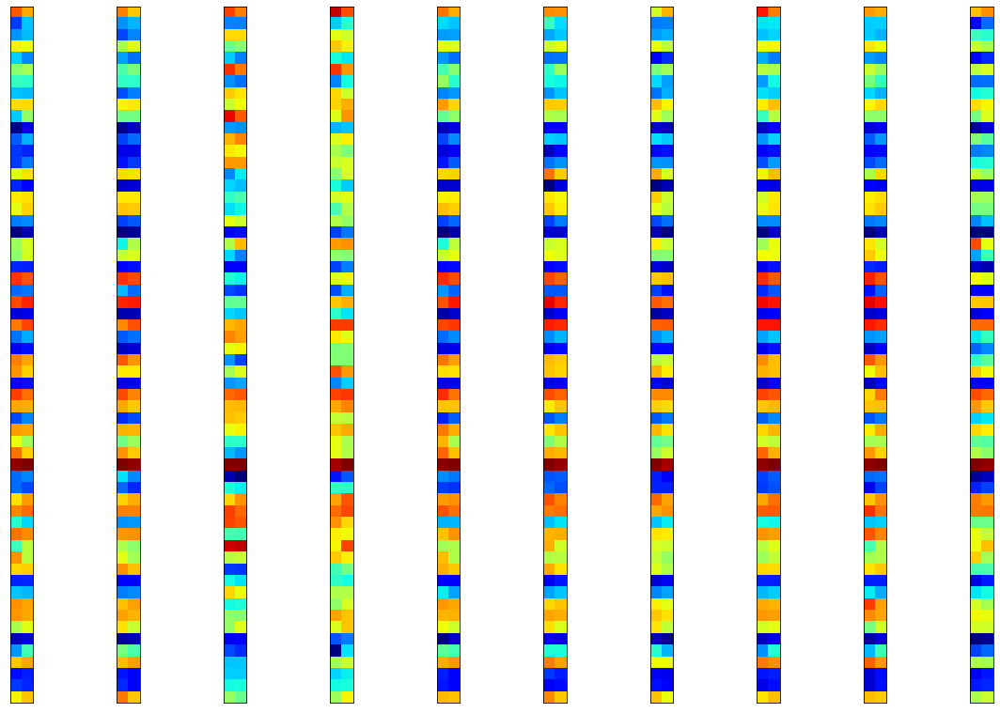


```python
os.system('jupyter nbconvert --to markdown main.ipynb')
```

