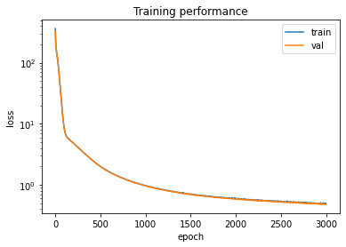

**Autoencoder for defect modeling in mechanical components (Oct. 2020)**

Objectifs de l'exercice: tester différentes dimensions de l'espace latent 50, 1 ou 450. Proposer une façon de comparer les résultats. Proposer un schéma numérique pour interpoler des images. Proposer une visualisation de l'espace latent.  


```python
import sys
print(sys.version)

import matplotlib.pyplot as plt
import numpy as np
from sklearn.manifold import TSNE, Isomap, MDS

import tensorflow as tf
from tensorflow.keras.layers import Input, Dense, Concatenate, Lambda, Flatten, Reshape
from tensorflow.keras.layers import Conv2D, Conv2DTranspose
from tensorflow.keras.models import Model, load_model
from tensorflow.keras import backend as K
from tensorflow.keras import metrics
from tensorflow.keras.datasets import mnist, fashion_mnist
from tensorflow.keras.optimizers import Adam, SGD, Nadam
from tensorflow import stack
from tensorflow.keras.losses import MeanSquaredError
import tensorflow_probability as tfp

from PIL import Image
```

    3.7.14 (default, Sep  8 2022, 00:06:44) 
    [GCC 7.5.0]


```python
class AutoEncoder_defects:
    
    def __init__(self, shape, filters=16, latent_dim=2, lr=0.001, verbose=True, callbacks=None):
        """
        Autoencoder for grey level images.

        Arguments:
            shape: shape of the input image [size_x, size_y, 1]
            filters: number of filters of the first conv layer
            latent_dim = size of the latent space (dimensions of the reduced space)
            lr: learning rate
            verbose = Boolean, if True, will print information about the models
        """
        
        self.input_shape = shape
        self.latent_dim = latent_dim
        self.verbose = verbose

        # Build the Autoencoder Model
        layer_filters = [filters, filters*2]

        # First build the Encoder Model
        inputs = Input(shape=self.input_shape, name='encoder_input')
        x = inputs
        # Stack of Conv2D blocks
        for filters in layer_filters:
            x = Conv2D(filters=filters,
                        kernel_size=3,
                        strides=1,
                        activation='relu',
                        padding='same')(x)
            x = Conv2D(filters=filters,
                        kernel_size=3,
                        strides=2,
                        activation='relu',
                        padding='same')(x)

        # Shape info needed to build Decoder Model
        last_shape = K.int_shape(x)

        # Generate the latent vector
        x = Flatten()(x)
        latent = Dense(self.latent_dim)(x)

        # Instantiate Encoder Model
        self.encoder = Model(inputs, latent)
        if self.verbose:
            self.encoder.summary()

        # Build the Decoder Model
        latent_inputs = Input(shape=(latent_dim,))
        x = Dense(last_shape[1] * last_shape[2] * last_shape[3])(latent_inputs)
        x = Reshape((last_shape[1], last_shape[2], last_shape[3]))(x)

        # Stack of Transposed Conv2D blocks
        for filters in layer_filters[::-1]:
            x = Conv2DTranspose(filters=filters,
                                kernel_size=3,
                                strides=2,
                                activation='relu',
                                padding='same')(x)
            x = Conv2D(filters=filters,
                                kernel_size=3,
                                strides=1,
                                activation='relu',
                                padding='same')(x)                            

        # The activation of the output layer is a sigmoid, so that output values
        # are in the same range as input values
        outputs = Conv2D(filters=1,
                        kernel_size=3,
                        strides=1,
                        activation='sigmoid',
                        padding='same')(x)

        # Instantiate Decoder Model
        self.decoder = Model(latent_inputs, outputs)
        if self.verbose:
            self.decoder.summary()

        # Autoencoder = Encoder + Decoder
        # Instantiate Autoencoder Model
        self.autoencoder = Model(inputs, 
                                self.decoder(self.encoder(inputs)),
                                name='autoencoder')
        if self.verbose:
            self.autoencoder.summary()
        
        ## Compile it with an appropriate loss function
        loss_ = 'mse' #loss_jaccard #'mse'
        self.autoencoder.compile(optimizer=Adam(learning_rate=lr), loss=loss_)
        self.autoencoder.summary()
        
    def fit(self, data, epochs, batch_size, validation_split=0.2):
        return self.autoencoder.fit(x=data, 
                             y=data, 
                             validation_split=validation_split,
                             shuffle=True, 
                             epochs=epochs, 
                             batch_size=batch_size)

    def predict(self, batch):
        """Autoencode batch of images"""
        return self.autoencoder.predict(batch)

    def save(self, path):
      self.autoencoder.save(path + '/my_autoencoder')
      self.encoder.save(path + '/my_encoder')
      self.decoder.save(path + '/my_decoder')

    def load_model(self, path):
      self.autoencoder = load_model(path + '/my_autoencoder')
      self.encoder = load_model(path + '/my_encoder')
      self.decoder = load_model(path + '/my_decoder')
```


```python
import os
from google.colab import drive
drive.mount('/content/drive')

path = "/content/drive/My Drive/IDSC"

os.chdir(path)
os.listdir(path)
```

    Drive already mounted at /content/drive; to attempt to forcibly remount, call drive.mount("/content/drive", force_remount=True).


    ['TensorOfData_ImageNet.ipynb',
     'TensorFormatDisplacementField.ipynb',
     'Data',
     'Decouverte_Conv2D.ipynb',
     'Exercice_Images_defects.ipynb',
     'Exercice_AE_dof_Aout_2022.ipynb',
     'Untitled0.ipynb',
     'imgs',
     'dqn_tp.ipynb',
     'ae_defects_model',
     'model.png',
     'ae_mechanics_model',
     'MMAE_defect_dof_Sept_2022.ipynb',
     'model_final_defects',
     'main.ipynb']


```python
image_2D_defects = np.load('Data/All_images.npy')
```


```python
n = 10

plt.figure(figsize=(20, 4))
for i in range(n):
    # display original
    ax = plt.subplot(1, n, i + 1)
    plt.imshow(image_2D_defects[i],cmap='jet')
#    plt.gray()
    ax.get_xaxis().set_visible(False)
    ax.get_yaxis().set_visible(False)

plt.show()
```


```python
N = image_2D_defects.shape[0]
coeff = 0.2

N_split = int(N*(1-coeff))

x = image_2D_defects

x_train = x[:N_split]
x_test = x[N_split:]
```


```python
x_train = np.expand_dims(x_train, axis = 3)
x_test = np.expand_dims(x_test, axis = 3)
im = np.expand_dims(image_2D_defects, axis = 3)
x_min= x_train.min()
x_max= x_train.max()
x_train = (x_train-x_min)/(x_max-x_min)
x_test = (x_test-x_min)/(x_max-x_min)
```


```python
x_train.shape
```


    (3200, 48, 48, 1)


```python
LATENT_DIM = 60

shape = x_train.shape[1:4]
ae_defects = AutoEncoder_defects(shape, filters=20, latent_dim=LATENT_DIM, lr=1.e-4, verbose=False)
ae_defects.load_model('ae_defects_model')
```

    Model: "autoencoder"
    _________________________________________________________________
     Layer (type)                Output Shape              Param #   
    =================================================================
     encoder_input (InputLayer)  [(None, 48, 48, 1)]       0         
                                                                     
     model_2 (Functional)        (None, 60)                371160    
                                                                     
     model_3 (Functional)        (None, 48, 48, 1)         391261    
                                                                     
    =================================================================
    Total params: 762,421
    Trainable params: 762,421
    Non-trainable params: 0
    _________________________________________________________________


    WARNING:tensorflow:No training configuration found in save file, so the model was *not* compiled. Compile it manually.
    WARNING:tensorflow:No training configuration found in save file, so the model was *not* compiled. Compile it manually.


```python
from keras.utils.vis_utils import plot_model
plot_model(ae_defects.encoder, show_shapes=True, show_layer_names=True)
```


```python
plot_model(ae_defects.decoder, show_shapes=True, show_layer_names=True)
```


```python
#epochs = 150 #150
#batch_size = 64 #128
#history = ae_defects.fit(x_train, epochs, batch_size, validation_split=0.2)
```


```python
# plt.semilogy(history.epoch, history.history['loss'], label='train')
# plt.semilogy(history.epoch, history.history['val_loss'], label='val')
# plt.title('Training performance')
# plt.ylabel('loss')
# plt.xlabel('epoch')
# plt.legend()
# plt.show()
```


```python
#ae_defects.save('ae_defects_model')
```

    WARNING:tensorflow:Compiled the loaded model, but the compiled metrics have yet to be built. `model.compile_metrics` will be empty until you train or evaluate the model.
    WARNING:tensorflow:Compiled the loaded model, but the compiled metrics have yet to be built. `model.compile_metrics` will be empty until you train or evaluate the model.


Latent variables for defects


```python
Z_latent_defects_train = ae_defects.encoder(x_train)
Z_latent_defects_test = ae_defects.encoder(x_test)
```


```python
print(Z_latent_defects_train.shape)
```

    (3200, 50)


```python
class AutoEncoder_mechanics:
    
    def __init__(self, shape, filters=16, latent_dim=2, lr=0.001, verbose=True):
        """
        Autoencoder for grey level images.

        Arguments:
            shape: shape of the input image [size_x, size_y, 1]
            filters: number of filters of the first conv layer
            latent_dim = size of the latent space (dimensions of the reduced space)
            lr: learning rate
            verbose = Boolean, if True, will print information about the models
        """

        self.input_shape = shape
        self.latent_dim = latent_dim
        self.verbose = verbose

        # Build the Autoencoder Model
        layer_filters = [filters] #, filters*2] #, filters*4]

        # First build the Encoder Model
        inputs = Input(shape=self.input_shape, name='encoder_input')
        x = inputs
        # Stack of Conv2D blocks
        for filters in layer_filters:
            x = Conv2D(filters=filters,
                        kernel_size=3,
                        strides=1,
                        activation='relu',
                        padding='same')(x)
            x = Conv2D(filters=filters,
                        kernel_size=3,
                        strides=2,
                        activation='relu',
                        padding='same')(x)


        # Shape info needed to build Decoder Model
        last_shape = K.int_shape(x)

        # Generate the latent vector
        x = Flatten()(x)
        latent = Dense(self.latent_dim)(x)

        # Instantiate Encoder Model
        self.encoder = Model(inputs, latent)
        if self.verbose:
            self.encoder.summary()

        # Build the Decoder Model
        latent_inputs = Input(shape=(latent_dim,))
        x = Dense(last_shape[1] * last_shape[2] * last_shape[3])(latent_inputs)
        x = Reshape((last_shape[1], last_shape[2], last_shape[3]))(x)
        ## NOTE : LES ACTIVATIONS ONT ETE CHANGEES A TANH DANS LES 
        ## DEUX CAS. AVANT IL N'Y AVAIT AUCUN DECODAGE (TOUT ETAIT
        ## REMIS A ZERO)
        # Stack of Transposed Conv2D blocks
        for filters in layer_filters[::-1]:
            x = Conv2DTranspose(filters=filters,
                                kernel_size=3,
                                strides=2,
                                activation='linear',
                                padding='same')(x)
            x = Conv2D(filters=filters,
                                kernel_size=3,
                                strides=1,
                                activation='linear',
                                padding='same')(x)                            

        # The activation of the output layer is a sigmoid, so that output values
        # are in the same range as input values
        outputs = Conv2D(filters=1,
                        kernel_size=3,
                        strides=1,
                        activation='linear',
                        padding='same')(x)

        # Instantiate Decoder Model
        self.decoder = Model(latent_inputs, outputs)
        if self.verbose:
            self.decoder.summary()

        # Autoencoder = Encoder + Decoder
        # Instantiate Autoencoder Model
        self.autoencoder = Model(inputs, 
                                self.decoder(self.encoder(inputs)),
                                name='autoencoder')
        if self.verbose:
            self.autoencoder.summary()
        
        ## Compile it with an appropriate loss function
        loss_ = 'mse'
        self.autoencoder.compile(optimizer=Adam(learning_rate=lr), loss=loss_)
        self.autoencoder.summary()
        
    def fit(self, data, epochs, batch_size, validation_split=0.2,callbacks=None):
        return self.autoencoder.fit(x=data, 
                             y=data, 
                             validation_split=validation_split,
                             shuffle=True, 
                             epochs=epochs, 
                             batch_size=batch_size,
                             callbacks=callbacks)

    def predict(self, batch):
        """Autoencode batch of images"""
        return self.autoencoder.predict(batch)

    def save(self, path):
        self.autoencoder.save(path + '/my_autoencoder')
        self.encoder.save(path + '/my_encoder')
        self.decoder.save(path + '/my_decoder')

    def load_model(self, path):
        self.autoencoder = load_model(path + '/my_autoencoder')
        self.encoder = load_model(path + '/my_encoder')
        self.decoder = load_model(path + '/my_decoder')
```

Train for all displacement images (all direction and all loading conditions as instances)


```python
image_o = np.load('Data/All_dof_fluctuations.npy').reshape(4000,48,48,6)
image_mechanics = np.vstack((image_o[:,:,:,0],image_o[:,:,:,1],image_o[:,:,:,2],image_o[:,:,:,3],image_o[:,:,:,4],image_o[:,:,:,5]))
#image_mechanics = image_o[:,:,:,0]
image_mechanics = np.expand_dims(image_mechanics, axis = 3)
```


```python
print(image_mechanics.shape)
```

    (24000, 48, 48, 1)


```python
n = 10

plt.figure(figsize=(20, 4))
for i in range(n):
    # display original
    ax = plt.subplot(1, n, i + 1)
    plt.imshow(image_mechanics[i,:,:,0],cmap='jet')
#    plt.gray()
    ax.get_xaxis().set_visible(False)
    ax.get_yaxis().set_visible(False)

plt.show()
```


```python
x_train_mechanics = image_mechanics[:N_split]
x_test_mechanics = image_mechanics[N_split:]
del image_mechanics
```

**Scaling**


```python
x_mean_mechanics = x_train_mechanics.mean(axis=0)
x_train_mechanics = x_train_mechanics-x_mean_mechanics
x_test_mechanics = x_test_mechanics-x_mean_mechanics
x_max_mechanics= abs(x_train_mechanics).max()
x_train_mechanics = x_train_mechanics/x_max_mechanics
x_test_mechanics = x_test_mechanics/x_max_mechanics
```


```python
x_train_mechanics.shape
```


    (3200, 48, 48, 1)


```python
plt.figure(figsize=(20, 4))
for i in range(n):
    # display original
    ax = plt.subplot(1, n, i + 1)
    plt.imshow(x_train_mechanics[i,:,:,0],cmap='jet')
#    plt.gray()
    ax.get_xaxis().set_visible(False)
    ax.get_yaxis().set_visible(False)

plt.show()
```


```python
shape = x_train_mechanics.shape[1:4]
ae_mechanics = AutoEncoder_mechanics(shape, filters=32, latent_dim=LATENT_DIM, lr=2.5e-6, verbose=False)
ae_mechanics.load_model('ae_mechanics_model')
```

    Model: "autoencoder"
    _________________________________________________________________
     Layer (type)                Output Shape              Param #   
    =================================================================
     encoder_input (InputLayer)  [(None, 48, 48, 1)]       0         
                                                                     
     model_4 (Functional)        (None, 60)                1115548   
                                                                     
     model_5 (Functional)        (None, 48, 48, 1)         1143137   
                                                                     
    =================================================================
    Total params: 2,258,685
    Trainable params: 2,258,685
    Non-trainable params: 0
    _________________________________________________________________


    WARNING:tensorflow:No training configuration found in save file, so the model was *not* compiled. Compile it manually.
    WARNING:tensorflow:No training configuration found in save file, so the model was *not* compiled. Compile it manually.


```python
from keras.utils.vis_utils import plot_model
plot_model(ae_mechanics.encoder, show_shapes=True, show_layer_names=True)
```


```python
plot_model(ae_mechanics.decoder, show_shapes=True, show_layer_names=True)
```


```python
# epochs = 1600 # 120 #50 150
# batch_size = 64 #64 128
# history_mechanics = ae_mechanics.fit(x_train_mechanics, epochs, batch_size, validation_split=0.2,callbacks=[tf.keras.callbacks.EarlyStopping(patience=20,)])
```


```python
# plt.semilogy(history_mechanics.epoch, history_mechanics.history['loss'], label='train')
# plt.semilogy(history_mechanics.epoch, history_mechanics.history['val_loss'], label='val')
# plt.title('Training performance for ae_mechanics')
# plt.ylabel('loss')
# plt.xlabel('epoch')
# plt.legend()
# plt.show()
```


```python
#ae_mechanics.save('ae_mechanics_model')
```

Multimodal AE for defect and displacement 0 only


```python
image_dof0 = np.load('Data/All_dof_fluctuations.npy').reshape(4000,48,48,6)
image_dof0 = image_dof0[:,:,:,0]
image_dof0 = np.expand_dims(image_dof0, axis = 3)
image_dof0_train = image_dof0[:N_split]
image_dof0_test = image_dof0[N_split:]
del image_dof0
image_dof0_train = (image_dof0_train - x_mean_mechanics)/x_max_mechanics
image_dof0_test = (image_dof0_test - x_mean_mechanics)/x_max_mechanics
Z_latent_mechanics_train = ae_mechanics.encoder(image_dof0_train)
Z_latent_mechanics_test = ae_mechanics.encoder(image_dof0_test)
```


```python
Z_latent_mechanics_train.shape
```


    TensorShape([3200, 50])


MMAE for latent variables

(Z_defect,Z_mechanics) -> Z -> (Z_defect,Z_mechanics)


```python
class MultiAutoEncoder:
    
    def __init__(self, shapes, latent_dim=2, lr=0.004, verbose=True, loss="mse",alpha=0.5):
        """
        Autoencoder for multimodal latent variables.

        Arguments:
            shapes: shapes of the input image [size_x, size_y, 1], [size_x, size_y, 2]
            latent_dim = size of the latent space (dimensions of the reduced space)
            lr: learning rate
            verbose = Boolean, if True, will print information about the models

        1 - latent variable for defect images 
        2 - letent variable for mechanical variable
        """
        
        self.input_shape1 = shapes[0]
        self.input_shape2 = shapes[0]
        self.latent_dim = latent_dim
        self.verbose = verbose

        # First build the Encoder Model
        inputs1 = Input(shape=self.input_shape1, name='encoder_input')
        inputs2 = Input(shape=self.input_shape2, name='encoder_input')
        x1 = inputs1
        x2 = inputs2

        last_shape1 = K.int_shape(x1)
        last_shape2 = K.int_shape(x2)
        if verbose :
            print(f"last_shape1 = {last_shape1}, last_shape2 = {last_shape2}")

        # Generate the latent vector
        latent1 = Dense(self.latent_dim)(Dense(self.latent_dim)(x1))
        latent2 = Dense(self.latent_dim)(Dense(self.latent_dim)(x2))

        # Instantiate Encoders Model
        self.encoder1 = Model(inputs1, latent1, name="encoder1")
        self.encoder2 = Model(inputs2, latent2, name="encoder2")
        
        if self.verbose:
            self.encoder1.summary()
            self.encoder2.summary()

        #Instantiate global encoder model
        inputs_global = Input(shape=(last_shape1[1],2))
        input1 = inputs_global[:,:,0]
        input2 = inputs_global[:,:,1]
        latent1 = self.encoder1(input1)
        latent2 = self.encoder2(input2)
        latent = (latent1 + 3*latent2)/4
        self.encoder = Model(inputs_global,latent,name="encoder")
        if self.verbose:
            self.encoder.summary()

        # Build the Decoder Model
        latent_inputs = Input(shape=(latent_dim,))
        outputs1 = Dense(last_shape1[1] )(latent_inputs)
        outputs2 = Dense(last_shape2[1] )(latent_inputs)
        
        # Instantiate Decoder Model
        self.decoder1 = Model(latent_inputs, outputs1, name="decoder1",)
        self.decoder2 = Model(latent_inputs, outputs2, name="decoder2")
        outputs = stack([outputs1,outputs2],axis=2)
        self.decoder = Model(latent_inputs,outputs, name="decoder")
        if self.verbose:
            self.decoder1.summary()
            self.decoder2.summary()
            self.decoder.summary()

        # Autoencoder = Encoder + Decoder
        # Instantiate Autoencoder Model
        self.autoencoder = Model(inputs_global, 
                                self.decoder(self.encoder(inputs_global)),
                                name='autoencoder')
        if self.verbose:
            self.autoencoder.summary()

        #predictor
        self.predictor = Model(inputs1,self.decoder2(self.encoder1(inputs1)),
                               name="predictor")

        self.predictor2 = Model(inputs1,self.decoder1(self.encoder1(inputs1)),
                               name="predictor2")

        if self.verbose:
            self.predictor.summary()
            self.predictor2.summary()

        #personalized loss
        mse = MeanSquaredError()

        def my_loss(x,y) :
            x1 = x[:,:,0]
            x2 = x[:,:,1]

            #latent space
            z1 = self.encoder1(x1)
            z2 = self.encoder2(x2)
            z = self.encoder(x)

            #losses for reconstructions
            y1 = self.decoder1(z)
            y2 = self.decoder2(z)

            #variance in the latent space
            #corr = tfp.stats.correlation(z1,z2,event_axis=None,sample_axis=1)
            var1 = tfp.stats.variance(z1,sample_axis = 0)
            var2 = tfp.stats.variance(z2,sample_axis = 0)

            #losses for predictions
            #y2_pred = self.decoder2(z1)
            #y1_pred = self.decoder1(z2)
            
            return  mse(z1,z2) + (mse(x1,y1) + 10*mse(x2,y2)) #+ 10*mse(z,x2)


        
        ## Compile it with an appropriate loss function             
        self.autoencoder.compile(optimizer= Nadam(learning_rate=lr), loss=my_loss) 
        self.predictor.compile(optimizer= Nadam(learning_rate=lr), loss=my_loss)
        self.predictor2.compile(optimizer= Nadam(learning_rate=lr), loss=my_loss)


    def fit(self, data, epochs, batch_size, validation_split=0.2,callbacks=None):
        return self.autoencoder.fit(x=data, 
                             y=data, 
                             validation_split=validation_split,
                             shuffle=True, 
                             epochs=epochs, 
                             batch_size=batch_size,
                             callbacks=callbacks)

    def predict(self, batch):
        """Autoencode batch of images"""
        return self.autoencoder.predict(batch)

    def predict_mechanics(self,batch):
        """for a given image, predict deformations"""
        return self.predictor.predict(batch)
    
    def predict_image(self,batch):
        """for given image, predict the image for error estimation"""
        return self.predictor2.predict(batch)

    def predict_latent_representation(self,batch):
        """for a given (image,deformations), predict the latent space representation"""
        input1 = batch[:,0]
        input2 = batch[:,1]
        latent1 = self.encoder1.predict(input1)
        latent2 = self.encoder2.predict(input2)
        latent1 = np.expand_dims(latent1,axis=2)
        latent2 = np.expand_dims(latent2,axis=2)
        return np.concatenate((latent1,latent2), axis =2)
    
    def decode(self,batch):
        """for a given code, decode and print the images/deformations"""
        output1 = self.decoder1(batch)
        output2 = self.decoder2(batch)
        return output1, output2

    def save(self, path):
        self.autoencoder.save(path + '/my_autoencoder')
        self.encoder.save(path + '/my_encoder')
        self.decoder.save(path + '/my_decoder')

    def load_model(self, path):
        self.autoencoder = load_model(path + '/my_autoencoder')
        self.encoder = load_model(path + '/my_encoder')
        self.decoder = load_model(path + '/my_decoder')
```


```python
Z_train_mmae = stack([Z_latent_defects_train,Z_latent_mechanics_train],axis=2)
Z_test_mmae = stack([Z_latent_defects_test,Z_latent_mechanics_test],axis=2)
shape = Z_train_mmae.shape[1:]
print('shape',shape)
LATENT_DIM_MMAE = LATENT_DIM #np.round(LATENT_DIM / 2).astype(int)
print('LATENT_DIM_MMAE',LATENT_DIM_MMAE)
mmae = MultiAutoEncoder(shape, latent_dim=LATENT_DIM_MMAE, lr=5.e-5, verbose=False)
```

    shape (50, 2)
    LATENT_DIM_MMAE 60


```python
epochs = 3000 # 120 #50 150
batch_size = 64
history_mmae = mmae.fit(Z_train_mmae, epochs, batch_size, validation_split=0.2,callbacks=[tf.keras.callbacks.EarlyStopping(patience=20,)])
```

    Le flux de sortie a été tronqué et ne contient que les 5000 dernières lignes.
    40/40 [==============================] - 0s 5ms/step - loss: 1.9967 - val_loss: 1.9845
    Epoch 502/3000
    40/40 [==============================] - 0s 5ms/step - loss: 1.9928 - val_loss: 1.9800
    Epoch 503/3000
    40/40 [==============================] - 0s 5ms/step - loss: 1.9909 - val_loss: 1.9745
    Epoch 504/3000
    40/40 [==============================] - 0s 5ms/step - loss: 1.9880 - val_loss: 1.9694
    Epoch 505/3000
    40/40 [==============================] - 0s 5ms/step - loss: 1.9788 - val_loss: 1.9654
    Epoch 506/3000
    40/40 [==============================] - 0s 5ms/step - loss: 1.9726 - val_loss: 1.9609
    Epoch 507/3000
    40/40 [==============================] - 0s 5ms/step - loss: 1.9681 - val_loss: 1.9565
    Epoch 508/3000
    40/40 [==============================] - 0s 5ms/step - loss: 1.9636 - val_loss: 1.9517
    Epoch 509/3000
    40/40 [==============================] - 0s 5ms/step - loss: 1.9592 - val_loss: 1.9456
    Epoch 510/3000
    40/40 [==============================] - 0s 6ms/step - loss: 1.9544 - val_loss: 1.9423
    Epoch 511/3000
    40/40 [==============================] - 0s 5ms/step - loss: 1.9500 - val_loss: 1.9382
    Epoch 512/3000
    40/40 [==============================] - 0s 5ms/step - loss: 1.9453 - val_loss: 1.9335
    Epoch 513/3000
    40/40 [==============================] - 0s 5ms/step - loss: 1.9410 - val_loss: 1.9283
    Epoch 514/3000
    40/40 [==============================] - 0s 5ms/step - loss: 1.9369 - val_loss: 1.9243
    Epoch 515/3000
    40/40 [==============================] - 0s 6ms/step - loss: 1.9323 - val_loss: 1.9204
    Epoch 516/3000
    40/40 [==============================] - 0s 5ms/step - loss: 1.9279 - val_loss: 1.9150
    Epoch 517/3000
    40/40 [==============================] - 0s 5ms/step - loss: 1.9239 - val_loss: 1.9120
    Epoch 518/3000
    40/40 [==============================] - 0s 5ms/step - loss: 1.9193 - val_loss: 1.9073
    Epoch 519/3000
    40/40 [==============================] - 0s 5ms/step - loss: 1.9147 - val_loss: 1.9034
    Epoch 520/3000
    40/40 [==============================] - 0s 5ms/step - loss: 1.9106 - val_loss: 1.8988
    Epoch 521/3000
    40/40 [==============================] - 0s 6ms/step - loss: 1.9061 - val_loss: 1.8935
    Epoch 522/3000
    40/40 [==============================] - 0s 6ms/step - loss: 1.9015 - val_loss: 1.8886
    Epoch 523/3000
    40/40 [==============================] - 0s 6ms/step - loss: 1.8976 - val_loss: 1.8853
    Epoch 524/3000
    40/40 [==============================] - 0s 5ms/step - loss: 1.8935 - val_loss: 1.8816
    Epoch 525/3000
    40/40 [==============================] - 0s 6ms/step - loss: 1.8898 - val_loss: 1.8759
    Epoch 526/3000
    40/40 [==============================] - 0s 5ms/step - loss: 1.8864 - val_loss: 1.8723
    Epoch 527/3000
    40/40 [==============================] - 0s 5ms/step - loss: 1.8820 - val_loss: 1.8668
    Epoch 528/3000
    40/40 [==============================] - 0s 5ms/step - loss: 1.8777 - val_loss: 1.8637
    Epoch 529/3000
    40/40 [==============================] - 0s 5ms/step - loss: 1.8740 - val_loss: 1.8602
    Epoch 530/3000
    40/40 [==============================] - 0s 5ms/step - loss: 1.8700 - val_loss: 1.8556
    Epoch 531/3000
    40/40 [==============================] - 0s 5ms/step - loss: 1.8675 - val_loss: 1.8507
    Epoch 532/3000
    40/40 [==============================] - 0s 6ms/step - loss: 1.8616 - val_loss: 1.8469
    Epoch 533/3000
    40/40 [==============================] - 0s 6ms/step - loss: 1.8563 - val_loss: 1.8448
    Epoch 534/3000
    40/40 [==============================] - 0s 5ms/step - loss: 1.8524 - val_loss: 1.8391
    Epoch 535/3000
    40/40 [==============================] - 0s 5ms/step - loss: 1.8486 - val_loss: 1.8351
    Epoch 536/3000
    40/40 [==============================] - 0s 5ms/step - loss: 1.8442 - val_loss: 1.8329
    Epoch 537/3000
    40/40 [==============================] - 0s 6ms/step - loss: 1.8403 - val_loss: 1.8286
    Epoch 538/3000
    40/40 [==============================] - 0s 5ms/step - loss: 1.8362 - val_loss: 1.8263
    Epoch 539/3000
    40/40 [==============================] - 0s 5ms/step - loss: 1.8326 - val_loss: 1.8206
    Epoch 540/3000
    40/40 [==============================] - 0s 5ms/step - loss: 1.8290 - val_loss: 1.8153
    Epoch 541/3000
    40/40 [==============================] - 0s 5ms/step - loss: 1.8250 - val_loss: 1.8124
    Epoch 542/3000
    40/40 [==============================] - 0s 6ms/step - loss: 1.8216 - val_loss: 1.8084
    Epoch 543/3000
    40/40 [==============================] - 0s 5ms/step - loss: 1.8185 - val_loss: 1.8039
    Epoch 544/3000
    40/40 [==============================] - 0s 5ms/step - loss: 1.8145 - val_loss: 1.8003
    Epoch 545/3000
    40/40 [==============================] - 0s 5ms/step - loss: 1.8116 - val_loss: 1.7953
    Epoch 546/3000
    40/40 [==============================] - 0s 5ms/step - loss: 1.8076 - val_loss: 1.7930
    Epoch 547/3000
    40/40 [==============================] - 0s 5ms/step - loss: 1.8030 - val_loss: 1.7885
    Epoch 548/3000
    40/40 [==============================] - 0s 5ms/step - loss: 1.7990 - val_loss: 1.7855
    Epoch 549/3000
    40/40 [==============================] - 0s 5ms/step - loss: 1.7952 - val_loss: 1.7809
    Epoch 550/3000
    40/40 [==============================] - 0s 6ms/step - loss: 1.7915 - val_loss: 1.7771
    Epoch 551/3000
    40/40 [==============================] - 0s 5ms/step - loss: 1.7877 - val_loss: 1.7748
    Epoch 552/3000
    40/40 [==============================] - 0s 5ms/step - loss: 1.7837 - val_loss: 1.7706
    Epoch 553/3000
    40/40 [==============================] - 0s 5ms/step - loss: 1.7799 - val_loss: 1.7667
    Epoch 554/3000
    40/40 [==============================] - 0s 5ms/step - loss: 1.7762 - val_loss: 1.7627
    Epoch 555/3000
    40/40 [==============================] - 0s 5ms/step - loss: 1.7727 - val_loss: 1.7628
    Epoch 556/3000
    40/40 [==============================] - 0s 5ms/step - loss: 1.7692 - val_loss: 1.7564
    Epoch 557/3000
    40/40 [==============================] - 0s 5ms/step - loss: 1.7655 - val_loss: 1.7527
    Epoch 558/3000
    40/40 [==============================] - 0s 5ms/step - loss: 1.7622 - val_loss: 1.7499
    Epoch 559/3000
    40/40 [==============================] - 0s 5ms/step - loss: 1.7586 - val_loss: 1.7464
    Epoch 560/3000
    40/40 [==============================] - 0s 5ms/step - loss: 1.7550 - val_loss: 1.7425
    Epoch 561/3000
    40/40 [==============================] - 0s 6ms/step - loss: 1.7512 - val_loss: 1.7390
    Epoch 562/3000
    40/40 [==============================] - 0s 5ms/step - loss: 1.7475 - val_loss: 1.7354
    Epoch 563/3000
    40/40 [==============================] - 0s 5ms/step - loss: 1.7442 - val_loss: 1.7316
    Epoch 564/3000
    40/40 [==============================] - 0s 5ms/step - loss: 1.7408 - val_loss: 1.7295
    Epoch 565/3000
    40/40 [==============================] - 0s 5ms/step - loss: 1.7377 - val_loss: 1.7245
    Epoch 566/3000
    40/40 [==============================] - 0s 5ms/step - loss: 1.7335 - val_loss: 1.7203
    Epoch 567/3000
    40/40 [==============================] - 0s 5ms/step - loss: 1.7300 - val_loss: 1.7164
    Epoch 568/3000
    40/40 [==============================] - 0s 5ms/step - loss: 1.7272 - val_loss: 1.7136
    Epoch 569/3000
    40/40 [==============================] - 0s 5ms/step - loss: 1.7230 - val_loss: 1.7095
    Epoch 570/3000
    40/40 [==============================] - 0s 5ms/step - loss: 1.7199 - val_loss: 1.7092
    Epoch 571/3000
    40/40 [==============================] - 0s 5ms/step - loss: 1.7170 - val_loss: 1.7038
    Epoch 572/3000
    40/40 [==============================] - 0s 5ms/step - loss: 1.7142 - val_loss: 1.6998
    Epoch 573/3000
    40/40 [==============================] - 0s 6ms/step - loss: 1.7117 - val_loss: 1.6977
    Epoch 574/3000
    40/40 [==============================] - 0s 5ms/step - loss: 1.7084 - val_loss: 1.6936
    Epoch 575/3000
    40/40 [==============================] - 0s 5ms/step - loss: 1.7052 - val_loss: 1.6894
    Epoch 576/3000
    40/40 [==============================] - 0s 5ms/step - loss: 1.7010 - val_loss: 1.6861
    Epoch 577/3000
    40/40 [==============================] - 0s 5ms/step - loss: 1.6965 - val_loss: 1.6845
    Epoch 578/3000
    40/40 [==============================] - 0s 6ms/step - loss: 1.6929 - val_loss: 1.6807
    Epoch 579/3000
    40/40 [==============================] - 0s 5ms/step - loss: 1.6894 - val_loss: 1.6766
    Epoch 580/3000
    40/40 [==============================] - 0s 5ms/step - loss: 1.6861 - val_loss: 1.6753
    Epoch 581/3000
    40/40 [==============================] - 0s 5ms/step - loss: 1.6834 - val_loss: 1.6700
    Epoch 582/3000
    40/40 [==============================] - 0s 5ms/step - loss: 1.6813 - val_loss: 1.6664
    Epoch 583/3000
    40/40 [==============================] - 0s 5ms/step - loss: 1.6786 - val_loss: 1.6628
    Epoch 584/3000
    40/40 [==============================] - 0s 5ms/step - loss: 1.6762 - val_loss: 1.6603
    Epoch 585/3000
    40/40 [==============================] - 0s 5ms/step - loss: 1.6729 - val_loss: 1.6582
    Epoch 586/3000
    40/40 [==============================] - 0s 5ms/step - loss: 1.6682 - val_loss: 1.6546
    Epoch 587/3000
    40/40 [==============================] - 0s 5ms/step - loss: 1.6647 - val_loss: 1.6510
    Epoch 588/3000
    40/40 [==============================] - 0s 5ms/step - loss: 1.6613 - val_loss: 1.6484
    Epoch 589/3000
    40/40 [==============================] - 0s 5ms/step - loss: 1.6578 - val_loss: 1.6439
    Epoch 590/3000
    40/40 [==============================] - 0s 5ms/step - loss: 1.6553 - val_loss: 1.6422
    Epoch 591/3000
    40/40 [==============================] - 0s 6ms/step - loss: 1.6518 - val_loss: 1.6378
    Epoch 592/3000
    40/40 [==============================] - 0s 5ms/step - loss: 1.6485 - val_loss: 1.6388
    Epoch 593/3000
    40/40 [==============================] - 0s 5ms/step - loss: 1.6460 - val_loss: 1.6328
    Epoch 594/3000
    40/40 [==============================] - 0s 5ms/step - loss: 1.6427 - val_loss: 1.6298
    Epoch 595/3000
    40/40 [==============================] - 0s 6ms/step - loss: 1.6400 - val_loss: 1.6265
    Epoch 596/3000
    40/40 [==============================] - 0s 5ms/step - loss: 1.6366 - val_loss: 1.6250
    Epoch 597/3000
    40/40 [==============================] - 0s 5ms/step - loss: 1.6343 - val_loss: 1.6213
    Epoch 598/3000
    40/40 [==============================] - 0s 5ms/step - loss: 1.6312 - val_loss: 1.6177
    Epoch 599/3000
    40/40 [==============================] - 0s 5ms/step - loss: 1.6291 - val_loss: 1.6140
    Epoch 600/3000
    40/40 [==============================] - 0s 5ms/step - loss: 1.6260 - val_loss: 1.6143
    Epoch 601/3000
    40/40 [==============================] - 0s 6ms/step - loss: 1.6229 - val_loss: 1.6078
    Epoch 602/3000
    40/40 [==============================] - 0s 5ms/step - loss: 1.6204 - val_loss: 1.6050
    Epoch 603/3000
    40/40 [==============================] - 0s 6ms/step - loss: 1.6163 - val_loss: 1.6024
    Epoch 604/3000
    40/40 [==============================] - 0s 5ms/step - loss: 1.6133 - val_loss: 1.6006
    Epoch 605/3000
    40/40 [==============================] - 0s 5ms/step - loss: 1.6101 - val_loss: 1.5970
    Epoch 606/3000
    40/40 [==============================] - 0s 5ms/step - loss: 1.6071 - val_loss: 1.5946
    Epoch 607/3000
    40/40 [==============================] - 0s 5ms/step - loss: 1.6037 - val_loss: 1.5909
    Epoch 608/3000
    40/40 [==============================] - 0s 5ms/step - loss: 1.6011 - val_loss: 1.5880
    Epoch 609/3000
    40/40 [==============================] - 0s 6ms/step - loss: 1.5980 - val_loss: 1.5849
    Epoch 610/3000
    40/40 [==============================] - 0s 5ms/step - loss: 1.5955 - val_loss: 1.5815
    Epoch 611/3000
    40/40 [==============================] - 0s 5ms/step - loss: 1.5925 - val_loss: 1.5784
    Epoch 612/3000
    40/40 [==============================] - 0s 5ms/step - loss: 1.5896 - val_loss: 1.5765
    Epoch 613/3000
    40/40 [==============================] - 0s 6ms/step - loss: 1.5865 - val_loss: 1.5732
    Epoch 614/3000
    40/40 [==============================] - 0s 5ms/step - loss: 1.5843 - val_loss: 1.5710
    Epoch 615/3000
    40/40 [==============================] - 0s 5ms/step - loss: 1.5818 - val_loss: 1.5679
    Epoch 616/3000
    40/40 [==============================] - 0s 5ms/step - loss: 1.5787 - val_loss: 1.5657
    Epoch 617/3000
    40/40 [==============================] - 0s 5ms/step - loss: 1.5762 - val_loss: 1.5624
    Epoch 618/3000
    40/40 [==============================] - 0s 6ms/step - loss: 1.5729 - val_loss: 1.5599
    Epoch 619/3000
    40/40 [==============================] - 0s 5ms/step - loss: 1.5702 - val_loss: 1.5574
    Epoch 620/3000
    40/40 [==============================] - 0s 5ms/step - loss: 1.5667 - val_loss: 1.5543
    Epoch 621/3000
    40/40 [==============================] - 0s 5ms/step - loss: 1.5643 - val_loss: 1.5517
    Epoch 622/3000
    40/40 [==============================] - 0s 6ms/step - loss: 1.5617 - val_loss: 1.5495
    Epoch 623/3000
    40/40 [==============================] - 0s 5ms/step - loss: 1.5589 - val_loss: 1.5470
    Epoch 624/3000
    40/40 [==============================] - 0s 5ms/step - loss: 1.5559 - val_loss: 1.5436
    Epoch 625/3000
    40/40 [==============================] - 0s 5ms/step - loss: 1.5533 - val_loss: 1.5398
    Epoch 626/3000
    40/40 [==============================] - 0s 5ms/step - loss: 1.5510 - val_loss: 1.5387
    Epoch 627/3000
    40/40 [==============================] - 0s 6ms/step - loss: 1.5493 - val_loss: 1.5355
    Epoch 628/3000
    40/40 [==============================] - 0s 6ms/step - loss: 1.5468 - val_loss: 1.5320
    Epoch 629/3000
    40/40 [==============================] - 0s 5ms/step - loss: 1.5457 - val_loss: 1.5296
    Epoch 630/3000
    40/40 [==============================] - 0s 5ms/step - loss: 1.5443 - val_loss: 1.5270
    Epoch 631/3000
    40/40 [==============================] - 0s 6ms/step - loss: 1.5409 - val_loss: 1.5246
    Epoch 632/3000
    40/40 [==============================] - 0s 5ms/step - loss: 1.5366 - val_loss: 1.5214
    Epoch 633/3000
    40/40 [==============================] - 0s 5ms/step - loss: 1.5321 - val_loss: 1.5192
    Epoch 634/3000
    40/40 [==============================] - 0s 6ms/step - loss: 1.5286 - val_loss: 1.5170
    Epoch 635/3000
    40/40 [==============================] - 0s 5ms/step - loss: 1.5263 - val_loss: 1.5144
    Epoch 636/3000
    40/40 [==============================] - 0s 5ms/step - loss: 1.5236 - val_loss: 1.5106
    Epoch 637/3000
    40/40 [==============================] - 0s 5ms/step - loss: 1.5210 - val_loss: 1.5081
    Epoch 638/3000
    40/40 [==============================] - 0s 5ms/step - loss: 1.5185 - val_loss: 1.5058
    Epoch 639/3000
    40/40 [==============================] - 0s 5ms/step - loss: 1.5156 - val_loss: 1.5045
    Epoch 640/3000
    40/40 [==============================] - 0s 6ms/step - loss: 1.5132 - val_loss: 1.5007
    Epoch 641/3000
    40/40 [==============================] - 0s 5ms/step - loss: 1.5108 - val_loss: 1.4982
    Epoch 642/3000
    40/40 [==============================] - 0s 5ms/step - loss: 1.5084 - val_loss: 1.4952
    Epoch 643/3000
    40/40 [==============================] - 0s 5ms/step - loss: 1.5056 - val_loss: 1.4944
    Epoch 644/3000
    40/40 [==============================] - 0s 6ms/step - loss: 1.5036 - val_loss: 1.4907
    Epoch 645/3000
    40/40 [==============================] - 0s 6ms/step - loss: 1.5008 - val_loss: 1.4885
    Epoch 646/3000
    40/40 [==============================] - 0s 6ms/step - loss: 1.4986 - val_loss: 1.4883
    Epoch 647/3000
    40/40 [==============================] - 0s 6ms/step - loss: 1.4962 - val_loss: 1.4854
    Epoch 648/3000
    40/40 [==============================] - 0s 5ms/step - loss: 1.4943 - val_loss: 1.4808
    Epoch 649/3000
    40/40 [==============================] - 0s 6ms/step - loss: 1.4923 - val_loss: 1.4784
    Epoch 650/3000
    40/40 [==============================] - 0s 5ms/step - loss: 1.4896 - val_loss: 1.4758
    Epoch 651/3000
    40/40 [==============================] - 0s 5ms/step - loss: 1.4865 - val_loss: 1.4739
    Epoch 652/3000
    40/40 [==============================] - 0s 5ms/step - loss: 1.4842 - val_loss: 1.4698
    Epoch 653/3000
    40/40 [==============================] - 0s 7ms/step - loss: 1.4815 - val_loss: 1.4679
    Epoch 654/3000
    40/40 [==============================] - 0s 6ms/step - loss: 1.4795 - val_loss: 1.4674
    Epoch 655/3000
    40/40 [==============================] - 0s 6ms/step - loss: 1.4776 - val_loss: 1.4641
    Epoch 656/3000
    40/40 [==============================] - 0s 6ms/step - loss: 1.4744 - val_loss: 1.4611
    Epoch 657/3000
    40/40 [==============================] - 0s 6ms/step - loss: 1.4706 - val_loss: 1.4596
    Epoch 658/3000
    40/40 [==============================] - 0s 5ms/step - loss: 1.4690 - val_loss: 1.4562
    Epoch 659/3000
    40/40 [==============================] - 0s 5ms/step - loss: 1.4669 - val_loss: 1.4538
    Epoch 660/3000
    40/40 [==============================] - 0s 6ms/step - loss: 1.4640 - val_loss: 1.4511
    Epoch 661/3000
    40/40 [==============================] - 0s 5ms/step - loss: 1.4617 - val_loss: 1.4506
    Epoch 662/3000
    40/40 [==============================] - 0s 6ms/step - loss: 1.4594 - val_loss: 1.4473
    Epoch 663/3000
    40/40 [==============================] - 0s 5ms/step - loss: 1.4575 - val_loss: 1.4436
    Epoch 664/3000
    40/40 [==============================] - 0s 6ms/step - loss: 1.4569 - val_loss: 1.4425
    Epoch 665/3000
    40/40 [==============================] - 0s 6ms/step - loss: 1.4563 - val_loss: 1.4395
    Epoch 666/3000
    40/40 [==============================] - 0s 6ms/step - loss: 1.4540 - val_loss: 1.4376
    Epoch 667/3000
    40/40 [==============================] - 0s 6ms/step - loss: 1.4496 - val_loss: 1.4341
    Epoch 668/3000
    40/40 [==============================] - 0s 5ms/step - loss: 1.4452 - val_loss: 1.4328
    Epoch 669/3000
    40/40 [==============================] - 0s 5ms/step - loss: 1.4425 - val_loss: 1.4296
    Epoch 670/3000
    40/40 [==============================] - 0s 5ms/step - loss: 1.4407 - val_loss: 1.4275
    Epoch 671/3000
    40/40 [==============================] - 0s 6ms/step - loss: 1.4382 - val_loss: 1.4252
    Epoch 672/3000
    40/40 [==============================] - 0s 5ms/step - loss: 1.4361 - val_loss: 1.4235
    Epoch 673/3000
    40/40 [==============================] - 0s 5ms/step - loss: 1.4335 - val_loss: 1.4229
    Epoch 674/3000
    40/40 [==============================] - 0s 5ms/step - loss: 1.4311 - val_loss: 1.4197
    Epoch 675/3000
    40/40 [==============================] - 0s 6ms/step - loss: 1.4296 - val_loss: 1.4166
    Epoch 676/3000
    40/40 [==============================] - 0s 5ms/step - loss: 1.4266 - val_loss: 1.4137
    Epoch 677/3000
    40/40 [==============================] - 0s 5ms/step - loss: 1.4244 - val_loss: 1.4135
    Epoch 678/3000
    40/40 [==============================] - 0s 5ms/step - loss: 1.4220 - val_loss: 1.4106
    Epoch 679/3000
    40/40 [==============================] - 0s 7ms/step - loss: 1.4198 - val_loss: 1.4072
    Epoch 680/3000
    40/40 [==============================] - 0s 5ms/step - loss: 1.4177 - val_loss: 1.4057
    Epoch 681/3000
    40/40 [==============================] - 0s 5ms/step - loss: 1.4163 - val_loss: 1.4028
    Epoch 682/3000
    40/40 [==============================] - 0s 5ms/step - loss: 1.4138 - val_loss: 1.4013
    Epoch 683/3000
    40/40 [==============================] - 0s 5ms/step - loss: 1.4128 - val_loss: 1.3998
    Epoch 684/3000
    40/40 [==============================] - 0s 6ms/step - loss: 1.4113 - val_loss: 1.3977
    Epoch 685/3000
    40/40 [==============================] - 0s 6ms/step - loss: 1.4093 - val_loss: 1.3956
    Epoch 686/3000
    40/40 [==============================] - 0s 6ms/step - loss: 1.4052 - val_loss: 1.3931
    Epoch 687/3000
    40/40 [==============================] - 0s 6ms/step - loss: 1.4021 - val_loss: 1.3913
    Epoch 688/3000
    40/40 [==============================] - 0s 5ms/step - loss: 1.4000 - val_loss: 1.3900
    Epoch 689/3000
    40/40 [==============================] - 0s 6ms/step - loss: 1.3983 - val_loss: 1.3865
    Epoch 690/3000
    40/40 [==============================] - 0s 5ms/step - loss: 1.3962 - val_loss: 1.3841
    Epoch 691/3000
    40/40 [==============================] - 0s 5ms/step - loss: 1.3948 - val_loss: 1.3814
    Epoch 692/3000
    40/40 [==============================] - 0s 5ms/step - loss: 1.3916 - val_loss: 1.3792
    Epoch 693/3000
    40/40 [==============================] - 0s 6ms/step - loss: 1.3888 - val_loss: 1.3774
    Epoch 694/3000
    40/40 [==============================] - 0s 6ms/step - loss: 1.3872 - val_loss: 1.3757
    Epoch 695/3000
    40/40 [==============================] - 0s 6ms/step - loss: 1.3854 - val_loss: 1.3733
    Epoch 696/3000
    40/40 [==============================] - 0s 5ms/step - loss: 1.3830 - val_loss: 1.3716
    Epoch 697/3000
    40/40 [==============================] - 0s 6ms/step - loss: 1.3822 - val_loss: 1.3688
    Epoch 698/3000
    40/40 [==============================] - 0s 6ms/step - loss: 1.3799 - val_loss: 1.3670
    Epoch 699/3000
    40/40 [==============================] - 0s 7ms/step - loss: 1.3787 - val_loss: 1.3648
    Epoch 700/3000
    40/40 [==============================] - 0s 8ms/step - loss: 1.3766 - val_loss: 1.3627
    Epoch 701/3000
    40/40 [==============================] - 0s 7ms/step - loss: 1.3728 - val_loss: 1.3613
    Epoch 702/3000
    40/40 [==============================] - 0s 7ms/step - loss: 1.3704 - val_loss: 1.3578
    Epoch 703/3000
    40/40 [==============================] - 0s 7ms/step - loss: 1.3681 - val_loss: 1.3561
    Epoch 704/3000
    40/40 [==============================] - 0s 8ms/step - loss: 1.3663 - val_loss: 1.3540
    Epoch 705/3000
    40/40 [==============================] - 0s 8ms/step - loss: 1.3641 - val_loss: 1.3529
    Epoch 706/3000
    40/40 [==============================] - 0s 7ms/step - loss: 1.3625 - val_loss: 1.3505
    Epoch 707/3000
    40/40 [==============================] - 0s 7ms/step - loss: 1.3601 - val_loss: 1.3478
    Epoch 708/3000
    40/40 [==============================] - 0s 8ms/step - loss: 1.3579 - val_loss: 1.3465
    Epoch 709/3000
    40/40 [==============================] - 0s 7ms/step - loss: 1.3558 - val_loss: 1.3450
    Epoch 710/3000
    40/40 [==============================] - 0s 9ms/step - loss: 1.3541 - val_loss: 1.3414
    Epoch 711/3000
    40/40 [==============================] - 0s 7ms/step - loss: 1.3528 - val_loss: 1.3409
    Epoch 712/3000
    40/40 [==============================] - 0s 5ms/step - loss: 1.3506 - val_loss: 1.3385
    Epoch 713/3000
    40/40 [==============================] - 0s 5ms/step - loss: 1.3491 - val_loss: 1.3354
    Epoch 714/3000
    40/40 [==============================] - 0s 6ms/step - loss: 1.3483 - val_loss: 1.3338
    Epoch 715/3000
    40/40 [==============================] - 0s 6ms/step - loss: 1.3477 - val_loss: 1.3324
    Epoch 716/3000
    40/40 [==============================] - 0s 6ms/step - loss: 1.3465 - val_loss: 1.3298
    Epoch 717/3000
    40/40 [==============================] - 0s 6ms/step - loss: 1.3422 - val_loss: 1.3273
    Epoch 718/3000
    40/40 [==============================] - 0s 5ms/step - loss: 1.3390 - val_loss: 1.3263
    Epoch 719/3000
    40/40 [==============================] - 0s 6ms/step - loss: 1.3367 - val_loss: 1.3255
    Epoch 720/3000
    40/40 [==============================] - 0s 6ms/step - loss: 1.3353 - val_loss: 1.3223
    Epoch 721/3000
    40/40 [==============================] - 0s 6ms/step - loss: 1.3341 - val_loss: 1.3201
    Epoch 722/3000
    40/40 [==============================] - 0s 5ms/step - loss: 1.3320 - val_loss: 1.3198
    Epoch 723/3000
    40/40 [==============================] - 0s 6ms/step - loss: 1.3307 - val_loss: 1.3175
    Epoch 724/3000
    40/40 [==============================] - 0s 6ms/step - loss: 1.3291 - val_loss: 1.3175
    Epoch 725/3000
    40/40 [==============================] - 0s 5ms/step - loss: 1.3277 - val_loss: 1.3132
    Epoch 726/3000
    40/40 [==============================] - 0s 6ms/step - loss: 1.3246 - val_loss: 1.3135
    Epoch 727/3000
    40/40 [==============================] - 0s 5ms/step - loss: 1.3224 - val_loss: 1.3106
    Epoch 728/3000
    40/40 [==============================] - 0s 6ms/step - loss: 1.3198 - val_loss: 1.3074
    Epoch 729/3000
    40/40 [==============================] - 0s 5ms/step - loss: 1.3172 - val_loss: 1.3052
    Epoch 730/3000
    40/40 [==============================] - 0s 6ms/step - loss: 1.3155 - val_loss: 1.3031
    Epoch 731/3000
    40/40 [==============================] - 0s 6ms/step - loss: 1.3139 - val_loss: 1.3017
    Epoch 732/3000
    40/40 [==============================] - 0s 5ms/step - loss: 1.3118 - val_loss: 1.2995
    Epoch 733/3000
    40/40 [==============================] - 0s 6ms/step - loss: 1.3098 - val_loss: 1.2979
    Epoch 734/3000
    40/40 [==============================] - 0s 5ms/step - loss: 1.3080 - val_loss: 1.2958
    Epoch 735/3000
    40/40 [==============================] - 0s 6ms/step - loss: 1.3056 - val_loss: 1.2940
    Epoch 736/3000
    40/40 [==============================] - 0s 6ms/step - loss: 1.3038 - val_loss: 1.2926
    Epoch 737/3000
    40/40 [==============================] - 0s 6ms/step - loss: 1.3024 - val_loss: 1.2914
    Epoch 738/3000
    40/40 [==============================] - 0s 6ms/step - loss: 1.3005 - val_loss: 1.2892
    Epoch 739/3000
    40/40 [==============================] - 0s 6ms/step - loss: 1.2981 - val_loss: 1.2887
    Epoch 740/3000
    40/40 [==============================] - 0s 5ms/step - loss: 1.2966 - val_loss: 1.2869
    Epoch 741/3000
    40/40 [==============================] - 0s 6ms/step - loss: 1.2955 - val_loss: 1.2837
    Epoch 742/3000
    40/40 [==============================] - 0s 6ms/step - loss: 1.2933 - val_loss: 1.2813
    Epoch 743/3000
    40/40 [==============================] - 0s 6ms/step - loss: 1.2912 - val_loss: 1.2826
    Epoch 744/3000
    40/40 [==============================] - 0s 5ms/step - loss: 1.2902 - val_loss: 1.2792
    Epoch 745/3000
    40/40 [==============================] - 0s 5ms/step - loss: 1.2878 - val_loss: 1.2756
    Epoch 746/3000
    40/40 [==============================] - 0s 5ms/step - loss: 1.2869 - val_loss: 1.2747
    Epoch 747/3000
    40/40 [==============================] - 0s 5ms/step - loss: 1.2862 - val_loss: 1.2742
    Epoch 748/3000
    40/40 [==============================] - 0s 6ms/step - loss: 1.2840 - val_loss: 1.2718
    Epoch 749/3000
    40/40 [==============================] - 0s 5ms/step - loss: 1.2811 - val_loss: 1.2694
    Epoch 750/3000
    40/40 [==============================] - 0s 6ms/step - loss: 1.2790 - val_loss: 1.2671
    Epoch 751/3000
    40/40 [==============================] - 0s 5ms/step - loss: 1.2775 - val_loss: 1.2654
    Epoch 752/3000
    40/40 [==============================] - 0s 6ms/step - loss: 1.2760 - val_loss: 1.2643
    Epoch 753/3000
    40/40 [==============================] - 0s 6ms/step - loss: 1.2758 - val_loss: 1.2629
    Epoch 754/3000
    40/40 [==============================] - 0s 5ms/step - loss: 1.2724 - val_loss: 1.2604
    Epoch 755/3000
    40/40 [==============================] - 0s 5ms/step - loss: 1.2696 - val_loss: 1.2589
    Epoch 756/3000
    40/40 [==============================] - 0s 5ms/step - loss: 1.2685 - val_loss: 1.2579
    Epoch 757/3000
    40/40 [==============================] - 0s 5ms/step - loss: 1.2660 - val_loss: 1.2567
    Epoch 758/3000
    40/40 [==============================] - 0s 5ms/step - loss: 1.2646 - val_loss: 1.2554
    Epoch 759/3000
    40/40 [==============================] - 0s 5ms/step - loss: 1.2630 - val_loss: 1.2521
    Epoch 760/3000
    40/40 [==============================] - 0s 6ms/step - loss: 1.2614 - val_loss: 1.2496
    Epoch 761/3000
    40/40 [==============================] - 0s 6ms/step - loss: 1.2596 - val_loss: 1.2482
    Epoch 762/3000
    40/40 [==============================] - 0s 5ms/step - loss: 1.2584 - val_loss: 1.2492
    Epoch 763/3000
    40/40 [==============================] - 0s 6ms/step - loss: 1.2574 - val_loss: 1.2444
    Epoch 764/3000
    40/40 [==============================] - 0s 5ms/step - loss: 1.2557 - val_loss: 1.2425
    Epoch 765/3000
    40/40 [==============================] - 0s 5ms/step - loss: 1.2541 - val_loss: 1.2409
    Epoch 766/3000
    40/40 [==============================] - 0s 5ms/step - loss: 1.2523 - val_loss: 1.2420
    Epoch 767/3000
    40/40 [==============================] - 0s 5ms/step - loss: 1.2512 - val_loss: 1.2387
    Epoch 768/3000
    40/40 [==============================] - 0s 5ms/step - loss: 1.2501 - val_loss: 1.2366
    Epoch 769/3000
    40/40 [==============================] - 0s 5ms/step - loss: 1.2480 - val_loss: 1.2338
    Epoch 770/3000
    40/40 [==============================] - 0s 5ms/step - loss: 1.2459 - val_loss: 1.2328
    Epoch 771/3000
    40/40 [==============================] - 0s 5ms/step - loss: 1.2432 - val_loss: 1.2331
    Epoch 772/3000
    40/40 [==============================] - 0s 5ms/step - loss: 1.2427 - val_loss: 1.2308
    Epoch 773/3000
    40/40 [==============================] - 0s 6ms/step - loss: 1.2394 - val_loss: 1.2285
    Epoch 774/3000
    40/40 [==============================] - 0s 6ms/step - loss: 1.2373 - val_loss: 1.2273
    Epoch 775/3000
    40/40 [==============================] - 0s 5ms/step - loss: 1.2361 - val_loss: 1.2267
    Epoch 776/3000
    40/40 [==============================] - 0s 5ms/step - loss: 1.2342 - val_loss: 1.2239
    Epoch 777/3000
    40/40 [==============================] - 0s 6ms/step - loss: 1.2328 - val_loss: 1.2222
    Epoch 778/3000
    40/40 [==============================] - 0s 5ms/step - loss: 1.2315 - val_loss: 1.2244
    Epoch 779/3000
    40/40 [==============================] - 0s 6ms/step - loss: 1.2309 - val_loss: 1.2188
    Epoch 780/3000
    40/40 [==============================] - 0s 5ms/step - loss: 1.2305 - val_loss: 1.2208
    Epoch 781/3000
    40/40 [==============================] - 0s 6ms/step - loss: 1.2302 - val_loss: 1.2145
    Epoch 782/3000
    40/40 [==============================] - 0s 5ms/step - loss: 1.2290 - val_loss: 1.2131
    Epoch 783/3000
    40/40 [==============================] - 0s 6ms/step - loss: 1.2253 - val_loss: 1.2125
    Epoch 784/3000
    40/40 [==============================] - 0s 5ms/step - loss: 1.2227 - val_loss: 1.2105
    Epoch 785/3000
    40/40 [==============================] - 0s 6ms/step - loss: 1.2203 - val_loss: 1.2083
    Epoch 786/3000
    40/40 [==============================] - 0s 5ms/step - loss: 1.2186 - val_loss: 1.2088
    Epoch 787/3000
    40/40 [==============================] - 0s 6ms/step - loss: 1.2169 - val_loss: 1.2060
    Epoch 788/3000
    40/40 [==============================] - 0s 6ms/step - loss: 1.2151 - val_loss: 1.2042
    Epoch 789/3000
    40/40 [==============================] - 0s 6ms/step - loss: 1.2139 - val_loss: 1.2034
    Epoch 790/3000
    40/40 [==============================] - 0s 6ms/step - loss: 1.2123 - val_loss: 1.2030
    Epoch 791/3000
    40/40 [==============================] - 0s 5ms/step - loss: 1.2107 - val_loss: 1.1991
    Epoch 792/3000
    40/40 [==============================] - 0s 6ms/step - loss: 1.2090 - val_loss: 1.1984
    Epoch 793/3000
    40/40 [==============================] - 0s 5ms/step - loss: 1.2071 - val_loss: 1.1954
    Epoch 794/3000
    40/40 [==============================] - 0s 5ms/step - loss: 1.2058 - val_loss: 1.1951
    Epoch 795/3000
    40/40 [==============================] - 0s 6ms/step - loss: 1.2042 - val_loss: 1.1928
    Epoch 796/3000
    40/40 [==============================] - 0s 5ms/step - loss: 1.2030 - val_loss: 1.1918
    Epoch 797/3000
    40/40 [==============================] - 0s 5ms/step - loss: 1.2016 - val_loss: 1.1910
    Epoch 798/3000
    40/40 [==============================] - 0s 7ms/step - loss: 1.2003 - val_loss: 1.1894
    Epoch 799/3000
    40/40 [==============================] - 0s 6ms/step - loss: 1.1983 - val_loss: 1.1875
    Epoch 800/3000
    40/40 [==============================] - 0s 5ms/step - loss: 1.1965 - val_loss: 1.1863
    Epoch 801/3000
    40/40 [==============================] - 0s 5ms/step - loss: 1.1946 - val_loss: 1.1845
    Epoch 802/3000
    40/40 [==============================] - 0s 6ms/step - loss: 1.1935 - val_loss: 1.1847
    Epoch 803/3000
    40/40 [==============================] - 0s 6ms/step - loss: 1.1922 - val_loss: 1.1811
    Epoch 804/3000
    40/40 [==============================] - 0s 6ms/step - loss: 1.1901 - val_loss: 1.1799
    Epoch 805/3000
    40/40 [==============================] - 0s 5ms/step - loss: 1.1893 - val_loss: 1.1798
    Epoch 806/3000
    40/40 [==============================] - 0s 5ms/step - loss: 1.1882 - val_loss: 1.1765
    Epoch 807/3000
    40/40 [==============================] - 0s 5ms/step - loss: 1.1881 - val_loss: 1.1747
    Epoch 808/3000
    40/40 [==============================] - 0s 5ms/step - loss: 1.1876 - val_loss: 1.1744
    Epoch 809/3000
    40/40 [==============================] - 0s 6ms/step - loss: 1.1872 - val_loss: 1.1722
    Epoch 810/3000
    40/40 [==============================] - 0s 5ms/step - loss: 1.1861 - val_loss: 1.1709
    Epoch 811/3000
    40/40 [==============================] - 0s 5ms/step - loss: 1.1843 - val_loss: 1.1694
    Epoch 812/3000
    40/40 [==============================] - 0s 6ms/step - loss: 1.1825 - val_loss: 1.1677
    Epoch 813/3000
    40/40 [==============================] - 0s 6ms/step - loss: 1.1809 - val_loss: 1.1670
    Epoch 814/3000
    40/40 [==============================] - 0s 6ms/step - loss: 1.1783 - val_loss: 1.1658
    Epoch 815/3000
    40/40 [==============================] - 0s 5ms/step - loss: 1.1754 - val_loss: 1.1637
    Epoch 816/3000
    40/40 [==============================] - 0s 6ms/step - loss: 1.1734 - val_loss: 1.1623
    Epoch 817/3000
    40/40 [==============================] - 0s 6ms/step - loss: 1.1722 - val_loss: 1.1619
    Epoch 818/3000
    40/40 [==============================] - 0s 5ms/step - loss: 1.1704 - val_loss: 1.1608
    Epoch 819/3000
    40/40 [==============================] - 0s 5ms/step - loss: 1.1689 - val_loss: 1.1593
    Epoch 820/3000
    40/40 [==============================] - 0s 5ms/step - loss: 1.1680 - val_loss: 1.1571
    Epoch 821/3000
    40/40 [==============================] - 0s 6ms/step - loss: 1.1664 - val_loss: 1.1551
    Epoch 822/3000
    40/40 [==============================] - 0s 6ms/step - loss: 1.1645 - val_loss: 1.1560
    Epoch 823/3000
    40/40 [==============================] - 0s 5ms/step - loss: 1.1637 - val_loss: 1.1525
    Epoch 824/3000
    40/40 [==============================] - 0s 5ms/step - loss: 1.1623 - val_loss: 1.1513
    Epoch 825/3000
    40/40 [==============================] - 0s 6ms/step - loss: 1.1605 - val_loss: 1.1532
    Epoch 826/3000
    40/40 [==============================] - 0s 5ms/step - loss: 1.1590 - val_loss: 1.1487
    Epoch 827/3000
    40/40 [==============================] - 0s 6ms/step - loss: 1.1571 - val_loss: 1.1471
    Epoch 828/3000
    40/40 [==============================] - 0s 6ms/step - loss: 1.1561 - val_loss: 1.1475
    Epoch 829/3000
    40/40 [==============================] - 0s 5ms/step - loss: 1.1549 - val_loss: 1.1453
    Epoch 830/3000
    40/40 [==============================] - 0s 6ms/step - loss: 1.1531 - val_loss: 1.1430
    Epoch 831/3000
    40/40 [==============================] - 0s 6ms/step - loss: 1.1516 - val_loss: 1.1434
    Epoch 832/3000
    40/40 [==============================] - 0s 5ms/step - loss: 1.1506 - val_loss: 1.1401
    Epoch 833/3000
    40/40 [==============================] - 0s 5ms/step - loss: 1.1486 - val_loss: 1.1383
    Epoch 834/3000
    40/40 [==============================] - 0s 6ms/step - loss: 1.1482 - val_loss: 1.1382
    Epoch 835/3000
    40/40 [==============================] - 0s 6ms/step - loss: 1.1471 - val_loss: 1.1354
    Epoch 836/3000
    40/40 [==============================] - 0s 6ms/step - loss: 1.1465 - val_loss: 1.1353
    Epoch 837/3000
    40/40 [==============================] - 0s 6ms/step - loss: 1.1461 - val_loss: 1.1341
    Epoch 838/3000
    40/40 [==============================] - 0s 5ms/step - loss: 1.1454 - val_loss: 1.1325
    Epoch 839/3000
    40/40 [==============================] - 0s 6ms/step - loss: 1.1449 - val_loss: 1.1310
    Epoch 840/3000
    40/40 [==============================] - 0s 5ms/step - loss: 1.1428 - val_loss: 1.1296
    Epoch 841/3000
    40/40 [==============================] - 0s 5ms/step - loss: 1.1405 - val_loss: 1.1297
    Epoch 842/3000
    40/40 [==============================] - 0s 5ms/step - loss: 1.1382 - val_loss: 1.1265
    Epoch 843/3000
    40/40 [==============================] - 0s 6ms/step - loss: 1.1370 - val_loss: 1.1249
    Epoch 844/3000
    40/40 [==============================] - 0s 6ms/step - loss: 1.1350 - val_loss: 1.1243
    Epoch 845/3000
    40/40 [==============================] - 0s 5ms/step - loss: 1.1333 - val_loss: 1.1235
    Epoch 846/3000
    40/40 [==============================] - 0s 5ms/step - loss: 1.1324 - val_loss: 1.1264
    Epoch 847/3000
    40/40 [==============================] - 0s 5ms/step - loss: 1.1323 - val_loss: 1.1202
    Epoch 848/3000
    40/40 [==============================] - 0s 6ms/step - loss: 1.1324 - val_loss: 1.1200
    Epoch 849/3000
    40/40 [==============================] - 0s 5ms/step - loss: 1.1309 - val_loss: 1.1172
    Epoch 850/3000
    40/40 [==============================] - 0s 5ms/step - loss: 1.1290 - val_loss: 1.1162
    Epoch 851/3000
    40/40 [==============================] - 0s 6ms/step - loss: 1.1275 - val_loss: 1.1152
    Epoch 852/3000
    40/40 [==============================] - 0s 6ms/step - loss: 1.1253 - val_loss: 1.1140
    Epoch 853/3000
    40/40 [==============================] - 0s 6ms/step - loss: 1.1239 - val_loss: 1.1129
    Epoch 854/3000
    40/40 [==============================] - 0s 6ms/step - loss: 1.1228 - val_loss: 1.1111
    Epoch 855/3000
    40/40 [==============================] - 0s 6ms/step - loss: 1.1204 - val_loss: 1.1096
    Epoch 856/3000
    40/40 [==============================] - 0s 6ms/step - loss: 1.1191 - val_loss: 1.1085
    Epoch 857/3000
    40/40 [==============================] - 0s 5ms/step - loss: 1.1180 - val_loss: 1.1073
    Epoch 858/3000
    40/40 [==============================] - 0s 6ms/step - loss: 1.1164 - val_loss: 1.1055
    Epoch 859/3000
    40/40 [==============================] - 0s 5ms/step - loss: 1.1152 - val_loss: 1.1042
    Epoch 860/3000
    40/40 [==============================] - 0s 6ms/step - loss: 1.1141 - val_loss: 1.1043
    Epoch 861/3000
    40/40 [==============================] - 0s 6ms/step - loss: 1.1122 - val_loss: 1.1022
    Epoch 862/3000
    40/40 [==============================] - 0s 6ms/step - loss: 1.1111 - val_loss: 1.1024
    Epoch 863/3000
    40/40 [==============================] - 0s 6ms/step - loss: 1.1097 - val_loss: 1.1015
    Epoch 864/3000
    40/40 [==============================] - 0s 5ms/step - loss: 1.1092 - val_loss: 1.0984
    Epoch 865/3000
    40/40 [==============================] - 0s 6ms/step - loss: 1.1074 - val_loss: 1.0973
    Epoch 866/3000
    40/40 [==============================] - 0s 6ms/step - loss: 1.1063 - val_loss: 1.0976
    Epoch 867/3000
    40/40 [==============================] - 0s 6ms/step - loss: 1.1064 - val_loss: 1.0948
    Epoch 868/3000
    40/40 [==============================] - 0s 6ms/step - loss: 1.1051 - val_loss: 1.0960
    Epoch 869/3000
    40/40 [==============================] - 0s 6ms/step - loss: 1.1045 - val_loss: 1.0933
    Epoch 870/3000
    40/40 [==============================] - 0s 5ms/step - loss: 1.1021 - val_loss: 1.0908
    Epoch 871/3000
    40/40 [==============================] - 0s 6ms/step - loss: 1.0998 - val_loss: 1.0903
    Epoch 872/3000
    40/40 [==============================] - 0s 5ms/step - loss: 1.0989 - val_loss: 1.0892
    Epoch 873/3000
    40/40 [==============================] - 0s 5ms/step - loss: 1.0980 - val_loss: 1.0895
    Epoch 874/3000
    40/40 [==============================] - 0s 6ms/step - loss: 1.0965 - val_loss: 1.0867
    Epoch 875/3000
    40/40 [==============================] - 0s 6ms/step - loss: 1.0950 - val_loss: 1.0873
    Epoch 876/3000
    40/40 [==============================] - 0s 6ms/step - loss: 1.0951 - val_loss: 1.0844
    Epoch 877/3000
    40/40 [==============================] - 0s 6ms/step - loss: 1.0927 - val_loss: 1.0819
    Epoch 878/3000
    40/40 [==============================] - 0s 5ms/step - loss: 1.0931 - val_loss: 1.0900
    Epoch 879/3000
    40/40 [==============================] - 0s 6ms/step - loss: 1.0945 - val_loss: 1.0809
    Epoch 880/3000
    40/40 [==============================] - 0s 6ms/step - loss: 1.0945 - val_loss: 1.0787
    Epoch 881/3000
    40/40 [==============================] - 0s 6ms/step - loss: 1.0886 - val_loss: 1.0799
    Epoch 882/3000
    40/40 [==============================] - 0s 6ms/step - loss: 1.0870 - val_loss: 1.0766
    Epoch 883/3000
    40/40 [==============================] - 0s 5ms/step - loss: 1.0857 - val_loss: 1.0802
    Epoch 884/3000
    40/40 [==============================] - 0s 6ms/step - loss: 1.0848 - val_loss: 1.0740
    Epoch 885/3000
    40/40 [==============================] - 0s 6ms/step - loss: 1.0833 - val_loss: 1.0739
    Epoch 886/3000
    40/40 [==============================] - 0s 5ms/step - loss: 1.0824 - val_loss: 1.0735
    Epoch 887/3000
    40/40 [==============================] - 0s 6ms/step - loss: 1.0809 - val_loss: 1.0727
    Epoch 888/3000
    40/40 [==============================] - 0s 6ms/step - loss: 1.0800 - val_loss: 1.0687
    Epoch 889/3000
    40/40 [==============================] - 0s 6ms/step - loss: 1.0784 - val_loss: 1.0687
    Epoch 890/3000
    40/40 [==============================] - 0s 6ms/step - loss: 1.0773 - val_loss: 1.0677
    Epoch 891/3000
    40/40 [==============================] - 0s 6ms/step - loss: 1.0757 - val_loss: 1.0692
    Epoch 892/3000
    40/40 [==============================] - 0s 6ms/step - loss: 1.0752 - val_loss: 1.0651
    Epoch 893/3000
    40/40 [==============================] - 0s 6ms/step - loss: 1.0741 - val_loss: 1.0641
    Epoch 894/3000
    40/40 [==============================] - 0s 6ms/step - loss: 1.0730 - val_loss: 1.0631
    Epoch 895/3000
    40/40 [==============================] - 0s 6ms/step - loss: 1.0721 - val_loss: 1.0629
    Epoch 896/3000
    40/40 [==============================] - 0s 5ms/step - loss: 1.0726 - val_loss: 1.0603
    Epoch 897/3000
    40/40 [==============================] - 0s 5ms/step - loss: 1.0716 - val_loss: 1.0621
    Epoch 898/3000
    40/40 [==============================] - 0s 6ms/step - loss: 1.0714 - val_loss: 1.0583
    Epoch 899/3000
    40/40 [==============================] - 0s 5ms/step - loss: 1.0703 - val_loss: 1.0565
    Epoch 900/3000
    40/40 [==============================] - 0s 6ms/step - loss: 1.0684 - val_loss: 1.0565
    Epoch 901/3000
    40/40 [==============================] - 0s 5ms/step - loss: 1.0667 - val_loss: 1.0576
    Epoch 902/3000
    40/40 [==============================] - 0s 6ms/step - loss: 1.0658 - val_loss: 1.0537
    Epoch 903/3000
    40/40 [==============================] - 0s 6ms/step - loss: 1.0639 - val_loss: 1.0527
    Epoch 904/3000
    40/40 [==============================] - 0s 6ms/step - loss: 1.0626 - val_loss: 1.0512
    Epoch 905/3000
    40/40 [==============================] - 0s 5ms/step - loss: 1.0604 - val_loss: 1.0498
    Epoch 906/3000
    40/40 [==============================] - 0s 6ms/step - loss: 1.0590 - val_loss: 1.0488
    Epoch 907/3000
    40/40 [==============================] - 0s 6ms/step - loss: 1.0577 - val_loss: 1.0479
    Epoch 908/3000
    40/40 [==============================] - 0s 6ms/step - loss: 1.0563 - val_loss: 1.0459
    Epoch 909/3000
    40/40 [==============================] - 0s 6ms/step - loss: 1.0554 - val_loss: 1.0489
    Epoch 910/3000
    40/40 [==============================] - 0s 6ms/step - loss: 1.0543 - val_loss: 1.0459
    Epoch 911/3000
    40/40 [==============================] - 0s 5ms/step - loss: 1.0539 - val_loss: 1.0430
    Epoch 912/3000
    40/40 [==============================] - 0s 5ms/step - loss: 1.0527 - val_loss: 1.0432
    Epoch 913/3000
    40/40 [==============================] - 0s 6ms/step - loss: 1.0524 - val_loss: 1.0436
    Epoch 914/3000
    40/40 [==============================] - 0s 6ms/step - loss: 1.0514 - val_loss: 1.0411
    Epoch 915/3000
    40/40 [==============================] - 0s 6ms/step - loss: 1.0528 - val_loss: 1.0403
    Epoch 916/3000
    40/40 [==============================] - 0s 5ms/step - loss: 1.0490 - val_loss: 1.0385
    Epoch 917/3000
    40/40 [==============================] - 0s 6ms/step - loss: 1.0468 - val_loss: 1.0373
    Epoch 918/3000
    40/40 [==============================] - 0s 6ms/step - loss: 1.0457 - val_loss: 1.0369
    Epoch 919/3000
    40/40 [==============================] - 0s 6ms/step - loss: 1.0455 - val_loss: 1.0365
    Epoch 920/3000
    40/40 [==============================] - 0s 5ms/step - loss: 1.0435 - val_loss: 1.0334
    Epoch 921/3000
    40/40 [==============================] - 0s 6ms/step - loss: 1.0434 - val_loss: 1.0331
    Epoch 922/3000
    40/40 [==============================] - 0s 6ms/step - loss: 1.0421 - val_loss: 1.0315
    Epoch 923/3000
    40/40 [==============================] - 0s 6ms/step - loss: 1.0413 - val_loss: 1.0309
    Epoch 924/3000
    40/40 [==============================] - 0s 5ms/step - loss: 1.0410 - val_loss: 1.0308
    Epoch 925/3000
    40/40 [==============================] - 0s 6ms/step - loss: 1.0412 - val_loss: 1.0295
    Epoch 926/3000
    40/40 [==============================] - 0s 6ms/step - loss: 1.0407 - val_loss: 1.0280
    Epoch 927/3000
    40/40 [==============================] - 0s 6ms/step - loss: 1.0399 - val_loss: 1.0266
    Epoch 928/3000
    40/40 [==============================] - 0s 5ms/step - loss: 1.0377 - val_loss: 1.0264
    Epoch 929/3000
    40/40 [==============================] - 0s 5ms/step - loss: 1.0369 - val_loss: 1.0239
    Epoch 930/3000
    40/40 [==============================] - 0s 6ms/step - loss: 1.0344 - val_loss: 1.0240
    Epoch 931/3000
    40/40 [==============================] - 0s 6ms/step - loss: 1.0338 - val_loss: 1.0227
    Epoch 932/3000
    40/40 [==============================] - 0s 6ms/step - loss: 1.0322 - val_loss: 1.0215
    Epoch 933/3000
    40/40 [==============================] - 0s 7ms/step - loss: 1.0303 - val_loss: 1.0197
    Epoch 934/3000
    40/40 [==============================] - 0s 6ms/step - loss: 1.0295 - val_loss: 1.0196
    Epoch 935/3000
    40/40 [==============================] - 0s 6ms/step - loss: 1.0282 - val_loss: 1.0184
    Epoch 936/3000
    40/40 [==============================] - 0s 6ms/step - loss: 1.0270 - val_loss: 1.0170
    Epoch 937/3000
    40/40 [==============================] - 0s 6ms/step - loss: 1.0260 - val_loss: 1.0178
    Epoch 938/3000
    40/40 [==============================] - 0s 6ms/step - loss: 1.0251 - val_loss: 1.0160
    Epoch 939/3000
    40/40 [==============================] - 0s 5ms/step - loss: 1.0245 - val_loss: 1.0140
    Epoch 940/3000
    40/40 [==============================] - 0s 6ms/step - loss: 1.0227 - val_loss: 1.0142
    Epoch 941/3000
    40/40 [==============================] - 0s 6ms/step - loss: 1.0224 - val_loss: 1.0121
    Epoch 942/3000
    40/40 [==============================] - 0s 5ms/step - loss: 1.0209 - val_loss: 1.0134
    Epoch 943/3000
    40/40 [==============================] - 0s 6ms/step - loss: 1.0202 - val_loss: 1.0103
    Epoch 944/3000
    40/40 [==============================] - 0s 5ms/step - loss: 1.0189 - val_loss: 1.0106
    Epoch 945/3000
    40/40 [==============================] - 0s 6ms/step - loss: 1.0182 - val_loss: 1.0079
    Epoch 946/3000
    40/40 [==============================] - 0s 5ms/step - loss: 1.0173 - val_loss: 1.0081
    Epoch 947/3000
    40/40 [==============================] - 0s 5ms/step - loss: 1.0165 - val_loss: 1.0068
    Epoch 948/3000
    40/40 [==============================] - 0s 5ms/step - loss: 1.0156 - val_loss: 1.0048
    Epoch 949/3000
    40/40 [==============================] - 0s 5ms/step - loss: 1.0146 - val_loss: 1.0064
    Epoch 950/3000
    40/40 [==============================] - 0s 5ms/step - loss: 1.0141 - val_loss: 1.0040
    Epoch 951/3000
    40/40 [==============================] - 0s 5ms/step - loss: 1.0134 - val_loss: 1.0027
    Epoch 952/3000
    40/40 [==============================] - 0s 6ms/step - loss: 1.0128 - val_loss: 1.0024
    Epoch 953/3000
    40/40 [==============================] - 0s 6ms/step - loss: 1.0130 - val_loss: 1.0010
    Epoch 954/3000
    40/40 [==============================] - 0s 5ms/step - loss: 1.0121 - val_loss: 1.0015
    Epoch 955/3000
    40/40 [==============================] - 0s 5ms/step - loss: 1.0107 - val_loss: 1.0005
    Epoch 956/3000
    40/40 [==============================] - 0s 5ms/step - loss: 1.0093 - val_loss: 0.9970
    Epoch 957/3000
    40/40 [==============================] - 0s 6ms/step - loss: 1.0083 - val_loss: 0.9967
    Epoch 958/3000
    40/40 [==============================] - 0s 5ms/step - loss: 1.0066 - val_loss: 0.9952
    Epoch 959/3000
    40/40 [==============================] - 0s 6ms/step - loss: 1.0053 - val_loss: 0.9948
    Epoch 960/3000
    40/40 [==============================] - 0s 6ms/step - loss: 1.0038 - val_loss: 0.9934
    Epoch 961/3000
    40/40 [==============================] - 0s 6ms/step - loss: 1.0026 - val_loss: 0.9928
    Epoch 962/3000
    40/40 [==============================] - 0s 6ms/step - loss: 1.0013 - val_loss: 0.9953
    Epoch 963/3000
    40/40 [==============================] - 0s 5ms/step - loss: 1.0008 - val_loss: 0.9947
    Epoch 964/3000
    40/40 [==============================] - 0s 6ms/step - loss: 1.0002 - val_loss: 0.9910
    Epoch 965/3000
    40/40 [==============================] - 0s 6ms/step - loss: 0.9990 - val_loss: 0.9883
    Epoch 966/3000
    40/40 [==============================] - 0s 5ms/step - loss: 0.9984 - val_loss: 0.9895
    Epoch 967/3000
    40/40 [==============================] - 0s 5ms/step - loss: 0.9976 - val_loss: 0.9865
    Epoch 968/3000
    40/40 [==============================] - 0s 6ms/step - loss: 0.9966 - val_loss: 0.9874
    Epoch 969/3000
    40/40 [==============================] - 0s 5ms/step - loss: 0.9944 - val_loss: 0.9852
    Epoch 970/3000
    40/40 [==============================] - 0s 6ms/step - loss: 0.9934 - val_loss: 0.9836
    Epoch 971/3000
    40/40 [==============================] - 0s 5ms/step - loss: 0.9925 - val_loss: 0.9849
    Epoch 972/3000
    40/40 [==============================] - 0s 5ms/step - loss: 0.9923 - val_loss: 0.9835
    Epoch 973/3000
    40/40 [==============================] - 0s 6ms/step - loss: 0.9907 - val_loss: 0.9806
    Epoch 974/3000
    40/40 [==============================] - 0s 6ms/step - loss: 0.9903 - val_loss: 0.9815
    Epoch 975/3000
    40/40 [==============================] - 0s 5ms/step - loss: 0.9885 - val_loss: 0.9807
    Epoch 976/3000
    40/40 [==============================] - 0s 5ms/step - loss: 0.9884 - val_loss: 0.9803
    Epoch 977/3000
    40/40 [==============================] - 0s 6ms/step - loss: 0.9868 - val_loss: 0.9779
    Epoch 978/3000
    40/40 [==============================] - 0s 6ms/step - loss: 0.9859 - val_loss: 0.9788
    Epoch 979/3000
    40/40 [==============================] - 0s 6ms/step - loss: 0.9854 - val_loss: 0.9769
    Epoch 980/3000
    40/40 [==============================] - 0s 6ms/step - loss: 0.9843 - val_loss: 0.9750
    Epoch 981/3000
    40/40 [==============================] - 0s 6ms/step - loss: 0.9834 - val_loss: 0.9744
    Epoch 982/3000
    40/40 [==============================] - 0s 6ms/step - loss: 0.9827 - val_loss: 0.9730
    Epoch 983/3000
    40/40 [==============================] - 0s 6ms/step - loss: 0.9826 - val_loss: 0.9728
    Epoch 984/3000
    40/40 [==============================] - 0s 6ms/step - loss: 0.9822 - val_loss: 0.9738
    Epoch 985/3000
    40/40 [==============================] - 0s 6ms/step - loss: 0.9812 - val_loss: 0.9716
    Epoch 986/3000
    40/40 [==============================] - 0s 6ms/step - loss: 0.9806 - val_loss: 0.9709
    Epoch 987/3000
    40/40 [==============================] - 0s 6ms/step - loss: 0.9799 - val_loss: 0.9762
    Epoch 988/3000
    40/40 [==============================] - 0s 5ms/step - loss: 0.9782 - val_loss: 0.9681
    Epoch 989/3000
    40/40 [==============================] - 0s 5ms/step - loss: 0.9758 - val_loss: 0.9679
    Epoch 990/3000
    40/40 [==============================] - 0s 6ms/step - loss: 0.9753 - val_loss: 0.9670
    Epoch 991/3000
    40/40 [==============================] - 0s 5ms/step - loss: 0.9749 - val_loss: 0.9661
    Epoch 992/3000
    40/40 [==============================] - 0s 6ms/step - loss: 0.9742 - val_loss: 0.9645
    Epoch 993/3000
    40/40 [==============================] - 0s 5ms/step - loss: 0.9753 - val_loss: 0.9640
    Epoch 994/3000
    40/40 [==============================] - 0s 6ms/step - loss: 0.9775 - val_loss: 0.9625
    Epoch 995/3000
    40/40 [==============================] - 0s 6ms/step - loss: 0.9754 - val_loss: 0.9617
    Epoch 996/3000
    40/40 [==============================] - 0s 6ms/step - loss: 0.9718 - val_loss: 0.9612
    Epoch 997/3000
    40/40 [==============================] - 0s 5ms/step - loss: 0.9719 - val_loss: 0.9593
    Epoch 998/3000
    40/40 [==============================] - 0s 6ms/step - loss: 0.9698 - val_loss: 0.9599
    Epoch 999/3000
    40/40 [==============================] - 0s 5ms/step - loss: 0.9683 - val_loss: 0.9584
    Epoch 1000/3000
    40/40 [==============================] - 0s 6ms/step - loss: 0.9676 - val_loss: 0.9567
    Epoch 1001/3000
    40/40 [==============================] - 0s 6ms/step - loss: 0.9656 - val_loss: 0.9572
    Epoch 1002/3000
    40/40 [==============================] - 0s 5ms/step - loss: 0.9644 - val_loss: 0.9552
    Epoch 1003/3000
    40/40 [==============================] - 0s 5ms/step - loss: 0.9630 - val_loss: 0.9542
    Epoch 1004/3000
    40/40 [==============================] - 0s 6ms/step - loss: 0.9629 - val_loss: 0.9540
    Epoch 1005/3000
    40/40 [==============================] - 0s 6ms/step - loss: 0.9620 - val_loss: 0.9535
    Epoch 1006/3000
    40/40 [==============================] - 0s 6ms/step - loss: 0.9610 - val_loss: 0.9538
    Epoch 1007/3000
    40/40 [==============================] - 0s 6ms/step - loss: 0.9602 - val_loss: 0.9513
    Epoch 1008/3000
    40/40 [==============================] - 0s 5ms/step - loss: 0.9592 - val_loss: 0.9506
    Epoch 1009/3000
    40/40 [==============================] - 0s 5ms/step - loss: 0.9590 - val_loss: 0.9492
    Epoch 1010/3000
    40/40 [==============================] - 0s 5ms/step - loss: 0.9574 - val_loss: 0.9496
    Epoch 1011/3000
    40/40 [==============================] - 0s 6ms/step - loss: 0.9567 - val_loss: 0.9483
    Epoch 1012/3000
    40/40 [==============================] - 0s 6ms/step - loss: 0.9556 - val_loss: 0.9469
    Epoch 1013/3000
    40/40 [==============================] - 0s 6ms/step - loss: 0.9553 - val_loss: 0.9461
    Epoch 1014/3000
    40/40 [==============================] - 0s 5ms/step - loss: 0.9543 - val_loss: 0.9469
    Epoch 1015/3000
    40/40 [==============================] - 0s 6ms/step - loss: 0.9540 - val_loss: 0.9444
    Epoch 1016/3000
    40/40 [==============================] - 0s 5ms/step - loss: 0.9531 - val_loss: 0.9446
    Epoch 1017/3000
    40/40 [==============================] - 0s 6ms/step - loss: 0.9531 - val_loss: 0.9430
    Epoch 1018/3000
    40/40 [==============================] - 0s 6ms/step - loss: 0.9534 - val_loss: 0.9425
    Epoch 1019/3000
    40/40 [==============================] - 0s 6ms/step - loss: 0.9549 - val_loss: 0.9414
    Epoch 1020/3000
    40/40 [==============================] - 0s 6ms/step - loss: 0.9550 - val_loss: 0.9405
    Epoch 1021/3000
    40/40 [==============================] - 0s 6ms/step - loss: 0.9543 - val_loss: 0.9392
    Epoch 1022/3000
    40/40 [==============================] - 0s 6ms/step - loss: 0.9529 - val_loss: 0.9433
    Epoch 1023/3000
    40/40 [==============================] - 0s 5ms/step - loss: 0.9475 - val_loss: 0.9370
    Epoch 1024/3000
    40/40 [==============================] - 0s 6ms/step - loss: 0.9457 - val_loss: 0.9370
    Epoch 1025/3000
    40/40 [==============================] - 0s 5ms/step - loss: 0.9452 - val_loss: 0.9376
    Epoch 1026/3000
    40/40 [==============================] - 0s 6ms/step - loss: 0.9437 - val_loss: 0.9366
    Epoch 1027/3000
    40/40 [==============================] - 0s 6ms/step - loss: 0.9432 - val_loss: 0.9334
    Epoch 1028/3000
    40/40 [==============================] - 0s 6ms/step - loss: 0.9424 - val_loss: 0.9334
    Epoch 1029/3000
    40/40 [==============================] - 0s 5ms/step - loss: 0.9414 - val_loss: 0.9330
    Epoch 1030/3000
    40/40 [==============================] - 0s 5ms/step - loss: 0.9412 - val_loss: 0.9318
    Epoch 1031/3000
    40/40 [==============================] - 0s 6ms/step - loss: 0.9395 - val_loss: 0.9317
    Epoch 1032/3000
    40/40 [==============================] - 0s 5ms/step - loss: 0.9396 - val_loss: 0.9306
    Epoch 1033/3000
    40/40 [==============================] - 0s 6ms/step - loss: 0.9386 - val_loss: 0.9324
    Epoch 1034/3000
    40/40 [==============================] - 0s 6ms/step - loss: 0.9380 - val_loss: 0.9285
    Epoch 1035/3000
    40/40 [==============================] - 0s 6ms/step - loss: 0.9366 - val_loss: 0.9279
    Epoch 1036/3000
    40/40 [==============================] - 0s 5ms/step - loss: 0.9359 - val_loss: 0.9278
    Epoch 1037/3000
    40/40 [==============================] - 0s 6ms/step - loss: 0.9352 - val_loss: 0.9264
    Epoch 1038/3000
    40/40 [==============================] - 0s 6ms/step - loss: 0.9341 - val_loss: 0.9248
    Epoch 1039/3000
    40/40 [==============================] - 0s 6ms/step - loss: 0.9340 - val_loss: 0.9250
    Epoch 1040/3000
    40/40 [==============================] - 0s 6ms/step - loss: 0.9327 - val_loss: 0.9241
    Epoch 1041/3000
    40/40 [==============================] - 0s 6ms/step - loss: 0.9318 - val_loss: 0.9245
    Epoch 1042/3000
    40/40 [==============================] - 0s 5ms/step - loss: 0.9313 - val_loss: 0.9228
    Epoch 1043/3000
    40/40 [==============================] - 0s 6ms/step - loss: 0.9314 - val_loss: 0.9219
    Epoch 1044/3000
    40/40 [==============================] - 0s 6ms/step - loss: 0.9309 - val_loss: 0.9213
    Epoch 1045/3000
    40/40 [==============================] - 0s 6ms/step - loss: 0.9324 - val_loss: 0.9201
    Epoch 1046/3000
    40/40 [==============================] - 0s 6ms/step - loss: 0.9343 - val_loss: 0.9221
    Epoch 1047/3000
    40/40 [==============================] - 0s 6ms/step - loss: 0.9339 - val_loss: 0.9183
    Epoch 1048/3000
    40/40 [==============================] - 0s 6ms/step - loss: 0.9314 - val_loss: 0.9172
    Epoch 1049/3000
    40/40 [==============================] - 0s 6ms/step - loss: 0.9269 - val_loss: 0.9171
    Epoch 1050/3000
    40/40 [==============================] - 0s 5ms/step - loss: 0.9244 - val_loss: 0.9153
    Epoch 1051/3000
    40/40 [==============================] - 0s 5ms/step - loss: 0.9243 - val_loss: 0.9172
    Epoch 1052/3000
    40/40 [==============================] - 0s 6ms/step - loss: 0.9235 - val_loss: 0.9145
    Epoch 1053/3000
    40/40 [==============================] - 0s 6ms/step - loss: 0.9225 - val_loss: 0.9157
    Epoch 1054/3000
    40/40 [==============================] - 0s 6ms/step - loss: 0.9223 - val_loss: 0.9134
    Epoch 1055/3000
    40/40 [==============================] - 0s 6ms/step - loss: 0.9209 - val_loss: 0.9116
    Epoch 1056/3000
    40/40 [==============================] - 0s 5ms/step - loss: 0.9202 - val_loss: 0.9115
    Epoch 1057/3000
    40/40 [==============================] - 0s 6ms/step - loss: 0.9196 - val_loss: 0.9100
    Epoch 1058/3000
    40/40 [==============================] - 0s 6ms/step - loss: 0.9191 - val_loss: 0.9099
    Epoch 1059/3000
    40/40 [==============================] - 0s 6ms/step - loss: 0.9199 - val_loss: 0.9100
    Epoch 1060/3000
    40/40 [==============================] - 0s 6ms/step - loss: 0.9183 - val_loss: 0.9084
    Epoch 1061/3000
    40/40 [==============================] - 0s 6ms/step - loss: 0.9174 - val_loss: 0.9076
    Epoch 1062/3000
    40/40 [==============================] - 0s 6ms/step - loss: 0.9170 - val_loss: 0.9104
    Epoch 1063/3000
    40/40 [==============================] - 0s 6ms/step - loss: 0.9180 - val_loss: 0.9058
    Epoch 1064/3000
    40/40 [==============================] - 0s 6ms/step - loss: 0.9187 - val_loss: 0.9058
    Epoch 1065/3000
    40/40 [==============================] - 0s 6ms/step - loss: 0.9177 - val_loss: 0.9040
    Epoch 1066/3000
    40/40 [==============================] - 0s 5ms/step - loss: 0.9167 - val_loss: 0.9056
    Epoch 1067/3000
    40/40 [==============================] - 0s 6ms/step - loss: 0.9152 - val_loss: 0.9030
    Epoch 1068/3000
    40/40 [==============================] - 0s 6ms/step - loss: 0.9135 - val_loss: 0.9021
    Epoch 1069/3000
    40/40 [==============================] - 0s 6ms/step - loss: 0.9120 - val_loss: 0.9028
    Epoch 1070/3000
    40/40 [==============================] - 0s 6ms/step - loss: 0.9101 - val_loss: 0.9021
    Epoch 1071/3000
    40/40 [==============================] - 0s 6ms/step - loss: 0.9094 - val_loss: 0.9001
    Epoch 1072/3000
    40/40 [==============================] - 0s 6ms/step - loss: 0.9092 - val_loss: 0.8999
    Epoch 1073/3000
    40/40 [==============================] - 0s 6ms/step - loss: 0.9073 - val_loss: 0.8983
    Epoch 1074/3000
    40/40 [==============================] - 0s 6ms/step - loss: 0.9065 - val_loss: 0.8978
    Epoch 1075/3000
    40/40 [==============================] - 0s 5ms/step - loss: 0.9064 - val_loss: 0.8969
    Epoch 1076/3000
    40/40 [==============================] - 0s 6ms/step - loss: 0.9055 - val_loss: 0.8967
    Epoch 1077/3000
    40/40 [==============================] - 0s 6ms/step - loss: 0.9051 - val_loss: 0.8965
    Epoch 1078/3000
    40/40 [==============================] - 0s 6ms/step - loss: 0.9043 - val_loss: 0.8956
    Epoch 1079/3000
    40/40 [==============================] - 0s 6ms/step - loss: 0.9028 - val_loss: 0.8945
    Epoch 1080/3000
    40/40 [==============================] - 0s 6ms/step - loss: 0.9022 - val_loss: 0.8929
    Epoch 1081/3000
    40/40 [==============================] - 0s 6ms/step - loss: 0.9012 - val_loss: 0.8955
    Epoch 1082/3000
    40/40 [==============================] - 0s 6ms/step - loss: 0.9005 - val_loss: 0.8921
    Epoch 1083/3000
    40/40 [==============================] - 0s 6ms/step - loss: 0.9003 - val_loss: 0.8922
    Epoch 1084/3000
    40/40 [==============================] - 0s 5ms/step - loss: 0.8990 - val_loss: 0.8899
    Epoch 1085/3000
    40/40 [==============================] - 0s 6ms/step - loss: 0.8987 - val_loss: 0.8914
    Epoch 1086/3000
    40/40 [==============================] - 0s 6ms/step - loss: 0.8984 - val_loss: 0.8898
    Epoch 1087/3000
    40/40 [==============================] - 0s 6ms/step - loss: 0.8980 - val_loss: 0.8891
    Epoch 1088/3000
    40/40 [==============================] - 0s 5ms/step - loss: 0.8973 - val_loss: 0.8895
    Epoch 1089/3000
    40/40 [==============================] - 0s 6ms/step - loss: 0.8974 - val_loss: 0.8916
    Epoch 1090/3000
    40/40 [==============================] - 0s 6ms/step - loss: 0.8985 - val_loss: 0.8856
    Epoch 1091/3000
    40/40 [==============================] - 0s 6ms/step - loss: 0.8996 - val_loss: 0.8863
    Epoch 1092/3000
    40/40 [==============================] - 0s 6ms/step - loss: 0.8964 - val_loss: 0.8845
    Epoch 1093/3000
    40/40 [==============================] - 0s 6ms/step - loss: 0.8933 - val_loss: 0.8855
    Epoch 1094/3000
    40/40 [==============================] - 0s 6ms/step - loss: 0.8930 - val_loss: 0.8846
    Epoch 1095/3000
    40/40 [==============================] - 0s 6ms/step - loss: 0.8919 - val_loss: 0.8833
    Epoch 1096/3000
    40/40 [==============================] - 0s 6ms/step - loss: 0.8910 - val_loss: 0.8838
    Epoch 1097/3000
    40/40 [==============================] - 0s 6ms/step - loss: 0.8900 - val_loss: 0.8823
    Epoch 1098/3000
    40/40 [==============================] - 0s 6ms/step - loss: 0.8895 - val_loss: 0.8878
    Epoch 1099/3000
    40/40 [==============================] - 0s 6ms/step - loss: 0.8900 - val_loss: 0.8799
    Epoch 1100/3000
    40/40 [==============================] - 0s 6ms/step - loss: 0.8883 - val_loss: 0.8803
    Epoch 1101/3000
    40/40 [==============================] - 0s 6ms/step - loss: 0.8880 - val_loss: 0.8794
    Epoch 1102/3000
    40/40 [==============================] - 0s 6ms/step - loss: 0.8878 - val_loss: 0.8795
    Epoch 1103/3000
    40/40 [==============================] - 0s 6ms/step - loss: 0.8880 - val_loss: 0.8777
    Epoch 1104/3000
    40/40 [==============================] - 0s 6ms/step - loss: 0.8886 - val_loss: 0.8785
    Epoch 1105/3000
    40/40 [==============================] - 0s 6ms/step - loss: 0.8866 - val_loss: 0.8774
    Epoch 1106/3000
    40/40 [==============================] - 0s 6ms/step - loss: 0.8847 - val_loss: 0.8764
    Epoch 1107/3000
    40/40 [==============================] - 0s 5ms/step - loss: 0.8841 - val_loss: 0.8744
    Epoch 1108/3000
    40/40 [==============================] - 0s 6ms/step - loss: 0.8840 - val_loss: 0.8744
    Epoch 1109/3000
    40/40 [==============================] - 0s 6ms/step - loss: 0.8823 - val_loss: 0.8729
    Epoch 1110/3000
    40/40 [==============================] - 0s 6ms/step - loss: 0.8817 - val_loss: 0.8744
    Epoch 1111/3000
    40/40 [==============================] - 0s 6ms/step - loss: 0.8808 - val_loss: 0.8761
    Epoch 1112/3000
    40/40 [==============================] - 0s 5ms/step - loss: 0.8802 - val_loss: 0.8708
    Epoch 1113/3000
    40/40 [==============================] - 0s 6ms/step - loss: 0.8798 - val_loss: 0.8761
    Epoch 1114/3000
    40/40 [==============================] - 0s 6ms/step - loss: 0.8818 - val_loss: 0.8706
    Epoch 1115/3000
    40/40 [==============================] - 0s 6ms/step - loss: 0.8838 - val_loss: 0.8687
    Epoch 1116/3000
    40/40 [==============================] - 0s 6ms/step - loss: 0.8857 - val_loss: 0.8692
    Epoch 1117/3000
    40/40 [==============================] - 0s 6ms/step - loss: 0.8767 - val_loss: 0.8670
    Epoch 1118/3000
    40/40 [==============================] - 0s 6ms/step - loss: 0.8867 - val_loss: 0.8673
    Epoch 1119/3000
    40/40 [==============================] - 0s 6ms/step - loss: 0.8819 - val_loss: 0.8679
    Epoch 1120/3000
    40/40 [==============================] - 0s 6ms/step - loss: 0.8754 - val_loss: 0.8671
    Epoch 1121/3000
    40/40 [==============================] - 0s 6ms/step - loss: 0.8743 - val_loss: 0.8673
    Epoch 1122/3000
    40/40 [==============================] - 0s 6ms/step - loss: 0.8740 - val_loss: 0.8643
    Epoch 1123/3000
    40/40 [==============================] - 0s 6ms/step - loss: 0.8728 - val_loss: 0.8634
    Epoch 1124/3000
    40/40 [==============================] - 0s 6ms/step - loss: 0.8720 - val_loss: 0.8628
    Epoch 1125/3000
    40/40 [==============================] - 0s 6ms/step - loss: 0.8715 - val_loss: 0.8620
    Epoch 1126/3000
    40/40 [==============================] - 0s 6ms/step - loss: 0.8704 - val_loss: 0.8624
    Epoch 1127/3000
    40/40 [==============================] - 0s 6ms/step - loss: 0.8696 - val_loss: 0.8606
    Epoch 1128/3000
    40/40 [==============================] - 0s 6ms/step - loss: 0.8695 - val_loss: 0.8638
    Epoch 1129/3000
    40/40 [==============================] - 0s 6ms/step - loss: 0.8694 - val_loss: 0.8595
    Epoch 1130/3000
    40/40 [==============================] - 0s 6ms/step - loss: 0.8678 - val_loss: 0.8593
    Epoch 1131/3000
    40/40 [==============================] - 0s 6ms/step - loss: 0.8672 - val_loss: 0.8607
    Epoch 1132/3000
    40/40 [==============================] - 0s 6ms/step - loss: 0.8672 - val_loss: 0.8591
    Epoch 1133/3000
    40/40 [==============================] - 0s 6ms/step - loss: 0.8671 - val_loss: 0.8569
    Epoch 1134/3000
    40/40 [==============================] - 0s 6ms/step - loss: 0.8661 - val_loss: 0.8571
    Epoch 1135/3000
    40/40 [==============================] - 0s 6ms/step - loss: 0.8651 - val_loss: 0.8575
    Epoch 1136/3000
    40/40 [==============================] - 0s 5ms/step - loss: 0.8643 - val_loss: 0.8564
    Epoch 1137/3000
    40/40 [==============================] - 0s 6ms/step - loss: 0.8638 - val_loss: 0.8555
    Epoch 1138/3000
    40/40 [==============================] - 0s 7ms/step - loss: 0.8631 - val_loss: 0.8544
    Epoch 1139/3000
    40/40 [==============================] - 0s 6ms/step - loss: 0.8622 - val_loss: 0.8551
    Epoch 1140/3000
    40/40 [==============================] - 0s 6ms/step - loss: 0.8618 - val_loss: 0.8527
    Epoch 1141/3000
    40/40 [==============================] - 0s 6ms/step - loss: 0.8613 - val_loss: 0.8537
    Epoch 1142/3000
    40/40 [==============================] - 0s 6ms/step - loss: 0.8610 - val_loss: 0.8519
    Epoch 1143/3000
    40/40 [==============================] - 0s 6ms/step - loss: 0.8613 - val_loss: 0.8518
    Epoch 1144/3000
    40/40 [==============================] - 0s 6ms/step - loss: 0.8605 - val_loss: 0.8502
    Epoch 1145/3000
    40/40 [==============================] - 0s 6ms/step - loss: 0.8605 - val_loss: 0.8506
    Epoch 1146/3000
    40/40 [==============================] - 0s 6ms/step - loss: 0.8606 - val_loss: 0.8493
    Epoch 1147/3000
    40/40 [==============================] - 0s 6ms/step - loss: 0.8604 - val_loss: 0.8485
    Epoch 1148/3000
    40/40 [==============================] - 0s 6ms/step - loss: 0.8591 - val_loss: 0.8495
    Epoch 1149/3000
    40/40 [==============================] - 0s 6ms/step - loss: 0.8584 - val_loss: 0.8469
    Epoch 1150/3000
    40/40 [==============================] - 0s 6ms/step - loss: 0.8589 - val_loss: 0.8508
    Epoch 1151/3000
    40/40 [==============================] - 0s 6ms/step - loss: 0.8616 - val_loss: 0.8469
    Epoch 1152/3000
    40/40 [==============================] - 0s 5ms/step - loss: 0.8621 - val_loss: 0.8460
    Epoch 1153/3000
    40/40 [==============================] - 0s 6ms/step - loss: 0.8580 - val_loss: 0.8464
    Epoch 1154/3000
    40/40 [==============================] - 0s 6ms/step - loss: 0.8558 - val_loss: 0.8447
    Epoch 1155/3000
    40/40 [==============================] - 0s 6ms/step - loss: 0.8531 - val_loss: 0.8440
    Epoch 1156/3000
    40/40 [==============================] - 0s 6ms/step - loss: 0.8516 - val_loss: 0.8436
    Epoch 1157/3000
    40/40 [==============================] - 0s 5ms/step - loss: 0.8515 - val_loss: 0.8434
    Epoch 1158/3000
    40/40 [==============================] - 0s 6ms/step - loss: 0.8503 - val_loss: 0.8415
    Epoch 1159/3000
    40/40 [==============================] - 0s 6ms/step - loss: 0.8498 - val_loss: 0.8417
    Epoch 1160/3000
    40/40 [==============================] - 0s 6ms/step - loss: 0.8492 - val_loss: 0.8413
    Epoch 1161/3000
    40/40 [==============================] - 0s 6ms/step - loss: 0.8490 - val_loss: 0.8412
    Epoch 1162/3000
    40/40 [==============================] - 0s 6ms/step - loss: 0.8479 - val_loss: 0.8396
    Epoch 1163/3000
    40/40 [==============================] - 0s 6ms/step - loss: 0.8472 - val_loss: 0.8390
    Epoch 1164/3000
    40/40 [==============================] - 0s 6ms/step - loss: 0.8468 - val_loss: 0.8407
    Epoch 1165/3000
    40/40 [==============================] - 0s 6ms/step - loss: 0.8462 - val_loss: 0.8378
    Epoch 1166/3000
    40/40 [==============================] - 0s 6ms/step - loss: 0.8455 - val_loss: 0.8379
    Epoch 1167/3000
    40/40 [==============================] - 0s 6ms/step - loss: 0.8449 - val_loss: 0.8376
    Epoch 1168/3000
    40/40 [==============================] - 0s 6ms/step - loss: 0.8448 - val_loss: 0.8366
    Epoch 1169/3000
    40/40 [==============================] - 0s 6ms/step - loss: 0.8437 - val_loss: 0.8346
    Epoch 1170/3000
    40/40 [==============================] - 0s 5ms/step - loss: 0.8434 - val_loss: 0.8357
    Epoch 1171/3000
    40/40 [==============================] - 0s 6ms/step - loss: 0.8425 - val_loss: 0.8339
    Epoch 1172/3000
    40/40 [==============================] - 0s 6ms/step - loss: 0.8422 - val_loss: 0.8342
    Epoch 1173/3000
    40/40 [==============================] - 0s 6ms/step - loss: 0.8417 - val_loss: 0.8331
    Epoch 1174/3000
    40/40 [==============================] - 0s 6ms/step - loss: 0.8414 - val_loss: 0.8335
    Epoch 1175/3000
    40/40 [==============================] - 0s 6ms/step - loss: 0.8403 - val_loss: 0.8318
    Epoch 1176/3000
    40/40 [==============================] - 0s 6ms/step - loss: 0.8398 - val_loss: 0.8319
    Epoch 1177/3000
    40/40 [==============================] - 0s 6ms/step - loss: 0.8392 - val_loss: 0.8302
    Epoch 1178/3000
    40/40 [==============================] - 0s 6ms/step - loss: 0.8383 - val_loss: 0.8307
    Epoch 1179/3000
    40/40 [==============================] - 0s 6ms/step - loss: 0.8382 - val_loss: 0.8300
    Epoch 1180/3000
    40/40 [==============================] - 0s 6ms/step - loss: 0.8372 - val_loss: 0.8305
    Epoch 1181/3000
    40/40 [==============================] - 0s 6ms/step - loss: 0.8378 - val_loss: 0.8285
    Epoch 1182/3000
    40/40 [==============================] - 0s 6ms/step - loss: 0.8384 - val_loss: 0.8284
    Epoch 1183/3000
    40/40 [==============================] - 0s 6ms/step - loss: 0.8421 - val_loss: 0.8290
    Epoch 1184/3000
    40/40 [==============================] - 0s 6ms/step - loss: 0.8413 - val_loss: 0.8265
    Epoch 1185/3000
    40/40 [==============================] - 0s 6ms/step - loss: 0.8381 - val_loss: 0.8263
    Epoch 1186/3000
    40/40 [==============================] - 0s 6ms/step - loss: 0.8376 - val_loss: 0.8264
    Epoch 1187/3000
    40/40 [==============================] - 0s 6ms/step - loss: 0.8366 - val_loss: 0.8245
    Epoch 1188/3000
    40/40 [==============================] - 0s 7ms/step - loss: 0.8361 - val_loss: 0.8244
    Epoch 1189/3000
    40/40 [==============================] - 0s 6ms/step - loss: 0.8357 - val_loss: 0.8230
    Epoch 1190/3000
    40/40 [==============================] - 0s 6ms/step - loss: 0.8344 - val_loss: 0.8237
    Epoch 1191/3000
    40/40 [==============================] - 0s 6ms/step - loss: 0.8324 - val_loss: 0.8229
    Epoch 1192/3000
    40/40 [==============================] - 0s 6ms/step - loss: 0.8307 - val_loss: 0.8223
    Epoch 1193/3000
    40/40 [==============================] - 0s 6ms/step - loss: 0.8302 - val_loss: 0.8222
    Epoch 1194/3000
    40/40 [==============================] - 0s 6ms/step - loss: 0.8293 - val_loss: 0.8203
    Epoch 1195/3000
    40/40 [==============================] - 0s 6ms/step - loss: 0.8291 - val_loss: 0.8208
    Epoch 1196/3000
    40/40 [==============================] - 0s 6ms/step - loss: 0.8281 - val_loss: 0.8214
    Epoch 1197/3000
    40/40 [==============================] - 0s 6ms/step - loss: 0.8279 - val_loss: 0.8196
    Epoch 1198/3000
    40/40 [==============================] - 0s 6ms/step - loss: 0.8286 - val_loss: 0.8221
    Epoch 1199/3000
    40/40 [==============================] - 0s 5ms/step - loss: 0.8283 - val_loss: 0.8181
    Epoch 1200/3000
    40/40 [==============================] - 0s 6ms/step - loss: 0.8287 - val_loss: 0.8185
    Epoch 1201/3000
    40/40 [==============================] - 0s 6ms/step - loss: 0.8286 - val_loss: 0.8165
    Epoch 1202/3000
    40/40 [==============================] - 0s 6ms/step - loss: 0.8274 - val_loss: 0.8168
    Epoch 1203/3000
    40/40 [==============================] - 0s 6ms/step - loss: 0.8267 - val_loss: 0.8159
    Epoch 1204/3000
    40/40 [==============================] - 0s 6ms/step - loss: 0.8255 - val_loss: 0.8165
    Epoch 1205/3000
    40/40 [==============================] - 0s 6ms/step - loss: 0.8239 - val_loss: 0.8163
    Epoch 1206/3000
    40/40 [==============================] - 0s 6ms/step - loss: 0.8233 - val_loss: 0.8145
    Epoch 1207/3000
    40/40 [==============================] - 0s 5ms/step - loss: 0.8226 - val_loss: 0.8153
    Epoch 1208/3000
    40/40 [==============================] - 0s 6ms/step - loss: 0.8224 - val_loss: 0.8162
    Epoch 1209/3000
    40/40 [==============================] - 0s 6ms/step - loss: 0.8228 - val_loss: 0.8128
    Epoch 1210/3000
    40/40 [==============================] - 0s 6ms/step - loss: 0.8224 - val_loss: 0.8122
    Epoch 1211/3000
    40/40 [==============================] - 0s 6ms/step - loss: 0.8229 - val_loss: 0.8128
    Epoch 1212/3000
    40/40 [==============================] - 0s 6ms/step - loss: 0.8230 - val_loss: 0.8133
    Epoch 1213/3000
    40/40 [==============================] - 0s 6ms/step - loss: 0.8230 - val_loss: 0.8116
    Epoch 1214/3000
    40/40 [==============================] - 0s 6ms/step - loss: 0.8213 - val_loss: 0.8130
    Epoch 1215/3000
    40/40 [==============================] - 0s 6ms/step - loss: 0.8193 - val_loss: 0.8112
    Epoch 1216/3000
    40/40 [==============================] - 0s 6ms/step - loss: 0.8191 - val_loss: 0.8106
    Epoch 1217/3000
    40/40 [==============================] - 0s 6ms/step - loss: 0.8181 - val_loss: 0.8094
    Epoch 1218/3000
    40/40 [==============================] - 0s 6ms/step - loss: 0.8170 - val_loss: 0.8085
    Epoch 1219/3000
    40/40 [==============================] - 0s 6ms/step - loss: 0.8167 - val_loss: 0.8074
    Epoch 1220/3000
    40/40 [==============================] - 0s 6ms/step - loss: 0.8155 - val_loss: 0.8091
    Epoch 1221/3000
    40/40 [==============================] - 0s 6ms/step - loss: 0.8149 - val_loss: 0.8057
    Epoch 1222/3000
    40/40 [==============================] - 0s 6ms/step - loss: 0.8138 - val_loss: 0.8056
    Epoch 1223/3000
    40/40 [==============================] - 0s 6ms/step - loss: 0.8139 - val_loss: 0.8059
    Epoch 1224/3000
    40/40 [==============================] - 0s 6ms/step - loss: 0.8137 - val_loss: 0.8057
    Epoch 1225/3000
    40/40 [==============================] - 0s 6ms/step - loss: 0.8130 - val_loss: 0.8039
    Epoch 1226/3000
    40/40 [==============================] - 0s 6ms/step - loss: 0.8120 - val_loss: 0.8027
    Epoch 1227/3000
    40/40 [==============================] - 0s 6ms/step - loss: 0.8119 - val_loss: 0.8037
    Epoch 1228/3000
    40/40 [==============================] - 0s 6ms/step - loss: 0.8118 - val_loss: 0.8022
    Epoch 1229/3000
    40/40 [==============================] - 0s 6ms/step - loss: 0.8110 - val_loss: 0.8016
    Epoch 1230/3000
    40/40 [==============================] - 0s 6ms/step - loss: 0.8111 - val_loss: 0.8024
    Epoch 1231/3000
    40/40 [==============================] - 0s 6ms/step - loss: 0.8110 - val_loss: 0.8017
    Epoch 1232/3000
    40/40 [==============================] - 0s 5ms/step - loss: 0.8115 - val_loss: 0.7996
    Epoch 1233/3000
    40/40 [==============================] - 0s 6ms/step - loss: 0.8112 - val_loss: 0.8018
    Epoch 1234/3000
    40/40 [==============================] - 0s 6ms/step - loss: 0.8105 - val_loss: 0.8002
    Epoch 1235/3000
    40/40 [==============================] - 0s 6ms/step - loss: 0.8096 - val_loss: 0.7996
    Epoch 1236/3000
    40/40 [==============================] - 0s 6ms/step - loss: 0.8084 - val_loss: 0.7983
    Epoch 1237/3000
    40/40 [==============================] - 0s 6ms/step - loss: 0.8079 - val_loss: 0.7986
    Epoch 1238/3000
    40/40 [==============================] - 0s 5ms/step - loss: 0.8058 - val_loss: 0.7974
    Epoch 1239/3000
    40/40 [==============================] - 0s 6ms/step - loss: 0.8053 - val_loss: 0.7973
    Epoch 1240/3000
    40/40 [==============================] - 0s 6ms/step - loss: 0.8046 - val_loss: 0.7984
    Epoch 1241/3000
    40/40 [==============================] - 0s 6ms/step - loss: 0.8046 - val_loss: 0.7958
    Epoch 1242/3000
    40/40 [==============================] - 0s 6ms/step - loss: 0.8043 - val_loss: 0.7950
    Epoch 1243/3000
    40/40 [==============================] - 0s 5ms/step - loss: 0.8035 - val_loss: 0.7947
    Epoch 1244/3000
    40/40 [==============================] - 0s 6ms/step - loss: 0.8033 - val_loss: 0.7938
    Epoch 1245/3000
    40/40 [==============================] - 0s 5ms/step - loss: 0.8028 - val_loss: 0.7943
    Epoch 1246/3000
    40/40 [==============================] - 0s 5ms/step - loss: 0.8024 - val_loss: 0.7946
    Epoch 1247/3000
    40/40 [==============================] - 0s 6ms/step - loss: 0.8023 - val_loss: 0.7933
    Epoch 1248/3000
    40/40 [==============================] - 0s 6ms/step - loss: 0.8029 - val_loss: 0.7961
    Epoch 1249/3000
    40/40 [==============================] - 0s 6ms/step - loss: 0.8024 - val_loss: 0.7917
    Epoch 1250/3000
    40/40 [==============================] - 0s 5ms/step - loss: 0.8011 - val_loss: 0.7914
    Epoch 1251/3000
    40/40 [==============================] - 0s 6ms/step - loss: 0.7997 - val_loss: 0.7903
    Epoch 1252/3000
    40/40 [==============================] - 0s 6ms/step - loss: 0.7984 - val_loss: 0.7926
    Epoch 1253/3000
    40/40 [==============================] - 0s 6ms/step - loss: 0.7983 - val_loss: 0.7912
    Epoch 1254/3000
    40/40 [==============================] - 0s 6ms/step - loss: 0.7980 - val_loss: 0.7899
    Epoch 1255/3000
    40/40 [==============================] - 0s 5ms/step - loss: 0.7974 - val_loss: 0.7879
    Epoch 1256/3000
    40/40 [==============================] - 0s 5ms/step - loss: 0.7979 - val_loss: 0.7896
    Epoch 1257/3000
    40/40 [==============================] - 0s 6ms/step - loss: 0.7988 - val_loss: 0.7876
    Epoch 1258/3000
    40/40 [==============================] - 0s 6ms/step - loss: 0.8000 - val_loss: 0.7879
    Epoch 1259/3000
    40/40 [==============================] - 0s 6ms/step - loss: 0.8014 - val_loss: 0.7868
    Epoch 1260/3000
    40/40 [==============================] - 0s 6ms/step - loss: 0.8014 - val_loss: 0.7865
    Epoch 1261/3000
    40/40 [==============================] - 0s 6ms/step - loss: 0.8007 - val_loss: 0.7905
    Epoch 1262/3000
    40/40 [==============================] - 0s 6ms/step - loss: 0.7945 - val_loss: 0.7879
    Epoch 1263/3000
    40/40 [==============================] - 0s 6ms/step - loss: 0.8080 - val_loss: 0.7876
    Epoch 1264/3000
    40/40 [==============================] - 0s 6ms/step - loss: 0.7946 - val_loss: 0.7837
    Epoch 1265/3000
    40/40 [==============================] - 0s 6ms/step - loss: 0.7928 - val_loss: 0.7861
    Epoch 1266/3000
    40/40 [==============================] - 0s 6ms/step - loss: 0.7920 - val_loss: 0.7855
    Epoch 1267/3000
    40/40 [==============================] - 0s 6ms/step - loss: 0.7914 - val_loss: 0.7821
    Epoch 1268/3000
    40/40 [==============================] - 0s 5ms/step - loss: 0.7909 - val_loss: 0.7826
    Epoch 1269/3000
    40/40 [==============================] - 0s 6ms/step - loss: 0.7902 - val_loss: 0.7826
    Epoch 1270/3000
    40/40 [==============================] - 0s 6ms/step - loss: 0.7901 - val_loss: 0.7816
    Epoch 1271/3000
    40/40 [==============================] - 0s 6ms/step - loss: 0.7890 - val_loss: 0.7842
    Epoch 1272/3000
    40/40 [==============================] - 0s 6ms/step - loss: 0.7898 - val_loss: 0.7821
    Epoch 1273/3000
    40/40 [==============================] - 0s 5ms/step - loss: 0.7893 - val_loss: 0.7826
    Epoch 1274/3000
    40/40 [==============================] - 0s 6ms/step - loss: 0.7885 - val_loss: 0.7831
    Epoch 1275/3000
    40/40 [==============================] - 0s 6ms/step - loss: 0.7880 - val_loss: 0.7791
    Epoch 1276/3000
    40/40 [==============================] - 0s 6ms/step - loss: 0.7875 - val_loss: 0.7803
    Epoch 1277/3000
    40/40 [==============================] - 0s 5ms/step - loss: 0.7871 - val_loss: 0.7787
    Epoch 1278/3000
    40/40 [==============================] - 0s 6ms/step - loss: 0.7863 - val_loss: 0.7771
    Epoch 1279/3000
    40/40 [==============================] - 0s 6ms/step - loss: 0.7869 - val_loss: 0.7772
    Epoch 1280/3000
    40/40 [==============================] - 0s 6ms/step - loss: 0.7871 - val_loss: 0.7766
    Epoch 1281/3000
    40/40 [==============================] - 0s 6ms/step - loss: 0.7868 - val_loss: 0.7775
    Epoch 1282/3000
    40/40 [==============================] - 0s 6ms/step - loss: 0.7866 - val_loss: 0.7770
    Epoch 1283/3000
    40/40 [==============================] - 0s 6ms/step - loss: 0.7865 - val_loss: 0.7767
    Epoch 1284/3000
    40/40 [==============================] - 0s 6ms/step - loss: 0.7862 - val_loss: 0.7744
    Epoch 1285/3000
    40/40 [==============================] - 0s 6ms/step - loss: 0.7859 - val_loss: 0.7758
    Epoch 1286/3000
    40/40 [==============================] - 0s 6ms/step - loss: 0.7850 - val_loss: 0.7755
    Epoch 1287/3000
    40/40 [==============================] - 0s 6ms/step - loss: 0.7839 - val_loss: 0.7744
    Epoch 1288/3000
    40/40 [==============================] - 0s 6ms/step - loss: 0.7828 - val_loss: 0.7730
    Epoch 1289/3000
    40/40 [==============================] - 0s 5ms/step - loss: 0.7820 - val_loss: 0.7762
    Epoch 1290/3000
    40/40 [==============================] - 0s 5ms/step - loss: 0.7811 - val_loss: 0.7725
    Epoch 1291/3000
    40/40 [==============================] - 0s 6ms/step - loss: 0.7813 - val_loss: 0.7743
    Epoch 1292/3000
    40/40 [==============================] - 0s 6ms/step - loss: 0.7805 - val_loss: 0.7723
    Epoch 1293/3000
    40/40 [==============================] - 0s 6ms/step - loss: 0.7795 - val_loss: 0.7717
    Epoch 1294/3000
    40/40 [==============================] - 0s 6ms/step - loss: 0.7793 - val_loss: 0.7715
    Epoch 1295/3000
    40/40 [==============================] - 0s 6ms/step - loss: 0.7781 - val_loss: 0.7704
    Epoch 1296/3000
    40/40 [==============================] - 0s 6ms/step - loss: 0.7779 - val_loss: 0.7697
    Epoch 1297/3000
    40/40 [==============================] - 0s 6ms/step - loss: 0.7772 - val_loss: 0.7679
    Epoch 1298/3000
    40/40 [==============================] - 0s 6ms/step - loss: 0.7772 - val_loss: 0.7683
    Epoch 1299/3000
    40/40 [==============================] - 0s 6ms/step - loss: 0.7771 - val_loss: 0.7690
    Epoch 1300/3000
    40/40 [==============================] - 0s 6ms/step - loss: 0.7767 - val_loss: 0.7695
    Epoch 1301/3000
    40/40 [==============================] - 0s 5ms/step - loss: 0.7773 - val_loss: 0.7671
    Epoch 1302/3000
    40/40 [==============================] - 0s 5ms/step - loss: 0.7767 - val_loss: 0.7659
    Epoch 1303/3000
    40/40 [==============================] - 0s 6ms/step - loss: 0.7772 - val_loss: 0.7667
    Epoch 1304/3000
    40/40 [==============================] - 0s 6ms/step - loss: 0.7773 - val_loss: 0.7667
    Epoch 1305/3000
    40/40 [==============================] - 0s 6ms/step - loss: 0.7772 - val_loss: 0.7663
    Epoch 1306/3000
    40/40 [==============================] - 0s 6ms/step - loss: 0.7777 - val_loss: 0.7661
    Epoch 1307/3000
    40/40 [==============================] - 0s 5ms/step - loss: 0.7765 - val_loss: 0.7673
    Epoch 1308/3000
    40/40 [==============================] - 0s 6ms/step - loss: 0.7756 - val_loss: 0.7640
    Epoch 1309/3000
    40/40 [==============================] - 0s 6ms/step - loss: 0.7739 - val_loss: 0.7626
    Epoch 1310/3000
    40/40 [==============================] - 0s 6ms/step - loss: 0.7732 - val_loss: 0.7635
    Epoch 1311/3000
    40/40 [==============================] - 0s 6ms/step - loss: 0.7717 - val_loss: 0.7665
    Epoch 1312/3000
    40/40 [==============================] - 0s 6ms/step - loss: 0.7712 - val_loss: 0.7650
    Epoch 1313/3000
    40/40 [==============================] - 0s 7ms/step - loss: 0.7708 - val_loss: 0.7624
    Epoch 1314/3000
    40/40 [==============================] - 0s 5ms/step - loss: 0.7704 - val_loss: 0.7615
    Epoch 1315/3000
    40/40 [==============================] - 0s 6ms/step - loss: 0.7697 - val_loss: 0.7603
    Epoch 1316/3000
    40/40 [==============================] - 0s 7ms/step - loss: 0.7701 - val_loss: 0.7599
    Epoch 1317/3000
    40/40 [==============================] - 0s 6ms/step - loss: 0.7702 - val_loss: 0.7640
    Epoch 1318/3000
    40/40 [==============================] - 0s 6ms/step - loss: 0.7677 - val_loss: 0.7591
    Epoch 1319/3000
    40/40 [==============================] - 0s 6ms/step - loss: 0.7679 - val_loss: 0.7593
    Epoch 1320/3000
    40/40 [==============================] - 0s 5ms/step - loss: 0.7680 - val_loss: 0.7586
    Epoch 1321/3000
    40/40 [==============================] - 0s 6ms/step - loss: 0.7674 - val_loss: 0.7573
    Epoch 1322/3000
    40/40 [==============================] - 0s 7ms/step - loss: 0.7665 - val_loss: 0.7595
    Epoch 1323/3000
    40/40 [==============================] - 0s 6ms/step - loss: 0.7660 - val_loss: 0.7580
    Epoch 1324/3000
    40/40 [==============================] - 0s 6ms/step - loss: 0.7652 - val_loss: 0.7571
    Epoch 1325/3000
    40/40 [==============================] - 0s 6ms/step - loss: 0.7651 - val_loss: 0.7611
    Epoch 1326/3000
    40/40 [==============================] - 0s 6ms/step - loss: 0.7649 - val_loss: 0.7554
    Epoch 1327/3000
    40/40 [==============================] - 0s 6ms/step - loss: 0.7649 - val_loss: 0.7590
    Epoch 1328/3000
    40/40 [==============================] - 0s 6ms/step - loss: 0.7646 - val_loss: 0.7574
    Epoch 1329/3000
    40/40 [==============================] - 0s 6ms/step - loss: 0.7642 - val_loss: 0.7545
    Epoch 1330/3000
    40/40 [==============================] - 0s 6ms/step - loss: 0.7645 - val_loss: 0.7551
    Epoch 1331/3000
    40/40 [==============================] - 0s 6ms/step - loss: 0.7644 - val_loss: 0.7550
    Epoch 1332/3000
    40/40 [==============================] - 0s 6ms/step - loss: 0.7645 - val_loss: 0.7544
    Epoch 1333/3000
    40/40 [==============================] - 0s 6ms/step - loss: 0.7655 - val_loss: 0.7539
    Epoch 1334/3000
    40/40 [==============================] - 0s 6ms/step - loss: 0.7656 - val_loss: 0.7539
    Epoch 1335/3000
    40/40 [==============================] - 0s 5ms/step - loss: 0.7658 - val_loss: 0.7562
    Epoch 1336/3000
    40/40 [==============================] - 0s 6ms/step - loss: 0.7663 - val_loss: 0.7530
    Epoch 1337/3000
    40/40 [==============================] - 0s 6ms/step - loss: 0.7627 - val_loss: 0.7513
    Epoch 1338/3000
    40/40 [==============================] - 0s 6ms/step - loss: 0.7596 - val_loss: 0.7506
    Epoch 1339/3000
    40/40 [==============================] - 0s 6ms/step - loss: 0.7591 - val_loss: 0.7514
    Epoch 1340/3000
    40/40 [==============================] - 0s 6ms/step - loss: 0.7587 - val_loss: 0.7509
    Epoch 1341/3000
    40/40 [==============================] - 0s 6ms/step - loss: 0.7585 - val_loss: 0.7510
    Epoch 1342/3000
    40/40 [==============================] - 0s 6ms/step - loss: 0.7580 - val_loss: 0.7493
    Epoch 1343/3000
    40/40 [==============================] - 0s 6ms/step - loss: 0.7573 - val_loss: 0.7483
    Epoch 1344/3000
    40/40 [==============================] - 0s 6ms/step - loss: 0.7573 - val_loss: 0.7492
    Epoch 1345/3000
    40/40 [==============================] - 0s 6ms/step - loss: 0.7560 - val_loss: 0.7501
    Epoch 1346/3000
    40/40 [==============================] - 0s 6ms/step - loss: 0.7572 - val_loss: 0.7479
    Epoch 1347/3000
    40/40 [==============================] - 0s 6ms/step - loss: 0.7559 - val_loss: 0.7477
    Epoch 1348/3000
    40/40 [==============================] - 0s 6ms/step - loss: 0.7558 - val_loss: 0.7489
    Epoch 1349/3000
    40/40 [==============================] - 0s 6ms/step - loss: 0.7558 - val_loss: 0.7471
    Epoch 1350/3000
    40/40 [==============================] - 0s 6ms/step - loss: 0.7556 - val_loss: 0.7492
    Epoch 1351/3000
    40/40 [==============================] - 0s 6ms/step - loss: 0.7556 - val_loss: 0.7463
    Epoch 1352/3000
    40/40 [==============================] - 0s 5ms/step - loss: 0.7565 - val_loss: 0.7468
    Epoch 1353/3000
    40/40 [==============================] - 0s 6ms/step - loss: 0.7558 - val_loss: 0.7450
    Epoch 1354/3000
    40/40 [==============================] - 0s 6ms/step - loss: 0.7548 - val_loss: 0.7443
    Epoch 1355/3000
    40/40 [==============================] - 0s 6ms/step - loss: 0.7541 - val_loss: 0.7441
    Epoch 1356/3000
    40/40 [==============================] - 0s 6ms/step - loss: 0.7537 - val_loss: 0.7446
    Epoch 1357/3000
    40/40 [==============================] - 0s 6ms/step - loss: 0.7532 - val_loss: 0.7432
    Epoch 1358/3000
    40/40 [==============================] - 0s 6ms/step - loss: 0.7531 - val_loss: 0.7439
    Epoch 1359/3000
    40/40 [==============================] - 0s 6ms/step - loss: 0.7524 - val_loss: 0.7427
    Epoch 1360/3000
    40/40 [==============================] - 0s 6ms/step - loss: 0.7515 - val_loss: 0.7428
    Epoch 1361/3000
    40/40 [==============================] - 0s 6ms/step - loss: 0.7527 - val_loss: 0.7431
    Epoch 1362/3000
    40/40 [==============================] - 0s 6ms/step - loss: 0.7527 - val_loss: 0.7409
    Epoch 1363/3000
    40/40 [==============================] - 0s 6ms/step - loss: 0.7532 - val_loss: 0.7413
    Epoch 1364/3000
    40/40 [==============================] - 0s 6ms/step - loss: 0.7534 - val_loss: 0.7423
    Epoch 1365/3000
    40/40 [==============================] - 0s 6ms/step - loss: 0.7523 - val_loss: 0.7419
    Epoch 1366/3000
    40/40 [==============================] - 0s 6ms/step - loss: 0.7515 - val_loss: 0.7408
    Epoch 1367/3000
    40/40 [==============================] - 0s 6ms/step - loss: 0.7505 - val_loss: 0.7390
    Epoch 1368/3000
    40/40 [==============================] - 0s 6ms/step - loss: 0.7489 - val_loss: 0.7399
    Epoch 1369/3000
    40/40 [==============================] - 0s 6ms/step - loss: 0.7483 - val_loss: 0.7385
    Epoch 1370/3000
    40/40 [==============================] - 0s 6ms/step - loss: 0.7478 - val_loss: 0.7383
    Epoch 1371/3000
    40/40 [==============================] - 0s 6ms/step - loss: 0.7472 - val_loss: 0.7376
    Epoch 1372/3000
    40/40 [==============================] - 0s 6ms/step - loss: 0.7455 - val_loss: 0.7380
    Epoch 1373/3000
    40/40 [==============================] - 0s 6ms/step - loss: 0.7456 - val_loss: 0.7407
    Epoch 1374/3000
    40/40 [==============================] - 0s 6ms/step - loss: 0.7453 - val_loss: 0.7359
    Epoch 1375/3000
    40/40 [==============================] - 0s 6ms/step - loss: 0.7446 - val_loss: 0.7363
    Epoch 1376/3000
    40/40 [==============================] - 0s 6ms/step - loss: 0.7442 - val_loss: 0.7386
    Epoch 1377/3000
    40/40 [==============================] - 0s 6ms/step - loss: 0.7432 - val_loss: 0.7375
    Epoch 1378/3000
    40/40 [==============================] - 0s 6ms/step - loss: 0.7436 - val_loss: 0.7363
    Epoch 1379/3000
    40/40 [==============================] - 0s 6ms/step - loss: 0.7431 - val_loss: 0.7345
    Epoch 1380/3000
    40/40 [==============================] - 0s 6ms/step - loss: 0.7424 - val_loss: 0.7361
    Epoch 1381/3000
    40/40 [==============================] - 0s 6ms/step - loss: 0.7421 - val_loss: 0.7327
    Epoch 1382/3000
    40/40 [==============================] - 0s 6ms/step - loss: 0.7427 - val_loss: 0.7358
    Epoch 1383/3000
    40/40 [==============================] - 0s 6ms/step - loss: 0.7421 - val_loss: 0.7331
    Epoch 1384/3000
    40/40 [==============================] - 0s 6ms/step - loss: 0.7421 - val_loss: 0.7332
    Epoch 1385/3000
    40/40 [==============================] - 0s 6ms/step - loss: 0.7428 - val_loss: 0.7331
    Epoch 1386/3000
    40/40 [==============================] - 0s 6ms/step - loss: 0.7437 - val_loss: 0.7313
    Epoch 1387/3000
    40/40 [==============================] - 0s 6ms/step - loss: 0.7412 - val_loss: 0.7307
    Epoch 1388/3000
    40/40 [==============================] - 0s 6ms/step - loss: 0.7400 - val_loss: 0.7330
    Epoch 1389/3000
    40/40 [==============================] - 0s 6ms/step - loss: 0.7409 - val_loss: 0.7344
    Epoch 1390/3000
    40/40 [==============================] - 0s 6ms/step - loss: 0.7404 - val_loss: 0.7345
    Epoch 1391/3000
    40/40 [==============================] - 0s 6ms/step - loss: 0.7402 - val_loss: 0.7320
    Epoch 1392/3000
    40/40 [==============================] - 0s 5ms/step - loss: 0.7405 - val_loss: 0.7307
    Epoch 1393/3000
    40/40 [==============================] - 0s 6ms/step - loss: 0.7406 - val_loss: 0.7294
    Epoch 1394/3000
    40/40 [==============================] - 0s 6ms/step - loss: 0.7412 - val_loss: 0.7299
    Epoch 1395/3000
    40/40 [==============================] - 0s 6ms/step - loss: 0.7416 - val_loss: 0.7314
    Epoch 1396/3000
    40/40 [==============================] - 0s 6ms/step - loss: 0.7394 - val_loss: 0.7296
    Epoch 1397/3000
    40/40 [==============================] - 0s 6ms/step - loss: 0.7367 - val_loss: 0.7303
    Epoch 1398/3000
    40/40 [==============================] - 0s 6ms/step - loss: 0.7368 - val_loss: 0.7278
    Epoch 1399/3000
    40/40 [==============================] - 0s 6ms/step - loss: 0.7359 - val_loss: 0.7273
    Epoch 1400/3000
    40/40 [==============================] - 0s 6ms/step - loss: 0.7356 - val_loss: 0.7260
    Epoch 1401/3000
    40/40 [==============================] - 0s 6ms/step - loss: 0.7359 - val_loss: 0.7257
    Epoch 1402/3000
    40/40 [==============================] - 0s 6ms/step - loss: 0.7354 - val_loss: 0.7259
    Epoch 1403/3000
    40/40 [==============================] - 0s 6ms/step - loss: 0.7348 - val_loss: 0.7266
    Epoch 1404/3000
    40/40 [==============================] - 0s 6ms/step - loss: 0.7347 - val_loss: 0.7255
    Epoch 1405/3000
    40/40 [==============================] - 0s 6ms/step - loss: 0.7340 - val_loss: 0.7249
    Epoch 1406/3000
    40/40 [==============================] - 0s 6ms/step - loss: 0.7337 - val_loss: 0.7241
    Epoch 1407/3000
    40/40 [==============================] - 0s 6ms/step - loss: 0.7334 - val_loss: 0.7237
    Epoch 1408/3000
    40/40 [==============================] - 0s 6ms/step - loss: 0.7328 - val_loss: 0.7236
    Epoch 1409/3000
    40/40 [==============================] - 0s 6ms/step - loss: 0.7316 - val_loss: 0.7237
    Epoch 1410/3000
    40/40 [==============================] - 0s 6ms/step - loss: 0.7312 - val_loss: 0.7228
    Epoch 1411/3000
    40/40 [==============================] - 0s 6ms/step - loss: 0.7309 - val_loss: 0.7233
    Epoch 1412/3000
    40/40 [==============================] - 0s 6ms/step - loss: 0.7316 - val_loss: 0.7261
    Epoch 1413/3000
    40/40 [==============================] - 0s 6ms/step - loss: 0.7320 - val_loss: 0.7221
    Epoch 1414/3000
    40/40 [==============================] - 0s 6ms/step - loss: 0.7329 - val_loss: 0.7212
    Epoch 1415/3000
    40/40 [==============================] - 0s 6ms/step - loss: 0.7335 - val_loss: 0.7208
    Epoch 1416/3000
    40/40 [==============================] - 0s 6ms/step - loss: 0.7323 - val_loss: 0.7245
    Epoch 1417/3000
    40/40 [==============================] - 0s 6ms/step - loss: 0.7324 - val_loss: 0.7206
    Epoch 1418/3000
    40/40 [==============================] - 0s 6ms/step - loss: 0.7310 - val_loss: 0.7200
    Epoch 1419/3000
    40/40 [==============================] - 0s 6ms/step - loss: 0.7465 - val_loss: 0.7214
    Epoch 1420/3000
    40/40 [==============================] - 0s 6ms/step - loss: 0.7357 - val_loss: 0.7236
    Epoch 1421/3000
    40/40 [==============================] - 0s 6ms/step - loss: 0.7292 - val_loss: 0.7188
    Epoch 1422/3000
    40/40 [==============================] - 0s 6ms/step - loss: 0.7279 - val_loss: 0.7196
    Epoch 1423/3000
    40/40 [==============================] - 0s 6ms/step - loss: 0.7264 - val_loss: 0.7204
    Epoch 1424/3000
    40/40 [==============================] - 0s 6ms/step - loss: 0.7269 - val_loss: 0.7185
    Epoch 1425/3000
    40/40 [==============================] - 0s 6ms/step - loss: 0.7266 - val_loss: 0.7180
    Epoch 1426/3000
    40/40 [==============================] - 0s 7ms/step - loss: 0.7257 - val_loss: 0.7180
    Epoch 1427/3000
    40/40 [==============================] - 0s 6ms/step - loss: 0.7250 - val_loss: 0.7159
    Epoch 1428/3000
    40/40 [==============================] - 0s 6ms/step - loss: 0.7244 - val_loss: 0.7167
    Epoch 1429/3000
    40/40 [==============================] - 0s 6ms/step - loss: 0.7249 - val_loss: 0.7172
    Epoch 1430/3000
    40/40 [==============================] - 0s 7ms/step - loss: 0.7241 - val_loss: 0.7154
    Epoch 1431/3000
    40/40 [==============================] - 0s 6ms/step - loss: 0.7240 - val_loss: 0.7150
    Epoch 1432/3000
    40/40 [==============================] - 0s 6ms/step - loss: 0.7234 - val_loss: 0.7164
    Epoch 1433/3000
    40/40 [==============================] - 0s 6ms/step - loss: 0.7235 - val_loss: 0.7157
    Epoch 1434/3000
    40/40 [==============================] - 0s 6ms/step - loss: 0.7228 - val_loss: 0.7153
    Epoch 1435/3000
    40/40 [==============================] - 0s 6ms/step - loss: 0.7220 - val_loss: 0.7145
    Epoch 1436/3000
    40/40 [==============================] - 0s 6ms/step - loss: 0.7229 - val_loss: 0.7126
    Epoch 1437/3000
    40/40 [==============================] - 0s 6ms/step - loss: 0.7217 - val_loss: 0.7139
    Epoch 1438/3000
    40/40 [==============================] - 0s 6ms/step - loss: 0.7211 - val_loss: 0.7149
    Epoch 1439/3000
    40/40 [==============================] - 0s 6ms/step - loss: 0.7219 - val_loss: 0.7145
    Epoch 1440/3000
    40/40 [==============================] - 0s 7ms/step - loss: 0.7213 - val_loss: 0.7129
    Epoch 1441/3000
    40/40 [==============================] - 0s 7ms/step - loss: 0.7199 - val_loss: 0.7144
    Epoch 1442/3000
    40/40 [==============================] - 0s 6ms/step - loss: 0.7202 - val_loss: 0.7122
    Epoch 1443/3000
    40/40 [==============================] - 0s 7ms/step - loss: 0.7200 - val_loss: 0.7112
    Epoch 1444/3000
    40/40 [==============================] - 0s 6ms/step - loss: 0.7195 - val_loss: 0.7124
    Epoch 1445/3000
    40/40 [==============================] - 0s 6ms/step - loss: 0.7209 - val_loss: 0.7104
    Epoch 1446/3000
    40/40 [==============================] - 0s 6ms/step - loss: 0.7216 - val_loss: 0.7112
    Epoch 1447/3000
    40/40 [==============================] - 0s 6ms/step - loss: 0.7216 - val_loss: 0.7104
    Epoch 1448/3000
    40/40 [==============================] - 0s 6ms/step - loss: 0.7221 - val_loss: 0.7098
    Epoch 1449/3000
    40/40 [==============================] - 0s 6ms/step - loss: 0.7226 - val_loss: 0.7094
    Epoch 1450/3000
    40/40 [==============================] - 0s 6ms/step - loss: 0.7200 - val_loss: 0.7083
    Epoch 1451/3000
    40/40 [==============================] - 0s 9ms/step - loss: 0.7193 - val_loss: 0.7098
    Epoch 1452/3000
    40/40 [==============================] - 0s 7ms/step - loss: 0.7191 - val_loss: 0.7074
    Epoch 1453/3000
    40/40 [==============================] - 0s 7ms/step - loss: 0.7176 - val_loss: 0.7094
    Epoch 1454/3000
    40/40 [==============================] - 0s 9ms/step - loss: 0.7169 - val_loss: 0.7088
    Epoch 1455/3000
    40/40 [==============================] - 0s 7ms/step - loss: 0.7160 - val_loss: 0.7083
    Epoch 1456/3000
    40/40 [==============================] - 0s 7ms/step - loss: 0.7153 - val_loss: 0.7063
    Epoch 1457/3000
    40/40 [==============================] - 0s 8ms/step - loss: 0.7155 - val_loss: 0.7073
    Epoch 1458/3000
    40/40 [==============================] - 0s 8ms/step - loss: 0.7150 - val_loss: 0.7056
    Epoch 1459/3000
    40/40 [==============================] - 0s 9ms/step - loss: 0.7148 - val_loss: 0.7058
    Epoch 1460/3000
    40/40 [==============================] - 0s 9ms/step - loss: 0.7141 - val_loss: 0.7102
    Epoch 1461/3000
    40/40 [==============================] - 0s 8ms/step - loss: 0.7147 - val_loss: 0.7060
    Epoch 1462/3000
    40/40 [==============================] - 0s 8ms/step - loss: 0.7128 - val_loss: 0.7051
    Epoch 1463/3000
    40/40 [==============================] - 0s 8ms/step - loss: 0.7127 - val_loss: 0.7037
    Epoch 1464/3000
    40/40 [==============================] - 0s 8ms/step - loss: 0.7121 - val_loss: 0.7031
    Epoch 1465/3000
    40/40 [==============================] - 0s 6ms/step - loss: 0.7120 - val_loss: 0.7033
    Epoch 1466/3000
    40/40 [==============================] - 0s 6ms/step - loss: 0.7115 - val_loss: 0.7054
    Epoch 1467/3000
    40/40 [==============================] - 0s 6ms/step - loss: 0.7114 - val_loss: 0.7030
    Epoch 1468/3000
    40/40 [==============================] - 0s 6ms/step - loss: 0.7108 - val_loss: 0.7052
    Epoch 1469/3000
    40/40 [==============================] - 0s 6ms/step - loss: 0.7106 - val_loss: 0.7021
    Epoch 1470/3000
    40/40 [==============================] - 0s 5ms/step - loss: 0.7108 - val_loss: 0.7031
    Epoch 1471/3000
    40/40 [==============================] - 0s 6ms/step - loss: 0.7108 - val_loss: 0.7038
    Epoch 1472/3000
    40/40 [==============================] - 0s 6ms/step - loss: 0.7113 - val_loss: 0.7009
    Epoch 1473/3000
    40/40 [==============================] - 0s 6ms/step - loss: 0.7109 - val_loss: 0.7018
    Epoch 1474/3000
    40/40 [==============================] - 0s 6ms/step - loss: 0.7124 - val_loss: 0.6998
    Epoch 1475/3000
    40/40 [==============================] - 0s 7ms/step - loss: 0.7141 - val_loss: 0.7019
    Epoch 1476/3000
    40/40 [==============================] - 0s 6ms/step - loss: 0.7167 - val_loss: 0.7012
    Epoch 1477/3000
    40/40 [==============================] - 0s 6ms/step - loss: 0.7155 - val_loss: 0.6990
    Epoch 1478/3000
    40/40 [==============================] - 0s 6ms/step - loss: 0.7132 - val_loss: 0.7021
    Epoch 1479/3000
    40/40 [==============================] - 0s 7ms/step - loss: 0.7112 - val_loss: 0.7001
    Epoch 1480/3000
    40/40 [==============================] - 0s 6ms/step - loss: 0.7087 - val_loss: 0.6978
    Epoch 1481/3000
    40/40 [==============================] - 0s 6ms/step - loss: 0.7076 - val_loss: 0.7012
    Epoch 1482/3000
    40/40 [==============================] - 0s 6ms/step - loss: 0.7072 - val_loss: 0.6973
    Epoch 1483/3000
    40/40 [==============================] - 0s 7ms/step - loss: 0.7064 - val_loss: 0.6982
    Epoch 1484/3000
    40/40 [==============================] - 0s 6ms/step - loss: 0.7061 - val_loss: 0.6975
    Epoch 1485/3000
    40/40 [==============================] - 0s 6ms/step - loss: 0.7061 - val_loss: 0.6976
    Epoch 1486/3000
    40/40 [==============================] - 0s 6ms/step - loss: 0.7065 - val_loss: 0.6961
    Epoch 1487/3000
    40/40 [==============================] - 0s 6ms/step - loss: 0.7058 - val_loss: 0.6984
    Epoch 1488/3000
    40/40 [==============================] - 0s 6ms/step - loss: 0.7051 - val_loss: 0.6971
    Epoch 1489/3000
    40/40 [==============================] - 0s 6ms/step - loss: 0.7047 - val_loss: 0.6971
    Epoch 1490/3000
    40/40 [==============================] - 0s 6ms/step - loss: 0.7044 - val_loss: 0.6948
    Epoch 1491/3000
    40/40 [==============================] - 0s 6ms/step - loss: 0.7037 - val_loss: 0.6978
    Epoch 1492/3000
    40/40 [==============================] - 0s 6ms/step - loss: 0.7032 - val_loss: 0.6949
    Epoch 1493/3000
    40/40 [==============================] - 0s 6ms/step - loss: 0.7025 - val_loss: 0.6949
    Epoch 1494/3000
    40/40 [==============================] - 0s 6ms/step - loss: 0.7026 - val_loss: 0.6932
    Epoch 1495/3000
    40/40 [==============================] - 0s 6ms/step - loss: 0.7033 - val_loss: 0.6940
    Epoch 1496/3000
    40/40 [==============================] - 0s 6ms/step - loss: 0.7022 - val_loss: 0.6945
    Epoch 1497/3000
    40/40 [==============================] - 0s 6ms/step - loss: 0.7026 - val_loss: 0.6923
    Epoch 1498/3000
    40/40 [==============================] - 0s 6ms/step - loss: 0.7015 - val_loss: 0.6941
    Epoch 1499/3000
    40/40 [==============================] - 0s 6ms/step - loss: 0.7012 - val_loss: 0.6927
    Epoch 1500/3000
    40/40 [==============================] - 0s 6ms/step - loss: 0.7011 - val_loss: 0.6918
    Epoch 1501/3000
    40/40 [==============================] - 0s 6ms/step - loss: 0.7006 - val_loss: 0.6917
    Epoch 1502/3000
    40/40 [==============================] - 0s 6ms/step - loss: 0.7001 - val_loss: 0.6926
    Epoch 1503/3000
    40/40 [==============================] - 0s 6ms/step - loss: 0.6997 - val_loss: 0.6933
    Epoch 1504/3000
    40/40 [==============================] - 0s 6ms/step - loss: 0.6999 - val_loss: 0.6920
    Epoch 1505/3000
    40/40 [==============================] - 0s 6ms/step - loss: 0.6997 - val_loss: 0.6927
    Epoch 1506/3000
    40/40 [==============================] - 0s 6ms/step - loss: 0.6993 - val_loss: 0.6908
    Epoch 1507/3000
    40/40 [==============================] - 0s 6ms/step - loss: 0.6995 - val_loss: 0.6926
    Epoch 1508/3000
    40/40 [==============================] - 0s 6ms/step - loss: 0.7010 - val_loss: 0.6897
    Epoch 1509/3000
    40/40 [==============================] - 0s 6ms/step - loss: 0.7045 - val_loss: 0.6904
    Epoch 1510/3000
    40/40 [==============================] - 0s 6ms/step - loss: 0.7097 - val_loss: 0.6913
    Epoch 1511/3000
    40/40 [==============================] - 0s 6ms/step - loss: 0.7093 - val_loss: 0.6885
    Epoch 1512/3000
    40/40 [==============================] - 0s 6ms/step - loss: 0.7036 - val_loss: 0.6886
    Epoch 1513/3000
    40/40 [==============================] - 0s 6ms/step - loss: 0.6973 - val_loss: 0.6892
    Epoch 1514/3000
    40/40 [==============================] - 0s 6ms/step - loss: 0.6963 - val_loss: 0.6882
    Epoch 1515/3000
    40/40 [==============================] - 0s 6ms/step - loss: 0.6962 - val_loss: 0.6891
    Epoch 1516/3000
    40/40 [==============================] - 0s 6ms/step - loss: 0.6957 - val_loss: 0.6912
    Epoch 1517/3000
    40/40 [==============================] - 0s 6ms/step - loss: 0.6958 - val_loss: 0.6860
    Epoch 1518/3000
    40/40 [==============================] - 0s 6ms/step - loss: 0.6948 - val_loss: 0.6870
    Epoch 1519/3000
    40/40 [==============================] - 0s 6ms/step - loss: 0.6944 - val_loss: 0.6871
    Epoch 1520/3000
    40/40 [==============================] - 0s 6ms/step - loss: 0.6945 - val_loss: 0.6853
    Epoch 1521/3000
    40/40 [==============================] - 0s 6ms/step - loss: 0.6939 - val_loss: 0.6845
    Epoch 1522/3000
    40/40 [==============================] - 0s 6ms/step - loss: 0.6943 - val_loss: 0.6851
    Epoch 1523/3000
    40/40 [==============================] - 0s 6ms/step - loss: 0.6942 - val_loss: 0.6851
    Epoch 1524/3000
    40/40 [==============================] - 0s 6ms/step - loss: 0.6941 - val_loss: 0.6876
    Epoch 1525/3000
    40/40 [==============================] - 0s 6ms/step - loss: 0.6944 - val_loss: 0.6871
    Epoch 1526/3000
    40/40 [==============================] - 0s 6ms/step - loss: 0.6940 - val_loss: 0.6884
    Epoch 1527/3000
    40/40 [==============================] - 0s 6ms/step - loss: 0.6939 - val_loss: 0.6850
    Epoch 1528/3000
    40/40 [==============================] - 0s 6ms/step - loss: 0.6941 - val_loss: 0.6838
    Epoch 1529/3000
    40/40 [==============================] - 0s 6ms/step - loss: 0.6930 - val_loss: 0.6857
    Epoch 1530/3000
    40/40 [==============================] - 0s 6ms/step - loss: 0.6936 - val_loss: 0.6821
    Epoch 1531/3000
    40/40 [==============================] - 0s 6ms/step - loss: 0.6927 - val_loss: 0.6822
    Epoch 1532/3000
    40/40 [==============================] - 0s 6ms/step - loss: 0.6927 - val_loss: 0.6850
    Epoch 1533/3000
    40/40 [==============================] - 0s 6ms/step - loss: 0.6940 - val_loss: 0.6825
    Epoch 1534/3000
    40/40 [==============================] - 0s 6ms/step - loss: 0.6925 - val_loss: 0.6813
    Epoch 1535/3000
    40/40 [==============================] - 0s 6ms/step - loss: 0.6916 - val_loss: 0.6810
    Epoch 1536/3000
    40/40 [==============================] - 0s 7ms/step - loss: 0.6912 - val_loss: 0.6822
    Epoch 1537/3000
    40/40 [==============================] - 0s 6ms/step - loss: 0.6916 - val_loss: 0.6806
    Epoch 1538/3000
    40/40 [==============================] - 0s 6ms/step - loss: 0.6894 - val_loss: 0.6809
    Epoch 1539/3000
    40/40 [==============================] - 0s 6ms/step - loss: 0.6895 - val_loss: 0.6794
    Epoch 1540/3000
    40/40 [==============================] - 0s 6ms/step - loss: 0.6888 - val_loss: 0.6817
    Epoch 1541/3000
    40/40 [==============================] - 0s 6ms/step - loss: 0.6887 - val_loss: 0.6821
    Epoch 1542/3000
    40/40 [==============================] - 0s 7ms/step - loss: 0.6880 - val_loss: 0.6794
    Epoch 1543/3000
    40/40 [==============================] - 0s 6ms/step - loss: 0.6878 - val_loss: 0.6799
    Epoch 1544/3000
    40/40 [==============================] - 0s 6ms/step - loss: 0.6879 - val_loss: 0.6792
    Epoch 1545/3000
    40/40 [==============================] - 0s 6ms/step - loss: 0.6887 - val_loss: 0.6786
    Epoch 1546/3000
    40/40 [==============================] - 0s 7ms/step - loss: 0.6883 - val_loss: 0.6785
    Epoch 1547/3000
    40/40 [==============================] - 0s 6ms/step - loss: 0.6897 - val_loss: 0.6804
    Epoch 1548/3000
    40/40 [==============================] - 0s 6ms/step - loss: 0.6904 - val_loss: 0.6790
    Epoch 1549/3000
    40/40 [==============================] - 0s 6ms/step - loss: 0.6912 - val_loss: 0.6782
    Epoch 1550/3000
    40/40 [==============================] - 0s 6ms/step - loss: 0.6903 - val_loss: 0.6770
    Epoch 1551/3000
    40/40 [==============================] - 0s 6ms/step - loss: 0.6893 - val_loss: 0.6760
    Epoch 1552/3000
    40/40 [==============================] - 0s 6ms/step - loss: 0.6872 - val_loss: 0.6762
    Epoch 1553/3000
    40/40 [==============================] - 0s 6ms/step - loss: 0.6851 - val_loss: 0.6769
    Epoch 1554/3000
    40/40 [==============================] - 0s 6ms/step - loss: 0.6848 - val_loss: 0.6761
    Epoch 1555/3000
    40/40 [==============================] - 0s 6ms/step - loss: 0.6847 - val_loss: 0.6756
    Epoch 1556/3000
    40/40 [==============================] - 0s 6ms/step - loss: 0.6840 - val_loss: 0.6761
    Epoch 1557/3000
    40/40 [==============================] - 0s 6ms/step - loss: 0.6842 - val_loss: 0.6758
    Epoch 1558/3000
    40/40 [==============================] - 0s 6ms/step - loss: 0.6842 - val_loss: 0.6751
    Epoch 1559/3000
    40/40 [==============================] - 0s 7ms/step - loss: 0.6829 - val_loss: 0.6771
    Epoch 1560/3000
    40/40 [==============================] - 0s 7ms/step - loss: 0.6830 - val_loss: 0.6746
    Epoch 1561/3000
    40/40 [==============================] - 0s 6ms/step - loss: 0.6824 - val_loss: 0.6773
    Epoch 1562/3000
    40/40 [==============================] - 0s 6ms/step - loss: 0.6818 - val_loss: 0.6740
    Epoch 1563/3000
    40/40 [==============================] - 0s 6ms/step - loss: 0.6819 - val_loss: 0.6744
    Epoch 1564/3000
    40/40 [==============================] - 0s 6ms/step - loss: 0.6817 - val_loss: 0.6736
    Epoch 1565/3000
    40/40 [==============================] - 0s 6ms/step - loss: 0.6818 - val_loss: 0.6722
    Epoch 1566/3000
    40/40 [==============================] - 0s 6ms/step - loss: 0.6817 - val_loss: 0.6741
    Epoch 1567/3000
    40/40 [==============================] - 0s 6ms/step - loss: 0.6811 - val_loss: 0.6723
    Epoch 1568/3000
    40/40 [==============================] - 0s 6ms/step - loss: 0.6807 - val_loss: 0.6726
    Epoch 1569/3000
    40/40 [==============================] - 0s 6ms/step - loss: 0.6826 - val_loss: 0.6742
    Epoch 1570/3000
    40/40 [==============================] - 0s 6ms/step - loss: 0.6819 - val_loss: 0.6722
    Epoch 1571/3000
    40/40 [==============================] - 0s 6ms/step - loss: 0.6825 - val_loss: 0.6722
    Epoch 1572/3000
    40/40 [==============================] - 0s 6ms/step - loss: 0.6833 - val_loss: 0.6714
    Epoch 1573/3000
    40/40 [==============================] - 0s 6ms/step - loss: 0.6842 - val_loss: 0.6718
    Epoch 1574/3000
    40/40 [==============================] - 0s 6ms/step - loss: 0.6835 - val_loss: 0.6714
    Epoch 1575/3000
    40/40 [==============================] - 0s 6ms/step - loss: 0.6832 - val_loss: 0.6720
    Epoch 1576/3000
    40/40 [==============================] - 0s 6ms/step - loss: 0.6832 - val_loss: 0.6700
    Epoch 1577/3000
    40/40 [==============================] - 0s 7ms/step - loss: 0.6816 - val_loss: 0.6696
    Epoch 1578/3000
    40/40 [==============================] - 0s 6ms/step - loss: 0.6804 - val_loss: 0.6728
    Epoch 1579/3000
    40/40 [==============================] - 0s 6ms/step - loss: 0.6812 - val_loss: 0.6690
    Epoch 1580/3000
    40/40 [==============================] - 0s 6ms/step - loss: 0.6788 - val_loss: 0.6685
    Epoch 1581/3000
    40/40 [==============================] - 0s 6ms/step - loss: 0.6786 - val_loss: 0.6692
    Epoch 1582/3000
    40/40 [==============================] - 0s 6ms/step - loss: 0.6781 - val_loss: 0.6685
    Epoch 1583/3000
    40/40 [==============================] - 0s 6ms/step - loss: 0.6778 - val_loss: 0.6686
    Epoch 1584/3000
    40/40 [==============================] - 0s 6ms/step - loss: 0.6774 - val_loss: 0.6699
    Epoch 1585/3000
    40/40 [==============================] - 0s 6ms/step - loss: 0.6768 - val_loss: 0.6666
    Epoch 1586/3000
    40/40 [==============================] - 0s 6ms/step - loss: 0.6754 - val_loss: 0.6665
    Epoch 1587/3000
    40/40 [==============================] - 0s 7ms/step - loss: 0.6752 - val_loss: 0.6663
    Epoch 1588/3000
    40/40 [==============================] - 0s 6ms/step - loss: 0.6751 - val_loss: 0.6673
    Epoch 1589/3000
    40/40 [==============================] - 0s 6ms/step - loss: 0.6748 - val_loss: 0.6663
    Epoch 1590/3000
    40/40 [==============================] - 0s 6ms/step - loss: 0.6753 - val_loss: 0.6658
    Epoch 1591/3000
    40/40 [==============================] - 0s 6ms/step - loss: 0.6742 - val_loss: 0.6670
    Epoch 1592/3000
    40/40 [==============================] - 0s 6ms/step - loss: 0.6738 - val_loss: 0.6649
    Epoch 1593/3000
    40/40 [==============================] - 0s 6ms/step - loss: 0.6740 - val_loss: 0.6643
    Epoch 1594/3000
    40/40 [==============================] - 0s 6ms/step - loss: 0.6736 - val_loss: 0.6674
    Epoch 1595/3000
    40/40 [==============================] - 0s 6ms/step - loss: 0.6740 - val_loss: 0.6642
    Epoch 1596/3000
    40/40 [==============================] - 0s 6ms/step - loss: 0.6732 - val_loss: 0.6673
    Epoch 1597/3000
    40/40 [==============================] - 0s 6ms/step - loss: 0.6726 - val_loss: 0.6651
    Epoch 1598/3000
    40/40 [==============================] - 0s 6ms/step - loss: 0.6727 - val_loss: 0.6651
    Epoch 1599/3000
    40/40 [==============================] - 0s 6ms/step - loss: 0.6726 - val_loss: 0.6632
    Epoch 1600/3000
    40/40 [==============================] - 0s 6ms/step - loss: 0.6727 - val_loss: 0.6655
    Epoch 1601/3000
    40/40 [==============================] - 0s 6ms/step - loss: 0.6735 - val_loss: 0.6632
    Epoch 1602/3000
    40/40 [==============================] - 0s 6ms/step - loss: 0.6755 - val_loss: 0.6622
    Epoch 1603/3000
    40/40 [==============================] - 0s 6ms/step - loss: 0.6758 - val_loss: 0.6642
    Epoch 1604/3000
    40/40 [==============================] - 0s 7ms/step - loss: 0.6742 - val_loss: 0.6613
    Epoch 1605/3000
    40/40 [==============================] - 0s 6ms/step - loss: 0.6752 - val_loss: 0.6614
    Epoch 1606/3000
    40/40 [==============================] - 0s 6ms/step - loss: 0.6753 - val_loss: 0.6624
    Epoch 1607/3000
    40/40 [==============================] - 0s 6ms/step - loss: 0.6721 - val_loss: 0.6626
    Epoch 1608/3000
    40/40 [==============================] - 0s 6ms/step - loss: 0.6711 - val_loss: 0.6634
    Epoch 1609/3000
    40/40 [==============================] - 0s 6ms/step - loss: 0.6703 - val_loss: 0.6611
    Epoch 1610/3000
    40/40 [==============================] - 0s 6ms/step - loss: 0.6693 - val_loss: 0.6606
    Epoch 1611/3000
    40/40 [==============================] - 0s 6ms/step - loss: 0.6691 - val_loss: 0.6618
    Epoch 1612/3000
    40/40 [==============================] - 0s 6ms/step - loss: 0.6689 - val_loss: 0.6614
    Epoch 1613/3000
    40/40 [==============================] - 0s 6ms/step - loss: 0.6681 - val_loss: 0.6621
    Epoch 1614/3000
    40/40 [==============================] - 0s 6ms/step - loss: 0.6682 - val_loss: 0.6611
    Epoch 1615/3000
    40/40 [==============================] - 0s 6ms/step - loss: 0.6681 - val_loss: 0.6614
    Epoch 1616/3000
    40/40 [==============================] - 0s 6ms/step - loss: 0.6673 - val_loss: 0.6597
    Epoch 1617/3000
    40/40 [==============================] - 0s 6ms/step - loss: 0.6675 - val_loss: 0.6584
    Epoch 1618/3000
    40/40 [==============================] - 0s 6ms/step - loss: 0.6670 - val_loss: 0.6580
    Epoch 1619/3000
    40/40 [==============================] - 0s 6ms/step - loss: 0.6673 - val_loss: 0.6590
    Epoch 1620/3000
    40/40 [==============================] - 0s 8ms/step - loss: 0.6669 - val_loss: 0.6604
    Epoch 1621/3000
    40/40 [==============================] - 0s 6ms/step - loss: 0.6677 - val_loss: 0.6595
    Epoch 1622/3000
    40/40 [==============================] - 0s 6ms/step - loss: 0.6684 - val_loss: 0.6576
    Epoch 1623/3000
    40/40 [==============================] - 0s 6ms/step - loss: 0.6692 - val_loss: 0.6574
    Epoch 1624/3000
    40/40 [==============================] - 0s 7ms/step - loss: 0.6719 - val_loss: 0.6587
    Epoch 1625/3000
    40/40 [==============================] - 0s 6ms/step - loss: 0.6714 - val_loss: 0.6565
    Epoch 1626/3000
    40/40 [==============================] - 0s 6ms/step - loss: 0.6664 - val_loss: 0.6564
    Epoch 1627/3000
    40/40 [==============================] - 0s 6ms/step - loss: 0.6651 - val_loss: 0.6565
    Epoch 1628/3000
    40/40 [==============================] - 0s 6ms/step - loss: 0.6645 - val_loss: 0.6558
    Epoch 1629/3000
    40/40 [==============================] - 0s 6ms/step - loss: 0.6644 - val_loss: 0.6567
    Epoch 1630/3000
    40/40 [==============================] - 0s 6ms/step - loss: 0.6643 - val_loss: 0.6576
    Epoch 1631/3000
    40/40 [==============================] - 0s 6ms/step - loss: 0.6640 - val_loss: 0.6556
    Epoch 1632/3000
    40/40 [==============================] - 0s 6ms/step - loss: 0.6637 - val_loss: 0.6549
    Epoch 1633/3000
    40/40 [==============================] - 0s 6ms/step - loss: 0.6648 - val_loss: 0.6546
    Epoch 1634/3000
    40/40 [==============================] - 0s 6ms/step - loss: 0.6658 - val_loss: 0.6546
    Epoch 1635/3000
    40/40 [==============================] - 0s 6ms/step - loss: 0.6665 - val_loss: 0.6549
    Epoch 1636/3000
    40/40 [==============================] - 0s 6ms/step - loss: 0.6670 - val_loss: 0.6553
    Epoch 1637/3000
    40/40 [==============================] - 0s 6ms/step - loss: 0.6680 - val_loss: 0.6546
    Epoch 1638/3000
    40/40 [==============================] - 0s 6ms/step - loss: 0.6683 - val_loss: 0.6537
    Epoch 1639/3000
    40/40 [==============================] - 0s 6ms/step - loss: 0.6655 - val_loss: 0.6544
    Epoch 1640/3000
    40/40 [==============================] - 0s 6ms/step - loss: 0.6639 - val_loss: 0.6523
    Epoch 1641/3000
    40/40 [==============================] - 0s 6ms/step - loss: 0.6627 - val_loss: 0.6522
    Epoch 1642/3000
    40/40 [==============================] - 0s 6ms/step - loss: 0.6624 - val_loss: 0.6529
    Epoch 1643/3000
    40/40 [==============================] - 0s 6ms/step - loss: 0.6618 - val_loss: 0.6536
    Epoch 1644/3000
    40/40 [==============================] - 0s 6ms/step - loss: 0.6613 - val_loss: 0.6514
    Epoch 1645/3000
    40/40 [==============================] - 0s 6ms/step - loss: 0.6612 - val_loss: 0.6518
    Epoch 1646/3000
    40/40 [==============================] - 0s 6ms/step - loss: 0.6602 - val_loss: 0.6521
    Epoch 1647/3000
    40/40 [==============================] - 0s 6ms/step - loss: 0.6604 - val_loss: 0.6517
    Epoch 1648/3000
    40/40 [==============================] - 0s 6ms/step - loss: 0.6595 - val_loss: 0.6520
    Epoch 1649/3000
    40/40 [==============================] - 0s 6ms/step - loss: 0.6593 - val_loss: 0.6538
    Epoch 1650/3000
    40/40 [==============================] - 0s 5ms/step - loss: 0.6592 - val_loss: 0.6508
    Epoch 1651/3000
    40/40 [==============================] - 0s 6ms/step - loss: 0.6588 - val_loss: 0.6516
    Epoch 1652/3000
    40/40 [==============================] - 0s 6ms/step - loss: 0.6583 - val_loss: 0.6530
    Epoch 1653/3000
    40/40 [==============================] - 0s 6ms/step - loss: 0.6587 - val_loss: 0.6505
    Epoch 1654/3000
    40/40 [==============================] - 0s 6ms/step - loss: 0.6577 - val_loss: 0.6490
    Epoch 1655/3000
    40/40 [==============================] - 0s 6ms/step - loss: 0.6571 - val_loss: 0.6505
    Epoch 1656/3000
    40/40 [==============================] - 0s 6ms/step - loss: 0.6582 - val_loss: 0.6496
    Epoch 1657/3000
    40/40 [==============================] - 0s 6ms/step - loss: 0.6577 - val_loss: 0.6491
    Epoch 1658/3000
    40/40 [==============================] - 0s 6ms/step - loss: 0.6579 - val_loss: 0.6485
    Epoch 1659/3000
    40/40 [==============================] - 0s 6ms/step - loss: 0.6585 - val_loss: 0.6488
    Epoch 1660/3000
    40/40 [==============================] - 0s 6ms/step - loss: 0.6589 - val_loss: 0.6505
    Epoch 1661/3000
    40/40 [==============================] - 0s 6ms/step - loss: 0.6603 - val_loss: 0.6481
    Epoch 1662/3000
    40/40 [==============================] - 0s 6ms/step - loss: 0.6628 - val_loss: 0.6499
    Epoch 1663/3000
    40/40 [==============================] - 0s 6ms/step - loss: 0.6644 - val_loss: 0.6467
    Epoch 1664/3000
    40/40 [==============================] - 0s 6ms/step - loss: 0.6629 - val_loss: 0.6487
    Epoch 1665/3000
    40/40 [==============================] - 0s 6ms/step - loss: 0.6594 - val_loss: 0.6477
    Epoch 1666/3000
    40/40 [==============================] - 0s 6ms/step - loss: 0.6572 - val_loss: 0.6481
    Epoch 1667/3000
    40/40 [==============================] - 0s 6ms/step - loss: 0.6569 - val_loss: 0.6468
    Epoch 1668/3000
    40/40 [==============================] - 0s 6ms/step - loss: 0.6561 - val_loss: 0.6477
    Epoch 1669/3000
    40/40 [==============================] - 0s 6ms/step - loss: 0.6559 - val_loss: 0.6480
    Epoch 1670/3000
    40/40 [==============================] - 0s 6ms/step - loss: 0.6542 - val_loss: 0.6447
    Epoch 1671/3000
    40/40 [==============================] - 0s 6ms/step - loss: 0.6536 - val_loss: 0.6449
    Epoch 1672/3000
    40/40 [==============================] - 0s 6ms/step - loss: 0.6541 - val_loss: 0.6446
    Epoch 1673/3000
    40/40 [==============================] - 0s 6ms/step - loss: 0.6533 - val_loss: 0.6440
    Epoch 1674/3000
    40/40 [==============================] - 0s 6ms/step - loss: 0.6536 - val_loss: 0.6452
    Epoch 1675/3000
    40/40 [==============================] - 0s 6ms/step - loss: 0.6535 - val_loss: 0.6448
    Epoch 1676/3000
    40/40 [==============================] - 0s 6ms/step - loss: 0.6538 - val_loss: 0.6479
    Epoch 1677/3000
    40/40 [==============================] - 0s 6ms/step - loss: 0.6535 - val_loss: 0.6438
    Epoch 1678/3000
    40/40 [==============================] - 0s 6ms/step - loss: 0.6528 - val_loss: 0.6432
    Epoch 1679/3000
    40/40 [==============================] - 0s 6ms/step - loss: 0.6520 - val_loss: 0.6475
    Epoch 1680/3000
    40/40 [==============================] - 0s 6ms/step - loss: 0.6526 - val_loss: 0.6431
    Epoch 1681/3000
    40/40 [==============================] - 0s 7ms/step - loss: 0.6520 - val_loss: 0.6436
    Epoch 1682/3000
    40/40 [==============================] - 0s 6ms/step - loss: 0.6516 - val_loss: 0.6432
    Epoch 1683/3000
    40/40 [==============================] - 0s 6ms/step - loss: 0.6512 - val_loss: 0.6427
    Epoch 1684/3000
    40/40 [==============================] - 0s 6ms/step - loss: 0.6513 - val_loss: 0.6412
    Epoch 1685/3000
    40/40 [==============================] - 0s 6ms/step - loss: 0.6512 - val_loss: 0.6433
    Epoch 1686/3000
    40/40 [==============================] - 0s 7ms/step - loss: 0.6520 - val_loss: 0.6416
    Epoch 1687/3000
    40/40 [==============================] - 0s 6ms/step - loss: 0.6520 - val_loss: 0.6412
    Epoch 1688/3000
    40/40 [==============================] - 0s 6ms/step - loss: 0.6516 - val_loss: 0.6428
    Epoch 1689/3000
    40/40 [==============================] - 0s 6ms/step - loss: 0.6540 - val_loss: 0.6431
    Epoch 1690/3000
    40/40 [==============================] - 0s 6ms/step - loss: 0.6548 - val_loss: 0.6407
    Epoch 1691/3000
    40/40 [==============================] - 0s 6ms/step - loss: 0.6550 - val_loss: 0.6415
    Epoch 1692/3000
    40/40 [==============================] - 0s 6ms/step - loss: 0.6545 - val_loss: 0.6412
    Epoch 1693/3000
    40/40 [==============================] - 0s 6ms/step - loss: 0.6542 - val_loss: 0.6424
    Epoch 1694/3000
    40/40 [==============================] - 0s 6ms/step - loss: 0.6526 - val_loss: 0.6431
    Epoch 1695/3000
    40/40 [==============================] - 0s 6ms/step - loss: 0.6514 - val_loss: 0.6397
    Epoch 1696/3000
    40/40 [==============================] - 0s 6ms/step - loss: 0.6492 - val_loss: 0.6411
    Epoch 1697/3000
    40/40 [==============================] - 0s 6ms/step - loss: 0.6481 - val_loss: 0.6395
    Epoch 1698/3000
    40/40 [==============================] - 0s 7ms/step - loss: 0.6477 - val_loss: 0.6390
    Epoch 1699/3000
    40/40 [==============================] - 0s 6ms/step - loss: 0.6475 - val_loss: 0.6386
    Epoch 1700/3000
    40/40 [==============================] - 0s 6ms/step - loss: 0.6472 - val_loss: 0.6389
    Epoch 1701/3000
    40/40 [==============================] - 0s 6ms/step - loss: 0.6472 - val_loss: 0.6380
    Epoch 1702/3000
    40/40 [==============================] - 0s 6ms/step - loss: 0.6473 - val_loss: 0.6387
    Epoch 1703/3000
    40/40 [==============================] - 0s 6ms/step - loss: 0.6465 - val_loss: 0.6379
    Epoch 1704/3000
    40/40 [==============================] - 0s 6ms/step - loss: 0.6464 - val_loss: 0.6385
    Epoch 1705/3000
    40/40 [==============================] - 0s 6ms/step - loss: 0.6462 - val_loss: 0.6373
    Epoch 1706/3000
    40/40 [==============================] - 0s 6ms/step - loss: 0.6461 - val_loss: 0.6387
    Epoch 1707/3000
    40/40 [==============================] - 0s 6ms/step - loss: 0.6458 - val_loss: 0.6375
    Epoch 1708/3000
    40/40 [==============================] - 0s 6ms/step - loss: 0.6453 - val_loss: 0.6373
    Epoch 1709/3000
    40/40 [==============================] - 0s 6ms/step - loss: 0.6453 - val_loss: 0.6377
    Epoch 1710/3000
    40/40 [==============================] - 0s 6ms/step - loss: 0.6456 - val_loss: 0.6369
    Epoch 1711/3000
    40/40 [==============================] - 0s 6ms/step - loss: 0.6464 - val_loss: 0.6380
    Epoch 1712/3000
    40/40 [==============================] - 0s 6ms/step - loss: 0.6456 - val_loss: 0.6365
    Epoch 1713/3000
    40/40 [==============================] - 0s 6ms/step - loss: 0.6455 - val_loss: 0.6351
    Epoch 1714/3000
    40/40 [==============================] - 0s 6ms/step - loss: 0.6459 - val_loss: 0.6353
    Epoch 1715/3000
    40/40 [==============================] - 0s 6ms/step - loss: 0.6465 - val_loss: 0.6368
    Epoch 1716/3000
    40/40 [==============================] - 0s 6ms/step - loss: 0.6477 - val_loss: 0.6354
    Epoch 1717/3000
    40/40 [==============================] - 0s 6ms/step - loss: 0.6490 - val_loss: 0.6350
    Epoch 1718/3000
    40/40 [==============================] - 0s 6ms/step - loss: 0.6440 - val_loss: 0.6353
    Epoch 1719/3000
    40/40 [==============================] - 0s 6ms/step - loss: 0.6432 - val_loss: 0.6342
    Epoch 1720/3000
    40/40 [==============================] - 0s 6ms/step - loss: 0.6428 - val_loss: 0.6341
    Epoch 1721/3000
    40/40 [==============================] - 0s 6ms/step - loss: 0.6424 - val_loss: 0.6342
    Epoch 1722/3000
    40/40 [==============================] - 0s 6ms/step - loss: 0.6428 - val_loss: 0.6344
    Epoch 1723/3000
    40/40 [==============================] - 0s 7ms/step - loss: 0.6423 - val_loss: 0.6347
    Epoch 1724/3000
    40/40 [==============================] - 0s 6ms/step - loss: 0.6424 - val_loss: 0.6353
    Epoch 1725/3000
    40/40 [==============================] - 0s 6ms/step - loss: 0.6418 - val_loss: 0.6353
    Epoch 1726/3000
    40/40 [==============================] - 0s 7ms/step - loss: 0.6422 - val_loss: 0.6333
    Epoch 1727/3000
    40/40 [==============================] - 0s 6ms/step - loss: 0.6415 - val_loss: 0.6329
    Epoch 1728/3000
    40/40 [==============================] - 0s 6ms/step - loss: 0.6420 - val_loss: 0.6321
    Epoch 1729/3000
    40/40 [==============================] - 0s 6ms/step - loss: 0.6413 - val_loss: 0.6317
    Epoch 1730/3000
    40/40 [==============================] - 0s 6ms/step - loss: 0.6417 - val_loss: 0.6311
    Epoch 1731/3000
    40/40 [==============================] - 0s 6ms/step - loss: 0.6417 - val_loss: 0.6328
    Epoch 1732/3000
    40/40 [==============================] - 0s 6ms/step - loss: 0.6432 - val_loss: 0.6311
    Epoch 1733/3000
    40/40 [==============================] - 0s 5ms/step - loss: 0.6466 - val_loss: 0.6316
    Epoch 1734/3000
    40/40 [==============================] - 0s 6ms/step - loss: 0.6446 - val_loss: 0.6310
    Epoch 1735/3000
    40/40 [==============================] - 0s 6ms/step - loss: 0.6418 - val_loss: 0.6318
    Epoch 1736/3000
    40/40 [==============================] - 0s 6ms/step - loss: 0.6422 - val_loss: 0.6343
    Epoch 1737/3000
    40/40 [==============================] - 0s 6ms/step - loss: 0.6421 - val_loss: 0.6329
    Epoch 1738/3000
    40/40 [==============================] - 0s 7ms/step - loss: 0.6421 - val_loss: 0.6329
    Epoch 1739/3000
    40/40 [==============================] - 0s 6ms/step - loss: 0.6403 - val_loss: 0.6322
    Epoch 1740/3000
    40/40 [==============================] - 0s 6ms/step - loss: 0.6395 - val_loss: 0.6321
    Epoch 1741/3000
    40/40 [==============================] - 0s 6ms/step - loss: 0.6391 - val_loss: 0.6310
    Epoch 1742/3000
    40/40 [==============================] - 0s 6ms/step - loss: 0.6379 - val_loss: 0.6288
    Epoch 1743/3000
    40/40 [==============================] - 0s 6ms/step - loss: 0.6384 - val_loss: 0.6299
    Epoch 1744/3000
    40/40 [==============================] - 0s 6ms/step - loss: 0.6382 - val_loss: 0.6314
    Epoch 1745/3000
    40/40 [==============================] - 0s 6ms/step - loss: 0.6389 - val_loss: 0.6294
    Epoch 1746/3000
    40/40 [==============================] - 0s 6ms/step - loss: 0.6386 - val_loss: 0.6290
    Epoch 1747/3000
    40/40 [==============================] - 0s 6ms/step - loss: 0.6385 - val_loss: 0.6285
    Epoch 1748/3000
    40/40 [==============================] - 0s 6ms/step - loss: 0.6381 - val_loss: 0.6273
    Epoch 1749/3000
    40/40 [==============================] - 0s 6ms/step - loss: 0.6386 - val_loss: 0.6277
    Epoch 1750/3000
    40/40 [==============================] - 0s 6ms/step - loss: 0.6387 - val_loss: 0.6284
    Epoch 1751/3000
    40/40 [==============================] - 0s 6ms/step - loss: 0.6374 - val_loss: 0.6273
    Epoch 1752/3000
    40/40 [==============================] - 0s 6ms/step - loss: 0.6365 - val_loss: 0.6277
    Epoch 1753/3000
    40/40 [==============================] - 0s 6ms/step - loss: 0.6370 - val_loss: 0.6274
    Epoch 1754/3000
    40/40 [==============================] - 0s 6ms/step - loss: 0.6367 - val_loss: 0.6288
    Epoch 1755/3000
    40/40 [==============================] - 0s 6ms/step - loss: 0.6372 - val_loss: 0.6264
    Epoch 1756/3000
    40/40 [==============================] - 0s 6ms/step - loss: 0.6374 - val_loss: 0.6268
    Epoch 1757/3000
    40/40 [==============================] - 0s 6ms/step - loss: 0.6379 - val_loss: 0.6264
    Epoch 1758/3000
    40/40 [==============================] - 0s 7ms/step - loss: 0.6377 - val_loss: 0.6261
    Epoch 1759/3000
    40/40 [==============================] - 0s 6ms/step - loss: 0.6367 - val_loss: 0.6258
    Epoch 1760/3000
    40/40 [==============================] - 0s 6ms/step - loss: 0.6373 - val_loss: 0.6290
    Epoch 1761/3000
    40/40 [==============================] - 0s 6ms/step - loss: 0.6361 - val_loss: 0.6261
    Epoch 1762/3000
    40/40 [==============================] - 0s 6ms/step - loss: 0.6350 - val_loss: 0.6242
    Epoch 1763/3000
    40/40 [==============================] - 0s 6ms/step - loss: 0.6345 - val_loss: 0.6254
    Epoch 1764/3000
    40/40 [==============================] - 0s 7ms/step - loss: 0.6346 - val_loss: 0.6253
    Epoch 1765/3000
    40/40 [==============================] - 0s 6ms/step - loss: 0.6332 - val_loss: 0.6317
    Epoch 1766/3000
    40/40 [==============================] - 0s 6ms/step - loss: 0.6346 - val_loss: 0.6252
    Epoch 1767/3000
    40/40 [==============================] - 0s 6ms/step - loss: 0.6334 - val_loss: 0.6258
    Epoch 1768/3000
    40/40 [==============================] - 0s 6ms/step - loss: 0.6332 - val_loss: 0.6244
    Epoch 1769/3000
    40/40 [==============================] - 0s 6ms/step - loss: 0.6333 - val_loss: 0.6232
    Epoch 1770/3000
    40/40 [==============================] - 0s 6ms/step - loss: 0.6328 - val_loss: 0.6243
    Epoch 1771/3000
    40/40 [==============================] - 0s 6ms/step - loss: 0.6326 - val_loss: 0.6228
    Epoch 1772/3000
    40/40 [==============================] - 0s 6ms/step - loss: 0.6325 - val_loss: 0.6232
    Epoch 1773/3000
    40/40 [==============================] - 0s 6ms/step - loss: 0.6319 - val_loss: 0.6230
    Epoch 1774/3000
    40/40 [==============================] - 0s 6ms/step - loss: 0.6322 - val_loss: 0.6229
    Epoch 1775/3000
    40/40 [==============================] - 0s 6ms/step - loss: 0.6324 - val_loss: 0.6235
    Epoch 1776/3000
    40/40 [==============================] - 0s 6ms/step - loss: 0.6343 - val_loss: 0.6218
    Epoch 1777/3000
    40/40 [==============================] - 0s 7ms/step - loss: 0.6340 - val_loss: 0.6236
    Epoch 1778/3000
    40/40 [==============================] - 0s 6ms/step - loss: 0.6334 - val_loss: 0.6242
    Epoch 1779/3000
    40/40 [==============================] - 0s 6ms/step - loss: 0.6327 - val_loss: 0.6217
    Epoch 1780/3000
    40/40 [==============================] - 0s 6ms/step - loss: 0.6329 - val_loss: 0.6235
    Epoch 1781/3000
    40/40 [==============================] - 0s 6ms/step - loss: 0.6329 - val_loss: 0.6237
    Epoch 1782/3000
    40/40 [==============================] - 0s 6ms/step - loss: 0.6330 - val_loss: 0.6236
    Epoch 1783/3000
    40/40 [==============================] - 0s 6ms/step - loss: 0.6319 - val_loss: 0.6204
    Epoch 1784/3000
    40/40 [==============================] - 0s 6ms/step - loss: 0.6321 - val_loss: 0.6211
    Epoch 1785/3000
    40/40 [==============================] - 0s 6ms/step - loss: 0.6321 - val_loss: 0.6208
    Epoch 1786/3000
    40/40 [==============================] - 0s 6ms/step - loss: 0.6313 - val_loss: 0.6201
    Epoch 1787/3000
    40/40 [==============================] - 0s 6ms/step - loss: 0.6309 - val_loss: 0.6192
    Epoch 1788/3000
    40/40 [==============================] - 0s 6ms/step - loss: 0.6310 - val_loss: 0.6192
    Epoch 1789/3000
    40/40 [==============================] - 0s 6ms/step - loss: 0.6299 - val_loss: 0.6203
    Epoch 1790/3000
    40/40 [==============================] - 0s 6ms/step - loss: 0.6302 - val_loss: 0.6202
    Epoch 1791/3000
    40/40 [==============================] - 0s 6ms/step - loss: 0.6281 - val_loss: 0.6194
    Epoch 1792/3000
    40/40 [==============================] - 0s 6ms/step - loss: 0.6284 - val_loss: 0.6189
    Epoch 1793/3000
    40/40 [==============================] - 0s 6ms/step - loss: 0.6276 - val_loss: 0.6191
    Epoch 1794/3000
    40/40 [==============================] - 0s 6ms/step - loss: 0.6285 - val_loss: 0.6204
    Epoch 1795/3000
    40/40 [==============================] - 0s 6ms/step - loss: 0.6272 - val_loss: 0.6187
    Epoch 1796/3000
    40/40 [==============================] - 0s 6ms/step - loss: 0.6272 - val_loss: 0.6195
    Epoch 1797/3000
    40/40 [==============================] - 0s 7ms/step - loss: 0.6280 - val_loss: 0.6196
    Epoch 1798/3000
    40/40 [==============================] - 0s 6ms/step - loss: 0.6274 - val_loss: 0.6168
    Epoch 1799/3000
    40/40 [==============================] - 0s 6ms/step - loss: 0.6279 - val_loss: 0.6199
    Epoch 1800/3000
    40/40 [==============================] - 0s 6ms/step - loss: 0.6288 - val_loss: 0.6192
    Epoch 1801/3000
    40/40 [==============================] - 0s 7ms/step - loss: 0.6304 - val_loss: 0.6161
    Epoch 1802/3000
    40/40 [==============================] - 0s 6ms/step - loss: 0.6303 - val_loss: 0.6174
    Epoch 1803/3000
    40/40 [==============================] - 0s 6ms/step - loss: 0.6302 - val_loss: 0.6166
    Epoch 1804/3000
    40/40 [==============================] - 0s 7ms/step - loss: 0.6300 - val_loss: 0.6171
    Epoch 1805/3000
    40/40 [==============================] - 0s 7ms/step - loss: 0.6283 - val_loss: 0.6187
    Epoch 1806/3000
    40/40 [==============================] - 0s 6ms/step - loss: 0.6275 - val_loss: 0.6164
    Epoch 1807/3000
    40/40 [==============================] - 0s 6ms/step - loss: 0.6262 - val_loss: 0.6161
    Epoch 1808/3000
    40/40 [==============================] - 0s 6ms/step - loss: 0.6252 - val_loss: 0.6160
    Epoch 1809/3000
    40/40 [==============================] - 0s 7ms/step - loss: 0.6244 - val_loss: 0.6172
    Epoch 1810/3000
    40/40 [==============================] - 0s 6ms/step - loss: 0.6243 - val_loss: 0.6166
    Epoch 1811/3000
    40/40 [==============================] - 0s 6ms/step - loss: 0.6250 - val_loss: 0.6148
    Epoch 1812/3000
    40/40 [==============================] - 0s 6ms/step - loss: 0.6240 - val_loss: 0.6146
    Epoch 1813/3000
    40/40 [==============================] - 0s 6ms/step - loss: 0.6234 - val_loss: 0.6151
    Epoch 1814/3000
    40/40 [==============================] - 0s 6ms/step - loss: 0.6233 - val_loss: 0.6143
    Epoch 1815/3000
    40/40 [==============================] - 0s 7ms/step - loss: 0.6236 - val_loss: 0.6151
    Epoch 1816/3000
    40/40 [==============================] - 0s 6ms/step - loss: 0.6238 - val_loss: 0.6147
    Epoch 1817/3000
    40/40 [==============================] - 0s 6ms/step - loss: 0.6232 - val_loss: 0.6153
    Epoch 1818/3000
    40/40 [==============================] - 0s 6ms/step - loss: 0.6224 - val_loss: 0.6149
    Epoch 1819/3000
    40/40 [==============================] - 0s 6ms/step - loss: 0.6222 - val_loss: 0.6130
    Epoch 1820/3000
    40/40 [==============================] - 0s 6ms/step - loss: 0.6224 - val_loss: 0.6137
    Epoch 1821/3000
    40/40 [==============================] - 0s 6ms/step - loss: 0.6220 - val_loss: 0.6131
    Epoch 1822/3000
    40/40 [==============================] - 0s 6ms/step - loss: 0.6222 - val_loss: 0.6144
    Epoch 1823/3000
    40/40 [==============================] - 0s 6ms/step - loss: 0.6216 - val_loss: 0.6142
    Epoch 1824/3000
    40/40 [==============================] - 0s 6ms/step - loss: 0.6224 - val_loss: 0.6126
    Epoch 1825/3000
    40/40 [==============================] - 0s 6ms/step - loss: 0.6217 - val_loss: 0.6129
    Epoch 1826/3000
    40/40 [==============================] - 0s 6ms/step - loss: 0.6216 - val_loss: 0.6132
    Epoch 1827/3000
    40/40 [==============================] - 0s 6ms/step - loss: 0.6219 - val_loss: 0.6133
    Epoch 1828/3000
    40/40 [==============================] - 0s 6ms/step - loss: 0.6228 - val_loss: 0.6124
    Epoch 1829/3000
    40/40 [==============================] - 0s 6ms/step - loss: 0.6256 - val_loss: 0.6143
    Epoch 1830/3000
    40/40 [==============================] - 0s 6ms/step - loss: 0.6230 - val_loss: 0.6127
    Epoch 1831/3000
    40/40 [==============================] - 0s 6ms/step - loss: 0.6208 - val_loss: 0.6108
    Epoch 1832/3000
    40/40 [==============================] - 0s 6ms/step - loss: 0.6218 - val_loss: 0.6138
    Epoch 1833/3000
    40/40 [==============================] - 0s 6ms/step - loss: 0.6241 - val_loss: 0.6116
    Epoch 1834/3000
    40/40 [==============================] - 0s 6ms/step - loss: 0.6262 - val_loss: 0.6132
    Epoch 1835/3000
    40/40 [==============================] - 0s 6ms/step - loss: 0.6281 - val_loss: 0.6116
    Epoch 1836/3000
    40/40 [==============================] - 0s 6ms/step - loss: 0.6277 - val_loss: 0.6106
    Epoch 1837/3000
    40/40 [==============================] - 0s 6ms/step - loss: 0.6255 - val_loss: 0.6103
    Epoch 1838/3000
    40/40 [==============================] - 0s 6ms/step - loss: 0.6216 - val_loss: 0.6094
    Epoch 1839/3000
    40/40 [==============================] - 0s 6ms/step - loss: 0.6202 - val_loss: 0.6100
    Epoch 1840/3000
    40/40 [==============================] - 0s 6ms/step - loss: 0.6199 - val_loss: 0.6109
    Epoch 1841/3000
    40/40 [==============================] - 0s 6ms/step - loss: 0.6186 - val_loss: 0.6090
    Epoch 1842/3000
    40/40 [==============================] - 0s 6ms/step - loss: 0.6181 - val_loss: 0.6119
    Epoch 1843/3000
    40/40 [==============================] - 0s 6ms/step - loss: 0.6183 - val_loss: 0.6086
    Epoch 1844/3000
    40/40 [==============================] - 0s 6ms/step - loss: 0.6182 - val_loss: 0.6097
    Epoch 1845/3000
    40/40 [==============================] - 0s 6ms/step - loss: 0.6179 - val_loss: 0.6095
    Epoch 1846/3000
    40/40 [==============================] - 0s 7ms/step - loss: 0.6173 - val_loss: 0.6089
    Epoch 1847/3000
    40/40 [==============================] - 0s 6ms/step - loss: 0.6172 - val_loss: 0.6115
    Epoch 1848/3000
    40/40 [==============================] - 0s 6ms/step - loss: 0.6175 - val_loss: 0.6093
    Epoch 1849/3000
    40/40 [==============================] - 0s 6ms/step - loss: 0.6164 - val_loss: 0.6101
    Epoch 1850/3000
    40/40 [==============================] - 0s 7ms/step - loss: 0.6165 - val_loss: 0.6077
    Epoch 1851/3000
    40/40 [==============================] - 0s 6ms/step - loss: 0.6175 - val_loss: 0.6094
    Epoch 1852/3000
    40/40 [==============================] - 0s 6ms/step - loss: 0.6161 - val_loss: 0.6074
    Epoch 1853/3000
    40/40 [==============================] - 0s 6ms/step - loss: 0.6163 - val_loss: 0.6081
    Epoch 1854/3000
    40/40 [==============================] - 0s 6ms/step - loss: 0.6159 - val_loss: 0.6067
    Epoch 1855/3000
    40/40 [==============================] - 0s 6ms/step - loss: 0.6160 - val_loss: 0.6079
    Epoch 1856/3000
    40/40 [==============================] - 0s 6ms/step - loss: 0.6156 - val_loss: 0.6079
    Epoch 1857/3000
    40/40 [==============================] - 0s 6ms/step - loss: 0.6154 - val_loss: 0.6065
    Epoch 1858/3000
    40/40 [==============================] - 0s 6ms/step - loss: 0.6150 - val_loss: 0.6082
    Epoch 1859/3000
    40/40 [==============================] - 0s 7ms/step - loss: 0.6153 - val_loss: 0.6086
    Epoch 1860/3000
    40/40 [==============================] - 0s 6ms/step - loss: 0.6156 - val_loss: 0.6065
    Epoch 1861/3000
    40/40 [==============================] - 0s 6ms/step - loss: 0.6146 - val_loss: 0.6093
    Epoch 1862/3000
    40/40 [==============================] - 0s 6ms/step - loss: 0.6149 - val_loss: 0.6062
    Epoch 1863/3000
    40/40 [==============================] - 0s 6ms/step - loss: 0.6157 - val_loss: 0.6072
    Epoch 1864/3000
    40/40 [==============================] - 0s 6ms/step - loss: 0.6178 - val_loss: 0.6070
    Epoch 1865/3000
    40/40 [==============================] - 0s 6ms/step - loss: 0.6211 - val_loss: 0.6054
    Epoch 1866/3000
    40/40 [==============================] - 0s 6ms/step - loss: 0.6222 - val_loss: 0.6056
    Epoch 1867/3000
    40/40 [==============================] - 0s 6ms/step - loss: 0.6239 - val_loss: 0.6078
    Epoch 1868/3000
    40/40 [==============================] - 0s 6ms/step - loss: 0.6221 - val_loss: 0.6041
    Epoch 1869/3000
    40/40 [==============================] - 0s 6ms/step - loss: 0.6184 - val_loss: 0.6062
    Epoch 1870/3000
    40/40 [==============================] - 0s 6ms/step - loss: 0.6168 - val_loss: 0.6066
    Epoch 1871/3000
    40/40 [==============================] - 0s 6ms/step - loss: 0.6154 - val_loss: 0.6030
    Epoch 1872/3000
    40/40 [==============================] - 0s 6ms/step - loss: 0.6145 - val_loss: 0.6039
    Epoch 1873/3000
    40/40 [==============================] - 0s 6ms/step - loss: 0.6137 - val_loss: 0.6053
    Epoch 1874/3000
    40/40 [==============================] - 0s 7ms/step - loss: 0.6134 - val_loss: 0.6030
    Epoch 1875/3000
    40/40 [==============================] - 0s 6ms/step - loss: 0.6135 - val_loss: 0.6048
    Epoch 1876/3000
    40/40 [==============================] - 0s 6ms/step - loss: 0.6127 - val_loss: 0.6049
    Epoch 1877/3000
    40/40 [==============================] - 0s 6ms/step - loss: 0.6124 - val_loss: 0.6046
    Epoch 1878/3000
    40/40 [==============================] - 0s 6ms/step - loss: 0.6113 - val_loss: 0.6025
    Epoch 1879/3000
    40/40 [==============================] - 0s 6ms/step - loss: 0.6116 - val_loss: 0.6027
    Epoch 1880/3000
    40/40 [==============================] - 0s 6ms/step - loss: 0.6115 - val_loss: 0.6033
    Epoch 1881/3000
    40/40 [==============================] - 0s 6ms/step - loss: 0.6111 - val_loss: 0.6031
    Epoch 1882/3000
    40/40 [==============================] - 0s 6ms/step - loss: 0.6114 - val_loss: 0.6028
    Epoch 1883/3000
    40/40 [==============================] - 0s 6ms/step - loss: 0.6109 - val_loss: 0.6021
    Epoch 1884/3000
    40/40 [==============================] - 0s 6ms/step - loss: 0.6111 - val_loss: 0.6023
    Epoch 1885/3000
    40/40 [==============================] - 0s 6ms/step - loss: 0.6105 - val_loss: 0.6023
    Epoch 1886/3000
    40/40 [==============================] - 0s 6ms/step - loss: 0.6105 - val_loss: 0.6009
    Epoch 1887/3000
    40/40 [==============================] - 0s 6ms/step - loss: 0.6107 - val_loss: 0.6011
    Epoch 1888/3000
    40/40 [==============================] - 0s 6ms/step - loss: 0.6104 - val_loss: 0.6021
    Epoch 1889/3000
    40/40 [==============================] - 0s 6ms/step - loss: 0.6105 - val_loss: 0.6022
    Epoch 1890/3000
    40/40 [==============================] - 0s 6ms/step - loss: 0.6102 - val_loss: 0.6000
    Epoch 1891/3000
    40/40 [==============================] - 0s 6ms/step - loss: 0.6106 - val_loss: 0.6022
    Epoch 1892/3000
    40/40 [==============================] - 0s 6ms/step - loss: 0.6118 - val_loss: 0.6014
    Epoch 1893/3000
    40/40 [==============================] - 0s 7ms/step - loss: 0.6133 - val_loss: 0.6007
    Epoch 1894/3000
    40/40 [==============================] - 0s 6ms/step - loss: 0.6128 - val_loss: 0.6034
    Epoch 1895/3000
    40/40 [==============================] - 0s 7ms/step - loss: 0.6108 - val_loss: 0.6010
    Epoch 1896/3000
    40/40 [==============================] - 0s 6ms/step - loss: 0.6113 - val_loss: 0.6019
    Epoch 1897/3000
    40/40 [==============================] - 0s 6ms/step - loss: 0.6118 - val_loss: 0.5995
    Epoch 1898/3000
    40/40 [==============================] - 0s 7ms/step - loss: 0.6117 - val_loss: 0.5987
    Epoch 1899/3000
    40/40 [==============================] - 0s 6ms/step - loss: 0.6112 - val_loss: 0.6027
    Epoch 1900/3000
    40/40 [==============================] - 0s 6ms/step - loss: 0.6115 - val_loss: 0.5996
    Epoch 1901/3000
    40/40 [==============================] - 0s 6ms/step - loss: 0.6112 - val_loss: 0.5991
    Epoch 1902/3000
    40/40 [==============================] - 0s 7ms/step - loss: 0.6094 - val_loss: 0.5988
    Epoch 1903/3000
    40/40 [==============================] - 0s 7ms/step - loss: 0.6079 - val_loss: 0.5997
    Epoch 1904/3000
    40/40 [==============================] - 0s 6ms/step - loss: 0.6075 - val_loss: 0.6003
    Epoch 1905/3000
    40/40 [==============================] - 0s 6ms/step - loss: 0.6076 - val_loss: 0.5977
    Epoch 1906/3000
    40/40 [==============================] - 0s 6ms/step - loss: 0.6073 - val_loss: 0.5988
    Epoch 1907/3000
    40/40 [==============================] - 0s 6ms/step - loss: 0.6071 - val_loss: 0.5983
    Epoch 1908/3000
    40/40 [==============================] - 0s 6ms/step - loss: 0.6071 - val_loss: 0.5965
    Epoch 1909/3000
    40/40 [==============================] - 0s 6ms/step - loss: 0.6072 - val_loss: 0.5970
    Epoch 1910/3000
    40/40 [==============================] - 0s 6ms/step - loss: 0.6078 - val_loss: 0.5977
    Epoch 1911/3000
    40/40 [==============================] - 0s 6ms/step - loss: 0.6058 - val_loss: 0.5967
    Epoch 1912/3000
    40/40 [==============================] - 0s 6ms/step - loss: 0.6060 - val_loss: 0.5984
    Epoch 1913/3000
    40/40 [==============================] - 0s 6ms/step - loss: 0.6055 - val_loss: 0.5967
    Epoch 1914/3000
    40/40 [==============================] - 0s 6ms/step - loss: 0.6056 - val_loss: 0.5972
    Epoch 1915/3000
    40/40 [==============================] - 0s 7ms/step - loss: 0.6057 - val_loss: 0.5980
    Epoch 1916/3000
    40/40 [==============================] - 0s 6ms/step - loss: 0.6046 - val_loss: 0.5978
    Epoch 1917/3000
    40/40 [==============================] - 0s 6ms/step - loss: 0.6048 - val_loss: 0.5968
    Epoch 1918/3000
    40/40 [==============================] - 0s 6ms/step - loss: 0.6052 - val_loss: 0.5969
    Epoch 1919/3000
    40/40 [==============================] - 0s 6ms/step - loss: 0.6051 - val_loss: 0.5970
    Epoch 1920/3000
    40/40 [==============================] - 0s 6ms/step - loss: 0.6057 - val_loss: 0.5964
    Epoch 1921/3000
    40/40 [==============================] - 0s 6ms/step - loss: 0.6058 - val_loss: 0.5973
    Epoch 1922/3000
    40/40 [==============================] - 0s 6ms/step - loss: 0.6060 - val_loss: 0.5952
    Epoch 1923/3000
    40/40 [==============================] - 0s 6ms/step - loss: 0.6084 - val_loss: 0.5964
    Epoch 1924/3000
    40/40 [==============================] - 0s 7ms/step - loss: 0.6128 - val_loss: 0.5961
    Epoch 1925/3000
    40/40 [==============================] - 0s 6ms/step - loss: 0.6083 - val_loss: 0.5944
    Epoch 1926/3000
    40/40 [==============================] - 0s 7ms/step - loss: 0.6049 - val_loss: 0.5942
    Epoch 1927/3000
    40/40 [==============================] - 0s 6ms/step - loss: 0.6048 - val_loss: 0.5946
    Epoch 1928/3000
    40/40 [==============================] - 0s 7ms/step - loss: 0.6043 - val_loss: 0.5954
    Epoch 1929/3000
    40/40 [==============================] - 0s 7ms/step - loss: 0.6044 - val_loss: 0.5939
    Epoch 1930/3000
    40/40 [==============================] - 0s 6ms/step - loss: 0.6045 - val_loss: 0.5934
    Epoch 1931/3000
    40/40 [==============================] - 0s 6ms/step - loss: 0.6039 - val_loss: 0.5954
    Epoch 1932/3000
    40/40 [==============================] - 0s 6ms/step - loss: 0.6044 - val_loss: 0.5976
    Epoch 1933/3000
    40/40 [==============================] - 0s 6ms/step - loss: 0.6030 - val_loss: 0.5952
    Epoch 1934/3000
    40/40 [==============================] - 0s 6ms/step - loss: 0.6018 - val_loss: 0.5930
    Epoch 1935/3000
    40/40 [==============================] - 0s 6ms/step - loss: 0.6015 - val_loss: 0.5935
    Epoch 1936/3000
    40/40 [==============================] - 0s 7ms/step - loss: 0.6030 - val_loss: 0.5925
    Epoch 1937/3000
    40/40 [==============================] - 0s 6ms/step - loss: 0.6016 - val_loss: 0.5922
    Epoch 1938/3000
    40/40 [==============================] - 0s 6ms/step - loss: 0.6016 - val_loss: 0.5916
    Epoch 1939/3000
    40/40 [==============================] - 0s 6ms/step - loss: 0.6016 - val_loss: 0.5919
    Epoch 1940/3000
    40/40 [==============================] - 0s 6ms/step - loss: 0.6007 - val_loss: 0.5915
    Epoch 1941/3000
    40/40 [==============================] - 0s 6ms/step - loss: 0.6011 - val_loss: 0.5936
    Epoch 1942/3000
    40/40 [==============================] - 0s 6ms/step - loss: 0.6006 - val_loss: 0.5938
    Epoch 1943/3000
    40/40 [==============================] - 0s 6ms/step - loss: 0.6005 - val_loss: 0.5932
    Epoch 1944/3000
    40/40 [==============================] - 0s 6ms/step - loss: 0.6008 - val_loss: 0.5919
    Epoch 1945/3000
    40/40 [==============================] - 0s 6ms/step - loss: 0.6001 - val_loss: 0.5936
    Epoch 1946/3000
    40/40 [==============================] - 0s 6ms/step - loss: 0.6003 - val_loss: 0.5910
    Epoch 1947/3000
    40/40 [==============================] - 0s 6ms/step - loss: 0.5999 - val_loss: 0.5924
    Epoch 1948/3000
    40/40 [==============================] - 0s 6ms/step - loss: 0.6002 - val_loss: 0.5930
    Epoch 1949/3000
    40/40 [==============================] - 0s 6ms/step - loss: 0.5999 - val_loss: 0.5913
    Epoch 1950/3000
    40/40 [==============================] - 0s 6ms/step - loss: 0.5994 - val_loss: 0.5914
    Epoch 1951/3000
    40/40 [==============================] - 0s 7ms/step - loss: 0.5998 - val_loss: 0.5906
    Epoch 1952/3000
    40/40 [==============================] - 0s 6ms/step - loss: 0.6006 - val_loss: 0.5907
    Epoch 1953/3000
    40/40 [==============================] - 0s 7ms/step - loss: 0.6027 - val_loss: 0.5904
    Epoch 1954/3000
    40/40 [==============================] - 0s 6ms/step - loss: 0.6044 - val_loss: 0.5903
    Epoch 1955/3000
    40/40 [==============================] - 0s 6ms/step - loss: 0.6074 - val_loss: 0.5914
    Epoch 1956/3000
    40/40 [==============================] - 0s 6ms/step - loss: 0.6120 - val_loss: 0.5899
    Epoch 1957/3000
    40/40 [==============================] - 0s 6ms/step - loss: 0.5991 - val_loss: 0.5885
    Epoch 1958/3000
    40/40 [==============================] - 0s 6ms/step - loss: 0.6051 - val_loss: 0.5896
    Epoch 1959/3000
    40/40 [==============================] - 0s 6ms/step - loss: 0.6039 - val_loss: 0.5898
    Epoch 1960/3000
    40/40 [==============================] - 0s 6ms/step - loss: 0.5989 - val_loss: 0.5893
    Epoch 1961/3000
    40/40 [==============================] - 0s 6ms/step - loss: 0.5975 - val_loss: 0.5897
    Epoch 1962/3000
    40/40 [==============================] - 0s 6ms/step - loss: 0.5977 - val_loss: 0.5882
    Epoch 1963/3000
    40/40 [==============================] - 0s 6ms/step - loss: 0.5977 - val_loss: 0.5920
    Epoch 1964/3000
    40/40 [==============================] - 0s 6ms/step - loss: 0.5979 - val_loss: 0.5908
    Epoch 1965/3000
    40/40 [==============================] - 0s 6ms/step - loss: 0.5975 - val_loss: 0.5905
    Epoch 1966/3000
    40/40 [==============================] - 0s 6ms/step - loss: 0.5965 - val_loss: 0.5886
    Epoch 1967/3000
    40/40 [==============================] - 0s 6ms/step - loss: 0.5975 - val_loss: 0.5898
    Epoch 1968/3000
    40/40 [==============================] - 0s 6ms/step - loss: 0.5973 - val_loss: 0.5906
    Epoch 1969/3000
    40/40 [==============================] - 0s 6ms/step - loss: 0.5965 - val_loss: 0.5896
    Epoch 1970/3000
    40/40 [==============================] - 0s 6ms/step - loss: 0.5970 - val_loss: 0.5891
    Epoch 1971/3000
    40/40 [==============================] - 0s 6ms/step - loss: 0.5958 - val_loss: 0.5882
    Epoch 1972/3000
    40/40 [==============================] - 0s 6ms/step - loss: 0.5963 - val_loss: 0.5868
    Epoch 1973/3000
    40/40 [==============================] - 0s 6ms/step - loss: 0.5955 - val_loss: 0.5870
    Epoch 1974/3000
    40/40 [==============================] - 0s 6ms/step - loss: 0.5960 - val_loss: 0.5881
    Epoch 1975/3000
    40/40 [==============================] - 0s 6ms/step - loss: 0.5956 - val_loss: 0.5880
    Epoch 1976/3000
    40/40 [==============================] - 0s 7ms/step - loss: 0.5957 - val_loss: 0.5869
    Epoch 1977/3000
    40/40 [==============================] - 0s 6ms/step - loss: 0.5955 - val_loss: 0.5877
    Epoch 1978/3000
    40/40 [==============================] - 0s 6ms/step - loss: 0.5953 - val_loss: 0.5864
    Epoch 1979/3000
    40/40 [==============================] - 0s 6ms/step - loss: 0.5947 - val_loss: 0.5857
    Epoch 1980/3000
    40/40 [==============================] - 0s 6ms/step - loss: 0.5947 - val_loss: 0.5864
    Epoch 1981/3000
    40/40 [==============================] - 0s 6ms/step - loss: 0.5954 - val_loss: 0.5854
    Epoch 1982/3000
    40/40 [==============================] - 0s 6ms/step - loss: 0.5945 - val_loss: 0.5886
    Epoch 1983/3000
    40/40 [==============================] - 0s 6ms/step - loss: 0.5956 - val_loss: 0.5886
    Epoch 1984/3000
    40/40 [==============================] - 0s 6ms/step - loss: 0.5955 - val_loss: 0.5883
    Epoch 1985/3000
    40/40 [==============================] - 0s 6ms/step - loss: 0.5954 - val_loss: 0.5852
    Epoch 1986/3000
    40/40 [==============================] - 0s 6ms/step - loss: 0.5963 - val_loss: 0.5852
    Epoch 1987/3000
    40/40 [==============================] - 0s 6ms/step - loss: 0.5995 - val_loss: 0.5842
    Epoch 1988/3000
    40/40 [==============================] - 0s 6ms/step - loss: 0.6058 - val_loss: 0.5859
    Epoch 1989/3000
    40/40 [==============================] - 0s 6ms/step - loss: 0.6104 - val_loss: 0.5872
    Epoch 1990/3000
    40/40 [==============================] - 0s 6ms/step - loss: 0.5939 - val_loss: 0.5860
    Epoch 1991/3000
    40/40 [==============================] - 0s 6ms/step - loss: 0.5987 - val_loss: 0.5850
    Epoch 1992/3000
    40/40 [==============================] - 0s 6ms/step - loss: 0.5962 - val_loss: 0.5847
    Epoch 1993/3000
    40/40 [==============================] - 0s 6ms/step - loss: 0.5953 - val_loss: 0.5844
    Epoch 1994/3000
    40/40 [==============================] - 0s 6ms/step - loss: 0.5941 - val_loss: 0.5841
    Epoch 1995/3000
    40/40 [==============================] - 0s 6ms/step - loss: 0.5935 - val_loss: 0.5844
    Epoch 1996/3000
    40/40 [==============================] - 0s 6ms/step - loss: 0.5929 - val_loss: 0.5845
    Epoch 1997/3000
    40/40 [==============================] - 0s 6ms/step - loss: 0.5930 - val_loss: 0.5832
    Epoch 1998/3000
    40/40 [==============================] - 0s 6ms/step - loss: 0.5924 - val_loss: 0.5827
    Epoch 1999/3000
    40/40 [==============================] - 0s 6ms/step - loss: 0.5930 - val_loss: 0.5841
    Epoch 2000/3000
    40/40 [==============================] - 0s 6ms/step - loss: 0.5926 - val_loss: 0.5841
    Epoch 2001/3000
    40/40 [==============================] - 0s 6ms/step - loss: 0.5914 - val_loss: 0.5825
    Epoch 2002/3000
    40/40 [==============================] - 0s 6ms/step - loss: 0.5914 - val_loss: 0.5836
    Epoch 2003/3000
    40/40 [==============================] - 0s 6ms/step - loss: 0.5914 - val_loss: 0.5848
    Epoch 2004/3000
    40/40 [==============================] - 0s 6ms/step - loss: 0.5920 - val_loss: 0.5829
    Epoch 2005/3000
    40/40 [==============================] - 0s 6ms/step - loss: 0.5913 - val_loss: 0.5816
    Epoch 2006/3000
    40/40 [==============================] - 0s 6ms/step - loss: 0.5904 - val_loss: 0.5829
    Epoch 2007/3000
    40/40 [==============================] - 0s 6ms/step - loss: 0.5904 - val_loss: 0.5816
    Epoch 2008/3000
    40/40 [==============================] - 0s 6ms/step - loss: 0.5903 - val_loss: 0.5816
    Epoch 2009/3000
    40/40 [==============================] - 0s 7ms/step - loss: 0.5903 - val_loss: 0.5819
    Epoch 2010/3000
    40/40 [==============================] - 0s 6ms/step - loss: 0.5902 - val_loss: 0.5818
    Epoch 2011/3000
    40/40 [==============================] - 0s 6ms/step - loss: 0.5900 - val_loss: 0.5820
    Epoch 2012/3000
    40/40 [==============================] - 0s 7ms/step - loss: 0.5898 - val_loss: 0.5801
    Epoch 2013/3000
    40/40 [==============================] - 0s 6ms/step - loss: 0.5893 - val_loss: 0.5812
    Epoch 2014/3000
    40/40 [==============================] - 0s 6ms/step - loss: 0.5901 - val_loss: 0.5828
    Epoch 2015/3000
    40/40 [==============================] - 0s 6ms/step - loss: 0.5899 - val_loss: 0.5815
    Epoch 2016/3000
    40/40 [==============================] - 0s 7ms/step - loss: 0.5900 - val_loss: 0.5798
    Epoch 2017/3000
    40/40 [==============================] - 0s 7ms/step - loss: 0.5893 - val_loss: 0.5815
    Epoch 2018/3000
    40/40 [==============================] - 0s 6ms/step - loss: 0.5901 - val_loss: 0.5812
    Epoch 2019/3000
    40/40 [==============================] - 0s 6ms/step - loss: 0.5906 - val_loss: 0.5795
    Epoch 2020/3000
    40/40 [==============================] - 0s 7ms/step - loss: 0.5903 - val_loss: 0.5824
    Epoch 2021/3000
    40/40 [==============================] - 0s 7ms/step - loss: 0.5896 - val_loss: 0.5818
    Epoch 2022/3000
    40/40 [==============================] - 0s 6ms/step - loss: 0.5906 - val_loss: 0.5801
    Epoch 2023/3000
    40/40 [==============================] - 0s 6ms/step - loss: 0.5922 - val_loss: 0.5784
    Epoch 2024/3000
    40/40 [==============================] - 0s 6ms/step - loss: 0.5957 - val_loss: 0.5799
    Epoch 2025/3000
    40/40 [==============================] - 0s 6ms/step - loss: 0.6002 - val_loss: 0.5796
    Epoch 2026/3000
    40/40 [==============================] - 0s 6ms/step - loss: 0.5997 - val_loss: 0.5816
    Epoch 2027/3000
    40/40 [==============================] - 0s 6ms/step - loss: 0.5949 - val_loss: 0.5789
    Epoch 2028/3000
    40/40 [==============================] - 0s 6ms/step - loss: 0.5909 - val_loss: 0.5784
    Epoch 2029/3000
    40/40 [==============================] - 0s 7ms/step - loss: 0.5892 - val_loss: 0.5783
    Epoch 2030/3000
    40/40 [==============================] - 0s 6ms/step - loss: 0.5883 - val_loss: 0.5786
    Epoch 2031/3000
    40/40 [==============================] - 0s 6ms/step - loss: 0.5880 - val_loss: 0.5807
    Epoch 2032/3000
    40/40 [==============================] - 0s 6ms/step - loss: 0.5871 - val_loss: 0.5794
    Epoch 2033/3000
    40/40 [==============================] - 0s 6ms/step - loss: 0.5870 - val_loss: 0.5785
    Epoch 2034/3000
    40/40 [==============================] - 0s 6ms/step - loss: 0.5866 - val_loss: 0.5780
    Epoch 2035/3000
    40/40 [==============================] - 0s 6ms/step - loss: 0.5866 - val_loss: 0.5774
    Epoch 2036/3000
    40/40 [==============================] - 0s 6ms/step - loss: 0.5864 - val_loss: 0.5777
    Epoch 2037/3000
    40/40 [==============================] - 0s 6ms/step - loss: 0.5862 - val_loss: 0.5805
    Epoch 2038/3000
    40/40 [==============================] - 0s 7ms/step - loss: 0.5861 - val_loss: 0.5784
    Epoch 2039/3000
    40/40 [==============================] - 0s 6ms/step - loss: 0.5860 - val_loss: 0.5766
    Epoch 2040/3000
    40/40 [==============================] - 0s 6ms/step - loss: 0.5859 - val_loss: 0.5770
    Epoch 2041/3000
    40/40 [==============================] - 0s 6ms/step - loss: 0.5860 - val_loss: 0.5761
    Epoch 2042/3000
    40/40 [==============================] - 0s 6ms/step - loss: 0.5854 - val_loss: 0.5799
    Epoch 2043/3000
    40/40 [==============================] - 0s 6ms/step - loss: 0.5861 - val_loss: 0.5786
    Epoch 2044/3000
    40/40 [==============================] - 0s 6ms/step - loss: 0.5856 - val_loss: 0.5753
    Epoch 2045/3000
    40/40 [==============================] - 0s 6ms/step - loss: 0.5853 - val_loss: 0.5779
    Epoch 2046/3000
    40/40 [==============================] - 0s 7ms/step - loss: 0.5854 - val_loss: 0.5777
    Epoch 2047/3000
    40/40 [==============================] - 0s 6ms/step - loss: 0.5848 - val_loss: 0.5749
    Epoch 2048/3000
    40/40 [==============================] - 0s 6ms/step - loss: 0.5853 - val_loss: 0.5771
    Epoch 2049/3000
    40/40 [==============================] - 0s 6ms/step - loss: 0.5845 - val_loss: 0.5760
    Epoch 2050/3000
    40/40 [==============================] - 0s 7ms/step - loss: 0.5839 - val_loss: 0.5743
    Epoch 2051/3000
    40/40 [==============================] - 0s 6ms/step - loss: 0.5843 - val_loss: 0.5748
    Epoch 2052/3000
    40/40 [==============================] - 0s 6ms/step - loss: 0.5841 - val_loss: 0.5758
    Epoch 2053/3000
    40/40 [==============================] - 0s 7ms/step - loss: 0.5834 - val_loss: 0.5757
    Epoch 2054/3000
    40/40 [==============================] - 0s 6ms/step - loss: 0.5840 - val_loss: 0.5774
    Epoch 2055/3000
    40/40 [==============================] - 0s 6ms/step - loss: 0.5836 - val_loss: 0.5743
    Epoch 2056/3000
    40/40 [==============================] - 0s 6ms/step - loss: 0.5831 - val_loss: 0.5761
    Epoch 2057/3000
    40/40 [==============================] - 0s 7ms/step - loss: 0.5835 - val_loss: 0.5749
    Epoch 2058/3000
    40/40 [==============================] - 0s 7ms/step - loss: 0.5841 - val_loss: 0.5746
    Epoch 2059/3000
    40/40 [==============================] - 0s 7ms/step - loss: 0.5848 - val_loss: 0.5775
    Epoch 2060/3000
    40/40 [==============================] - 0s 6ms/step - loss: 0.5889 - val_loss: 0.5771
    Epoch 2061/3000
    40/40 [==============================] - 0s 6ms/step - loss: 0.5928 - val_loss: 0.5739
    Epoch 2062/3000
    40/40 [==============================] - 0s 6ms/step - loss: 0.5936 - val_loss: 0.5733
    Epoch 2063/3000
    40/40 [==============================] - 0s 6ms/step - loss: 0.5915 - val_loss: 0.5729
    Epoch 2064/3000
    40/40 [==============================] - 0s 6ms/step - loss: 0.5876 - val_loss: 0.5741
    Epoch 2065/3000
    40/40 [==============================] - 0s 6ms/step - loss: 0.5853 - val_loss: 0.5732
    Epoch 2066/3000
    40/40 [==============================] - 0s 6ms/step - loss: 0.5829 - val_loss: 0.5747
    Epoch 2067/3000
    40/40 [==============================] - 0s 6ms/step - loss: 0.5826 - val_loss: 0.5733
    Epoch 2068/3000
    40/40 [==============================] - 0s 7ms/step - loss: 0.5824 - val_loss: 0.5718
    Epoch 2069/3000
    40/40 [==============================] - 0s 6ms/step - loss: 0.5821 - val_loss: 0.5724
    Epoch 2070/3000
    40/40 [==============================] - 0s 6ms/step - loss: 0.5817 - val_loss: 0.5736
    Epoch 2071/3000
    40/40 [==============================] - 0s 6ms/step - loss: 0.5812 - val_loss: 0.5741
    Epoch 2072/3000
    40/40 [==============================] - 0s 6ms/step - loss: 0.5814 - val_loss: 0.5727
    Epoch 2073/3000
    40/40 [==============================] - 0s 6ms/step - loss: 0.5808 - val_loss: 0.5722
    Epoch 2074/3000
    40/40 [==============================] - 0s 7ms/step - loss: 0.5809 - val_loss: 0.5715
    Epoch 2075/3000
    40/40 [==============================] - 0s 6ms/step - loss: 0.5807 - val_loss: 0.5720
    Epoch 2076/3000
    40/40 [==============================] - 0s 6ms/step - loss: 0.5801 - val_loss: 0.5712
    Epoch 2077/3000
    40/40 [==============================] - 0s 6ms/step - loss: 0.5805 - val_loss: 0.5718
    Epoch 2078/3000
    40/40 [==============================] - 0s 6ms/step - loss: 0.5806 - val_loss: 0.5737
    Epoch 2079/3000
    40/40 [==============================] - 0s 6ms/step - loss: 0.5806 - val_loss: 0.5743
    Epoch 2080/3000
    40/40 [==============================] - 0s 6ms/step - loss: 0.5817 - val_loss: 0.5720
    Epoch 2081/3000
    40/40 [==============================] - 0s 6ms/step - loss: 0.5805 - val_loss: 0.5726
    Epoch 2082/3000
    40/40 [==============================] - 0s 5ms/step - loss: 0.5801 - val_loss: 0.5698
    Epoch 2083/3000
    40/40 [==============================] - 0s 7ms/step - loss: 0.5801 - val_loss: 0.5694
    Epoch 2084/3000
    40/40 [==============================] - 0s 6ms/step - loss: 0.5804 - val_loss: 0.5711
    Epoch 2085/3000
    40/40 [==============================] - 0s 6ms/step - loss: 0.5803 - val_loss: 0.5724
    Epoch 2086/3000
    40/40 [==============================] - 0s 6ms/step - loss: 0.5797 - val_loss: 0.5727
    Epoch 2087/3000
    40/40 [==============================] - 0s 6ms/step - loss: 0.5804 - val_loss: 0.5711
    Epoch 2088/3000
    40/40 [==============================] - 0s 6ms/step - loss: 0.5794 - val_loss: 0.5699
    Epoch 2089/3000
    40/40 [==============================] - 0s 6ms/step - loss: 0.5787 - val_loss: 0.5693
    Epoch 2090/3000
    40/40 [==============================] - 0s 6ms/step - loss: 0.5783 - val_loss: 0.5704
    Epoch 2091/3000
    40/40 [==============================] - 0s 6ms/step - loss: 0.5787 - val_loss: 0.5694
    Epoch 2092/3000
    40/40 [==============================] - 0s 6ms/step - loss: 0.5783 - val_loss: 0.5700
    Epoch 2093/3000
    40/40 [==============================] - 0s 6ms/step - loss: 0.5781 - val_loss: 0.5691
    Epoch 2094/3000
    40/40 [==============================] - 0s 6ms/step - loss: 0.5789 - val_loss: 0.5704
    Epoch 2095/3000
    40/40 [==============================] - 0s 6ms/step - loss: 0.5806 - val_loss: 0.5688
    Epoch 2096/3000
    40/40 [==============================] - 0s 6ms/step - loss: 0.5843 - val_loss: 0.5703
    Epoch 2097/3000
    40/40 [==============================] - 0s 6ms/step - loss: 0.5907 - val_loss: 0.5687
    Epoch 2098/3000
    40/40 [==============================] - 0s 6ms/step - loss: 0.5910 - val_loss: 0.5699
    Epoch 2099/3000
    40/40 [==============================] - 0s 6ms/step - loss: 0.5847 - val_loss: 0.5690
    Epoch 2100/3000
    40/40 [==============================] - 0s 6ms/step - loss: 0.5802 - val_loss: 0.5706
    Epoch 2101/3000
    40/40 [==============================] - 0s 6ms/step - loss: 0.5784 - val_loss: 0.5677
    Epoch 2102/3000
    40/40 [==============================] - 0s 6ms/step - loss: 0.5775 - val_loss: 0.5681
    Epoch 2103/3000
    40/40 [==============================] - 0s 6ms/step - loss: 0.5767 - val_loss: 0.5734
    Epoch 2104/3000
    40/40 [==============================] - 0s 6ms/step - loss: 0.5770 - val_loss: 0.5682
    Epoch 2105/3000
    40/40 [==============================] - 0s 6ms/step - loss: 0.5761 - val_loss: 0.5684
    Epoch 2106/3000
    40/40 [==============================] - 0s 6ms/step - loss: 0.5760 - val_loss: 0.5689
    Epoch 2107/3000
    40/40 [==============================] - 0s 6ms/step - loss: 0.5763 - val_loss: 0.5681
    Epoch 2108/3000
    40/40 [==============================] - 0s 6ms/step - loss: 0.5757 - val_loss: 0.5677
    Epoch 2109/3000
    40/40 [==============================] - 0s 6ms/step - loss: 0.5756 - val_loss: 0.5676
    Epoch 2110/3000
    40/40 [==============================] - 0s 6ms/step - loss: 0.5758 - val_loss: 0.5679
    Epoch 2111/3000
    40/40 [==============================] - 0s 6ms/step - loss: 0.5754 - val_loss: 0.5666
    Epoch 2112/3000
    40/40 [==============================] - 0s 6ms/step - loss: 0.5753 - val_loss: 0.5684
    Epoch 2113/3000
    40/40 [==============================] - 0s 6ms/step - loss: 0.5748 - val_loss: 0.5688
    Epoch 2114/3000
    40/40 [==============================] - 0s 6ms/step - loss: 0.5752 - val_loss: 0.5703
    Epoch 2115/3000
    40/40 [==============================] - 0s 6ms/step - loss: 0.5754 - val_loss: 0.5659
    Epoch 2116/3000
    40/40 [==============================] - 0s 6ms/step - loss: 0.5753 - val_loss: 0.5680
    Epoch 2117/3000
    40/40 [==============================] - 0s 6ms/step - loss: 0.5749 - val_loss: 0.5667
    Epoch 2118/3000
    40/40 [==============================] - 0s 6ms/step - loss: 0.5750 - val_loss: 0.5649
    Epoch 2119/3000
    40/40 [==============================] - 0s 6ms/step - loss: 0.5757 - val_loss: 0.5663
    Epoch 2120/3000
    40/40 [==============================] - 0s 8ms/step - loss: 0.5759 - val_loss: 0.5672
    Epoch 2121/3000
    40/40 [==============================] - 0s 6ms/step - loss: 0.5765 - val_loss: 0.5666
    Epoch 2122/3000
    40/40 [==============================] - 0s 6ms/step - loss: 0.5762 - val_loss: 0.5669
    Epoch 2123/3000
    40/40 [==============================] - 0s 6ms/step - loss: 0.5762 - val_loss: 0.5644
    Epoch 2124/3000
    40/40 [==============================] - 0s 6ms/step - loss: 0.5764 - val_loss: 0.5649
    Epoch 2125/3000
    40/40 [==============================] - 0s 6ms/step - loss: 0.5774 - val_loss: 0.5641
    Epoch 2126/3000
    40/40 [==============================] - 0s 6ms/step - loss: 0.5763 - val_loss: 0.5648
    Epoch 2127/3000
    40/40 [==============================] - 0s 6ms/step - loss: 0.5772 - val_loss: 0.5643
    Epoch 2128/3000
    40/40 [==============================] - 0s 6ms/step - loss: 0.5759 - val_loss: 0.5640
    Epoch 2129/3000
    40/40 [==============================] - 0s 6ms/step - loss: 0.5736 - val_loss: 0.5639
    Epoch 2130/3000
    40/40 [==============================] - 0s 6ms/step - loss: 0.5742 - val_loss: 0.5660
    Epoch 2131/3000
    40/40 [==============================] - 0s 6ms/step - loss: 0.5745 - val_loss: 0.5654
    Epoch 2132/3000
    40/40 [==============================] - 0s 7ms/step - loss: 0.5753 - val_loss: 0.5645
    Epoch 2133/3000
    40/40 [==============================] - 0s 6ms/step - loss: 0.5764 - val_loss: 0.5631
    Epoch 2134/3000
    40/40 [==============================] - 0s 6ms/step - loss: 0.5750 - val_loss: 0.5634
    Epoch 2135/3000
    40/40 [==============================] - 0s 6ms/step - loss: 0.5756 - val_loss: 0.5634
    Epoch 2136/3000
    40/40 [==============================] - 0s 6ms/step - loss: 0.5764 - val_loss: 0.5641
    Epoch 2137/3000
    40/40 [==============================] - 0s 6ms/step - loss: 0.5756 - val_loss: 0.5642
    Epoch 2138/3000
    40/40 [==============================] - 0s 6ms/step - loss: 0.5741 - val_loss: 0.5648
    Epoch 2139/3000
    40/40 [==============================] - 0s 6ms/step - loss: 0.5734 - val_loss: 0.5628
    Epoch 2140/3000
    40/40 [==============================] - 0s 6ms/step - loss: 0.5728 - val_loss: 0.5622
    Epoch 2141/3000
    40/40 [==============================] - 0s 6ms/step - loss: 0.5726 - val_loss: 0.5628
    Epoch 2142/3000
    40/40 [==============================] - 0s 6ms/step - loss: 0.5728 - val_loss: 0.5634
    Epoch 2143/3000
    40/40 [==============================] - 0s 6ms/step - loss: 0.5718 - val_loss: 0.5629
    Epoch 2144/3000
    40/40 [==============================] - 0s 6ms/step - loss: 0.5719 - val_loss: 0.5621
    Epoch 2145/3000
    40/40 [==============================] - 0s 6ms/step - loss: 0.5725 - val_loss: 0.5646
    Epoch 2146/3000
    40/40 [==============================] - 0s 7ms/step - loss: 0.5719 - val_loss: 0.5619
    Epoch 2147/3000
    40/40 [==============================] - 0s 6ms/step - loss: 0.5723 - val_loss: 0.5630
    Epoch 2148/3000
    40/40 [==============================] - 0s 6ms/step - loss: 0.5728 - val_loss: 0.5624
    Epoch 2149/3000
    40/40 [==============================] - 0s 6ms/step - loss: 0.5725 - val_loss: 0.5621
    Epoch 2150/3000
    40/40 [==============================] - 0s 6ms/step - loss: 0.5722 - val_loss: 0.5624
    Epoch 2151/3000
    40/40 [==============================] - 0s 6ms/step - loss: 0.5719 - val_loss: 0.5603
    Epoch 2152/3000
    40/40 [==============================] - 0s 6ms/step - loss: 0.5719 - val_loss: 0.5621
    Epoch 2153/3000
    40/40 [==============================] - 0s 6ms/step - loss: 0.5717 - val_loss: 0.5623
    Epoch 2154/3000
    40/40 [==============================] - 0s 6ms/step - loss: 0.5715 - val_loss: 0.5615
    Epoch 2155/3000
    40/40 [==============================] - 0s 6ms/step - loss: 0.5719 - val_loss: 0.5607
    Epoch 2156/3000
    40/40 [==============================] - 0s 6ms/step - loss: 0.5723 - val_loss: 0.5604
    Epoch 2157/3000
    40/40 [==============================] - 0s 6ms/step - loss: 0.5717 - val_loss: 0.5610
    Epoch 2158/3000
    40/40 [==============================] - 0s 6ms/step - loss: 0.5716 - val_loss: 0.5607
    Epoch 2159/3000
    40/40 [==============================] - 0s 6ms/step - loss: 0.5709 - val_loss: 0.5609
    Epoch 2160/3000
    40/40 [==============================] - 0s 6ms/step - loss: 0.5713 - val_loss: 0.5613
    Epoch 2161/3000
    40/40 [==============================] - 0s 6ms/step - loss: 0.5709 - val_loss: 0.5596
    Epoch 2162/3000
    40/40 [==============================] - 0s 6ms/step - loss: 0.5707 - val_loss: 0.5591
    Epoch 2163/3000
    40/40 [==============================] - 0s 6ms/step - loss: 0.5698 - val_loss: 0.5608
    Epoch 2164/3000
    40/40 [==============================] - 0s 6ms/step - loss: 0.5681 - val_loss: 0.5600
    Epoch 2165/3000
    40/40 [==============================] - 0s 6ms/step - loss: 0.5688 - val_loss: 0.5610
    Epoch 2166/3000
    40/40 [==============================] - 0s 7ms/step - loss: 0.5690 - val_loss: 0.5600
    Epoch 2167/3000
    40/40 [==============================] - 0s 7ms/step - loss: 0.5684 - val_loss: 0.5589
    Epoch 2168/3000
    40/40 [==============================] - 0s 7ms/step - loss: 0.5692 - val_loss: 0.5601
    Epoch 2169/3000
    40/40 [==============================] - 0s 6ms/step - loss: 0.5692 - val_loss: 0.5591
    Epoch 2170/3000
    40/40 [==============================] - 0s 6ms/step - loss: 0.5694 - val_loss: 0.5624
    Epoch 2171/3000
    40/40 [==============================] - 0s 6ms/step - loss: 0.5701 - val_loss: 0.5607
    Epoch 2172/3000
    40/40 [==============================] - 0s 7ms/step - loss: 0.5688 - val_loss: 0.5599
    Epoch 2173/3000
    40/40 [==============================] - 0s 9ms/step - loss: 0.5678 - val_loss: 0.5602
    Epoch 2174/3000
    40/40 [==============================] - 0s 9ms/step - loss: 0.5674 - val_loss: 0.5593
    Epoch 2175/3000
    40/40 [==============================] - 0s 8ms/step - loss: 0.5678 - val_loss: 0.5604
    Epoch 2176/3000
    40/40 [==============================] - 0s 8ms/step - loss: 0.5676 - val_loss: 0.5615
    Epoch 2177/3000
    40/40 [==============================] - 0s 8ms/step - loss: 0.5677 - val_loss: 0.5593
    Epoch 2178/3000
    40/40 [==============================] - 0s 9ms/step - loss: 0.5677 - val_loss: 0.5576
    Epoch 2179/3000
    40/40 [==============================] - 0s 8ms/step - loss: 0.5678 - val_loss: 0.5590
    Epoch 2180/3000
    40/40 [==============================] - 0s 7ms/step - loss: 0.5696 - val_loss: 0.5571
    Epoch 2181/3000
    40/40 [==============================] - 0s 8ms/step - loss: 0.5709 - val_loss: 0.5604
    Epoch 2182/3000
    40/40 [==============================] - 0s 9ms/step - loss: 0.5738 - val_loss: 0.5568
    Epoch 2183/3000
    40/40 [==============================] - 0s 8ms/step - loss: 0.5714 - val_loss: 0.5582
    Epoch 2184/3000
    40/40 [==============================] - 0s 9ms/step - loss: 0.5682 - val_loss: 0.5560
    Epoch 2185/3000
    40/40 [==============================] - 0s 9ms/step - loss: 0.5673 - val_loss: 0.5567
    Epoch 2186/3000
    40/40 [==============================] - 0s 7ms/step - loss: 0.5681 - val_loss: 0.5566
    Epoch 2187/3000
    40/40 [==============================] - 0s 6ms/step - loss: 0.5687 - val_loss: 0.5576
    Epoch 2188/3000
    40/40 [==============================] - 0s 6ms/step - loss: 0.5680 - val_loss: 0.5567
    Epoch 2189/3000
    40/40 [==============================] - 0s 7ms/step - loss: 0.5671 - val_loss: 0.5565
    Epoch 2190/3000
    40/40 [==============================] - 0s 6ms/step - loss: 0.5665 - val_loss: 0.5595
    Epoch 2191/3000
    40/40 [==============================] - 0s 7ms/step - loss: 0.5672 - val_loss: 0.5562
    Epoch 2192/3000
    40/40 [==============================] - 0s 7ms/step - loss: 0.5660 - val_loss: 0.5557
    Epoch 2193/3000
    40/40 [==============================] - 0s 6ms/step - loss: 0.5671 - val_loss: 0.5561
    Epoch 2194/3000
    40/40 [==============================] - 0s 6ms/step - loss: 0.5668 - val_loss: 0.5564
    Epoch 2195/3000
    40/40 [==============================] - 0s 7ms/step - loss: 0.5660 - val_loss: 0.5557
    Epoch 2196/3000
    40/40 [==============================] - 0s 6ms/step - loss: 0.5671 - val_loss: 0.5560
    Epoch 2197/3000
    40/40 [==============================] - 0s 6ms/step - loss: 0.5671 - val_loss: 0.5561
    Epoch 2198/3000
    40/40 [==============================] - 0s 6ms/step - loss: 0.5660 - val_loss: 0.5551
    Epoch 2199/3000
    40/40 [==============================] - 0s 6ms/step - loss: 0.5664 - val_loss: 0.5549
    Epoch 2200/3000
    40/40 [==============================] - 0s 6ms/step - loss: 0.5653 - val_loss: 0.5561
    Epoch 2201/3000
    40/40 [==============================] - 0s 7ms/step - loss: 0.5643 - val_loss: 0.5552
    Epoch 2202/3000
    40/40 [==============================] - 0s 6ms/step - loss: 0.5637 - val_loss: 0.5583
    Epoch 2203/3000
    40/40 [==============================] - 0s 6ms/step - loss: 0.5646 - val_loss: 0.5558
    Epoch 2204/3000
    40/40 [==============================] - 0s 7ms/step - loss: 0.5638 - val_loss: 0.5544
    Epoch 2205/3000
    40/40 [==============================] - 0s 6ms/step - loss: 0.5640 - val_loss: 0.5558
    Epoch 2206/3000
    40/40 [==============================] - 0s 6ms/step - loss: 0.5643 - val_loss: 0.5551
    Epoch 2207/3000
    40/40 [==============================] - 0s 6ms/step - loss: 0.5646 - val_loss: 0.5541
    Epoch 2208/3000
    40/40 [==============================] - 0s 6ms/step - loss: 0.5649 - val_loss: 0.5550
    Epoch 2209/3000
    40/40 [==============================] - 0s 6ms/step - loss: 0.5661 - val_loss: 0.5564
    Epoch 2210/3000
    40/40 [==============================] - 0s 6ms/step - loss: 0.5665 - val_loss: 0.5560
    Epoch 2211/3000
    40/40 [==============================] - 0s 6ms/step - loss: 0.5652 - val_loss: 0.5541
    Epoch 2212/3000
    40/40 [==============================] - 0s 6ms/step - loss: 0.5652 - val_loss: 0.5557
    Epoch 2213/3000
    40/40 [==============================] - 0s 6ms/step - loss: 0.5644 - val_loss: 0.5537
    Epoch 2214/3000
    40/40 [==============================] - 0s 7ms/step - loss: 0.5633 - val_loss: 0.5564
    Epoch 2215/3000
    40/40 [==============================] - 0s 6ms/step - loss: 0.5635 - val_loss: 0.5542
    Epoch 2216/3000
    40/40 [==============================] - 0s 6ms/step - loss: 0.5633 - val_loss: 0.5540
    Epoch 2217/3000
    40/40 [==============================] - 0s 6ms/step - loss: 0.5626 - val_loss: 0.5538
    Epoch 2218/3000
    40/40 [==============================] - 0s 6ms/step - loss: 0.5626 - val_loss: 0.5549
    Epoch 2219/3000
    40/40 [==============================] - 0s 6ms/step - loss: 0.5635 - val_loss: 0.5521
    Epoch 2220/3000
    40/40 [==============================] - 0s 6ms/step - loss: 0.5645 - val_loss: 0.5610
    Epoch 2221/3000
    40/40 [==============================] - 0s 6ms/step - loss: 0.5653 - val_loss: 0.5531
    Epoch 2222/3000
    40/40 [==============================] - 0s 6ms/step - loss: 0.5648 - val_loss: 0.5537
    Epoch 2223/3000
    40/40 [==============================] - 0s 6ms/step - loss: 0.5641 - val_loss: 0.5519
    Epoch 2224/3000
    40/40 [==============================] - 0s 6ms/step - loss: 0.5626 - val_loss: 0.5532
    Epoch 2225/3000
    40/40 [==============================] - 0s 6ms/step - loss: 0.5622 - val_loss: 0.5522
    Epoch 2226/3000
    40/40 [==============================] - 0s 6ms/step - loss: 0.5630 - val_loss: 0.5523
    Epoch 2227/3000
    40/40 [==============================] - 0s 6ms/step - loss: 0.5619 - val_loss: 0.5536
    Epoch 2228/3000
    40/40 [==============================] - 0s 6ms/step - loss: 0.5610 - val_loss: 0.5563
    Epoch 2229/3000
    40/40 [==============================] - 0s 6ms/step - loss: 0.5615 - val_loss: 0.5530
    Epoch 2230/3000
    40/40 [==============================] - 0s 6ms/step - loss: 0.5606 - val_loss: 0.5529
    Epoch 2231/3000
    40/40 [==============================] - 0s 6ms/step - loss: 0.5611 - val_loss: 0.5544
    Epoch 2232/3000
    40/40 [==============================] - 0s 6ms/step - loss: 0.5613 - val_loss: 0.5518
    Epoch 2233/3000
    40/40 [==============================] - 0s 7ms/step - loss: 0.5614 - val_loss: 0.5517
    Epoch 2234/3000
    40/40 [==============================] - 0s 6ms/step - loss: 0.5611 - val_loss: 0.5538
    Epoch 2235/3000
    40/40 [==============================] - 0s 6ms/step - loss: 0.5615 - val_loss: 0.5518
    Epoch 2236/3000
    40/40 [==============================] - 0s 6ms/step - loss: 0.5614 - val_loss: 0.5519
    Epoch 2237/3000
    40/40 [==============================] - 0s 6ms/step - loss: 0.5629 - val_loss: 0.5503
    Epoch 2238/3000
    40/40 [==============================] - 0s 6ms/step - loss: 0.5632 - val_loss: 0.5521
    Epoch 2239/3000
    40/40 [==============================] - 0s 6ms/step - loss: 0.5647 - val_loss: 0.5502
    Epoch 2240/3000
    40/40 [==============================] - 0s 6ms/step - loss: 0.5632 - val_loss: 0.5494
    Epoch 2241/3000
    40/40 [==============================] - 0s 6ms/step - loss: 0.5600 - val_loss: 0.5532
    Epoch 2242/3000
    40/40 [==============================] - 0s 6ms/step - loss: 0.5702 - val_loss: 0.5502
    Epoch 2243/3000
    40/40 [==============================] - 0s 6ms/step - loss: 0.5645 - val_loss: 0.5509
    Epoch 2244/3000
    40/40 [==============================] - 0s 6ms/step - loss: 0.5612 - val_loss: 0.5515
    Epoch 2245/3000
    40/40 [==============================] - 0s 6ms/step - loss: 0.5593 - val_loss: 0.5501
    Epoch 2246/3000
    40/40 [==============================] - 0s 6ms/step - loss: 0.5578 - val_loss: 0.5527
    Epoch 2247/3000
    40/40 [==============================] - 0s 6ms/step - loss: 0.5586 - val_loss: 0.5495
    Epoch 2248/3000
    40/40 [==============================] - 0s 6ms/step - loss: 0.5587 - val_loss: 0.5494
    Epoch 2249/3000
    40/40 [==============================] - 0s 6ms/step - loss: 0.5581 - val_loss: 0.5501
    Epoch 2250/3000
    40/40 [==============================] - 0s 6ms/step - loss: 0.5577 - val_loss: 0.5521
    Epoch 2251/3000
    40/40 [==============================] - 0s 6ms/step - loss: 0.5579 - val_loss: 0.5518
    Epoch 2252/3000
    40/40 [==============================] - 0s 6ms/step - loss: 0.5576 - val_loss: 0.5496
    Epoch 2253/3000
    40/40 [==============================] - 0s 6ms/step - loss: 0.5579 - val_loss: 0.5481
    Epoch 2254/3000
    40/40 [==============================] - 0s 6ms/step - loss: 0.5578 - val_loss: 0.5488
    Epoch 2255/3000
    40/40 [==============================] - 0s 6ms/step - loss: 0.5577 - val_loss: 0.5506
    Epoch 2256/3000
    40/40 [==============================] - 0s 6ms/step - loss: 0.5572 - val_loss: 0.5496
    Epoch 2257/3000
    40/40 [==============================] - 0s 6ms/step - loss: 0.5573 - val_loss: 0.5490
    Epoch 2258/3000
    40/40 [==============================] - 0s 6ms/step - loss: 0.5579 - val_loss: 0.5477
    Epoch 2259/3000
    40/40 [==============================] - 0s 6ms/step - loss: 0.5577 - val_loss: 0.5488
    Epoch 2260/3000
    40/40 [==============================] - 0s 6ms/step - loss: 0.5574 - val_loss: 0.5471
    Epoch 2261/3000
    40/40 [==============================] - 0s 6ms/step - loss: 0.5579 - val_loss: 0.5502
    Epoch 2262/3000
    40/40 [==============================] - 0s 6ms/step - loss: 0.5593 - val_loss: 0.5478
    Epoch 2263/3000
    40/40 [==============================] - 0s 6ms/step - loss: 0.5596 - val_loss: 0.5475
    Epoch 2264/3000
    40/40 [==============================] - 0s 6ms/step - loss: 0.5613 - val_loss: 0.5485
    Epoch 2265/3000
    40/40 [==============================] - 0s 6ms/step - loss: 0.5627 - val_loss: 0.5487
    Epoch 2266/3000
    40/40 [==============================] - 0s 6ms/step - loss: 0.5622 - val_loss: 0.5479
    Epoch 2267/3000
    40/40 [==============================] - 0s 6ms/step - loss: 0.5628 - val_loss: 0.5465
    Epoch 2268/3000
    40/40 [==============================] - 0s 6ms/step - loss: 0.5605 - val_loss: 0.5467
    Epoch 2269/3000
    40/40 [==============================] - 0s 6ms/step - loss: 0.5598 - val_loss: 0.5479
    Epoch 2270/3000
    40/40 [==============================] - 0s 6ms/step - loss: 0.5561 - val_loss: 0.5485
    Epoch 2271/3000
    40/40 [==============================] - 0s 8ms/step - loss: 0.5557 - val_loss: 0.5497
    Epoch 2272/3000
    40/40 [==============================] - 0s 6ms/step - loss: 0.5556 - val_loss: 0.5468
    Epoch 2273/3000
    40/40 [==============================] - 0s 6ms/step - loss: 0.5548 - val_loss: 0.5470
    Epoch 2274/3000
    40/40 [==============================] - 0s 6ms/step - loss: 0.5548 - val_loss: 0.5461
    Epoch 2275/3000
    40/40 [==============================] - 0s 6ms/step - loss: 0.5547 - val_loss: 0.5450
    Epoch 2276/3000
    40/40 [==============================] - 0s 6ms/step - loss: 0.5554 - val_loss: 0.5465
    Epoch 2277/3000
    40/40 [==============================] - 0s 6ms/step - loss: 0.5548 - val_loss: 0.5524
    Epoch 2278/3000
    40/40 [==============================] - 0s 6ms/step - loss: 0.5549 - val_loss: 0.5498
    Epoch 2279/3000
    40/40 [==============================] - 0s 6ms/step - loss: 0.5551 - val_loss: 0.5449
    Epoch 2280/3000
    40/40 [==============================] - 0s 6ms/step - loss: 0.5545 - val_loss: 0.5465
    Epoch 2281/3000
    40/40 [==============================] - 0s 6ms/step - loss: 0.5547 - val_loss: 0.5487
    Epoch 2282/3000
    40/40 [==============================] - 0s 7ms/step - loss: 0.5548 - val_loss: 0.5485
    Epoch 2283/3000
    40/40 [==============================] - 0s 8ms/step - loss: 0.5555 - val_loss: 0.5462
    Epoch 2284/3000
    40/40 [==============================] - 0s 6ms/step - loss: 0.5566 - val_loss: 0.5462
    Epoch 2285/3000
    40/40 [==============================] - 0s 6ms/step - loss: 0.5576 - val_loss: 0.5450
    Epoch 2286/3000
    40/40 [==============================] - 0s 6ms/step - loss: 0.5594 - val_loss: 0.5458
    Epoch 2287/3000
    40/40 [==============================] - 0s 6ms/step - loss: 0.5605 - val_loss: 0.5449
    Epoch 2288/3000
    40/40 [==============================] - 0s 6ms/step - loss: 0.5584 - val_loss: 0.5436
    Epoch 2289/3000
    40/40 [==============================] - 0s 6ms/step - loss: 0.5559 - val_loss: 0.5447
    Epoch 2290/3000
    40/40 [==============================] - 0s 6ms/step - loss: 0.5560 - val_loss: 0.5438
    Epoch 2291/3000
    40/40 [==============================] - 0s 6ms/step - loss: 0.5556 - val_loss: 0.5528
    Epoch 2292/3000
    40/40 [==============================] - 0s 6ms/step - loss: 0.5558 - val_loss: 0.5455
    Epoch 2293/3000
    40/40 [==============================] - 0s 6ms/step - loss: 0.5544 - val_loss: 0.5479
    Epoch 2294/3000
    40/40 [==============================] - 0s 6ms/step - loss: 0.5545 - val_loss: 0.5431
    Epoch 2295/3000
    40/40 [==============================] - 0s 6ms/step - loss: 0.5539 - val_loss: 0.5437
    Epoch 2296/3000
    40/40 [==============================] - 0s 6ms/step - loss: 0.5536 - val_loss: 0.5449
    Epoch 2297/3000
    40/40 [==============================] - 0s 6ms/step - loss: 0.5533 - val_loss: 0.5474
    Epoch 2298/3000
    40/40 [==============================] - 0s 6ms/step - loss: 0.5528 - val_loss: 0.5426
    Epoch 2299/3000
    40/40 [==============================] - 0s 6ms/step - loss: 0.5524 - val_loss: 0.5434
    Epoch 2300/3000
    40/40 [==============================] - 0s 6ms/step - loss: 0.5524 - val_loss: 0.5428
    Epoch 2301/3000
    40/40 [==============================] - 0s 6ms/step - loss: 0.5528 - val_loss: 0.5454
    Epoch 2302/3000
    40/40 [==============================] - 0s 6ms/step - loss: 0.5520 - val_loss: 0.5420
    Epoch 2303/3000
    40/40 [==============================] - 0s 6ms/step - loss: 0.5514 - val_loss: 0.5430
    Epoch 2304/3000
    40/40 [==============================] - 0s 6ms/step - loss: 0.5516 - val_loss: 0.5437
    Epoch 2305/3000
    40/40 [==============================] - 0s 6ms/step - loss: 0.5515 - val_loss: 0.5444
    Epoch 2306/3000
    40/40 [==============================] - 0s 6ms/step - loss: 0.5525 - val_loss: 0.5414
    Epoch 2307/3000
    40/40 [==============================] - 0s 6ms/step - loss: 0.5516 - val_loss: 0.5423
    Epoch 2308/3000
    40/40 [==============================] - 0s 6ms/step - loss: 0.5516 - val_loss: 0.5418
    Epoch 2309/3000
    40/40 [==============================] - 0s 6ms/step - loss: 0.5512 - val_loss: 0.5463
    Epoch 2310/3000
    40/40 [==============================] - 0s 6ms/step - loss: 0.5524 - val_loss: 0.5443
    Epoch 2311/3000
    40/40 [==============================] - 0s 7ms/step - loss: 0.5526 - val_loss: 0.5422
    Epoch 2312/3000
    40/40 [==============================] - 0s 6ms/step - loss: 0.5530 - val_loss: 0.5420
    Epoch 2313/3000
    40/40 [==============================] - 0s 6ms/step - loss: 0.5532 - val_loss: 0.5436
    Epoch 2314/3000
    40/40 [==============================] - 0s 6ms/step - loss: 0.5542 - val_loss: 0.5416
    Epoch 2315/3000
    40/40 [==============================] - 0s 6ms/step - loss: 0.5557 - val_loss: 0.5416
    Epoch 2316/3000
    40/40 [==============================] - 0s 6ms/step - loss: 0.5549 - val_loss: 0.5447
    Epoch 2317/3000
    40/40 [==============================] - 0s 6ms/step - loss: 0.5552 - val_loss: 0.5418
    Epoch 2318/3000
    40/40 [==============================] - 0s 6ms/step - loss: 0.5576 - val_loss: 0.5414
    Epoch 2319/3000
    40/40 [==============================] - 0s 6ms/step - loss: 0.5573 - val_loss: 0.5424
    Epoch 2320/3000
    40/40 [==============================] - 0s 6ms/step - loss: 0.5557 - val_loss: 0.5416
    Epoch 2321/3000
    40/40 [==============================] - 0s 6ms/step - loss: 0.5525 - val_loss: 0.5451
    Epoch 2322/3000
    40/40 [==============================] - 0s 6ms/step - loss: 0.5516 - val_loss: 0.5421
    Epoch 2323/3000
    40/40 [==============================] - 0s 7ms/step - loss: 0.5505 - val_loss: 0.5414
    Epoch 2324/3000
    40/40 [==============================] - 0s 6ms/step - loss: 0.5495 - val_loss: 0.5428
    Epoch 2325/3000
    40/40 [==============================] - 0s 6ms/step - loss: 0.5494 - val_loss: 0.5402
    Epoch 2326/3000
    40/40 [==============================] - 0s 6ms/step - loss: 0.5489 - val_loss: 0.5403
    Epoch 2327/3000
    40/40 [==============================] - 0s 6ms/step - loss: 0.5495 - val_loss: 0.5405
    Epoch 2328/3000
    40/40 [==============================] - 0s 6ms/step - loss: 0.5494 - val_loss: 0.5396
    Epoch 2329/3000
    40/40 [==============================] - 0s 6ms/step - loss: 0.5489 - val_loss: 0.5394
    Epoch 2330/3000
    40/40 [==============================] - 0s 6ms/step - loss: 0.5489 - val_loss: 0.5431
    Epoch 2331/3000
    40/40 [==============================] - 0s 6ms/step - loss: 0.5494 - val_loss: 0.5389
    Epoch 2332/3000
    40/40 [==============================] - 0s 6ms/step - loss: 0.5488 - val_loss: 0.5399
    Epoch 2333/3000
    40/40 [==============================] - 0s 6ms/step - loss: 0.5488 - val_loss: 0.5402
    Epoch 2334/3000
    40/40 [==============================] - 0s 6ms/step - loss: 0.5486 - val_loss: 0.5400
    Epoch 2335/3000
    40/40 [==============================] - 0s 6ms/step - loss: 0.5490 - val_loss: 0.5404
    Epoch 2336/3000
    40/40 [==============================] - 0s 6ms/step - loss: 0.5496 - val_loss: 0.5409
    Epoch 2337/3000
    40/40 [==============================] - 0s 6ms/step - loss: 0.5502 - val_loss: 0.5391
    Epoch 2338/3000
    40/40 [==============================] - 0s 6ms/step - loss: 0.5513 - val_loss: 0.5418
    Epoch 2339/3000
    40/40 [==============================] - 0s 6ms/step - loss: 0.5514 - val_loss: 0.5385
    Epoch 2340/3000
    40/40 [==============================] - 0s 7ms/step - loss: 0.5525 - val_loss: 0.5386
    Epoch 2341/3000
    40/40 [==============================] - 0s 6ms/step - loss: 0.5511 - val_loss: 0.5401
    Epoch 2342/3000
    40/40 [==============================] - 0s 6ms/step - loss: 0.5489 - val_loss: 0.5388
    Epoch 2343/3000
    40/40 [==============================] - 0s 6ms/step - loss: 0.5499 - val_loss: 0.5384
    Epoch 2344/3000
    40/40 [==============================] - 0s 6ms/step - loss: 0.5489 - val_loss: 0.5391
    Epoch 2345/3000
    40/40 [==============================] - 0s 6ms/step - loss: 0.5493 - val_loss: 0.5383
    Epoch 2346/3000
    40/40 [==============================] - 0s 6ms/step - loss: 0.5499 - val_loss: 0.5383
    Epoch 2347/3000
    40/40 [==============================] - 0s 6ms/step - loss: 0.5473 - val_loss: 0.5370
    Epoch 2348/3000
    40/40 [==============================] - 0s 6ms/step - loss: 0.5466 - val_loss: 0.5392
    Epoch 2349/3000
    40/40 [==============================] - 0s 6ms/step - loss: 0.5467 - val_loss: 0.5382
    Epoch 2350/3000
    40/40 [==============================] - 0s 6ms/step - loss: 0.5463 - val_loss: 0.5388
    Epoch 2351/3000
    40/40 [==============================] - 0s 6ms/step - loss: 0.5470 - val_loss: 0.5382
    Epoch 2352/3000
    40/40 [==============================] - 0s 6ms/step - loss: 0.5460 - val_loss: 0.5395
    Epoch 2353/3000
    40/40 [==============================] - 0s 6ms/step - loss: 0.5466 - val_loss: 0.5369
    Epoch 2354/3000
    40/40 [==============================] - 0s 6ms/step - loss: 0.5467 - val_loss: 0.5374
    Epoch 2355/3000
    40/40 [==============================] - 0s 6ms/step - loss: 0.5467 - val_loss: 0.5367
    Epoch 2356/3000
    40/40 [==============================] - 0s 6ms/step - loss: 0.5475 - val_loss: 0.5363
    Epoch 2357/3000
    40/40 [==============================] - 0s 6ms/step - loss: 0.5480 - val_loss: 0.5383
    Epoch 2358/3000
    40/40 [==============================] - 0s 6ms/step - loss: 0.5487 - val_loss: 0.5390
    Epoch 2359/3000
    40/40 [==============================] - 0s 7ms/step - loss: 0.5498 - val_loss: 0.5396
    Epoch 2360/3000
    40/40 [==============================] - 0s 6ms/step - loss: 0.5491 - val_loss: 0.5359
    Epoch 2361/3000
    40/40 [==============================] - 0s 6ms/step - loss: 0.5478 - val_loss: 0.5403
    Epoch 2362/3000
    40/40 [==============================] - 0s 6ms/step - loss: 0.5497 - val_loss: 0.5389
    Epoch 2363/3000
    40/40 [==============================] - 0s 6ms/step - loss: 0.5494 - val_loss: 0.5362
    Epoch 2364/3000
    40/40 [==============================] - 0s 7ms/step - loss: 0.5505 - val_loss: 0.5355
    Epoch 2365/3000
    40/40 [==============================] - 0s 6ms/step - loss: 0.5519 - val_loss: 0.5408
    Epoch 2366/3000
    40/40 [==============================] - 0s 6ms/step - loss: 0.5514 - val_loss: 0.5360
    Epoch 2367/3000
    40/40 [==============================] - 0s 6ms/step - loss: 0.5481 - val_loss: 0.5361
    Epoch 2368/3000
    40/40 [==============================] - 0s 7ms/step - loss: 0.5457 - val_loss: 0.5362
    Epoch 2369/3000
    40/40 [==============================] - 0s 6ms/step - loss: 0.5458 - val_loss: 0.5358
    Epoch 2370/3000
    40/40 [==============================] - 0s 6ms/step - loss: 0.5449 - val_loss: 0.5370
    Epoch 2371/3000
    40/40 [==============================] - 0s 6ms/step - loss: 0.5443 - val_loss: 0.5364
    Epoch 2372/3000
    40/40 [==============================] - 0s 6ms/step - loss: 0.5451 - val_loss: 0.5366
    Epoch 2373/3000
    40/40 [==============================] - 0s 6ms/step - loss: 0.5444 - val_loss: 0.5353
    Epoch 2374/3000
    40/40 [==============================] - 0s 6ms/step - loss: 0.5443 - val_loss: 0.5347
    Epoch 2375/3000
    40/40 [==============================] - 0s 6ms/step - loss: 0.5442 - val_loss: 0.5346
    Epoch 2376/3000
    40/40 [==============================] - 0s 6ms/step - loss: 0.5442 - val_loss: 0.5349
    Epoch 2377/3000
    40/40 [==============================] - 0s 6ms/step - loss: 0.5440 - val_loss: 0.5342
    Epoch 2378/3000
    40/40 [==============================] - 0s 6ms/step - loss: 0.5438 - val_loss: 0.5339
    Epoch 2379/3000
    40/40 [==============================] - 0s 6ms/step - loss: 0.5437 - val_loss: 0.5355
    Epoch 2380/3000
    40/40 [==============================] - 0s 6ms/step - loss: 0.5437 - val_loss: 0.5346
    Epoch 2381/3000
    40/40 [==============================] - 0s 6ms/step - loss: 0.5433 - val_loss: 0.5350
    Epoch 2382/3000
    40/40 [==============================] - 0s 7ms/step - loss: 0.5429 - val_loss: 0.5382
    Epoch 2383/3000
    40/40 [==============================] - 0s 6ms/step - loss: 0.5431 - val_loss: 0.5348
    Epoch 2384/3000
    40/40 [==============================] - 0s 8ms/step - loss: 0.5428 - val_loss: 0.5356
    Epoch 2385/3000
    40/40 [==============================] - 0s 6ms/step - loss: 0.5429 - val_loss: 0.5344
    Epoch 2386/3000
    40/40 [==============================] - 0s 6ms/step - loss: 0.5429 - val_loss: 0.5363
    Epoch 2387/3000
    40/40 [==============================] - 0s 6ms/step - loss: 0.5430 - val_loss: 0.5333
    Epoch 2388/3000
    40/40 [==============================] - 0s 6ms/step - loss: 0.5428 - val_loss: 0.5346
    Epoch 2389/3000
    40/40 [==============================] - 0s 7ms/step - loss: 0.5439 - val_loss: 0.5331
    Epoch 2390/3000
    40/40 [==============================] - 0s 7ms/step - loss: 0.5459 - val_loss: 0.5330
    Epoch 2391/3000
    40/40 [==============================] - 0s 6ms/step - loss: 0.5433 - val_loss: 0.5343
    Epoch 2392/3000
    40/40 [==============================] - 0s 6ms/step - loss: 0.5435 - val_loss: 0.5344
    Epoch 2393/3000
    40/40 [==============================] - 0s 7ms/step - loss: 0.5436 - val_loss: 0.5335
    Epoch 2394/3000
    40/40 [==============================] - 0s 6ms/step - loss: 0.5434 - val_loss: 0.5329
    Epoch 2395/3000
    40/40 [==============================] - 0s 7ms/step - loss: 0.5441 - val_loss: 0.5327
    Epoch 2396/3000
    40/40 [==============================] - 0s 7ms/step - loss: 0.5441 - val_loss: 0.5337
    Epoch 2397/3000
    40/40 [==============================] - 0s 6ms/step - loss: 0.5444 - val_loss: 0.5321
    Epoch 2398/3000
    40/40 [==============================] - 0s 6ms/step - loss: 0.5460 - val_loss: 0.5322
    Epoch 2399/3000
    40/40 [==============================] - 0s 6ms/step - loss: 0.5485 - val_loss: 0.5326
    Epoch 2400/3000
    40/40 [==============================] - 0s 6ms/step - loss: 0.5500 - val_loss: 0.5332
    Epoch 2401/3000
    40/40 [==============================] - 0s 6ms/step - loss: 0.5495 - val_loss: 0.5334
    Epoch 2402/3000
    40/40 [==============================] - 0s 6ms/step - loss: 0.5467 - val_loss: 0.5327
    Epoch 2403/3000
    40/40 [==============================] - 0s 6ms/step - loss: 0.5437 - val_loss: 0.5316
    Epoch 2404/3000
    40/40 [==============================] - 0s 6ms/step - loss: 0.5425 - val_loss: 0.5316
    Epoch 2405/3000
    40/40 [==============================] - 0s 6ms/step - loss: 0.5405 - val_loss: 0.5326
    Epoch 2406/3000
    40/40 [==============================] - 0s 6ms/step - loss: 0.5407 - val_loss: 0.5352
    Epoch 2407/3000
    40/40 [==============================] - 0s 6ms/step - loss: 0.5403 - val_loss: 0.5324
    Epoch 2408/3000
    40/40 [==============================] - 0s 6ms/step - loss: 0.5400 - val_loss: 0.5313
    Epoch 2409/3000
    40/40 [==============================] - 0s 6ms/step - loss: 0.5401 - val_loss: 0.5312
    Epoch 2410/3000
    40/40 [==============================] - 0s 6ms/step - loss: 0.5398 - val_loss: 0.5324
    Epoch 2411/3000
    40/40 [==============================] - 0s 6ms/step - loss: 0.5402 - val_loss: 0.5302
    Epoch 2412/3000
    40/40 [==============================] - 0s 6ms/step - loss: 0.5397 - val_loss: 0.5297
    Epoch 2413/3000
    40/40 [==============================] - 0s 6ms/step - loss: 0.5392 - val_loss: 0.5321
    Epoch 2414/3000
    40/40 [==============================] - 0s 6ms/step - loss: 0.5400 - val_loss: 0.5324
    Epoch 2415/3000
    40/40 [==============================] - 0s 6ms/step - loss: 0.5400 - val_loss: 0.5308
    Epoch 2416/3000
    40/40 [==============================] - 0s 6ms/step - loss: 0.5391 - val_loss: 0.5298
    Epoch 2417/3000
    40/40 [==============================] - 0s 6ms/step - loss: 0.5390 - val_loss: 0.5307
    Epoch 2418/3000
    40/40 [==============================] - 0s 6ms/step - loss: 0.5394 - val_loss: 0.5317
    Epoch 2419/3000
    40/40 [==============================] - 0s 7ms/step - loss: 0.5394 - val_loss: 0.5317
    Epoch 2420/3000
    40/40 [==============================] - 0s 6ms/step - loss: 0.5401 - val_loss: 0.5298
    Epoch 2421/3000
    40/40 [==============================] - 0s 6ms/step - loss: 0.5396 - val_loss: 0.5302
    Epoch 2422/3000
    40/40 [==============================] - 0s 6ms/step - loss: 0.5388 - val_loss: 0.5328
    Epoch 2423/3000
    40/40 [==============================] - 0s 6ms/step - loss: 0.5392 - val_loss: 0.5305
    Epoch 2424/3000
    40/40 [==============================] - 0s 6ms/step - loss: 0.5398 - val_loss: 0.5347
    Epoch 2425/3000
    40/40 [==============================] - 0s 6ms/step - loss: 0.5415 - val_loss: 0.5300
    Epoch 2426/3000
    40/40 [==============================] - 0s 6ms/step - loss: 0.5425 - val_loss: 0.5297
    Epoch 2427/3000
    40/40 [==============================] - 0s 6ms/step - loss: 0.5438 - val_loss: 0.5288
    Epoch 2428/3000
    40/40 [==============================] - 0s 6ms/step - loss: 0.5456 - val_loss: 0.5298
    Epoch 2429/3000
    40/40 [==============================] - 0s 6ms/step - loss: 0.5477 - val_loss: 0.5320
    Epoch 2430/3000
    40/40 [==============================] - 0s 6ms/step - loss: 0.5457 - val_loss: 0.5287
    Epoch 2431/3000
    40/40 [==============================] - 0s 7ms/step - loss: 0.5431 - val_loss: 0.5311
    Epoch 2432/3000
    40/40 [==============================] - 0s 6ms/step - loss: 0.5423 - val_loss: 0.5283
    Epoch 2433/3000
    40/40 [==============================] - 0s 6ms/step - loss: 0.5404 - val_loss: 0.5284
    Epoch 2434/3000
    40/40 [==============================] - 0s 6ms/step - loss: 0.5396 - val_loss: 0.5298
    Epoch 2435/3000
    40/40 [==============================] - 0s 6ms/step - loss: 0.5387 - val_loss: 0.5297
    Epoch 2436/3000
    40/40 [==============================] - 0s 6ms/step - loss: 0.5377 - val_loss: 0.5282
    Epoch 2437/3000
    40/40 [==============================] - 0s 7ms/step - loss: 0.5375 - val_loss: 0.5283
    Epoch 2438/3000
    40/40 [==============================] - 0s 7ms/step - loss: 0.5377 - val_loss: 0.5294
    Epoch 2439/3000
    40/40 [==============================] - 0s 6ms/step - loss: 0.5377 - val_loss: 0.5293
    Epoch 2440/3000
    40/40 [==============================] - 0s 6ms/step - loss: 0.5372 - val_loss: 0.5307
    Epoch 2441/3000
    40/40 [==============================] - 0s 6ms/step - loss: 0.5375 - val_loss: 0.5285
    Epoch 2442/3000
    40/40 [==============================] - 0s 8ms/step - loss: 0.5372 - val_loss: 0.5279
    Epoch 2443/3000
    40/40 [==============================] - 0s 6ms/step - loss: 0.5376 - val_loss: 0.5299
    Epoch 2444/3000
    40/40 [==============================] - 0s 6ms/step - loss: 0.5369 - val_loss: 0.5277
    Epoch 2445/3000
    40/40 [==============================] - 0s 6ms/step - loss: 0.5364 - val_loss: 0.5271
    Epoch 2446/3000
    40/40 [==============================] - 0s 6ms/step - loss: 0.5369 - val_loss: 0.5272
    Epoch 2447/3000
    40/40 [==============================] - 0s 6ms/step - loss: 0.5374 - val_loss: 0.5293
    Epoch 2448/3000
    40/40 [==============================] - 0s 6ms/step - loss: 0.5362 - val_loss: 0.5280
    Epoch 2449/3000
    40/40 [==============================] - 0s 6ms/step - loss: 0.5361 - val_loss: 0.5267
    Epoch 2450/3000
    40/40 [==============================] - 0s 6ms/step - loss: 0.5360 - val_loss: 0.5257
    Epoch 2451/3000
    40/40 [==============================] - 0s 6ms/step - loss: 0.5357 - val_loss: 0.5279
    Epoch 2452/3000
    40/40 [==============================] - 0s 6ms/step - loss: 0.5351 - val_loss: 0.5272
    Epoch 2453/3000
    40/40 [==============================] - 0s 6ms/step - loss: 0.5361 - val_loss: 0.5292
    Epoch 2454/3000
    40/40 [==============================] - 0s 6ms/step - loss: 0.5359 - val_loss: 0.5274
    Epoch 2455/3000
    40/40 [==============================] - 0s 6ms/step - loss: 0.5358 - val_loss: 0.5268
    Epoch 2456/3000
    40/40 [==============================] - 0s 6ms/step - loss: 0.5365 - val_loss: 0.5263
    Epoch 2457/3000
    40/40 [==============================] - 0s 6ms/step - loss: 0.5364 - val_loss: 0.5272
    Epoch 2458/3000
    40/40 [==============================] - 0s 6ms/step - loss: 0.5375 - val_loss: 0.5259
    Epoch 2459/3000
    40/40 [==============================] - 0s 6ms/step - loss: 0.5384 - val_loss: 0.5260
    Epoch 2460/3000
    40/40 [==============================] - 0s 6ms/step - loss: 0.5405 - val_loss: 0.5309
    Epoch 2461/3000
    40/40 [==============================] - 0s 6ms/step - loss: 0.5450 - val_loss: 0.5270
    Epoch 2462/3000
    40/40 [==============================] - 0s 6ms/step - loss: 0.5471 - val_loss: 0.5278
    Epoch 2463/3000
    40/40 [==============================] - 0s 6ms/step - loss: 0.5347 - val_loss: 0.5255
    Epoch 2464/3000
    40/40 [==============================] - 0s 6ms/step - loss: 0.5409 - val_loss: 0.5243
    Epoch 2465/3000
    40/40 [==============================] - 0s 6ms/step - loss: 0.5400 - val_loss: 0.5276
    Epoch 2466/3000
    40/40 [==============================] - 0s 6ms/step - loss: 0.5360 - val_loss: 0.5253
    Epoch 2467/3000
    40/40 [==============================] - 0s 7ms/step - loss: 0.5343 - val_loss: 0.5287
    Epoch 2468/3000
    40/40 [==============================] - 0s 6ms/step - loss: 0.5346 - val_loss: 0.5269
    Epoch 2469/3000
    40/40 [==============================] - 0s 6ms/step - loss: 0.5346 - val_loss: 0.5245
    Epoch 2470/3000
    40/40 [==============================] - 0s 6ms/step - loss: 0.5337 - val_loss: 0.5275
    Epoch 2471/3000
    40/40 [==============================] - 0s 7ms/step - loss: 0.5341 - val_loss: 0.5261
    Epoch 2472/3000
    40/40 [==============================] - 0s 6ms/step - loss: 0.5339 - val_loss: 0.5253
    Epoch 2473/3000
    40/40 [==============================] - 0s 7ms/step - loss: 0.5336 - val_loss: 0.5276
    Epoch 2474/3000
    40/40 [==============================] - 0s 6ms/step - loss: 0.5336 - val_loss: 0.5266
    Epoch 2475/3000
    40/40 [==============================] - 0s 6ms/step - loss: 0.5333 - val_loss: 0.5239
    Epoch 2476/3000
    40/40 [==============================] - 0s 6ms/step - loss: 0.5330 - val_loss: 0.5246
    Epoch 2477/3000
    40/40 [==============================] - 0s 6ms/step - loss: 0.5333 - val_loss: 0.5237
    Epoch 2478/3000
    40/40 [==============================] - 0s 6ms/step - loss: 0.5330 - val_loss: 0.5240
    Epoch 2479/3000
    40/40 [==============================] - 0s 7ms/step - loss: 0.5337 - val_loss: 0.5255
    Epoch 2480/3000
    40/40 [==============================] - 0s 6ms/step - loss: 0.5332 - val_loss: 0.5265
    Epoch 2481/3000
    40/40 [==============================] - 0s 6ms/step - loss: 0.5324 - val_loss: 0.5235
    Epoch 2482/3000
    40/40 [==============================] - 0s 6ms/step - loss: 0.5334 - val_loss: 0.5236
    Epoch 2483/3000
    40/40 [==============================] - 0s 8ms/step - loss: 0.5336 - val_loss: 0.5226
    Epoch 2484/3000
    40/40 [==============================] - 0s 6ms/step - loss: 0.5337 - val_loss: 0.5238
    Epoch 2485/3000
    40/40 [==============================] - 0s 6ms/step - loss: 0.5341 - val_loss: 0.5227
    Epoch 2486/3000
    40/40 [==============================] - 0s 6ms/step - loss: 0.5349 - val_loss: 0.5234
    Epoch 2487/3000
    40/40 [==============================] - 0s 7ms/step - loss: 0.5360 - val_loss: 0.5233
    Epoch 2488/3000
    40/40 [==============================] - 0s 6ms/step - loss: 0.5342 - val_loss: 0.5239
    Epoch 2489/3000
    40/40 [==============================] - 0s 6ms/step - loss: 0.5332 - val_loss: 0.5238
    Epoch 2490/3000
    40/40 [==============================] - 0s 7ms/step - loss: 0.5346 - val_loss: 0.5238
    Epoch 2491/3000
    40/40 [==============================] - 0s 6ms/step - loss: 0.5366 - val_loss: 0.5250
    Epoch 2492/3000
    40/40 [==============================] - 0s 6ms/step - loss: 0.5393 - val_loss: 0.5249
    Epoch 2493/3000
    40/40 [==============================] - 0s 6ms/step - loss: 0.5404 - val_loss: 0.5234
    Epoch 2494/3000
    40/40 [==============================] - 0s 6ms/step - loss: 0.5390 - val_loss: 0.5233
    Epoch 2495/3000
    40/40 [==============================] - 0s 8ms/step - loss: 0.5370 - val_loss: 0.5221
    Epoch 2496/3000
    40/40 [==============================] - 0s 6ms/step - loss: 0.5350 - val_loss: 0.5253
    Epoch 2497/3000
    40/40 [==============================] - 0s 6ms/step - loss: 0.5340 - val_loss: 0.5216
    Epoch 2498/3000
    40/40 [==============================] - 0s 6ms/step - loss: 0.5329 - val_loss: 0.5223
    Epoch 2499/3000
    40/40 [==============================] - 0s 7ms/step - loss: 0.5320 - val_loss: 0.5210
    Epoch 2500/3000
    40/40 [==============================] - 0s 6ms/step - loss: 0.5316 - val_loss: 0.5218
    Epoch 2501/3000
    40/40 [==============================] - 0s 6ms/step - loss: 0.5310 - val_loss: 0.5227
    Epoch 2502/3000
    40/40 [==============================] - 0s 6ms/step - loss: 0.5311 - val_loss: 0.5221
    Epoch 2503/3000
    40/40 [==============================] - 0s 6ms/step - loss: 0.5315 - val_loss: 0.5216
    Epoch 2504/3000
    40/40 [==============================] - 0s 6ms/step - loss: 0.5305 - val_loss: 0.5235
    Epoch 2505/3000
    40/40 [==============================] - 0s 6ms/step - loss: 0.5305 - val_loss: 0.5229
    Epoch 2506/3000
    40/40 [==============================] - 0s 8ms/step - loss: 0.5305 - val_loss: 0.5210
    Epoch 2507/3000
    40/40 [==============================] - 0s 6ms/step - loss: 0.5302 - val_loss: 0.5225
    Epoch 2508/3000
    40/40 [==============================] - 0s 6ms/step - loss: 0.5303 - val_loss: 0.5206
    Epoch 2509/3000
    40/40 [==============================] - 0s 6ms/step - loss: 0.5302 - val_loss: 0.5223
    Epoch 2510/3000
    40/40 [==============================] - 0s 6ms/step - loss: 0.5303 - val_loss: 0.5221
    Epoch 2511/3000
    40/40 [==============================] - 0s 6ms/step - loss: 0.5299 - val_loss: 0.5214
    Epoch 2512/3000
    40/40 [==============================] - 0s 6ms/step - loss: 0.5300 - val_loss: 0.5211
    Epoch 2513/3000
    40/40 [==============================] - 0s 6ms/step - loss: 0.5299 - val_loss: 0.5206
    Epoch 2514/3000
    40/40 [==============================] - 0s 6ms/step - loss: 0.5298 - val_loss: 0.5220
    Epoch 2515/3000
    40/40 [==============================] - 0s 6ms/step - loss: 0.5299 - val_loss: 0.5216
    Epoch 2516/3000
    40/40 [==============================] - 0s 6ms/step - loss: 0.5294 - val_loss: 0.5207
    Epoch 2517/3000
    40/40 [==============================] - 0s 6ms/step - loss: 0.5299 - val_loss: 0.5210
    Epoch 2518/3000
    40/40 [==============================] - 0s 6ms/step - loss: 0.5291 - val_loss: 0.5214
    Epoch 2519/3000
    40/40 [==============================] - 0s 6ms/step - loss: 0.5295 - val_loss: 0.5217
    Epoch 2520/3000
    40/40 [==============================] - 0s 6ms/step - loss: 0.5302 - val_loss: 0.5194
    Epoch 2521/3000
    40/40 [==============================] - 0s 6ms/step - loss: 0.5308 - val_loss: 0.5203
    Epoch 2522/3000
    40/40 [==============================] - 0s 6ms/step - loss: 0.5335 - val_loss: 0.5190
    Epoch 2523/3000
    40/40 [==============================] - 0s 6ms/step - loss: 0.5327 - val_loss: 0.5205
    Epoch 2524/3000
    40/40 [==============================] - 0s 6ms/step - loss: 0.5337 - val_loss: 0.5193
    Epoch 2525/3000
    40/40 [==============================] - 0s 7ms/step - loss: 0.5329 - val_loss: 0.5209
    Epoch 2526/3000
    40/40 [==============================] - 0s 6ms/step - loss: 0.5304 - val_loss: 0.5227
    Epoch 2527/3000
    40/40 [==============================] - 0s 6ms/step - loss: 0.5321 - val_loss: 0.5196
    Epoch 2528/3000
    40/40 [==============================] - 0s 6ms/step - loss: 0.5328 - val_loss: 0.5201
    Epoch 2529/3000
    40/40 [==============================] - 0s 6ms/step - loss: 0.5335 - val_loss: 0.5188
    Epoch 2530/3000
    40/40 [==============================] - 0s 7ms/step - loss: 0.5329 - val_loss: 0.5211
    Epoch 2531/3000
    40/40 [==============================] - 0s 7ms/step - loss: 0.5322 - val_loss: 0.5184
    Epoch 2532/3000
    40/40 [==============================] - 0s 6ms/step - loss: 0.5311 - val_loss: 0.5208
    Epoch 2533/3000
    40/40 [==============================] - 0s 6ms/step - loss: 0.5309 - val_loss: 0.5210
    Epoch 2534/3000
    40/40 [==============================] - 0s 6ms/step - loss: 0.5303 - val_loss: 0.5223
    Epoch 2535/3000
    40/40 [==============================] - 0s 6ms/step - loss: 0.5293 - val_loss: 0.5181
    Epoch 2536/3000
    40/40 [==============================] - 0s 6ms/step - loss: 0.5280 - val_loss: 0.5181
    Epoch 2537/3000
    40/40 [==============================] - 0s 7ms/step - loss: 0.5277 - val_loss: 0.5183
    Epoch 2538/3000
    40/40 [==============================] - 0s 6ms/step - loss: 0.5272 - val_loss: 0.5198
    Epoch 2539/3000
    40/40 [==============================] - 0s 6ms/step - loss: 0.5271 - val_loss: 0.5190
    Epoch 2540/3000
    40/40 [==============================] - 0s 7ms/step - loss: 0.5264 - val_loss: 0.5209
    Epoch 2541/3000
    40/40 [==============================] - 0s 6ms/step - loss: 0.5272 - val_loss: 0.5182
    Epoch 2542/3000
    40/40 [==============================] - 0s 6ms/step - loss: 0.5272 - val_loss: 0.5173
    Epoch 2543/3000
    40/40 [==============================] - 0s 6ms/step - loss: 0.5266 - val_loss: 0.5169
    Epoch 2544/3000
    40/40 [==============================] - 0s 7ms/step - loss: 0.5271 - val_loss: 0.5190
    Epoch 2545/3000
    40/40 [==============================] - 0s 6ms/step - loss: 0.5266 - val_loss: 0.5180
    Epoch 2546/3000
    40/40 [==============================] - 0s 6ms/step - loss: 0.5267 - val_loss: 0.5182
    Epoch 2547/3000
    40/40 [==============================] - 0s 6ms/step - loss: 0.5267 - val_loss: 0.5184
    Epoch 2548/3000
    40/40 [==============================] - 0s 6ms/step - loss: 0.5266 - val_loss: 0.5182
    Epoch 2549/3000
    40/40 [==============================] - 0s 6ms/step - loss: 0.5271 - val_loss: 0.5178
    Epoch 2550/3000
    40/40 [==============================] - 0s 7ms/step - loss: 0.5266 - val_loss: 0.5162
    Epoch 2551/3000
    40/40 [==============================] - 0s 6ms/step - loss: 0.5264 - val_loss: 0.5165
    Epoch 2552/3000
    40/40 [==============================] - 0s 6ms/step - loss: 0.5268 - val_loss: 0.5183
    Epoch 2553/3000
    40/40 [==============================] - 0s 6ms/step - loss: 0.5268 - val_loss: 0.5182
    Epoch 2554/3000
    40/40 [==============================] - 0s 6ms/step - loss: 0.5273 - val_loss: 0.5181
    Epoch 2555/3000
    40/40 [==============================] - 0s 6ms/step - loss: 0.5277 - val_loss: 0.5183
    Epoch 2556/3000
    40/40 [==============================] - 0s 6ms/step - loss: 0.5274 - val_loss: 0.5161
    Epoch 2557/3000
    40/40 [==============================] - 0s 6ms/step - loss: 0.5279 - val_loss: 0.5161
    Epoch 2558/3000
    40/40 [==============================] - 0s 6ms/step - loss: 0.5264 - val_loss: 0.5156
    Epoch 2559/3000
    40/40 [==============================] - 0s 6ms/step - loss: 0.5262 - val_loss: 0.5179
    Epoch 2560/3000
    40/40 [==============================] - 0s 6ms/step - loss: 0.5256 - val_loss: 0.5181
    Epoch 2561/3000
    40/40 [==============================] - 0s 6ms/step - loss: 0.5254 - val_loss: 0.5175
    Epoch 2562/3000
    40/40 [==============================] - 0s 6ms/step - loss: 0.5257 - val_loss: 0.5160
    Epoch 2563/3000
    40/40 [==============================] - 0s 7ms/step - loss: 0.5251 - val_loss: 0.5161
    Epoch 2564/3000
    40/40 [==============================] - 0s 6ms/step - loss: 0.5253 - val_loss: 0.5152
    Epoch 2565/3000
    40/40 [==============================] - 0s 6ms/step - loss: 0.5260 - val_loss: 0.5179
    Epoch 2566/3000
    40/40 [==============================] - 0s 6ms/step - loss: 0.5300 - val_loss: 0.5149
    Epoch 2567/3000
    40/40 [==============================] - 0s 6ms/step - loss: 0.5382 - val_loss: 0.5174
    Epoch 2568/3000
    40/40 [==============================] - 0s 7ms/step - loss: 0.5438 - val_loss: 0.5172
    Epoch 2569/3000
    40/40 [==============================] - 0s 6ms/step - loss: 0.5388 - val_loss: 0.5146
    Epoch 2570/3000
    40/40 [==============================] - 0s 6ms/step - loss: 0.5317 - val_loss: 0.5146
    Epoch 2571/3000
    40/40 [==============================] - 0s 6ms/step - loss: 0.5269 - val_loss: 0.5158
    Epoch 2572/3000
    40/40 [==============================] - 0s 6ms/step - loss: 0.5255 - val_loss: 0.5155
    Epoch 2573/3000
    40/40 [==============================] - 0s 6ms/step - loss: 0.5244 - val_loss: 0.5155
    Epoch 2574/3000
    40/40 [==============================] - 0s 7ms/step - loss: 0.5240 - val_loss: 0.5142
    Epoch 2575/3000
    40/40 [==============================] - 0s 6ms/step - loss: 0.5236 - val_loss: 0.5158
    Epoch 2576/3000
    40/40 [==============================] - 0s 7ms/step - loss: 0.5236 - val_loss: 0.5162
    Epoch 2577/3000
    40/40 [==============================] - 0s 6ms/step - loss: 0.5242 - val_loss: 0.5177
    Epoch 2578/3000
    40/40 [==============================] - 0s 6ms/step - loss: 0.5237 - val_loss: 0.5175
    Epoch 2579/3000
    40/40 [==============================] - 0s 6ms/step - loss: 0.5236 - val_loss: 0.5171
    Epoch 2580/3000
    40/40 [==============================] - 0s 7ms/step - loss: 0.5241 - val_loss: 0.5147
    Epoch 2581/3000
    40/40 [==============================] - 0s 6ms/step - loss: 0.5241 - val_loss: 0.5138
    Epoch 2582/3000
    40/40 [==============================] - 0s 7ms/step - loss: 0.5235 - val_loss: 0.5147
    Epoch 2583/3000
    40/40 [==============================] - 0s 6ms/step - loss: 0.5233 - val_loss: 0.5146
    Epoch 2584/3000
    40/40 [==============================] - 0s 6ms/step - loss: 0.5235 - val_loss: 0.5144
    Epoch 2585/3000
    40/40 [==============================] - 0s 6ms/step - loss: 0.5236 - val_loss: 0.5156
    Epoch 2586/3000
    40/40 [==============================] - 0s 6ms/step - loss: 0.5233 - val_loss: 0.5169
    Epoch 2587/3000
    40/40 [==============================] - 0s 6ms/step - loss: 0.5228 - val_loss: 0.5133
    Epoch 2588/3000
    40/40 [==============================] - 0s 6ms/step - loss: 0.5230 - val_loss: 0.5140
    Epoch 2589/3000
    40/40 [==============================] - 0s 6ms/step - loss: 0.5223 - val_loss: 0.5147
    Epoch 2590/3000
    40/40 [==============================] - 0s 6ms/step - loss: 0.5229 - val_loss: 0.5142
    Epoch 2591/3000
    40/40 [==============================] - 0s 6ms/step - loss: 0.5231 - val_loss: 0.5147
    Epoch 2592/3000
    40/40 [==============================] - 0s 6ms/step - loss: 0.5227 - val_loss: 0.5148
    Epoch 2593/3000
    40/40 [==============================] - 0s 6ms/step - loss: 0.5222 - val_loss: 0.5145
    Epoch 2594/3000
    40/40 [==============================] - 0s 6ms/step - loss: 0.5227 - val_loss: 0.5130
    Epoch 2595/3000
    40/40 [==============================] - 0s 6ms/step - loss: 0.5226 - val_loss: 0.5129
    Epoch 2596/3000
    40/40 [==============================] - 0s 6ms/step - loss: 0.5223 - val_loss: 0.5134
    Epoch 2597/3000
    40/40 [==============================] - 0s 6ms/step - loss: 0.5231 - val_loss: 0.5125
    Epoch 2598/3000
    40/40 [==============================] - 0s 6ms/step - loss: 0.5237 - val_loss: 0.5152
    Epoch 2599/3000
    40/40 [==============================] - 0s 6ms/step - loss: 0.5239 - val_loss: 0.5133
    Epoch 2600/3000
    40/40 [==============================] - 0s 6ms/step - loss: 0.5237 - val_loss: 0.5125
    Epoch 2601/3000
    40/40 [==============================] - 0s 6ms/step - loss: 0.5239 - val_loss: 0.5123
    Epoch 2602/3000
    40/40 [==============================] - 0s 6ms/step - loss: 0.5256 - val_loss: 0.5129
    Epoch 2603/3000
    40/40 [==============================] - 0s 6ms/step - loss: 0.5287 - val_loss: 0.5124
    Epoch 2604/3000
    40/40 [==============================] - 0s 7ms/step - loss: 0.5322 - val_loss: 0.5123
    Epoch 2605/3000
    40/40 [==============================] - 0s 6ms/step - loss: 0.5320 - val_loss: 0.5128
    Epoch 2606/3000
    40/40 [==============================] - 0s 6ms/step - loss: 0.5313 - val_loss: 0.5145
    Epoch 2607/3000
    40/40 [==============================] - 0s 6ms/step - loss: 0.5271 - val_loss: 0.5120
    Epoch 2608/3000
    40/40 [==============================] - 0s 6ms/step - loss: 0.5225 - val_loss: 0.5115
    Epoch 2609/3000
    40/40 [==============================] - 0s 7ms/step - loss: 0.5204 - val_loss: 0.5156
    Epoch 2610/3000
    40/40 [==============================] - 0s 7ms/step - loss: 0.5209 - val_loss: 0.5114
    Epoch 2611/3000
    40/40 [==============================] - 0s 6ms/step - loss: 0.5204 - val_loss: 0.5109
    Epoch 2612/3000
    40/40 [==============================] - 0s 6ms/step - loss: 0.5208 - val_loss: 0.5131
    Epoch 2613/3000
    40/40 [==============================] - 0s 6ms/step - loss: 0.5205 - val_loss: 0.5116
    Epoch 2614/3000
    40/40 [==============================] - 0s 6ms/step - loss: 0.5201 - val_loss: 0.5115
    Epoch 2615/3000
    40/40 [==============================] - 0s 6ms/step - loss: 0.5202 - val_loss: 0.5116
    Epoch 2616/3000
    40/40 [==============================] - 0s 6ms/step - loss: 0.5202 - val_loss: 0.5105
    Epoch 2617/3000
    40/40 [==============================] - 0s 6ms/step - loss: 0.5198 - val_loss: 0.5100
    Epoch 2618/3000
    40/40 [==============================] - 0s 6ms/step - loss: 0.5204 - val_loss: 0.5123
    Epoch 2619/3000
    40/40 [==============================] - 0s 6ms/step - loss: 0.5199 - val_loss: 0.5121
    Epoch 2620/3000
    40/40 [==============================] - 0s 6ms/step - loss: 0.5197 - val_loss: 0.5106
    Epoch 2621/3000
    40/40 [==============================] - 0s 5ms/step - loss: 0.5196 - val_loss: 0.5121
    Epoch 2622/3000
    40/40 [==============================] - 0s 7ms/step - loss: 0.5196 - val_loss: 0.5107
    Epoch 2623/3000
    40/40 [==============================] - 0s 6ms/step - loss: 0.5204 - val_loss: 0.5104
    Epoch 2624/3000
    40/40 [==============================] - 0s 6ms/step - loss: 0.5204 - val_loss: 0.5110
    Epoch 2625/3000
    40/40 [==============================] - 0s 6ms/step - loss: 0.5205 - val_loss: 0.5113
    Epoch 2626/3000
    40/40 [==============================] - 0s 6ms/step - loss: 0.5200 - val_loss: 0.5099
    Epoch 2627/3000
    40/40 [==============================] - 0s 6ms/step - loss: 0.5191 - val_loss: 0.5108
    Epoch 2628/3000
    40/40 [==============================] - 0s 6ms/step - loss: 0.5193 - val_loss: 0.5122
    Epoch 2629/3000
    40/40 [==============================] - 0s 6ms/step - loss: 0.5193 - val_loss: 0.5093
    Epoch 2630/3000
    40/40 [==============================] - 0s 6ms/step - loss: 0.5190 - val_loss: 0.5111
    Epoch 2631/3000
    40/40 [==============================] - 0s 6ms/step - loss: 0.5185 - val_loss: 0.5097
    Epoch 2632/3000
    40/40 [==============================] - 0s 7ms/step - loss: 0.5189 - val_loss: 0.5106
    Epoch 2633/3000
    40/40 [==============================] - 0s 6ms/step - loss: 0.5199 - val_loss: 0.5097
    Epoch 2634/3000
    40/40 [==============================] - 0s 6ms/step - loss: 0.5198 - val_loss: 0.5114
    Epoch 2635/3000
    40/40 [==============================] - 0s 6ms/step - loss: 0.5217 - val_loss: 0.5104
    Epoch 2636/3000
    40/40 [==============================] - 0s 6ms/step - loss: 0.5240 - val_loss: 0.5105
    Epoch 2637/3000
    40/40 [==============================] - 0s 6ms/step - loss: 0.5271 - val_loss: 0.5087
    Epoch 2638/3000
    40/40 [==============================] - 0s 6ms/step - loss: 0.5310 - val_loss: 0.5109
    Epoch 2639/3000
    40/40 [==============================] - 0s 6ms/step - loss: 0.5284 - val_loss: 0.5116
    Epoch 2640/3000
    40/40 [==============================] - 0s 6ms/step - loss: 0.5245 - val_loss: 0.5096
    Epoch 2641/3000
    40/40 [==============================] - 0s 6ms/step - loss: 0.5222 - val_loss: 0.5078
    Epoch 2642/3000
    40/40 [==============================] - 0s 6ms/step - loss: 0.5194 - val_loss: 0.5103
    Epoch 2643/3000
    40/40 [==============================] - 0s 6ms/step - loss: 0.5176 - val_loss: 0.5084
    Epoch 2644/3000
    40/40 [==============================] - 0s 6ms/step - loss: 0.5177 - val_loss: 0.5103
    Epoch 2645/3000
    40/40 [==============================] - 0s 6ms/step - loss: 0.5179 - val_loss: 0.5085
    Epoch 2646/3000
    40/40 [==============================] - 0s 6ms/step - loss: 0.5183 - val_loss: 0.5090
    Epoch 2647/3000
    40/40 [==============================] - 0s 6ms/step - loss: 0.5177 - val_loss: 0.5104
    Epoch 2648/3000
    40/40 [==============================] - 0s 6ms/step - loss: 0.5175 - val_loss: 0.5105
    Epoch 2649/3000
    40/40 [==============================] - 0s 6ms/step - loss: 0.5179 - val_loss: 0.5084
    Epoch 2650/3000
    40/40 [==============================] - 0s 6ms/step - loss: 0.5175 - val_loss: 0.5109
    Epoch 2651/3000
    40/40 [==============================] - 0s 6ms/step - loss: 0.5174 - val_loss: 0.5090
    Epoch 2652/3000
    40/40 [==============================] - 0s 6ms/step - loss: 0.5174 - val_loss: 0.5116
    Epoch 2653/3000
    40/40 [==============================] - 0s 6ms/step - loss: 0.5172 - val_loss: 0.5075
    Epoch 2654/3000
    40/40 [==============================] - 0s 6ms/step - loss: 0.5172 - val_loss: 0.5080
    Epoch 2655/3000
    40/40 [==============================] - 0s 7ms/step - loss: 0.5168 - val_loss: 0.5079
    Epoch 2656/3000
    40/40 [==============================] - 0s 6ms/step - loss: 0.5170 - val_loss: 0.5078
    Epoch 2657/3000
    40/40 [==============================] - 0s 6ms/step - loss: 0.5178 - val_loss: 0.5080
    Epoch 2658/3000
    40/40 [==============================] - 0s 6ms/step - loss: 0.5172 - val_loss: 0.5078
    Epoch 2659/3000
    40/40 [==============================] - 0s 7ms/step - loss: 0.5173 - val_loss: 0.5071
    Epoch 2660/3000
    40/40 [==============================] - 0s 7ms/step - loss: 0.5180 - val_loss: 0.5077
    Epoch 2661/3000
    40/40 [==============================] - 0s 6ms/step - loss: 0.5174 - val_loss: 0.5090
    Epoch 2662/3000
    40/40 [==============================] - 0s 6ms/step - loss: 0.5173 - val_loss: 0.5115
    Epoch 2663/3000
    40/40 [==============================] - 0s 6ms/step - loss: 0.5176 - val_loss: 0.5073
    Epoch 2664/3000
    40/40 [==============================] - 0s 6ms/step - loss: 0.5173 - val_loss: 0.5058
    Epoch 2665/3000
    40/40 [==============================] - 0s 6ms/step - loss: 0.5186 - val_loss: 0.5067
    Epoch 2666/3000
    40/40 [==============================] - 0s 6ms/step - loss: 0.5200 - val_loss: 0.5055
    Epoch 2667/3000
    40/40 [==============================] - 0s 7ms/step - loss: 0.5214 - val_loss: 0.5072
    Epoch 2668/3000
    40/40 [==============================] - 0s 5ms/step - loss: 0.5218 - val_loss: 0.5077
    Epoch 2669/3000
    40/40 [==============================] - 0s 6ms/step - loss: 0.5224 - val_loss: 0.5088
    Epoch 2670/3000
    40/40 [==============================] - 0s 7ms/step - loss: 0.5212 - val_loss: 0.5084
    Epoch 2671/3000
    40/40 [==============================] - 0s 6ms/step - loss: 0.5167 - val_loss: 0.5057
    Epoch 2672/3000
    40/40 [==============================] - 0s 6ms/step - loss: 0.5152 - val_loss: 0.5078
    Epoch 2673/3000
    40/40 [==============================] - 0s 7ms/step - loss: 0.5147 - val_loss: 0.5118
    Epoch 2674/3000
    40/40 [==============================] - 0s 7ms/step - loss: 0.5156 - val_loss: 0.5065
    Epoch 2675/3000
    40/40 [==============================] - 0s 6ms/step - loss: 0.5154 - val_loss: 0.5050
    Epoch 2676/3000
    40/40 [==============================] - 0s 6ms/step - loss: 0.5149 - val_loss: 0.5050
    Epoch 2677/3000
    40/40 [==============================] - 0s 6ms/step - loss: 0.5144 - val_loss: 0.5064
    Epoch 2678/3000
    40/40 [==============================] - 0s 6ms/step - loss: 0.5149 - val_loss: 0.5046
    Epoch 2679/3000
    40/40 [==============================] - 0s 6ms/step - loss: 0.5149 - val_loss: 0.5061
    Epoch 2680/3000
    40/40 [==============================] - 0s 6ms/step - loss: 0.5143 - val_loss: 0.5067
    Epoch 2681/3000
    40/40 [==============================] - 0s 6ms/step - loss: 0.5145 - val_loss: 0.5044
    Epoch 2682/3000
    40/40 [==============================] - 0s 6ms/step - loss: 0.5143 - val_loss: 0.5050
    Epoch 2683/3000
    40/40 [==============================] - 0s 8ms/step - loss: 0.5144 - val_loss: 0.5063
    Epoch 2684/3000
    40/40 [==============================] - 0s 6ms/step - loss: 0.5147 - val_loss: 0.5039
    Epoch 2685/3000
    40/40 [==============================] - 0s 6ms/step - loss: 0.5146 - val_loss: 0.5055
    Epoch 2686/3000
    40/40 [==============================] - 0s 7ms/step - loss: 0.5138 - val_loss: 0.5073
    Epoch 2687/3000
    40/40 [==============================] - 0s 6ms/step - loss: 0.5144 - val_loss: 0.5046
    Epoch 2688/3000
    40/40 [==============================] - 0s 6ms/step - loss: 0.5148 - val_loss: 0.5041
    Epoch 2689/3000
    40/40 [==============================] - 0s 6ms/step - loss: 0.5140 - val_loss: 0.5053
    Epoch 2690/3000
    40/40 [==============================] - 0s 6ms/step - loss: 0.5135 - val_loss: 0.5069
    Epoch 2691/3000
    40/40 [==============================] - 0s 6ms/step - loss: 0.5130 - val_loss: 0.5053
    Epoch 2692/3000
    40/40 [==============================] - 0s 6ms/step - loss: 0.5138 - val_loss: 0.5072
    Epoch 2693/3000
    40/40 [==============================] - 0s 6ms/step - loss: 0.5138 - val_loss: 0.5087
    Epoch 2694/3000
    40/40 [==============================] - 0s 6ms/step - loss: 0.5155 - val_loss: 0.5036
    Epoch 2695/3000
    40/40 [==============================] - 0s 6ms/step - loss: 0.5187 - val_loss: 0.5053
    Epoch 2696/3000
    40/40 [==============================] - 0s 6ms/step - loss: 0.5253 - val_loss: 0.5031
    Epoch 2697/3000
    40/40 [==============================] - 0s 6ms/step - loss: 0.5270 - val_loss: 0.5038
    Epoch 2698/3000
    40/40 [==============================] - 0s 6ms/step - loss: 0.5239 - val_loss: 0.5065
    Epoch 2699/3000
    40/40 [==============================] - 0s 6ms/step - loss: 0.5173 - val_loss: 0.5048
    Epoch 2700/3000
    40/40 [==============================] - 0s 6ms/step - loss: 0.5136 - val_loss: 0.5058
    Epoch 2701/3000
    40/40 [==============================] - 0s 6ms/step - loss: 0.5130 - val_loss: 0.5042
    Epoch 2702/3000
    40/40 [==============================] - 0s 6ms/step - loss: 0.5141 - val_loss: 0.5033
    Epoch 2703/3000
    40/40 [==============================] - 0s 6ms/step - loss: 0.5134 - val_loss: 0.5055
    Epoch 2704/3000
    40/40 [==============================] - 0s 7ms/step - loss: 0.5135 - val_loss: 0.5045
    Epoch 2705/3000
    40/40 [==============================] - 0s 6ms/step - loss: 0.5135 - val_loss: 0.5046
    Epoch 2706/3000
    40/40 [==============================] - 0s 6ms/step - loss: 0.5125 - val_loss: 0.5028
    Epoch 2707/3000
    40/40 [==============================] - 0s 6ms/step - loss: 0.5122 - val_loss: 0.5043
    Epoch 2708/3000
    40/40 [==============================] - 0s 6ms/step - loss: 0.5117 - val_loss: 0.5038
    Epoch 2709/3000
    40/40 [==============================] - 0s 6ms/step - loss: 0.5127 - val_loss: 0.5034
    Epoch 2710/3000
    40/40 [==============================] - 0s 6ms/step - loss: 0.5118 - val_loss: 0.5032
    Epoch 2711/3000
    40/40 [==============================] - 0s 7ms/step - loss: 0.5123 - val_loss: 0.5049
    Epoch 2712/3000
    40/40 [==============================] - 0s 6ms/step - loss: 0.5117 - val_loss: 0.5016
    Epoch 2713/3000
    40/40 [==============================] - 0s 6ms/step - loss: 0.5120 - val_loss: 0.5046
    Epoch 2714/3000
    40/40 [==============================] - 0s 7ms/step - loss: 0.5112 - val_loss: 0.5047
    Epoch 2715/3000
    40/40 [==============================] - 0s 6ms/step - loss: 0.5117 - val_loss: 0.5063
    Epoch 2716/3000
    40/40 [==============================] - 0s 6ms/step - loss: 0.5120 - val_loss: 0.5022
    Epoch 2717/3000
    40/40 [==============================] - 0s 6ms/step - loss: 0.5111 - val_loss: 0.5053
    Epoch 2718/3000
    40/40 [==============================] - 0s 6ms/step - loss: 0.5111 - val_loss: 0.5038
    Epoch 2719/3000
    40/40 [==============================] - 0s 6ms/step - loss: 0.5112 - val_loss: 0.5024
    Epoch 2720/3000
    40/40 [==============================] - 0s 6ms/step - loss: 0.5112 - val_loss: 0.5015
    Epoch 2721/3000
    40/40 [==============================] - 0s 6ms/step - loss: 0.5124 - val_loss: 0.5020
    Epoch 2722/3000
    40/40 [==============================] - 0s 6ms/step - loss: 0.5150 - val_loss: 0.5019
    Epoch 2723/3000
    40/40 [==============================] - 0s 6ms/step - loss: 0.5185 - val_loss: 0.5037
    Epoch 2724/3000
    40/40 [==============================] - 0s 8ms/step - loss: 0.5228 - val_loss: 0.5027
    Epoch 2725/3000
    40/40 [==============================] - 0s 6ms/step - loss: 0.5219 - val_loss: 0.5009
    Epoch 2726/3000
    40/40 [==============================] - 0s 6ms/step - loss: 0.5165 - val_loss: 0.5015
    Epoch 2727/3000
    40/40 [==============================] - 0s 6ms/step - loss: 0.5138 - val_loss: 0.5017
    Epoch 2728/3000
    40/40 [==============================] - 0s 6ms/step - loss: 0.5117 - val_loss: 0.5019
    Epoch 2729/3000
    40/40 [==============================] - 0s 6ms/step - loss: 0.5114 - val_loss: 0.5025
    Epoch 2730/3000
    40/40 [==============================] - 0s 7ms/step - loss: 0.5106 - val_loss: 0.5030
    Epoch 2731/3000
    40/40 [==============================] - 0s 6ms/step - loss: 0.5105 - val_loss: 0.5016
    Epoch 2732/3000
    40/40 [==============================] - 0s 6ms/step - loss: 0.5102 - val_loss: 0.5018
    Epoch 2733/3000
    40/40 [==============================] - 0s 7ms/step - loss: 0.5102 - val_loss: 0.5019
    Epoch 2734/3000
    40/40 [==============================] - 0s 6ms/step - loss: 0.5107 - val_loss: 0.5012
    Epoch 2735/3000
    40/40 [==============================] - 0s 7ms/step - loss: 0.5096 - val_loss: 0.4998
    Epoch 2736/3000
    40/40 [==============================] - 0s 6ms/step - loss: 0.5101 - val_loss: 0.5019
    Epoch 2737/3000
    40/40 [==============================] - 0s 6ms/step - loss: 0.5096 - val_loss: 0.5007
    Epoch 2738/3000
    40/40 [==============================] - 0s 7ms/step - loss: 0.5097 - val_loss: 0.5013
    Epoch 2739/3000
    40/40 [==============================] - 0s 7ms/step - loss: 0.5096 - val_loss: 0.5039
    Epoch 2740/3000
    40/40 [==============================] - 0s 6ms/step - loss: 0.5102 - val_loss: 0.5005
    Epoch 2741/3000
    40/40 [==============================] - 0s 6ms/step - loss: 0.5093 - val_loss: 0.5006
    Epoch 2742/3000
    40/40 [==============================] - 0s 6ms/step - loss: 0.5094 - val_loss: 0.5001
    Epoch 2743/3000
    40/40 [==============================] - 0s 6ms/step - loss: 0.5089 - val_loss: 0.5013
    Epoch 2744/3000
    40/40 [==============================] - 0s 6ms/step - loss: 0.5090 - val_loss: 0.5010
    Epoch 2745/3000
    40/40 [==============================] - 0s 6ms/step - loss: 0.5090 - val_loss: 0.5013
    Epoch 2746/3000
    40/40 [==============================] - 0s 6ms/step - loss: 0.5095 - val_loss: 0.5028
    Epoch 2747/3000
    40/40 [==============================] - 0s 6ms/step - loss: 0.5102 - val_loss: 0.4996
    Epoch 2748/3000
    40/40 [==============================] - 0s 8ms/step - loss: 0.5112 - val_loss: 0.4999
    Epoch 2749/3000
    40/40 [==============================] - 0s 6ms/step - loss: 0.5137 - val_loss: 0.4997
    Epoch 2750/3000
    40/40 [==============================] - 0s 6ms/step - loss: 0.5087 - val_loss: 0.4986
    Epoch 2751/3000
    40/40 [==============================] - 0s 6ms/step - loss: 0.5182 - val_loss: 0.5019
    Epoch 2752/3000
    40/40 [==============================] - 0s 7ms/step - loss: 0.5109 - val_loss: 0.4997
    Epoch 2753/3000
    40/40 [==============================] - 0s 6ms/step - loss: 0.5092 - val_loss: 0.5007
    Epoch 2754/3000
    40/40 [==============================] - 0s 6ms/step - loss: 0.5091 - val_loss: 0.4993
    Epoch 2755/3000
    40/40 [==============================] - 0s 6ms/step - loss: 0.5085 - val_loss: 0.4986
    Epoch 2756/3000
    40/40 [==============================] - 0s 6ms/step - loss: 0.5082 - val_loss: 0.4990
    Epoch 2757/3000
    40/40 [==============================] - 0s 6ms/step - loss: 0.5082 - val_loss: 0.4988
    Epoch 2758/3000
    40/40 [==============================] - 0s 6ms/step - loss: 0.5075 - val_loss: 0.4990
    Epoch 2759/3000
    40/40 [==============================] - 0s 6ms/step - loss: 0.5086 - val_loss: 0.4993
    Epoch 2760/3000
    40/40 [==============================] - 0s 6ms/step - loss: 0.5090 - val_loss: 0.5008
    Epoch 2761/3000
    40/40 [==============================] - 0s 6ms/step - loss: 0.5091 - val_loss: 0.4990
    Epoch 2762/3000
    40/40 [==============================] - 0s 7ms/step - loss: 0.5106 - val_loss: 0.5024
    Epoch 2763/3000
    40/40 [==============================] - 0s 6ms/step - loss: 0.5111 - val_loss: 0.4990
    Epoch 2764/3000
    40/40 [==============================] - 0s 6ms/step - loss: 0.5095 - val_loss: 0.4990
    Epoch 2765/3000
    40/40 [==============================] - 0s 6ms/step - loss: 0.5111 - val_loss: 0.5015
    Epoch 2766/3000
    40/40 [==============================] - 0s 7ms/step - loss: 0.5134 - val_loss: 0.4987
    Epoch 2767/3000
    40/40 [==============================] - 0s 6ms/step - loss: 0.5104 - val_loss: 0.4983
    Epoch 2768/3000
    40/40 [==============================] - 0s 6ms/step - loss: 0.5083 - val_loss: 0.4978
    Epoch 2769/3000
    40/40 [==============================] - 0s 6ms/step - loss: 0.5083 - val_loss: 0.4978
    Epoch 2770/3000
    40/40 [==============================] - 0s 6ms/step - loss: 0.5086 - val_loss: 0.4990
    Epoch 2771/3000
    40/40 [==============================] - 0s 6ms/step - loss: 0.5084 - val_loss: 0.4983
    Epoch 2772/3000
    40/40 [==============================] - 0s 6ms/step - loss: 0.5084 - val_loss: 0.4998
    Epoch 2773/3000
    40/40 [==============================] - 0s 6ms/step - loss: 0.5081 - val_loss: 0.4968
    Epoch 2774/3000
    40/40 [==============================] - 0s 6ms/step - loss: 0.5079 - val_loss: 0.4977
    Epoch 2775/3000
    40/40 [==============================] - 0s 7ms/step - loss: 0.5090 - val_loss: 0.5003
    Epoch 2776/3000
    40/40 [==============================] - 0s 6ms/step - loss: 0.5093 - val_loss: 0.4974
    Epoch 2777/3000
    40/40 [==============================] - 0s 6ms/step - loss: 0.5064 - val_loss: 0.4985
    Epoch 2778/3000
    40/40 [==============================] - 0s 6ms/step - loss: 0.5143 - val_loss: 0.4979
    Epoch 2779/3000
    40/40 [==============================] - 0s 7ms/step - loss: 0.5139 - val_loss: 0.4963
    Epoch 2780/3000
    40/40 [==============================] - 0s 6ms/step - loss: 0.5122 - val_loss: 0.4979
    Epoch 2781/3000
    40/40 [==============================] - 0s 6ms/step - loss: 0.5101 - val_loss: 0.4978
    Epoch 2782/3000
    40/40 [==============================] - 0s 6ms/step - loss: 0.5080 - val_loss: 0.4977
    Epoch 2783/3000
    40/40 [==============================] - 0s 6ms/step - loss: 0.5058 - val_loss: 0.5008
    Epoch 2784/3000
    40/40 [==============================] - 0s 6ms/step - loss: 0.5065 - val_loss: 0.4963
    Epoch 2785/3000
    40/40 [==============================] - 0s 7ms/step - loss: 0.5059 - val_loss: 0.4967
    Epoch 2786/3000
    40/40 [==============================] - 0s 7ms/step - loss: 0.5057 - val_loss: 0.4962
    Epoch 2787/3000
    40/40 [==============================] - 0s 6ms/step - loss: 0.5057 - val_loss: 0.4978
    Epoch 2788/3000
    40/40 [==============================] - 0s 6ms/step - loss: 0.5056 - val_loss: 0.4962
    Epoch 2789/3000
    40/40 [==============================] - 0s 7ms/step - loss: 0.5064 - val_loss: 0.4964
    Epoch 2790/3000
    40/40 [==============================] - 0s 6ms/step - loss: 0.5059 - val_loss: 0.4960
    Epoch 2791/3000
    40/40 [==============================] - 0s 7ms/step - loss: 0.5056 - val_loss: 0.4985
    Epoch 2792/3000
    40/40 [==============================] - 0s 6ms/step - loss: 0.5063 - val_loss: 0.4963
    Epoch 2793/3000
    40/40 [==============================] - 0s 6ms/step - loss: 0.5052 - val_loss: 0.4959
    Epoch 2794/3000
    40/40 [==============================] - 0s 6ms/step - loss: 0.5047 - val_loss: 0.4964
    Epoch 2795/3000
    40/40 [==============================] - 0s 6ms/step - loss: 0.5045 - val_loss: 0.4951
    Epoch 2796/3000
    40/40 [==============================] - 0s 7ms/step - loss: 0.5056 - val_loss: 0.4970
    Epoch 2797/3000
    40/40 [==============================] - 0s 6ms/step - loss: 0.5050 - val_loss: 0.4962
    Epoch 2798/3000
    40/40 [==============================] - 0s 6ms/step - loss: 0.5047 - val_loss: 0.4951
    Epoch 2799/3000
    40/40 [==============================] - 0s 6ms/step - loss: 0.5050 - val_loss: 0.4971
    Epoch 2800/3000
    40/40 [==============================] - 0s 6ms/step - loss: 0.5049 - val_loss: 0.4975
    Epoch 2801/3000
    40/40 [==============================] - 0s 6ms/step - loss: 0.5055 - val_loss: 0.4953
    Epoch 2802/3000
    40/40 [==============================] - 0s 6ms/step - loss: 0.5068 - val_loss: 0.4950
    Epoch 2803/3000
    40/40 [==============================] - 0s 6ms/step - loss: 0.5060 - val_loss: 0.4964
    Epoch 2804/3000
    40/40 [==============================] - 0s 6ms/step - loss: 0.5043 - val_loss: 0.4984
    Epoch 2805/3000
    40/40 [==============================] - 0s 7ms/step - loss: 0.5053 - val_loss: 0.4965
    Epoch 2806/3000
    40/40 [==============================] - 0s 6ms/step - loss: 0.5071 - val_loss: 0.4968
    Epoch 2807/3000
    40/40 [==============================] - 0s 6ms/step - loss: 0.5091 - val_loss: 0.4961
    Epoch 2808/3000
    40/40 [==============================] - 0s 6ms/step - loss: 0.5105 - val_loss: 0.4949
    Epoch 2809/3000
    40/40 [==============================] - 0s 6ms/step - loss: 0.5089 - val_loss: 0.4948
    Epoch 2810/3000
    40/40 [==============================] - 0s 6ms/step - loss: 0.5084 - val_loss: 0.4981
    Epoch 2811/3000
    40/40 [==============================] - 0s 6ms/step - loss: 0.5081 - val_loss: 0.4941
    Epoch 2812/3000
    40/40 [==============================] - 0s 6ms/step - loss: 0.5060 - val_loss: 0.4956
    Epoch 2813/3000
    40/40 [==============================] - 0s 6ms/step - loss: 0.5067 - val_loss: 0.4940
    Epoch 2814/3000
    40/40 [==============================] - 0s 6ms/step - loss: 0.5067 - val_loss: 0.4935
    Epoch 2815/3000
    40/40 [==============================] - 0s 6ms/step - loss: 0.5047 - val_loss: 0.4966
    Epoch 2816/3000
    40/40 [==============================] - 0s 6ms/step - loss: 0.5029 - val_loss: 0.4952
    Epoch 2817/3000
    40/40 [==============================] - 0s 6ms/step - loss: 0.5028 - val_loss: 0.4943
    Epoch 2818/3000
    40/40 [==============================] - 0s 6ms/step - loss: 0.5036 - val_loss: 0.4958
    Epoch 2819/3000
    40/40 [==============================] - 0s 7ms/step - loss: 0.5034 - val_loss: 0.4947
    Epoch 2820/3000
    40/40 [==============================] - 0s 6ms/step - loss: 0.5033 - val_loss: 0.4931
    Epoch 2821/3000
    40/40 [==============================] - 0s 6ms/step - loss: 0.5025 - val_loss: 0.4953
    Epoch 2822/3000
    40/40 [==============================] - 0s 6ms/step - loss: 0.5027 - val_loss: 0.4962
    Epoch 2823/3000
    40/40 [==============================] - 0s 6ms/step - loss: 0.5026 - val_loss: 0.4928
    Epoch 2824/3000
    40/40 [==============================] - 0s 6ms/step - loss: 0.5036 - val_loss: 0.4939
    Epoch 2825/3000
    40/40 [==============================] - 0s 6ms/step - loss: 0.5031 - val_loss: 0.4940
    Epoch 2826/3000
    40/40 [==============================] - 0s 6ms/step - loss: 0.5030 - val_loss: 0.4958
    Epoch 2827/3000
    40/40 [==============================] - 0s 6ms/step - loss: 0.5037 - val_loss: 0.4935
    Epoch 2828/3000
    40/40 [==============================] - 0s 6ms/step - loss: 0.5035 - val_loss: 0.4934
    Epoch 2829/3000
    40/40 [==============================] - 0s 6ms/step - loss: 0.5051 - val_loss: 0.4958
    Epoch 2830/3000
    40/40 [==============================] - 0s 7ms/step - loss: 0.5077 - val_loss: 0.4964
    Epoch 2831/3000
    40/40 [==============================] - 0s 7ms/step - loss: 0.5092 - val_loss: 0.4927
    Epoch 2832/3000
    40/40 [==============================] - 0s 6ms/step - loss: 0.5093 - val_loss: 0.4936
    Epoch 2833/3000
    40/40 [==============================] - 0s 6ms/step - loss: 0.5067 - val_loss: 0.4932
    Epoch 2834/3000
    40/40 [==============================] - 0s 6ms/step - loss: 0.5041 - val_loss: 0.4929
    Epoch 2835/3000
    40/40 [==============================] - 0s 7ms/step - loss: 0.5036 - val_loss: 0.4923
    Epoch 2836/3000
    40/40 [==============================] - 0s 6ms/step - loss: 0.5030 - val_loss: 0.4944
    Epoch 2837/3000
    40/40 [==============================] - 0s 7ms/step - loss: 0.5019 - val_loss: 0.4923
    Epoch 2838/3000
    40/40 [==============================] - 0s 7ms/step - loss: 0.5018 - val_loss: 0.4921
    Epoch 2839/3000
    40/40 [==============================] - 0s 6ms/step - loss: 0.5012 - val_loss: 0.4969
    Epoch 2840/3000
    40/40 [==============================] - 0s 6ms/step - loss: 0.5017 - val_loss: 0.4934
    Epoch 2841/3000
    40/40 [==============================] - 0s 6ms/step - loss: 0.5014 - val_loss: 0.4972
    Epoch 2842/3000
    40/40 [==============================] - 0s 7ms/step - loss: 0.5011 - val_loss: 0.4950
    Epoch 2843/3000
    40/40 [==============================] - 0s 6ms/step - loss: 0.5010 - val_loss: 0.4920
    Epoch 2844/3000
    40/40 [==============================] - 0s 6ms/step - loss: 0.5007 - val_loss: 0.4951
    Epoch 2845/3000
    40/40 [==============================] - 0s 6ms/step - loss: 0.5014 - val_loss: 0.4970
    Epoch 2846/3000
    40/40 [==============================] - 0s 8ms/step - loss: 0.5025 - val_loss: 0.4921
    Epoch 2847/3000
    40/40 [==============================] - 0s 6ms/step - loss: 0.5015 - val_loss: 0.4912
    Epoch 2848/3000
    40/40 [==============================] - 0s 6ms/step - loss: 0.5010 - val_loss: 0.4931
    Epoch 2849/3000
    40/40 [==============================] - 0s 6ms/step - loss: 0.5017 - val_loss: 0.4922
    Epoch 2850/3000
    40/40 [==============================] - 0s 7ms/step - loss: 0.5010 - val_loss: 0.4907
    Epoch 2851/3000
    40/40 [==============================] - 0s 6ms/step - loss: 0.5009 - val_loss: 0.4949
    Epoch 2852/3000
    40/40 [==============================] - 0s 6ms/step - loss: 0.5015 - val_loss: 0.4909
    Epoch 2853/3000
    40/40 [==============================] - 0s 6ms/step - loss: 0.5016 - val_loss: 0.4913
    Epoch 2854/3000
    40/40 [==============================] - 0s 6ms/step - loss: 0.5028 - val_loss: 0.4901
    Epoch 2855/3000
    40/40 [==============================] - 0s 6ms/step - loss: 0.5046 - val_loss: 0.4918
    Epoch 2856/3000
    40/40 [==============================] - 0s 6ms/step - loss: 0.5079 - val_loss: 0.4923
    Epoch 2857/3000
    40/40 [==============================] - 0s 6ms/step - loss: 0.5072 - val_loss: 0.4908
    Epoch 2858/3000
    40/40 [==============================] - 0s 7ms/step - loss: 0.5056 - val_loss: 0.4913
    Epoch 2859/3000
    40/40 [==============================] - 0s 6ms/step - loss: 0.5038 - val_loss: 0.4913
    Epoch 2860/3000
    40/40 [==============================] - 0s 6ms/step - loss: 0.5044 - val_loss: 0.4919
    Epoch 2861/3000
    40/40 [==============================] - 0s 6ms/step - loss: 0.5024 - val_loss: 0.4917
    Epoch 2862/3000
    40/40 [==============================] - 0s 6ms/step - loss: 0.5010 - val_loss: 0.4893
    Epoch 2863/3000
    40/40 [==============================] - 0s 6ms/step - loss: 0.4994 - val_loss: 0.4897
    Epoch 2864/3000
    40/40 [==============================] - 0s 6ms/step - loss: 0.4997 - val_loss: 0.4900
    Epoch 2865/3000
    40/40 [==============================] - 0s 6ms/step - loss: 0.4998 - val_loss: 0.4903
    Epoch 2866/3000
    40/40 [==============================] - 0s 6ms/step - loss: 0.4992 - val_loss: 0.4925
    Epoch 2867/3000
    40/40 [==============================] - 0s 6ms/step - loss: 0.4995 - val_loss: 0.4906
    Epoch 2868/3000
    40/40 [==============================] - 0s 6ms/step - loss: 0.4994 - val_loss: 0.4902
    Epoch 2869/3000
    40/40 [==============================] - 0s 6ms/step - loss: 0.4996 - val_loss: 0.4904
    Epoch 2870/3000
    40/40 [==============================] - 0s 6ms/step - loss: 0.4995 - val_loss: 0.4908
    Epoch 2871/3000
    40/40 [==============================] - 0s 7ms/step - loss: 0.4999 - val_loss: 0.4891
    Epoch 2872/3000
    40/40 [==============================] - 0s 6ms/step - loss: 0.4996 - val_loss: 0.4904
    Epoch 2873/3000
    40/40 [==============================] - 0s 6ms/step - loss: 0.4996 - val_loss: 0.4891
    Epoch 2874/3000
    40/40 [==============================] - 0s 6ms/step - loss: 0.5002 - val_loss: 0.4900
    Epoch 2875/3000
    40/40 [==============================] - 0s 6ms/step - loss: 0.4995 - val_loss: 0.4885
    Epoch 2876/3000
    40/40 [==============================] - 0s 6ms/step - loss: 0.4994 - val_loss: 0.4905
    Epoch 2877/3000
    40/40 [==============================] - 0s 6ms/step - loss: 0.5001 - val_loss: 0.4905
    Epoch 2878/3000
    40/40 [==============================] - 0s 6ms/step - loss: 0.5004 - val_loss: 0.4892
    Epoch 2879/3000
    40/40 [==============================] - 0s 6ms/step - loss: 0.5005 - val_loss: 0.4889
    Epoch 2880/3000
    40/40 [==============================] - 0s 7ms/step - loss: 0.5006 - val_loss: 0.4909
    Epoch 2881/3000
    40/40 [==============================] - 0s 7ms/step - loss: 0.5003 - val_loss: 0.4898
    Epoch 2882/3000
    40/40 [==============================] - 0s 7ms/step - loss: 0.5016 - val_loss: 0.4907
    Epoch 2883/3000
    40/40 [==============================] - 0s 6ms/step - loss: 0.5031 - val_loss: 0.4898
    Epoch 2884/3000
    40/40 [==============================] - 0s 6ms/step - loss: 0.5041 - val_loss: 0.4890
    Epoch 2885/3000
    40/40 [==============================] - 0s 8ms/step - loss: 0.5041 - val_loss: 0.4913
    Epoch 2886/3000
    40/40 [==============================] - 0s 8ms/step - loss: 0.5030 - val_loss: 0.4887
    Epoch 2887/3000
    40/40 [==============================] - 0s 8ms/step - loss: 0.4994 - val_loss: 0.4921
    Epoch 2888/3000
    40/40 [==============================] - 0s 9ms/step - loss: 0.4988 - val_loss: 0.4871
    Epoch 2889/3000
    40/40 [==============================] - 0s 8ms/step - loss: 0.4976 - val_loss: 0.4890
    Epoch 2890/3000
    40/40 [==============================] - 0s 9ms/step - loss: 0.4981 - val_loss: 0.4881
    Epoch 2891/3000
    40/40 [==============================] - 0s 7ms/step - loss: 0.4972 - val_loss: 0.4902
    Epoch 2892/3000
    40/40 [==============================] - 0s 9ms/step - loss: 0.4969 - val_loss: 0.4887
    Epoch 2893/3000
    40/40 [==============================] - 0s 8ms/step - loss: 0.4970 - val_loss: 0.4893
    Epoch 2894/3000
    40/40 [==============================] - 0s 8ms/step - loss: 0.4973 - val_loss: 0.4882
    Epoch 2895/3000
    40/40 [==============================] - 0s 9ms/step - loss: 0.4973 - val_loss: 0.4919
    Epoch 2896/3000
    40/40 [==============================] - 0s 9ms/step - loss: 0.4974 - val_loss: 0.4881
    Epoch 2897/3000
    40/40 [==============================] - 0s 8ms/step - loss: 0.4966 - val_loss: 0.4865
    Epoch 2898/3000
    40/40 [==============================] - 0s 8ms/step - loss: 0.4973 - val_loss: 0.4890
    Epoch 2899/3000
    40/40 [==============================] - 0s 8ms/step - loss: 0.4976 - val_loss: 0.4893
    Epoch 2900/3000
    40/40 [==============================] - 0s 8ms/step - loss: 0.4975 - val_loss: 0.4886
    Epoch 2901/3000
    40/40 [==============================] - 0s 6ms/step - loss: 0.4964 - val_loss: 0.4883
    Epoch 2902/3000
    40/40 [==============================] - 0s 7ms/step - loss: 0.4969 - val_loss: 0.4887
    Epoch 2903/3000
    40/40 [==============================] - 0s 6ms/step - loss: 0.4976 - val_loss: 0.4890
    Epoch 2904/3000
    40/40 [==============================] - 0s 6ms/step - loss: 0.4981 - val_loss: 0.4877
    Epoch 2905/3000
    40/40 [==============================] - 0s 6ms/step - loss: 0.4990 - val_loss: 0.4894
    Epoch 2906/3000
    40/40 [==============================] - 0s 6ms/step - loss: 0.5013 - val_loss: 0.4878
    Epoch 2907/3000
    40/40 [==============================] - 0s 6ms/step - loss: 0.5009 - val_loss: 0.4912
    Epoch 2908/3000
    40/40 [==============================] - 0s 6ms/step - loss: 0.5000 - val_loss: 0.4867
    Epoch 2909/3000
    40/40 [==============================] - 0s 6ms/step - loss: 0.5000 - val_loss: 0.4873
    Epoch 2910/3000
    40/40 [==============================] - 0s 6ms/step - loss: 0.5018 - val_loss: 0.4896
    Epoch 2911/3000
    40/40 [==============================] - 0s 6ms/step - loss: 0.4995 - val_loss: 0.4883
    Epoch 2912/3000
    40/40 [==============================] - 0s 6ms/step - loss: 0.4972 - val_loss: 0.4859
    Epoch 2913/3000
    40/40 [==============================] - 0s 6ms/step - loss: 0.4964 - val_loss: 0.4904
    Epoch 2914/3000
    40/40 [==============================] - 0s 6ms/step - loss: 0.4975 - val_loss: 0.4864
    Epoch 2915/3000
    40/40 [==============================] - 0s 6ms/step - loss: 0.4965 - val_loss: 0.4868
    Epoch 2916/3000
    40/40 [==============================] - 0s 7ms/step - loss: 0.4965 - val_loss: 0.4877
    Epoch 2917/3000
    40/40 [==============================] - 0s 7ms/step - loss: 0.4960 - val_loss: 0.4864
    Epoch 2918/3000
    40/40 [==============================] - 0s 7ms/step - loss: 0.4967 - val_loss: 0.4875
    Epoch 2919/3000
    40/40 [==============================] - 0s 6ms/step - loss: 0.4962 - val_loss: 0.4885
    Epoch 2920/3000
    40/40 [==============================] - 0s 7ms/step - loss: 0.4971 - val_loss: 0.4875
    Epoch 2921/3000
    40/40 [==============================] - 0s 6ms/step - loss: 0.4972 - val_loss: 0.4850
    Epoch 2922/3000
    40/40 [==============================] - 0s 7ms/step - loss: 0.4962 - val_loss: 0.4867
    Epoch 2923/3000
    40/40 [==============================] - 0s 7ms/step - loss: 0.4956 - val_loss: 0.4874
    Epoch 2924/3000
    40/40 [==============================] - 0s 6ms/step - loss: 0.4957 - val_loss: 0.4849
    Epoch 2925/3000
    40/40 [==============================] - 0s 6ms/step - loss: 0.4945 - val_loss: 0.4867
    Epoch 2926/3000
    40/40 [==============================] - 0s 6ms/step - loss: 0.4949 - val_loss: 0.4913
    Epoch 2927/3000
    40/40 [==============================] - 0s 6ms/step - loss: 0.4949 - val_loss: 0.4872
    Epoch 2928/3000
    40/40 [==============================] - 0s 7ms/step - loss: 0.4946 - val_loss: 0.4849
    Epoch 2929/3000
    40/40 [==============================] - 0s 7ms/step - loss: 0.4941 - val_loss: 0.4845
    Epoch 2930/3000
    40/40 [==============================] - 0s 6ms/step - loss: 0.4938 - val_loss: 0.4860
    Epoch 2931/3000
    40/40 [==============================] - 0s 6ms/step - loss: 0.4943 - val_loss: 0.4872
    Epoch 2932/3000
    40/40 [==============================] - 0s 6ms/step - loss: 0.4943 - val_loss: 0.4842
    Epoch 2933/3000
    40/40 [==============================] - 0s 6ms/step - loss: 0.4940 - val_loss: 0.4856
    Epoch 2934/3000
    40/40 [==============================] - 0s 6ms/step - loss: 0.4939 - val_loss: 0.4874
    Epoch 2935/3000
    40/40 [==============================] - 0s 6ms/step - loss: 0.4947 - val_loss: 0.4854
    Epoch 2936/3000
    40/40 [==============================] - 0s 6ms/step - loss: 0.4958 - val_loss: 0.4877
    Epoch 2937/3000
    40/40 [==============================] - 0s 6ms/step - loss: 0.4983 - val_loss: 0.4844
    Epoch 2938/3000
    40/40 [==============================] - 0s 6ms/step - loss: 0.5036 - val_loss: 0.4844
    Epoch 2939/3000
    40/40 [==============================] - 0s 6ms/step - loss: 0.5084 - val_loss: 0.4861
    Epoch 2940/3000
    40/40 [==============================] - 0s 6ms/step - loss: 0.5055 - val_loss: 0.4835
    Epoch 2941/3000
    40/40 [==============================] - 0s 6ms/step - loss: 0.4948 - val_loss: 0.4844
    Epoch 2942/3000
    40/40 [==============================] - 0s 6ms/step - loss: 0.4943 - val_loss: 0.4836
    Epoch 2943/3000
    40/40 [==============================] - 0s 6ms/step - loss: 0.4944 - val_loss: 0.4836
    Epoch 2944/3000
    40/40 [==============================] - 0s 6ms/step - loss: 0.4930 - val_loss: 0.4866
    Epoch 2945/3000
    40/40 [==============================] - 0s 6ms/step - loss: 0.4931 - val_loss: 0.4879
    Epoch 2946/3000
    40/40 [==============================] - 0s 6ms/step - loss: 0.4930 - val_loss: 0.4845
    Epoch 2947/3000
    40/40 [==============================] - 0s 6ms/step - loss: 0.4929 - val_loss: 0.4862
    Epoch 2948/3000
    40/40 [==============================] - 0s 6ms/step - loss: 0.4931 - val_loss: 0.4840
    Epoch 2949/3000
    40/40 [==============================] - 0s 6ms/step - loss: 0.4930 - val_loss: 0.4866
    Epoch 2950/3000
    40/40 [==============================] - 0s 6ms/step - loss: 0.4927 - val_loss: 0.4884
    Epoch 2951/3000
    40/40 [==============================] - 0s 6ms/step - loss: 0.4936 - val_loss: 0.4866
    Epoch 2952/3000
    40/40 [==============================] - 0s 6ms/step - loss: 0.4928 - val_loss: 0.4849
    Epoch 2953/3000
    40/40 [==============================] - 0s 7ms/step - loss: 0.4929 - val_loss: 0.4861
    Epoch 2954/3000
    40/40 [==============================] - 0s 6ms/step - loss: 0.4928 - val_loss: 0.4824
    Epoch 2955/3000
    40/40 [==============================] - 0s 6ms/step - loss: 0.4929 - val_loss: 0.4835
    Epoch 2956/3000
    40/40 [==============================] - 0s 6ms/step - loss: 0.4929 - val_loss: 0.4830
    Epoch 2957/3000
    40/40 [==============================] - 0s 6ms/step - loss: 0.4935 - val_loss: 0.4840
    Epoch 2958/3000
    40/40 [==============================] - 0s 6ms/step - loss: 0.4927 - val_loss: 0.4823
    Epoch 2959/3000
    40/40 [==============================] - 0s 8ms/step - loss: 0.4928 - val_loss: 0.4826
    Epoch 2960/3000
    40/40 [==============================] - 0s 6ms/step - loss: 0.4939 - val_loss: 0.4838
    Epoch 2961/3000
    40/40 [==============================] - 0s 7ms/step - loss: 0.4939 - val_loss: 0.4820
    Epoch 2962/3000
    40/40 [==============================] - 0s 6ms/step - loss: 0.4941 - val_loss: 0.4834
    Epoch 2963/3000
    40/40 [==============================] - 0s 6ms/step - loss: 0.4957 - val_loss: 0.4840
    Epoch 2964/3000
    40/40 [==============================] - 0s 6ms/step - loss: 0.4977 - val_loss: 0.4816
    Epoch 2965/3000
    40/40 [==============================] - 0s 6ms/step - loss: 0.4992 - val_loss: 0.4841
    Epoch 2966/3000
    40/40 [==============================] - 0s 6ms/step - loss: 0.4993 - val_loss: 0.4833
    Epoch 2967/3000
    40/40 [==============================] - 0s 6ms/step - loss: 0.4958 - val_loss: 0.4837
    Epoch 2968/3000
    40/40 [==============================] - 0s 6ms/step - loss: 0.4942 - val_loss: 0.4838
    Epoch 2969/3000
    40/40 [==============================] - 0s 6ms/step - loss: 0.4935 - val_loss: 0.4819
    Epoch 2970/3000
    40/40 [==============================] - 0s 6ms/step - loss: 0.4931 - val_loss: 0.4824
    Epoch 2971/3000
    40/40 [==============================] - 0s 6ms/step - loss: 0.4924 - val_loss: 0.4823
    Epoch 2972/3000
    40/40 [==============================] - 0s 6ms/step - loss: 0.4922 - val_loss: 0.4856
    Epoch 2973/3000
    40/40 [==============================] - 0s 6ms/step - loss: 0.4922 - val_loss: 0.4833
    Epoch 2974/3000
    40/40 [==============================] - 0s 6ms/step - loss: 0.4923 - val_loss: 0.4822
    Epoch 2975/3000
    40/40 [==============================] - 0s 6ms/step - loss: 0.4914 - val_loss: 0.4834
    Epoch 2976/3000
    40/40 [==============================] - 0s 6ms/step - loss: 0.4913 - val_loss: 0.4826
    Epoch 2977/3000
    40/40 [==============================] - 0s 6ms/step - loss: 0.4919 - val_loss: 0.4811
    Epoch 2978/3000
    40/40 [==============================] - 0s 7ms/step - loss: 0.4905 - val_loss: 0.4823
    Epoch 2979/3000
    40/40 [==============================] - 0s 6ms/step - loss: 0.4916 - val_loss: 0.4816
    Epoch 2980/3000
    40/40 [==============================] - 0s 6ms/step - loss: 0.4905 - val_loss: 0.4839
    Epoch 2981/3000
    40/40 [==============================] - 0s 6ms/step - loss: 0.4907 - val_loss: 0.4825
    Epoch 2982/3000
    40/40 [==============================] - 0s 6ms/step - loss: 0.4907 - val_loss: 0.4824
    Epoch 2983/3000
    40/40 [==============================] - 0s 6ms/step - loss: 0.4907 - val_loss: 0.4817
    Epoch 2984/3000
    40/40 [==============================] - 0s 6ms/step - loss: 0.4904 - val_loss: 0.4817
    Epoch 2985/3000
    40/40 [==============================] - 0s 6ms/step - loss: 0.4905 - val_loss: 0.4805
    Epoch 2986/3000
    40/40 [==============================] - 0s 6ms/step - loss: 0.4906 - val_loss: 0.4818
    Epoch 2987/3000
    40/40 [==============================] - 0s 6ms/step - loss: 0.4906 - val_loss: 0.4807
    Epoch 2988/3000
    40/40 [==============================] - 0s 6ms/step - loss: 0.4905 - val_loss: 0.4803
    Epoch 2989/3000
    40/40 [==============================] - 0s 6ms/step - loss: 0.4913 - val_loss: 0.4807
    Epoch 2990/3000
    40/40 [==============================] - 0s 6ms/step - loss: 0.4925 - val_loss: 0.4816
    Epoch 2991/3000
    40/40 [==============================] - 0s 7ms/step - loss: 0.4940 - val_loss: 0.4809
    Epoch 2992/3000
    40/40 [==============================] - 0s 6ms/step - loss: 0.4955 - val_loss: 0.4801
    Epoch 2993/3000
    40/40 [==============================] - 0s 6ms/step - loss: 0.4979 - val_loss: 0.4818
    Epoch 2994/3000
    40/40 [==============================] - 0s 6ms/step - loss: 0.4897 - val_loss: 0.4812
    Epoch 2995/3000
    40/40 [==============================] - 0s 6ms/step - loss: 0.4960 - val_loss: 0.4808
    Epoch 2996/3000
    40/40 [==============================] - 0s 6ms/step - loss: 0.4952 - val_loss: 0.4825
    Epoch 2997/3000
    40/40 [==============================] - 0s 7ms/step - loss: 0.4938 - val_loss: 0.4803
    Epoch 2998/3000
    40/40 [==============================] - 0s 6ms/step - loss: 0.4918 - val_loss: 0.4804
    Epoch 2999/3000
    40/40 [==============================] - 0s 6ms/step - loss: 0.4908 - val_loss: 0.4787
    Epoch 3000/3000
    40/40 [==============================] - 0s 6ms/step - loss: 0.4896 - val_loss: 0.4814


```python
plt.semilogy(history_mmae.epoch, history_mmae.history['loss'], label='train')
plt.semilogy(history_mmae.epoch, history_mmae.history['val_loss'], label='val')
plt.title('Training performance')
plt.ylabel('loss')
plt.xlabel('epoch')
plt.legend()
plt.show()
```





```python
def show_latent_space(mmae, x):
  batch = x
  input1, input2 = batch[:, :, 0], batch[:, :, 1]
  latent1, latent2 = mmae.encoder1.predict(input1), mmae.encoder2.predict(input2)
  latent1, latent2 = np.expand_dims(latent1, axis=2), np.expand_dims(latent2, axis=2)
  return np.concatenate((latent1, latent2), axis=2)
```


```python
y_mechanics = np.array(ae_mechanics.decoder(mmae.predict_mechanics(ae_defects.encoder(x_test))))
y_latent = show_latent_space(mmae, Z_test_mmae)
y_defect = np.array(ae_defects.decoder(mmae.predict_image(ae_defects.encoder(x_test))))
print(y_mechanics.shape)
```

    (800, 48, 48, 1)


```python
n = 10  # how many digits we will display
shift = 10 * n  # change this value to look at other test images
plt.figure(figsize=(20, 4))
for i in range(n):
    iii = shift+i
    # display original
    ax = plt.subplot(2, n, i + 1)
    plt.imshow(x_test[iii].reshape(48, 48),cmap='gray')
    ax.get_xaxis().set_visible(False)
    ax.get_yaxis().set_visible(False)

    # display reconstruction
    ax = plt.subplot(2, n, i + 1 + n)
    plt.imshow(y_defect[iii].reshape(48, 48),cmap='gray')
    ax.get_xaxis().set_visible(False)
    ax.get_yaxis().set_visible(False)
plt.show()
plt.figure(figsize=(20, 4))
for i in range(n):
    iii = shift+i
    # display original
    ax = plt.subplot(2, n, i + 1)
    plt.imshow(x_test_mechanics[iii].reshape(48, 48),cmap='jet')
    ax.get_xaxis().set_visible(False)
    ax.get_yaxis().set_visible(False)

    # display reconstruction
    ax = plt.subplot(2, n, i + 1 + n)
    plt.imshow(y_mechanics[iii].reshape(48, 48),cmap='jet')
    ax.get_xaxis().set_visible(False)
    ax.get_yaxis().set_visible(False)
plt.show()

plt.figure(figsize=(20, 30))
for i in range(n):
  iii = shift + i
  #display latent
  ax = plt.subplot(2, n, i+1)

  plt.imshow(y_latent[iii], cmap='jet')
  ax.get_xaxis().set_visible(False)
  ax.get_yaxis().set_visible(False)

plt.show()
```


```python
!ls
```

    ae_defects_model		 main.ipynb
    ae_mechanics_model		 MMAE_defect_dof_Sept_2022.ipynb
    Data				 model_final_defects
    Decouverte_Conv2D.ipynb		 model.png
    dqn_tp.ipynb			 TensorFormatDisplacementField.ipynb
    Exercice_AE_dof_Aout_2022.ipynb  TensorOfData_ImageNet.ipynb
    Exercice_Images_defects.ipynb	 Untitled0.ipynb
    imgs


```python
os.system('jupyter nbconvert --to markdown main.ipynb')
```


    0


```python
!ls
```

     ae_defects_model		   main.ipynb
     ae_mechanics_model		   main.md
    'Copie de main.md'		   mmae
     Data				   MMAE_defect_dof_Sept_2022.ipynb
     Decouverte_Conv2D.ipynb	   mmae_weighted_towards_mechanics
     dqn_tp.ipynb			   model_final_defects
     Exercice_AE_dof_Aout_2022.ipynb   model.png
     Exercice_Images_defects.ipynb	   TensorFormatDisplacementField.ipynb
     imgs				   TensorOfData_ImageNet.ipynb
     main_files			   Untitled0.ipynb


```python

```
