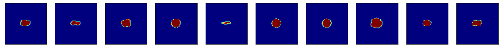
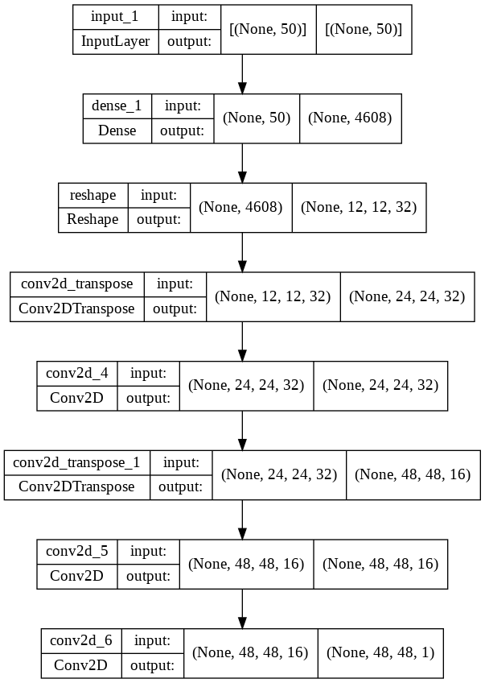
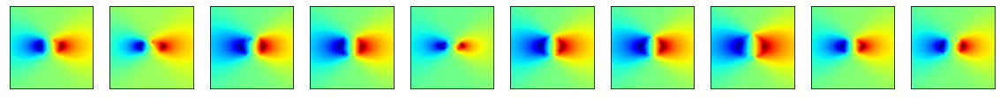
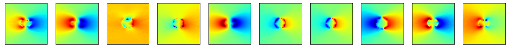
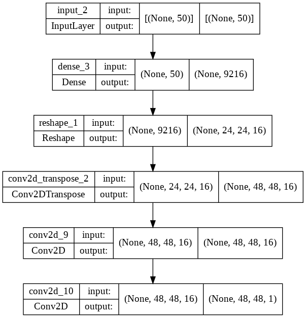
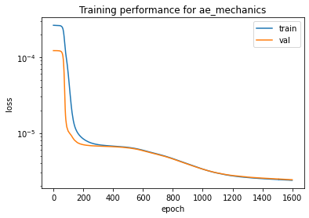

**Autoencoder for defect modeling in mechanical components (Oct. 2020)**

Objectifs de l'exercice: tester différentes dimensions de l'espace latent 50, 1 ou 450. Proposer une façon de comparer les résultats. Proposer un schéma numérique pour interpoler des images. Proposer une visualisation de l'espace latent.  


```python
import sys
print(sys.version)

import matplotlib.pyplot as plt
import numpy as np
from sklearn.manifold import TSNE, Isomap, MDS

import tensorflow as tf
from tensorflow.keras.layers import Input, Dense, Concatenate, Lambda, Flatten, Reshape
from tensorflow.keras.layers import Conv2D, Conv2DTranspose
from tensorflow.keras.models import Model, load_model
from tensorflow.keras import backend as K
from tensorflow.keras import metrics
from tensorflow.keras.datasets import mnist, fashion_mnist
from tensorflow.keras.optimizers import Adam, SGD, Nadam
from tensorflow import stack
from tensorflow.keras.losses import MeanSquaredError
import tensorflow_probability as tfp

from PIL import Image
```

    3.7.14 (default, Sep  8 2022, 00:06:44) 
    [GCC 7.5.0]


```python
class AutoEncoder_defects:
    
    def __init__(self, shape, filters=16, latent_dim=2, lr=0.001, verbose=True, callbacks=None):
        """
        Autoencoder for grey level images.

        Arguments:
            shape: shape of the input image [size_x, size_y, 1]
            filters: number of filters of the first conv layer
            latent_dim = size of the latent space (dimensions of the reduced space)
            lr: learning rate
            verbose = Boolean, if True, will print information about the models
        """
        
        self.input_shape = shape
        self.latent_dim = latent_dim
        self.verbose = verbose

        # Build the Autoencoder Model
        layer_filters = [filters, filters*2]

        # First build the Encoder Model
        inputs = Input(shape=self.input_shape, name='encoder_input')
        x = inputs
        # Stack of Conv2D blocks
        for filters in layer_filters:
            x = Conv2D(filters=filters,
                        kernel_size=3,
                        strides=1,
                        activation='relu',
                        padding='same')(x)
            x = Conv2D(filters=filters,
                        kernel_size=3,
                        strides=2,
                        activation='relu',
                        padding='same')(x)

        # Shape info needed to build Decoder Model
        last_shape = K.int_shape(x)

        # Generate the latent vector
        x = Flatten()(x)
        latent = Dense(self.latent_dim)(x)

        # Instantiate Encoder Model
        self.encoder = Model(inputs, latent)
        if self.verbose:
            self.encoder.summary()

        # Build the Decoder Model
        latent_inputs = Input(shape=(latent_dim,))
        x = Dense(last_shape[1] * last_shape[2] * last_shape[3])(latent_inputs)
        x = Reshape((last_shape[1], last_shape[2], last_shape[3]))(x)

        # Stack of Transposed Conv2D blocks
        for filters in layer_filters[::-1]:
            x = Conv2DTranspose(filters=filters,
                                kernel_size=3,
                                strides=2,
                                activation='relu',
                                padding='same')(x)
            x = Conv2D(filters=filters,
                                kernel_size=3,
                                strides=1,
                                activation='relu',
                                padding='same')(x)                            

        # The activation of the output layer is a sigmoid, so that output values
        # are in the same range as input values
        outputs = Conv2D(filters=1,
                        kernel_size=3,
                        strides=1,
                        activation='sigmoid',
                        padding='same')(x)

        # Instantiate Decoder Model
        self.decoder = Model(latent_inputs, outputs)
        if self.verbose:
            self.decoder.summary()

        # Autoencoder = Encoder + Decoder
        # Instantiate Autoencoder Model
        self.autoencoder = Model(inputs, 
                                self.decoder(self.encoder(inputs)),
                                name='autoencoder')
        if self.verbose:
            self.autoencoder.summary()
        
        ## Compile it with an appropriate loss function
        loss_ = 'mse' #loss_jaccard #'mse'
        self.autoencoder.compile(optimizer=Adam(learning_rate=lr), loss=loss_)
        self.autoencoder.summary()
        
    def fit(self, data, epochs, batch_size, validation_split=0.2):
        return self.autoencoder.fit(x=data, 
                             y=data, 
                             validation_split=validation_split,
                             shuffle=True, 
                             epochs=epochs, 
                             batch_size=batch_size)

    def predict(self, batch):
        """Autoencode batch of images"""
        return self.autoencoder.predict(batch)

    def save(self, path):
      self.autoencoder.save(path + '/my_autoencoder')
      self.encoder.save(path + '/my_encoder')
      self.decoder.save(path + '/my_decoder')

    def load_model(self, path):
      self.autoencoder = load_model(path + '/my_autoencoder')
      self.encoder = load_model(path + '/my_encoder')
      self.decoder = load_model(path + '/my_decoder')
```


```python
import os
from google.colab import drive
drive.mount('/content/drive')

path = "/content/drive/My Drive/IDSC"

os.chdir(path)
os.listdir(path)
```

    Drive already mounted at /content/drive; to attempt to forcibly remount, call drive.mount("/content/drive", force_remount=True).


    ['TensorOfData_ImageNet.ipynb',
     'TensorFormatDisplacementField.ipynb',
     'Data',
     'Decouverte_Conv2D.ipynb',
     'Exercice_Images_defects.ipynb',
     'Exercice_AE_dof_Aout_2022.ipynb',
     'Untitled0.ipynb',
     'imgs',
     'dqn_tp.ipynb',
     'ae_defects_model',
     'model.png',
     'ae_mechanics_model',
     'MMAE_defect_dof_Sept_2022.ipynb',
     'model_final_defects',
     'main.ipynb']


```python
image_2D_defects = np.load('Data/All_images.npy')
```


```python
n = 10

plt.figure(figsize=(20, 4))
for i in range(n):
    # display original
    ax = plt.subplot(1, n, i + 1)
    plt.imshow(image_2D_defects[i],cmap='jet')
#    plt.gray()
    ax.get_xaxis().set_visible(False)
    ax.get_yaxis().set_visible(False)

plt.show()
```





```python
N = image_2D_defects.shape[0]
coeff = 0.2

N_split = int(N*(1-coeff))

x = image_2D_defects

x_train = x[:N_split]
x_test = x[N_split:]
```


```python
x_train = np.expand_dims(x_train, axis = 3)
x_test = np.expand_dims(x_test, axis = 3)
im = np.expand_dims(image_2D_defects, axis = 3)
x_min= x_train.min()
x_max= x_train.max()
x_train = (x_train-x_min)/(x_max-x_min)
x_test = (x_test-x_min)/(x_max-x_min)
```


```python
x_train.shape
```


    (3200, 48, 48, 1)


```python
LATENT_DIM = 60

shape = x_train.shape[1:4]
ae_defects = AutoEncoder_defects(shape, filters=20, latent_dim=LATENT_DIM, lr=1.e-4, verbose=False)
ae_defects.load_model('ae_defects_model')
```

    Model: "autoencoder"
    _________________________________________________________________
     Layer (type)                Output Shape              Param #   
    =================================================================
     encoder_input (InputLayer)  [(None, 48, 48, 1)]       0         
                                                                     
     model_2 (Functional)        (None, 60)                371160    
                                                                     
     model_3 (Functional)        (None, 48, 48, 1)         391261    
                                                                     
    =================================================================
    Total params: 762,421
    Trainable params: 762,421
    Non-trainable params: 0
    _________________________________________________________________


    WARNING:tensorflow:No training configuration found in save file, so the model was *not* compiled. Compile it manually.
    WARNING:tensorflow:No training configuration found in save file, so the model was *not* compiled. Compile it manually.


```python
from keras.utils.vis_utils import plot_model
plot_model(ae_defects.encoder, show_shapes=True, show_layer_names=True)
```


```python
plot_model(ae_defects.decoder, show_shapes=True, show_layer_names=True)
```





```python
#epochs = 150 #150
#batch_size = 64 #128
#history = ae_defects.fit(x_train, epochs, batch_size, validation_split=0.2)
```

    Epoch 1/150
    40/40 [==============================] - 12s 19ms/step - loss: 0.2482 - val_loss: 0.2468
    Epoch 2/150
    40/40 [==============================] - 1s 14ms/step - loss: 0.2437 - val_loss: 0.2370
    Epoch 3/150
    40/40 [==============================] - 1s 13ms/step - loss: 0.1303 - val_loss: 0.0225
    Epoch 4/150
    40/40 [==============================] - 1s 13ms/step - loss: 0.0168 - val_loss: 0.0133
    Epoch 5/150
    40/40 [==============================] - 1s 13ms/step - loss: 0.0110 - val_loss: 0.0090
    Epoch 6/150
    40/40 [==============================] - 1s 13ms/step - loss: 0.0086 - val_loss: 0.0086
    Epoch 7/150
    40/40 [==============================] - 1s 14ms/step - loss: 0.0084 - val_loss: 0.0085
    Epoch 8/150
    40/40 [==============================] - 1s 14ms/step - loss: 0.0082 - val_loss: 0.0082
    Epoch 9/150
    40/40 [==============================] - 1s 14ms/step - loss: 0.0078 - val_loss: 0.0075
    Epoch 10/150
    40/40 [==============================] - 1s 14ms/step - loss: 0.0066 - val_loss: 0.0055
    Epoch 11/150
    40/40 [==============================] - 1s 13ms/step - loss: 0.0040 - val_loss: 0.0031
    Epoch 12/150
    40/40 [==============================] - 1s 14ms/step - loss: 0.0029 - val_loss: 0.0029
    Epoch 13/150
    40/40 [==============================] - 1s 13ms/step - loss: 0.0028 - val_loss: 0.0028
    Epoch 14/150
    40/40 [==============================] - 1s 14ms/step - loss: 0.0027 - val_loss: 0.0028
    Epoch 15/150
    40/40 [==============================] - 1s 14ms/step - loss: 0.0027 - val_loss: 0.0027
    Epoch 16/150
    40/40 [==============================] - 1s 13ms/step - loss: 0.0027 - val_loss: 0.0027
    Epoch 17/150
    40/40 [==============================] - 1s 14ms/step - loss: 0.0026 - val_loss: 0.0027
    Epoch 18/150
    40/40 [==============================] - 1s 14ms/step - loss: 0.0026 - val_loss: 0.0027
    Epoch 19/150
    40/40 [==============================] - 1s 13ms/step - loss: 0.0026 - val_loss: 0.0026
    Epoch 20/150
    40/40 [==============================] - 1s 13ms/step - loss: 0.0026 - val_loss: 0.0027
    Epoch 21/150
    40/40 [==============================] - 1s 14ms/step - loss: 0.0026 - val_loss: 0.0026
    Epoch 22/150
    40/40 [==============================] - 1s 13ms/step - loss: 0.0026 - val_loss: 0.0026
    Epoch 23/150
    40/40 [==============================] - 1s 13ms/step - loss: 0.0026 - val_loss: 0.0026
    Epoch 24/150
    40/40 [==============================] - 1s 14ms/step - loss: 0.0025 - val_loss: 0.0026
    Epoch 25/150
    40/40 [==============================] - 1s 14ms/step - loss: 0.0025 - val_loss: 0.0025
    Epoch 26/150
    40/40 [==============================] - 1s 14ms/step - loss: 0.0025 - val_loss: 0.0025
    Epoch 27/150
    40/40 [==============================] - 1s 14ms/step - loss: 0.0025 - val_loss: 0.0025
    Epoch 28/150
    40/40 [==============================] - 1s 13ms/step - loss: 0.0025 - val_loss: 0.0025
    Epoch 29/150
    40/40 [==============================] - 1s 14ms/step - loss: 0.0025 - val_loss: 0.0025
    Epoch 30/150
    40/40 [==============================] - 1s 13ms/step - loss: 0.0024 - val_loss: 0.0024
    Epoch 31/150
    40/40 [==============================] - 1s 14ms/step - loss: 0.0024 - val_loss: 0.0024
    Epoch 32/150
    40/40 [==============================] - 1s 14ms/step - loss: 0.0023 - val_loss: 0.0024
    Epoch 33/150
    40/40 [==============================] - 1s 14ms/step - loss: 0.0023 - val_loss: 0.0023
    Epoch 34/150
    40/40 [==============================] - 1s 14ms/step - loss: 0.0022 - val_loss: 0.0022
    Epoch 35/150
    40/40 [==============================] - 1s 14ms/step - loss: 0.0021 - val_loss: 0.0020
    Epoch 36/150
    40/40 [==============================] - 1s 13ms/step - loss: 0.0019 - val_loss: 0.0019
    Epoch 37/150
    40/40 [==============================] - 1s 14ms/step - loss: 0.0018 - val_loss: 0.0017
    Epoch 38/150
    40/40 [==============================] - 1s 14ms/step - loss: 0.0017 - val_loss: 0.0017
    Epoch 39/150
    40/40 [==============================] - 1s 14ms/step - loss: 0.0016 - val_loss: 0.0016
    Epoch 40/150
    40/40 [==============================] - 1s 13ms/step - loss: 0.0016 - val_loss: 0.0016
    Epoch 41/150
    40/40 [==============================] - 1s 14ms/step - loss: 0.0016 - val_loss: 0.0016
    Epoch 42/150
    40/40 [==============================] - 1s 14ms/step - loss: 0.0015 - val_loss: 0.0015
    Epoch 43/150
    40/40 [==============================] - 1s 14ms/step - loss: 0.0015 - val_loss: 0.0015
    Epoch 44/150
    40/40 [==============================] - 1s 14ms/step - loss: 0.0015 - val_loss: 0.0015
    Epoch 45/150
    40/40 [==============================] - 1s 13ms/step - loss: 0.0015 - val_loss: 0.0015
    Epoch 46/150
    40/40 [==============================] - 1s 14ms/step - loss: 0.0015 - val_loss: 0.0015
    Epoch 47/150
    40/40 [==============================] - 1s 13ms/step - loss: 0.0015 - val_loss: 0.0015
    Epoch 48/150
    40/40 [==============================] - 1s 14ms/step - loss: 0.0015 - val_loss: 0.0015
    Epoch 49/150
    40/40 [==============================] - 1s 14ms/step - loss: 0.0015 - val_loss: 0.0015
    Epoch 50/150
    40/40 [==============================] - 1s 14ms/step - loss: 0.0015 - val_loss: 0.0015
    Epoch 51/150
    40/40 [==============================] - 1s 14ms/step - loss: 0.0015 - val_loss: 0.0015
    Epoch 52/150
    40/40 [==============================] - 1s 13ms/step - loss: 0.0015 - val_loss: 0.0015
    Epoch 53/150
    40/40 [==============================] - 1s 13ms/step - loss: 0.0015 - val_loss: 0.0015
    Epoch 54/150
    40/40 [==============================] - 1s 14ms/step - loss: 0.0014 - val_loss: 0.0014
    Epoch 55/150
    40/40 [==============================] - 1s 14ms/step - loss: 0.0014 - val_loss: 0.0015
    Epoch 56/150
    40/40 [==============================] - 1s 14ms/step - loss: 0.0014 - val_loss: 0.0014
    Epoch 57/150
    40/40 [==============================] - 1s 14ms/step - loss: 0.0014 - val_loss: 0.0014
    Epoch 58/150
    40/40 [==============================] - 1s 14ms/step - loss: 0.0014 - val_loss: 0.0014
    Epoch 59/150
    40/40 [==============================] - 1s 13ms/step - loss: 0.0014 - val_loss: 0.0014
    Epoch 60/150
    40/40 [==============================] - 1s 13ms/step - loss: 0.0014 - val_loss: 0.0014
    Epoch 61/150
    40/40 [==============================] - 1s 14ms/step - loss: 0.0014 - val_loss: 0.0014
    Epoch 62/150
    40/40 [==============================] - 1s 14ms/step - loss: 0.0014 - val_loss: 0.0014
    Epoch 63/150
    40/40 [==============================] - 1s 13ms/step - loss: 0.0014 - val_loss: 0.0014
    Epoch 64/150
    40/40 [==============================] - 1s 14ms/step - loss: 0.0014 - val_loss: 0.0014
    Epoch 65/150
    40/40 [==============================] - 1s 14ms/step - loss: 0.0014 - val_loss: 0.0014
    Epoch 66/150
    40/40 [==============================] - 1s 14ms/step - loss: 0.0014 - val_loss: 0.0014
    Epoch 67/150
    40/40 [==============================] - 1s 14ms/step - loss: 0.0014 - val_loss: 0.0014
    Epoch 68/150
    40/40 [==============================] - 1s 14ms/step - loss: 0.0014 - val_loss: 0.0014
    Epoch 69/150
    40/40 [==============================] - 1s 13ms/step - loss: 0.0014 - val_loss: 0.0014
    Epoch 70/150
    40/40 [==============================] - 1s 14ms/step - loss: 0.0014 - val_loss: 0.0014
    Epoch 71/150
    40/40 [==============================] - 1s 13ms/step - loss: 0.0014 - val_loss: 0.0014
    Epoch 72/150
    40/40 [==============================] - 1s 14ms/step - loss: 0.0014 - val_loss: 0.0014
    Epoch 73/150
    40/40 [==============================] - 1s 14ms/step - loss: 0.0013 - val_loss: 0.0014
    Epoch 74/150
    40/40 [==============================] - 1s 14ms/step - loss: 0.0013 - val_loss: 0.0013
    Epoch 75/150
    40/40 [==============================] - 1s 13ms/step - loss: 0.0013 - val_loss: 0.0013
    Epoch 76/150
    40/40 [==============================] - 1s 14ms/step - loss: 0.0013 - val_loss: 0.0013
    Epoch 77/150
    40/40 [==============================] - 1s 14ms/step - loss: 0.0013 - val_loss: 0.0013
    Epoch 78/150
    40/40 [==============================] - 1s 14ms/step - loss: 0.0013 - val_loss: 0.0013
    Epoch 79/150
    40/40 [==============================] - 1s 13ms/step - loss: 0.0013 - val_loss: 0.0013
    Epoch 80/150
    40/40 [==============================] - 1s 13ms/step - loss: 0.0013 - val_loss: 0.0013
    Epoch 81/150
    40/40 [==============================] - 1s 14ms/step - loss: 0.0013 - val_loss: 0.0013
    Epoch 82/150
    40/40 [==============================] - 1s 13ms/step - loss: 0.0013 - val_loss: 0.0013
    Epoch 83/150
    40/40 [==============================] - 1s 13ms/step - loss: 0.0012 - val_loss: 0.0013
    Epoch 84/150
    40/40 [==============================] - 1s 14ms/step - loss: 0.0012 - val_loss: 0.0012
    Epoch 85/150
    40/40 [==============================] - 1s 14ms/step - loss: 0.0012 - val_loss: 0.0012
    Epoch 86/150
    40/40 [==============================] - 1s 14ms/step - loss: 0.0012 - val_loss: 0.0012
    Epoch 87/150
    40/40 [==============================] - 1s 14ms/step - loss: 0.0012 - val_loss: 0.0012
    Epoch 88/150
    40/40 [==============================] - 1s 14ms/step - loss: 0.0012 - val_loss: 0.0012
    Epoch 89/150
    40/40 [==============================] - 1s 14ms/step - loss: 0.0011 - val_loss: 0.0011
    Epoch 90/150
    40/40 [==============================] - 1s 14ms/step - loss: 0.0011 - val_loss: 0.0011
    Epoch 91/150
    40/40 [==============================] - 1s 13ms/step - loss: 0.0011 - val_loss: 0.0011
    Epoch 92/150
    40/40 [==============================] - 1s 14ms/step - loss: 0.0010 - val_loss: 0.0011
    Epoch 93/150
    40/40 [==============================] - 1s 13ms/step - loss: 0.0010 - val_loss: 0.0010
    Epoch 94/150
    40/40 [==============================] - 1s 14ms/step - loss: 9.9572e-04 - val_loss: 0.0010
    Epoch 95/150
    40/40 [==============================] - 1s 14ms/step - loss: 9.7412e-04 - val_loss: 9.9388e-04
    Epoch 96/150
    40/40 [==============================] - 1s 14ms/step - loss: 9.5374e-04 - val_loss: 9.7966e-04
    Epoch 97/150
    40/40 [==============================] - 1s 14ms/step - loss: 9.3662e-04 - val_loss: 9.6947e-04
    Epoch 98/150
    40/40 [==============================] - 1s 14ms/step - loss: 9.2308e-04 - val_loss: 9.3033e-04
    Epoch 99/150
    40/40 [==============================] - 1s 14ms/step - loss: 9.0633e-04 - val_loss: 9.1310e-04
    Epoch 100/150
    40/40 [==============================] - 1s 14ms/step - loss: 8.8255e-04 - val_loss: 9.0545e-04
    Epoch 101/150
    40/40 [==============================] - 1s 14ms/step - loss: 8.7061e-04 - val_loss: 8.9306e-04
    Epoch 102/150
    40/40 [==============================] - 1s 14ms/step - loss: 8.5340e-04 - val_loss: 8.7170e-04
    Epoch 103/150
    40/40 [==============================] - 1s 14ms/step - loss: 8.4658e-04 - val_loss: 8.6243e-04
    Epoch 104/150
    40/40 [==============================] - 1s 14ms/step - loss: 8.3220e-04 - val_loss: 8.5180e-04
    Epoch 105/150
    40/40 [==============================] - 1s 14ms/step - loss: 8.2673e-04 - val_loss: 8.3241e-04
    Epoch 106/150
    40/40 [==============================] - 1s 14ms/step - loss: 8.0703e-04 - val_loss: 8.3389e-04
    Epoch 107/150
    40/40 [==============================] - 1s 14ms/step - loss: 7.9647e-04 - val_loss: 8.2494e-04
    Epoch 108/150
    40/40 [==============================] - 1s 14ms/step - loss: 7.8817e-04 - val_loss: 8.0878e-04
    Epoch 109/150
    40/40 [==============================] - 1s 14ms/step - loss: 7.7512e-04 - val_loss: 8.0892e-04
    Epoch 110/150
    40/40 [==============================] - 1s 14ms/step - loss: 7.7531e-04 - val_loss: 7.9432e-04
    Epoch 111/150
    40/40 [==============================] - 1s 14ms/step - loss: 7.6066e-04 - val_loss: 7.8950e-04
    Epoch 112/150
    40/40 [==============================] - 1s 14ms/step - loss: 7.5692e-04 - val_loss: 7.7725e-04
    Epoch 113/150
    40/40 [==============================] - 1s 14ms/step - loss: 7.4349e-04 - val_loss: 7.6890e-04
    Epoch 114/150
    40/40 [==============================] - 1s 14ms/step - loss: 7.4681e-04 - val_loss: 7.7059e-04
    Epoch 115/150
    40/40 [==============================] - 1s 14ms/step - loss: 7.3649e-04 - val_loss: 7.6015e-04
    Epoch 116/150
    40/40 [==============================] - 1s 14ms/step - loss: 7.2645e-04 - val_loss: 7.5899e-04
    Epoch 117/150
    40/40 [==============================] - 1s 14ms/step - loss: 7.2798e-04 - val_loss: 7.5786e-04
    Epoch 118/150
    40/40 [==============================] - 1s 14ms/step - loss: 7.1687e-04 - val_loss: 7.6360e-04
    Epoch 119/150
    40/40 [==============================] - 1s 14ms/step - loss: 7.2065e-04 - val_loss: 7.3476e-04
    Epoch 120/150
    40/40 [==============================] - 1s 14ms/step - loss: 7.0515e-04 - val_loss: 7.4713e-04
    Epoch 121/150
    40/40 [==============================] - 1s 14ms/step - loss: 7.1148e-04 - val_loss: 7.3497e-04
    Epoch 122/150
    40/40 [==============================] - 1s 13ms/step - loss: 7.0435e-04 - val_loss: 7.2938e-04
    Epoch 123/150
    40/40 [==============================] - 1s 14ms/step - loss: 7.0427e-04 - val_loss: 7.2671e-04
    Epoch 124/150
    40/40 [==============================] - 1s 14ms/step - loss: 6.9482e-04 - val_loss: 7.2113e-04
    Epoch 125/150
    40/40 [==============================] - 1s 14ms/step - loss: 6.9326e-04 - val_loss: 7.1650e-04
    Epoch 126/150
    40/40 [==============================] - 1s 13ms/step - loss: 6.9003e-04 - val_loss: 7.1637e-04
    Epoch 127/150
    40/40 [==============================] - 1s 14ms/step - loss: 6.8154e-04 - val_loss: 7.0570e-04
    Epoch 128/150
    40/40 [==============================] - 1s 14ms/step - loss: 6.7743e-04 - val_loss: 7.0592e-04
    Epoch 129/150
    40/40 [==============================] - 1s 14ms/step - loss: 6.7299e-04 - val_loss: 7.0506e-04
    Epoch 130/150
    40/40 [==============================] - 1s 14ms/step - loss: 6.7181e-04 - val_loss: 7.0947e-04
    Epoch 131/150
    40/40 [==============================] - 1s 14ms/step - loss: 6.6946e-04 - val_loss: 7.0284e-04
    Epoch 132/150
    40/40 [==============================] - 1s 13ms/step - loss: 6.6468e-04 - val_loss: 6.9822e-04
    Epoch 133/150
    40/40 [==============================] - 1s 14ms/step - loss: 6.6118e-04 - val_loss: 6.9380e-04
    Epoch 134/150
    40/40 [==============================] - 1s 14ms/step - loss: 6.5889e-04 - val_loss: 6.9186e-04
    Epoch 135/150
    40/40 [==============================] - 1s 14ms/step - loss: 6.5842e-04 - val_loss: 6.9949e-04
    Epoch 136/150
    40/40 [==============================] - 1s 14ms/step - loss: 6.6580e-04 - val_loss: 7.1035e-04
    Epoch 137/150
    40/40 [==============================] - 1s 14ms/step - loss: 6.6238e-04 - val_loss: 6.9224e-04
    Epoch 138/150
    40/40 [==============================] - 1s 14ms/step - loss: 6.5307e-04 - val_loss: 6.9247e-04
    Epoch 139/150
    40/40 [==============================] - 1s 14ms/step - loss: 6.5090e-04 - val_loss: 6.8775e-04
    Epoch 140/150
    40/40 [==============================] - 1s 14ms/step - loss: 6.4826e-04 - val_loss: 6.9467e-04
    Epoch 141/150
    40/40 [==============================] - 1s 14ms/step - loss: 6.5065e-04 - val_loss: 6.7971e-04
    Epoch 142/150
    40/40 [==============================] - 1s 14ms/step - loss: 6.4584e-04 - val_loss: 6.9083e-04
    Epoch 143/150
    40/40 [==============================] - 1s 14ms/step - loss: 6.4688e-04 - val_loss: 6.8076e-04
    Epoch 144/150
    40/40 [==============================] - 1s 13ms/step - loss: 6.4664e-04 - val_loss: 6.8151e-04
    Epoch 145/150
    40/40 [==============================] - 1s 14ms/step - loss: 6.3797e-04 - val_loss: 6.7249e-04
    Epoch 146/150
    40/40 [==============================] - 1s 14ms/step - loss: 6.3950e-04 - val_loss: 6.9015e-04
    Epoch 147/150
    40/40 [==============================] - 1s 14ms/step - loss: 6.3520e-04 - val_loss: 6.7910e-04
    Epoch 148/150
    40/40 [==============================] - 1s 14ms/step - loss: 6.3416e-04 - val_loss: 6.7753e-04
    Epoch 149/150
    40/40 [==============================] - 1s 14ms/step - loss: 6.3617e-04 - val_loss: 6.7357e-04
    Epoch 150/150
    40/40 [==============================] - 1s 14ms/step - loss: 6.2965e-04 - val_loss: 6.6805e-04


```python
# plt.semilogy(history.epoch, history.history['loss'], label='train')
# plt.semilogy(history.epoch, history.history['val_loss'], label='val')
# plt.title('Training performance')
# plt.ylabel('loss')
# plt.xlabel('epoch')
# plt.legend()
# plt.show()
```


```python
#ae_defects.save('ae_defects_model')
```

    WARNING:tensorflow:Compiled the loaded model, but the compiled metrics have yet to be built. `model.compile_metrics` will be empty until you train or evaluate the model.
    WARNING:tensorflow:Compiled the loaded model, but the compiled metrics have yet to be built. `model.compile_metrics` will be empty until you train or evaluate the model.


Latent variables for defects


```python
Z_latent_defects_train = ae_defects.encoder(x_train)
Z_latent_defects_test = ae_defects.encoder(x_test)
```


```python
print(Z_latent_defects_train.shape)
```

    (3200, 50)


```python
class AutoEncoder_mechanics:
    
    def __init__(self, shape, filters=16, latent_dim=2, lr=0.001, verbose=True):
        """
        Autoencoder for grey level images.

        Arguments:
            shape: shape of the input image [size_x, size_y, 1]
            filters: number of filters of the first conv layer
            latent_dim = size of the latent space (dimensions of the reduced space)
            lr: learning rate
            verbose = Boolean, if True, will print information about the models
        """

        self.input_shape = shape
        self.latent_dim = latent_dim
        self.verbose = verbose

        # Build the Autoencoder Model
        layer_filters = [filters] #, filters*2] #, filters*4]

        # First build the Encoder Model
        inputs = Input(shape=self.input_shape, name='encoder_input')
        x = inputs
        # Stack of Conv2D blocks
        for filters in layer_filters:
            x = Conv2D(filters=filters,
                        kernel_size=3,
                        strides=1,
                        activation='relu',
                        padding='same')(x)
            x = Conv2D(filters=filters,
                        kernel_size=3,
                        strides=2,
                        activation='relu',
                        padding='same')(x)


        # Shape info needed to build Decoder Model
        last_shape = K.int_shape(x)

        # Generate the latent vector
        x = Flatten()(x)
        latent = Dense(self.latent_dim)(x)

        # Instantiate Encoder Model
        self.encoder = Model(inputs, latent)
        if self.verbose:
            self.encoder.summary()

        # Build the Decoder Model
        latent_inputs = Input(shape=(latent_dim,))
        x = Dense(last_shape[1] * last_shape[2] * last_shape[3])(latent_inputs)
        x = Reshape((last_shape[1], last_shape[2], last_shape[3]))(x)
        ## NOTE : LES ACTIVATIONS ONT ETE CHANGEES A TANH DANS LES 
        ## DEUX CAS. AVANT IL N'Y AVAIT AUCUN DECODAGE (TOUT ETAIT
        ## REMIS A ZERO)
        # Stack of Transposed Conv2D blocks
        for filters in layer_filters[::-1]:
            x = Conv2DTranspose(filters=filters,
                                kernel_size=3,
                                strides=2,
                                activation='linear',
                                padding='same')(x)
            x = Conv2D(filters=filters,
                                kernel_size=3,
                                strides=1,
                                activation='linear',
                                padding='same')(x)                            

        # The activation of the output layer is a sigmoid, so that output values
        # are in the same range as input values
        outputs = Conv2D(filters=1,
                        kernel_size=3,
                        strides=1,
                        activation='linear',
                        padding='same')(x)

        # Instantiate Decoder Model
        self.decoder = Model(latent_inputs, outputs)
        if self.verbose:
            self.decoder.summary()

        # Autoencoder = Encoder + Decoder
        # Instantiate Autoencoder Model
        self.autoencoder = Model(inputs, 
                                self.decoder(self.encoder(inputs)),
                                name='autoencoder')
        if self.verbose:
            self.autoencoder.summary()
        
        ## Compile it with an appropriate loss function
        loss_ = 'mse'
        self.autoencoder.compile(optimizer=Adam(learning_rate=lr), loss=loss_)
        self.autoencoder.summary()
        
    def fit(self, data, epochs, batch_size, validation_split=0.2,callbacks=None):
        return self.autoencoder.fit(x=data, 
                             y=data, 
                             validation_split=validation_split,
                             shuffle=True, 
                             epochs=epochs, 
                             batch_size=batch_size,
                             callbacks=callbacks)

    def predict(self, batch):
        """Autoencode batch of images"""
        return self.autoencoder.predict(batch)

    def save(self, path):
        self.autoencoder.save(path + '/my_autoencoder')
        self.encoder.save(path + '/my_encoder')
        self.decoder.save(path + '/my_decoder')

    def load_model(self, path):
        self.autoencoder = load_model(path + '/my_autoencoder')
        self.encoder = load_model(path + '/my_encoder')
        self.decoder = load_model(path + '/my_decoder')
```

Train for all displacement images (all direction and all loading conditions as instances)


```python
image_o = np.load('Data/All_dof_fluctuations.npy').reshape(4000,48,48,6)
image_mechanics = np.vstack((image_o[:,:,:,0],image_o[:,:,:,1],image_o[:,:,:,2],image_o[:,:,:,3],image_o[:,:,:,4],image_o[:,:,:,5]))
#image_mechanics = image_o[:,:,:,0]
image_mechanics = np.expand_dims(image_mechanics, axis = 3)
```


```python
print(image_mechanics.shape)
```

    (24000, 48, 48, 1)


```python
n = 10

plt.figure(figsize=(20, 4))
for i in range(n):
    # display original
    ax = plt.subplot(1, n, i + 1)
    plt.imshow(image_mechanics[i,:,:,0],cmap='jet')
#    plt.gray()
    ax.get_xaxis().set_visible(False)
    ax.get_yaxis().set_visible(False)

plt.show()
```





```python
x_train_mechanics = image_mechanics[:N_split]
x_test_mechanics = image_mechanics[N_split:]
del image_mechanics
```

**Scaling**


```python
x_mean_mechanics = x_train_mechanics.mean(axis=0)
x_train_mechanics = x_train_mechanics-x_mean_mechanics
x_test_mechanics = x_test_mechanics-x_mean_mechanics
x_max_mechanics= abs(x_train_mechanics).max()
x_train_mechanics = x_train_mechanics/x_max_mechanics
x_test_mechanics = x_test_mechanics/x_max_mechanics
```


```python
x_train_mechanics.shape
```


    (3200, 48, 48, 1)


```python
plt.figure(figsize=(20, 4))
for i in range(n):
    # display original
    ax = plt.subplot(1, n, i + 1)
    plt.imshow(x_train_mechanics[i,:,:,0],cmap='jet')
#    plt.gray()
    ax.get_xaxis().set_visible(False)
    ax.get_yaxis().set_visible(False)

plt.show()
```





```python
shape = x_train_mechanics.shape[1:4]
ae_mechanics = AutoEncoder_mechanics(shape, filters=32, latent_dim=LATENT_DIM, lr=2.5e-6, verbose=False)
ae_mechanics.load_model('ae_mechanics_model')
```

    Model: "autoencoder"
    _________________________________________________________________
     Layer (type)                Output Shape              Param #   
    =================================================================
     encoder_input (InputLayer)  [(None, 48, 48, 1)]       0         
                                                                     
     model_4 (Functional)        (None, 60)                1115548   
                                                                     
     model_5 (Functional)        (None, 48, 48, 1)         1143137   
                                                                     
    =================================================================
    Total params: 2,258,685
    Trainable params: 2,258,685
    Non-trainable params: 0
    _________________________________________________________________


    WARNING:tensorflow:No training configuration found in save file, so the model was *not* compiled. Compile it manually.
    WARNING:tensorflow:No training configuration found in save file, so the model was *not* compiled. Compile it manually.


```python
from keras.utils.vis_utils import plot_model
plot_model(ae_mechanics.encoder, show_shapes=True, show_layer_names=True)
```


```python
plot_model(ae_mechanics.decoder, show_shapes=True, show_layer_names=True)
```





```python
# epochs = 1600 # 120 #50 150
# batch_size = 64 #64 128
# history_mechanics = ae_mechanics.fit(x_train_mechanics, epochs, batch_size, validation_split=0.2,callbacks=[tf.keras.callbacks.EarlyStopping(patience=20,)])
```

    Epoch 1/1600
    40/40 [==============================] - 2s 19ms/step - loss: 2.6290e-04 - val_loss: 1.2187e-04
    Epoch 2/1600
    40/40 [==============================] - 1s 15ms/step - loss: 2.6285e-04 - val_loss: 1.2187e-04
    Epoch 3/1600
    40/40 [==============================] - 1s 15ms/step - loss: 2.6284e-04 - val_loss: 1.2184e-04
    Epoch 4/1600
    40/40 [==============================] - 1s 15ms/step - loss: 2.6280e-04 - val_loss: 1.2186e-04
    Epoch 5/1600
    40/40 [==============================] - 1s 15ms/step - loss: 2.6282e-04 - val_loss: 1.2188e-04
    Epoch 6/1600
    40/40 [==============================] - 1s 15ms/step - loss: 2.6279e-04 - val_loss: 1.2182e-04
    Epoch 7/1600
    40/40 [==============================] - 1s 16ms/step - loss: 2.6275e-04 - val_loss: 1.2183e-04
    Epoch 8/1600
    40/40 [==============================] - 1s 15ms/step - loss: 2.6274e-04 - val_loss: 1.2183e-04
    Epoch 9/1600
    40/40 [==============================] - 1s 15ms/step - loss: 2.6272e-04 - val_loss: 1.2186e-04
    Epoch 10/1600
    40/40 [==============================] - 1s 15ms/step - loss: 2.6271e-04 - val_loss: 1.2186e-04
    Epoch 11/1600
    40/40 [==============================] - 1s 15ms/step - loss: 2.6269e-04 - val_loss: 1.2184e-04
    Epoch 12/1600
    40/40 [==============================] - 1s 15ms/step - loss: 2.6267e-04 - val_loss: 1.2181e-04
    Epoch 13/1600
    40/40 [==============================] - 1s 15ms/step - loss: 2.6265e-04 - val_loss: 1.2183e-04
    Epoch 14/1600
    40/40 [==============================] - 1s 15ms/step - loss: 2.6262e-04 - val_loss: 1.2181e-04
    Epoch 15/1600
    40/40 [==============================] - 1s 15ms/step - loss: 2.6260e-04 - val_loss: 1.2181e-04
    Epoch 16/1600
    40/40 [==============================] - 1s 15ms/step - loss: 2.6258e-04 - val_loss: 1.2179e-04
    Epoch 17/1600
    40/40 [==============================] - 1s 15ms/step - loss: 2.6256e-04 - val_loss: 1.2178e-04
    Epoch 18/1600
    40/40 [==============================] - 1s 15ms/step - loss: 2.6253e-04 - val_loss: 1.2177e-04
    Epoch 19/1600
    40/40 [==============================] - 1s 16ms/step - loss: 2.6250e-04 - val_loss: 1.2176e-04
    Epoch 20/1600
    40/40 [==============================] - 1s 15ms/step - loss: 2.6247e-04 - val_loss: 1.2175e-04
    Epoch 21/1600
    40/40 [==============================] - 1s 16ms/step - loss: 2.6244e-04 - val_loss: 1.2175e-04
    Epoch 22/1600
    40/40 [==============================] - 1s 15ms/step - loss: 2.6241e-04 - val_loss: 1.2173e-04
    Epoch 23/1600
    40/40 [==============================] - 1s 16ms/step - loss: 2.6237e-04 - val_loss: 1.2172e-04
    Epoch 24/1600
    40/40 [==============================] - 1s 15ms/step - loss: 2.6233e-04 - val_loss: 1.2172e-04
    Epoch 25/1600
    40/40 [==============================] - 1s 16ms/step - loss: 2.6229e-04 - val_loss: 1.2171e-04
    Epoch 26/1600
    40/40 [==============================] - 1s 15ms/step - loss: 2.6225e-04 - val_loss: 1.2169e-04
    Epoch 27/1600
    40/40 [==============================] - 1s 15ms/step - loss: 2.6220e-04 - val_loss: 1.2167e-04
    Epoch 28/1600
    40/40 [==============================] - 1s 15ms/step - loss: 2.6215e-04 - val_loss: 1.2163e-04
    Epoch 29/1600
    40/40 [==============================] - 1s 15ms/step - loss: 2.6212e-04 - val_loss: 1.2165e-04
    Epoch 30/1600
    40/40 [==============================] - 1s 16ms/step - loss: 2.6204e-04 - val_loss: 1.2161e-04
    Epoch 31/1600
    40/40 [==============================] - 1s 15ms/step - loss: 2.6197e-04 - val_loss: 1.2159e-04
    Epoch 32/1600
    40/40 [==============================] - 1s 15ms/step - loss: 2.6190e-04 - val_loss: 1.2155e-04
    Epoch 33/1600
    40/40 [==============================] - 1s 15ms/step - loss: 2.6182e-04 - val_loss: 1.2152e-04
    Epoch 34/1600
    40/40 [==============================] - 1s 16ms/step - loss: 2.6174e-04 - val_loss: 1.2146e-04
    Epoch 35/1600
    40/40 [==============================] - 1s 16ms/step - loss: 2.6163e-04 - val_loss: 1.2143e-04
    Epoch 36/1600
    40/40 [==============================] - 1s 15ms/step - loss: 2.6154e-04 - val_loss: 1.2142e-04
    Epoch 37/1600
    40/40 [==============================] - 1s 15ms/step - loss: 2.6143e-04 - val_loss: 1.2133e-04
    Epoch 38/1600
    40/40 [==============================] - 1s 15ms/step - loss: 2.6130e-04 - val_loss: 1.2127e-04
    Epoch 39/1600
    40/40 [==============================] - 1s 15ms/step - loss: 2.6115e-04 - val_loss: 1.2125e-04
    Epoch 40/1600
    40/40 [==============================] - 1s 16ms/step - loss: 2.6101e-04 - val_loss: 1.2116e-04
    Epoch 41/1600
    40/40 [==============================] - 1s 15ms/step - loss: 2.6084e-04 - val_loss: 1.2106e-04
    Epoch 42/1600
    40/40 [==============================] - 1s 16ms/step - loss: 2.6066e-04 - val_loss: 1.2094e-04
    Epoch 43/1600
    40/40 [==============================] - 1s 16ms/step - loss: 2.6050e-04 - val_loss: 1.2088e-04
    Epoch 44/1600
    40/40 [==============================] - 1s 15ms/step - loss: 2.6023e-04 - val_loss: 1.2073e-04
    Epoch 45/1600
    40/40 [==============================] - 1s 15ms/step - loss: 2.5996e-04 - val_loss: 1.2064e-04
    Epoch 46/1600
    40/40 [==============================] - 1s 15ms/step - loss: 2.5968e-04 - val_loss: 1.2047e-04
    Epoch 47/1600
    40/40 [==============================] - 1s 15ms/step - loss: 2.5937e-04 - val_loss: 1.2028e-04
    Epoch 48/1600
    40/40 [==============================] - 1s 15ms/step - loss: 2.5900e-04 - val_loss: 1.2006e-04
    Epoch 49/1600
    40/40 [==============================] - 1s 15ms/step - loss: 2.5860e-04 - val_loss: 1.1983e-04
    Epoch 50/1600
    40/40 [==============================] - 1s 15ms/step - loss: 2.5815e-04 - val_loss: 1.1956e-04
    Epoch 51/1600
    40/40 [==============================] - 1s 15ms/step - loss: 2.5763e-04 - val_loss: 1.1923e-04
    Epoch 52/1600
    40/40 [==============================] - 1s 16ms/step - loss: 2.5705e-04 - val_loss: 1.1885e-04
    Epoch 53/1600
    40/40 [==============================] - 1s 16ms/step - loss: 2.5637e-04 - val_loss: 1.1844e-04
    Epoch 54/1600
    40/40 [==============================] - 1s 16ms/step - loss: 2.5571e-04 - val_loss: 1.1795e-04
    Epoch 55/1600
    40/40 [==============================] - 1s 15ms/step - loss: 2.5476e-04 - val_loss: 1.1735e-04
    Epoch 56/1600
    40/40 [==============================] - 1s 16ms/step - loss: 2.5377e-04 - val_loss: 1.1667e-04
    Epoch 57/1600
    40/40 [==============================] - 1s 16ms/step - loss: 2.5265e-04 - val_loss: 1.1587e-04
    Epoch 58/1600
    40/40 [==============================] - 1s 15ms/step - loss: 2.5133e-04 - val_loss: 1.1488e-04
    Epoch 59/1600
    40/40 [==============================] - 1s 16ms/step - loss: 2.4981e-04 - val_loss: 1.1377e-04
    Epoch 60/1600
    40/40 [==============================] - 1s 16ms/step - loss: 2.4808e-04 - val_loss: 1.1244e-04
    Epoch 61/1600
    40/40 [==============================] - 1s 16ms/step - loss: 2.4602e-04 - val_loss: 1.1086e-04
    Epoch 62/1600
    40/40 [==============================] - 1s 16ms/step - loss: 2.4366e-04 - val_loss: 1.0902e-04
    Epoch 63/1600
    40/40 [==============================] - 1s 15ms/step - loss: 2.4097e-04 - val_loss: 1.0678e-04
    Epoch 64/1600
    40/40 [==============================] - 1s 16ms/step - loss: 2.3775e-04 - val_loss: 1.0420e-04
    Epoch 65/1600
    40/40 [==============================] - 1s 15ms/step - loss: 2.3414e-04 - val_loss: 1.0115e-04
    Epoch 66/1600
    40/40 [==============================] - 1s 15ms/step - loss: 2.2981e-04 - val_loss: 9.7613e-05
    Epoch 67/1600
    40/40 [==============================] - 1s 15ms/step - loss: 2.2487e-04 - val_loss: 9.3495e-05
    Epoch 68/1600
    40/40 [==============================] - 1s 15ms/step - loss: 2.1942e-04 - val_loss: 8.8710e-05
    Epoch 69/1600
    40/40 [==============================] - 1s 16ms/step - loss: 2.1300e-04 - val_loss: 8.3337e-05
    Epoch 70/1600
    40/40 [==============================] - 1s 16ms/step - loss: 2.0599e-04 - val_loss: 7.7350e-05
    Epoch 71/1600
    40/40 [==============================] - 1s 15ms/step - loss: 1.9824e-04 - val_loss: 7.0861e-05
    Epoch 72/1600
    40/40 [==============================] - 1s 16ms/step - loss: 1.8976e-04 - val_loss: 6.3981e-05
    Epoch 73/1600
    40/40 [==============================] - 1s 15ms/step - loss: 1.8072e-04 - val_loss: 5.6814e-05
    Epoch 74/1600
    40/40 [==============================] - 1s 15ms/step - loss: 1.7172e-04 - val_loss: 4.9461e-05
    Epoch 75/1600
    40/40 [==============================] - 1s 15ms/step - loss: 1.6225e-04 - val_loss: 4.2664e-05
    Epoch 76/1600
    40/40 [==============================] - 1s 15ms/step - loss: 1.5397e-04 - val_loss: 3.6289e-05
    Epoch 77/1600
    40/40 [==============================] - 1s 15ms/step - loss: 1.4543e-04 - val_loss: 3.0888e-05
    Epoch 78/1600
    40/40 [==============================] - 1s 15ms/step - loss: 1.3811e-04 - val_loss: 2.6522e-05
    Epoch 79/1600
    40/40 [==============================] - 1s 15ms/step - loss: 1.3191e-04 - val_loss: 2.2957e-05
    Epoch 80/1600
    40/40 [==============================] - 1s 15ms/step - loss: 1.2618e-04 - val_loss: 2.0437e-05
    Epoch 81/1600
    40/40 [==============================] - 1s 15ms/step - loss: 1.2151e-04 - val_loss: 1.8364e-05
    Epoch 82/1600
    40/40 [==============================] - 1s 15ms/step - loss: 1.1712e-04 - val_loss: 1.6993e-05
    Epoch 83/1600
    40/40 [==============================] - 1s 15ms/step - loss: 1.1342e-04 - val_loss: 1.5845e-05
    Epoch 84/1600
    40/40 [==============================] - 1s 15ms/step - loss: 1.0977e-04 - val_loss: 1.5020e-05
    Epoch 85/1600
    40/40 [==============================] - 1s 15ms/step - loss: 1.0634e-04 - val_loss: 1.4393e-05
    Epoch 86/1600
    40/40 [==============================] - 1s 15ms/step - loss: 1.0308e-04 - val_loss: 1.3866e-05
    Epoch 87/1600
    40/40 [==============================] - 1s 15ms/step - loss: 9.9945e-05 - val_loss: 1.3395e-05
    Epoch 88/1600
    40/40 [==============================] - 1s 16ms/step - loss: 9.6713e-05 - val_loss: 1.2961e-05
    Epoch 89/1600
    40/40 [==============================] - 1s 16ms/step - loss: 9.3598e-05 - val_loss: 1.2589e-05
    Epoch 90/1600
    40/40 [==============================] - 1s 15ms/step - loss: 9.0410e-05 - val_loss: 1.2380e-05
    Epoch 91/1600
    40/40 [==============================] - 1s 15ms/step - loss: 8.7306e-05 - val_loss: 1.1903e-05
    Epoch 92/1600
    40/40 [==============================] - 1s 15ms/step - loss: 8.4258e-05 - val_loss: 1.1839e-05
    Epoch 93/1600
    40/40 [==============================] - 1s 15ms/step - loss: 8.1097e-05 - val_loss: 1.1594e-05
    Epoch 94/1600
    40/40 [==============================] - 1s 15ms/step - loss: 7.8062e-05 - val_loss: 1.1429e-05
    Epoch 95/1600
    40/40 [==============================] - 1s 15ms/step - loss: 7.5032e-05 - val_loss: 1.1269e-05
    Epoch 96/1600
    40/40 [==============================] - 1s 15ms/step - loss: 7.2561e-05 - val_loss: 1.1047e-05
    Epoch 97/1600
    40/40 [==============================] - 1s 15ms/step - loss: 6.9143e-05 - val_loss: 1.0885e-05
    Epoch 98/1600
    40/40 [==============================] - 1s 15ms/step - loss: 6.6207e-05 - val_loss: 1.0812e-05
    Epoch 99/1600
    40/40 [==============================] - 1s 16ms/step - loss: 6.3387e-05 - val_loss: 1.0732e-05
    Epoch 100/1600
    40/40 [==============================] - 1s 15ms/step - loss: 6.0778e-05 - val_loss: 1.0565e-05
    Epoch 101/1600
    40/40 [==============================] - 1s 15ms/step - loss: 5.7888e-05 - val_loss: 1.0516e-05
    Epoch 102/1600
    40/40 [==============================] - 1s 15ms/step - loss: 5.5255e-05 - val_loss: 1.0450e-05
    Epoch 103/1600
    40/40 [==============================] - 1s 15ms/step - loss: 5.2758e-05 - val_loss: 1.0362e-05
    Epoch 104/1600
    40/40 [==============================] - 1s 15ms/step - loss: 5.0486e-05 - val_loss: 1.0277e-05
    Epoch 105/1600
    40/40 [==============================] - 1s 15ms/step - loss: 4.7837e-05 - val_loss: 1.0225e-05
    Epoch 106/1600
    40/40 [==============================] - 1s 15ms/step - loss: 4.5660e-05 - val_loss: 1.0155e-05
    Epoch 107/1600
    40/40 [==============================] - 1s 15ms/step - loss: 4.3360e-05 - val_loss: 1.0096e-05
    Epoch 108/1600
    40/40 [==============================] - 1s 15ms/step - loss: 4.1247e-05 - val_loss: 1.0041e-05
    Epoch 109/1600
    40/40 [==============================] - 1s 15ms/step - loss: 3.9509e-05 - val_loss: 9.9908e-06
    Epoch 110/1600
    40/40 [==============================] - 1s 15ms/step - loss: 3.7326e-05 - val_loss: 9.9422e-06
    Epoch 111/1600
    40/40 [==============================] - 1s 15ms/step - loss: 3.5592e-05 - val_loss: 9.8820e-06
    Epoch 112/1600
    40/40 [==============================] - 1s 15ms/step - loss: 3.3810e-05 - val_loss: 9.8288e-06
    Epoch 113/1600
    40/40 [==============================] - 1s 16ms/step - loss: 3.2228e-05 - val_loss: 9.7704e-06
    Epoch 114/1600
    40/40 [==============================] - 1s 15ms/step - loss: 3.0648e-05 - val_loss: 9.7076e-06
    Epoch 115/1600
    40/40 [==============================] - 1s 15ms/step - loss: 2.9213e-05 - val_loss: 9.6491e-06
    Epoch 116/1600
    40/40 [==============================] - 1s 15ms/step - loss: 2.7895e-05 - val_loss: 9.5869e-06
    Epoch 117/1600
    40/40 [==============================] - 1s 15ms/step - loss: 2.6582e-05 - val_loss: 9.4911e-06
    Epoch 118/1600
    40/40 [==============================] - 1s 15ms/step - loss: 2.5488e-05 - val_loss: 9.4670e-06
    Epoch 119/1600
    40/40 [==============================] - 1s 15ms/step - loss: 2.4390e-05 - val_loss: 9.4124e-06
    Epoch 120/1600
    40/40 [==============================] - 1s 15ms/step - loss: 2.3259e-05 - val_loss: 9.3449e-06
    Epoch 121/1600
    40/40 [==============================] - 1s 15ms/step - loss: 2.2316e-05 - val_loss: 9.2698e-06
    Epoch 122/1600
    40/40 [==============================] - 1s 15ms/step - loss: 2.1516e-05 - val_loss: 9.2114e-06
    Epoch 123/1600
    40/40 [==============================] - 1s 15ms/step - loss: 2.0604e-05 - val_loss: 9.1386e-06
    Epoch 124/1600
    40/40 [==============================] - 1s 15ms/step - loss: 1.9847e-05 - val_loss: 9.0710e-06
    Epoch 125/1600
    40/40 [==============================] - 1s 15ms/step - loss: 1.9133e-05 - val_loss: 9.0009e-06
    Epoch 126/1600
    40/40 [==============================] - 1s 15ms/step - loss: 1.8482e-05 - val_loss: 8.8993e-06
    Epoch 127/1600
    40/40 [==============================] - 1s 15ms/step - loss: 1.7920e-05 - val_loss: 8.8753e-06
    Epoch 128/1600
    40/40 [==============================] - 1s 15ms/step - loss: 1.7322e-05 - val_loss: 8.8101e-06
    Epoch 129/1600
    40/40 [==============================] - 1s 15ms/step - loss: 1.6781e-05 - val_loss: 8.7406e-06
    Epoch 130/1600
    40/40 [==============================] - 1s 16ms/step - loss: 1.6310e-05 - val_loss: 8.6836e-06
    Epoch 131/1600
    40/40 [==============================] - 1s 15ms/step - loss: 1.5856e-05 - val_loss: 8.6326e-06
    Epoch 132/1600
    40/40 [==============================] - 1s 15ms/step - loss: 1.5445e-05 - val_loss: 8.5661e-06
    Epoch 133/1600
    40/40 [==============================] - 1s 15ms/step - loss: 1.5058e-05 - val_loss: 8.5069e-06
    Epoch 134/1600
    40/40 [==============================] - 1s 15ms/step - loss: 1.4703e-05 - val_loss: 8.4511e-06
    Epoch 135/1600
    40/40 [==============================] - 1s 15ms/step - loss: 1.4369e-05 - val_loss: 8.4028e-06
    Epoch 136/1600
    40/40 [==============================] - 1s 15ms/step - loss: 1.4071e-05 - val_loss: 8.3500e-06
    Epoch 137/1600
    40/40 [==============================] - 1s 15ms/step - loss: 1.3769e-05 - val_loss: 8.2955e-06
    Epoch 138/1600
    40/40 [==============================] - 1s 15ms/step - loss: 1.3501e-05 - val_loss: 8.2481e-06
    Epoch 139/1600
    40/40 [==============================] - 1s 15ms/step - loss: 1.3252e-05 - val_loss: 8.2086e-06
    Epoch 140/1600
    40/40 [==============================] - 1s 15ms/step - loss: 1.3022e-05 - val_loss: 8.1551e-06
    Epoch 141/1600
    40/40 [==============================] - 1s 15ms/step - loss: 1.2794e-05 - val_loss: 8.1078e-06
    Epoch 142/1600
    40/40 [==============================] - 1s 15ms/step - loss: 1.2589e-05 - val_loss: 8.0622e-06
    Epoch 143/1600
    40/40 [==============================] - 1s 15ms/step - loss: 1.2397e-05 - val_loss: 8.0293e-06
    Epoch 144/1600
    40/40 [==============================] - 1s 15ms/step - loss: 1.2214e-05 - val_loss: 7.9837e-06
    Epoch 145/1600
    40/40 [==============================] - 1s 15ms/step - loss: 1.2084e-05 - val_loss: 7.9494e-06
    Epoch 146/1600
    40/40 [==============================] - 1s 15ms/step - loss: 1.1880e-05 - val_loss: 7.9121e-06
    Epoch 147/1600
    40/40 [==============================] - 1s 15ms/step - loss: 1.1723e-05 - val_loss: 7.8772e-06
    Epoch 148/1600
    40/40 [==============================] - 1s 15ms/step - loss: 1.1591e-05 - val_loss: 7.8420e-06
    Epoch 149/1600
    40/40 [==============================] - 1s 15ms/step - loss: 1.1445e-05 - val_loss: 7.8118e-06
    Epoch 150/1600
    40/40 [==============================] - 1s 15ms/step - loss: 1.1316e-05 - val_loss: 7.7755e-06
    Epoch 151/1600
    40/40 [==============================] - 1s 15ms/step - loss: 1.1192e-05 - val_loss: 7.7451e-06
    Epoch 152/1600
    40/40 [==============================] - 1s 15ms/step - loss: 1.1078e-05 - val_loss: 7.7165e-06
    Epoch 153/1600
    40/40 [==============================] - 1s 16ms/step - loss: 1.0968e-05 - val_loss: 7.6904e-06
    Epoch 154/1600
    40/40 [==============================] - 1s 16ms/step - loss: 1.0856e-05 - val_loss: 7.6596e-06
    Epoch 155/1600
    40/40 [==============================] - 1s 16ms/step - loss: 1.0752e-05 - val_loss: 7.6304e-06
    Epoch 156/1600
    40/40 [==============================] - 1s 15ms/step - loss: 1.0658e-05 - val_loss: 7.6075e-06
    Epoch 157/1600
    40/40 [==============================] - 1s 15ms/step - loss: 1.0562e-05 - val_loss: 7.5841e-06
    Epoch 158/1600
    40/40 [==============================] - 1s 15ms/step - loss: 1.0474e-05 - val_loss: 7.5600e-06
    Epoch 159/1600
    40/40 [==============================] - 1s 15ms/step - loss: 1.0386e-05 - val_loss: 7.5366e-06
    Epoch 160/1600
    40/40 [==============================] - 1s 15ms/step - loss: 1.0305e-05 - val_loss: 7.5145e-06
    Epoch 161/1600
    40/40 [==============================] - 1s 15ms/step - loss: 1.0234e-05 - val_loss: 7.4923e-06
    Epoch 162/1600
    40/40 [==============================] - 1s 15ms/step - loss: 1.0147e-05 - val_loss: 7.4700e-06
    Epoch 163/1600
    40/40 [==============================] - 1s 15ms/step - loss: 1.0075e-05 - val_loss: 7.4503e-06
    Epoch 164/1600
    40/40 [==============================] - 1s 16ms/step - loss: 1.0005e-05 - val_loss: 7.4324e-06
    Epoch 165/1600
    40/40 [==============================] - 1s 16ms/step - loss: 9.9328e-06 - val_loss: 7.4129e-06
    Epoch 166/1600
    40/40 [==============================] - 1s 15ms/step - loss: 9.8674e-06 - val_loss: 7.3974e-06
    Epoch 167/1600
    40/40 [==============================] - 1s 15ms/step - loss: 9.8050e-06 - val_loss: 7.3787e-06
    Epoch 168/1600
    40/40 [==============================] - 1s 15ms/step - loss: 9.7408e-06 - val_loss: 7.3607e-06
    Epoch 169/1600
    40/40 [==============================] - 1s 16ms/step - loss: 9.6813e-06 - val_loss: 7.3449e-06
    Epoch 170/1600
    40/40 [==============================] - 1s 16ms/step - loss: 9.6219e-06 - val_loss: 7.3280e-06
    Epoch 171/1600
    40/40 [==============================] - 1s 15ms/step - loss: 9.5656e-06 - val_loss: 7.3141e-06
    Epoch 172/1600
    40/40 [==============================] - 1s 15ms/step - loss: 9.5097e-06 - val_loss: 7.2977e-06
    Epoch 173/1600
    40/40 [==============================] - 1s 15ms/step - loss: 9.4577e-06 - val_loss: 7.2853e-06
    Epoch 174/1600
    40/40 [==============================] - 1s 15ms/step - loss: 9.4101e-06 - val_loss: 7.2723e-06
    Epoch 175/1600
    40/40 [==============================] - 1s 15ms/step - loss: 9.3534e-06 - val_loss: 7.2588e-06
    Epoch 176/1600
    40/40 [==============================] - 1s 15ms/step - loss: 9.3046e-06 - val_loss: 7.2457e-06
    Epoch 177/1600
    40/40 [==============================] - 1s 16ms/step - loss: 9.2581e-06 - val_loss: 7.2312e-06
    Epoch 178/1600
    40/40 [==============================] - 1s 15ms/step - loss: 9.2355e-06 - val_loss: 7.2217e-06
    Epoch 179/1600
    40/40 [==============================] - 1s 16ms/step - loss: 9.1637e-06 - val_loss: 7.2079e-06
    Epoch 180/1600
    40/40 [==============================] - 1s 15ms/step - loss: 9.1190e-06 - val_loss: 7.1967e-06
    Epoch 181/1600
    40/40 [==============================] - 1s 15ms/step - loss: 9.0763e-06 - val_loss: 7.1859e-06
    Epoch 182/1600
    40/40 [==============================] - 1s 16ms/step - loss: 9.0327e-06 - val_loss: 7.1757e-06
    Epoch 183/1600
    40/40 [==============================] - 1s 15ms/step - loss: 8.9915e-06 - val_loss: 7.1664e-06
    Epoch 184/1600
    40/40 [==============================] - 1s 15ms/step - loss: 8.9526e-06 - val_loss: 7.1545e-06
    Epoch 185/1600
    40/40 [==============================] - 1s 15ms/step - loss: 8.9115e-06 - val_loss: 7.1438e-06
    Epoch 186/1600
    40/40 [==============================] - 1s 15ms/step - loss: 8.8814e-06 - val_loss: 7.1352e-06
    Epoch 187/1600
    40/40 [==============================] - 1s 15ms/step - loss: 8.8340e-06 - val_loss: 7.1256e-06
    Epoch 188/1600
    40/40 [==============================] - 1s 15ms/step - loss: 8.7975e-06 - val_loss: 7.1162e-06
    Epoch 189/1600
    40/40 [==============================] - 1s 15ms/step - loss: 8.7599e-06 - val_loss: 7.1073e-06
    Epoch 190/1600
    40/40 [==============================] - 1s 15ms/step - loss: 8.7247e-06 - val_loss: 7.0992e-06
    Epoch 191/1600
    40/40 [==============================] - 1s 15ms/step - loss: 8.6901e-06 - val_loss: 7.0904e-06
    Epoch 192/1600
    40/40 [==============================] - 1s 15ms/step - loss: 8.6713e-06 - val_loss: 7.0822e-06
    Epoch 193/1600
    40/40 [==============================] - 1s 15ms/step - loss: 8.6219e-06 - val_loss: 7.0739e-06
    Epoch 194/1600
    40/40 [==============================] - 1s 15ms/step - loss: 8.5898e-06 - val_loss: 7.0655e-06
    Epoch 195/1600
    40/40 [==============================] - 1s 16ms/step - loss: 8.5666e-06 - val_loss: 7.0582e-06
    Epoch 196/1600
    40/40 [==============================] - 1s 16ms/step - loss: 8.5252e-06 - val_loss: 7.0513e-06
    Epoch 197/1600
    40/40 [==============================] - 1s 16ms/step - loss: 8.4944e-06 - val_loss: 7.0435e-06
    Epoch 198/1600
    40/40 [==============================] - 1s 16ms/step - loss: 8.4640e-06 - val_loss: 7.0361e-06
    Epoch 199/1600
    40/40 [==============================] - 1s 17ms/step - loss: 8.4343e-06 - val_loss: 7.0281e-06
    Epoch 200/1600
    40/40 [==============================] - 1s 16ms/step - loss: 8.4087e-06 - val_loss: 7.0219e-06
    Epoch 201/1600
    40/40 [==============================] - 1s 16ms/step - loss: 8.3762e-06 - val_loss: 7.0157e-06
    Epoch 202/1600
    40/40 [==============================] - 1s 17ms/step - loss: 8.3480e-06 - val_loss: 7.0095e-06
    Epoch 203/1600
    40/40 [==============================] - 1s 17ms/step - loss: 8.3199e-06 - val_loss: 7.0029e-06
    Epoch 204/1600
    40/40 [==============================] - 1s 15ms/step - loss: 8.2931e-06 - val_loss: 6.9953e-06
    Epoch 205/1600
    40/40 [==============================] - 1s 15ms/step - loss: 8.2691e-06 - val_loss: 6.9915e-06
    Epoch 206/1600
    40/40 [==============================] - 1s 15ms/step - loss: 8.2419e-06 - val_loss: 6.9851e-06
    Epoch 207/1600
    40/40 [==============================] - 1s 16ms/step - loss: 8.2159e-06 - val_loss: 6.9788e-06
    Epoch 208/1600
    40/40 [==============================] - 1s 15ms/step - loss: 8.1912e-06 - val_loss: 6.9726e-06
    Epoch 209/1600
    40/40 [==============================] - 1s 15ms/step - loss: 8.1649e-06 - val_loss: 6.9669e-06
    Epoch 210/1600
    40/40 [==============================] - 1s 16ms/step - loss: 8.1434e-06 - val_loss: 6.9618e-06
    Epoch 211/1600
    40/40 [==============================] - 1s 16ms/step - loss: 8.1163e-06 - val_loss: 6.9571e-06
    Epoch 212/1600
    40/40 [==============================] - 1s 16ms/step - loss: 8.0940e-06 - val_loss: 6.9517e-06
    Epoch 213/1600
    40/40 [==============================] - 1s 16ms/step - loss: 8.0697e-06 - val_loss: 6.9457e-06
    Epoch 214/1600
    40/40 [==============================] - 1s 15ms/step - loss: 8.0474e-06 - val_loss: 6.9408e-06
    Epoch 215/1600
    40/40 [==============================] - 1s 16ms/step - loss: 8.0273e-06 - val_loss: 6.9373e-06
    Epoch 216/1600
    40/40 [==============================] - 1s 15ms/step - loss: 8.0033e-06 - val_loss: 6.9319e-06
    Epoch 217/1600
    40/40 [==============================] - 1s 15ms/step - loss: 7.9819e-06 - val_loss: 6.9266e-06
    Epoch 218/1600
    40/40 [==============================] - 1s 15ms/step - loss: 7.9619e-06 - val_loss: 6.9228e-06
    Epoch 219/1600
    40/40 [==============================] - 1s 15ms/step - loss: 7.9393e-06 - val_loss: 6.9204e-06
    Epoch 220/1600
    40/40 [==============================] - 1s 15ms/step - loss: 7.9192e-06 - val_loss: 6.9128e-06
    Epoch 221/1600
    40/40 [==============================] - 1s 16ms/step - loss: 7.8988e-06 - val_loss: 6.9083e-06
    Epoch 222/1600
    40/40 [==============================] - 1s 16ms/step - loss: 7.8850e-06 - val_loss: 6.9048e-06
    Epoch 223/1600
    40/40 [==============================] - 1s 15ms/step - loss: 7.8589e-06 - val_loss: 6.9012e-06
    Epoch 224/1600
    40/40 [==============================] - 1s 15ms/step - loss: 7.8397e-06 - val_loss: 6.8972e-06
    Epoch 225/1600
    40/40 [==============================] - 1s 15ms/step - loss: 7.8206e-06 - val_loss: 6.8924e-06
    Epoch 226/1600
    40/40 [==============================] - 1s 15ms/step - loss: 7.8061e-06 - val_loss: 6.8888e-06
    Epoch 227/1600
    40/40 [==============================] - 1s 15ms/step - loss: 7.7841e-06 - val_loss: 6.8865e-06
    Epoch 228/1600
    40/40 [==============================] - 1s 15ms/step - loss: 7.7663e-06 - val_loss: 6.8811e-06
    Epoch 229/1600
    40/40 [==============================] - 1s 15ms/step - loss: 7.7493e-06 - val_loss: 6.8783e-06
    Epoch 230/1600
    40/40 [==============================] - 1s 15ms/step - loss: 7.7319e-06 - val_loss: 6.8735e-06
    Epoch 231/1600
    40/40 [==============================] - 1s 15ms/step - loss: 7.7172e-06 - val_loss: 6.8703e-06
    Epoch 232/1600
    40/40 [==============================] - 1s 15ms/step - loss: 7.6980e-06 - val_loss: 6.8681e-06
    Epoch 233/1600
    40/40 [==============================] - 1s 15ms/step - loss: 7.6823e-06 - val_loss: 6.8640e-06
    Epoch 234/1600
    40/40 [==============================] - 1s 15ms/step - loss: 7.6692e-06 - val_loss: 6.8606e-06
    Epoch 235/1600
    40/40 [==============================] - 1s 15ms/step - loss: 7.6497e-06 - val_loss: 6.8574e-06
    Epoch 236/1600
    40/40 [==============================] - 1s 15ms/step - loss: 7.6343e-06 - val_loss: 6.8537e-06
    Epoch 237/1600
    40/40 [==============================] - 1s 15ms/step - loss: 7.6188e-06 - val_loss: 6.8511e-06
    Epoch 238/1600
    40/40 [==============================] - 1s 15ms/step - loss: 7.6044e-06 - val_loss: 6.8465e-06
    Epoch 239/1600
    40/40 [==============================] - 1s 15ms/step - loss: 7.5900e-06 - val_loss: 6.8436e-06
    Epoch 240/1600
    40/40 [==============================] - 1s 15ms/step - loss: 7.5742e-06 - val_loss: 6.8421e-06
    Epoch 241/1600
    40/40 [==============================] - 1s 15ms/step - loss: 7.5599e-06 - val_loss: 6.8413e-06
    Epoch 242/1600
    40/40 [==============================] - 1s 15ms/step - loss: 7.5457e-06 - val_loss: 6.8360e-06
    Epoch 243/1600
    40/40 [==============================] - 1s 15ms/step - loss: 7.5323e-06 - val_loss: 6.8350e-06
    Epoch 244/1600
    40/40 [==============================] - 1s 16ms/step - loss: 7.5224e-06 - val_loss: 6.8306e-06
    Epoch 245/1600
    40/40 [==============================] - 1s 15ms/step - loss: 7.5048e-06 - val_loss: 6.8265e-06
    Epoch 246/1600
    40/40 [==============================] - 1s 15ms/step - loss: 7.4950e-06 - val_loss: 6.8264e-06
    Epoch 247/1600
    40/40 [==============================] - 1s 15ms/step - loss: 7.4787e-06 - val_loss: 6.8243e-06
    Epoch 248/1600
    40/40 [==============================] - 1s 15ms/step - loss: 7.4670e-06 - val_loss: 6.8209e-06
    Epoch 249/1600
    40/40 [==============================] - 1s 15ms/step - loss: 7.4558e-06 - val_loss: 6.8182e-06
    Epoch 250/1600
    40/40 [==============================] - 1s 16ms/step - loss: 7.4413e-06 - val_loss: 6.8152e-06
    Epoch 251/1600
    40/40 [==============================] - 1s 16ms/step - loss: 7.4290e-06 - val_loss: 6.8138e-06
    Epoch 252/1600
    40/40 [==============================] - 1s 15ms/step - loss: 7.4196e-06 - val_loss: 6.8113e-06
    Epoch 253/1600
    40/40 [==============================] - 1s 16ms/step - loss: 7.4063e-06 - val_loss: 6.8110e-06
    Epoch 254/1600
    40/40 [==============================] - 1s 15ms/step - loss: 7.3952e-06 - val_loss: 6.8060e-06
    Epoch 255/1600
    40/40 [==============================] - 1s 15ms/step - loss: 7.3834e-06 - val_loss: 6.8045e-06
    Epoch 256/1600
    40/40 [==============================] - 1s 15ms/step - loss: 7.3723e-06 - val_loss: 6.8021e-06
    Epoch 257/1600
    40/40 [==============================] - 1s 15ms/step - loss: 7.3623e-06 - val_loss: 6.7996e-06
    Epoch 258/1600
    40/40 [==============================] - 1s 15ms/step - loss: 7.3512e-06 - val_loss: 6.7961e-06
    Epoch 259/1600
    40/40 [==============================] - 1s 15ms/step - loss: 7.3400e-06 - val_loss: 6.7953e-06
    Epoch 260/1600
    40/40 [==============================] - 1s 16ms/step - loss: 7.3301e-06 - val_loss: 6.7936e-06
    Epoch 261/1600
    40/40 [==============================] - 1s 16ms/step - loss: 7.3193e-06 - val_loss: 6.7907e-06
    Epoch 262/1600
    40/40 [==============================] - 1s 15ms/step - loss: 7.3096e-06 - val_loss: 6.7897e-06
    Epoch 263/1600
    40/40 [==============================] - 1s 16ms/step - loss: 7.3000e-06 - val_loss: 6.7883e-06
    Epoch 264/1600
    40/40 [==============================] - 1s 15ms/step - loss: 7.2899e-06 - val_loss: 6.7857e-06
    Epoch 265/1600
    40/40 [==============================] - 1s 15ms/step - loss: 7.2807e-06 - val_loss: 6.7833e-06
    Epoch 266/1600
    40/40 [==============================] - 1s 15ms/step - loss: 7.2715e-06 - val_loss: 6.7828e-06
    Epoch 267/1600
    40/40 [==============================] - 1s 15ms/step - loss: 7.2616e-06 - val_loss: 6.7796e-06
    Epoch 268/1600
    40/40 [==============================] - 1s 15ms/step - loss: 7.2529e-06 - val_loss: 6.7780e-06
    Epoch 269/1600
    40/40 [==============================] - 1s 15ms/step - loss: 7.2450e-06 - val_loss: 6.7776e-06
    Epoch 270/1600
    40/40 [==============================] - 1s 15ms/step - loss: 7.2353e-06 - val_loss: 6.7750e-06
    Epoch 271/1600
    40/40 [==============================] - 1s 16ms/step - loss: 7.2272e-06 - val_loss: 6.7749e-06
    Epoch 272/1600
    40/40 [==============================] - 1s 15ms/step - loss: 7.2182e-06 - val_loss: 6.7725e-06
    Epoch 273/1600
    40/40 [==============================] - 1s 16ms/step - loss: 7.2103e-06 - val_loss: 6.7695e-06
    Epoch 274/1600
    40/40 [==============================] - 1s 15ms/step - loss: 7.2023e-06 - val_loss: 6.7682e-06
    Epoch 275/1600
    40/40 [==============================] - 1s 15ms/step - loss: 7.1936e-06 - val_loss: 6.7667e-06
    Epoch 276/1600
    40/40 [==============================] - 1s 15ms/step - loss: 7.1859e-06 - val_loss: 6.7650e-06
    Epoch 277/1600
    40/40 [==============================] - 1s 15ms/step - loss: 7.1784e-06 - val_loss: 6.7629e-06
    Epoch 278/1600
    40/40 [==============================] - 1s 15ms/step - loss: 7.1716e-06 - val_loss: 6.7625e-06
    Epoch 279/1600
    40/40 [==============================] - 1s 15ms/step - loss: 7.1631e-06 - val_loss: 6.7602e-06
    Epoch 280/1600
    40/40 [==============================] - 1s 15ms/step - loss: 7.1559e-06 - val_loss: 6.7593e-06
    Epoch 281/1600
    40/40 [==============================] - 1s 15ms/step - loss: 7.1493e-06 - val_loss: 6.7585e-06
    Epoch 282/1600
    40/40 [==============================] - 1s 15ms/step - loss: 7.1412e-06 - val_loss: 6.7548e-06
    Epoch 283/1600
    40/40 [==============================] - 1s 15ms/step - loss: 7.1342e-06 - val_loss: 6.7550e-06
    Epoch 284/1600
    40/40 [==============================] - 1s 15ms/step - loss: 7.1274e-06 - val_loss: 6.7529e-06
    Epoch 285/1600
    40/40 [==============================] - 1s 15ms/step - loss: 7.1212e-06 - val_loss: 6.7518e-06
    Epoch 286/1600
    40/40 [==============================] - 1s 15ms/step - loss: 7.1138e-06 - val_loss: 6.7502e-06
    Epoch 287/1600
    40/40 [==============================] - 1s 15ms/step - loss: 7.1070e-06 - val_loss: 6.7493e-06
    Epoch 288/1600
    40/40 [==============================] - 1s 16ms/step - loss: 7.1011e-06 - val_loss: 6.7478e-06
    Epoch 289/1600
    40/40 [==============================] - 1s 16ms/step - loss: 7.0945e-06 - val_loss: 6.7459e-06
    Epoch 290/1600
    40/40 [==============================] - 1s 15ms/step - loss: 7.0895e-06 - val_loss: 6.7441e-06
    Epoch 291/1600
    40/40 [==============================] - 1s 16ms/step - loss: 7.0823e-06 - val_loss: 6.7438e-06
    Epoch 292/1600
    40/40 [==============================] - 1s 15ms/step - loss: 7.0762e-06 - val_loss: 6.7431e-06
    Epoch 293/1600
    40/40 [==============================] - 1s 15ms/step - loss: 7.0702e-06 - val_loss: 6.7409e-06
    Epoch 294/1600
    40/40 [==============================] - 1s 16ms/step - loss: 7.0644e-06 - val_loss: 6.7392e-06
    Epoch 295/1600
    40/40 [==============================] - 1s 15ms/step - loss: 7.0591e-06 - val_loss: 6.7377e-06
    Epoch 296/1600
    40/40 [==============================] - 1s 15ms/step - loss: 7.0534e-06 - val_loss: 6.7357e-06
    Epoch 297/1600
    40/40 [==============================] - 1s 15ms/step - loss: 7.0482e-06 - val_loss: 6.7357e-06
    Epoch 298/1600
    40/40 [==============================] - 1s 16ms/step - loss: 7.0413e-06 - val_loss: 6.7339e-06
    Epoch 299/1600
    40/40 [==============================] - 1s 16ms/step - loss: 7.0371e-06 - val_loss: 6.7331e-06
    Epoch 300/1600
    40/40 [==============================] - 1s 15ms/step - loss: 7.0316e-06 - val_loss: 6.7329e-06
    Epoch 301/1600
    40/40 [==============================] - 1s 15ms/step - loss: 7.0268e-06 - val_loss: 6.7298e-06
    Epoch 302/1600
    40/40 [==============================] - 1s 15ms/step - loss: 7.0219e-06 - val_loss: 6.7292e-06
    Epoch 303/1600
    40/40 [==============================] - 1s 15ms/step - loss: 7.0159e-06 - val_loss: 6.7280e-06
    Epoch 304/1600
    40/40 [==============================] - 1s 15ms/step - loss: 7.0121e-06 - val_loss: 6.7276e-06
    Epoch 305/1600
    40/40 [==============================] - 1s 15ms/step - loss: 7.0064e-06 - val_loss: 6.7264e-06
    Epoch 306/1600
    40/40 [==============================] - 1s 15ms/step - loss: 7.0023e-06 - val_loss: 6.7238e-06
    Epoch 307/1600
    40/40 [==============================] - 1s 16ms/step - loss: 6.9963e-06 - val_loss: 6.7241e-06
    Epoch 308/1600
    40/40 [==============================] - 1s 16ms/step - loss: 6.9910e-06 - val_loss: 6.7223e-06
    Epoch 309/1600
    40/40 [==============================] - 1s 15ms/step - loss: 6.9865e-06 - val_loss: 6.7209e-06
    Epoch 310/1600
    40/40 [==============================] - 1s 15ms/step - loss: 6.9838e-06 - val_loss: 6.7197e-06
    Epoch 311/1600
    40/40 [==============================] - 1s 16ms/step - loss: 6.9785e-06 - val_loss: 6.7202e-06
    Epoch 312/1600
    40/40 [==============================] - 1s 15ms/step - loss: 6.9731e-06 - val_loss: 6.7189e-06
    Epoch 313/1600
    40/40 [==============================] - 1s 15ms/step - loss: 6.9686e-06 - val_loss: 6.7150e-06
    Epoch 314/1600
    40/40 [==============================] - 1s 15ms/step - loss: 6.9646e-06 - val_loss: 6.7153e-06
    Epoch 315/1600
    40/40 [==============================] - 1s 15ms/step - loss: 6.9597e-06 - val_loss: 6.7129e-06
    Epoch 316/1600
    40/40 [==============================] - 1s 16ms/step - loss: 6.9560e-06 - val_loss: 6.7131e-06
    Epoch 317/1600
    40/40 [==============================] - 1s 15ms/step - loss: 6.9515e-06 - val_loss: 6.7115e-06
    Epoch 318/1600
    40/40 [==============================] - 1s 15ms/step - loss: 6.9488e-06 - val_loss: 6.7112e-06
    Epoch 319/1600
    40/40 [==============================] - 1s 15ms/step - loss: 6.9437e-06 - val_loss: 6.7095e-06
    Epoch 320/1600
    40/40 [==============================] - 1s 15ms/step - loss: 6.9400e-06 - val_loss: 6.7085e-06
    Epoch 321/1600
    40/40 [==============================] - 1s 15ms/step - loss: 6.9375e-06 - val_loss: 6.7070e-06
    Epoch 322/1600
    40/40 [==============================] - 1s 15ms/step - loss: 6.9323e-06 - val_loss: 6.7051e-06
    Epoch 323/1600
    40/40 [==============================] - 1s 15ms/step - loss: 6.9282e-06 - val_loss: 6.7043e-06
    Epoch 324/1600
    40/40 [==============================] - 1s 16ms/step - loss: 6.9249e-06 - val_loss: 6.7038e-06
    Epoch 325/1600
    40/40 [==============================] - 1s 16ms/step - loss: 6.9207e-06 - val_loss: 6.7020e-06
    Epoch 326/1600
    40/40 [==============================] - 1s 16ms/step - loss: 6.9194e-06 - val_loss: 6.7024e-06
    Epoch 327/1600
    40/40 [==============================] - 1s 15ms/step - loss: 6.9139e-06 - val_loss: 6.7013e-06
    Epoch 328/1600
    40/40 [==============================] - 1s 15ms/step - loss: 6.9104e-06 - val_loss: 6.6998e-06
    Epoch 329/1600
    40/40 [==============================] - 1s 15ms/step - loss: 6.9072e-06 - val_loss: 6.6991e-06
    Epoch 330/1600
    40/40 [==============================] - 1s 16ms/step - loss: 6.9038e-06 - val_loss: 6.6973e-06
    Epoch 331/1600
    40/40 [==============================] - 1s 15ms/step - loss: 6.9001e-06 - val_loss: 6.6974e-06
    Epoch 332/1600
    40/40 [==============================] - 1s 15ms/step - loss: 6.8983e-06 - val_loss: 6.6960e-06
    Epoch 333/1600
    40/40 [==============================] - 1s 15ms/step - loss: 6.8929e-06 - val_loss: 6.6931e-06
    Epoch 334/1600
    40/40 [==============================] - 1s 16ms/step - loss: 6.8895e-06 - val_loss: 6.6923e-06
    Epoch 335/1600
    40/40 [==============================] - 1s 15ms/step - loss: 6.8867e-06 - val_loss: 6.6903e-06
    Epoch 336/1600
    40/40 [==============================] - 1s 15ms/step - loss: 6.8841e-06 - val_loss: 6.6901e-06
    Epoch 337/1600
    40/40 [==============================] - 1s 15ms/step - loss: 6.8803e-06 - val_loss: 6.6881e-06
    Epoch 338/1600
    40/40 [==============================] - 1s 15ms/step - loss: 6.8780e-06 - val_loss: 6.6864e-06
    Epoch 339/1600
    40/40 [==============================] - 1s 16ms/step - loss: 6.8739e-06 - val_loss: 6.6860e-06
    Epoch 340/1600
    40/40 [==============================] - 1s 15ms/step - loss: 6.8712e-06 - val_loss: 6.6857e-06
    Epoch 341/1600
    40/40 [==============================] - 1s 16ms/step - loss: 6.8690e-06 - val_loss: 6.6838e-06
    Epoch 342/1600
    40/40 [==============================] - 1s 16ms/step - loss: 6.8657e-06 - val_loss: 6.6831e-06
    Epoch 343/1600
    40/40 [==============================] - 1s 16ms/step - loss: 6.8627e-06 - val_loss: 6.6805e-06
    Epoch 344/1600
    40/40 [==============================] - 1s 15ms/step - loss: 6.8601e-06 - val_loss: 6.6796e-06
    Epoch 345/1600
    40/40 [==============================] - 1s 16ms/step - loss: 6.8567e-06 - val_loss: 6.6806e-06
    Epoch 346/1600
    40/40 [==============================] - 1s 16ms/step - loss: 6.8538e-06 - val_loss: 6.6778e-06
    Epoch 347/1600
    40/40 [==============================] - 1s 15ms/step - loss: 6.8501e-06 - val_loss: 6.6767e-06
    Epoch 348/1600
    40/40 [==============================] - 1s 15ms/step - loss: 6.8487e-06 - val_loss: 6.6753e-06
    Epoch 349/1600
    40/40 [==============================] - 1s 15ms/step - loss: 6.8455e-06 - val_loss: 6.6782e-06
    Epoch 350/1600
    40/40 [==============================] - 1s 16ms/step - loss: 6.8430e-06 - val_loss: 6.6732e-06
    Epoch 351/1600
    40/40 [==============================] - 1s 16ms/step - loss: 6.8400e-06 - val_loss: 6.6728e-06
    Epoch 352/1600
    40/40 [==============================] - 1s 15ms/step - loss: 6.8370e-06 - val_loss: 6.6711e-06
    Epoch 353/1600
    40/40 [==============================] - 1s 16ms/step - loss: 6.8352e-06 - val_loss: 6.6692e-06
    Epoch 354/1600
    40/40 [==============================] - 1s 15ms/step - loss: 6.8320e-06 - val_loss: 6.6685e-06
    Epoch 355/1600
    40/40 [==============================] - 1s 16ms/step - loss: 6.8296e-06 - val_loss: 6.6685e-06
    Epoch 356/1600
    40/40 [==============================] - 1s 16ms/step - loss: 6.8273e-06 - val_loss: 6.6659e-06
    Epoch 357/1600
    40/40 [==============================] - 1s 16ms/step - loss: 6.8244e-06 - val_loss: 6.6676e-06
    Epoch 358/1600
    40/40 [==============================] - 1s 15ms/step - loss: 6.8220e-06 - val_loss: 6.6641e-06
    Epoch 359/1600
    40/40 [==============================] - 1s 16ms/step - loss: 6.8195e-06 - val_loss: 6.6622e-06
    Epoch 360/1600
    40/40 [==============================] - 1s 16ms/step - loss: 6.8170e-06 - val_loss: 6.6618e-06
    Epoch 361/1600
    40/40 [==============================] - 1s 15ms/step - loss: 6.8156e-06 - val_loss: 6.6614e-06
    Epoch 362/1600
    40/40 [==============================] - 1s 16ms/step - loss: 6.8119e-06 - val_loss: 6.6579e-06
    Epoch 363/1600
    40/40 [==============================] - 1s 16ms/step - loss: 6.8091e-06 - val_loss: 6.6575e-06
    Epoch 364/1600
    40/40 [==============================] - 1s 15ms/step - loss: 6.8074e-06 - val_loss: 6.6566e-06
    Epoch 365/1600
    40/40 [==============================] - 1s 15ms/step - loss: 6.8048e-06 - val_loss: 6.6551e-06
    Epoch 366/1600
    40/40 [==============================] - 1s 16ms/step - loss: 6.8026e-06 - val_loss: 6.6545e-06
    Epoch 367/1600
    40/40 [==============================] - 1s 16ms/step - loss: 6.8007e-06 - val_loss: 6.6532e-06
    Epoch 368/1600
    40/40 [==============================] - 1s 15ms/step - loss: 6.7981e-06 - val_loss: 6.6518e-06
    Epoch 369/1600
    40/40 [==============================] - 1s 16ms/step - loss: 6.7948e-06 - val_loss: 6.6515e-06
    Epoch 370/1600
    40/40 [==============================] - 1s 15ms/step - loss: 6.7935e-06 - val_loss: 6.6493e-06
    Epoch 371/1600
    40/40 [==============================] - 1s 16ms/step - loss: 6.7912e-06 - val_loss: 6.6480e-06
    Epoch 372/1600
    40/40 [==============================] - 1s 15ms/step - loss: 6.7885e-06 - val_loss: 6.6464e-06
    Epoch 373/1600
    40/40 [==============================] - 1s 15ms/step - loss: 6.7882e-06 - val_loss: 6.6458e-06
    Epoch 374/1600
    40/40 [==============================] - 1s 16ms/step - loss: 6.7857e-06 - val_loss: 6.6447e-06
    Epoch 375/1600
    40/40 [==============================] - 1s 16ms/step - loss: 6.7828e-06 - val_loss: 6.6428e-06
    Epoch 376/1600
    40/40 [==============================] - 1s 16ms/step - loss: 6.7807e-06 - val_loss: 6.6417e-06
    Epoch 377/1600
    40/40 [==============================] - 1s 15ms/step - loss: 6.7777e-06 - val_loss: 6.6403e-06
    Epoch 378/1600
    40/40 [==============================] - 1s 16ms/step - loss: 6.7761e-06 - val_loss: 6.6402e-06
    Epoch 379/1600
    40/40 [==============================] - 1s 16ms/step - loss: 6.7742e-06 - val_loss: 6.6386e-06
    Epoch 380/1600
    40/40 [==============================] - 1s 16ms/step - loss: 6.7721e-06 - val_loss: 6.6369e-06
    Epoch 381/1600
    40/40 [==============================] - 1s 15ms/step - loss: 6.7690e-06 - val_loss: 6.6341e-06
    Epoch 382/1600
    40/40 [==============================] - 1s 16ms/step - loss: 6.7661e-06 - val_loss: 6.6331e-06
    Epoch 383/1600
    40/40 [==============================] - 1s 16ms/step - loss: 6.7636e-06 - val_loss: 6.6326e-06
    Epoch 384/1600
    40/40 [==============================] - 1s 15ms/step - loss: 6.7628e-06 - val_loss: 6.6302e-06
    Epoch 385/1600
    40/40 [==============================] - 1s 15ms/step - loss: 6.7600e-06 - val_loss: 6.6293e-06
    Epoch 386/1600
    40/40 [==============================] - 1s 16ms/step - loss: 6.7577e-06 - val_loss: 6.6282e-06
    Epoch 387/1600
    40/40 [==============================] - 1s 16ms/step - loss: 6.7553e-06 - val_loss: 6.6260e-06
    Epoch 388/1600
    40/40 [==============================] - 1s 15ms/step - loss: 6.7527e-06 - val_loss: 6.6250e-06
    Epoch 389/1600
    40/40 [==============================] - 1s 16ms/step - loss: 6.7509e-06 - val_loss: 6.6248e-06
    Epoch 390/1600
    40/40 [==============================] - 1s 16ms/step - loss: 6.7489e-06 - val_loss: 6.6216e-06
    Epoch 391/1600
    40/40 [==============================] - 1s 15ms/step - loss: 6.7473e-06 - val_loss: 6.6210e-06
    Epoch 392/1600
    40/40 [==============================] - 1s 15ms/step - loss: 6.7454e-06 - val_loss: 6.6207e-06
    Epoch 393/1600
    40/40 [==============================] - 1s 15ms/step - loss: 6.7429e-06 - val_loss: 6.6180e-06
    Epoch 394/1600
    40/40 [==============================] - 1s 15ms/step - loss: 6.7413e-06 - val_loss: 6.6187e-06
    Epoch 395/1600
    40/40 [==============================] - 1s 15ms/step - loss: 6.7395e-06 - val_loss: 6.6155e-06
    Epoch 396/1600
    40/40 [==============================] - 1s 16ms/step - loss: 6.7369e-06 - val_loss: 6.6150e-06
    Epoch 397/1600
    40/40 [==============================] - 1s 16ms/step - loss: 6.7352e-06 - val_loss: 6.6124e-06
    Epoch 398/1600
    40/40 [==============================] - 1s 16ms/step - loss: 6.7322e-06 - val_loss: 6.6110e-06
    Epoch 399/1600
    40/40 [==============================] - 1s 15ms/step - loss: 6.7310e-06 - val_loss: 6.6109e-06
    Epoch 400/1600
    40/40 [==============================] - 1s 16ms/step - loss: 6.7284e-06 - val_loss: 6.6091e-06
    Epoch 401/1600
    40/40 [==============================] - 1s 16ms/step - loss: 6.7258e-06 - val_loss: 6.6069e-06
    Epoch 402/1600
    40/40 [==============================] - 1s 15ms/step - loss: 6.7243e-06 - val_loss: 6.6053e-06
    Epoch 403/1600
    40/40 [==============================] - 1s 15ms/step - loss: 6.7223e-06 - val_loss: 6.6038e-06
    Epoch 404/1600
    40/40 [==============================] - 1s 16ms/step - loss: 6.7201e-06 - val_loss: 6.6029e-06
    Epoch 405/1600
    40/40 [==============================] - 1s 16ms/step - loss: 6.7181e-06 - val_loss: 6.6002e-06
    Epoch 406/1600
    40/40 [==============================] - 1s 15ms/step - loss: 6.7161e-06 - val_loss: 6.5997e-06
    Epoch 407/1600
    40/40 [==============================] - 1s 16ms/step - loss: 6.7138e-06 - val_loss: 6.5979e-06
    Epoch 408/1600
    40/40 [==============================] - 1s 16ms/step - loss: 6.7120e-06 - val_loss: 6.5961e-06
    Epoch 409/1600
    40/40 [==============================] - 1s 15ms/step - loss: 6.7098e-06 - val_loss: 6.5947e-06
    Epoch 410/1600
    40/40 [==============================] - 1s 16ms/step - loss: 6.7078e-06 - val_loss: 6.5912e-06
    Epoch 411/1600
    40/40 [==============================] - 1s 16ms/step - loss: 6.7064e-06 - val_loss: 6.5922e-06
    Epoch 412/1600
    40/40 [==============================] - 1s 15ms/step - loss: 6.7042e-06 - val_loss: 6.5910e-06
    Epoch 413/1600
    40/40 [==============================] - 1s 15ms/step - loss: 6.7026e-06 - val_loss: 6.5867e-06
    Epoch 414/1600
    40/40 [==============================] - 1s 16ms/step - loss: 6.7008e-06 - val_loss: 6.5888e-06
    Epoch 415/1600
    40/40 [==============================] - 1s 16ms/step - loss: 6.6980e-06 - val_loss: 6.5846e-06
    Epoch 416/1600
    40/40 [==============================] - 1s 15ms/step - loss: 6.6964e-06 - val_loss: 6.5851e-06
    Epoch 417/1600
    40/40 [==============================] - 1s 15ms/step - loss: 6.6942e-06 - val_loss: 6.5823e-06
    Epoch 418/1600
    40/40 [==============================] - 1s 15ms/step - loss: 6.6914e-06 - val_loss: 6.5793e-06
    Epoch 419/1600
    40/40 [==============================] - 1s 16ms/step - loss: 6.6900e-06 - val_loss: 6.5781e-06
    Epoch 420/1600
    40/40 [==============================] - 1s 15ms/step - loss: 6.6875e-06 - val_loss: 6.5770e-06
    Epoch 421/1600
    40/40 [==============================] - 1s 15ms/step - loss: 6.6854e-06 - val_loss: 6.5749e-06
    Epoch 422/1600
    40/40 [==============================] - 1s 16ms/step - loss: 6.6844e-06 - val_loss: 6.5740e-06
    Epoch 423/1600
    40/40 [==============================] - 1s 16ms/step - loss: 6.6826e-06 - val_loss: 6.5706e-06
    Epoch 424/1600
    40/40 [==============================] - 1s 15ms/step - loss: 6.6806e-06 - val_loss: 6.5749e-06
    Epoch 425/1600
    40/40 [==============================] - 1s 16ms/step - loss: 6.6779e-06 - val_loss: 6.5680e-06
    Epoch 426/1600
    40/40 [==============================] - 1s 16ms/step - loss: 6.6754e-06 - val_loss: 6.5669e-06
    Epoch 427/1600
    40/40 [==============================] - 1s 15ms/step - loss: 6.6728e-06 - val_loss: 6.5634e-06
    Epoch 428/1600
    40/40 [==============================] - 1s 15ms/step - loss: 6.6702e-06 - val_loss: 6.5635e-06
    Epoch 429/1600
    40/40 [==============================] - 1s 15ms/step - loss: 6.6685e-06 - val_loss: 6.5610e-06
    Epoch 430/1600
    40/40 [==============================] - 1s 15ms/step - loss: 6.6660e-06 - val_loss: 6.5584e-06
    Epoch 431/1600
    40/40 [==============================] - 1s 16ms/step - loss: 6.6635e-06 - val_loss: 6.5586e-06
    Epoch 432/1600
    40/40 [==============================] - 1s 16ms/step - loss: 6.6614e-06 - val_loss: 6.5555e-06
    Epoch 433/1600
    40/40 [==============================] - 1s 15ms/step - loss: 6.6586e-06 - val_loss: 6.5520e-06
    Epoch 434/1600
    40/40 [==============================] - 1s 16ms/step - loss: 6.6565e-06 - val_loss: 6.5519e-06
    Epoch 435/1600
    40/40 [==============================] - 1s 16ms/step - loss: 6.6547e-06 - val_loss: 6.5504e-06
    Epoch 436/1600
    40/40 [==============================] - 1s 15ms/step - loss: 6.6525e-06 - val_loss: 6.5477e-06
    Epoch 437/1600
    40/40 [==============================] - 1s 15ms/step - loss: 6.6498e-06 - val_loss: 6.5455e-06
    Epoch 438/1600
    40/40 [==============================] - 1s 15ms/step - loss: 6.6471e-06 - val_loss: 6.5430e-06
    Epoch 439/1600
    40/40 [==============================] - 1s 16ms/step - loss: 6.6457e-06 - val_loss: 6.5425e-06
    Epoch 440/1600
    40/40 [==============================] - 1s 16ms/step - loss: 6.6430e-06 - val_loss: 6.5392e-06
    Epoch 441/1600
    40/40 [==============================] - 1s 16ms/step - loss: 6.6404e-06 - val_loss: 6.5379e-06
    Epoch 442/1600
    40/40 [==============================] - 1s 15ms/step - loss: 6.6386e-06 - val_loss: 6.5365e-06
    Epoch 443/1600
    40/40 [==============================] - 1s 15ms/step - loss: 6.6362e-06 - val_loss: 6.5344e-06
    Epoch 444/1600
    40/40 [==============================] - 1s 15ms/step - loss: 6.6332e-06 - val_loss: 6.5322e-06
    Epoch 445/1600
    40/40 [==============================] - 1s 16ms/step - loss: 6.6319e-06 - val_loss: 6.5306e-06
    Epoch 446/1600
    40/40 [==============================] - 1s 16ms/step - loss: 6.6291e-06 - val_loss: 6.5282e-06
    Epoch 447/1600
    40/40 [==============================] - 1s 16ms/step - loss: 6.6277e-06 - val_loss: 6.5261e-06
    Epoch 448/1600
    40/40 [==============================] - 1s 15ms/step - loss: 6.6250e-06 - val_loss: 6.5239e-06
    Epoch 449/1600
    40/40 [==============================] - 1s 15ms/step - loss: 6.6220e-06 - val_loss: 6.5206e-06
    Epoch 450/1600
    40/40 [==============================] - 1s 16ms/step - loss: 6.6202e-06 - val_loss: 6.5193e-06
    Epoch 451/1600
    40/40 [==============================] - 1s 16ms/step - loss: 6.6181e-06 - val_loss: 6.5170e-06
    Epoch 452/1600
    40/40 [==============================] - 1s 15ms/step - loss: 6.6146e-06 - val_loss: 6.5139e-06
    Epoch 453/1600
    40/40 [==============================] - 1s 16ms/step - loss: 6.6123e-06 - val_loss: 6.5124e-06
    Epoch 454/1600
    40/40 [==============================] - 1s 15ms/step - loss: 6.6110e-06 - val_loss: 6.5109e-06
    Epoch 455/1600
    40/40 [==============================] - 1s 15ms/step - loss: 6.6069e-06 - val_loss: 6.5073e-06
    Epoch 456/1600
    40/40 [==============================] - 1s 15ms/step - loss: 6.6044e-06 - val_loss: 6.5048e-06
    Epoch 457/1600
    40/40 [==============================] - 1s 16ms/step - loss: 6.6017e-06 - val_loss: 6.5042e-06
    Epoch 458/1600
    40/40 [==============================] - 1s 15ms/step - loss: 6.5998e-06 - val_loss: 6.5012e-06
    Epoch 459/1600
    40/40 [==============================] - 1s 15ms/step - loss: 6.5977e-06 - val_loss: 6.4978e-06
    Epoch 460/1600
    40/40 [==============================] - 1s 15ms/step - loss: 6.5955e-06 - val_loss: 6.4983e-06
    Epoch 461/1600
    40/40 [==============================] - 1s 15ms/step - loss: 6.5932e-06 - val_loss: 6.4931e-06
    Epoch 462/1600
    40/40 [==============================] - 1s 15ms/step - loss: 6.5896e-06 - val_loss: 6.4919e-06
    Epoch 463/1600
    40/40 [==============================] - 1s 16ms/step - loss: 6.5867e-06 - val_loss: 6.4892e-06
    Epoch 464/1600
    40/40 [==============================] - 1s 15ms/step - loss: 6.5845e-06 - val_loss: 6.4867e-06
    Epoch 465/1600
    40/40 [==============================] - 1s 16ms/step - loss: 6.5821e-06 - val_loss: 6.4856e-06
    Epoch 466/1600
    40/40 [==============================] - 1s 16ms/step - loss: 6.5813e-06 - val_loss: 6.4822e-06
    Epoch 467/1600
    40/40 [==============================] - 1s 15ms/step - loss: 6.5776e-06 - val_loss: 6.4801e-06
    Epoch 468/1600
    40/40 [==============================] - 1s 15ms/step - loss: 6.5755e-06 - val_loss: 6.4766e-06
    Epoch 469/1600
    40/40 [==============================] - 1s 15ms/step - loss: 6.5717e-06 - val_loss: 6.4760e-06
    Epoch 470/1600
    40/40 [==============================] - 1s 15ms/step - loss: 6.5696e-06 - val_loss: 6.4725e-06
    Epoch 471/1600
    40/40 [==============================] - 1s 16ms/step - loss: 6.5666e-06 - val_loss: 6.4706e-06
    Epoch 472/1600
    40/40 [==============================] - 1s 16ms/step - loss: 6.5626e-06 - val_loss: 6.4680e-06
    Epoch 473/1600
    40/40 [==============================] - 1s 16ms/step - loss: 6.5590e-06 - val_loss: 6.4653e-06
    Epoch 474/1600
    40/40 [==============================] - 1s 16ms/step - loss: 6.5571e-06 - val_loss: 6.4612e-06
    Epoch 475/1600
    40/40 [==============================] - 1s 16ms/step - loss: 6.5542e-06 - val_loss: 6.4598e-06
    Epoch 476/1600
    40/40 [==============================] - 1s 16ms/step - loss: 6.5505e-06 - val_loss: 6.4553e-06
    Epoch 477/1600
    40/40 [==============================] - 1s 16ms/step - loss: 6.5477e-06 - val_loss: 6.4541e-06
    Epoch 478/1600
    40/40 [==============================] - 1s 16ms/step - loss: 6.5453e-06 - val_loss: 6.4507e-06
    Epoch 479/1600
    40/40 [==============================] - 1s 16ms/step - loss: 6.5424e-06 - val_loss: 6.4478e-06
    Epoch 480/1600
    40/40 [==============================] - 1s 16ms/step - loss: 6.5391e-06 - val_loss: 6.4442e-06
    Epoch 481/1600
    40/40 [==============================] - 1s 15ms/step - loss: 6.5377e-06 - val_loss: 6.4435e-06
    Epoch 482/1600
    40/40 [==============================] - 1s 16ms/step - loss: 6.5333e-06 - val_loss: 6.4391e-06
    Epoch 483/1600
    40/40 [==============================] - 1s 16ms/step - loss: 6.5305e-06 - val_loss: 6.4358e-06
    Epoch 484/1600
    40/40 [==============================] - 1s 16ms/step - loss: 6.5270e-06 - val_loss: 6.4332e-06
    Epoch 485/1600
    40/40 [==============================] - 1s 16ms/step - loss: 6.5240e-06 - val_loss: 6.4303e-06
    Epoch 486/1600
    40/40 [==============================] - 1s 16ms/step - loss: 6.5209e-06 - val_loss: 6.4278e-06
    Epoch 487/1600
    40/40 [==============================] - 1s 16ms/step - loss: 6.5185e-06 - val_loss: 6.4250e-06
    Epoch 488/1600
    40/40 [==============================] - 1s 16ms/step - loss: 6.5144e-06 - val_loss: 6.4213e-06
    Epoch 489/1600
    40/40 [==============================] - 1s 16ms/step - loss: 6.5118e-06 - val_loss: 6.4198e-06
    Epoch 490/1600
    40/40 [==============================] - 1s 15ms/step - loss: 6.5086e-06 - val_loss: 6.4160e-06
    Epoch 491/1600
    40/40 [==============================] - 1s 16ms/step - loss: 6.5047e-06 - val_loss: 6.4116e-06
    Epoch 492/1600
    40/40 [==============================] - 1s 16ms/step - loss: 6.5018e-06 - val_loss: 6.4100e-06
    Epoch 493/1600
    40/40 [==============================] - 1s 16ms/step - loss: 6.4985e-06 - val_loss: 6.4053e-06
    Epoch 494/1600
    40/40 [==============================] - 1s 16ms/step - loss: 6.4942e-06 - val_loss: 6.4025e-06
    Epoch 495/1600
    40/40 [==============================] - 1s 16ms/step - loss: 6.4914e-06 - val_loss: 6.4007e-06
    Epoch 496/1600
    40/40 [==============================] - 1s 16ms/step - loss: 6.4874e-06 - val_loss: 6.3973e-06
    Epoch 497/1600
    40/40 [==============================] - 1s 16ms/step - loss: 6.4845e-06 - val_loss: 6.3927e-06
    Epoch 498/1600
    40/40 [==============================] - 1s 16ms/step - loss: 6.4808e-06 - val_loss: 6.3887e-06
    Epoch 499/1600
    40/40 [==============================] - 1s 16ms/step - loss: 6.4778e-06 - val_loss: 6.3875e-06
    Epoch 500/1600
    40/40 [==============================] - 1s 16ms/step - loss: 6.4733e-06 - val_loss: 6.3821e-06
    Epoch 501/1600
    40/40 [==============================] - 1s 15ms/step - loss: 6.4703e-06 - val_loss: 6.3799e-06
    Epoch 502/1600
    40/40 [==============================] - 1s 16ms/step - loss: 6.4669e-06 - val_loss: 6.3770e-06
    Epoch 503/1600
    40/40 [==============================] - 1s 16ms/step - loss: 6.4637e-06 - val_loss: 6.3734e-06
    Epoch 504/1600
    40/40 [==============================] - 1s 16ms/step - loss: 6.4601e-06 - val_loss: 6.3697e-06
    Epoch 505/1600
    40/40 [==============================] - 1s 16ms/step - loss: 6.4577e-06 - val_loss: 6.3663e-06
    Epoch 506/1600
    40/40 [==============================] - 1s 16ms/step - loss: 6.4552e-06 - val_loss: 6.3629e-06
    Epoch 507/1600
    40/40 [==============================] - 1s 16ms/step - loss: 6.4516e-06 - val_loss: 6.3586e-06
    Epoch 508/1600
    40/40 [==============================] - 1s 16ms/step - loss: 6.4477e-06 - val_loss: 6.3571e-06
    Epoch 509/1600
    40/40 [==============================] - 1s 16ms/step - loss: 6.4428e-06 - val_loss: 6.3530e-06
    Epoch 510/1600
    40/40 [==============================] - 1s 16ms/step - loss: 6.4392e-06 - val_loss: 6.3466e-06
    Epoch 511/1600
    40/40 [==============================] - 1s 16ms/step - loss: 6.4338e-06 - val_loss: 6.3431e-06
    Epoch 512/1600
    40/40 [==============================] - 1s 16ms/step - loss: 6.4292e-06 - val_loss: 6.3399e-06
    Epoch 513/1600
    40/40 [==============================] - 1s 16ms/step - loss: 6.4251e-06 - val_loss: 6.3347e-06
    Epoch 514/1600
    40/40 [==============================] - 1s 16ms/step - loss: 6.4213e-06 - val_loss: 6.3340e-06
    Epoch 515/1600
    40/40 [==============================] - 1s 16ms/step - loss: 6.4162e-06 - val_loss: 6.3276e-06
    Epoch 516/1600
    40/40 [==============================] - 1s 16ms/step - loss: 6.4126e-06 - val_loss: 6.3236e-06
    Epoch 517/1600
    40/40 [==============================] - 1s 16ms/step - loss: 6.4086e-06 - val_loss: 6.3194e-06
    Epoch 518/1600
    40/40 [==============================] - 1s 16ms/step - loss: 6.4043e-06 - val_loss: 6.3174e-06
    Epoch 519/1600
    40/40 [==============================] - 1s 17ms/step - loss: 6.3999e-06 - val_loss: 6.3131e-06
    Epoch 520/1600
    40/40 [==============================] - 1s 18ms/step - loss: 6.3962e-06 - val_loss: 6.3071e-06
    Epoch 521/1600
    40/40 [==============================] - 1s 17ms/step - loss: 6.3916e-06 - val_loss: 6.3045e-06
    Epoch 522/1600
    40/40 [==============================] - 1s 16ms/step - loss: 6.3876e-06 - val_loss: 6.3006e-06
    Epoch 523/1600
    40/40 [==============================] - 1s 16ms/step - loss: 6.3837e-06 - val_loss: 6.2941e-06
    Epoch 524/1600
    40/40 [==============================] - 1s 16ms/step - loss: 6.3792e-06 - val_loss: 6.2917e-06
    Epoch 525/1600
    40/40 [==============================] - 1s 16ms/step - loss: 6.3757e-06 - val_loss: 6.2878e-06
    Epoch 526/1600
    40/40 [==============================] - 1s 16ms/step - loss: 6.3710e-06 - val_loss: 6.2825e-06
    Epoch 527/1600
    40/40 [==============================] - 1s 15ms/step - loss: 6.3663e-06 - val_loss: 6.2793e-06
    Epoch 528/1600
    40/40 [==============================] - 1s 16ms/step - loss: 6.3608e-06 - val_loss: 6.2737e-06
    Epoch 529/1600
    40/40 [==============================] - 1s 16ms/step - loss: 6.3568e-06 - val_loss: 6.2709e-06
    Epoch 530/1600
    40/40 [==============================] - 1s 16ms/step - loss: 6.3526e-06 - val_loss: 6.2665e-06
    Epoch 531/1600
    40/40 [==============================] - 1s 15ms/step - loss: 6.3470e-06 - val_loss: 6.2602e-06
    Epoch 532/1600
    40/40 [==============================] - 1s 16ms/step - loss: 6.3431e-06 - val_loss: 6.2566e-06
    Epoch 533/1600
    40/40 [==============================] - 1s 16ms/step - loss: 6.3395e-06 - val_loss: 6.2512e-06
    Epoch 534/1600
    40/40 [==============================] - 1s 15ms/step - loss: 6.3338e-06 - val_loss: 6.2496e-06
    Epoch 535/1600
    40/40 [==============================] - 1s 16ms/step - loss: 6.3295e-06 - val_loss: 6.2435e-06
    Epoch 536/1600
    40/40 [==============================] - 1s 16ms/step - loss: 6.3248e-06 - val_loss: 6.2388e-06
    Epoch 537/1600
    40/40 [==============================] - 1s 16ms/step - loss: 6.3199e-06 - val_loss: 6.2341e-06
    Epoch 538/1600
    40/40 [==============================] - 1s 15ms/step - loss: 6.3160e-06 - val_loss: 6.2296e-06
    Epoch 539/1600
    40/40 [==============================] - 1s 16ms/step - loss: 6.3113e-06 - val_loss: 6.2234e-06
    Epoch 540/1600
    40/40 [==============================] - 1s 16ms/step - loss: 6.3065e-06 - val_loss: 6.2196e-06
    Epoch 541/1600
    40/40 [==============================] - 1s 16ms/step - loss: 6.3017e-06 - val_loss: 6.2160e-06
    Epoch 542/1600
    40/40 [==============================] - 1s 16ms/step - loss: 6.2972e-06 - val_loss: 6.2094e-06
    Epoch 543/1600
    40/40 [==============================] - 1s 16ms/step - loss: 6.2921e-06 - val_loss: 6.2057e-06
    Epoch 544/1600
    40/40 [==============================] - 1s 16ms/step - loss: 6.2860e-06 - val_loss: 6.1993e-06
    Epoch 545/1600
    40/40 [==============================] - 1s 16ms/step - loss: 6.2813e-06 - val_loss: 6.1947e-06
    Epoch 546/1600
    40/40 [==============================] - 1s 16ms/step - loss: 6.2760e-06 - val_loss: 6.1894e-06
    Epoch 547/1600
    40/40 [==============================] - 1s 16ms/step - loss: 6.2700e-06 - val_loss: 6.1838e-06
    Epoch 548/1600
    40/40 [==============================] - 1s 16ms/step - loss: 6.2654e-06 - val_loss: 6.1789e-06
    Epoch 549/1600
    40/40 [==============================] - 1s 15ms/step - loss: 6.2587e-06 - val_loss: 6.1747e-06
    Epoch 550/1600
    40/40 [==============================] - 1s 16ms/step - loss: 6.2539e-06 - val_loss: 6.1704e-06
    Epoch 551/1600
    40/40 [==============================] - 1s 15ms/step - loss: 6.2479e-06 - val_loss: 6.1646e-06
    Epoch 552/1600
    40/40 [==============================] - 1s 16ms/step - loss: 6.2427e-06 - val_loss: 6.1582e-06
    Epoch 553/1600
    40/40 [==============================] - 1s 16ms/step - loss: 6.2369e-06 - val_loss: 6.1534e-06
    Epoch 554/1600
    40/40 [==============================] - 1s 16ms/step - loss: 6.2319e-06 - val_loss: 6.1490e-06
    Epoch 555/1600
    40/40 [==============================] - 1s 16ms/step - loss: 6.2267e-06 - val_loss: 6.1422e-06
    Epoch 556/1600
    40/40 [==============================] - 1s 16ms/step - loss: 6.2213e-06 - val_loss: 6.1379e-06
    Epoch 557/1600
    40/40 [==============================] - 1s 15ms/step - loss: 6.2146e-06 - val_loss: 6.1314e-06
    Epoch 558/1600
    40/40 [==============================] - 1s 16ms/step - loss: 6.2103e-06 - val_loss: 6.1269e-06
    Epoch 559/1600
    40/40 [==============================] - 1s 16ms/step - loss: 6.2040e-06 - val_loss: 6.1218e-06
    Epoch 560/1600
    40/40 [==============================] - 1s 16ms/step - loss: 6.1977e-06 - val_loss: 6.1140e-06
    Epoch 561/1600
    40/40 [==============================] - 1s 16ms/step - loss: 6.1919e-06 - val_loss: 6.1098e-06
    Epoch 562/1600
    40/40 [==============================] - 1s 15ms/step - loss: 6.1867e-06 - val_loss: 6.1034e-06
    Epoch 563/1600
    40/40 [==============================] - 1s 16ms/step - loss: 6.1817e-06 - val_loss: 6.0981e-06
    Epoch 564/1600
    40/40 [==============================] - 1s 16ms/step - loss: 6.1757e-06 - val_loss: 6.0930e-06
    Epoch 565/1600
    40/40 [==============================] - 1s 16ms/step - loss: 6.1697e-06 - val_loss: 6.0884e-06
    Epoch 566/1600
    40/40 [==============================] - 1s 16ms/step - loss: 6.1646e-06 - val_loss: 6.0808e-06
    Epoch 567/1600
    40/40 [==============================] - 1s 16ms/step - loss: 6.1591e-06 - val_loss: 6.0774e-06
    Epoch 568/1600
    40/40 [==============================] - 1s 16ms/step - loss: 6.1516e-06 - val_loss: 6.0706e-06
    Epoch 569/1600
    40/40 [==============================] - 1s 15ms/step - loss: 6.1467e-06 - val_loss: 6.0646e-06
    Epoch 570/1600
    40/40 [==============================] - 1s 16ms/step - loss: 6.1394e-06 - val_loss: 6.0574e-06
    Epoch 571/1600
    40/40 [==============================] - 1s 16ms/step - loss: 6.1331e-06 - val_loss: 6.0507e-06
    Epoch 572/1600
    40/40 [==============================] - 1s 16ms/step - loss: 6.1271e-06 - val_loss: 6.0478e-06
    Epoch 573/1600
    40/40 [==============================] - 1s 16ms/step - loss: 6.1219e-06 - val_loss: 6.0404e-06
    Epoch 574/1600
    40/40 [==============================] - 1s 16ms/step - loss: 6.1142e-06 - val_loss: 6.0325e-06
    Epoch 575/1600
    40/40 [==============================] - 1s 15ms/step - loss: 6.1090e-06 - val_loss: 6.0289e-06
    Epoch 576/1600
    40/40 [==============================] - 1s 16ms/step - loss: 6.1017e-06 - val_loss: 6.0216e-06
    Epoch 577/1600
    40/40 [==============================] - 1s 16ms/step - loss: 6.0964e-06 - val_loss: 6.0149e-06
    Epoch 578/1600
    40/40 [==============================] - 1s 16ms/step - loss: 6.0892e-06 - val_loss: 6.0091e-06
    Epoch 579/1600
    40/40 [==============================] - 1s 16ms/step - loss: 6.0834e-06 - val_loss: 6.0029e-06
    Epoch 580/1600
    40/40 [==============================] - 1s 15ms/step - loss: 6.0762e-06 - val_loss: 5.9959e-06
    Epoch 581/1600
    40/40 [==============================] - 1s 16ms/step - loss: 6.0698e-06 - val_loss: 5.9892e-06
    Epoch 582/1600
    40/40 [==============================] - 1s 16ms/step - loss: 6.0637e-06 - val_loss: 5.9835e-06
    Epoch 583/1600
    40/40 [==============================] - 1s 16ms/step - loss: 6.0570e-06 - val_loss: 5.9772e-06
    Epoch 584/1600
    40/40 [==============================] - 1s 16ms/step - loss: 6.0500e-06 - val_loss: 5.9703e-06
    Epoch 585/1600
    40/40 [==============================] - 1s 15ms/step - loss: 6.0440e-06 - val_loss: 5.9631e-06
    Epoch 586/1600
    40/40 [==============================] - 1s 15ms/step - loss: 6.0375e-06 - val_loss: 5.9576e-06
    Epoch 587/1600
    40/40 [==============================] - 1s 16ms/step - loss: 6.0311e-06 - val_loss: 5.9511e-06
    Epoch 588/1600
    40/40 [==============================] - 1s 16ms/step - loss: 6.0245e-06 - val_loss: 5.9459e-06
    Epoch 589/1600
    40/40 [==============================] - 1s 16ms/step - loss: 6.0179e-06 - val_loss: 5.9374e-06
    Epoch 590/1600
    40/40 [==============================] - 1s 16ms/step - loss: 6.0107e-06 - val_loss: 5.9323e-06
    Epoch 591/1600
    40/40 [==============================] - 1s 16ms/step - loss: 6.0047e-06 - val_loss: 5.9251e-06
    Epoch 592/1600
    40/40 [==============================] - 1s 17ms/step - loss: 5.9964e-06 - val_loss: 5.9182e-06
    Epoch 593/1600
    40/40 [==============================] - 1s 16ms/step - loss: 5.9912e-06 - val_loss: 5.9132e-06
    Epoch 594/1600
    40/40 [==============================] - 1s 16ms/step - loss: 5.9829e-06 - val_loss: 5.9036e-06
    Epoch 595/1600
    40/40 [==============================] - 1s 16ms/step - loss: 5.9767e-06 - val_loss: 5.8973e-06
    Epoch 596/1600
    40/40 [==============================] - 1s 16ms/step - loss: 5.9690e-06 - val_loss: 5.8908e-06
    Epoch 597/1600
    40/40 [==============================] - 1s 16ms/step - loss: 5.9627e-06 - val_loss: 5.8845e-06
    Epoch 598/1600
    40/40 [==============================] - 1s 16ms/step - loss: 5.9571e-06 - val_loss: 5.8789e-06
    Epoch 599/1600
    40/40 [==============================] - 1s 16ms/step - loss: 5.9495e-06 - val_loss: 5.8694e-06
    Epoch 600/1600
    40/40 [==============================] - 1s 16ms/step - loss: 5.9450e-06 - val_loss: 5.8637e-06
    Epoch 601/1600
    40/40 [==============================] - 1s 16ms/step - loss: 5.9352e-06 - val_loss: 5.8561e-06
    Epoch 602/1600
    40/40 [==============================] - 1s 16ms/step - loss: 5.9280e-06 - val_loss: 5.8500e-06
    Epoch 603/1600
    40/40 [==============================] - 1s 16ms/step - loss: 5.9201e-06 - val_loss: 5.8421e-06
    Epoch 604/1600
    40/40 [==============================] - 1s 16ms/step - loss: 5.9147e-06 - val_loss: 5.8364e-06
    Epoch 605/1600
    40/40 [==============================] - 1s 16ms/step - loss: 5.9062e-06 - val_loss: 5.8283e-06
    Epoch 606/1600
    40/40 [==============================] - 1s 16ms/step - loss: 5.9007e-06 - val_loss: 5.8232e-06
    Epoch 607/1600
    40/40 [==============================] - 1s 16ms/step - loss: 5.8924e-06 - val_loss: 5.8155e-06
    Epoch 608/1600
    40/40 [==============================] - 1s 16ms/step - loss: 5.8851e-06 - val_loss: 5.8089e-06
    Epoch 609/1600
    40/40 [==============================] - 1s 16ms/step - loss: 5.8783e-06 - val_loss: 5.8031e-06
    Epoch 610/1600
    40/40 [==============================] - 1s 16ms/step - loss: 5.8716e-06 - val_loss: 5.7941e-06
    Epoch 611/1600
    40/40 [==============================] - 1s 16ms/step - loss: 5.8642e-06 - val_loss: 5.7887e-06
    Epoch 612/1600
    40/40 [==============================] - 1s 16ms/step - loss: 5.8569e-06 - val_loss: 5.7814e-06
    Epoch 613/1600
    40/40 [==============================] - 1s 16ms/step - loss: 5.8489e-06 - val_loss: 5.7722e-06
    Epoch 614/1600
    40/40 [==============================] - 1s 16ms/step - loss: 5.8424e-06 - val_loss: 5.7677e-06
    Epoch 615/1600
    40/40 [==============================] - 1s 16ms/step - loss: 5.8355e-06 - val_loss: 5.7592e-06
    Epoch 616/1600
    40/40 [==============================] - 1s 16ms/step - loss: 5.8295e-06 - val_loss: 5.7527e-06
    Epoch 617/1600
    40/40 [==============================] - 1s 16ms/step - loss: 5.8229e-06 - val_loss: 5.7452e-06
    Epoch 618/1600
    40/40 [==============================] - 1s 16ms/step - loss: 5.8165e-06 - val_loss: 5.7395e-06
    Epoch 619/1600
    40/40 [==============================] - 1s 16ms/step - loss: 5.8076e-06 - val_loss: 5.7305e-06
    Epoch 620/1600
    40/40 [==============================] - 1s 16ms/step - loss: 5.8005e-06 - val_loss: 5.7247e-06
    Epoch 621/1600
    40/40 [==============================] - 1s 16ms/step - loss: 5.7934e-06 - val_loss: 5.7166e-06
    Epoch 622/1600
    40/40 [==============================] - 1s 16ms/step - loss: 5.7859e-06 - val_loss: 5.7123e-06
    Epoch 623/1600
    40/40 [==============================] - 1s 16ms/step - loss: 5.7796e-06 - val_loss: 5.7034e-06
    Epoch 624/1600
    40/40 [==============================] - 1s 16ms/step - loss: 5.7744e-06 - val_loss: 5.6991e-06
    Epoch 625/1600
    40/40 [==============================] - 1s 16ms/step - loss: 5.7658e-06 - val_loss: 5.6904e-06
    Epoch 626/1600
    40/40 [==============================] - 1s 15ms/step - loss: 5.7570e-06 - val_loss: 5.6831e-06
    Epoch 627/1600
    40/40 [==============================] - 1s 16ms/step - loss: 5.7499e-06 - val_loss: 5.6758e-06
    Epoch 628/1600
    40/40 [==============================] - 1s 16ms/step - loss: 5.7423e-06 - val_loss: 5.6686e-06
    Epoch 629/1600
    40/40 [==============================] - 1s 17ms/step - loss: 5.7352e-06 - val_loss: 5.6615e-06
    Epoch 630/1600
    40/40 [==============================] - 1s 16ms/step - loss: 5.7291e-06 - val_loss: 5.6560e-06
    Epoch 631/1600
    40/40 [==============================] - 1s 16ms/step - loss: 5.7211e-06 - val_loss: 5.6471e-06
    Epoch 632/1600
    40/40 [==============================] - 1s 16ms/step - loss: 5.7145e-06 - val_loss: 5.6427e-06
    Epoch 633/1600
    40/40 [==============================] - 1s 16ms/step - loss: 5.7075e-06 - val_loss: 5.6346e-06
    Epoch 634/1600
    40/40 [==============================] - 1s 16ms/step - loss: 5.7009e-06 - val_loss: 5.6269e-06
    Epoch 635/1600
    40/40 [==============================] - 1s 16ms/step - loss: 5.6932e-06 - val_loss: 5.6227e-06
    Epoch 636/1600
    40/40 [==============================] - 1s 16ms/step - loss: 5.6865e-06 - val_loss: 5.6149e-06
    Epoch 637/1600
    40/40 [==============================] - 1s 16ms/step - loss: 5.6796e-06 - val_loss: 5.6059e-06
    Epoch 638/1600
    40/40 [==============================] - 1s 16ms/step - loss: 5.6732e-06 - val_loss: 5.6022e-06
    Epoch 639/1600
    40/40 [==============================] - 1s 16ms/step - loss: 5.6660e-06 - val_loss: 5.5948e-06
    Epoch 640/1600
    40/40 [==============================] - 1s 16ms/step - loss: 5.6595e-06 - val_loss: 5.5882e-06
    Epoch 641/1600
    40/40 [==============================] - 1s 16ms/step - loss: 5.6522e-06 - val_loss: 5.5777e-06
    Epoch 642/1600
    40/40 [==============================] - 1s 16ms/step - loss: 5.6453e-06 - val_loss: 5.5730e-06
    Epoch 643/1600
    40/40 [==============================] - 1s 16ms/step - loss: 5.6378e-06 - val_loss: 5.5660e-06
    Epoch 644/1600
    40/40 [==============================] - 1s 16ms/step - loss: 5.6324e-06 - val_loss: 5.5585e-06
    Epoch 645/1600
    40/40 [==============================] - 1s 16ms/step - loss: 5.6254e-06 - val_loss: 5.5513e-06
    Epoch 646/1600
    40/40 [==============================] - 1s 16ms/step - loss: 5.6189e-06 - val_loss: 5.5472e-06
    Epoch 647/1600
    40/40 [==============================] - 1s 16ms/step - loss: 5.6121e-06 - val_loss: 5.5396e-06
    Epoch 648/1600
    40/40 [==============================] - 1s 16ms/step - loss: 5.6071e-06 - val_loss: 5.5346e-06
    Epoch 649/1600
    40/40 [==============================] - 1s 16ms/step - loss: 5.6005e-06 - val_loss: 5.5247e-06
    Epoch 650/1600
    40/40 [==============================] - 1s 15ms/step - loss: 5.5928e-06 - val_loss: 5.5193e-06
    Epoch 651/1600
    40/40 [==============================] - 1s 16ms/step - loss: 5.5852e-06 - val_loss: 5.5147e-06
    Epoch 652/1600
    40/40 [==============================] - 1s 16ms/step - loss: 5.5784e-06 - val_loss: 5.5066e-06
    Epoch 653/1600
    40/40 [==============================] - 1s 16ms/step - loss: 5.5713e-06 - val_loss: 5.5002e-06
    Epoch 654/1600
    40/40 [==============================] - 1s 16ms/step - loss: 5.5656e-06 - val_loss: 5.4945e-06
    Epoch 655/1600
    40/40 [==============================] - 1s 16ms/step - loss: 5.5575e-06 - val_loss: 5.4886e-06
    Epoch 656/1600
    40/40 [==============================] - 1s 16ms/step - loss: 5.5504e-06 - val_loss: 5.4818e-06
    Epoch 657/1600
    40/40 [==============================] - 1s 16ms/step - loss: 5.5454e-06 - val_loss: 5.4765e-06
    Epoch 658/1600
    40/40 [==============================] - 1s 16ms/step - loss: 5.5380e-06 - val_loss: 5.4689e-06
    Epoch 659/1600
    40/40 [==============================] - 1s 16ms/step - loss: 5.5318e-06 - val_loss: 5.4637e-06
    Epoch 660/1600
    40/40 [==============================] - 1s 17ms/step - loss: 5.5261e-06 - val_loss: 5.4570e-06
    Epoch 661/1600
    40/40 [==============================] - 1s 16ms/step - loss: 5.5185e-06 - val_loss: 5.4508e-06
    Epoch 662/1600
    40/40 [==============================] - 1s 16ms/step - loss: 5.5120e-06 - val_loss: 5.4436e-06
    Epoch 663/1600
    40/40 [==============================] - 1s 16ms/step - loss: 5.5058e-06 - val_loss: 5.4347e-06
    Epoch 664/1600
    40/40 [==============================] - 1s 16ms/step - loss: 5.4996e-06 - val_loss: 5.4315e-06
    Epoch 665/1600
    40/40 [==============================] - 1s 15ms/step - loss: 5.4929e-06 - val_loss: 5.4237e-06
    Epoch 666/1600
    40/40 [==============================] - 1s 16ms/step - loss: 5.4873e-06 - val_loss: 5.4184e-06
    Epoch 667/1600
    40/40 [==============================] - 1s 16ms/step - loss: 5.4791e-06 - val_loss: 5.4105e-06
    Epoch 668/1600
    40/40 [==============================] - 1s 16ms/step - loss: 5.4746e-06 - val_loss: 5.4050e-06
    Epoch 669/1600
    40/40 [==============================] - 1s 16ms/step - loss: 5.4694e-06 - val_loss: 5.3990e-06
    Epoch 670/1600
    40/40 [==============================] - 1s 16ms/step - loss: 5.4622e-06 - val_loss: 5.3942e-06
    Epoch 671/1600
    40/40 [==============================] - 1s 16ms/step - loss: 5.4549e-06 - val_loss: 5.3869e-06
    Epoch 672/1600
    40/40 [==============================] - 1s 16ms/step - loss: 5.4490e-06 - val_loss: 5.3800e-06
    Epoch 673/1600
    40/40 [==============================] - 1s 16ms/step - loss: 5.4428e-06 - val_loss: 5.3760e-06
    Epoch 674/1600
    40/40 [==============================] - 1s 16ms/step - loss: 5.4375e-06 - val_loss: 5.3718e-06
    Epoch 675/1600
    40/40 [==============================] - 1s 16ms/step - loss: 5.4296e-06 - val_loss: 5.3618e-06
    Epoch 676/1600
    40/40 [==============================] - 1s 16ms/step - loss: 5.4239e-06 - val_loss: 5.3582e-06
    Epoch 677/1600
    40/40 [==============================] - 1s 16ms/step - loss: 5.4171e-06 - val_loss: 5.3495e-06
    Epoch 678/1600
    40/40 [==============================] - 1s 16ms/step - loss: 5.4111e-06 - val_loss: 5.3454e-06
    Epoch 679/1600
    40/40 [==============================] - 1s 16ms/step - loss: 5.4045e-06 - val_loss: 5.3377e-06
    Epoch 680/1600
    40/40 [==============================] - 1s 16ms/step - loss: 5.3974e-06 - val_loss: 5.3307e-06
    Epoch 681/1600
    40/40 [==============================] - 1s 16ms/step - loss: 5.3923e-06 - val_loss: 5.3250e-06
    Epoch 682/1600
    40/40 [==============================] - 1s 16ms/step - loss: 5.3852e-06 - val_loss: 5.3199e-06
    Epoch 683/1600
    40/40 [==============================] - 1s 16ms/step - loss: 5.3810e-06 - val_loss: 5.3143e-06
    Epoch 684/1600
    40/40 [==============================] - 1s 16ms/step - loss: 5.3739e-06 - val_loss: 5.3071e-06
    Epoch 685/1600
    40/40 [==============================] - 1s 16ms/step - loss: 5.3679e-06 - val_loss: 5.3019e-06
    Epoch 686/1600
    40/40 [==============================] - 1s 16ms/step - loss: 5.3609e-06 - val_loss: 5.2955e-06
    Epoch 687/1600
    40/40 [==============================] - 1s 16ms/step - loss: 5.3568e-06 - val_loss: 5.2904e-06
    Epoch 688/1600
    40/40 [==============================] - 1s 16ms/step - loss: 5.3488e-06 - val_loss: 5.2836e-06
    Epoch 689/1600
    40/40 [==============================] - 1s 16ms/step - loss: 5.3438e-06 - val_loss: 5.2828e-06
    Epoch 690/1600
    40/40 [==============================] - 1s 16ms/step - loss: 5.3376e-06 - val_loss: 5.2734e-06
    Epoch 691/1600
    40/40 [==============================] - 1s 15ms/step - loss: 5.3307e-06 - val_loss: 5.2648e-06
    Epoch 692/1600
    40/40 [==============================] - 1s 16ms/step - loss: 5.3244e-06 - val_loss: 5.2594e-06
    Epoch 693/1600
    40/40 [==============================] - 1s 16ms/step - loss: 5.3180e-06 - val_loss: 5.2532e-06
    Epoch 694/1600
    40/40 [==============================] - 1s 16ms/step - loss: 5.3129e-06 - val_loss: 5.2471e-06
    Epoch 695/1600
    40/40 [==============================] - 1s 16ms/step - loss: 5.3057e-06 - val_loss: 5.2435e-06
    Epoch 696/1600
    40/40 [==============================] - 1s 16ms/step - loss: 5.3005e-06 - val_loss: 5.2352e-06
    Epoch 697/1600
    40/40 [==============================] - 1s 16ms/step - loss: 5.2934e-06 - val_loss: 5.2290e-06
    Epoch 698/1600
    40/40 [==============================] - 1s 16ms/step - loss: 5.2881e-06 - val_loss: 5.2231e-06
    Epoch 699/1600
    40/40 [==============================] - 1s 16ms/step - loss: 5.2815e-06 - val_loss: 5.2191e-06
    Epoch 700/1600
    40/40 [==============================] - 1s 15ms/step - loss: 5.2753e-06 - val_loss: 5.2113e-06
    Epoch 701/1600
    40/40 [==============================] - 1s 16ms/step - loss: 5.2692e-06 - val_loss: 5.2046e-06
    Epoch 702/1600
    40/40 [==============================] - 1s 16ms/step - loss: 5.2631e-06 - val_loss: 5.2024e-06
    Epoch 703/1600
    40/40 [==============================] - 1s 15ms/step - loss: 5.2567e-06 - val_loss: 5.1933e-06
    Epoch 704/1600
    40/40 [==============================] - 1s 16ms/step - loss: 5.2503e-06 - val_loss: 5.1880e-06
    Epoch 705/1600
    40/40 [==============================] - 1s 16ms/step - loss: 5.2444e-06 - val_loss: 5.1823e-06
    Epoch 706/1600
    40/40 [==============================] - 1s 16ms/step - loss: 5.2375e-06 - val_loss: 5.1756e-06
    Epoch 707/1600
    40/40 [==============================] - 1s 16ms/step - loss: 5.2324e-06 - val_loss: 5.1682e-06
    Epoch 708/1600
    40/40 [==============================] - 1s 16ms/step - loss: 5.2261e-06 - val_loss: 5.1618e-06
    Epoch 709/1600
    40/40 [==============================] - 1s 16ms/step - loss: 5.2197e-06 - val_loss: 5.1570e-06
    Epoch 710/1600
    40/40 [==============================] - 1s 16ms/step - loss: 5.2150e-06 - val_loss: 5.1521e-06
    Epoch 711/1600
    40/40 [==============================] - 1s 16ms/step - loss: 5.2077e-06 - val_loss: 5.1440e-06
    Epoch 712/1600
    40/40 [==============================] - 1s 16ms/step - loss: 5.2019e-06 - val_loss: 5.1397e-06
    Epoch 713/1600
    40/40 [==============================] - 1s 16ms/step - loss: 5.1949e-06 - val_loss: 5.1325e-06
    Epoch 714/1600
    40/40 [==============================] - 1s 15ms/step - loss: 5.1910e-06 - val_loss: 5.1260e-06
    Epoch 715/1600
    40/40 [==============================] - 1s 16ms/step - loss: 5.1817e-06 - val_loss: 5.1203e-06
    Epoch 716/1600
    40/40 [==============================] - 1s 16ms/step - loss: 5.1748e-06 - val_loss: 5.1139e-06
    Epoch 717/1600
    40/40 [==============================] - 1s 16ms/step - loss: 5.1708e-06 - val_loss: 5.1113e-06
    Epoch 718/1600
    40/40 [==============================] - 1s 16ms/step - loss: 5.1640e-06 - val_loss: 5.1034e-06
    Epoch 719/1600
    40/40 [==============================] - 1s 15ms/step - loss: 5.1579e-06 - val_loss: 5.0983e-06
    Epoch 720/1600
    40/40 [==============================] - 1s 16ms/step - loss: 5.1505e-06 - val_loss: 5.0903e-06
    Epoch 721/1600
    40/40 [==============================] - 1s 15ms/step - loss: 5.1444e-06 - val_loss: 5.0848e-06
    Epoch 722/1600
    40/40 [==============================] - 1s 17ms/step - loss: 5.1387e-06 - val_loss: 5.0778e-06
    Epoch 723/1600
    40/40 [==============================] - 1s 16ms/step - loss: 5.1312e-06 - val_loss: 5.0723e-06
    Epoch 724/1600
    40/40 [==============================] - 1s 16ms/step - loss: 5.1258e-06 - val_loss: 5.0661e-06
    Epoch 725/1600
    40/40 [==============================] - 1s 16ms/step - loss: 5.1189e-06 - val_loss: 5.0601e-06
    Epoch 726/1600
    40/40 [==============================] - 1s 16ms/step - loss: 5.1132e-06 - val_loss: 5.0537e-06
    Epoch 727/1600
    40/40 [==============================] - 1s 16ms/step - loss: 5.1072e-06 - val_loss: 5.0495e-06
    Epoch 728/1600
    40/40 [==============================] - 1s 16ms/step - loss: 5.0997e-06 - val_loss: 5.0404e-06
    Epoch 729/1600
    40/40 [==============================] - 1s 16ms/step - loss: 5.0944e-06 - val_loss: 5.0343e-06
    Epoch 730/1600
    40/40 [==============================] - 1s 16ms/step - loss: 5.0881e-06 - val_loss: 5.0284e-06
    Epoch 731/1600
    40/40 [==============================] - 1s 16ms/step - loss: 5.0808e-06 - val_loss: 5.0223e-06
    Epoch 732/1600
    40/40 [==============================] - 1s 16ms/step - loss: 5.0746e-06 - val_loss: 5.0176e-06
    Epoch 733/1600
    40/40 [==============================] - 1s 16ms/step - loss: 5.0681e-06 - val_loss: 5.0104e-06
    Epoch 734/1600
    40/40 [==============================] - 1s 16ms/step - loss: 5.0619e-06 - val_loss: 5.0058e-06
    Epoch 735/1600
    40/40 [==============================] - 1s 16ms/step - loss: 5.0562e-06 - val_loss: 4.9973e-06
    Epoch 736/1600
    40/40 [==============================] - 1s 16ms/step - loss: 5.0498e-06 - val_loss: 4.9919e-06
    Epoch 737/1600
    40/40 [==============================] - 1s 16ms/step - loss: 5.0430e-06 - val_loss: 4.9859e-06
    Epoch 738/1600
    40/40 [==============================] - 1s 16ms/step - loss: 5.0360e-06 - val_loss: 4.9817e-06
    Epoch 739/1600
    40/40 [==============================] - 1s 16ms/step - loss: 5.0301e-06 - val_loss: 4.9726e-06
    Epoch 740/1600
    40/40 [==============================] - 1s 16ms/step - loss: 5.0223e-06 - val_loss: 4.9647e-06
    Epoch 741/1600
    40/40 [==============================] - 1s 16ms/step - loss: 5.0158e-06 - val_loss: 4.9593e-06
    Epoch 742/1600
    40/40 [==============================] - 1s 16ms/step - loss: 5.0102e-06 - val_loss: 4.9548e-06
    Epoch 743/1600
    40/40 [==============================] - 1s 16ms/step - loss: 5.0034e-06 - val_loss: 4.9467e-06
    Epoch 744/1600
    40/40 [==============================] - 1s 16ms/step - loss: 4.9984e-06 - val_loss: 4.9416e-06
    Epoch 745/1600
    40/40 [==============================] - 1s 16ms/step - loss: 4.9913e-06 - val_loss: 4.9340e-06
    Epoch 746/1600
    40/40 [==============================] - 1s 16ms/step - loss: 4.9862e-06 - val_loss: 4.9285e-06
    Epoch 747/1600
    40/40 [==============================] - 1s 16ms/step - loss: 4.9771e-06 - val_loss: 4.9204e-06
    Epoch 748/1600
    40/40 [==============================] - 1s 16ms/step - loss: 4.9698e-06 - val_loss: 4.9132e-06
    Epoch 749/1600
    40/40 [==============================] - 1s 16ms/step - loss: 4.9633e-06 - val_loss: 4.9093e-06
    Epoch 750/1600
    40/40 [==============================] - 1s 15ms/step - loss: 4.9569e-06 - val_loss: 4.9054e-06
    Epoch 751/1600
    40/40 [==============================] - 1s 16ms/step - loss: 4.9500e-06 - val_loss: 4.8979e-06
    Epoch 752/1600
    40/40 [==============================] - 1s 16ms/step - loss: 4.9438e-06 - val_loss: 4.8886e-06
    Epoch 753/1600
    40/40 [==============================] - 1s 16ms/step - loss: 4.9365e-06 - val_loss: 4.8832e-06
    Epoch 754/1600
    40/40 [==============================] - 1s 17ms/step - loss: 4.9296e-06 - val_loss: 4.8746e-06
    Epoch 755/1600
    40/40 [==============================] - 1s 16ms/step - loss: 4.9227e-06 - val_loss: 4.8704e-06
    Epoch 756/1600
    40/40 [==============================] - 1s 16ms/step - loss: 4.9166e-06 - val_loss: 4.8648e-06
    Epoch 757/1600
    40/40 [==============================] - 1s 16ms/step - loss: 4.9086e-06 - val_loss: 4.8561e-06
    Epoch 758/1600
    40/40 [==============================] - 1s 16ms/step - loss: 4.9026e-06 - val_loss: 4.8485e-06
    Epoch 759/1600
    40/40 [==============================] - 1s 16ms/step - loss: 4.8957e-06 - val_loss: 4.8421e-06
    Epoch 760/1600
    40/40 [==============================] - 1s 16ms/step - loss: 4.8889e-06 - val_loss: 4.8349e-06
    Epoch 761/1600
    40/40 [==============================] - 1s 16ms/step - loss: 4.8825e-06 - val_loss: 4.8314e-06
    Epoch 762/1600
    40/40 [==============================] - 1s 16ms/step - loss: 4.8761e-06 - val_loss: 4.8220e-06
    Epoch 763/1600
    40/40 [==============================] - 1s 16ms/step - loss: 4.8685e-06 - val_loss: 4.8156e-06
    Epoch 764/1600
    40/40 [==============================] - 1s 16ms/step - loss: 4.8617e-06 - val_loss: 4.8095e-06
    Epoch 765/1600
    40/40 [==============================] - 1s 16ms/step - loss: 4.8537e-06 - val_loss: 4.8022e-06
    Epoch 766/1600
    40/40 [==============================] - 1s 16ms/step - loss: 4.8477e-06 - val_loss: 4.7970e-06
    Epoch 767/1600
    40/40 [==============================] - 1s 16ms/step - loss: 4.8406e-06 - val_loss: 4.7896e-06
    Epoch 768/1600
    40/40 [==============================] - 1s 16ms/step - loss: 4.8345e-06 - val_loss: 4.7826e-06
    Epoch 769/1600
    40/40 [==============================] - 1s 16ms/step - loss: 4.8275e-06 - val_loss: 4.7770e-06
    Epoch 770/1600
    40/40 [==============================] - 1s 16ms/step - loss: 4.8228e-06 - val_loss: 4.7695e-06
    Epoch 771/1600
    40/40 [==============================] - 1s 16ms/step - loss: 4.8131e-06 - val_loss: 4.7620e-06
    Epoch 772/1600
    40/40 [==============================] - 1s 17ms/step - loss: 4.8088e-06 - val_loss: 4.7586e-06
    Epoch 773/1600
    40/40 [==============================] - 1s 16ms/step - loss: 4.7997e-06 - val_loss: 4.7474e-06
    Epoch 774/1600
    40/40 [==============================] - 1s 16ms/step - loss: 4.7935e-06 - val_loss: 4.7477e-06
    Epoch 775/1600
    40/40 [==============================] - 1s 16ms/step - loss: 4.7853e-06 - val_loss: 4.7361e-06
    Epoch 776/1600
    40/40 [==============================] - 1s 16ms/step - loss: 4.7778e-06 - val_loss: 4.7299e-06
    Epoch 777/1600
    40/40 [==============================] - 1s 16ms/step - loss: 4.7693e-06 - val_loss: 4.7219e-06
    Epoch 778/1600
    40/40 [==============================] - 1s 16ms/step - loss: 4.7638e-06 - val_loss: 4.7156e-06
    Epoch 779/1600
    40/40 [==============================] - 1s 16ms/step - loss: 4.7564e-06 - val_loss: 4.7069e-06
    Epoch 780/1600
    40/40 [==============================] - 1s 16ms/step - loss: 4.7493e-06 - val_loss: 4.7015e-06
    Epoch 781/1600
    40/40 [==============================] - 1s 16ms/step - loss: 4.7425e-06 - val_loss: 4.6946e-06
    Epoch 782/1600
    40/40 [==============================] - 1s 16ms/step - loss: 4.7349e-06 - val_loss: 4.6900e-06
    Epoch 783/1600
    40/40 [==============================] - 1s 16ms/step - loss: 4.7284e-06 - val_loss: 4.6809e-06
    Epoch 784/1600
    40/40 [==============================] - 1s 16ms/step - loss: 4.7211e-06 - val_loss: 4.6738e-06
    Epoch 785/1600
    40/40 [==============================] - 1s 16ms/step - loss: 4.7136e-06 - val_loss: 4.6668e-06
    Epoch 786/1600
    40/40 [==============================] - 1s 16ms/step - loss: 4.7059e-06 - val_loss: 4.6588e-06
    Epoch 787/1600
    40/40 [==============================] - 1s 16ms/step - loss: 4.6994e-06 - val_loss: 4.6527e-06
    Epoch 788/1600
    40/40 [==============================] - 1s 16ms/step - loss: 4.6932e-06 - val_loss: 4.6452e-06
    Epoch 789/1600
    40/40 [==============================] - 1s 16ms/step - loss: 4.6862e-06 - val_loss: 4.6388e-06
    Epoch 790/1600
    40/40 [==============================] - 1s 16ms/step - loss: 4.6789e-06 - val_loss: 4.6300e-06
    Epoch 791/1600
    40/40 [==============================] - 1s 17ms/step - loss: 4.6722e-06 - val_loss: 4.6248e-06
    Epoch 792/1600
    40/40 [==============================] - 1s 16ms/step - loss: 4.6631e-06 - val_loss: 4.6187e-06
    Epoch 793/1600
    40/40 [==============================] - 1s 16ms/step - loss: 4.6564e-06 - val_loss: 4.6106e-06
    Epoch 794/1600
    40/40 [==============================] - 1s 16ms/step - loss: 4.6489e-06 - val_loss: 4.6052e-06
    Epoch 795/1600
    40/40 [==============================] - 1s 16ms/step - loss: 4.6436e-06 - val_loss: 4.5987e-06
    Epoch 796/1600
    40/40 [==============================] - 1s 16ms/step - loss: 4.6353e-06 - val_loss: 4.5908e-06
    Epoch 797/1600
    40/40 [==============================] - 1s 16ms/step - loss: 4.6291e-06 - val_loss: 4.5835e-06
    Epoch 798/1600
    40/40 [==============================] - 1s 17ms/step - loss: 4.6207e-06 - val_loss: 4.5788e-06
    Epoch 799/1600
    40/40 [==============================] - 1s 16ms/step - loss: 4.6139e-06 - val_loss: 4.5704e-06
    Epoch 800/1600
    40/40 [==============================] - 1s 16ms/step - loss: 4.6061e-06 - val_loss: 4.5626e-06
    Epoch 801/1600
    40/40 [==============================] - 1s 16ms/step - loss: 4.5991e-06 - val_loss: 4.5559e-06
    Epoch 802/1600
    40/40 [==============================] - 1s 16ms/step - loss: 4.5908e-06 - val_loss: 4.5475e-06
    Epoch 803/1600
    40/40 [==============================] - 1s 16ms/step - loss: 4.5850e-06 - val_loss: 4.5428e-06
    Epoch 804/1600
    40/40 [==============================] - 1s 16ms/step - loss: 4.5767e-06 - val_loss: 4.5350e-06
    Epoch 805/1600
    40/40 [==============================] - 1s 16ms/step - loss: 4.5691e-06 - val_loss: 4.5278e-06
    Epoch 806/1600
    40/40 [==============================] - 1s 16ms/step - loss: 4.5619e-06 - val_loss: 4.5203e-06
    Epoch 807/1600
    40/40 [==============================] - 1s 16ms/step - loss: 4.5553e-06 - val_loss: 4.5156e-06
    Epoch 808/1600
    40/40 [==============================] - 1s 16ms/step - loss: 4.5474e-06 - val_loss: 4.5062e-06
    Epoch 809/1600
    40/40 [==============================] - 1s 16ms/step - loss: 4.5418e-06 - val_loss: 4.5038e-06
    Epoch 810/1600
    40/40 [==============================] - 1s 16ms/step - loss: 4.5353e-06 - val_loss: 4.4918e-06
    Epoch 811/1600
    40/40 [==============================] - 1s 16ms/step - loss: 4.5276e-06 - val_loss: 4.4859e-06
    Epoch 812/1600
    40/40 [==============================] - 1s 16ms/step - loss: 4.5183e-06 - val_loss: 4.4767e-06
    Epoch 813/1600
    40/40 [==============================] - 1s 16ms/step - loss: 4.5134e-06 - val_loss: 4.4715e-06
    Epoch 814/1600
    40/40 [==============================] - 1s 16ms/step - loss: 4.5045e-06 - val_loss: 4.4659e-06
    Epoch 815/1600
    40/40 [==============================] - 1s 16ms/step - loss: 4.4978e-06 - val_loss: 4.4594e-06
    Epoch 816/1600
    40/40 [==============================] - 1s 17ms/step - loss: 4.4907e-06 - val_loss: 4.4513e-06
    Epoch 817/1600
    40/40 [==============================] - 1s 17ms/step - loss: 4.4843e-06 - val_loss: 4.4429e-06
    Epoch 818/1600
    40/40 [==============================] - 1s 16ms/step - loss: 4.4758e-06 - val_loss: 4.4368e-06
    Epoch 819/1600
    40/40 [==============================] - 1s 16ms/step - loss: 4.4677e-06 - val_loss: 4.4280e-06
    Epoch 820/1600
    40/40 [==============================] - 1s 16ms/step - loss: 4.4609e-06 - val_loss: 4.4214e-06
    Epoch 821/1600
    40/40 [==============================] - 1s 16ms/step - loss: 4.4553e-06 - val_loss: 4.4172e-06
    Epoch 822/1600
    40/40 [==============================] - 1s 16ms/step - loss: 4.4487e-06 - val_loss: 4.4104e-06
    Epoch 823/1600
    40/40 [==============================] - 1s 16ms/step - loss: 4.4404e-06 - val_loss: 4.3999e-06
    Epoch 824/1600
    40/40 [==============================] - 1s 16ms/step - loss: 4.4333e-06 - val_loss: 4.3945e-06
    Epoch 825/1600
    40/40 [==============================] - 1s 16ms/step - loss: 4.4255e-06 - val_loss: 4.3880e-06
    Epoch 826/1600
    40/40 [==============================] - 1s 16ms/step - loss: 4.4188e-06 - val_loss: 4.3792e-06
    Epoch 827/1600
    40/40 [==============================] - 1s 16ms/step - loss: 4.4113e-06 - val_loss: 4.3747e-06
    Epoch 828/1600
    40/40 [==============================] - 1s 16ms/step - loss: 4.4036e-06 - val_loss: 4.3657e-06
    Epoch 829/1600
    40/40 [==============================] - 1s 16ms/step - loss: 4.3958e-06 - val_loss: 4.3585e-06
    Epoch 830/1600
    40/40 [==============================] - 1s 16ms/step - loss: 4.3887e-06 - val_loss: 4.3523e-06
    Epoch 831/1600
    40/40 [==============================] - 1s 16ms/step - loss: 4.3821e-06 - val_loss: 4.3461e-06
    Epoch 832/1600
    40/40 [==============================] - 1s 16ms/step - loss: 4.3740e-06 - val_loss: 4.3366e-06
    Epoch 833/1600
    40/40 [==============================] - 1s 18ms/step - loss: 4.3675e-06 - val_loss: 4.3319e-06
    Epoch 834/1600
    40/40 [==============================] - 1s 17ms/step - loss: 4.3601e-06 - val_loss: 4.3231e-06
    Epoch 835/1600
    40/40 [==============================] - 1s 17ms/step - loss: 4.3535e-06 - val_loss: 4.3173e-06
    Epoch 836/1600
    40/40 [==============================] - 1s 17ms/step - loss: 4.3463e-06 - val_loss: 4.3105e-06
    Epoch 837/1600
    40/40 [==============================] - 1s 16ms/step - loss: 4.3411e-06 - val_loss: 4.3060e-06
    Epoch 838/1600
    40/40 [==============================] - 1s 16ms/step - loss: 4.3312e-06 - val_loss: 4.2955e-06
    Epoch 839/1600
    40/40 [==============================] - 1s 16ms/step - loss: 4.3247e-06 - val_loss: 4.2940e-06
    Epoch 840/1600
    40/40 [==============================] - 1s 16ms/step - loss: 4.3172e-06 - val_loss: 4.2822e-06
    Epoch 841/1600
    40/40 [==============================] - 1s 16ms/step - loss: 4.3098e-06 - val_loss: 4.2757e-06
    Epoch 842/1600
    40/40 [==============================] - 1s 16ms/step - loss: 4.3033e-06 - val_loss: 4.2692e-06
    Epoch 843/1600
    40/40 [==============================] - 1s 16ms/step - loss: 4.2955e-06 - val_loss: 4.2613e-06
    Epoch 844/1600
    40/40 [==============================] - 1s 16ms/step - loss: 4.2897e-06 - val_loss: 4.2571e-06
    Epoch 845/1600
    40/40 [==============================] - 1s 16ms/step - loss: 4.2827e-06 - val_loss: 4.2488e-06
    Epoch 846/1600
    40/40 [==============================] - 1s 16ms/step - loss: 4.2764e-06 - val_loss: 4.2444e-06
    Epoch 847/1600
    40/40 [==============================] - 1s 16ms/step - loss: 4.2679e-06 - val_loss: 4.2344e-06
    Epoch 848/1600
    40/40 [==============================] - 1s 16ms/step - loss: 4.2616e-06 - val_loss: 4.2278e-06
    Epoch 849/1600
    40/40 [==============================] - 1s 16ms/step - loss: 4.2537e-06 - val_loss: 4.2233e-06
    Epoch 850/1600
    40/40 [==============================] - 1s 16ms/step - loss: 4.2477e-06 - val_loss: 4.2166e-06
    Epoch 851/1600
    40/40 [==============================] - 1s 16ms/step - loss: 4.2410e-06 - val_loss: 4.2074e-06
    Epoch 852/1600
    40/40 [==============================] - 1s 16ms/step - loss: 4.2347e-06 - val_loss: 4.1997e-06
    Epoch 853/1600
    40/40 [==============================] - 1s 16ms/step - loss: 4.2256e-06 - val_loss: 4.1943e-06
    Epoch 854/1600
    40/40 [==============================] - 1s 16ms/step - loss: 4.2187e-06 - val_loss: 4.1871e-06
    Epoch 855/1600
    40/40 [==============================] - 1s 16ms/step - loss: 4.2118e-06 - val_loss: 4.1839e-06
    Epoch 856/1600
    40/40 [==============================] - 1s 16ms/step - loss: 4.2053e-06 - val_loss: 4.1754e-06
    Epoch 857/1600
    40/40 [==============================] - 1s 16ms/step - loss: 4.1988e-06 - val_loss: 4.1669e-06
    Epoch 858/1600
    40/40 [==============================] - 1s 16ms/step - loss: 4.1919e-06 - val_loss: 4.1617e-06
    Epoch 859/1600
    40/40 [==============================] - 1s 16ms/step - loss: 4.1841e-06 - val_loss: 4.1536e-06
    Epoch 860/1600
    40/40 [==============================] - 1s 16ms/step - loss: 4.1783e-06 - val_loss: 4.1468e-06
    Epoch 861/1600
    40/40 [==============================] - 1s 16ms/step - loss: 4.1698e-06 - val_loss: 4.1400e-06
    Epoch 862/1600
    40/40 [==============================] - 1s 16ms/step - loss: 4.1656e-06 - val_loss: 4.1335e-06
    Epoch 863/1600
    40/40 [==============================] - 1s 16ms/step - loss: 4.1601e-06 - val_loss: 4.1293e-06
    Epoch 864/1600
    40/40 [==============================] - 1s 16ms/step - loss: 4.1548e-06 - val_loss: 4.1259e-06
    Epoch 865/1600
    40/40 [==============================] - 1s 16ms/step - loss: 4.1460e-06 - val_loss: 4.1152e-06
    Epoch 866/1600
    40/40 [==============================] - 1s 16ms/step - loss: 4.1407e-06 - val_loss: 4.1094e-06
    Epoch 867/1600
    40/40 [==============================] - 1s 16ms/step - loss: 4.1311e-06 - val_loss: 4.1031e-06
    Epoch 868/1600
    40/40 [==============================] - 1s 16ms/step - loss: 4.1244e-06 - val_loss: 4.0955e-06
    Epoch 869/1600
    40/40 [==============================] - 1s 16ms/step - loss: 4.1169e-06 - val_loss: 4.0887e-06
    Epoch 870/1600
    40/40 [==============================] - 1s 16ms/step - loss: 4.1113e-06 - val_loss: 4.0830e-06
    Epoch 871/1600
    40/40 [==============================] - 1s 16ms/step - loss: 4.1032e-06 - val_loss: 4.0749e-06
    Epoch 872/1600
    40/40 [==============================] - 1s 16ms/step - loss: 4.0966e-06 - val_loss: 4.0694e-06
    Epoch 873/1600
    40/40 [==============================] - 1s 16ms/step - loss: 4.0913e-06 - val_loss: 4.0620e-06
    Epoch 874/1600
    40/40 [==============================] - 1s 16ms/step - loss: 4.0834e-06 - val_loss: 4.0567e-06
    Epoch 875/1600
    40/40 [==============================] - 1s 16ms/step - loss: 4.0770e-06 - val_loss: 4.0484e-06
    Epoch 876/1600
    40/40 [==============================] - 1s 16ms/step - loss: 4.0712e-06 - val_loss: 4.0447e-06
    Epoch 877/1600
    40/40 [==============================] - 1s 16ms/step - loss: 4.0642e-06 - val_loss: 4.0366e-06
    Epoch 878/1600
    40/40 [==============================] - 1s 16ms/step - loss: 4.0587e-06 - val_loss: 4.0315e-06
    Epoch 879/1600
    40/40 [==============================] - 1s 16ms/step - loss: 4.0514e-06 - val_loss: 4.0231e-06
    Epoch 880/1600
    40/40 [==============================] - 1s 16ms/step - loss: 4.0455e-06 - val_loss: 4.0187e-06
    Epoch 881/1600
    40/40 [==============================] - 1s 16ms/step - loss: 4.0391e-06 - val_loss: 4.0125e-06
    Epoch 882/1600
    40/40 [==============================] - 1s 16ms/step - loss: 4.0317e-06 - val_loss: 4.0099e-06
    Epoch 883/1600
    40/40 [==============================] - 1s 15ms/step - loss: 4.0266e-06 - val_loss: 4.0010e-06
    Epoch 884/1600
    40/40 [==============================] - 1s 16ms/step - loss: 4.0190e-06 - val_loss: 3.9933e-06
    Epoch 885/1600
    40/40 [==============================] - 1s 16ms/step - loss: 4.0128e-06 - val_loss: 3.9865e-06
    Epoch 886/1600
    40/40 [==============================] - 1s 16ms/step - loss: 4.0057e-06 - val_loss: 3.9814e-06
    Epoch 887/1600
    40/40 [==============================] - 1s 16ms/step - loss: 4.0005e-06 - val_loss: 3.9746e-06
    Epoch 888/1600
    40/40 [==============================] - 1s 16ms/step - loss: 3.9933e-06 - val_loss: 3.9697e-06
    Epoch 889/1600
    40/40 [==============================] - 1s 16ms/step - loss: 3.9880e-06 - val_loss: 3.9625e-06
    Epoch 890/1600
    40/40 [==============================] - 1s 16ms/step - loss: 3.9810e-06 - val_loss: 3.9542e-06
    Epoch 891/1600
    40/40 [==============================] - 1s 16ms/step - loss: 3.9736e-06 - val_loss: 3.9504e-06
    Epoch 892/1600
    40/40 [==============================] - 1s 15ms/step - loss: 3.9677e-06 - val_loss: 3.9439e-06
    Epoch 893/1600
    40/40 [==============================] - 1s 16ms/step - loss: 3.9613e-06 - val_loss: 3.9385e-06
    Epoch 894/1600
    40/40 [==============================] - 1s 16ms/step - loss: 3.9557e-06 - val_loss: 3.9313e-06
    Epoch 895/1600
    40/40 [==============================] - 1s 16ms/step - loss: 3.9478e-06 - val_loss: 3.9242e-06
    Epoch 896/1600
    40/40 [==============================] - 1s 16ms/step - loss: 3.9423e-06 - val_loss: 3.9174e-06
    Epoch 897/1600
    40/40 [==============================] - 1s 16ms/step - loss: 3.9365e-06 - val_loss: 3.9120e-06
    Epoch 898/1600
    40/40 [==============================] - 1s 16ms/step - loss: 3.9298e-06 - val_loss: 3.9043e-06
    Epoch 899/1600
    40/40 [==============================] - 1s 16ms/step - loss: 3.9226e-06 - val_loss: 3.9002e-06
    Epoch 900/1600
    40/40 [==============================] - 1s 16ms/step - loss: 3.9171e-06 - val_loss: 3.8938e-06
    Epoch 901/1600
    40/40 [==============================] - 1s 16ms/step - loss: 3.9115e-06 - val_loss: 3.8867e-06
    Epoch 902/1600
    40/40 [==============================] - 1s 16ms/step - loss: 3.9045e-06 - val_loss: 3.8819e-06
    Epoch 903/1600
    40/40 [==============================] - 1s 17ms/step - loss: 3.8978e-06 - val_loss: 3.8757e-06
    Epoch 904/1600
    40/40 [==============================] - 1s 16ms/step - loss: 3.8918e-06 - val_loss: 3.8709e-06
    Epoch 905/1600
    40/40 [==============================] - 1s 16ms/step - loss: 3.8850e-06 - val_loss: 3.8630e-06
    Epoch 906/1600
    40/40 [==============================] - 1s 16ms/step - loss: 3.8785e-06 - val_loss: 3.8568e-06
    Epoch 907/1600
    40/40 [==============================] - 1s 16ms/step - loss: 3.8719e-06 - val_loss: 3.8518e-06
    Epoch 908/1600
    40/40 [==============================] - 1s 16ms/step - loss: 3.8669e-06 - val_loss: 3.8442e-06
    Epoch 909/1600
    40/40 [==============================] - 1s 16ms/step - loss: 3.8603e-06 - val_loss: 3.8398e-06
    Epoch 910/1600
    40/40 [==============================] - 1s 16ms/step - loss: 3.8542e-06 - val_loss: 3.8313e-06
    Epoch 911/1600
    40/40 [==============================] - 1s 16ms/step - loss: 3.8487e-06 - val_loss: 3.8283e-06
    Epoch 912/1600
    40/40 [==============================] - 1s 16ms/step - loss: 3.8414e-06 - val_loss: 3.8202e-06
    Epoch 913/1600
    40/40 [==============================] - 1s 16ms/step - loss: 3.8347e-06 - val_loss: 3.8148e-06
    Epoch 914/1600
    40/40 [==============================] - 1s 16ms/step - loss: 3.8296e-06 - val_loss: 3.8140e-06
    Epoch 915/1600
    40/40 [==============================] - 1s 16ms/step - loss: 3.8243e-06 - val_loss: 3.8023e-06
    Epoch 916/1600
    40/40 [==============================] - 1s 16ms/step - loss: 3.8178e-06 - val_loss: 3.7973e-06
    Epoch 917/1600
    40/40 [==============================] - 1s 16ms/step - loss: 3.8112e-06 - val_loss: 3.7927e-06
    Epoch 918/1600
    40/40 [==============================] - 1s 16ms/step - loss: 3.8052e-06 - val_loss: 3.7853e-06
    Epoch 919/1600
    40/40 [==============================] - 1s 16ms/step - loss: 3.7989e-06 - val_loss: 3.7766e-06
    Epoch 920/1600
    40/40 [==============================] - 1s 16ms/step - loss: 3.7951e-06 - val_loss: 3.7735e-06
    Epoch 921/1600
    40/40 [==============================] - 1s 16ms/step - loss: 3.7865e-06 - val_loss: 3.7683e-06
    Epoch 922/1600
    40/40 [==============================] - 1s 16ms/step - loss: 3.7803e-06 - val_loss: 3.7611e-06
    Epoch 923/1600
    40/40 [==============================] - 1s 16ms/step - loss: 3.7751e-06 - val_loss: 3.7543e-06
    Epoch 924/1600
    40/40 [==============================] - 1s 16ms/step - loss: 3.7694e-06 - val_loss: 3.7494e-06
    Epoch 925/1600
    40/40 [==============================] - 1s 16ms/step - loss: 3.7620e-06 - val_loss: 3.7413e-06
    Epoch 926/1600
    40/40 [==============================] - 1s 16ms/step - loss: 3.7568e-06 - val_loss: 3.7373e-06
    Epoch 927/1600
    40/40 [==============================] - 1s 16ms/step - loss: 3.7503e-06 - val_loss: 3.7313e-06
    Epoch 928/1600
    40/40 [==============================] - 1s 17ms/step - loss: 3.7465e-06 - val_loss: 3.7262e-06
    Epoch 929/1600
    40/40 [==============================] - 1s 16ms/step - loss: 3.7381e-06 - val_loss: 3.7193e-06
    Epoch 930/1600
    40/40 [==============================] - 1s 16ms/step - loss: 3.7330e-06 - val_loss: 3.7147e-06
    Epoch 931/1600
    40/40 [==============================] - 1s 16ms/step - loss: 3.7264e-06 - val_loss: 3.7082e-06
    Epoch 932/1600
    40/40 [==============================] - 1s 16ms/step - loss: 3.7222e-06 - val_loss: 3.7045e-06
    Epoch 933/1600
    40/40 [==============================] - 1s 16ms/step - loss: 3.7155e-06 - val_loss: 3.6967e-06
    Epoch 934/1600
    40/40 [==============================] - 1s 16ms/step - loss: 3.7081e-06 - val_loss: 3.6914e-06
    Epoch 935/1600
    40/40 [==============================] - 1s 16ms/step - loss: 3.7033e-06 - val_loss: 3.6865e-06
    Epoch 936/1600
    40/40 [==============================] - 1s 16ms/step - loss: 3.6973e-06 - val_loss: 3.6798e-06
    Epoch 937/1600
    40/40 [==============================] - 1s 16ms/step - loss: 3.6924e-06 - val_loss: 3.6745e-06
    Epoch 938/1600
    40/40 [==============================] - 1s 16ms/step - loss: 3.6853e-06 - val_loss: 3.6695e-06
    Epoch 939/1600
    40/40 [==============================] - 1s 15ms/step - loss: 3.6800e-06 - val_loss: 3.6626e-06
    Epoch 940/1600
    40/40 [==============================] - 1s 16ms/step - loss: 3.6734e-06 - val_loss: 3.6572e-06
    Epoch 941/1600
    40/40 [==============================] - 1s 16ms/step - loss: 3.6679e-06 - val_loss: 3.6532e-06
    Epoch 942/1600
    40/40 [==============================] - 1s 16ms/step - loss: 3.6621e-06 - val_loss: 3.6480e-06
    Epoch 943/1600
    40/40 [==============================] - 1s 16ms/step - loss: 3.6567e-06 - val_loss: 3.6435e-06
    Epoch 944/1600
    40/40 [==============================] - 1s 16ms/step - loss: 3.6509e-06 - val_loss: 3.6364e-06
    Epoch 945/1600
    40/40 [==============================] - 1s 16ms/step - loss: 3.6445e-06 - val_loss: 3.6295e-06
    Epoch 946/1600
    40/40 [==============================] - 1s 16ms/step - loss: 3.6388e-06 - val_loss: 3.6242e-06
    Epoch 947/1600
    40/40 [==============================] - 1s 16ms/step - loss: 3.6334e-06 - val_loss: 3.6170e-06
    Epoch 948/1600
    40/40 [==============================] - 1s 17ms/step - loss: 3.6291e-06 - val_loss: 3.6129e-06
    Epoch 949/1600
    40/40 [==============================] - 1s 16ms/step - loss: 3.6225e-06 - val_loss: 3.6075e-06
    Epoch 950/1600
    40/40 [==============================] - 1s 16ms/step - loss: 3.6189e-06 - val_loss: 3.6057e-06
    Epoch 951/1600
    40/40 [==============================] - 1s 16ms/step - loss: 3.6115e-06 - val_loss: 3.5961e-06
    Epoch 952/1600
    40/40 [==============================] - 1s 15ms/step - loss: 3.6091e-06 - val_loss: 3.5930e-06
    Epoch 953/1600
    40/40 [==============================] - 1s 16ms/step - loss: 3.6010e-06 - val_loss: 3.5843e-06
    Epoch 954/1600
    40/40 [==============================] - 1s 16ms/step - loss: 3.5970e-06 - val_loss: 3.5825e-06
    Epoch 955/1600
    40/40 [==============================] - 1s 16ms/step - loss: 3.5900e-06 - val_loss: 3.5741e-06
    Epoch 956/1600
    40/40 [==============================] - 1s 16ms/step - loss: 3.5846e-06 - val_loss: 3.5719e-06
    Epoch 957/1600
    40/40 [==============================] - 1s 15ms/step - loss: 3.5781e-06 - val_loss: 3.5662e-06
    Epoch 958/1600
    40/40 [==============================] - 1s 16ms/step - loss: 3.5721e-06 - val_loss: 3.5593e-06
    Epoch 959/1600
    40/40 [==============================] - 1s 16ms/step - loss: 3.5670e-06 - val_loss: 3.5535e-06
    Epoch 960/1600
    40/40 [==============================] - 1s 16ms/step - loss: 3.5610e-06 - val_loss: 3.5493e-06
    Epoch 961/1600
    40/40 [==============================] - 1s 16ms/step - loss: 3.5553e-06 - val_loss: 3.5419e-06
    Epoch 962/1600
    40/40 [==============================] - 1s 16ms/step - loss: 3.5494e-06 - val_loss: 3.5372e-06
    Epoch 963/1600
    40/40 [==============================] - 1s 16ms/step - loss: 3.5441e-06 - val_loss: 3.5319e-06
    Epoch 964/1600
    40/40 [==============================] - 1s 16ms/step - loss: 3.5387e-06 - val_loss: 3.5265e-06
    Epoch 965/1600
    40/40 [==============================] - 1s 16ms/step - loss: 3.5334e-06 - val_loss: 3.5219e-06
    Epoch 966/1600
    40/40 [==============================] - 1s 16ms/step - loss: 3.5279e-06 - val_loss: 3.5162e-06
    Epoch 967/1600
    40/40 [==============================] - 1s 16ms/step - loss: 3.5228e-06 - val_loss: 3.5122e-06
    Epoch 968/1600
    40/40 [==============================] - 1s 16ms/step - loss: 3.5176e-06 - val_loss: 3.5048e-06
    Epoch 969/1600
    40/40 [==============================] - 1s 17ms/step - loss: 3.5131e-06 - val_loss: 3.5000e-06
    Epoch 970/1600
    40/40 [==============================] - 1s 16ms/step - loss: 3.5081e-06 - val_loss: 3.4946e-06
    Epoch 971/1600
    40/40 [==============================] - 1s 16ms/step - loss: 3.5031e-06 - val_loss: 3.4913e-06
    Epoch 972/1600
    40/40 [==============================] - 1s 16ms/step - loss: 3.4967e-06 - val_loss: 3.4846e-06
    Epoch 973/1600
    40/40 [==============================] - 1s 16ms/step - loss: 3.4927e-06 - val_loss: 3.4813e-06
    Epoch 974/1600
    40/40 [==============================] - 1s 16ms/step - loss: 3.4880e-06 - val_loss: 3.4739e-06
    Epoch 975/1600
    40/40 [==============================] - 1s 16ms/step - loss: 3.4828e-06 - val_loss: 3.4722e-06
    Epoch 976/1600
    40/40 [==============================] - 1s 16ms/step - loss: 3.4758e-06 - val_loss: 3.4663e-06
    Epoch 977/1600
    40/40 [==============================] - 1s 16ms/step - loss: 3.4720e-06 - val_loss: 3.4591e-06
    Epoch 978/1600
    40/40 [==============================] - 1s 16ms/step - loss: 3.4687e-06 - val_loss: 3.4576e-06
    Epoch 979/1600
    40/40 [==============================] - 1s 15ms/step - loss: 3.4607e-06 - val_loss: 3.4489e-06
    Epoch 980/1600
    40/40 [==============================] - 1s 16ms/step - loss: 3.4560e-06 - val_loss: 3.4457e-06
    Epoch 981/1600
    40/40 [==============================] - 1s 16ms/step - loss: 3.4490e-06 - val_loss: 3.4397e-06
    Epoch 982/1600
    40/40 [==============================] - 1s 16ms/step - loss: 3.4438e-06 - val_loss: 3.4348e-06
    Epoch 983/1600
    40/40 [==============================] - 1s 16ms/step - loss: 3.4381e-06 - val_loss: 3.4301e-06
    Epoch 984/1600
    40/40 [==============================] - 1s 16ms/step - loss: 3.4334e-06 - val_loss: 3.4245e-06
    Epoch 985/1600
    40/40 [==============================] - 1s 16ms/step - loss: 3.4281e-06 - val_loss: 3.4199e-06
    Epoch 986/1600
    40/40 [==============================] - 1s 16ms/step - loss: 3.4233e-06 - val_loss: 3.4166e-06
    Epoch 987/1600
    40/40 [==============================] - 1s 16ms/step - loss: 3.4181e-06 - val_loss: 3.4096e-06
    Epoch 988/1600
    40/40 [==============================] - 1s 16ms/step - loss: 3.4131e-06 - val_loss: 3.4046e-06
    Epoch 989/1600
    40/40 [==============================] - 1s 16ms/step - loss: 3.4085e-06 - val_loss: 3.4020e-06
    Epoch 990/1600
    40/40 [==============================] - 1s 15ms/step - loss: 3.4034e-06 - val_loss: 3.3951e-06
    Epoch 991/1600
    40/40 [==============================] - 1s 16ms/step - loss: 3.3980e-06 - val_loss: 3.3934e-06
    Epoch 992/1600
    40/40 [==============================] - 1s 16ms/step - loss: 3.3936e-06 - val_loss: 3.3865e-06
    Epoch 993/1600
    40/40 [==============================] - 1s 16ms/step - loss: 3.3878e-06 - val_loss: 3.3802e-06
    Epoch 994/1600
    40/40 [==============================] - 1s 16ms/step - loss: 3.3835e-06 - val_loss: 3.3765e-06
    Epoch 995/1600
    40/40 [==============================] - 1s 16ms/step - loss: 3.3779e-06 - val_loss: 3.3713e-06
    Epoch 996/1600
    40/40 [==============================] - 1s 16ms/step - loss: 3.3750e-06 - val_loss: 3.3664e-06
    Epoch 997/1600
    40/40 [==============================] - 1s 16ms/step - loss: 3.3687e-06 - val_loss: 3.3613e-06
    Epoch 998/1600
    40/40 [==============================] - 1s 16ms/step - loss: 3.3642e-06 - val_loss: 3.3597e-06
    Epoch 999/1600
    40/40 [==============================] - 1s 16ms/step - loss: 3.3589e-06 - val_loss: 3.3514e-06
    Epoch 1000/1600
    40/40 [==============================] - 1s 16ms/step - loss: 3.3547e-06 - val_loss: 3.3506e-06
    Epoch 1001/1600
    40/40 [==============================] - 1s 16ms/step - loss: 3.3496e-06 - val_loss: 3.3423e-06
    Epoch 1002/1600
    40/40 [==============================] - 1s 16ms/step - loss: 3.3456e-06 - val_loss: 3.3407e-06
    Epoch 1003/1600
    40/40 [==============================] - 1s 16ms/step - loss: 3.3401e-06 - val_loss: 3.3341e-06
    Epoch 1004/1600
    40/40 [==============================] - 1s 15ms/step - loss: 3.3359e-06 - val_loss: 3.3301e-06
    Epoch 1005/1600
    40/40 [==============================] - 1s 16ms/step - loss: 3.3307e-06 - val_loss: 3.3256e-06
    Epoch 1006/1600
    40/40 [==============================] - 1s 16ms/step - loss: 3.3267e-06 - val_loss: 3.3249e-06
    Epoch 1007/1600
    40/40 [==============================] - 1s 16ms/step - loss: 3.3211e-06 - val_loss: 3.3151e-06
    Epoch 1008/1600
    40/40 [==============================] - 1s 16ms/step - loss: 3.3175e-06 - val_loss: 3.3123e-06
    Epoch 1009/1600
    40/40 [==============================] - 1s 16ms/step - loss: 3.3109e-06 - val_loss: 3.3060e-06
    Epoch 1010/1600
    40/40 [==============================] - 1s 17ms/step - loss: 3.3064e-06 - val_loss: 3.3026e-06
    Epoch 1011/1600
    40/40 [==============================] - 1s 16ms/step - loss: 3.3011e-06 - val_loss: 3.2973e-06
    Epoch 1012/1600
    40/40 [==============================] - 1s 17ms/step - loss: 3.2973e-06 - val_loss: 3.2947e-06
    Epoch 1013/1600
    40/40 [==============================] - 1s 16ms/step - loss: 3.2933e-06 - val_loss: 3.2884e-06
    Epoch 1014/1600
    40/40 [==============================] - 1s 16ms/step - loss: 3.2884e-06 - val_loss: 3.2867e-06
    Epoch 1015/1600
    40/40 [==============================] - 1s 16ms/step - loss: 3.2829e-06 - val_loss: 3.2794e-06
    Epoch 1016/1600
    40/40 [==============================] - 1s 16ms/step - loss: 3.2785e-06 - val_loss: 3.2753e-06
    Epoch 1017/1600
    40/40 [==============================] - 1s 16ms/step - loss: 3.2733e-06 - val_loss: 3.2707e-06
    Epoch 1018/1600
    40/40 [==============================] - 1s 16ms/step - loss: 3.2695e-06 - val_loss: 3.2678e-06
    Epoch 1019/1600
    40/40 [==============================] - 1s 16ms/step - loss: 3.2650e-06 - val_loss: 3.2629e-06
    Epoch 1020/1600
    40/40 [==============================] - 1s 16ms/step - loss: 3.2613e-06 - val_loss: 3.2590e-06
    Epoch 1021/1600
    40/40 [==============================] - 1s 15ms/step - loss: 3.2559e-06 - val_loss: 3.2551e-06
    Epoch 1022/1600
    40/40 [==============================] - 1s 16ms/step - loss: 3.2524e-06 - val_loss: 3.2499e-06
    Epoch 1023/1600
    40/40 [==============================] - 1s 16ms/step - loss: 3.2467e-06 - val_loss: 3.2450e-06
    Epoch 1024/1600
    40/40 [==============================] - 1s 16ms/step - loss: 3.2414e-06 - val_loss: 3.2416e-06
    Epoch 1025/1600
    40/40 [==============================] - 1s 16ms/step - loss: 3.2376e-06 - val_loss: 3.2381e-06
    Epoch 1026/1600
    40/40 [==============================] - 1s 16ms/step - loss: 3.2332e-06 - val_loss: 3.2331e-06
    Epoch 1027/1600
    40/40 [==============================] - 1s 16ms/step - loss: 3.2289e-06 - val_loss: 3.2284e-06
    Epoch 1028/1600
    40/40 [==============================] - 1s 16ms/step - loss: 3.2240e-06 - val_loss: 3.2259e-06
    Epoch 1029/1600
    40/40 [==============================] - 1s 16ms/step - loss: 3.2200e-06 - val_loss: 3.2205e-06
    Epoch 1030/1600
    40/40 [==============================] - 1s 16ms/step - loss: 3.2155e-06 - val_loss: 3.2179e-06
    Epoch 1031/1600
    40/40 [==============================] - 1s 16ms/step - loss: 3.2111e-06 - val_loss: 3.2123e-06
    Epoch 1032/1600
    40/40 [==============================] - 1s 16ms/step - loss: 3.2065e-06 - val_loss: 3.2079e-06
    Epoch 1033/1600
    40/40 [==============================] - 1s 16ms/step - loss: 3.2024e-06 - val_loss: 3.2040e-06
    Epoch 1034/1600
    40/40 [==============================] - 1s 15ms/step - loss: 3.1982e-06 - val_loss: 3.1993e-06
    Epoch 1035/1600
    40/40 [==============================] - 1s 15ms/step - loss: 3.1936e-06 - val_loss: 3.1953e-06
    Epoch 1036/1600
    40/40 [==============================] - 1s 16ms/step - loss: 3.1895e-06 - val_loss: 3.1909e-06
    Epoch 1037/1600
    40/40 [==============================] - 1s 16ms/step - loss: 3.1852e-06 - val_loss: 3.1884e-06
    Epoch 1038/1600
    40/40 [==============================] - 1s 16ms/step - loss: 3.1808e-06 - val_loss: 3.1836e-06
    Epoch 1039/1600
    40/40 [==============================] - 1s 16ms/step - loss: 3.1769e-06 - val_loss: 3.1793e-06
    Epoch 1040/1600
    40/40 [==============================] - 1s 16ms/step - loss: 3.1728e-06 - val_loss: 3.1753e-06
    Epoch 1041/1600
    40/40 [==============================] - 1s 16ms/step - loss: 3.1701e-06 - val_loss: 3.1726e-06
    Epoch 1042/1600
    40/40 [==============================] - 1s 16ms/step - loss: 3.1643e-06 - val_loss: 3.1680e-06
    Epoch 1043/1600
    40/40 [==============================] - 1s 16ms/step - loss: 3.1602e-06 - val_loss: 3.1628e-06
    Epoch 1044/1600
    40/40 [==============================] - 1s 16ms/step - loss: 3.1564e-06 - val_loss: 3.1601e-06
    Epoch 1045/1600
    40/40 [==============================] - 1s 16ms/step - loss: 3.1520e-06 - val_loss: 3.1550e-06
    Epoch 1046/1600
    40/40 [==============================] - 1s 16ms/step - loss: 3.1495e-06 - val_loss: 3.1532e-06
    Epoch 1047/1600
    40/40 [==============================] - 1s 15ms/step - loss: 3.1461e-06 - val_loss: 3.1466e-06
    Epoch 1048/1600
    40/40 [==============================] - 1s 16ms/step - loss: 3.1437e-06 - val_loss: 3.1450e-06
    Epoch 1049/1600
    40/40 [==============================] - 1s 16ms/step - loss: 3.1394e-06 - val_loss: 3.1402e-06
    Epoch 1050/1600
    40/40 [==============================] - 1s 16ms/step - loss: 3.1365e-06 - val_loss: 3.1389e-06
    Epoch 1051/1600
    40/40 [==============================] - 1s 16ms/step - loss: 3.1323e-06 - val_loss: 3.1347e-06
    Epoch 1052/1600
    40/40 [==============================] - 1s 16ms/step - loss: 3.1287e-06 - val_loss: 3.1311e-06
    Epoch 1053/1600
    40/40 [==============================] - 1s 16ms/step - loss: 3.1239e-06 - val_loss: 3.1271e-06
    Epoch 1054/1600
    40/40 [==============================] - 1s 16ms/step - loss: 3.1207e-06 - val_loss: 3.1231e-06
    Epoch 1055/1600
    40/40 [==============================] - 1s 16ms/step - loss: 3.1143e-06 - val_loss: 3.1195e-06
    Epoch 1056/1600
    40/40 [==============================] - 1s 16ms/step - loss: 3.1093e-06 - val_loss: 3.1157e-06
    Epoch 1057/1600
    40/40 [==============================] - 1s 16ms/step - loss: 3.1049e-06 - val_loss: 3.1125e-06
    Epoch 1058/1600
    40/40 [==============================] - 1s 16ms/step - loss: 3.1013e-06 - val_loss: 3.1074e-06
    Epoch 1059/1600
    40/40 [==============================] - 1s 16ms/step - loss: 3.0976e-06 - val_loss: 3.1051e-06
    Epoch 1060/1600
    40/40 [==============================] - 1s 16ms/step - loss: 3.0943e-06 - val_loss: 3.1014e-06
    Epoch 1061/1600
    40/40 [==============================] - 1s 16ms/step - loss: 3.0898e-06 - val_loss: 3.0970e-06
    Epoch 1062/1600
    40/40 [==============================] - 1s 15ms/step - loss: 3.0861e-06 - val_loss: 3.0930e-06
    Epoch 1063/1600
    40/40 [==============================] - 1s 16ms/step - loss: 3.0829e-06 - val_loss: 3.0924e-06
    Epoch 1064/1600
    40/40 [==============================] - 1s 16ms/step - loss: 3.0791e-06 - val_loss: 3.0893e-06
    Epoch 1065/1600
    40/40 [==============================] - 1s 16ms/step - loss: 3.0754e-06 - val_loss: 3.0832e-06
    Epoch 1066/1600
    40/40 [==============================] - 1s 16ms/step - loss: 3.0719e-06 - val_loss: 3.0797e-06
    Epoch 1067/1600
    40/40 [==============================] - 1s 16ms/step - loss: 3.0680e-06 - val_loss: 3.0762e-06
    Epoch 1068/1600
    40/40 [==============================] - 1s 16ms/step - loss: 3.0654e-06 - val_loss: 3.0733e-06
    Epoch 1069/1600
    40/40 [==============================] - 1s 15ms/step - loss: 3.0610e-06 - val_loss: 3.0693e-06
    Epoch 1070/1600
    40/40 [==============================] - 1s 16ms/step - loss: 3.0589e-06 - val_loss: 3.0673e-06
    Epoch 1071/1600
    40/40 [==============================] - 1s 16ms/step - loss: 3.0542e-06 - val_loss: 3.0630e-06
    Epoch 1072/1600
    40/40 [==============================] - 1s 17ms/step - loss: 3.0517e-06 - val_loss: 3.0601e-06
    Epoch 1073/1600
    40/40 [==============================] - 1s 16ms/step - loss: 3.0480e-06 - val_loss: 3.0575e-06
    Epoch 1074/1600
    40/40 [==============================] - 1s 16ms/step - loss: 3.0454e-06 - val_loss: 3.0527e-06
    Epoch 1075/1600
    40/40 [==============================] - 1s 16ms/step - loss: 3.0411e-06 - val_loss: 3.0493e-06
    Epoch 1076/1600
    40/40 [==============================] - 1s 17ms/step - loss: 3.0366e-06 - val_loss: 3.0466e-06
    Epoch 1077/1600
    40/40 [==============================] - 1s 16ms/step - loss: 3.0333e-06 - val_loss: 3.0438e-06
    Epoch 1078/1600
    40/40 [==============================] - 1s 16ms/step - loss: 3.0296e-06 - val_loss: 3.0403e-06
    Epoch 1079/1600
    40/40 [==============================] - 1s 16ms/step - loss: 3.0268e-06 - val_loss: 3.0361e-06
    Epoch 1080/1600
    40/40 [==============================] - 1s 16ms/step - loss: 3.0233e-06 - val_loss: 3.0335e-06
    Epoch 1081/1600
    40/40 [==============================] - 1s 16ms/step - loss: 3.0209e-06 - val_loss: 3.0293e-06
    Epoch 1082/1600
    40/40 [==============================] - 1s 16ms/step - loss: 3.0170e-06 - val_loss: 3.0267e-06
    Epoch 1083/1600
    40/40 [==============================] - 1s 16ms/step - loss: 3.0141e-06 - val_loss: 3.0265e-06
    Epoch 1084/1600
    40/40 [==============================] - 1s 16ms/step - loss: 3.0111e-06 - val_loss: 3.0234e-06
    Epoch 1085/1600
    40/40 [==============================] - 1s 16ms/step - loss: 3.0067e-06 - val_loss: 3.0185e-06
    Epoch 1086/1600
    40/40 [==============================] - 1s 16ms/step - loss: 3.0026e-06 - val_loss: 3.0145e-06
    Epoch 1087/1600
    40/40 [==============================] - 1s 16ms/step - loss: 2.9995e-06 - val_loss: 3.0116e-06
    Epoch 1088/1600
    40/40 [==============================] - 1s 17ms/step - loss: 2.9958e-06 - val_loss: 3.0082e-06
    Epoch 1089/1600
    40/40 [==============================] - 1s 16ms/step - loss: 2.9928e-06 - val_loss: 3.0050e-06
    Epoch 1090/1600
    40/40 [==============================] - 1s 16ms/step - loss: 2.9908e-06 - val_loss: 3.0029e-06
    Epoch 1091/1600
    40/40 [==============================] - 1s 16ms/step - loss: 2.9870e-06 - val_loss: 2.9986e-06
    Epoch 1092/1600
    40/40 [==============================] - 1s 16ms/step - loss: 2.9852e-06 - val_loss: 2.9970e-06
    Epoch 1093/1600
    40/40 [==============================] - 1s 16ms/step - loss: 2.9811e-06 - val_loss: 2.9940e-06
    Epoch 1094/1600
    40/40 [==============================] - 1s 16ms/step - loss: 2.9791e-06 - val_loss: 2.9939e-06
    Epoch 1095/1600
    40/40 [==============================] - 1s 16ms/step - loss: 2.9759e-06 - val_loss: 2.9871e-06
    Epoch 1096/1600
    40/40 [==============================] - 1s 17ms/step - loss: 2.9736e-06 - val_loss: 2.9844e-06
    Epoch 1097/1600
    40/40 [==============================] - 1s 16ms/step - loss: 2.9701e-06 - val_loss: 2.9831e-06
    Epoch 1098/1600
    40/40 [==============================] - 1s 16ms/step - loss: 2.9681e-06 - val_loss: 2.9811e-06
    Epoch 1099/1600
    40/40 [==============================] - 1s 16ms/step - loss: 2.9634e-06 - val_loss: 2.9751e-06
    Epoch 1100/1600
    40/40 [==============================] - 1s 16ms/step - loss: 2.9588e-06 - val_loss: 2.9740e-06
    Epoch 1101/1600
    40/40 [==============================] - 1s 15ms/step - loss: 2.9559e-06 - val_loss: 2.9699e-06
    Epoch 1102/1600
    40/40 [==============================] - 1s 16ms/step - loss: 2.9532e-06 - val_loss: 2.9669e-06
    Epoch 1103/1600
    40/40 [==============================] - 1s 16ms/step - loss: 2.9503e-06 - val_loss: 2.9643e-06
    Epoch 1104/1600
    40/40 [==============================] - 1s 15ms/step - loss: 2.9466e-06 - val_loss: 2.9619e-06
    Epoch 1105/1600
    40/40 [==============================] - 1s 16ms/step - loss: 2.9438e-06 - val_loss: 2.9588e-06
    Epoch 1106/1600
    40/40 [==============================] - 1s 16ms/step - loss: 2.9408e-06 - val_loss: 2.9563e-06
    Epoch 1107/1600
    40/40 [==============================] - 1s 16ms/step - loss: 2.9381e-06 - val_loss: 2.9538e-06
    Epoch 1108/1600
    40/40 [==============================] - 1s 17ms/step - loss: 2.9355e-06 - val_loss: 2.9506e-06
    Epoch 1109/1600
    40/40 [==============================] - 1s 16ms/step - loss: 2.9321e-06 - val_loss: 2.9479e-06
    Epoch 1110/1600
    40/40 [==============================] - 1s 16ms/step - loss: 2.9294e-06 - val_loss: 2.9460e-06
    Epoch 1111/1600
    40/40 [==============================] - 1s 16ms/step - loss: 2.9273e-06 - val_loss: 2.9433e-06
    Epoch 1112/1600
    40/40 [==============================] - 1s 16ms/step - loss: 2.9248e-06 - val_loss: 2.9419e-06
    Epoch 1113/1600
    40/40 [==============================] - 1s 16ms/step - loss: 2.9227e-06 - val_loss: 2.9379e-06
    Epoch 1114/1600
    40/40 [==============================] - 1s 15ms/step - loss: 2.9202e-06 - val_loss: 2.9365e-06
    Epoch 1115/1600
    40/40 [==============================] - 1s 16ms/step - loss: 2.9182e-06 - val_loss: 2.9340e-06
    Epoch 1116/1600
    40/40 [==============================] - 1s 16ms/step - loss: 2.9156e-06 - val_loss: 2.9285e-06
    Epoch 1117/1600
    40/40 [==============================] - 1s 16ms/step - loss: 2.9146e-06 - val_loss: 2.9318e-06
    Epoch 1118/1600
    40/40 [==============================] - 1s 16ms/step - loss: 2.9099e-06 - val_loss: 2.9238e-06
    Epoch 1119/1600
    40/40 [==============================] - 1s 16ms/step - loss: 2.9073e-06 - val_loss: 2.9231e-06
    Epoch 1120/1600
    40/40 [==============================] - 1s 17ms/step - loss: 2.9036e-06 - val_loss: 2.9198e-06
    Epoch 1121/1600
    40/40 [==============================] - 1s 16ms/step - loss: 2.9018e-06 - val_loss: 2.9193e-06
    Epoch 1122/1600
    40/40 [==============================] - 1s 16ms/step - loss: 2.8984e-06 - val_loss: 2.9161e-06
    Epoch 1123/1600
    40/40 [==============================] - 1s 16ms/step - loss: 2.8957e-06 - val_loss: 2.9124e-06
    Epoch 1124/1600
    40/40 [==============================] - 1s 16ms/step - loss: 2.8918e-06 - val_loss: 2.9101e-06
    Epoch 1125/1600
    40/40 [==============================] - 1s 16ms/step - loss: 2.8896e-06 - val_loss: 2.9083e-06
    Epoch 1126/1600
    40/40 [==============================] - 1s 16ms/step - loss: 2.8866e-06 - val_loss: 2.9046e-06
    Epoch 1127/1600
    40/40 [==============================] - 1s 16ms/step - loss: 2.8856e-06 - val_loss: 2.9028e-06
    Epoch 1128/1600
    40/40 [==============================] - 1s 16ms/step - loss: 2.8834e-06 - val_loss: 2.9002e-06
    Epoch 1129/1600
    40/40 [==============================] - 1s 16ms/step - loss: 2.8788e-06 - val_loss: 2.8994e-06
    Epoch 1130/1600
    40/40 [==============================] - 1s 16ms/step - loss: 2.8773e-06 - val_loss: 2.8960e-06
    Epoch 1131/1600
    40/40 [==============================] - 1s 16ms/step - loss: 2.8736e-06 - val_loss: 2.8934e-06
    Epoch 1132/1600
    40/40 [==============================] - 1s 16ms/step - loss: 2.8713e-06 - val_loss: 2.8908e-06
    Epoch 1133/1600
    40/40 [==============================] - 1s 16ms/step - loss: 2.8682e-06 - val_loss: 2.8885e-06
    Epoch 1134/1600
    40/40 [==============================] - 1s 17ms/step - loss: 2.8657e-06 - val_loss: 2.8854e-06
    Epoch 1135/1600
    40/40 [==============================] - 1s 16ms/step - loss: 2.8634e-06 - val_loss: 2.8832e-06
    Epoch 1136/1600
    40/40 [==============================] - 1s 16ms/step - loss: 2.8615e-06 - val_loss: 2.8809e-06
    Epoch 1137/1600
    40/40 [==============================] - 1s 16ms/step - loss: 2.8594e-06 - val_loss: 2.8783e-06
    Epoch 1138/1600
    40/40 [==============================] - 1s 16ms/step - loss: 2.8568e-06 - val_loss: 2.8768e-06
    Epoch 1139/1600
    40/40 [==============================] - 1s 16ms/step - loss: 2.8539e-06 - val_loss: 2.8753e-06
    Epoch 1140/1600
    40/40 [==============================] - 1s 16ms/step - loss: 2.8519e-06 - val_loss: 2.8728e-06
    Epoch 1141/1600
    40/40 [==============================] - 1s 16ms/step - loss: 2.8488e-06 - val_loss: 2.8701e-06
    Epoch 1142/1600
    40/40 [==============================] - 1s 16ms/step - loss: 2.8464e-06 - val_loss: 2.8676e-06
    Epoch 1143/1600
    40/40 [==============================] - 1s 16ms/step - loss: 2.8437e-06 - val_loss: 2.8664e-06
    Epoch 1144/1600
    40/40 [==============================] - 1s 16ms/step - loss: 2.8418e-06 - val_loss: 2.8634e-06
    Epoch 1145/1600
    40/40 [==============================] - 1s 16ms/step - loss: 2.8395e-06 - val_loss: 2.8617e-06
    Epoch 1146/1600
    40/40 [==============================] - 1s 16ms/step - loss: 2.8380e-06 - val_loss: 2.8582e-06
    Epoch 1147/1600
    40/40 [==============================] - 1s 16ms/step - loss: 2.8348e-06 - val_loss: 2.8571e-06
    Epoch 1148/1600
    40/40 [==============================] - 1s 15ms/step - loss: 2.8326e-06 - val_loss: 2.8546e-06
    Epoch 1149/1600
    40/40 [==============================] - 1s 16ms/step - loss: 2.8303e-06 - val_loss: 2.8521e-06
    Epoch 1150/1600
    40/40 [==============================] - 1s 16ms/step - loss: 2.8275e-06 - val_loss: 2.8497e-06
    Epoch 1151/1600
    40/40 [==============================] - 1s 16ms/step - loss: 2.8255e-06 - val_loss: 2.8492e-06
    Epoch 1152/1600
    40/40 [==============================] - 1s 16ms/step - loss: 2.8237e-06 - val_loss: 2.8468e-06
    Epoch 1153/1600
    40/40 [==============================] - 1s 16ms/step - loss: 2.8210e-06 - val_loss: 2.8443e-06
    Epoch 1154/1600
    40/40 [==============================] - 1s 16ms/step - loss: 2.8186e-06 - val_loss: 2.8407e-06
    Epoch 1155/1600
    40/40 [==============================] - 1s 16ms/step - loss: 2.8168e-06 - val_loss: 2.8401e-06
    Epoch 1156/1600
    40/40 [==============================] - 1s 16ms/step - loss: 2.8146e-06 - val_loss: 2.8372e-06
    Epoch 1157/1600
    40/40 [==============================] - 1s 16ms/step - loss: 2.8125e-06 - val_loss: 2.8355e-06
    Epoch 1158/1600
    40/40 [==============================] - 1s 16ms/step - loss: 2.8095e-06 - val_loss: 2.8327e-06
    Epoch 1159/1600
    40/40 [==============================] - 1s 16ms/step - loss: 2.8074e-06 - val_loss: 2.8316e-06
    Epoch 1160/1600
    40/40 [==============================] - 1s 16ms/step - loss: 2.8057e-06 - val_loss: 2.8284e-06
    Epoch 1161/1600
    40/40 [==============================] - 1s 16ms/step - loss: 2.8037e-06 - val_loss: 2.8275e-06
    Epoch 1162/1600
    40/40 [==============================] - 1s 16ms/step - loss: 2.8019e-06 - val_loss: 2.8246e-06
    Epoch 1163/1600
    40/40 [==============================] - 1s 16ms/step - loss: 2.8014e-06 - val_loss: 2.8247e-06
    Epoch 1164/1600
    40/40 [==============================] - 1s 16ms/step - loss: 2.7987e-06 - val_loss: 2.8210e-06
    Epoch 1165/1600
    40/40 [==============================] - 1s 16ms/step - loss: 2.7953e-06 - val_loss: 2.8193e-06
    Epoch 1166/1600
    40/40 [==============================] - 1s 16ms/step - loss: 2.7927e-06 - val_loss: 2.8169e-06
    Epoch 1167/1600
    40/40 [==============================] - 1s 16ms/step - loss: 2.7918e-06 - val_loss: 2.8157e-06
    Epoch 1168/1600
    40/40 [==============================] - 1s 16ms/step - loss: 2.7901e-06 - val_loss: 2.8131e-06
    Epoch 1169/1600
    40/40 [==============================] - 1s 16ms/step - loss: 2.7871e-06 - val_loss: 2.8111e-06
    Epoch 1170/1600
    40/40 [==============================] - 1s 16ms/step - loss: 2.7849e-06 - val_loss: 2.8092e-06
    Epoch 1171/1600
    40/40 [==============================] - 1s 16ms/step - loss: 2.7821e-06 - val_loss: 2.8070e-06
    Epoch 1172/1600
    40/40 [==============================] - 1s 16ms/step - loss: 2.7801e-06 - val_loss: 2.8041e-06
    Epoch 1173/1600
    40/40 [==============================] - 1s 16ms/step - loss: 2.7789e-06 - val_loss: 2.8030e-06
    Epoch 1174/1600
    40/40 [==============================] - 1s 16ms/step - loss: 2.7764e-06 - val_loss: 2.8009e-06
    Epoch 1175/1600
    40/40 [==============================] - 1s 17ms/step - loss: 2.7752e-06 - val_loss: 2.8006e-06
    Epoch 1176/1600
    40/40 [==============================] - 1s 16ms/step - loss: 2.7741e-06 - val_loss: 2.7995e-06
    Epoch 1177/1600
    40/40 [==============================] - 1s 16ms/step - loss: 2.7736e-06 - val_loss: 2.7981e-06
    Epoch 1178/1600
    40/40 [==============================] - 1s 18ms/step - loss: 2.7708e-06 - val_loss: 2.7958e-06
    Epoch 1179/1600
    40/40 [==============================] - 1s 17ms/step - loss: 2.7704e-06 - val_loss: 2.7955e-06
    Epoch 1180/1600
    40/40 [==============================] - 1s 17ms/step - loss: 2.7671e-06 - val_loss: 2.7905e-06
    Epoch 1181/1600
    40/40 [==============================] - 1s 16ms/step - loss: 2.7622e-06 - val_loss: 2.7889e-06
    Epoch 1182/1600
    40/40 [==============================] - 1s 16ms/step - loss: 2.7601e-06 - val_loss: 2.7871e-06
    Epoch 1183/1600
    40/40 [==============================] - 1s 16ms/step - loss: 2.7585e-06 - val_loss: 2.7850e-06
    Epoch 1184/1600
    40/40 [==============================] - 1s 16ms/step - loss: 2.7565e-06 - val_loss: 2.7831e-06
    Epoch 1185/1600
    40/40 [==============================] - 1s 16ms/step - loss: 2.7542e-06 - val_loss: 2.7814e-06
    Epoch 1186/1600
    40/40 [==============================] - 1s 16ms/step - loss: 2.7526e-06 - val_loss: 2.7802e-06
    Epoch 1187/1600
    40/40 [==============================] - 1s 16ms/step - loss: 2.7510e-06 - val_loss: 2.7778e-06
    Epoch 1188/1600
    40/40 [==============================] - 1s 16ms/step - loss: 2.7494e-06 - val_loss: 2.7773e-06
    Epoch 1189/1600
    40/40 [==============================] - 1s 16ms/step - loss: 2.7476e-06 - val_loss: 2.7746e-06
    Epoch 1190/1600
    40/40 [==============================] - 1s 16ms/step - loss: 2.7448e-06 - val_loss: 2.7732e-06
    Epoch 1191/1600
    40/40 [==============================] - 1s 16ms/step - loss: 2.7434e-06 - val_loss: 2.7717e-06
    Epoch 1192/1600
    40/40 [==============================] - 1s 16ms/step - loss: 2.7414e-06 - val_loss: 2.7690e-06
    Epoch 1193/1600
    40/40 [==============================] - 1s 16ms/step - loss: 2.7395e-06 - val_loss: 2.7684e-06
    Epoch 1194/1600
    40/40 [==============================] - 1s 16ms/step - loss: 2.7379e-06 - val_loss: 2.7662e-06
    Epoch 1195/1600
    40/40 [==============================] - 1s 16ms/step - loss: 2.7362e-06 - val_loss: 2.7643e-06
    Epoch 1196/1600
    40/40 [==============================] - 1s 16ms/step - loss: 2.7341e-06 - val_loss: 2.7621e-06
    Epoch 1197/1600
    40/40 [==============================] - 1s 16ms/step - loss: 2.7336e-06 - val_loss: 2.7615e-06
    Epoch 1198/1600
    40/40 [==============================] - 1s 16ms/step - loss: 2.7310e-06 - val_loss: 2.7593e-06
    Epoch 1199/1600
    40/40 [==============================] - 1s 16ms/step - loss: 2.7289e-06 - val_loss: 2.7582e-06
    Epoch 1200/1600
    40/40 [==============================] - 1s 16ms/step - loss: 2.7276e-06 - val_loss: 2.7556e-06
    Epoch 1201/1600
    40/40 [==============================] - 1s 16ms/step - loss: 2.7257e-06 - val_loss: 2.7548e-06
    Epoch 1202/1600
    40/40 [==============================] - 1s 16ms/step - loss: 2.7241e-06 - val_loss: 2.7525e-06
    Epoch 1203/1600
    40/40 [==============================] - 1s 16ms/step - loss: 2.7219e-06 - val_loss: 2.7512e-06
    Epoch 1204/1600
    40/40 [==============================] - 1s 16ms/step - loss: 2.7210e-06 - val_loss: 2.7488e-06
    Epoch 1205/1600
    40/40 [==============================] - 1s 16ms/step - loss: 2.7197e-06 - val_loss: 2.7488e-06
    Epoch 1206/1600
    40/40 [==============================] - 1s 16ms/step - loss: 2.7193e-06 - val_loss: 2.7473e-06
    Epoch 1207/1600
    40/40 [==============================] - 1s 17ms/step - loss: 2.7179e-06 - val_loss: 2.7454e-06
    Epoch 1208/1600
    40/40 [==============================] - 1s 16ms/step - loss: 2.7196e-06 - val_loss: 2.7436e-06
    Epoch 1209/1600
    40/40 [==============================] - 1s 16ms/step - loss: 2.7189e-06 - val_loss: 2.7416e-06
    Epoch 1210/1600
    40/40 [==============================] - 1s 16ms/step - loss: 2.7181e-06 - val_loss: 2.7407e-06
    Epoch 1211/1600
    40/40 [==============================] - 1s 16ms/step - loss: 2.7149e-06 - val_loss: 2.7383e-06
    Epoch 1212/1600
    40/40 [==============================] - 1s 16ms/step - loss: 2.7134e-06 - val_loss: 2.7384e-06
    Epoch 1213/1600
    40/40 [==============================] - 1s 16ms/step - loss: 2.7098e-06 - val_loss: 2.7351e-06
    Epoch 1214/1600
    40/40 [==============================] - 1s 16ms/step - loss: 2.7074e-06 - val_loss: 2.7351e-06
    Epoch 1215/1600
    40/40 [==============================] - 1s 15ms/step - loss: 2.7038e-06 - val_loss: 2.7328e-06
    Epoch 1216/1600
    40/40 [==============================] - 1s 16ms/step - loss: 2.7023e-06 - val_loss: 2.7317e-06
    Epoch 1217/1600
    40/40 [==============================] - 1s 15ms/step - loss: 2.7004e-06 - val_loss: 2.7325e-06
    Epoch 1218/1600
    40/40 [==============================] - 1s 16ms/step - loss: 2.6986e-06 - val_loss: 2.7279e-06
    Epoch 1219/1600
    40/40 [==============================] - 1s 17ms/step - loss: 2.6964e-06 - val_loss: 2.7266e-06
    Epoch 1220/1600
    40/40 [==============================] - 1s 16ms/step - loss: 2.6943e-06 - val_loss: 2.7253e-06
    Epoch 1221/1600
    40/40 [==============================] - 1s 15ms/step - loss: 2.6931e-06 - val_loss: 2.7241e-06
    Epoch 1222/1600
    40/40 [==============================] - 1s 16ms/step - loss: 2.6915e-06 - val_loss: 2.7230e-06
    Epoch 1223/1600
    40/40 [==============================] - 1s 16ms/step - loss: 2.6898e-06 - val_loss: 2.7210e-06
    Epoch 1224/1600
    40/40 [==============================] - 1s 16ms/step - loss: 2.6881e-06 - val_loss: 2.7195e-06
    Epoch 1225/1600
    40/40 [==============================] - 1s 16ms/step - loss: 2.6867e-06 - val_loss: 2.7181e-06
    Epoch 1226/1600
    40/40 [==============================] - 1s 16ms/step - loss: 2.6851e-06 - val_loss: 2.7165e-06
    Epoch 1227/1600
    40/40 [==============================] - 1s 16ms/step - loss: 2.6839e-06 - val_loss: 2.7162e-06
    Epoch 1228/1600
    40/40 [==============================] - 1s 16ms/step - loss: 2.6820e-06 - val_loss: 2.7139e-06
    Epoch 1229/1600
    40/40 [==============================] - 1s 16ms/step - loss: 2.6808e-06 - val_loss: 2.7124e-06
    Epoch 1230/1600
    40/40 [==============================] - 1s 16ms/step - loss: 2.6796e-06 - val_loss: 2.7108e-06
    Epoch 1231/1600
    40/40 [==============================] - 1s 16ms/step - loss: 2.6783e-06 - val_loss: 2.7105e-06
    Epoch 1232/1600
    40/40 [==============================] - 1s 16ms/step - loss: 2.6771e-06 - val_loss: 2.7083e-06
    Epoch 1233/1600
    40/40 [==============================] - 1s 16ms/step - loss: 2.6756e-06 - val_loss: 2.7085e-06
    Epoch 1234/1600
    40/40 [==============================] - 1s 17ms/step - loss: 2.6736e-06 - val_loss: 2.7070e-06
    Epoch 1235/1600
    40/40 [==============================] - 1s 16ms/step - loss: 2.6723e-06 - val_loss: 2.7041e-06
    Epoch 1236/1600
    40/40 [==============================] - 1s 16ms/step - loss: 2.6709e-06 - val_loss: 2.7028e-06
    Epoch 1237/1600
    40/40 [==============================] - 1s 16ms/step - loss: 2.6694e-06 - val_loss: 2.7020e-06
    Epoch 1238/1600
    40/40 [==============================] - 1s 16ms/step - loss: 2.6674e-06 - val_loss: 2.7002e-06
    Epoch 1239/1600
    40/40 [==============================] - 1s 16ms/step - loss: 2.6669e-06 - val_loss: 2.6993e-06
    Epoch 1240/1600
    40/40 [==============================] - 1s 16ms/step - loss: 2.6649e-06 - val_loss: 2.6974e-06
    Epoch 1241/1600
    40/40 [==============================] - 1s 16ms/step - loss: 2.6637e-06 - val_loss: 2.6971e-06
    Epoch 1242/1600
    40/40 [==============================] - 1s 16ms/step - loss: 2.6623e-06 - val_loss: 2.6942e-06
    Epoch 1243/1600
    40/40 [==============================] - 1s 16ms/step - loss: 2.6610e-06 - val_loss: 2.6934e-06
    Epoch 1244/1600
    40/40 [==============================] - 1s 16ms/step - loss: 2.6593e-06 - val_loss: 2.6923e-06
    Epoch 1245/1600
    40/40 [==============================] - 1s 17ms/step - loss: 2.6580e-06 - val_loss: 2.6904e-06
    Epoch 1246/1600
    40/40 [==============================] - 1s 17ms/step - loss: 2.6568e-06 - val_loss: 2.6904e-06
    Epoch 1247/1600
    40/40 [==============================] - 1s 16ms/step - loss: 2.6555e-06 - val_loss: 2.6882e-06
    Epoch 1248/1600
    40/40 [==============================] - 1s 17ms/step - loss: 2.6542e-06 - val_loss: 2.6876e-06
    Epoch 1249/1600
    40/40 [==============================] - 1s 16ms/step - loss: 2.6531e-06 - val_loss: 2.6853e-06
    Epoch 1250/1600
    40/40 [==============================] - 1s 16ms/step - loss: 2.6523e-06 - val_loss: 2.6858e-06
    Epoch 1251/1600
    40/40 [==============================] - 1s 16ms/step - loss: 2.6511e-06 - val_loss: 2.6832e-06
    Epoch 1252/1600
    40/40 [==============================] - 1s 16ms/step - loss: 2.6497e-06 - val_loss: 2.6830e-06
    Epoch 1253/1600
    40/40 [==============================] - 1s 16ms/step - loss: 2.6498e-06 - val_loss: 2.6831e-06
    Epoch 1254/1600
    40/40 [==============================] - 1s 16ms/step - loss: 2.6495e-06 - val_loss: 2.6789e-06
    Epoch 1255/1600
    40/40 [==============================] - 1s 16ms/step - loss: 2.6492e-06 - val_loss: 2.6817e-06
    Epoch 1256/1600
    40/40 [==============================] - 1s 16ms/step - loss: 2.6502e-06 - val_loss: 2.6785e-06
    Epoch 1257/1600
    40/40 [==============================] - 1s 16ms/step - loss: 2.6492e-06 - val_loss: 2.6794e-06
    Epoch 1258/1600
    40/40 [==============================] - 1s 16ms/step - loss: 2.6469e-06 - val_loss: 2.6749e-06
    Epoch 1259/1600
    40/40 [==============================] - 1s 16ms/step - loss: 2.6445e-06 - val_loss: 2.6787e-06
    Epoch 1260/1600
    40/40 [==============================] - 1s 16ms/step - loss: 2.6432e-06 - val_loss: 2.6735e-06
    Epoch 1261/1600
    40/40 [==============================] - 1s 16ms/step - loss: 2.6407e-06 - val_loss: 2.6716e-06
    Epoch 1262/1600
    40/40 [==============================] - 1s 16ms/step - loss: 2.6374e-06 - val_loss: 2.6695e-06
    Epoch 1263/1600
    40/40 [==============================] - 1s 16ms/step - loss: 2.6360e-06 - val_loss: 2.6697e-06
    Epoch 1264/1600
    40/40 [==============================] - 1s 16ms/step - loss: 2.6342e-06 - val_loss: 2.6686e-06
    Epoch 1265/1600
    40/40 [==============================] - 1s 16ms/step - loss: 2.6328e-06 - val_loss: 2.6676e-06
    Epoch 1266/1600
    40/40 [==============================] - 1s 16ms/step - loss: 2.6310e-06 - val_loss: 2.6653e-06
    Epoch 1267/1600
    40/40 [==============================] - 1s 16ms/step - loss: 2.6296e-06 - val_loss: 2.6643e-06
    Epoch 1268/1600
    40/40 [==============================] - 1s 16ms/step - loss: 2.6288e-06 - val_loss: 2.6639e-06
    Epoch 1269/1600
    40/40 [==============================] - 1s 16ms/step - loss: 2.6270e-06 - val_loss: 2.6623e-06
    Epoch 1270/1600
    40/40 [==============================] - 1s 15ms/step - loss: 2.6258e-06 - val_loss: 2.6610e-06
    Epoch 1271/1600
    40/40 [==============================] - 1s 16ms/step - loss: 2.6245e-06 - val_loss: 2.6600e-06
    Epoch 1272/1600
    40/40 [==============================] - 1s 15ms/step - loss: 2.6236e-06 - val_loss: 2.6591e-06
    Epoch 1273/1600
    40/40 [==============================] - 1s 16ms/step - loss: 2.6225e-06 - val_loss: 2.6580e-06
    Epoch 1274/1600
    40/40 [==============================] - 1s 16ms/step - loss: 2.6213e-06 - val_loss: 2.6576e-06
    Epoch 1275/1600
    40/40 [==============================] - 1s 16ms/step - loss: 2.6202e-06 - val_loss: 2.6553e-06
    Epoch 1276/1600
    40/40 [==============================] - 1s 15ms/step - loss: 2.6190e-06 - val_loss: 2.6544e-06
    Epoch 1277/1600
    40/40 [==============================] - 1s 16ms/step - loss: 2.6180e-06 - val_loss: 2.6534e-06
    Epoch 1278/1600
    40/40 [==============================] - 1s 16ms/step - loss: 2.6167e-06 - val_loss: 2.6520e-06
    Epoch 1279/1600
    40/40 [==============================] - 1s 16ms/step - loss: 2.6156e-06 - val_loss: 2.6512e-06
    Epoch 1280/1600
    40/40 [==============================] - 1s 16ms/step - loss: 2.6142e-06 - val_loss: 2.6499e-06
    Epoch 1281/1600
    40/40 [==============================] - 1s 16ms/step - loss: 2.6137e-06 - val_loss: 2.6500e-06
    Epoch 1282/1600
    40/40 [==============================] - 1s 16ms/step - loss: 2.6122e-06 - val_loss: 2.6480e-06
    Epoch 1283/1600
    40/40 [==============================] - 1s 16ms/step - loss: 2.6106e-06 - val_loss: 2.6463e-06
    Epoch 1284/1600
    40/40 [==============================] - 1s 16ms/step - loss: 2.6096e-06 - val_loss: 2.6461e-06
    Epoch 1285/1600
    40/40 [==============================] - 1s 16ms/step - loss: 2.6086e-06 - val_loss: 2.6442e-06
    Epoch 1286/1600
    40/40 [==============================] - 1s 16ms/step - loss: 2.6076e-06 - val_loss: 2.6438e-06
    Epoch 1287/1600
    40/40 [==============================] - 1s 16ms/step - loss: 2.6062e-06 - val_loss: 2.6424e-06
    Epoch 1288/1600
    40/40 [==============================] - 1s 16ms/step - loss: 2.6053e-06 - val_loss: 2.6416e-06
    Epoch 1289/1600
    40/40 [==============================] - 1s 16ms/step - loss: 2.6044e-06 - val_loss: 2.6403e-06
    Epoch 1290/1600
    40/40 [==============================] - 1s 16ms/step - loss: 2.6038e-06 - val_loss: 2.6400e-06
    Epoch 1291/1600
    40/40 [==============================] - 1s 15ms/step - loss: 2.6030e-06 - val_loss: 2.6390e-06
    Epoch 1292/1600
    40/40 [==============================] - 1s 16ms/step - loss: 2.6019e-06 - val_loss: 2.6369e-06
    Epoch 1293/1600
    40/40 [==============================] - 1s 16ms/step - loss: 2.6022e-06 - val_loss: 2.6378e-06
    Epoch 1294/1600
    40/40 [==============================] - 1s 16ms/step - loss: 2.6011e-06 - val_loss: 2.6365e-06
    Epoch 1295/1600
    40/40 [==============================] - 1s 16ms/step - loss: 2.6013e-06 - val_loss: 2.6356e-06
    Epoch 1296/1600
    40/40 [==============================] - 1s 16ms/step - loss: 2.6003e-06 - val_loss: 2.6333e-06
    Epoch 1297/1600
    40/40 [==============================] - 1s 17ms/step - loss: 2.5994e-06 - val_loss: 2.6373e-06
    Epoch 1298/1600
    40/40 [==============================] - 1s 16ms/step - loss: 2.5995e-06 - val_loss: 2.6374e-06
    Epoch 1299/1600
    40/40 [==============================] - 1s 16ms/step - loss: 2.5985e-06 - val_loss: 2.6311e-06
    Epoch 1300/1600
    40/40 [==============================] - 1s 16ms/step - loss: 2.5944e-06 - val_loss: 2.6292e-06
    Epoch 1301/1600
    40/40 [==============================] - 1s 16ms/step - loss: 2.5928e-06 - val_loss: 2.6278e-06
    Epoch 1302/1600
    40/40 [==============================] - 1s 16ms/step - loss: 2.5913e-06 - val_loss: 2.6276e-06
    Epoch 1303/1600
    40/40 [==============================] - 1s 16ms/step - loss: 2.5901e-06 - val_loss: 2.6262e-06
    Epoch 1304/1600
    40/40 [==============================] - 1s 16ms/step - loss: 2.5898e-06 - val_loss: 2.6259e-06
    Epoch 1305/1600
    40/40 [==============================] - 1s 16ms/step - loss: 2.5881e-06 - val_loss: 2.6248e-06
    Epoch 1306/1600
    40/40 [==============================] - 1s 17ms/step - loss: 2.5870e-06 - val_loss: 2.6237e-06
    Epoch 1307/1600
    40/40 [==============================] - 1s 17ms/step - loss: 2.5857e-06 - val_loss: 2.6226e-06
    Epoch 1308/1600
    40/40 [==============================] - 1s 16ms/step - loss: 2.5849e-06 - val_loss: 2.6213e-06
    Epoch 1309/1600
    40/40 [==============================] - 1s 16ms/step - loss: 2.5839e-06 - val_loss: 2.6208e-06
    Epoch 1310/1600
    40/40 [==============================] - 1s 16ms/step - loss: 2.5827e-06 - val_loss: 2.6195e-06
    Epoch 1311/1600
    40/40 [==============================] - 1s 16ms/step - loss: 2.5822e-06 - val_loss: 2.6188e-06
    Epoch 1312/1600
    40/40 [==============================] - 1s 16ms/step - loss: 2.5810e-06 - val_loss: 2.6173e-06
    Epoch 1313/1600
    40/40 [==============================] - 1s 17ms/step - loss: 2.5803e-06 - val_loss: 2.6177e-06
    Epoch 1314/1600
    40/40 [==============================] - 1s 16ms/step - loss: 2.5789e-06 - val_loss: 2.6170e-06
    Epoch 1315/1600
    40/40 [==============================] - 1s 16ms/step - loss: 2.5784e-06 - val_loss: 2.6150e-06
    Epoch 1316/1600
    40/40 [==============================] - 1s 16ms/step - loss: 2.5772e-06 - val_loss: 2.6140e-06
    Epoch 1317/1600
    40/40 [==============================] - 1s 16ms/step - loss: 2.5759e-06 - val_loss: 2.6128e-06
    Epoch 1318/1600
    40/40 [==============================] - 1s 16ms/step - loss: 2.5751e-06 - val_loss: 2.6126e-06
    Epoch 1319/1600
    40/40 [==============================] - 1s 16ms/step - loss: 2.5746e-06 - val_loss: 2.6143e-06
    Epoch 1320/1600
    40/40 [==============================] - 1s 16ms/step - loss: 2.5736e-06 - val_loss: 2.6099e-06
    Epoch 1321/1600
    40/40 [==============================] - 1s 17ms/step - loss: 2.5726e-06 - val_loss: 2.6098e-06
    Epoch 1322/1600
    40/40 [==============================] - 1s 16ms/step - loss: 2.5719e-06 - val_loss: 2.6090e-06
    Epoch 1323/1600
    40/40 [==============================] - 1s 16ms/step - loss: 2.5712e-06 - val_loss: 2.6099e-06
    Epoch 1324/1600
    40/40 [==============================] - 1s 16ms/step - loss: 2.5695e-06 - val_loss: 2.6076e-06
    Epoch 1325/1600
    40/40 [==============================] - 1s 16ms/step - loss: 2.5692e-06 - val_loss: 2.6061e-06
    Epoch 1326/1600
    40/40 [==============================] - 1s 16ms/step - loss: 2.5688e-06 - val_loss: 2.6053e-06
    Epoch 1327/1600
    40/40 [==============================] - 1s 16ms/step - loss: 2.5679e-06 - val_loss: 2.6048e-06
    Epoch 1328/1600
    40/40 [==============================] - 1s 16ms/step - loss: 2.5674e-06 - val_loss: 2.6042e-06
    Epoch 1329/1600
    40/40 [==============================] - 1s 16ms/step - loss: 2.5669e-06 - val_loss: 2.6028e-06
    Epoch 1330/1600
    40/40 [==============================] - 1s 16ms/step - loss: 2.5662e-06 - val_loss: 2.6013e-06
    Epoch 1331/1600
    40/40 [==============================] - 1s 16ms/step - loss: 2.5649e-06 - val_loss: 2.6011e-06
    Epoch 1332/1600
    40/40 [==============================] - 1s 16ms/step - loss: 2.5629e-06 - val_loss: 2.6003e-06
    Epoch 1333/1600
    40/40 [==============================] - 1s 16ms/step - loss: 2.5609e-06 - val_loss: 2.5985e-06
    Epoch 1334/1600
    40/40 [==============================] - 1s 16ms/step - loss: 2.5594e-06 - val_loss: 2.5975e-06
    Epoch 1335/1600
    40/40 [==============================] - 1s 16ms/step - loss: 2.5587e-06 - val_loss: 2.5971e-06
    Epoch 1336/1600
    40/40 [==============================] - 1s 15ms/step - loss: 2.5578e-06 - val_loss: 2.5977e-06
    Epoch 1337/1600
    40/40 [==============================] - 1s 16ms/step - loss: 2.5574e-06 - val_loss: 2.5970e-06
    Epoch 1338/1600
    40/40 [==============================] - 1s 16ms/step - loss: 2.5564e-06 - val_loss: 2.5946e-06
    Epoch 1339/1600
    40/40 [==============================] - 1s 16ms/step - loss: 2.5552e-06 - val_loss: 2.5934e-06
    Epoch 1340/1600
    40/40 [==============================] - 1s 17ms/step - loss: 2.5544e-06 - val_loss: 2.5936e-06
    Epoch 1341/1600
    40/40 [==============================] - 1s 16ms/step - loss: 2.5534e-06 - val_loss: 2.5918e-06
    Epoch 1342/1600
    40/40 [==============================] - 1s 16ms/step - loss: 2.5520e-06 - val_loss: 2.5915e-06
    Epoch 1343/1600
    40/40 [==============================] - 1s 16ms/step - loss: 2.5520e-06 - val_loss: 2.5899e-06
    Epoch 1344/1600
    40/40 [==============================] - 1s 16ms/step - loss: 2.5512e-06 - val_loss: 2.5901e-06
    Epoch 1345/1600
    40/40 [==============================] - 1s 16ms/step - loss: 2.5501e-06 - val_loss: 2.5886e-06
    Epoch 1346/1600
    40/40 [==============================] - 1s 16ms/step - loss: 2.5490e-06 - val_loss: 2.5875e-06
    Epoch 1347/1600
    40/40 [==============================] - 1s 16ms/step - loss: 2.5486e-06 - val_loss: 2.5875e-06
    Epoch 1348/1600
    40/40 [==============================] - 1s 16ms/step - loss: 2.5476e-06 - val_loss: 2.5867e-06
    Epoch 1349/1600
    40/40 [==============================] - 1s 16ms/step - loss: 2.5463e-06 - val_loss: 2.5853e-06
    Epoch 1350/1600
    40/40 [==============================] - 1s 16ms/step - loss: 2.5467e-06 - val_loss: 2.5855e-06
    Epoch 1351/1600
    40/40 [==============================] - 1s 16ms/step - loss: 2.5463e-06 - val_loss: 2.5830e-06
    Epoch 1352/1600
    40/40 [==============================] - 1s 16ms/step - loss: 2.5450e-06 - val_loss: 2.5830e-06
    Epoch 1353/1600
    40/40 [==============================] - 1s 16ms/step - loss: 2.5464e-06 - val_loss: 2.5836e-06
    Epoch 1354/1600
    40/40 [==============================] - 1s 16ms/step - loss: 2.5475e-06 - val_loss: 2.5819e-06
    Epoch 1355/1600
    40/40 [==============================] - 1s 16ms/step - loss: 2.5452e-06 - val_loss: 2.5808e-06
    Epoch 1356/1600
    40/40 [==============================] - 1s 16ms/step - loss: 2.5459e-06 - val_loss: 2.5809e-06
    Epoch 1357/1600
    40/40 [==============================] - 1s 16ms/step - loss: 2.5451e-06 - val_loss: 2.5797e-06
    Epoch 1358/1600
    40/40 [==============================] - 1s 16ms/step - loss: 2.5447e-06 - val_loss: 2.5795e-06
    Epoch 1359/1600
    40/40 [==============================] - 1s 16ms/step - loss: 2.5440e-06 - val_loss: 2.5774e-06
    Epoch 1360/1600
    40/40 [==============================] - 1s 16ms/step - loss: 2.5411e-06 - val_loss: 2.5791e-06
    Epoch 1361/1600
    40/40 [==============================] - 1s 17ms/step - loss: 2.5397e-06 - val_loss: 2.5764e-06
    Epoch 1362/1600
    40/40 [==============================] - 1s 16ms/step - loss: 2.5379e-06 - val_loss: 2.5787e-06
    Epoch 1363/1600
    40/40 [==============================] - 1s 16ms/step - loss: 2.5369e-06 - val_loss: 2.5750e-06
    Epoch 1364/1600
    40/40 [==============================] - 1s 16ms/step - loss: 2.5354e-06 - val_loss: 2.5744e-06
    Epoch 1365/1600
    40/40 [==============================] - 1s 16ms/step - loss: 2.5339e-06 - val_loss: 2.5727e-06
    Epoch 1366/1600
    40/40 [==============================] - 1s 16ms/step - loss: 2.5330e-06 - val_loss: 2.5721e-06
    Epoch 1367/1600
    40/40 [==============================] - 1s 17ms/step - loss: 2.5318e-06 - val_loss: 2.5707e-06
    Epoch 1368/1600
    40/40 [==============================] - 1s 16ms/step - loss: 2.5308e-06 - val_loss: 2.5704e-06
    Epoch 1369/1600
    40/40 [==============================] - 1s 16ms/step - loss: 2.5304e-06 - val_loss: 2.5700e-06
    Epoch 1370/1600
    40/40 [==============================] - 1s 16ms/step - loss: 2.5293e-06 - val_loss: 2.5689e-06
    Epoch 1371/1600
    40/40 [==============================] - 1s 16ms/step - loss: 2.5284e-06 - val_loss: 2.5682e-06
    Epoch 1372/1600
    40/40 [==============================] - 1s 16ms/step - loss: 2.5276e-06 - val_loss: 2.5674e-06
    Epoch 1373/1600
    40/40 [==============================] - 1s 17ms/step - loss: 2.5273e-06 - val_loss: 2.5668e-06
    Epoch 1374/1600
    40/40 [==============================] - 1s 16ms/step - loss: 2.5263e-06 - val_loss: 2.5660e-06
    Epoch 1375/1600
    40/40 [==============================] - 1s 17ms/step - loss: 2.5252e-06 - val_loss: 2.5652e-06
    Epoch 1376/1600
    40/40 [==============================] - 1s 16ms/step - loss: 2.5249e-06 - val_loss: 2.5647e-06
    Epoch 1377/1600
    40/40 [==============================] - 1s 17ms/step - loss: 2.5239e-06 - val_loss: 2.5641e-06
    Epoch 1378/1600
    40/40 [==============================] - 1s 16ms/step - loss: 2.5232e-06 - val_loss: 2.5634e-06
    Epoch 1379/1600
    40/40 [==============================] - 1s 16ms/step - loss: 2.5224e-06 - val_loss: 2.5625e-06
    Epoch 1380/1600
    40/40 [==============================] - 1s 16ms/step - loss: 2.5217e-06 - val_loss: 2.5617e-06
    Epoch 1381/1600
    40/40 [==============================] - 1s 17ms/step - loss: 2.5209e-06 - val_loss: 2.5611e-06
    Epoch 1382/1600
    40/40 [==============================] - 1s 16ms/step - loss: 2.5201e-06 - val_loss: 2.5601e-06
    Epoch 1383/1600
    40/40 [==============================] - 1s 16ms/step - loss: 2.5193e-06 - val_loss: 2.5607e-06
    Epoch 1384/1600
    40/40 [==============================] - 1s 16ms/step - loss: 2.5187e-06 - val_loss: 2.5595e-06
    Epoch 1385/1600
    40/40 [==============================] - 1s 16ms/step - loss: 2.5179e-06 - val_loss: 2.5579e-06
    Epoch 1386/1600
    40/40 [==============================] - 1s 16ms/step - loss: 2.5174e-06 - val_loss: 2.5575e-06
    Epoch 1387/1600
    40/40 [==============================] - 1s 16ms/step - loss: 2.5163e-06 - val_loss: 2.5559e-06
    Epoch 1388/1600
    40/40 [==============================] - 1s 16ms/step - loss: 2.5157e-06 - val_loss: 2.5555e-06
    Epoch 1389/1600
    40/40 [==============================] - 1s 16ms/step - loss: 2.5147e-06 - val_loss: 2.5547e-06
    Epoch 1390/1600
    40/40 [==============================] - 1s 16ms/step - loss: 2.5140e-06 - val_loss: 2.5555e-06
    Epoch 1391/1600
    40/40 [==============================] - 1s 15ms/step - loss: 2.5137e-06 - val_loss: 2.5534e-06
    Epoch 1392/1600
    40/40 [==============================] - 1s 16ms/step - loss: 2.5125e-06 - val_loss: 2.5537e-06
    Epoch 1393/1600
    40/40 [==============================] - 1s 16ms/step - loss: 2.5119e-06 - val_loss: 2.5521e-06
    Epoch 1394/1600
    40/40 [==============================] - 1s 16ms/step - loss: 2.5115e-06 - val_loss: 2.5512e-06
    Epoch 1395/1600
    40/40 [==============================] - 1s 16ms/step - loss: 2.5103e-06 - val_loss: 2.5509e-06
    Epoch 1396/1600
    40/40 [==============================] - 1s 16ms/step - loss: 2.5096e-06 - val_loss: 2.5495e-06
    Epoch 1397/1600
    40/40 [==============================] - 1s 16ms/step - loss: 2.5089e-06 - val_loss: 2.5491e-06
    Epoch 1398/1600
    40/40 [==============================] - 1s 16ms/step - loss: 2.5083e-06 - val_loss: 2.5476e-06
    Epoch 1399/1600
    40/40 [==============================] - 1s 16ms/step - loss: 2.5084e-06 - val_loss: 2.5481e-06
    Epoch 1400/1600
    40/40 [==============================] - 1s 16ms/step - loss: 2.5093e-06 - val_loss: 2.5482e-06
    Epoch 1401/1600
    40/40 [==============================] - 1s 16ms/step - loss: 2.5103e-06 - val_loss: 2.5506e-06
    Epoch 1402/1600
    40/40 [==============================] - 1s 16ms/step - loss: 2.5132e-06 - val_loss: 2.5469e-06
    Epoch 1403/1600
    40/40 [==============================] - 1s 16ms/step - loss: 2.5135e-06 - val_loss: 2.5521e-06
    Epoch 1404/1600
    40/40 [==============================] - 1s 16ms/step - loss: 2.5079e-06 - val_loss: 2.5435e-06
    Epoch 1405/1600
    40/40 [==============================] - 1s 16ms/step - loss: 2.5031e-06 - val_loss: 2.5434e-06
    Epoch 1406/1600
    40/40 [==============================] - 1s 17ms/step - loss: 2.5022e-06 - val_loss: 2.5427e-06
    Epoch 1407/1600
    40/40 [==============================] - 1s 16ms/step - loss: 2.5016e-06 - val_loss: 2.5423e-06
    Epoch 1408/1600
    40/40 [==============================] - 1s 16ms/step - loss: 2.5009e-06 - val_loss: 2.5413e-06
    Epoch 1409/1600
    40/40 [==============================] - 1s 16ms/step - loss: 2.5003e-06 - val_loss: 2.5408e-06
    Epoch 1410/1600
    40/40 [==============================] - 1s 16ms/step - loss: 2.4997e-06 - val_loss: 2.5398e-06
    Epoch 1411/1600
    40/40 [==============================] - 1s 16ms/step - loss: 2.4989e-06 - val_loss: 2.5394e-06
    Epoch 1412/1600
    40/40 [==============================] - 1s 16ms/step - loss: 2.4983e-06 - val_loss: 2.5387e-06
    Epoch 1413/1600
    40/40 [==============================] - 1s 16ms/step - loss: 2.4973e-06 - val_loss: 2.5380e-06
    Epoch 1414/1600
    40/40 [==============================] - 1s 16ms/step - loss: 2.4968e-06 - val_loss: 2.5379e-06
    Epoch 1415/1600
    40/40 [==============================] - 1s 17ms/step - loss: 2.4961e-06 - val_loss: 2.5363e-06
    Epoch 1416/1600
    40/40 [==============================] - 1s 16ms/step - loss: 2.4958e-06 - val_loss: 2.5365e-06
    Epoch 1417/1600
    40/40 [==============================] - 1s 16ms/step - loss: 2.4949e-06 - val_loss: 2.5359e-06
    Epoch 1418/1600
    40/40 [==============================] - 1s 17ms/step - loss: 2.4943e-06 - val_loss: 2.5349e-06
    Epoch 1419/1600
    40/40 [==============================] - 1s 16ms/step - loss: 2.4933e-06 - val_loss: 2.5337e-06
    Epoch 1420/1600
    40/40 [==============================] - 1s 16ms/step - loss: 2.4925e-06 - val_loss: 2.5334e-06
    Epoch 1421/1600
    40/40 [==============================] - 1s 16ms/step - loss: 2.4921e-06 - val_loss: 2.5336e-06
    Epoch 1422/1600
    40/40 [==============================] - 1s 16ms/step - loss: 2.4913e-06 - val_loss: 2.5315e-06
    Epoch 1423/1600
    40/40 [==============================] - 1s 16ms/step - loss: 2.4912e-06 - val_loss: 2.5314e-06
    Epoch 1424/1600
    40/40 [==============================] - 1s 16ms/step - loss: 2.4900e-06 - val_loss: 2.5305e-06
    Epoch 1425/1600
    40/40 [==============================] - 1s 16ms/step - loss: 2.4894e-06 - val_loss: 2.5305e-06
    Epoch 1426/1600
    40/40 [==============================] - 1s 17ms/step - loss: 2.4891e-06 - val_loss: 2.5300e-06
    Epoch 1427/1600
    40/40 [==============================] - 1s 16ms/step - loss: 2.4886e-06 - val_loss: 2.5283e-06
    Epoch 1428/1600
    40/40 [==============================] - 1s 17ms/step - loss: 2.4876e-06 - val_loss: 2.5282e-06
    Epoch 1429/1600
    40/40 [==============================] - 1s 16ms/step - loss: 2.4877e-06 - val_loss: 2.5271e-06
    Epoch 1430/1600
    40/40 [==============================] - 1s 16ms/step - loss: 2.4887e-06 - val_loss: 2.5268e-06
    Epoch 1431/1600
    40/40 [==============================] - 1s 17ms/step - loss: 2.4887e-06 - val_loss: 2.5260e-06
    Epoch 1432/1600
    40/40 [==============================] - 1s 15ms/step - loss: 2.4884e-06 - val_loss: 2.5264e-06
    Epoch 1433/1600
    40/40 [==============================] - 1s 15ms/step - loss: 2.4903e-06 - val_loss: 2.5291e-06
    Epoch 1434/1600
    40/40 [==============================] - 1s 15ms/step - loss: 2.4910e-06 - val_loss: 2.5275e-06
    Epoch 1435/1600
    40/40 [==============================] - 1s 16ms/step - loss: 2.4912e-06 - val_loss: 2.5254e-06
    Epoch 1436/1600
    40/40 [==============================] - 1s 16ms/step - loss: 2.4876e-06 - val_loss: 2.5232e-06
    Epoch 1437/1600
    40/40 [==============================] - 1s 16ms/step - loss: 2.4851e-06 - val_loss: 2.5222e-06
    Epoch 1438/1600
    40/40 [==============================] - 1s 16ms/step - loss: 2.4817e-06 - val_loss: 2.5218e-06
    Epoch 1439/1600
    40/40 [==============================] - 1s 15ms/step - loss: 2.4812e-06 - val_loss: 2.5208e-06
    Epoch 1440/1600
    40/40 [==============================] - 1s 16ms/step - loss: 2.4802e-06 - val_loss: 2.5210e-06
    Epoch 1441/1600
    40/40 [==============================] - 1s 16ms/step - loss: 2.4797e-06 - val_loss: 2.5204e-06
    Epoch 1442/1600
    40/40 [==============================] - 1s 16ms/step - loss: 2.4784e-06 - val_loss: 2.5193e-06
    Epoch 1443/1600
    40/40 [==============================] - 1s 16ms/step - loss: 2.4773e-06 - val_loss: 2.5182e-06
    Epoch 1444/1600
    40/40 [==============================] - 1s 16ms/step - loss: 2.4766e-06 - val_loss: 2.5178e-06
    Epoch 1445/1600
    40/40 [==============================] - 1s 16ms/step - loss: 2.4766e-06 - val_loss: 2.5172e-06
    Epoch 1446/1600
    40/40 [==============================] - 1s 15ms/step - loss: 2.4754e-06 - val_loss: 2.5161e-06
    Epoch 1447/1600
    40/40 [==============================] - 1s 16ms/step - loss: 2.4747e-06 - val_loss: 2.5164e-06
    Epoch 1448/1600
    40/40 [==============================] - 1s 16ms/step - loss: 2.4746e-06 - val_loss: 2.5147e-06
    Epoch 1449/1600
    40/40 [==============================] - 1s 16ms/step - loss: 2.4737e-06 - val_loss: 2.5148e-06
    Epoch 1450/1600
    40/40 [==============================] - 1s 16ms/step - loss: 2.4729e-06 - val_loss: 2.5137e-06
    Epoch 1451/1600
    40/40 [==============================] - 1s 16ms/step - loss: 2.4723e-06 - val_loss: 2.5138e-06
    Epoch 1452/1600
    40/40 [==============================] - 1s 16ms/step - loss: 2.4717e-06 - val_loss: 2.5134e-06
    Epoch 1453/1600
    40/40 [==============================] - 1s 16ms/step - loss: 2.4712e-06 - val_loss: 2.5117e-06
    Epoch 1454/1600
    40/40 [==============================] - 1s 16ms/step - loss: 2.4703e-06 - val_loss: 2.5115e-06
    Epoch 1455/1600
    40/40 [==============================] - 1s 16ms/step - loss: 2.4701e-06 - val_loss: 2.5108e-06
    Epoch 1456/1600
    40/40 [==============================] - 1s 16ms/step - loss: 2.4700e-06 - val_loss: 2.5104e-06
    Epoch 1457/1600
    40/40 [==============================] - 1s 16ms/step - loss: 2.4695e-06 - val_loss: 2.5090e-06
    Epoch 1458/1600
    40/40 [==============================] - 1s 16ms/step - loss: 2.4695e-06 - val_loss: 2.5091e-06
    Epoch 1459/1600
    40/40 [==============================] - 1s 16ms/step - loss: 2.4691e-06 - val_loss: 2.5085e-06
    Epoch 1460/1600
    40/40 [==============================] - 1s 17ms/step - loss: 2.4683e-06 - val_loss: 2.5078e-06
    Epoch 1461/1600
    40/40 [==============================] - 1s 16ms/step - loss: 2.4685e-06 - val_loss: 2.5076e-06
    Epoch 1462/1600
    40/40 [==============================] - 1s 16ms/step - loss: 2.4681e-06 - val_loss: 2.5066e-06
    Epoch 1463/1600
    40/40 [==============================] - 1s 17ms/step - loss: 2.4677e-06 - val_loss: 2.5085e-06
    Epoch 1464/1600
    40/40 [==============================] - 1s 17ms/step - loss: 2.4673e-06 - val_loss: 2.5053e-06
    Epoch 1465/1600
    40/40 [==============================] - 1s 16ms/step - loss: 2.4661e-06 - val_loss: 2.5058e-06
    Epoch 1466/1600
    40/40 [==============================] - 1s 16ms/step - loss: 2.4659e-06 - val_loss: 2.5046e-06
    Epoch 1467/1600
    40/40 [==============================] - 1s 16ms/step - loss: 2.4659e-06 - val_loss: 2.5048e-06
    Epoch 1468/1600
    40/40 [==============================] - 1s 16ms/step - loss: 2.4655e-06 - val_loss: 2.5062e-06
    Epoch 1469/1600
    40/40 [==============================] - 1s 16ms/step - loss: 2.4645e-06 - val_loss: 2.5028e-06
    Epoch 1470/1600
    40/40 [==============================] - 1s 16ms/step - loss: 2.4630e-06 - val_loss: 2.5015e-06
    Epoch 1471/1600
    40/40 [==============================] - 1s 16ms/step - loss: 2.4618e-06 - val_loss: 2.5013e-06
    Epoch 1472/1600
    40/40 [==============================] - 1s 16ms/step - loss: 2.4612e-06 - val_loss: 2.5033e-06
    Epoch 1473/1600
    40/40 [==============================] - 1s 16ms/step - loss: 2.4600e-06 - val_loss: 2.5000e-06
    Epoch 1474/1600
    40/40 [==============================] - 1s 17ms/step - loss: 2.4585e-06 - val_loss: 2.4991e-06
    Epoch 1475/1600
    40/40 [==============================] - 1s 16ms/step - loss: 2.4582e-06 - val_loss: 2.4982e-06
    Epoch 1476/1600
    40/40 [==============================] - 1s 16ms/step - loss: 2.4576e-06 - val_loss: 2.5004e-06
    Epoch 1477/1600
    40/40 [==============================] - 1s 16ms/step - loss: 2.4575e-06 - val_loss: 2.4975e-06
    Epoch 1478/1600
    40/40 [==============================] - 1s 16ms/step - loss: 2.4561e-06 - val_loss: 2.4966e-06
    Epoch 1479/1600
    40/40 [==============================] - 1s 16ms/step - loss: 2.4557e-06 - val_loss: 2.4968e-06
    Epoch 1480/1600
    40/40 [==============================] - 1s 16ms/step - loss: 2.4546e-06 - val_loss: 2.4960e-06
    Epoch 1481/1600
    40/40 [==============================] - 1s 16ms/step - loss: 2.4537e-06 - val_loss: 2.4954e-06
    Epoch 1482/1600
    40/40 [==============================] - 1s 16ms/step - loss: 2.4531e-06 - val_loss: 2.4943e-06
    Epoch 1483/1600
    40/40 [==============================] - 1s 16ms/step - loss: 2.4523e-06 - val_loss: 2.4930e-06
    Epoch 1484/1600
    40/40 [==============================] - 1s 16ms/step - loss: 2.4519e-06 - val_loss: 2.4929e-06
    Epoch 1485/1600
    40/40 [==============================] - 1s 16ms/step - loss: 2.4512e-06 - val_loss: 2.4933e-06
    Epoch 1486/1600
    40/40 [==============================] - 1s 16ms/step - loss: 2.4505e-06 - val_loss: 2.4918e-06
    Epoch 1487/1600
    40/40 [==============================] - 1s 16ms/step - loss: 2.4500e-06 - val_loss: 2.4920e-06
    Epoch 1488/1600
    40/40 [==============================] - 1s 17ms/step - loss: 2.4496e-06 - val_loss: 2.4908e-06
    Epoch 1489/1600
    40/40 [==============================] - 1s 18ms/step - loss: 2.4491e-06 - val_loss: 2.4899e-06
    Epoch 1490/1600
    40/40 [==============================] - 1s 17ms/step - loss: 2.4481e-06 - val_loss: 2.4898e-06
    Epoch 1491/1600
    40/40 [==============================] - 1s 18ms/step - loss: 2.4477e-06 - val_loss: 2.4889e-06
    Epoch 1492/1600
    40/40 [==============================] - 1s 19ms/step - loss: 2.4472e-06 - val_loss: 2.4878e-06
    Epoch 1493/1600
    40/40 [==============================] - 1s 17ms/step - loss: 2.4463e-06 - val_loss: 2.4876e-06
    Epoch 1494/1600
    40/40 [==============================] - 1s 16ms/step - loss: 2.4461e-06 - val_loss: 2.4883e-06
    Epoch 1495/1600
    40/40 [==============================] - 1s 16ms/step - loss: 2.4459e-06 - val_loss: 2.4868e-06
    Epoch 1496/1600
    40/40 [==============================] - 1s 16ms/step - loss: 2.4452e-06 - val_loss: 2.4864e-06
    Epoch 1497/1600
    40/40 [==============================] - 1s 16ms/step - loss: 2.4448e-06 - val_loss: 2.4852e-06
    Epoch 1498/1600
    40/40 [==============================] - 1s 16ms/step - loss: 2.4444e-06 - val_loss: 2.4843e-06
    Epoch 1499/1600
    40/40 [==============================] - 1s 16ms/step - loss: 2.4438e-06 - val_loss: 2.4838e-06
    Epoch 1500/1600
    40/40 [==============================] - 1s 16ms/step - loss: 2.4445e-06 - val_loss: 2.4845e-06
    Epoch 1501/1600
    40/40 [==============================] - 1s 16ms/step - loss: 2.4435e-06 - val_loss: 2.4826e-06
    Epoch 1502/1600
    40/40 [==============================] - 1s 16ms/step - loss: 2.4440e-06 - val_loss: 2.4841e-06
    Epoch 1503/1600
    40/40 [==============================] - 1s 17ms/step - loss: 2.4435e-06 - val_loss: 2.4826e-06
    Epoch 1504/1600
    40/40 [==============================] - 1s 16ms/step - loss: 2.4423e-06 - val_loss: 2.4824e-06
    Epoch 1505/1600
    40/40 [==============================] - 1s 16ms/step - loss: 2.4415e-06 - val_loss: 2.4814e-06
    Epoch 1506/1600
    40/40 [==============================] - 1s 16ms/step - loss: 2.4405e-06 - val_loss: 2.4803e-06
    Epoch 1507/1600
    40/40 [==============================] - 1s 16ms/step - loss: 2.4581e-06 - val_loss: 2.4833e-06
    Epoch 1508/1600
    40/40 [==============================] - 1s 16ms/step - loss: 2.4538e-06 - val_loss: 2.4785e-06
    Epoch 1509/1600
    40/40 [==============================] - 1s 16ms/step - loss: 2.4466e-06 - val_loss: 2.4792e-06
    Epoch 1510/1600
    40/40 [==============================] - 1s 17ms/step - loss: 2.4421e-06 - val_loss: 2.4785e-06
    Epoch 1511/1600
    40/40 [==============================] - 1s 16ms/step - loss: 2.4732e-06 - val_loss: 2.4819e-06
    Epoch 1512/1600
    40/40 [==============================] - 1s 16ms/step - loss: 2.4502e-06 - val_loss: 2.4763e-06
    Epoch 1513/1600
    40/40 [==============================] - 1s 16ms/step - loss: 2.4371e-06 - val_loss: 2.4754e-06
    Epoch 1514/1600
    40/40 [==============================] - 1s 16ms/step - loss: 2.4346e-06 - val_loss: 2.4756e-06
    Epoch 1515/1600
    40/40 [==============================] - 1s 16ms/step - loss: 2.4333e-06 - val_loss: 2.4746e-06
    Epoch 1516/1600
    40/40 [==============================] - 1s 16ms/step - loss: 2.4328e-06 - val_loss: 2.4746e-06
    Epoch 1517/1600
    40/40 [==============================] - 1s 16ms/step - loss: 2.4322e-06 - val_loss: 2.4733e-06
    Epoch 1518/1600
    40/40 [==============================] - 1s 16ms/step - loss: 2.4311e-06 - val_loss: 2.4727e-06
    Epoch 1519/1600
    40/40 [==============================] - 1s 16ms/step - loss: 2.4307e-06 - val_loss: 2.4723e-06
    Epoch 1520/1600
    40/40 [==============================] - 1s 15ms/step - loss: 2.4302e-06 - val_loss: 2.4723e-06
    Epoch 1521/1600
    40/40 [==============================] - 1s 16ms/step - loss: 2.4300e-06 - val_loss: 2.4715e-06
    Epoch 1522/1600
    40/40 [==============================] - 1s 16ms/step - loss: 2.4292e-06 - val_loss: 2.4709e-06
    Epoch 1523/1600
    40/40 [==============================] - 1s 17ms/step - loss: 2.4286e-06 - val_loss: 2.4696e-06
    Epoch 1524/1600
    40/40 [==============================] - 1s 16ms/step - loss: 2.4280e-06 - val_loss: 2.4698e-06
    Epoch 1525/1600
    40/40 [==============================] - 1s 17ms/step - loss: 2.4278e-06 - val_loss: 2.4692e-06
    Epoch 1526/1600
    40/40 [==============================] - 1s 16ms/step - loss: 2.4267e-06 - val_loss: 2.4685e-06
    Epoch 1527/1600
    40/40 [==============================] - 1s 16ms/step - loss: 2.4263e-06 - val_loss: 2.4677e-06
    Epoch 1528/1600
    40/40 [==============================] - 1s 17ms/step - loss: 2.4257e-06 - val_loss: 2.4675e-06
    Epoch 1529/1600
    40/40 [==============================] - 1s 16ms/step - loss: 2.4252e-06 - val_loss: 2.4664e-06
    Epoch 1530/1600
    40/40 [==============================] - 1s 16ms/step - loss: 2.4246e-06 - val_loss: 2.4659e-06
    Epoch 1531/1600
    40/40 [==============================] - 1s 16ms/step - loss: 2.4242e-06 - val_loss: 2.4654e-06
    Epoch 1532/1600
    40/40 [==============================] - 1s 16ms/step - loss: 2.4238e-06 - val_loss: 2.4658e-06
    Epoch 1533/1600
    40/40 [==============================] - 1s 16ms/step - loss: 2.4232e-06 - val_loss: 2.4644e-06
    Epoch 1534/1600
    40/40 [==============================] - 1s 16ms/step - loss: 2.4223e-06 - val_loss: 2.4639e-06
    Epoch 1535/1600
    40/40 [==============================] - 1s 16ms/step - loss: 2.4215e-06 - val_loss: 2.4625e-06
    Epoch 1536/1600
    40/40 [==============================] - 1s 17ms/step - loss: 2.4210e-06 - val_loss: 2.4638e-06
    Epoch 1537/1600
    40/40 [==============================] - 1s 16ms/step - loss: 2.4208e-06 - val_loss: 2.4617e-06
    Epoch 1538/1600
    40/40 [==============================] - 1s 16ms/step - loss: 2.4198e-06 - val_loss: 2.4614e-06
    Epoch 1539/1600
    40/40 [==============================] - 1s 16ms/step - loss: 2.4196e-06 - val_loss: 2.4609e-06
    Epoch 1540/1600
    40/40 [==============================] - 1s 16ms/step - loss: 2.4191e-06 - val_loss: 2.4600e-06
    Epoch 1541/1600
    40/40 [==============================] - 1s 16ms/step - loss: 2.4185e-06 - val_loss: 2.4595e-06
    Epoch 1542/1600
    40/40 [==============================] - 1s 16ms/step - loss: 2.4177e-06 - val_loss: 2.4598e-06
    Epoch 1543/1600
    40/40 [==============================] - 1s 16ms/step - loss: 2.4171e-06 - val_loss: 2.4588e-06
    Epoch 1544/1600
    40/40 [==============================] - 1s 16ms/step - loss: 2.4166e-06 - val_loss: 2.4577e-06
    Epoch 1545/1600
    40/40 [==============================] - 1s 16ms/step - loss: 2.4162e-06 - val_loss: 2.4602e-06
    Epoch 1546/1600
    40/40 [==============================] - 1s 16ms/step - loss: 2.4158e-06 - val_loss: 2.4566e-06
    Epoch 1547/1600
    40/40 [==============================] - 1s 16ms/step - loss: 2.4149e-06 - val_loss: 2.4564e-06
    Epoch 1548/1600
    40/40 [==============================] - 1s 17ms/step - loss: 2.4144e-06 - val_loss: 2.4553e-06
    Epoch 1549/1600
    40/40 [==============================] - 1s 16ms/step - loss: 2.4137e-06 - val_loss: 2.4555e-06
    Epoch 1550/1600
    40/40 [==============================] - 1s 16ms/step - loss: 2.4135e-06 - val_loss: 2.4546e-06
    Epoch 1551/1600
    40/40 [==============================] - 1s 16ms/step - loss: 2.4124e-06 - val_loss: 2.4537e-06
    Epoch 1552/1600
    40/40 [==============================] - 1s 16ms/step - loss: 2.4117e-06 - val_loss: 2.4532e-06
    Epoch 1553/1600
    40/40 [==============================] - 1s 16ms/step - loss: 2.4111e-06 - val_loss: 2.4525e-06
    Epoch 1554/1600
    40/40 [==============================] - 1s 16ms/step - loss: 2.4107e-06 - val_loss: 2.4524e-06
    Epoch 1555/1600
    40/40 [==============================] - 1s 16ms/step - loss: 2.4099e-06 - val_loss: 2.4512e-06
    Epoch 1556/1600
    40/40 [==============================] - 1s 16ms/step - loss: 2.4091e-06 - val_loss: 2.4505e-06
    Epoch 1557/1600
    40/40 [==============================] - 1s 16ms/step - loss: 2.4094e-06 - val_loss: 2.4502e-06
    Epoch 1558/1600
    40/40 [==============================] - 1s 16ms/step - loss: 2.4083e-06 - val_loss: 2.4495e-06
    Epoch 1559/1600
    40/40 [==============================] - 1s 16ms/step - loss: 2.4073e-06 - val_loss: 2.4494e-06
    Epoch 1560/1600
    40/40 [==============================] - 1s 16ms/step - loss: 2.4070e-06 - val_loss: 2.4477e-06
    Epoch 1561/1600
    40/40 [==============================] - 1s 16ms/step - loss: 2.4068e-06 - val_loss: 2.4481e-06
    Epoch 1562/1600
    40/40 [==============================] - 1s 16ms/step - loss: 2.4063e-06 - val_loss: 2.4471e-06
    Epoch 1563/1600
    40/40 [==============================] - 1s 16ms/step - loss: 2.4066e-06 - val_loss: 2.4464e-06
    Epoch 1564/1600
    40/40 [==============================] - 1s 16ms/step - loss: 2.4058e-06 - val_loss: 2.4451e-06
    Epoch 1565/1600
    40/40 [==============================] - 1s 16ms/step - loss: 2.4057e-06 - val_loss: 2.4455e-06
    Epoch 1566/1600
    40/40 [==============================] - 1s 16ms/step - loss: 2.4068e-06 - val_loss: 2.4451e-06
    Epoch 1567/1600
    40/40 [==============================] - 1s 16ms/step - loss: 2.4077e-06 - val_loss: 2.4443e-06
    Epoch 1568/1600
    40/40 [==============================] - 1s 16ms/step - loss: 2.4078e-06 - val_loss: 2.4431e-06
    Epoch 1569/1600
    40/40 [==============================] - 1s 16ms/step - loss: 2.4089e-06 - val_loss: 2.4436e-06
    Epoch 1570/1600
    40/40 [==============================] - 1s 16ms/step - loss: 2.4097e-06 - val_loss: 2.4434e-06
    Epoch 1571/1600
    40/40 [==============================] - 1s 16ms/step - loss: 2.4105e-06 - val_loss: 2.4438e-06
    Epoch 1572/1600
    40/40 [==============================] - 1s 16ms/step - loss: 2.4080e-06 - val_loss: 2.4408e-06
    Epoch 1573/1600
    40/40 [==============================] - 1s 17ms/step - loss: 2.4051e-06 - val_loss: 2.4426e-06
    Epoch 1574/1600
    40/40 [==============================] - 1s 17ms/step - loss: 2.4028e-06 - val_loss: 2.4408e-06
    Epoch 1575/1600
    40/40 [==============================] - 1s 16ms/step - loss: 2.4011e-06 - val_loss: 2.4421e-06
    Epoch 1576/1600
    40/40 [==============================] - 1s 16ms/step - loss: 2.4004e-06 - val_loss: 2.4393e-06
    Epoch 1577/1600
    40/40 [==============================] - 1s 16ms/step - loss: 2.3974e-06 - val_loss: 2.4384e-06
    Epoch 1578/1600
    40/40 [==============================] - 1s 16ms/step - loss: 2.4010e-06 - val_loss: 2.4384e-06
    Epoch 1579/1600
    40/40 [==============================] - 1s 17ms/step - loss: 2.3985e-06 - val_loss: 2.4370e-06
    Epoch 1580/1600
    40/40 [==============================] - 1s 16ms/step - loss: 2.3960e-06 - val_loss: 2.4367e-06
    Epoch 1581/1600
    40/40 [==============================] - 1s 16ms/step - loss: 2.3948e-06 - val_loss: 2.4362e-06
    Epoch 1582/1600
    40/40 [==============================] - 1s 16ms/step - loss: 2.3944e-06 - val_loss: 2.4362e-06
    Epoch 1583/1600
    40/40 [==============================] - 1s 16ms/step - loss: 2.3941e-06 - val_loss: 2.4343e-06
    Epoch 1584/1600
    40/40 [==============================] - 1s 17ms/step - loss: 2.3930e-06 - val_loss: 2.4341e-06
    Epoch 1585/1600
    40/40 [==============================] - 1s 16ms/step - loss: 2.3923e-06 - val_loss: 2.4337e-06
    Epoch 1586/1600
    40/40 [==============================] - 1s 16ms/step - loss: 2.3920e-06 - val_loss: 2.4336e-06
    Epoch 1587/1600
    40/40 [==============================] - 1s 16ms/step - loss: 2.3915e-06 - val_loss: 2.4336e-06
    Epoch 1588/1600
    40/40 [==============================] - 1s 16ms/step - loss: 2.3908e-06 - val_loss: 2.4318e-06
    Epoch 1589/1600
    40/40 [==============================] - 1s 16ms/step - loss: 2.3899e-06 - val_loss: 2.4315e-06
    Epoch 1590/1600
    40/40 [==============================] - 1s 16ms/step - loss: 2.3898e-06 - val_loss: 2.4308e-06
    Epoch 1591/1600
    40/40 [==============================] - 1s 16ms/step - loss: 2.3889e-06 - val_loss: 2.4300e-06
    Epoch 1592/1600
    40/40 [==============================] - 1s 17ms/step - loss: 2.3886e-06 - val_loss: 2.4297e-06
    Epoch 1593/1600
    40/40 [==============================] - 1s 16ms/step - loss: 2.3877e-06 - val_loss: 2.4290e-06
    Epoch 1594/1600
    40/40 [==============================] - 1s 15ms/step - loss: 2.3869e-06 - val_loss: 2.4279e-06
    Epoch 1595/1600
    40/40 [==============================] - 1s 17ms/step - loss: 2.3870e-06 - val_loss: 2.4279e-06
    Epoch 1596/1600
    40/40 [==============================] - 1s 16ms/step - loss: 2.3858e-06 - val_loss: 2.4271e-06
    Epoch 1597/1600
    40/40 [==============================] - 1s 16ms/step - loss: 2.3853e-06 - val_loss: 2.4261e-06
    Epoch 1598/1600
    40/40 [==============================] - 1s 16ms/step - loss: 2.3851e-06 - val_loss: 2.4276e-06
    Epoch 1599/1600
    40/40 [==============================] - 1s 16ms/step - loss: 2.3842e-06 - val_loss: 2.4252e-06
    Epoch 1600/1600
    40/40 [==============================] - 1s 17ms/step - loss: 2.3843e-06 - val_loss: 2.4259e-06


```python
# plt.semilogy(history_mechanics.epoch, history_mechanics.history['loss'], label='train')
# plt.semilogy(history_mechanics.epoch, history_mechanics.history['val_loss'], label='val')
# plt.title('Training performance for ae_mechanics')
# plt.ylabel('loss')
# plt.xlabel('epoch')
# plt.legend()
# plt.show()
```





```python
#ae_mechanics.save('ae_mechanics_model')
```

    WARNING:tensorflow:Compiled the loaded model, but the compiled metrics have yet to be built. `model.compile_metrics` will be empty until you train or evaluate the model.
    WARNING:tensorflow:Compiled the loaded model, but the compiled metrics have yet to be built. `model.compile_metrics` will be empty until you train or evaluate the model.


Multimodal AE for defect and displacement 0 only


```python
image_dof0 = np.load('Data/All_dof_fluctuations.npy').reshape(4000,48,48,6)
image_dof0 = image_dof0[:,:,:,0]
image_dof0 = np.expand_dims(image_dof0, axis = 3)
image_dof0_train = image_dof0[:N_split]
image_dof0_test = image_dof0[N_split:]
del image_dof0
image_dof0_train = (image_dof0_train - x_mean_mechanics)/x_max_mechanics
image_dof0_test = (image_dof0_test - x_mean_mechanics)/x_max_mechanics
Z_latent_mechanics_train = ae_mechanics.encoder(image_dof0_train)
Z_latent_mechanics_test = ae_mechanics.encoder(image_dof0_test)
```


```python
Z_latent_mechanics_train.shape
```


    TensorShape([3200, 50])


MMAE for latent variables

(Z_defect,Z_mechanics) -> Z -> (Z_defect,Z_mechanics)


```python
class MultiAutoEncoder:
    
    def __init__(self, shapes, latent_dim=2, lr=0.004, verbose=True, loss="mse",alpha=0.5):
        """
        Autoencoder for multimodal latent variables.

        Arguments:
            shapes: shapes of the input image [size_x, size_y, 1], [size_x, size_y, 2]
            latent_dim = size of the latent space (dimensions of the reduced space)
            lr: learning rate
            verbose = Boolean, if True, will print information about the models

        1 - latent variable for defect images 
        2 - letent variable for mechanical variable
        """
        
        self.input_shape1 = shapes[0]
        self.input_shape2 = shapes[0]
        self.latent_dim = latent_dim
        self.verbose = verbose

        # First build the Encoder Model
        inputs1 = Input(shape=self.input_shape1, name='encoder_input')
        inputs2 = Input(shape=self.input_shape2, name='encoder_input')
        x1 = inputs1
        x2 = inputs2

        last_shape1 = K.int_shape(x1)
        last_shape2 = K.int_shape(x2)
        if verbose :
            print(f"last_shape1 = {last_shape1}, last_shape2 = {last_shape2}")

        # Generate the latent vector
        latent1 = Dense(self.latent_dim)(Dense(self.latent_dim)(x1))
        latent2 = Dense(self.latent_dim)(Dense(self.latent_dim)(x2))

        # Instantiate Encoders Model
        self.encoder1 = Model(inputs1, latent1, name="encoder1")
        self.encoder2 = Model(inputs2, latent2, name="encoder2")
        
        if self.verbose:
            self.encoder1.summary()
            self.encoder2.summary()

        #Instantiate global encoder model
        inputs_global = Input(shape=(last_shape1[1],2))
        input1 = inputs_global[:,:,0]
        input2 = inputs_global[:,:,1]
        latent1 = self.encoder1(input1)
        latent2 = self.encoder2(input2)
        latent = (latent1 + latent2)/2
        self.encoder = Model(inputs_global,latent,name="encoder")
        if self.verbose:
            self.encoder.summary()

        # Build the Decoder Model
        latent_inputs = Input(shape=(latent_dim,))
        outputs1 = Dense(last_shape1[1] )(latent_inputs)
        outputs2 = Dense(last_shape2[1] )(latent_inputs)
        
        # Instantiate Decoder Model
        self.decoder1 = Model(latent_inputs, outputs1, name="decoder1",)
        self.decoder2 = Model(latent_inputs, outputs2, name="decoder2")
        outputs = stack([outputs1,outputs2],axis=2)
        self.decoder = Model(latent_inputs,outputs, name="decoder")
        if self.verbose:
            self.decoder1.summary()
            self.decoder2.summary()
            self.decoder.summary()

        # Autoencoder = Encoder + Decoder
        # Instantiate Autoencoder Model
        self.autoencoder = Model(inputs_global, 
                                self.decoder(self.encoder(inputs_global)),
                                name='autoencoder')
        if self.verbose:
            self.autoencoder.summary()

        #predictor
        self.predictor = Model(inputs1,self.decoder2(self.encoder1(inputs1)),
                               name="predictor")

        self.predictor2 = Model(inputs1,self.decoder1(self.encoder1(inputs1)),
                               name="predictor2")

        if self.verbose:
            self.predictor.summary()
            self.predictor2.summary()

        #personalized loss
        mse = MeanSquaredError()

        def my_loss(x,y) :
            x1 = x[:,:,0]
            x2 = x[:,:,1]

            #latent space
            z1 = self.encoder1(x1)
            z2 = self.encoder2(x2)
            z = self.encoder(x)

            #losses for reconstructions
            y1 = self.decoder1(z)
            y2 = self.decoder2(z)

            #variance in the latent space
            #corr = tfp.stats.correlation(z1,z2,event_axis=None,sample_axis=1)
            var1 = tfp.stats.variance(z1,sample_axis = 0)
            var2 = tfp.stats.variance(z2,sample_axis = 0)

            #losses for predictions
            #y2_pred = self.decoder2(z1)
            #y1_pred = self.decoder1(z2)
            
            return  mse(z1,z2) + (mse(x1,y1) + 10*mse(x2,y2)) #+ 10*mse(z,x2)


        
        ## Compile it with an appropriate loss function             
        self.autoencoder.compile(optimizer= Nadam(learning_rate=lr), loss=my_loss) 
        self.predictor.compile(optimizer= Nadam(learning_rate=lr), loss=my_loss)
        self.predictor2.compile(optimizer= Nadam(learning_rate=lr), loss=my_loss)


    def fit(self, data, epochs, batch_size, validation_split=0.2,callbacks=None):
        return self.autoencoder.fit(x=data, 
                             y=data, 
                             validation_split=validation_split,
                             shuffle=True, 
                             epochs=epochs, 
                             batch_size=batch_size,
                             callbacks=callbacks)

    def predict(self, batch):
        """Autoencode batch of images"""
        return self.autoencoder.predict(batch)

    def predict_mechanics(self,batch):
        """for a given image, predict deformations"""
        return self.predictor.predict(batch)
    
    def predict_image(self,batch):
        """for given image, predict the image for error estimation"""
        return self.predictor2.predict(batch)

    def predict_latent_representation(self,batch):
        """for a given (image,deformations), predict the latent space representation"""
        input1 = batch[:,0]
        input2 = batch[:,1]
        latent1 = self.encoder1.predict(input1)
        latent2 = self.encoder2.predict(input2)
        latent1 = np.expand_dims(latent1,axis=2)
        latent2 = np.expand_dims(latent2,axis=2)
        return np.concatenate((latent1,latent2), axis =2)
    
    def decode(self,batch):
        """for a given code, decode and print the images/deformations"""
        output1 = self.decoder1(batch)
        output2 = self.decoder2(batch)
        return output1, output2

    def save(self, path):
        self.autoencoder.save(path + '/my_autoencoder')
        self.encoder.save(path + '/my_encoder')
        self.decoder.save(path + '/my_decoder')

    def load_model(self, path):
        self.autoencoder = load_model(path + '/my_autoencoder')
        self.encoder = load_model(path + '/my_encoder')
        self.decoder = load_model(path + '/my_decoder')
```


```python
Z_train_mmae = stack([Z_latent_defects_train,Z_latent_mechanics_train],axis=2)
Z_test_mmae = stack([Z_latent_defects_test,Z_latent_mechanics_test],axis=2)
shape = Z_train_mmae.shape[1:]
print('shape',shape)
LATENT_DIM_MMAE = LATENT_DIM #np.round(LATENT_DIM / 2).astype(int)
print('LATENT_DIM_MMAE',LATENT_DIM_MMAE)
mmae = MultiAutoEncoder(shape, latent_dim=LATENT_DIM_MMAE, lr=5.e-5, verbose=False)
```

    shape (50, 2)
    LATENT_DIM_MMAE 60


```python
epochs = 3000 # 120 #50 150
batch_size = 64
history_mmae = mmae.fit(Z_train_mmae, epochs, batch_size, validation_split=0.2,callbacks=[tf.keras.callbacks.EarlyStopping(patience=20,)])
```

    Epoch 1/3000
    40/40 [==============================] - 3s 10ms/step - loss: 750.5098 - val_loss: 633.3549
    Epoch 2/3000
    40/40 [==============================] - 0s 5ms/step - loss: 544.9596 - val_loss: 471.6490
    Epoch 3/3000
    40/40 [==============================] - 0s 5ms/step - loss: 416.6502 - val_loss: 371.9716
    Epoch 4/3000
    40/40 [==============================] - 0s 5ms/step - loss: 336.4110 - val_loss: 308.2976
    Epoch 5/3000
    40/40 [==============================] - 0s 5ms/step - loss: 284.2193 - val_loss: 265.8983
    Epoch 6/3000
    40/40 [==============================] - 0s 5ms/step - loss: 248.6279 - val_loss: 236.1508
    Epoch 7/3000
    40/40 [==============================] - 0s 4ms/step - loss: 223.0550 - val_loss: 214.0635
    Epoch 8/3000
    40/40 [==============================] - 0s 5ms/step - loss: 203.6542 - val_loss: 196.8885
    Epoch 9/3000
    40/40 [==============================] - 0s 5ms/step - loss: 188.2792 - val_loss: 183.0184
    Epoch 10/3000
    40/40 [==============================] - 0s 5ms/step - loss: 175.6730 - val_loss: 171.4413
    Epoch 11/3000
    40/40 [==============================] - 0s 5ms/step - loss: 165.0533 - val_loss: 161.5817
    Epoch 12/3000
    40/40 [==============================] - 0s 5ms/step - loss: 155.9295 - val_loss: 153.0257
    Epoch 13/3000
    40/40 [==============================] - 0s 5ms/step - loss: 147.9580 - val_loss: 145.4952
    Epoch 14/3000
    40/40 [==============================] - 0s 4ms/step - loss: 140.8934 - val_loss: 138.7965
    Epoch 15/3000
    40/40 [==============================] - 0s 5ms/step - loss: 134.5720 - val_loss: 132.7549
    Epoch 16/3000
    40/40 [==============================] - 0s 5ms/step - loss: 128.8460 - val_loss: 127.2607
    Epoch 17/3000
    40/40 [==============================] - 0s 4ms/step - loss: 123.6307 - val_loss: 122.2275
    Epoch 18/3000
    40/40 [==============================] - 0s 5ms/step - loss: 118.8330 - val_loss: 117.5951
    Epoch 19/3000
    40/40 [==============================] - 0s 5ms/step - loss: 114.4013 - val_loss: 113.2998
    Epoch 20/3000
    40/40 [==============================] - 0s 5ms/step - loss: 110.2857 - val_loss: 109.3024
    Epoch 21/3000
    40/40 [==============================] - 0s 5ms/step - loss: 106.4426 - val_loss: 105.5734
    Epoch 22/3000
    40/40 [==============================] - 0s 5ms/step - loss: 102.8512 - val_loss: 102.0544
    Epoch 23/3000
    40/40 [==============================] - 0s 4ms/step - loss: 99.4675 - val_loss: 98.7439
    Epoch 24/3000
    40/40 [==============================] - 0s 4ms/step - loss: 96.2729 - val_loss: 95.6263
    Epoch 25/3000
    40/40 [==============================] - 0s 5ms/step - loss: 93.2530 - val_loss: 92.6653
    Epoch 26/3000
    40/40 [==============================] - 0s 5ms/step - loss: 90.3805 - val_loss: 89.8487
    Epoch 27/3000
    40/40 [==============================] - 0s 5ms/step - loss: 87.6491 - val_loss: 87.1412
    Epoch 28/3000
    40/40 [==============================] - 0s 5ms/step - loss: 85.0273 - val_loss: 84.5637
    Epoch 29/3000
    40/40 [==============================] - 0s 5ms/step - loss: 82.5199 - val_loss: 82.0801
    Epoch 30/3000
    40/40 [==============================] - 0s 5ms/step - loss: 80.1061 - val_loss: 79.6905
    Epoch 31/3000
    40/40 [==============================] - 0s 5ms/step - loss: 77.7775 - val_loss: 77.3831
    Epoch 32/3000
    40/40 [==============================] - 0s 5ms/step - loss: 75.5275 - val_loss: 75.1487
    Epoch 33/3000
    40/40 [==============================] - 0s 5ms/step - loss: 73.3461 - val_loss: 72.9765
    Epoch 34/3000
    40/40 [==============================] - 0s 4ms/step - loss: 71.2267 - val_loss: 70.8620
    Epoch 35/3000
    40/40 [==============================] - 0s 4ms/step - loss: 69.1670 - val_loss: 68.8111
    Epoch 36/3000
    40/40 [==============================] - 0s 5ms/step - loss: 67.1596 - val_loss: 66.8066
    Epoch 37/3000
    40/40 [==============================] - 0s 5ms/step - loss: 65.2026 - val_loss: 64.8517
    Epoch 38/3000
    40/40 [==============================] - 0s 5ms/step - loss: 63.2935 - val_loss: 62.9409
    Epoch 39/3000
    40/40 [==============================] - 0s 4ms/step - loss: 61.4257 - val_loss: 61.0770
    Epoch 40/3000
    40/40 [==============================] - 0s 4ms/step - loss: 59.6036 - val_loss: 59.2490
    Epoch 41/3000
    40/40 [==============================] - 0s 5ms/step - loss: 57.8218 - val_loss: 57.4630
    Epoch 42/3000
    40/40 [==============================] - 0s 5ms/step - loss: 56.0779 - val_loss: 55.7196
    Epoch 43/3000
    40/40 [==============================] - 0s 5ms/step - loss: 54.3774 - val_loss: 54.0064
    Epoch 44/3000
    40/40 [==============================] - 0s 5ms/step - loss: 52.7109 - val_loss: 52.3406
    Epoch 45/3000
    40/40 [==============================] - 0s 5ms/step - loss: 51.0851 - val_loss: 50.7141
    Epoch 46/3000
    40/40 [==============================] - 0s 5ms/step - loss: 49.4994 - val_loss: 49.1218
    Epoch 47/3000
    40/40 [==============================] - 0s 4ms/step - loss: 47.9480 - val_loss: 47.5735
    Epoch 48/3000
    40/40 [==============================] - 0s 5ms/step - loss: 46.4353 - val_loss: 46.0579
    Epoch 49/3000
    40/40 [==============================] - 0s 5ms/step - loss: 44.9602 - val_loss: 44.5798
    Epoch 50/3000
    40/40 [==============================] - 0s 6ms/step - loss: 43.5231 - val_loss: 43.1364
    Epoch 51/3000
    40/40 [==============================] - 0s 7ms/step - loss: 42.1201 - val_loss: 41.7353
    Epoch 52/3000
    40/40 [==============================] - 0s 7ms/step - loss: 40.7562 - val_loss: 40.3671
    Epoch 53/3000
    40/40 [==============================] - 0s 7ms/step - loss: 39.4278 - val_loss: 39.0377
    Epoch 54/3000
    40/40 [==============================] - 0s 7ms/step - loss: 38.1365 - val_loss: 37.7447
    Epoch 55/3000
    40/40 [==============================] - 0s 7ms/step - loss: 36.8793 - val_loss: 36.4888
    Epoch 56/3000
    40/40 [==============================] - 0s 7ms/step - loss: 35.6612 - val_loss: 35.2695
    Epoch 57/3000
    40/40 [==============================] - 0s 7ms/step - loss: 34.4768 - val_loss: 34.0862
    Epoch 58/3000
    40/40 [==============================] - 0s 7ms/step - loss: 33.3273 - val_loss: 32.9386
    Epoch 59/3000
    40/40 [==============================] - 0s 6ms/step - loss: 32.2141 - val_loss: 31.8216
    Epoch 60/3000
    40/40 [==============================] - 0s 6ms/step - loss: 31.1329 - val_loss: 30.7433
    Epoch 61/3000
    40/40 [==============================] - 0s 4ms/step - loss: 30.0882 - val_loss: 29.6987
    Epoch 62/3000
    40/40 [==============================] - 0s 4ms/step - loss: 29.0758 - val_loss: 28.6883
    Epoch 63/3000
    40/40 [==============================] - 0s 5ms/step - loss: 28.0956 - val_loss: 27.7121
    Epoch 64/3000
    40/40 [==============================] - 0s 5ms/step - loss: 27.1496 - val_loss: 26.7682
    Epoch 65/3000
    40/40 [==============================] - 0s 5ms/step - loss: 26.2364 - val_loss: 25.8547
    Epoch 66/3000
    40/40 [==============================] - 0s 5ms/step - loss: 25.3522 - val_loss: 24.9760
    Epoch 67/3000
    40/40 [==============================] - 0s 5ms/step - loss: 24.4995 - val_loss: 24.1271
    Epoch 68/3000
    40/40 [==============================] - 0s 5ms/step - loss: 23.6792 - val_loss: 23.3057
    Epoch 69/3000
    40/40 [==============================] - 0s 5ms/step - loss: 22.8863 - val_loss: 22.5134
    Epoch 70/3000
    40/40 [==============================] - 0s 5ms/step - loss: 22.1209 - val_loss: 21.7579
    Epoch 71/3000
    40/40 [==============================] - 0s 5ms/step - loss: 21.3857 - val_loss: 21.0248
    Epoch 72/3000
    40/40 [==============================] - 0s 5ms/step - loss: 20.6771 - val_loss: 20.3203
    Epoch 73/3000
    40/40 [==============================] - 0s 5ms/step - loss: 19.9954 - val_loss: 19.6406
    Epoch 74/3000
    40/40 [==============================] - 0s 5ms/step - loss: 19.3385 - val_loss: 18.9885
    Epoch 75/3000
    40/40 [==============================] - 0s 5ms/step - loss: 18.7080 - val_loss: 18.3608
    Epoch 76/3000
    40/40 [==============================] - 0s 5ms/step - loss: 18.1006 - val_loss: 17.7572
    Epoch 77/3000
    40/40 [==============================] - 0s 5ms/step - loss: 17.5164 - val_loss: 17.1754
    Epoch 78/3000
    40/40 [==============================] - 0s 5ms/step - loss: 16.9543 - val_loss: 16.6245
    Epoch 79/3000
    40/40 [==============================] - 0s 5ms/step - loss: 16.4169 - val_loss: 16.0890
    Epoch 80/3000
    40/40 [==============================] - 0s 5ms/step - loss: 15.8985 - val_loss: 15.5762
    Epoch 81/3000
    40/40 [==============================] - 0s 4ms/step - loss: 15.4011 - val_loss: 15.0837
    Epoch 82/3000
    40/40 [==============================] - 0s 5ms/step - loss: 14.9234 - val_loss: 14.6107
    Epoch 83/3000
    40/40 [==============================] - 0s 5ms/step - loss: 14.4646 - val_loss: 14.1571
    Epoch 84/3000
    40/40 [==============================] - 0s 5ms/step - loss: 14.0236 - val_loss: 13.7204
    Epoch 85/3000
    40/40 [==============================] - 0s 5ms/step - loss: 13.6010 - val_loss: 13.3038
    Epoch 86/3000
    40/40 [==============================] - 0s 4ms/step - loss: 13.1949 - val_loss: 12.9018
    Epoch 87/3000
    40/40 [==============================] - 0s 4ms/step - loss: 12.8047 - val_loss: 12.5172
    Epoch 88/3000
    40/40 [==============================] - 0s 4ms/step - loss: 12.4301 - val_loss: 12.1481
    Epoch 89/3000
    40/40 [==============================] - 0s 5ms/step - loss: 12.0706 - val_loss: 11.7940
    Epoch 90/3000
    40/40 [==============================] - 0s 5ms/step - loss: 11.7261 - val_loss: 11.4550
    Epoch 91/3000
    40/40 [==============================] - 0s 5ms/step - loss: 11.3954 - val_loss: 11.1295
    Epoch 92/3000
    40/40 [==============================] - 0s 5ms/step - loss: 11.0772 - val_loss: 10.8182
    Epoch 93/3000
    40/40 [==============================] - 0s 5ms/step - loss: 10.7728 - val_loss: 10.5175
    Epoch 94/3000
    40/40 [==============================] - 0s 5ms/step - loss: 10.4813 - val_loss: 10.2287
    Epoch 95/3000
    40/40 [==============================] - 0s 5ms/step - loss: 10.1989 - val_loss: 9.9554
    Epoch 96/3000
    40/40 [==============================] - 0s 5ms/step - loss: 9.9307 - val_loss: 9.6932
    Epoch 97/3000
    40/40 [==============================] - 0s 5ms/step - loss: 9.6716 - val_loss: 9.4400
    Epoch 98/3000
    40/40 [==============================] - 0s 5ms/step - loss: 9.4243 - val_loss: 9.1983
    Epoch 99/3000
    40/40 [==============================] - 0s 5ms/step - loss: 9.1870 - val_loss: 8.9657
    Epoch 100/3000
    40/40 [==============================] - 0s 5ms/step - loss: 8.9590 - val_loss: 8.7420
    Epoch 101/3000
    40/40 [==============================] - 0s 5ms/step - loss: 8.7408 - val_loss: 8.5299
    Epoch 102/3000
    40/40 [==============================] - 0s 5ms/step - loss: 8.5306 - val_loss: 8.3261
    Epoch 103/3000
    40/40 [==============================] - 0s 5ms/step - loss: 8.3294 - val_loss: 8.1305
    Epoch 104/3000
    40/40 [==============================] - 0s 5ms/step - loss: 8.1368 - val_loss: 7.9431
    Epoch 105/3000
    40/40 [==============================] - 0s 5ms/step - loss: 7.9519 - val_loss: 7.7636
    Epoch 106/3000
    40/40 [==============================] - 0s 5ms/step - loss: 7.7753 - val_loss: 7.5913
    Epoch 107/3000
    40/40 [==============================] - 0s 4ms/step - loss: 7.6048 - val_loss: 7.4264
    Epoch 108/3000
    40/40 [==============================] - 0s 5ms/step - loss: 7.4429 - val_loss: 7.2687
    Epoch 109/3000
    40/40 [==============================] - 0s 5ms/step - loss: 7.2869 - val_loss: 7.1191
    Epoch 110/3000
    40/40 [==============================] - 0s 5ms/step - loss: 7.1375 - val_loss: 6.9740
    Epoch 111/3000
    40/40 [==============================] - 0s 5ms/step - loss: 6.9943 - val_loss: 6.8366
    Epoch 112/3000
    40/40 [==============================] - 0s 5ms/step - loss: 6.8579 - val_loss: 6.7033
    Epoch 113/3000
    40/40 [==============================] - 0s 5ms/step - loss: 6.7261 - val_loss: 6.5768
    Epoch 114/3000
    40/40 [==============================] - 0s 5ms/step - loss: 6.6006 - val_loss: 6.4563
    Epoch 115/3000
    40/40 [==============================] - 0s 5ms/step - loss: 6.4803 - val_loss: 6.3393
    Epoch 116/3000
    40/40 [==============================] - 0s 5ms/step - loss: 6.3651 - val_loss: 6.2283
    Epoch 117/3000
    40/40 [==============================] - 0s 5ms/step - loss: 6.2551 - val_loss: 6.1212
    Epoch 118/3000
    40/40 [==============================] - 0s 5ms/step - loss: 6.1488 - val_loss: 6.0205
    Epoch 119/3000
    40/40 [==============================] - 0s 5ms/step - loss: 6.0478 - val_loss: 5.9233
    Epoch 120/3000
    40/40 [==============================] - 0s 5ms/step - loss: 5.9513 - val_loss: 5.8301
    Epoch 121/3000
    40/40 [==============================] - 0s 5ms/step - loss: 5.8587 - val_loss: 5.7415
    Epoch 122/3000
    40/40 [==============================] - 0s 5ms/step - loss: 5.7697 - val_loss: 5.6552
    Epoch 123/3000
    40/40 [==============================] - 0s 5ms/step - loss: 5.6843 - val_loss: 5.5734
    Epoch 124/3000
    40/40 [==============================] - 0s 4ms/step - loss: 5.6029 - val_loss: 5.4962
    Epoch 125/3000
    40/40 [==============================] - 0s 5ms/step - loss: 5.5247 - val_loss: 5.4213
    Epoch 126/3000
    40/40 [==============================] - 0s 5ms/step - loss: 5.4497 - val_loss: 5.3506
    Epoch 127/3000
    40/40 [==============================] - 0s 5ms/step - loss: 5.3780 - val_loss: 5.2815
    Epoch 128/3000
    40/40 [==============================] - 0s 5ms/step - loss: 5.3093 - val_loss: 5.2139
    Epoch 129/3000
    40/40 [==============================] - 0s 5ms/step - loss: 5.2431 - val_loss: 5.1504
    Epoch 130/3000
    40/40 [==============================] - 0s 6ms/step - loss: 5.1797 - val_loss: 5.0906
    Epoch 131/3000
    40/40 [==============================] - 0s 5ms/step - loss: 5.1189 - val_loss: 5.0317
    Epoch 132/3000
    40/40 [==============================] - 0s 5ms/step - loss: 5.0606 - val_loss: 4.9755
    Epoch 133/3000
    40/40 [==============================] - 0s 5ms/step - loss: 5.0041 - val_loss: 4.9218
    Epoch 134/3000
    40/40 [==============================] - 0s 5ms/step - loss: 4.9506 - val_loss: 4.8705
    Epoch 135/3000
    40/40 [==============================] - 0s 5ms/step - loss: 4.8981 - val_loss: 4.8208
    Epoch 136/3000
    40/40 [==============================] - 0s 5ms/step - loss: 4.8484 - val_loss: 4.7729
    Epoch 137/3000
    40/40 [==============================] - 0s 5ms/step - loss: 4.7997 - val_loss: 4.7265
    Epoch 138/3000
    40/40 [==============================] - 0s 4ms/step - loss: 4.7534 - val_loss: 4.6811
    Epoch 139/3000
    40/40 [==============================] - 0s 5ms/step - loss: 4.7084 - val_loss: 4.6380
    Epoch 140/3000
    40/40 [==============================] - 0s 5ms/step - loss: 4.6651 - val_loss: 4.5957
    Epoch 141/3000
    40/40 [==============================] - 0s 5ms/step - loss: 4.6233 - val_loss: 4.5556
    Epoch 142/3000
    40/40 [==============================] - 0s 5ms/step - loss: 4.5829 - val_loss: 4.5163
    Epoch 143/3000
    40/40 [==============================] - 0s 5ms/step - loss: 4.5435 - val_loss: 4.4788
    Epoch 144/3000
    40/40 [==============================] - 0s 5ms/step - loss: 4.5051 - val_loss: 4.4419
    Epoch 145/3000
    40/40 [==============================] - 0s 5ms/step - loss: 4.4684 - val_loss: 4.4059
    Epoch 146/3000
    40/40 [==============================] - 0s 5ms/step - loss: 4.4323 - val_loss: 4.3728
    Epoch 147/3000
    40/40 [==============================] - 0s 5ms/step - loss: 4.3972 - val_loss: 4.3369
    Epoch 148/3000
    40/40 [==============================] - 0s 5ms/step - loss: 4.3629 - val_loss: 4.3047
    Epoch 149/3000
    40/40 [==============================] - 0s 5ms/step - loss: 4.3298 - val_loss: 4.2719
    Epoch 150/3000
    40/40 [==============================] - 0s 5ms/step - loss: 4.2972 - val_loss: 4.2406
    Epoch 151/3000
    40/40 [==============================] - 0s 5ms/step - loss: 4.2655 - val_loss: 4.2093
    Epoch 152/3000
    40/40 [==============================] - 0s 4ms/step - loss: 4.2345 - val_loss: 4.1802
    Epoch 153/3000
    40/40 [==============================] - 0s 5ms/step - loss: 4.2041 - val_loss: 4.1495
    Epoch 154/3000
    40/40 [==============================] - 0s 5ms/step - loss: 4.1739 - val_loss: 4.1207
    Epoch 155/3000
    40/40 [==============================] - 0s 5ms/step - loss: 4.1445 - val_loss: 4.0924
    Epoch 156/3000
    40/40 [==============================] - 0s 5ms/step - loss: 4.1157 - val_loss: 4.0635
    Epoch 157/3000
    40/40 [==============================] - 0s 4ms/step - loss: 4.0874 - val_loss: 4.0365
    Epoch 158/3000
    40/40 [==============================] - 0s 5ms/step - loss: 4.0596 - val_loss: 4.0092
    Epoch 159/3000
    40/40 [==============================] - 0s 5ms/step - loss: 4.0319 - val_loss: 3.9823
    Epoch 160/3000
    40/40 [==============================] - 0s 5ms/step - loss: 4.0048 - val_loss: 3.9557
    Epoch 161/3000
    40/40 [==============================] - 0s 5ms/step - loss: 3.9781 - val_loss: 3.9295
    Epoch 162/3000
    40/40 [==============================] - 0s 5ms/step - loss: 3.9517 - val_loss: 3.9036
    Epoch 163/3000
    40/40 [==============================] - 0s 5ms/step - loss: 3.9251 - val_loss: 3.8785
    Epoch 164/3000
    40/40 [==============================] - 0s 5ms/step - loss: 3.8995 - val_loss: 3.8525
    Epoch 165/3000
    40/40 [==============================] - 0s 5ms/step - loss: 3.8736 - val_loss: 3.8274
    Epoch 166/3000
    40/40 [==============================] - 0s 5ms/step - loss: 3.8485 - val_loss: 3.8024
    Epoch 167/3000
    40/40 [==============================] - 0s 5ms/step - loss: 3.8233 - val_loss: 3.7774
    Epoch 168/3000
    40/40 [==============================] - 0s 5ms/step - loss: 3.7984 - val_loss: 3.7528
    Epoch 169/3000
    40/40 [==============================] - 0s 5ms/step - loss: 3.7737 - val_loss: 3.7283
    Epoch 170/3000
    40/40 [==============================] - 0s 5ms/step - loss: 3.7489 - val_loss: 3.7046
    Epoch 171/3000
    40/40 [==============================] - 0s 5ms/step - loss: 3.7250 - val_loss: 3.6801
    Epoch 172/3000
    40/40 [==============================] - 0s 5ms/step - loss: 3.7009 - val_loss: 3.6568
    Epoch 173/3000
    40/40 [==============================] - 0s 5ms/step - loss: 3.6769 - val_loss: 3.6327
    Epoch 174/3000
    40/40 [==============================] - 0s 5ms/step - loss: 3.6529 - val_loss: 3.6089
    Epoch 175/3000
    40/40 [==============================] - 0s 5ms/step - loss: 3.6295 - val_loss: 3.5857
    Epoch 176/3000
    40/40 [==============================] - 0s 5ms/step - loss: 3.6058 - val_loss: 3.5624
    Epoch 177/3000
    40/40 [==============================] - 0s 5ms/step - loss: 3.5826 - val_loss: 3.5397
    Epoch 178/3000
    40/40 [==============================] - 0s 5ms/step - loss: 3.5596 - val_loss: 3.5168
    Epoch 179/3000
    40/40 [==============================] - 0s 5ms/step - loss: 3.5364 - val_loss: 3.4940
    Epoch 180/3000
    40/40 [==============================] - 0s 5ms/step - loss: 3.5137 - val_loss: 3.4707
    Epoch 181/3000
    40/40 [==============================] - 0s 5ms/step - loss: 3.4907 - val_loss: 3.4482
    Epoch 182/3000
    40/40 [==============================] - 0s 5ms/step - loss: 3.4682 - val_loss: 3.4261
    Epoch 183/3000
    40/40 [==============================] - 0s 5ms/step - loss: 3.4465 - val_loss: 3.4036
    Epoch 184/3000
    40/40 [==============================] - 0s 5ms/step - loss: 3.4234 - val_loss: 3.3818
    Epoch 185/3000
    40/40 [==============================] - 0s 5ms/step - loss: 3.4016 - val_loss: 3.3594
    Epoch 186/3000
    40/40 [==============================] - 0s 5ms/step - loss: 3.3795 - val_loss: 3.3386
    Epoch 187/3000
    40/40 [==============================] - 0s 5ms/step - loss: 3.3581 - val_loss: 3.3162
    Epoch 188/3000
    40/40 [==============================] - 0s 5ms/step - loss: 3.3365 - val_loss: 3.2954
    Epoch 189/3000
    40/40 [==============================] - 0s 5ms/step - loss: 3.3150 - val_loss: 3.2736
    Epoch 190/3000
    40/40 [==============================] - 0s 5ms/step - loss: 3.2937 - val_loss: 3.2525
    Epoch 191/3000
    40/40 [==============================] - 0s 5ms/step - loss: 3.2727 - val_loss: 3.2320
    Epoch 192/3000
    40/40 [==============================] - 0s 5ms/step - loss: 3.2517 - val_loss: 3.2112
    Epoch 193/3000
    40/40 [==============================] - 0s 5ms/step - loss: 3.2307 - val_loss: 3.1903
    Epoch 194/3000
    40/40 [==============================] - 0s 5ms/step - loss: 3.2097 - val_loss: 3.1693
    Epoch 195/3000
    40/40 [==============================] - 0s 5ms/step - loss: 3.1894 - val_loss: 3.1491
    Epoch 196/3000
    40/40 [==============================] - 0s 5ms/step - loss: 3.1690 - val_loss: 3.1286
    Epoch 197/3000
    40/40 [==============================] - 0s 5ms/step - loss: 3.1487 - val_loss: 3.1082
    Epoch 198/3000
    40/40 [==============================] - 0s 5ms/step - loss: 3.1287 - val_loss: 3.0886
    Epoch 199/3000
    40/40 [==============================] - 0s 5ms/step - loss: 3.1085 - val_loss: 3.0684
    Epoch 200/3000
    40/40 [==============================] - 0s 5ms/step - loss: 3.0888 - val_loss: 3.0495
    Epoch 201/3000
    40/40 [==============================] - 0s 5ms/step - loss: 3.0692 - val_loss: 3.0299
    Epoch 202/3000
    40/40 [==============================] - 0s 5ms/step - loss: 3.0495 - val_loss: 3.0111
    Epoch 203/3000
    40/40 [==============================] - 0s 5ms/step - loss: 3.0307 - val_loss: 2.9907
    Epoch 204/3000
    40/40 [==============================] - 0s 5ms/step - loss: 3.0111 - val_loss: 2.9716
    Epoch 205/3000
    40/40 [==============================] - 0s 5ms/step - loss: 2.9921 - val_loss: 2.9535
    Epoch 206/3000
    40/40 [==============================] - 0s 5ms/step - loss: 2.9735 - val_loss: 2.9339
    Epoch 207/3000
    40/40 [==============================] - 0s 4ms/step - loss: 2.9547 - val_loss: 2.9156
    Epoch 208/3000
    40/40 [==============================] - 0s 4ms/step - loss: 2.9366 - val_loss: 2.8973
    Epoch 209/3000
    40/40 [==============================] - 0s 5ms/step - loss: 2.9178 - val_loss: 2.8780
    Epoch 210/3000
    40/40 [==============================] - 0s 5ms/step - loss: 2.8995 - val_loss: 2.8601
    Epoch 211/3000
    40/40 [==============================] - 0s 5ms/step - loss: 2.8815 - val_loss: 2.8427
    Epoch 212/3000
    40/40 [==============================] - 0s 5ms/step - loss: 2.8635 - val_loss: 2.8246
    Epoch 213/3000
    40/40 [==============================] - 0s 5ms/step - loss: 2.8457 - val_loss: 2.8067
    Epoch 214/3000
    40/40 [==============================] - 0s 5ms/step - loss: 2.8284 - val_loss: 2.7893
    Epoch 215/3000
    40/40 [==============================] - 0s 5ms/step - loss: 2.8107 - val_loss: 2.7725
    Epoch 216/3000
    40/40 [==============================] - 0s 5ms/step - loss: 2.7939 - val_loss: 2.7546
    Epoch 217/3000
    40/40 [==============================] - 0s 5ms/step - loss: 2.7774 - val_loss: 2.7375
    Epoch 218/3000
    40/40 [==============================] - 0s 5ms/step - loss: 2.7598 - val_loss: 2.7211
    Epoch 219/3000
    40/40 [==============================] - 0s 5ms/step - loss: 2.7427 - val_loss: 2.7046
    Epoch 220/3000
    40/40 [==============================] - 0s 5ms/step - loss: 2.7260 - val_loss: 2.6877
    Epoch 221/3000
    40/40 [==============================] - 0s 5ms/step - loss: 2.7094 - val_loss: 2.6719
    Epoch 222/3000
    40/40 [==============================] - 0s 5ms/step - loss: 2.6931 - val_loss: 2.6550
    Epoch 223/3000
    40/40 [==============================] - 0s 5ms/step - loss: 2.6769 - val_loss: 2.6384
    Epoch 224/3000
    40/40 [==============================] - 0s 5ms/step - loss: 2.6607 - val_loss: 2.6225
    Epoch 225/3000
    40/40 [==============================] - 0s 5ms/step - loss: 2.6447 - val_loss: 2.6068
    Epoch 226/3000
    40/40 [==============================] - 0s 5ms/step - loss: 2.6291 - val_loss: 2.5914
    Epoch 227/3000
    40/40 [==============================] - 0s 5ms/step - loss: 2.6135 - val_loss: 2.5754
    Epoch 228/3000
    40/40 [==============================] - 0s 5ms/step - loss: 2.5980 - val_loss: 2.5598
    Epoch 229/3000
    40/40 [==============================] - 0s 5ms/step - loss: 2.5825 - val_loss: 2.5453
    Epoch 230/3000
    40/40 [==============================] - 0s 5ms/step - loss: 2.5674 - val_loss: 2.5294
    Epoch 231/3000
    40/40 [==============================] - 0s 5ms/step - loss: 2.5518 - val_loss: 2.5140
    Epoch 232/3000
    40/40 [==============================] - 0s 5ms/step - loss: 2.5369 - val_loss: 2.5004
    Epoch 233/3000
    40/40 [==============================] - 0s 5ms/step - loss: 2.5222 - val_loss: 2.4858
    Epoch 234/3000
    40/40 [==============================] - 0s 5ms/step - loss: 2.5075 - val_loss: 2.4702
    Epoch 235/3000
    40/40 [==============================] - 0s 5ms/step - loss: 2.4930 - val_loss: 2.4550
    Epoch 236/3000
    40/40 [==============================] - 0s 5ms/step - loss: 2.4783 - val_loss: 2.4411
    Epoch 237/3000
    40/40 [==============================] - 0s 5ms/step - loss: 2.4642 - val_loss: 2.4267
    Epoch 238/3000
    40/40 [==============================] - 0s 5ms/step - loss: 2.4500 - val_loss: 2.4132
    Epoch 239/3000
    40/40 [==============================] - 0s 5ms/step - loss: 2.4360 - val_loss: 2.3992
    Epoch 240/3000
    40/40 [==============================] - 0s 5ms/step - loss: 2.4222 - val_loss: 2.3851
    Epoch 241/3000
    40/40 [==============================] - 0s 5ms/step - loss: 2.4081 - val_loss: 2.3708
    Epoch 242/3000
    40/40 [==============================] - 0s 5ms/step - loss: 2.3943 - val_loss: 2.3572
    Epoch 243/3000
    40/40 [==============================] - 0s 5ms/step - loss: 2.3806 - val_loss: 2.3437
    Epoch 244/3000
    40/40 [==============================] - 0s 5ms/step - loss: 2.3671 - val_loss: 2.3308
    Epoch 245/3000
    40/40 [==============================] - 0s 5ms/step - loss: 2.3538 - val_loss: 2.3183
    Epoch 246/3000
    40/40 [==============================] - 0s 5ms/step - loss: 2.3408 - val_loss: 2.3051
    Epoch 247/3000
    40/40 [==============================] - 0s 5ms/step - loss: 2.3275 - val_loss: 2.2918
    Epoch 248/3000
    40/40 [==============================] - 0s 5ms/step - loss: 2.3144 - val_loss: 2.2785
    Epoch 249/3000
    40/40 [==============================] - 0s 5ms/step - loss: 2.3013 - val_loss: 2.2661
    Epoch 250/3000
    40/40 [==============================] - 0s 5ms/step - loss: 2.2887 - val_loss: 2.2528
    Epoch 251/3000
    40/40 [==============================] - 0s 5ms/step - loss: 2.2761 - val_loss: 2.2402
    Epoch 252/3000
    40/40 [==============================] - 0s 5ms/step - loss: 2.2633 - val_loss: 2.2276
    Epoch 253/3000
    40/40 [==============================] - 0s 4ms/step - loss: 2.2511 - val_loss: 2.2147
    Epoch 254/3000
    40/40 [==============================] - 0s 5ms/step - loss: 2.2383 - val_loss: 2.2028
    Epoch 255/3000
    40/40 [==============================] - 0s 5ms/step - loss: 2.2259 - val_loss: 2.1908
    Epoch 256/3000
    40/40 [==============================] - 0s 5ms/step - loss: 2.2140 - val_loss: 2.1791
    Epoch 257/3000
    40/40 [==============================] - 0s 5ms/step - loss: 2.2016 - val_loss: 2.1670
    Epoch 258/3000
    40/40 [==============================] - 0s 5ms/step - loss: 2.1898 - val_loss: 2.1554
    Epoch 259/3000
    40/40 [==============================] - 0s 5ms/step - loss: 2.1780 - val_loss: 2.1425
    Epoch 260/3000
    40/40 [==============================] - 0s 5ms/step - loss: 2.1662 - val_loss: 2.1309
    Epoch 261/3000
    40/40 [==============================] - 0s 5ms/step - loss: 2.1545 - val_loss: 2.1205
    Epoch 262/3000
    40/40 [==============================] - 0s 5ms/step - loss: 2.1432 - val_loss: 2.1078
    Epoch 263/3000
    40/40 [==============================] - 0s 5ms/step - loss: 2.1315 - val_loss: 2.0975
    Epoch 264/3000
    40/40 [==============================] - 0s 5ms/step - loss: 2.1202 - val_loss: 2.0856
    Epoch 265/3000
    40/40 [==============================] - 0s 5ms/step - loss: 2.1090 - val_loss: 2.0741
    Epoch 266/3000
    40/40 [==============================] - 0s 5ms/step - loss: 2.0979 - val_loss: 2.0653
    Epoch 267/3000
    40/40 [==============================] - 0s 5ms/step - loss: 2.0867 - val_loss: 2.0516
    Epoch 268/3000
    40/40 [==============================] - 0s 5ms/step - loss: 2.0758 - val_loss: 2.0414
    Epoch 269/3000
    40/40 [==============================] - 0s 5ms/step - loss: 2.0647 - val_loss: 2.0301
    Epoch 270/3000
    40/40 [==============================] - 0s 5ms/step - loss: 2.0559 - val_loss: 2.0205
    Epoch 271/3000
    40/40 [==============================] - 0s 5ms/step - loss: 2.0440 - val_loss: 2.0090
    Epoch 272/3000
    40/40 [==============================] - 0s 5ms/step - loss: 2.0328 - val_loss: 1.9989
    Epoch 273/3000
    40/40 [==============================] - 0s 5ms/step - loss: 2.0220 - val_loss: 1.9880
    Epoch 274/3000
    40/40 [==============================] - 0s 5ms/step - loss: 2.0113 - val_loss: 1.9775
    Epoch 275/3000
    40/40 [==============================] - 0s 5ms/step - loss: 2.0011 - val_loss: 1.9673
    Epoch 276/3000
    40/40 [==============================] - 0s 5ms/step - loss: 1.9905 - val_loss: 1.9578
    Epoch 277/3000
    40/40 [==============================] - 0s 5ms/step - loss: 1.9804 - val_loss: 1.9476
    Epoch 278/3000
    40/40 [==============================] - 0s 5ms/step - loss: 1.9705 - val_loss: 1.9375
    Epoch 279/3000
    40/40 [==============================] - 0s 5ms/step - loss: 1.9602 - val_loss: 1.9272
    Epoch 280/3000
    40/40 [==============================] - 0s 5ms/step - loss: 1.9505 - val_loss: 1.9172
    Epoch 281/3000
    40/40 [==============================] - 0s 5ms/step - loss: 1.9404 - val_loss: 1.9080
    Epoch 282/3000
    40/40 [==============================] - 0s 5ms/step - loss: 1.9304 - val_loss: 1.8980
    Epoch 283/3000
    40/40 [==============================] - 0s 5ms/step - loss: 1.9208 - val_loss: 1.8883
    Epoch 284/3000
    40/40 [==============================] - 0s 5ms/step - loss: 1.9111 - val_loss: 1.8789
    Epoch 285/3000
    40/40 [==============================] - 0s 5ms/step - loss: 1.9017 - val_loss: 1.8689
    Epoch 286/3000
    40/40 [==============================] - 0s 5ms/step - loss: 1.8918 - val_loss: 1.8590
    Epoch 287/3000
    40/40 [==============================] - 0s 5ms/step - loss: 1.8827 - val_loss: 1.8503
    Epoch 288/3000
    40/40 [==============================] - 0s 5ms/step - loss: 1.8731 - val_loss: 1.8403
    Epoch 289/3000
    40/40 [==============================] - 0s 5ms/step - loss: 1.8637 - val_loss: 1.8316
    Epoch 290/3000
    40/40 [==============================] - 0s 5ms/step - loss: 1.8546 - val_loss: 1.8222
    Epoch 291/3000
    40/40 [==============================] - 0s 5ms/step - loss: 1.8454 - val_loss: 1.8129
    Epoch 292/3000
    40/40 [==============================] - 0s 5ms/step - loss: 1.8366 - val_loss: 1.8046
    Epoch 293/3000
    40/40 [==============================] - 0s 5ms/step - loss: 1.8281 - val_loss: 1.7957
    Epoch 294/3000
    40/40 [==============================] - 0s 5ms/step - loss: 1.8193 - val_loss: 1.7868
    Epoch 295/3000
    40/40 [==============================] - 0s 5ms/step - loss: 1.8092 - val_loss: 1.7783
    Epoch 296/3000
    40/40 [==============================] - 0s 5ms/step - loss: 1.8004 - val_loss: 1.7687
    Epoch 297/3000
    40/40 [==============================] - 0s 5ms/step - loss: 1.7915 - val_loss: 1.7611
    Epoch 298/3000
    40/40 [==============================] - 0s 5ms/step - loss: 1.7832 - val_loss: 1.7527
    Epoch 299/3000
    40/40 [==============================] - 0s 5ms/step - loss: 1.7742 - val_loss: 1.7434
    Epoch 300/3000
    40/40 [==============================] - 0s 5ms/step - loss: 1.7657 - val_loss: 1.7353
    Epoch 301/3000
    40/40 [==============================] - 0s 5ms/step - loss: 1.7573 - val_loss: 1.7272
    Epoch 302/3000
    40/40 [==============================] - 0s 5ms/step - loss: 1.7489 - val_loss: 1.7184
    Epoch 303/3000
    40/40 [==============================] - 0s 5ms/step - loss: 1.7405 - val_loss: 1.7097
    Epoch 304/3000
    40/40 [==============================] - 0s 5ms/step - loss: 1.7323 - val_loss: 1.7030
    Epoch 305/3000
    40/40 [==============================] - 0s 5ms/step - loss: 1.7235 - val_loss: 1.6939
    Epoch 306/3000
    40/40 [==============================] - 0s 5ms/step - loss: 1.7159 - val_loss: 1.6850
    Epoch 307/3000
    40/40 [==============================] - 0s 5ms/step - loss: 1.7074 - val_loss: 1.6769
    Epoch 308/3000
    40/40 [==============================] - 0s 5ms/step - loss: 1.6993 - val_loss: 1.6689
    Epoch 309/3000
    40/40 [==============================] - 0s 5ms/step - loss: 1.6910 - val_loss: 1.6610
    Epoch 310/3000
    40/40 [==============================] - 0s 5ms/step - loss: 1.6832 - val_loss: 1.6536
    Epoch 311/3000
    40/40 [==============================] - 0s 5ms/step - loss: 1.6750 - val_loss: 1.6453
    Epoch 312/3000
    40/40 [==============================] - 0s 5ms/step - loss: 1.6675 - val_loss: 1.6381
    Epoch 313/3000
    40/40 [==============================] - 0s 5ms/step - loss: 1.6597 - val_loss: 1.6293
    Epoch 314/3000
    40/40 [==============================] - 0s 5ms/step - loss: 1.6518 - val_loss: 1.6225
    Epoch 315/3000
    40/40 [==============================] - 0s 5ms/step - loss: 1.6439 - val_loss: 1.6146
    Epoch 316/3000
    40/40 [==============================] - 0s 5ms/step - loss: 1.6360 - val_loss: 1.6069
    Epoch 317/3000
    40/40 [==============================] - 0s 5ms/step - loss: 1.6287 - val_loss: 1.5993
    Epoch 318/3000
    40/40 [==============================] - 0s 5ms/step - loss: 1.6212 - val_loss: 1.5914
    Epoch 319/3000
    40/40 [==============================] - 0s 5ms/step - loss: 1.6140 - val_loss: 1.5849
    Epoch 320/3000
    40/40 [==============================] - 0s 5ms/step - loss: 1.6069 - val_loss: 1.5773
    Epoch 321/3000
    40/40 [==============================] - 0s 5ms/step - loss: 1.5999 - val_loss: 1.5705
    Epoch 322/3000
    40/40 [==============================] - 0s 5ms/step - loss: 1.5928 - val_loss: 1.5647
    Epoch 323/3000
    40/40 [==============================] - 0s 5ms/step - loss: 1.5853 - val_loss: 1.5552
    Epoch 324/3000
    40/40 [==============================] - 0s 5ms/step - loss: 1.5773 - val_loss: 1.5481
    Epoch 325/3000
    40/40 [==============================] - 0s 5ms/step - loss: 1.5698 - val_loss: 1.5414
    Epoch 326/3000
    40/40 [==============================] - 0s 5ms/step - loss: 1.5627 - val_loss: 1.5347
    Epoch 327/3000
    40/40 [==============================] - 0s 5ms/step - loss: 1.5553 - val_loss: 1.5275
    Epoch 328/3000
    40/40 [==============================] - 0s 5ms/step - loss: 1.5482 - val_loss: 1.5207
    Epoch 329/3000
    40/40 [==============================] - 0s 5ms/step - loss: 1.5411 - val_loss: 1.5147
    Epoch 330/3000
    40/40 [==============================] - 0s 5ms/step - loss: 1.5347 - val_loss: 1.5074
    Epoch 331/3000
    40/40 [==============================] - 0s 5ms/step - loss: 1.5277 - val_loss: 1.5008
    Epoch 332/3000
    40/40 [==============================] - 0s 5ms/step - loss: 1.5210 - val_loss: 1.4932
    Epoch 333/3000
    40/40 [==============================] - 0s 5ms/step - loss: 1.5141 - val_loss: 1.4864
    Epoch 334/3000
    40/40 [==============================] - 0s 5ms/step - loss: 1.5073 - val_loss: 1.4803
    Epoch 335/3000
    40/40 [==============================] - 0s 5ms/step - loss: 1.5006 - val_loss: 1.4728
    Epoch 336/3000
    40/40 [==============================] - 0s 5ms/step - loss: 1.4941 - val_loss: 1.4670
    Epoch 337/3000
    40/40 [==============================] - 0s 5ms/step - loss: 1.4875 - val_loss: 1.4609
    Epoch 338/3000
    40/40 [==============================] - 0s 5ms/step - loss: 1.4807 - val_loss: 1.4536
    Epoch 339/3000
    40/40 [==============================] - 0s 5ms/step - loss: 1.4742 - val_loss: 1.4470
    Epoch 340/3000
    40/40 [==============================] - 0s 5ms/step - loss: 1.4676 - val_loss: 1.4410
    Epoch 341/3000
    40/40 [==============================] - 0s 5ms/step - loss: 1.4614 - val_loss: 1.4352
    Epoch 342/3000
    40/40 [==============================] - 0s 5ms/step - loss: 1.4549 - val_loss: 1.4293
    Epoch 343/3000
    40/40 [==============================] - 0s 5ms/step - loss: 1.4487 - val_loss: 1.4224
    Epoch 344/3000
    40/40 [==============================] - 0s 5ms/step - loss: 1.4422 - val_loss: 1.4162
    Epoch 345/3000
    40/40 [==============================] - 0s 5ms/step - loss: 1.4363 - val_loss: 1.4111
    Epoch 346/3000
    40/40 [==============================] - 0s 5ms/step - loss: 1.4306 - val_loss: 1.4055
    Epoch 347/3000
    40/40 [==============================] - 0s 5ms/step - loss: 1.4250 - val_loss: 1.3967
    Epoch 348/3000
    40/40 [==============================] - 0s 5ms/step - loss: 1.4182 - val_loss: 1.3922
    Epoch 349/3000
    40/40 [==============================] - 0s 5ms/step - loss: 1.4118 - val_loss: 1.3845
    Epoch 350/3000
    40/40 [==============================] - 0s 5ms/step - loss: 1.4057 - val_loss: 1.3788
    Epoch 351/3000
    40/40 [==============================] - 0s 5ms/step - loss: 1.3994 - val_loss: 1.3726
    Epoch 352/3000
    40/40 [==============================] - 0s 5ms/step - loss: 1.3932 - val_loss: 1.3675
    Epoch 353/3000
    40/40 [==============================] - 0s 5ms/step - loss: 1.3872 - val_loss: 1.3620
    Epoch 354/3000
    40/40 [==============================] - 0s 5ms/step - loss: 1.3813 - val_loss: 1.3556
    Epoch 355/3000
    40/40 [==============================] - 0s 5ms/step - loss: 1.3756 - val_loss: 1.3497
    Epoch 356/3000
    40/40 [==============================] - 0s 5ms/step - loss: 1.3696 - val_loss: 1.3450
    Epoch 357/3000
    40/40 [==============================] - 0s 5ms/step - loss: 1.3640 - val_loss: 1.3382
    Epoch 358/3000
    40/40 [==============================] - 0s 5ms/step - loss: 1.3581 - val_loss: 1.3323
    Epoch 359/3000
    40/40 [==============================] - 0s 5ms/step - loss: 1.3523 - val_loss: 1.3269
    Epoch 360/3000
    40/40 [==============================] - 0s 5ms/step - loss: 1.3465 - val_loss: 1.3218
    Epoch 361/3000
    40/40 [==============================] - 0s 5ms/step - loss: 1.3412 - val_loss: 1.3177
    Epoch 362/3000
    40/40 [==============================] - 0s 5ms/step - loss: 1.3356 - val_loss: 1.3119
    Epoch 363/3000
    40/40 [==============================] - 0s 5ms/step - loss: 1.3298 - val_loss: 1.3048
    Epoch 364/3000
    40/40 [==============================] - 0s 5ms/step - loss: 1.3244 - val_loss: 1.3002
    Epoch 365/3000
    40/40 [==============================] - 0s 6ms/step - loss: 1.3187 - val_loss: 1.2949
    Epoch 366/3000
    40/40 [==============================] - 0s 5ms/step - loss: 1.3135 - val_loss: 1.2893
    Epoch 367/3000
    40/40 [==============================] - 0s 5ms/step - loss: 1.3080 - val_loss: 1.2832
    Epoch 368/3000
    40/40 [==============================] - 0s 5ms/step - loss: 1.3025 - val_loss: 1.2779
    Epoch 369/3000
    40/40 [==============================] - 0s 5ms/step - loss: 1.2975 - val_loss: 1.2733
    Epoch 370/3000
    40/40 [==============================] - 0s 5ms/step - loss: 1.2922 - val_loss: 1.2672
    Epoch 371/3000
    40/40 [==============================] - 0s 5ms/step - loss: 1.2865 - val_loss: 1.2624
    Epoch 372/3000
    40/40 [==============================] - 0s 6ms/step - loss: 1.2813 - val_loss: 1.2568
    Epoch 373/3000
    40/40 [==============================] - 0s 5ms/step - loss: 1.2755 - val_loss: 1.2533
    Epoch 374/3000
    40/40 [==============================] - 0s 5ms/step - loss: 1.2705 - val_loss: 1.2490
    Epoch 375/3000
    40/40 [==============================] - 0s 5ms/step - loss: 1.2656 - val_loss: 1.2428
    Epoch 376/3000
    40/40 [==============================] - 0s 5ms/step - loss: 1.2603 - val_loss: 1.2375
    Epoch 377/3000
    40/40 [==============================] - 0s 5ms/step - loss: 1.2550 - val_loss: 1.2314
    Epoch 378/3000
    40/40 [==============================] - 0s 5ms/step - loss: 1.2502 - val_loss: 1.2268
    Epoch 379/3000
    40/40 [==============================] - 0s 5ms/step - loss: 1.2453 - val_loss: 1.2209
    Epoch 380/3000
    40/40 [==============================] - 0s 6ms/step - loss: 1.2405 - val_loss: 1.2168
    Epoch 381/3000
    40/40 [==============================] - 0s 5ms/step - loss: 1.2360 - val_loss: 1.2127
    Epoch 382/3000
    40/40 [==============================] - 0s 5ms/step - loss: 1.2312 - val_loss: 1.2073
    Epoch 383/3000
    40/40 [==============================] - 0s 5ms/step - loss: 1.2261 - val_loss: 1.2024
    Epoch 384/3000
    40/40 [==============================] - 0s 5ms/step - loss: 1.2211 - val_loss: 1.1965
    Epoch 385/3000
    40/40 [==============================] - 0s 5ms/step - loss: 1.2158 - val_loss: 1.1919
    Epoch 386/3000
    40/40 [==============================] - 0s 5ms/step - loss: 1.2105 - val_loss: 1.1883
    Epoch 387/3000
    40/40 [==============================] - 0s 5ms/step - loss: 1.2059 - val_loss: 1.1841
    Epoch 388/3000
    40/40 [==============================] - 0s 5ms/step - loss: 1.2010 - val_loss: 1.1783
    Epoch 389/3000
    40/40 [==============================] - 0s 5ms/step - loss: 1.1967 - val_loss: 1.1733
    Epoch 390/3000
    40/40 [==============================] - 0s 5ms/step - loss: 1.1917 - val_loss: 1.1690
    Epoch 391/3000
    40/40 [==============================] - 0s 5ms/step - loss: 1.1868 - val_loss: 1.1653
    Epoch 392/3000
    40/40 [==============================] - 0s 5ms/step - loss: 1.1825 - val_loss: 1.1597
    Epoch 393/3000
    40/40 [==============================] - 0s 5ms/step - loss: 1.1778 - val_loss: 1.1565
    Epoch 394/3000
    40/40 [==============================] - 0s 5ms/step - loss: 1.1731 - val_loss: 1.1508
    Epoch 395/3000
    40/40 [==============================] - 0s 5ms/step - loss: 1.1683 - val_loss: 1.1463
    Epoch 396/3000
    40/40 [==============================] - 0s 5ms/step - loss: 1.1637 - val_loss: 1.1430
    Epoch 397/3000
    40/40 [==============================] - 0s 5ms/step - loss: 1.1596 - val_loss: 1.1368
    Epoch 398/3000
    40/40 [==============================] - 0s 5ms/step - loss: 1.1546 - val_loss: 1.1323
    Epoch 399/3000
    40/40 [==============================] - 0s 5ms/step - loss: 1.1503 - val_loss: 1.1281
    Epoch 400/3000
    40/40 [==============================] - 0s 5ms/step - loss: 1.1461 - val_loss: 1.1240
    Epoch 401/3000
    40/40 [==============================] - 0s 5ms/step - loss: 1.1416 - val_loss: 1.1201
    Epoch 402/3000
    40/40 [==============================] - 0s 5ms/step - loss: 1.1375 - val_loss: 1.1149
    Epoch 403/3000
    40/40 [==============================] - 0s 5ms/step - loss: 1.1335 - val_loss: 1.1127
    Epoch 404/3000
    40/40 [==============================] - 0s 5ms/step - loss: 1.1296 - val_loss: 1.1069
    Epoch 405/3000
    40/40 [==============================] - 0s 5ms/step - loss: 1.1257 - val_loss: 1.1016
    Epoch 406/3000
    40/40 [==============================] - 0s 5ms/step - loss: 1.1211 - val_loss: 1.0978
    Epoch 407/3000
    40/40 [==============================] - 0s 5ms/step - loss: 1.1164 - val_loss: 1.0944
    Epoch 408/3000
    40/40 [==============================] - 0s 5ms/step - loss: 1.1118 - val_loss: 1.0895
    Epoch 409/3000
    40/40 [==============================] - 0s 5ms/step - loss: 1.1073 - val_loss: 1.0863
    Epoch 410/3000
    40/40 [==============================] - 0s 5ms/step - loss: 1.1033 - val_loss: 1.0812
    Epoch 411/3000
    40/40 [==============================] - 0s 5ms/step - loss: 1.0989 - val_loss: 1.0780
    Epoch 412/3000
    40/40 [==============================] - 0s 5ms/step - loss: 1.0947 - val_loss: 1.0733
    Epoch 413/3000
    40/40 [==============================] - 0s 5ms/step - loss: 1.0907 - val_loss: 1.0702
    Epoch 414/3000
    40/40 [==============================] - 0s 5ms/step - loss: 1.0869 - val_loss: 1.0661
    Epoch 415/3000
    40/40 [==============================] - 0s 5ms/step - loss: 1.0827 - val_loss: 1.0610
    Epoch 416/3000
    40/40 [==============================] - 0s 5ms/step - loss: 1.0786 - val_loss: 1.0578
    Epoch 417/3000
    40/40 [==============================] - 0s 5ms/step - loss: 1.0748 - val_loss: 1.0544
    Epoch 418/3000
    40/40 [==============================] - 0s 5ms/step - loss: 1.0708 - val_loss: 1.0499
    Epoch 419/3000
    40/40 [==============================] - 0s 5ms/step - loss: 1.0667 - val_loss: 1.0456
    Epoch 420/3000
    40/40 [==============================] - 0s 5ms/step - loss: 1.0623 - val_loss: 1.0424
    Epoch 421/3000
    40/40 [==============================] - 0s 5ms/step - loss: 1.0591 - val_loss: 1.0385
    Epoch 422/3000
    40/40 [==============================] - 0s 5ms/step - loss: 1.0550 - val_loss: 1.0350
    Epoch 423/3000
    40/40 [==============================] - 0s 6ms/step - loss: 1.0512 - val_loss: 1.0312
    Epoch 424/3000
    40/40 [==============================] - 0s 5ms/step - loss: 1.0474 - val_loss: 1.0271
    Epoch 425/3000
    40/40 [==============================] - 0s 5ms/step - loss: 1.0434 - val_loss: 1.0228
    Epoch 426/3000
    40/40 [==============================] - 0s 5ms/step - loss: 1.0398 - val_loss: 1.0198
    Epoch 427/3000
    40/40 [==============================] - 0s 5ms/step - loss: 1.0365 - val_loss: 1.0163
    Epoch 428/3000
    40/40 [==============================] - 0s 6ms/step - loss: 1.0332 - val_loss: 1.0120
    Epoch 429/3000
    40/40 [==============================] - 0s 6ms/step - loss: 1.0288 - val_loss: 1.0075
    Epoch 430/3000
    40/40 [==============================] - 0s 5ms/step - loss: 1.0246 - val_loss: 1.0043
    Epoch 431/3000
    40/40 [==============================] - 0s 6ms/step - loss: 1.0210 - val_loss: 1.0002
    Epoch 432/3000
    40/40 [==============================] - 0s 5ms/step - loss: 1.0172 - val_loss: 0.9969
    Epoch 433/3000
    40/40 [==============================] - 0s 5ms/step - loss: 1.0138 - val_loss: 0.9950
    Epoch 434/3000
    40/40 [==============================] - 0s 5ms/step - loss: 1.0097 - val_loss: 0.9900
    Epoch 435/3000
    40/40 [==============================] - 0s 5ms/step - loss: 1.0064 - val_loss: 0.9858
    Epoch 436/3000
    40/40 [==============================] - 0s 5ms/step - loss: 1.0029 - val_loss: 0.9830
    Epoch 437/3000
    40/40 [==============================] - 0s 5ms/step - loss: 0.9994 - val_loss: 0.9788
    Epoch 438/3000
    40/40 [==============================] - 0s 5ms/step - loss: 0.9961 - val_loss: 0.9769
    Epoch 439/3000
    40/40 [==============================] - 0s 5ms/step - loss: 0.9926 - val_loss: 0.9719
    Epoch 440/3000
    40/40 [==============================] - 0s 5ms/step - loss: 0.9890 - val_loss: 0.9691
    Epoch 441/3000
    40/40 [==============================] - 0s 5ms/step - loss: 0.9854 - val_loss: 0.9648
    Epoch 442/3000
    40/40 [==============================] - 0s 5ms/step - loss: 0.9819 - val_loss: 0.9629
    Epoch 443/3000
    40/40 [==============================] - 0s 5ms/step - loss: 0.9786 - val_loss: 0.9583
    Epoch 444/3000
    40/40 [==============================] - 0s 5ms/step - loss: 0.9751 - val_loss: 0.9553
    Epoch 445/3000
    40/40 [==============================] - 0s 5ms/step - loss: 0.9713 - val_loss: 0.9533
    Epoch 446/3000
    40/40 [==============================] - 0s 6ms/step - loss: 0.9679 - val_loss: 0.9492
    Epoch 447/3000
    40/40 [==============================] - 0s 5ms/step - loss: 0.9644 - val_loss: 0.9460
    Epoch 448/3000
    40/40 [==============================] - 0s 6ms/step - loss: 0.9612 - val_loss: 0.9432
    Epoch 449/3000
    40/40 [==============================] - 0s 5ms/step - loss: 0.9578 - val_loss: 0.9385
    Epoch 450/3000
    40/40 [==============================] - 0s 5ms/step - loss: 0.9543 - val_loss: 0.9351
    Epoch 451/3000
    40/40 [==============================] - 0s 5ms/step - loss: 0.9511 - val_loss: 0.9332
    Epoch 452/3000
    40/40 [==============================] - 0s 5ms/step - loss: 0.9478 - val_loss: 0.9284
    Epoch 453/3000
    40/40 [==============================] - 0s 5ms/step - loss: 0.9446 - val_loss: 0.9251
    Epoch 454/3000
    40/40 [==============================] - 0s 5ms/step - loss: 0.9411 - val_loss: 0.9227
    Epoch 455/3000
    40/40 [==============================] - 0s 5ms/step - loss: 0.9379 - val_loss: 0.9193
    Epoch 456/3000
    40/40 [==============================] - 0s 5ms/step - loss: 0.9349 - val_loss: 0.9158
    Epoch 457/3000
    40/40 [==============================] - 0s 5ms/step - loss: 0.9314 - val_loss: 0.9128
    Epoch 458/3000
    40/40 [==============================] - 0s 5ms/step - loss: 0.9285 - val_loss: 0.9091
    Epoch 459/3000
    40/40 [==============================] - 0s 5ms/step - loss: 0.9258 - val_loss: 0.9065
    Epoch 460/3000
    40/40 [==============================] - 0s 5ms/step - loss: 0.9227 - val_loss: 0.9033
    Epoch 461/3000
    40/40 [==============================] - 0s 5ms/step - loss: 0.9200 - val_loss: 0.8996
    Epoch 462/3000
    40/40 [==============================] - 0s 5ms/step - loss: 0.9168 - val_loss: 0.8974
    Epoch 463/3000
    40/40 [==============================] - 0s 5ms/step - loss: 0.9130 - val_loss: 0.8945
    Epoch 464/3000
    40/40 [==============================] - 0s 5ms/step - loss: 0.9104 - val_loss: 0.8916
    Epoch 465/3000
    40/40 [==============================] - 0s 5ms/step - loss: 0.9074 - val_loss: 0.8904
    Epoch 466/3000
    40/40 [==============================] - 0s 5ms/step - loss: 0.9042 - val_loss: 0.8862
    Epoch 467/3000
    40/40 [==============================] - 0s 5ms/step - loss: 0.9007 - val_loss: 0.8841
    Epoch 468/3000
    40/40 [==============================] - 0s 5ms/step - loss: 0.8978 - val_loss: 0.8792
    Epoch 469/3000
    40/40 [==============================] - 0s 5ms/step - loss: 0.8944 - val_loss: 0.8768
    Epoch 470/3000
    40/40 [==============================] - 0s 5ms/step - loss: 0.8917 - val_loss: 0.8743
    Epoch 471/3000
    40/40 [==============================] - 0s 5ms/step - loss: 0.8886 - val_loss: 0.8706
    Epoch 472/3000
    40/40 [==============================] - 0s 5ms/step - loss: 0.8860 - val_loss: 0.8672
    Epoch 473/3000
    40/40 [==============================] - 0s 5ms/step - loss: 0.8829 - val_loss: 0.8667
    Epoch 474/3000
    40/40 [==============================] - 0s 5ms/step - loss: 0.8800 - val_loss: 0.8614
    Epoch 475/3000
    40/40 [==============================] - 0s 5ms/step - loss: 0.8772 - val_loss: 0.8586
    Epoch 476/3000
    40/40 [==============================] - 0s 5ms/step - loss: 0.8742 - val_loss: 0.8556
    Epoch 477/3000
    40/40 [==============================] - 0s 6ms/step - loss: 0.8715 - val_loss: 0.8541
    Epoch 478/3000
    40/40 [==============================] - 0s 5ms/step - loss: 0.8686 - val_loss: 0.8506
    Epoch 479/3000
    40/40 [==============================] - 0s 5ms/step - loss: 0.8662 - val_loss: 0.8477
    Epoch 480/3000
    40/40 [==============================] - 0s 5ms/step - loss: 0.8631 - val_loss: 0.8449
    Epoch 481/3000
    40/40 [==============================] - 0s 5ms/step - loss: 0.8602 - val_loss: 0.8423
    Epoch 482/3000
    40/40 [==============================] - 0s 5ms/step - loss: 0.8577 - val_loss: 0.8391
    Epoch 483/3000
    40/40 [==============================] - 0s 5ms/step - loss: 0.8550 - val_loss: 0.8363
    Epoch 484/3000
    40/40 [==============================] - 0s 5ms/step - loss: 0.8524 - val_loss: 0.8339
    Epoch 485/3000
    40/40 [==============================] - 0s 5ms/step - loss: 0.8497 - val_loss: 0.8312
    Epoch 486/3000
    40/40 [==============================] - 0s 5ms/step - loss: 0.8470 - val_loss: 0.8281
    Epoch 487/3000
    40/40 [==============================] - 0s 5ms/step - loss: 0.8445 - val_loss: 0.8258
    Epoch 488/3000
    40/40 [==============================] - 0s 5ms/step - loss: 0.8415 - val_loss: 0.8235
    Epoch 489/3000
    40/40 [==============================] - 0s 5ms/step - loss: 0.8392 - val_loss: 0.8209
    Epoch 490/3000
    40/40 [==============================] - 0s 5ms/step - loss: 0.8359 - val_loss: 0.8175
    Epoch 491/3000
    40/40 [==============================] - 0s 5ms/step - loss: 0.8334 - val_loss: 0.8157
    Epoch 492/3000
    40/40 [==============================] - 0s 5ms/step - loss: 0.8304 - val_loss: 0.8138
    Epoch 493/3000
    40/40 [==============================] - 0s 5ms/step - loss: 0.8277 - val_loss: 0.8101
    Epoch 494/3000
    40/40 [==============================] - 0s 5ms/step - loss: 0.8252 - val_loss: 0.8079
    Epoch 495/3000
    40/40 [==============================] - 0s 5ms/step - loss: 0.8226 - val_loss: 0.8048
    Epoch 496/3000
    40/40 [==============================] - 0s 5ms/step - loss: 0.8202 - val_loss: 0.8026
    Epoch 497/3000
    40/40 [==============================] - 0s 5ms/step - loss: 0.8176 - val_loss: 0.8013
    Epoch 498/3000
    40/40 [==============================] - 0s 5ms/step - loss: 0.8152 - val_loss: 0.7976
    Epoch 499/3000
    40/40 [==============================] - 0s 5ms/step - loss: 0.8123 - val_loss: 0.7952
    Epoch 500/3000
    40/40 [==============================] - 0s 5ms/step - loss: 0.8099 - val_loss: 0.7927
    Epoch 501/3000
    40/40 [==============================] - 0s 5ms/step - loss: 0.8071 - val_loss: 0.7915
    Epoch 502/3000
    40/40 [==============================] - 0s 6ms/step - loss: 0.8051 - val_loss: 0.7887
    Epoch 503/3000
    40/40 [==============================] - 0s 5ms/step - loss: 0.8024 - val_loss: 0.7871
    Epoch 504/3000
    40/40 [==============================] - 0s 5ms/step - loss: 0.8002 - val_loss: 0.7827
    Epoch 505/3000
    40/40 [==============================] - 0s 5ms/step - loss: 0.7973 - val_loss: 0.7807
    Epoch 506/3000
    40/40 [==============================] - 0s 5ms/step - loss: 0.7948 - val_loss: 0.7786
    Epoch 507/3000
    40/40 [==============================] - 0s 6ms/step - loss: 0.7927 - val_loss: 0.7752
    Epoch 508/3000
    40/40 [==============================] - 0s 5ms/step - loss: 0.7900 - val_loss: 0.7741
    Epoch 509/3000
    40/40 [==============================] - 0s 5ms/step - loss: 0.7880 - val_loss: 0.7715
    Epoch 510/3000
    40/40 [==============================] - 0s 5ms/step - loss: 0.7856 - val_loss: 0.7685
    Epoch 511/3000
    40/40 [==============================] - 0s 5ms/step - loss: 0.7831 - val_loss: 0.7662
    Epoch 512/3000
    40/40 [==============================] - 0s 5ms/step - loss: 0.7811 - val_loss: 0.7645
    Epoch 513/3000
    40/40 [==============================] - 0s 5ms/step - loss: 0.7797 - val_loss: 0.7613
    Epoch 514/3000
    40/40 [==============================] - 0s 5ms/step - loss: 0.7781 - val_loss: 0.7590
    Epoch 515/3000
    40/40 [==============================] - 0s 5ms/step - loss: 0.7741 - val_loss: 0.7566
    Epoch 516/3000
    40/40 [==============================] - 0s 5ms/step - loss: 0.7716 - val_loss: 0.7543
    Epoch 517/3000
    40/40 [==============================] - 0s 5ms/step - loss: 0.7688 - val_loss: 0.7523
    Epoch 518/3000
    40/40 [==============================] - 0s 5ms/step - loss: 0.7667 - val_loss: 0.7504
    Epoch 519/3000
    40/40 [==============================] - 0s 6ms/step - loss: 0.7644 - val_loss: 0.7480
    Epoch 520/3000
    40/40 [==============================] - 0s 5ms/step - loss: 0.7621 - val_loss: 0.7464
    Epoch 521/3000
    40/40 [==============================] - 0s 5ms/step - loss: 0.7596 - val_loss: 0.7440
    Epoch 522/3000
    40/40 [==============================] - 0s 6ms/step - loss: 0.7576 - val_loss: 0.7415
    Epoch 523/3000
    40/40 [==============================] - 0s 5ms/step - loss: 0.7553 - val_loss: 0.7396
    Epoch 524/3000
    40/40 [==============================] - 0s 5ms/step - loss: 0.7531 - val_loss: 0.7362
    Epoch 525/3000
    40/40 [==============================] - 0s 5ms/step - loss: 0.7508 - val_loss: 0.7341
    Epoch 526/3000
    40/40 [==============================] - 0s 5ms/step - loss: 0.7487 - val_loss: 0.7331
    Epoch 527/3000
    40/40 [==============================] - 0s 5ms/step - loss: 0.7469 - val_loss: 0.7306
    Epoch 528/3000
    40/40 [==============================] - 0s 6ms/step - loss: 0.7446 - val_loss: 0.7287
    Epoch 529/3000
    40/40 [==============================] - 0s 5ms/step - loss: 0.7428 - val_loss: 0.7260
    Epoch 530/3000
    40/40 [==============================] - 0s 5ms/step - loss: 0.7409 - val_loss: 0.7250
    Epoch 531/3000
    40/40 [==============================] - 0s 5ms/step - loss: 0.7393 - val_loss: 0.7228
    Epoch 532/3000
    40/40 [==============================] - 0s 5ms/step - loss: 0.7367 - val_loss: 0.7219
    Epoch 533/3000
    40/40 [==============================] - 0s 5ms/step - loss: 0.7346 - val_loss: 0.7177
    Epoch 534/3000
    40/40 [==============================] - 0s 5ms/step - loss: 0.7324 - val_loss: 0.7165
    Epoch 535/3000
    40/40 [==============================] - 0s 5ms/step - loss: 0.7297 - val_loss: 0.7145
    Epoch 536/3000
    40/40 [==============================] - 0s 5ms/step - loss: 0.7277 - val_loss: 0.7116
    Epoch 537/3000
    40/40 [==============================] - 0s 5ms/step - loss: 0.7258 - val_loss: 0.7098
    Epoch 538/3000
    40/40 [==============================] - 0s 5ms/step - loss: 0.7235 - val_loss: 0.7089
    Epoch 539/3000
    40/40 [==============================] - 0s 5ms/step - loss: 0.7216 - val_loss: 0.7059
    Epoch 540/3000
    40/40 [==============================] - 0s 5ms/step - loss: 0.7193 - val_loss: 0.7041
    Epoch 541/3000
    40/40 [==============================] - 0s 5ms/step - loss: 0.7176 - val_loss: 0.7022
    Epoch 542/3000
    40/40 [==============================] - 0s 5ms/step - loss: 0.7154 - val_loss: 0.7003
    Epoch 543/3000
    40/40 [==============================] - 0s 5ms/step - loss: 0.7133 - val_loss: 0.6969
    Epoch 544/3000
    40/40 [==============================] - 0s 5ms/step - loss: 0.7113 - val_loss: 0.6958
    Epoch 545/3000
    40/40 [==============================] - 0s 5ms/step - loss: 0.7094 - val_loss: 0.6939
    Epoch 546/3000
    40/40 [==============================] - 0s 5ms/step - loss: 0.7074 - val_loss: 0.6916
    Epoch 547/3000
    40/40 [==============================] - 0s 5ms/step - loss: 0.7053 - val_loss: 0.6899
    Epoch 548/3000
    40/40 [==============================] - 0s 5ms/step - loss: 0.7038 - val_loss: 0.6880
    Epoch 549/3000
    40/40 [==============================] - 0s 5ms/step - loss: 0.7014 - val_loss: 0.6858
    Epoch 550/3000
    40/40 [==============================] - 0s 5ms/step - loss: 0.6997 - val_loss: 0.6840
    Epoch 551/3000
    40/40 [==============================] - 0s 5ms/step - loss: 0.6977 - val_loss: 0.6824
    Epoch 552/3000
    40/40 [==============================] - 0s 5ms/step - loss: 0.6959 - val_loss: 0.6801
    Epoch 553/3000
    40/40 [==============================] - 0s 5ms/step - loss: 0.6944 - val_loss: 0.6780
    Epoch 554/3000
    40/40 [==============================] - 0s 5ms/step - loss: 0.6929 - val_loss: 0.6759
    Epoch 555/3000
    40/40 [==============================] - 0s 5ms/step - loss: 0.6910 - val_loss: 0.6753
    Epoch 556/3000
    40/40 [==============================] - 0s 5ms/step - loss: 0.6900 - val_loss: 0.6727
    Epoch 557/3000
    40/40 [==============================] - 0s 5ms/step - loss: 0.6878 - val_loss: 0.6724
    Epoch 558/3000
    40/40 [==============================] - 0s 5ms/step - loss: 0.6861 - val_loss: 0.6692
    Epoch 559/3000
    40/40 [==============================] - 0s 5ms/step - loss: 0.6838 - val_loss: 0.6674
    Epoch 560/3000
    40/40 [==============================] - 0s 5ms/step - loss: 0.6815 - val_loss: 0.6664
    Epoch 561/3000
    40/40 [==============================] - 0s 5ms/step - loss: 0.6792 - val_loss: 0.6642
    Epoch 562/3000
    40/40 [==============================] - 0s 5ms/step - loss: 0.6775 - val_loss: 0.6631
    Epoch 563/3000
    40/40 [==============================] - 0s 5ms/step - loss: 0.6756 - val_loss: 0.6618
    Epoch 564/3000
    40/40 [==============================] - 0s 5ms/step - loss: 0.6738 - val_loss: 0.6585
    Epoch 565/3000
    40/40 [==============================] - 0s 5ms/step - loss: 0.6720 - val_loss: 0.6566
    Epoch 566/3000
    40/40 [==============================] - 0s 5ms/step - loss: 0.6702 - val_loss: 0.6548
    Epoch 567/3000
    40/40 [==============================] - 0s 6ms/step - loss: 0.6684 - val_loss: 0.6531
    Epoch 568/3000
    40/40 [==============================] - 0s 5ms/step - loss: 0.6668 - val_loss: 0.6526
    Epoch 569/3000
    40/40 [==============================] - 0s 5ms/step - loss: 0.6652 - val_loss: 0.6508
    Epoch 570/3000
    40/40 [==============================] - 0s 5ms/step - loss: 0.6633 - val_loss: 0.6485
    Epoch 571/3000
    40/40 [==============================] - 0s 5ms/step - loss: 0.6616 - val_loss: 0.6462
    Epoch 572/3000
    40/40 [==============================] - 0s 6ms/step - loss: 0.6603 - val_loss: 0.6460
    Epoch 573/3000
    40/40 [==============================] - 0s 5ms/step - loss: 0.6584 - val_loss: 0.6430
    Epoch 574/3000
    40/40 [==============================] - 0s 5ms/step - loss: 0.6569 - val_loss: 0.6412
    Epoch 575/3000
    40/40 [==============================] - 0s 5ms/step - loss: 0.6549 - val_loss: 0.6403
    Epoch 576/3000
    40/40 [==============================] - 0s 5ms/step - loss: 0.6533 - val_loss: 0.6382
    Epoch 577/3000
    40/40 [==============================] - 0s 5ms/step - loss: 0.6514 - val_loss: 0.6363
    Epoch 578/3000
    40/40 [==============================] - 0s 5ms/step - loss: 0.6499 - val_loss: 0.6349
    Epoch 579/3000
    40/40 [==============================] - 0s 5ms/step - loss: 0.6481 - val_loss: 0.6339
    Epoch 580/3000
    40/40 [==============================] - 0s 5ms/step - loss: 0.6466 - val_loss: 0.6352
    Epoch 581/3000
    40/40 [==============================] - 0s 5ms/step - loss: 0.6455 - val_loss: 0.6310
    Epoch 582/3000
    40/40 [==============================] - 0s 6ms/step - loss: 0.6445 - val_loss: 0.6283
    Epoch 583/3000
    40/40 [==============================] - 0s 5ms/step - loss: 0.6431 - val_loss: 0.6268
    Epoch 584/3000
    40/40 [==============================] - 0s 5ms/step - loss: 0.6420 - val_loss: 0.6257
    Epoch 585/3000
    40/40 [==============================] - 0s 5ms/step - loss: 0.6405 - val_loss: 0.6248
    Epoch 586/3000
    40/40 [==============================] - 0s 6ms/step - loss: 0.6385 - val_loss: 0.6238
    Epoch 587/3000
    40/40 [==============================] - 0s 5ms/step - loss: 0.6359 - val_loss: 0.6204
    Epoch 588/3000
    40/40 [==============================] - 0s 5ms/step - loss: 0.6341 - val_loss: 0.6204
    Epoch 589/3000
    40/40 [==============================] - 0s 5ms/step - loss: 0.6323 - val_loss: 0.6180
    Epoch 590/3000
    40/40 [==============================] - 0s 5ms/step - loss: 0.6307 - val_loss: 0.6159
    Epoch 591/3000
    40/40 [==============================] - 0s 5ms/step - loss: 0.6297 - val_loss: 0.6153
    Epoch 592/3000
    40/40 [==============================] - 0s 5ms/step - loss: 0.6280 - val_loss: 0.6132
    Epoch 593/3000
    40/40 [==============================] - 0s 5ms/step - loss: 0.6260 - val_loss: 0.6118
    Epoch 594/3000
    40/40 [==============================] - 0s 5ms/step - loss: 0.6247 - val_loss: 0.6106
    Epoch 595/3000
    40/40 [==============================] - 0s 5ms/step - loss: 0.6232 - val_loss: 0.6119
    Epoch 596/3000
    40/40 [==============================] - 0s 5ms/step - loss: 0.6219 - val_loss: 0.6075
    Epoch 597/3000
    40/40 [==============================] - 0s 5ms/step - loss: 0.6203 - val_loss: 0.6059
    Epoch 598/3000
    40/40 [==============================] - 0s 5ms/step - loss: 0.6186 - val_loss: 0.6056
    Epoch 599/3000
    40/40 [==============================] - 0s 5ms/step - loss: 0.6175 - val_loss: 0.6039
    Epoch 600/3000
    40/40 [==============================] - 0s 5ms/step - loss: 0.6159 - val_loss: 0.6011
    Epoch 601/3000
    40/40 [==============================] - 0s 5ms/step - loss: 0.6145 - val_loss: 0.6005
    Epoch 602/3000
    40/40 [==============================] - 0s 5ms/step - loss: 0.6134 - val_loss: 0.5984
    Epoch 603/3000
    40/40 [==============================] - 0s 5ms/step - loss: 0.6115 - val_loss: 0.5980
    Epoch 604/3000
    40/40 [==============================] - 0s 5ms/step - loss: 0.6102 - val_loss: 0.5953
    Epoch 605/3000
    40/40 [==============================] - 0s 5ms/step - loss: 0.6091 - val_loss: 0.5950
    Epoch 606/3000
    40/40 [==============================] - 0s 5ms/step - loss: 0.6079 - val_loss: 0.5933
    Epoch 607/3000
    40/40 [==============================] - 0s 5ms/step - loss: 0.6065 - val_loss: 0.5918
    Epoch 608/3000
    40/40 [==============================] - 0s 5ms/step - loss: 0.6048 - val_loss: 0.5911
    Epoch 609/3000
    40/40 [==============================] - 0s 5ms/step - loss: 0.6028 - val_loss: 0.5881
    Epoch 610/3000
    40/40 [==============================] - 0s 5ms/step - loss: 0.6014 - val_loss: 0.5882
    Epoch 611/3000
    40/40 [==============================] - 0s 5ms/step - loss: 0.5999 - val_loss: 0.5868
    Epoch 612/3000
    40/40 [==============================] - 0s 5ms/step - loss: 0.5987 - val_loss: 0.5846
    Epoch 613/3000
    40/40 [==============================] - 0s 5ms/step - loss: 0.5970 - val_loss: 0.5839
    Epoch 614/3000
    40/40 [==============================] - 0s 5ms/step - loss: 0.5960 - val_loss: 0.5827
    Epoch 615/3000
    40/40 [==============================] - 0s 5ms/step - loss: 0.5948 - val_loss: 0.5819
    Epoch 616/3000
    40/40 [==============================] - 0s 5ms/step - loss: 0.5933 - val_loss: 0.5807
    Epoch 617/3000
    40/40 [==============================] - 0s 5ms/step - loss: 0.5922 - val_loss: 0.5773
    Epoch 618/3000
    40/40 [==============================] - 0s 6ms/step - loss: 0.5907 - val_loss: 0.5763
    Epoch 619/3000
    40/40 [==============================] - 0s 5ms/step - loss: 0.5909 - val_loss: 0.5747
    Epoch 620/3000
    40/40 [==============================] - 0s 6ms/step - loss: 0.5898 - val_loss: 0.5741
    Epoch 621/3000
    40/40 [==============================] - 0s 5ms/step - loss: 0.5892 - val_loss: 0.5730
    Epoch 622/3000
    40/40 [==============================] - 0s 5ms/step - loss: 0.5880 - val_loss: 0.5715
    Epoch 623/3000
    40/40 [==============================] - 0s 5ms/step - loss: 0.5858 - val_loss: 0.5713
    Epoch 624/3000
    40/40 [==============================] - 0s 5ms/step - loss: 0.5836 - val_loss: 0.5687
    Epoch 625/3000
    40/40 [==============================] - 0s 5ms/step - loss: 0.5819 - val_loss: 0.5675
    Epoch 626/3000
    40/40 [==============================] - 0s 5ms/step - loss: 0.5806 - val_loss: 0.5676
    Epoch 627/3000
    40/40 [==============================] - 0s 5ms/step - loss: 0.5793 - val_loss: 0.5647
    Epoch 628/3000
    40/40 [==============================] - 0s 5ms/step - loss: 0.5780 - val_loss: 0.5643
    Epoch 629/3000
    40/40 [==============================] - 0s 5ms/step - loss: 0.5771 - val_loss: 0.5629
    Epoch 630/3000
    40/40 [==============================] - 0s 5ms/step - loss: 0.5755 - val_loss: 0.5615
    Epoch 631/3000
    40/40 [==============================] - 0s 5ms/step - loss: 0.5743 - val_loss: 0.5601
    Epoch 632/3000
    40/40 [==============================] - 0s 6ms/step - loss: 0.5729 - val_loss: 0.5599
    Epoch 633/3000
    40/40 [==============================] - 0s 6ms/step - loss: 0.5714 - val_loss: 0.5583
    Epoch 634/3000
    40/40 [==============================] - 0s 5ms/step - loss: 0.5702 - val_loss: 0.5574
    Epoch 635/3000
    40/40 [==============================] - 0s 5ms/step - loss: 0.5696 - val_loss: 0.5557
    Epoch 636/3000
    40/40 [==============================] - 0s 6ms/step - loss: 0.5681 - val_loss: 0.5551
    Epoch 637/3000
    40/40 [==============================] - 0s 5ms/step - loss: 0.5669 - val_loss: 0.5536
    Epoch 638/3000
    40/40 [==============================] - 0s 6ms/step - loss: 0.5659 - val_loss: 0.5522
    Epoch 639/3000
    40/40 [==============================] - 0s 5ms/step - loss: 0.5646 - val_loss: 0.5510
    Epoch 640/3000
    40/40 [==============================] - 0s 5ms/step - loss: 0.5635 - val_loss: 0.5501
    Epoch 641/3000
    40/40 [==============================] - 0s 5ms/step - loss: 0.5627 - val_loss: 0.5484
    Epoch 642/3000
    40/40 [==============================] - 0s 5ms/step - loss: 0.5607 - val_loss: 0.5487
    Epoch 643/3000
    40/40 [==============================] - 0s 5ms/step - loss: 0.5597 - val_loss: 0.5464
    Epoch 644/3000
    40/40 [==============================] - 0s 5ms/step - loss: 0.5586 - val_loss: 0.5452
    Epoch 645/3000
    40/40 [==============================] - 0s 5ms/step - loss: 0.5573 - val_loss: 0.5454
    Epoch 646/3000
    40/40 [==============================] - 0s 5ms/step - loss: 0.5566 - val_loss: 0.5428
    Epoch 647/3000
    40/40 [==============================] - 0s 5ms/step - loss: 0.5557 - val_loss: 0.5415
    Epoch 648/3000
    40/40 [==============================] - 0s 5ms/step - loss: 0.5543 - val_loss: 0.5426
    Epoch 649/3000
    40/40 [==============================] - 0s 5ms/step - loss: 0.5533 - val_loss: 0.5393
    Epoch 650/3000
    40/40 [==============================] - 0s 5ms/step - loss: 0.5523 - val_loss: 0.5391
    Epoch 651/3000
    40/40 [==============================] - 0s 5ms/step - loss: 0.5511 - val_loss: 0.5371
    Epoch 652/3000
    40/40 [==============================] - 0s 5ms/step - loss: 0.5508 - val_loss: 0.5362
    Epoch 653/3000
    40/40 [==============================] - 0s 5ms/step - loss: 0.5492 - val_loss: 0.5351
    Epoch 654/3000
    40/40 [==============================] - 0s 5ms/step - loss: 0.5485 - val_loss: 0.5341
    Epoch 655/3000
    40/40 [==============================] - 0s 5ms/step - loss: 0.5483 - val_loss: 0.5333
    Epoch 656/3000
    40/40 [==============================] - 0s 5ms/step - loss: 0.5472 - val_loss: 0.5323
    Epoch 657/3000
    40/40 [==============================] - 0s 5ms/step - loss: 0.5448 - val_loss: 0.5315
    Epoch 658/3000
    40/40 [==============================] - 0s 5ms/step - loss: 0.5433 - val_loss: 0.5303
    Epoch 659/3000
    40/40 [==============================] - 0s 6ms/step - loss: 0.5421 - val_loss: 0.5301
    Epoch 660/3000
    40/40 [==============================] - 0s 5ms/step - loss: 0.5410 - val_loss: 0.5293
    Epoch 661/3000
    40/40 [==============================] - 0s 5ms/step - loss: 0.5402 - val_loss: 0.5272
    Epoch 662/3000
    40/40 [==============================] - 0s 5ms/step - loss: 0.5392 - val_loss: 0.5276
    Epoch 663/3000
    40/40 [==============================] - 0s 5ms/step - loss: 0.5379 - val_loss: 0.5253
    Epoch 664/3000
    40/40 [==============================] - 0s 5ms/step - loss: 0.5369 - val_loss: 0.5250
    Epoch 665/3000
    40/40 [==============================] - 0s 5ms/step - loss: 0.5355 - val_loss: 0.5230
    Epoch 666/3000
    40/40 [==============================] - 0s 6ms/step - loss: 0.5348 - val_loss: 0.5223
    Epoch 667/3000
    40/40 [==============================] - 0s 6ms/step - loss: 0.5338 - val_loss: 0.5209
    Epoch 668/3000
    40/40 [==============================] - 0s 5ms/step - loss: 0.5329 - val_loss: 0.5203
    Epoch 669/3000
    40/40 [==============================] - 0s 5ms/step - loss: 0.5317 - val_loss: 0.5191
    Epoch 670/3000
    40/40 [==============================] - 0s 5ms/step - loss: 0.5314 - val_loss: 0.5186
    Epoch 671/3000
    40/40 [==============================] - 0s 5ms/step - loss: 0.5299 - val_loss: 0.5171
    Epoch 672/3000
    40/40 [==============================] - 0s 5ms/step - loss: 0.5289 - val_loss: 0.5173
    Epoch 673/3000
    40/40 [==============================] - 0s 6ms/step - loss: 0.5278 - val_loss: 0.5156
    Epoch 674/3000
    40/40 [==============================] - 0s 5ms/step - loss: 0.5267 - val_loss: 0.5154
    Epoch 675/3000
    40/40 [==============================] - 0s 5ms/step - loss: 0.5260 - val_loss: 0.5137
    Epoch 676/3000
    40/40 [==============================] - 0s 5ms/step - loss: 0.5253 - val_loss: 0.5138
    Epoch 677/3000
    40/40 [==============================] - 0s 5ms/step - loss: 0.5243 - val_loss: 0.5134
    Epoch 678/3000
    40/40 [==============================] - 0s 6ms/step - loss: 0.5236 - val_loss: 0.5112
    Epoch 679/3000
    40/40 [==============================] - 0s 5ms/step - loss: 0.5230 - val_loss: 0.5111
    Epoch 680/3000
    40/40 [==============================] - 0s 5ms/step - loss: 0.5220 - val_loss: 0.5082
    Epoch 681/3000
    40/40 [==============================] - 0s 5ms/step - loss: 0.5210 - val_loss: 0.5069
    Epoch 682/3000
    40/40 [==============================] - 0s 5ms/step - loss: 0.5200 - val_loss: 0.5062
    Epoch 683/3000
    40/40 [==============================] - 0s 5ms/step - loss: 0.5195 - val_loss: 0.5063
    Epoch 684/3000
    40/40 [==============================] - 0s 5ms/step - loss: 0.5180 - val_loss: 0.5053
    Epoch 685/3000
    40/40 [==============================] - 0s 5ms/step - loss: 0.5178 - val_loss: 0.5033
    Epoch 686/3000
    40/40 [==============================] - 0s 5ms/step - loss: 0.5177 - val_loss: 0.5038
    Epoch 687/3000
    40/40 [==============================] - 0s 5ms/step - loss: 0.5171 - val_loss: 0.5024
    Epoch 688/3000
    40/40 [==============================] - 0s 5ms/step - loss: 0.5152 - val_loss: 0.5014
    Epoch 689/3000
    40/40 [==============================] - 0s 5ms/step - loss: 0.5135 - val_loss: 0.5007
    Epoch 690/3000
    40/40 [==============================] - 0s 5ms/step - loss: 0.5121 - val_loss: 0.5006
    Epoch 691/3000
    40/40 [==============================] - 0s 6ms/step - loss: 0.5111 - val_loss: 0.4989
    Epoch 692/3000
    40/40 [==============================] - 0s 5ms/step - loss: 0.5101 - val_loss: 0.4981
    Epoch 693/3000
    40/40 [==============================] - 0s 5ms/step - loss: 0.5091 - val_loss: 0.4971
    Epoch 694/3000
    40/40 [==============================] - 0s 5ms/step - loss: 0.5083 - val_loss: 0.4959
    Epoch 695/3000
    40/40 [==============================] - 0s 5ms/step - loss: 0.5075 - val_loss: 0.4946
    Epoch 696/3000
    40/40 [==============================] - 0s 5ms/step - loss: 0.5064 - val_loss: 0.4947
    Epoch 697/3000
    40/40 [==============================] - 0s 5ms/step - loss: 0.5056 - val_loss: 0.4937
    Epoch 698/3000
    40/40 [==============================] - 0s 5ms/step - loss: 0.5049 - val_loss: 0.4929
    Epoch 699/3000
    40/40 [==============================] - 0s 5ms/step - loss: 0.5040 - val_loss: 0.4921
    Epoch 700/3000
    40/40 [==============================] - 0s 5ms/step - loss: 0.5035 - val_loss: 0.4919
    Epoch 701/3000
    40/40 [==============================] - 0s 5ms/step - loss: 0.5025 - val_loss: 0.4895
    Epoch 702/3000
    40/40 [==============================] - 0s 5ms/step - loss: 0.5015 - val_loss: 0.4892
    Epoch 703/3000
    40/40 [==============================] - 0s 5ms/step - loss: 0.5003 - val_loss: 0.4920
    Epoch 704/3000
    40/40 [==============================] - 0s 5ms/step - loss: 0.4998 - val_loss: 0.4877
    Epoch 705/3000
    40/40 [==============================] - 0s 6ms/step - loss: 0.4990 - val_loss: 0.4864
    Epoch 706/3000
    40/40 [==============================] - 0s 5ms/step - loss: 0.4981 - val_loss: 0.4866
    Epoch 707/3000
    40/40 [==============================] - 0s 5ms/step - loss: 0.4973 - val_loss: 0.4848
    Epoch 708/3000
    40/40 [==============================] - 0s 5ms/step - loss: 0.4966 - val_loss: 0.4853
    Epoch 709/3000
    40/40 [==============================] - 0s 5ms/step - loss: 0.4958 - val_loss: 0.4836
    Epoch 710/3000
    40/40 [==============================] - 0s 5ms/step - loss: 0.4950 - val_loss: 0.4839
    Epoch 711/3000
    40/40 [==============================] - 0s 5ms/step - loss: 0.4946 - val_loss: 0.4814
    Epoch 712/3000
    40/40 [==============================] - 0s 5ms/step - loss: 0.4939 - val_loss: 0.4812
    Epoch 713/3000
    40/40 [==============================] - 0s 6ms/step - loss: 0.4934 - val_loss: 0.4818
    Epoch 714/3000
    40/40 [==============================] - 0s 6ms/step - loss: 0.4931 - val_loss: 0.4797
    Epoch 715/3000
    40/40 [==============================] - 0s 5ms/step - loss: 0.4924 - val_loss: 0.4794
    Epoch 716/3000
    40/40 [==============================] - 0s 5ms/step - loss: 0.4919 - val_loss: 0.4778
    Epoch 717/3000
    40/40 [==============================] - 0s 5ms/step - loss: 0.4903 - val_loss: 0.4770
    Epoch 718/3000
    40/40 [==============================] - 0s 6ms/step - loss: 0.4888 - val_loss: 0.4768
    Epoch 719/3000
    40/40 [==============================] - 0s 5ms/step - loss: 0.4880 - val_loss: 0.4761
    Epoch 720/3000
    40/40 [==============================] - 0s 6ms/step - loss: 0.4874 - val_loss: 0.4744
    Epoch 721/3000
    40/40 [==============================] - 0s 5ms/step - loss: 0.4861 - val_loss: 0.4738
    Epoch 722/3000
    40/40 [==============================] - 0s 5ms/step - loss: 0.4852 - val_loss: 0.4732
    Epoch 723/3000
    40/40 [==============================] - 0s 6ms/step - loss: 0.4843 - val_loss: 0.4735
    Epoch 724/3000
    40/40 [==============================] - 0s 5ms/step - loss: 0.4836 - val_loss: 0.4726
    Epoch 725/3000
    40/40 [==============================] - 0s 6ms/step - loss: 0.4828 - val_loss: 0.4729
    Epoch 726/3000
    40/40 [==============================] - 0s 5ms/step - loss: 0.4821 - val_loss: 0.4702
    Epoch 727/3000
    40/40 [==============================] - 0s 6ms/step - loss: 0.4813 - val_loss: 0.4706
    Epoch 728/3000
    40/40 [==============================] - 0s 5ms/step - loss: 0.4805 - val_loss: 0.4690
    Epoch 729/3000
    40/40 [==============================] - 0s 6ms/step - loss: 0.4796 - val_loss: 0.4685
    Epoch 730/3000
    40/40 [==============================] - 0s 5ms/step - loss: 0.4791 - val_loss: 0.4711
    Epoch 731/3000
    40/40 [==============================] - 0s 5ms/step - loss: 0.4785 - val_loss: 0.4667
    Epoch 732/3000
    40/40 [==============================] - 0s 6ms/step - loss: 0.4777 - val_loss: 0.4664
    Epoch 733/3000
    40/40 [==============================] - 0s 5ms/step - loss: 0.4772 - val_loss: 0.4660
    Epoch 734/3000
    40/40 [==============================] - 0s 5ms/step - loss: 0.4762 - val_loss: 0.4654
    Epoch 735/3000
    40/40 [==============================] - 0s 6ms/step - loss: 0.4756 - val_loss: 0.4641
    Epoch 736/3000
    40/40 [==============================] - 0s 6ms/step - loss: 0.4746 - val_loss: 0.4636
    Epoch 737/3000
    40/40 [==============================] - 0s 5ms/step - loss: 0.4743 - val_loss: 0.4656
    Epoch 738/3000
    40/40 [==============================] - 0s 5ms/step - loss: 0.4735 - val_loss: 0.4618
    Epoch 739/3000
    40/40 [==============================] - 0s 5ms/step - loss: 0.4729 - val_loss: 0.4603
    Epoch 740/3000
    40/40 [==============================] - 0s 6ms/step - loss: 0.4725 - val_loss: 0.4613
    Epoch 741/3000
    40/40 [==============================] - 0s 5ms/step - loss: 0.4721 - val_loss: 0.4598
    Epoch 742/3000
    40/40 [==============================] - 0s 5ms/step - loss: 0.4713 - val_loss: 0.4590
    Epoch 743/3000
    40/40 [==============================] - 0s 5ms/step - loss: 0.4706 - val_loss: 0.4586
    Epoch 744/3000
    40/40 [==============================] - 0s 5ms/step - loss: 0.4691 - val_loss: 0.4576
    Epoch 745/3000
    40/40 [==============================] - 0s 6ms/step - loss: 0.4685 - val_loss: 0.4570
    Epoch 746/3000
    40/40 [==============================] - 0s 5ms/step - loss: 0.4675 - val_loss: 0.4566
    Epoch 747/3000
    40/40 [==============================] - 0s 5ms/step - loss: 0.4674 - val_loss: 0.4554
    Epoch 748/3000
    40/40 [==============================] - 0s 5ms/step - loss: 0.4664 - val_loss: 0.4548
    Epoch 749/3000
    40/40 [==============================] - 0s 5ms/step - loss: 0.4661 - val_loss: 0.4561
    Epoch 750/3000
    40/40 [==============================] - 0s 5ms/step - loss: 0.4659 - val_loss: 0.4554
    Epoch 751/3000
    40/40 [==============================] - 0s 6ms/step - loss: 0.4644 - val_loss: 0.4531
    Epoch 752/3000
    40/40 [==============================] - 0s 5ms/step - loss: 0.4638 - val_loss: 0.4529
    Epoch 753/3000
    40/40 [==============================] - 0s 5ms/step - loss: 0.4643 - val_loss: 0.4511
    Epoch 754/3000
    40/40 [==============================] - 0s 6ms/step - loss: 0.4629 - val_loss: 0.4511
    Epoch 755/3000
    40/40 [==============================] - 0s 5ms/step - loss: 0.4617 - val_loss: 0.4503
    Epoch 756/3000
    40/40 [==============================] - 0s 5ms/step - loss: 0.4616 - val_loss: 0.4511
    Epoch 757/3000
    40/40 [==============================] - 0s 5ms/step - loss: 0.4606 - val_loss: 0.4485
    Epoch 758/3000
    40/40 [==============================] - 0s 5ms/step - loss: 0.4597 - val_loss: 0.4485
    Epoch 759/3000
    40/40 [==============================] - 0s 5ms/step - loss: 0.4588 - val_loss: 0.4477
    Epoch 760/3000
    40/40 [==============================] - 0s 6ms/step - loss: 0.4582 - val_loss: 0.4465
    Epoch 761/3000
    40/40 [==============================] - 0s 5ms/step - loss: 0.4574 - val_loss: 0.4465
    Epoch 762/3000
    40/40 [==============================] - 0s 6ms/step - loss: 0.4567 - val_loss: 0.4456
    Epoch 763/3000
    40/40 [==============================] - 0s 5ms/step - loss: 0.4562 - val_loss: 0.4456
    Epoch 764/3000
    40/40 [==============================] - 0s 5ms/step - loss: 0.4555 - val_loss: 0.4455
    Epoch 765/3000
    40/40 [==============================] - 0s 5ms/step - loss: 0.4548 - val_loss: 0.4439
    Epoch 766/3000
    40/40 [==============================] - 0s 5ms/step - loss: 0.4542 - val_loss: 0.4458
    Epoch 767/3000
    40/40 [==============================] - 0s 5ms/step - loss: 0.4537 - val_loss: 0.4441
    Epoch 768/3000
    40/40 [==============================] - 0s 6ms/step - loss: 0.4528 - val_loss: 0.4425
    Epoch 769/3000
    40/40 [==============================] - 0s 6ms/step - loss: 0.4525 - val_loss: 0.4419
    Epoch 770/3000
    40/40 [==============================] - 0s 6ms/step - loss: 0.4515 - val_loss: 0.4408
    Epoch 771/3000
    40/40 [==============================] - 0s 5ms/step - loss: 0.4508 - val_loss: 0.4415
    Epoch 772/3000
    40/40 [==============================] - 0s 5ms/step - loss: 0.4503 - val_loss: 0.4388
    Epoch 773/3000
    40/40 [==============================] - 0s 6ms/step - loss: 0.4497 - val_loss: 0.4402
    Epoch 774/3000
    40/40 [==============================] - 0s 6ms/step - loss: 0.4495 - val_loss: 0.4388
    Epoch 775/3000
    40/40 [==============================] - 0s 5ms/step - loss: 0.4489 - val_loss: 0.4375
    Epoch 776/3000
    40/40 [==============================] - 0s 5ms/step - loss: 0.4483 - val_loss: 0.4393
    Epoch 777/3000
    40/40 [==============================] - 0s 5ms/step - loss: 0.4480 - val_loss: 0.4384
    Epoch 778/3000
    40/40 [==============================] - 0s 6ms/step - loss: 0.4472 - val_loss: 0.4361
    Epoch 779/3000
    40/40 [==============================] - 0s 5ms/step - loss: 0.4472 - val_loss: 0.4379
    Epoch 780/3000
    40/40 [==============================] - 0s 5ms/step - loss: 0.4472 - val_loss: 0.4364
    Epoch 781/3000
    40/40 [==============================] - 0s 5ms/step - loss: 0.4469 - val_loss: 0.4349
    Epoch 782/3000
    40/40 [==============================] - 0s 5ms/step - loss: 0.4458 - val_loss: 0.4339
    Epoch 783/3000
    40/40 [==============================] - 0s 5ms/step - loss: 0.4448 - val_loss: 0.4327
    Epoch 784/3000
    40/40 [==============================] - 0s 5ms/step - loss: 0.4437 - val_loss: 0.4320
    Epoch 785/3000
    40/40 [==============================] - 0s 5ms/step - loss: 0.4427 - val_loss: 0.4339
    Epoch 786/3000
    40/40 [==============================] - 0s 5ms/step - loss: 0.4431 - val_loss: 0.4349
    Epoch 787/3000
    40/40 [==============================] - 0s 5ms/step - loss: 0.4413 - val_loss: 0.4305
    Epoch 788/3000
    40/40 [==============================] - 0s 6ms/step - loss: 0.4419 - val_loss: 0.4299
    Epoch 789/3000
    40/40 [==============================] - 0s 5ms/step - loss: 0.4412 - val_loss: 0.4297
    Epoch 790/3000
    40/40 [==============================] - 0s 5ms/step - loss: 0.4400 - val_loss: 0.4289
    Epoch 791/3000
    40/40 [==============================] - 0s 5ms/step - loss: 0.4395 - val_loss: 0.4278
    Epoch 792/3000
    40/40 [==============================] - 0s 5ms/step - loss: 0.4388 - val_loss: 0.4274
    Epoch 793/3000
    40/40 [==============================] - 0s 5ms/step - loss: 0.4380 - val_loss: 0.4276
    Epoch 794/3000
    40/40 [==============================] - 0s 5ms/step - loss: 0.4375 - val_loss: 0.4283
    Epoch 795/3000
    40/40 [==============================] - 0s 5ms/step - loss: 0.4367 - val_loss: 0.4295
    Epoch 796/3000
    40/40 [==============================] - 0s 5ms/step - loss: 0.4369 - val_loss: 0.4267
    Epoch 797/3000
    40/40 [==============================] - 0s 5ms/step - loss: 0.4358 - val_loss: 0.4275
    Epoch 798/3000
    40/40 [==============================] - 0s 5ms/step - loss: 0.4355 - val_loss: 0.4242
    Epoch 799/3000
    40/40 [==============================] - 0s 6ms/step - loss: 0.4343 - val_loss: 0.4255
    Epoch 800/3000
    40/40 [==============================] - 0s 5ms/step - loss: 0.4341 - val_loss: 0.4276
    Epoch 801/3000
    40/40 [==============================] - 0s 6ms/step - loss: 0.4334 - val_loss: 0.4247
    Epoch 802/3000
    40/40 [==============================] - 0s 5ms/step - loss: 0.4334 - val_loss: 0.4228
    Epoch 803/3000
    40/40 [==============================] - 0s 5ms/step - loss: 0.4324 - val_loss: 0.4220
    Epoch 804/3000
    40/40 [==============================] - 0s 5ms/step - loss: 0.4320 - val_loss: 0.4210
    Epoch 805/3000
    40/40 [==============================] - 0s 5ms/step - loss: 0.4308 - val_loss: 0.4212
    Epoch 806/3000
    40/40 [==============================] - 0s 6ms/step - loss: 0.4311 - val_loss: 0.4222
    Epoch 807/3000
    40/40 [==============================] - 0s 6ms/step - loss: 0.4303 - val_loss: 0.4198
    Epoch 808/3000
    40/40 [==============================] - 0s 5ms/step - loss: 0.4297 - val_loss: 0.4197
    Epoch 809/3000
    40/40 [==============================] - 0s 6ms/step - loss: 0.4291 - val_loss: 0.4192
    Epoch 810/3000
    40/40 [==============================] - 0s 5ms/step - loss: 0.4286 - val_loss: 0.4183
    Epoch 811/3000
    40/40 [==============================] - 0s 5ms/step - loss: 0.4279 - val_loss: 0.4180
    Epoch 812/3000
    40/40 [==============================] - 0s 5ms/step - loss: 0.4274 - val_loss: 0.4187
    Epoch 813/3000
    40/40 [==============================] - 0s 6ms/step - loss: 0.4268 - val_loss: 0.4181
    Epoch 814/3000
    40/40 [==============================] - 0s 6ms/step - loss: 0.4267 - val_loss: 0.4172
    Epoch 815/3000
    40/40 [==============================] - 0s 5ms/step - loss: 0.4261 - val_loss: 0.4171
    Epoch 816/3000
    40/40 [==============================] - 0s 5ms/step - loss: 0.4261 - val_loss: 0.4144
    Epoch 817/3000
    40/40 [==============================] - 0s 6ms/step - loss: 0.4260 - val_loss: 0.4149
    Epoch 818/3000
    40/40 [==============================] - 0s 5ms/step - loss: 0.4264 - val_loss: 0.4149
    Epoch 819/3000
    40/40 [==============================] - 0s 5ms/step - loss: 0.4257 - val_loss: 0.4145
    Epoch 820/3000
    40/40 [==============================] - 0s 5ms/step - loss: 0.4236 - val_loss: 0.4140
    Epoch 821/3000
    40/40 [==============================] - 0s 5ms/step - loss: 0.4225 - val_loss: 0.4131
    Epoch 822/3000
    40/40 [==============================] - 0s 6ms/step - loss: 0.4223 - val_loss: 0.4124
    Epoch 823/3000
    40/40 [==============================] - 0s 5ms/step - loss: 0.4216 - val_loss: 0.4123
    Epoch 824/3000
    40/40 [==============================] - 0s 5ms/step - loss: 0.4213 - val_loss: 0.4112
    Epoch 825/3000
    40/40 [==============================] - 0s 5ms/step - loss: 0.4207 - val_loss: 0.4114
    Epoch 826/3000
    40/40 [==============================] - 0s 6ms/step - loss: 0.4209 - val_loss: 0.4114
    Epoch 827/3000
    40/40 [==============================] - 0s 5ms/step - loss: 0.4207 - val_loss: 0.4095
    Epoch 828/3000
    40/40 [==============================] - 0s 5ms/step - loss: 0.4204 - val_loss: 0.4110
    Epoch 829/3000
    40/40 [==============================] - 0s 5ms/step - loss: 0.4198 - val_loss: 0.4084
    Epoch 830/3000
    40/40 [==============================] - 0s 5ms/step - loss: 0.4184 - val_loss: 0.4086
    Epoch 831/3000
    40/40 [==============================] - 0s 6ms/step - loss: 0.4181 - val_loss: 0.4115
    Epoch 832/3000
    40/40 [==============================] - 0s 6ms/step - loss: 0.4177 - val_loss: 0.4063
    Epoch 833/3000
    40/40 [==============================] - 0s 5ms/step - loss: 0.4173 - val_loss: 0.4091
    Epoch 834/3000
    40/40 [==============================] - 0s 5ms/step - loss: 0.4171 - val_loss: 0.4066
    Epoch 835/3000
    40/40 [==============================] - 0s 6ms/step - loss: 0.4163 - val_loss: 0.4072
    Epoch 836/3000
    40/40 [==============================] - 0s 6ms/step - loss: 0.4163 - val_loss: 0.4056
    Epoch 837/3000
    40/40 [==============================] - 0s 5ms/step - loss: 0.4158 - val_loss: 0.4043
    Epoch 838/3000
    40/40 [==============================] - 0s 6ms/step - loss: 0.4153 - val_loss: 0.4047
    Epoch 839/3000
    40/40 [==============================] - 0s 7ms/step - loss: 0.4140 - val_loss: 0.4036
    Epoch 840/3000
    40/40 [==============================] - 0s 6ms/step - loss: 0.4135 - val_loss: 0.4038
    Epoch 841/3000
    40/40 [==============================] - 0s 6ms/step - loss: 0.4131 - val_loss: 0.4028
    Epoch 842/3000
    40/40 [==============================] - 0s 5ms/step - loss: 0.4121 - val_loss: 0.4018
    Epoch 843/3000
    40/40 [==============================] - 0s 5ms/step - loss: 0.4117 - val_loss: 0.4029
    Epoch 844/3000
    40/40 [==============================] - 0s 6ms/step - loss: 0.4117 - val_loss: 0.4022
    Epoch 845/3000
    40/40 [==============================] - 0s 5ms/step - loss: 0.4111 - val_loss: 0.4026
    Epoch 846/3000
    40/40 [==============================] - 0s 5ms/step - loss: 0.4109 - val_loss: 0.4015
    Epoch 847/3000
    40/40 [==============================] - 0s 5ms/step - loss: 0.4103 - val_loss: 0.4012
    Epoch 848/3000
    40/40 [==============================] - 0s 6ms/step - loss: 0.4095 - val_loss: 0.4029
    Epoch 849/3000
    40/40 [==============================] - 0s 5ms/step - loss: 0.4099 - val_loss: 0.4003
    Epoch 850/3000
    40/40 [==============================] - 0s 5ms/step - loss: 0.4087 - val_loss: 0.4013
    Epoch 851/3000
    40/40 [==============================] - 0s 6ms/step - loss: 0.4085 - val_loss: 0.3997
    Epoch 852/3000
    40/40 [==============================] - 0s 6ms/step - loss: 0.4078 - val_loss: 0.3986
    Epoch 853/3000
    40/40 [==============================] - 0s 5ms/step - loss: 0.4082 - val_loss: 0.3998
    Epoch 854/3000
    40/40 [==============================] - 0s 5ms/step - loss: 0.4076 - val_loss: 0.3981
    Epoch 855/3000
    40/40 [==============================] - 0s 5ms/step - loss: 0.4070 - val_loss: 0.3969
    Epoch 856/3000
    40/40 [==============================] - 0s 6ms/step - loss: 0.4070 - val_loss: 0.3959
    Epoch 857/3000
    40/40 [==============================] - 0s 6ms/step - loss: 0.4065 - val_loss: 0.4001
    Epoch 858/3000
    40/40 [==============================] - 0s 5ms/step - loss: 0.4069 - val_loss: 0.3956
    Epoch 859/3000
    40/40 [==============================] - 0s 6ms/step - loss: 0.4066 - val_loss: 0.3947
    Epoch 860/3000
    40/40 [==============================] - 0s 6ms/step - loss: 0.4062 - val_loss: 0.3938
    Epoch 861/3000
    40/40 [==============================] - 0s 6ms/step - loss: 0.4052 - val_loss: 0.3939
    Epoch 862/3000
    40/40 [==============================] - 0s 6ms/step - loss: 0.4041 - val_loss: 0.3956
    Epoch 863/3000
    40/40 [==============================] - 0s 5ms/step - loss: 0.4030 - val_loss: 0.3936
    Epoch 864/3000
    40/40 [==============================] - 0s 5ms/step - loss: 0.4028 - val_loss: 0.3934
    Epoch 865/3000
    40/40 [==============================] - 0s 5ms/step - loss: 0.4017 - val_loss: 0.3931
    Epoch 866/3000
    40/40 [==============================] - 0s 5ms/step - loss: 0.4016 - val_loss: 0.3931
    Epoch 867/3000
    40/40 [==============================] - 0s 5ms/step - loss: 0.4013 - val_loss: 0.3915
    Epoch 868/3000
    40/40 [==============================] - 0s 5ms/step - loss: 0.4007 - val_loss: 0.3913
    Epoch 869/3000
    40/40 [==============================] - 0s 5ms/step - loss: 0.4010 - val_loss: 0.3902
    Epoch 870/3000
    40/40 [==============================] - 0s 6ms/step - loss: 0.3997 - val_loss: 0.3900
    Epoch 871/3000
    40/40 [==============================] - 0s 5ms/step - loss: 0.3996 - val_loss: 0.3901
    Epoch 872/3000
    40/40 [==============================] - 0s 5ms/step - loss: 0.3989 - val_loss: 0.3897
    Epoch 873/3000
    40/40 [==============================] - 0s 5ms/step - loss: 0.3986 - val_loss: 0.3892
    Epoch 874/3000
    40/40 [==============================] - 0s 5ms/step - loss: 0.3981 - val_loss: 0.3885
    Epoch 875/3000
    40/40 [==============================] - 0s 6ms/step - loss: 0.3981 - val_loss: 0.3882
    Epoch 876/3000
    40/40 [==============================] - 0s 6ms/step - loss: 0.3977 - val_loss: 0.3903
    Epoch 877/3000
    40/40 [==============================] - 0s 5ms/step - loss: 0.3973 - val_loss: 0.3870
    Epoch 878/3000
    40/40 [==============================] - 0s 5ms/step - loss: 0.3970 - val_loss: 0.3863
    Epoch 879/3000
    40/40 [==============================] - 0s 5ms/step - loss: 0.3963 - val_loss: 0.3881
    Epoch 880/3000
    40/40 [==============================] - 0s 5ms/step - loss: 0.3958 - val_loss: 0.3872
    Epoch 881/3000
    40/40 [==============================] - 0s 5ms/step - loss: 0.3953 - val_loss: 0.3859
    Epoch 882/3000
    40/40 [==============================] - 0s 5ms/step - loss: 0.3953 - val_loss: 0.3875
    Epoch 883/3000
    40/40 [==============================] - 0s 6ms/step - loss: 0.3946 - val_loss: 0.3849
    Epoch 884/3000
    40/40 [==============================] - 0s 6ms/step - loss: 0.3950 - val_loss: 0.3845
    Epoch 885/3000
    40/40 [==============================] - 0s 6ms/step - loss: 0.3951 - val_loss: 0.3839
    Epoch 886/3000
    40/40 [==============================] - 0s 5ms/step - loss: 0.3956 - val_loss: 0.3847
    Epoch 887/3000
    40/40 [==============================] - 0s 5ms/step - loss: 0.3950 - val_loss: 0.3833
    Epoch 888/3000
    40/40 [==============================] - 0s 6ms/step - loss: 0.3940 - val_loss: 0.3832
    Epoch 889/3000
    40/40 [==============================] - 0s 5ms/step - loss: 0.3929 - val_loss: 0.3825
    Epoch 890/3000
    40/40 [==============================] - 0s 5ms/step - loss: 0.3920 - val_loss: 0.3830
    Epoch 891/3000
    40/40 [==============================] - 0s 5ms/step - loss: 0.3917 - val_loss: 0.3817
    Epoch 892/3000
    40/40 [==============================] - 0s 6ms/step - loss: 0.3916 - val_loss: 0.3828
    Epoch 893/3000
    40/40 [==============================] - 0s 6ms/step - loss: 0.3907 - val_loss: 0.3822
    Epoch 894/3000
    40/40 [==============================] - 0s 6ms/step - loss: 0.3900 - val_loss: 0.3805
    Epoch 895/3000
    40/40 [==============================] - 0s 5ms/step - loss: 0.3900 - val_loss: 0.3802
    Epoch 896/3000
    40/40 [==============================] - 0s 7ms/step - loss: 0.3895 - val_loss: 0.3804
    Epoch 897/3000
    40/40 [==============================] - 0s 6ms/step - loss: 0.3888 - val_loss: 0.3797
    Epoch 898/3000
    40/40 [==============================] - 0s 5ms/step - loss: 0.3887 - val_loss: 0.3790
    Epoch 899/3000
    40/40 [==============================] - 0s 6ms/step - loss: 0.3883 - val_loss: 0.3790
    Epoch 900/3000
    40/40 [==============================] - 0s 5ms/step - loss: 0.3875 - val_loss: 0.3792
    Epoch 901/3000
    40/40 [==============================] - 0s 6ms/step - loss: 0.3874 - val_loss: 0.3778
    Epoch 902/3000
    40/40 [==============================] - 0s 5ms/step - loss: 0.3870 - val_loss: 0.3772
    Epoch 903/3000
    40/40 [==============================] - 0s 5ms/step - loss: 0.3870 - val_loss: 0.3780
    Epoch 904/3000
    40/40 [==============================] - 0s 5ms/step - loss: 0.3866 - val_loss: 0.3783
    Epoch 905/3000
    40/40 [==============================] - 0s 6ms/step - loss: 0.3869 - val_loss: 0.3759
    Epoch 906/3000
    40/40 [==============================] - 0s 6ms/step - loss: 0.3871 - val_loss: 0.3762
    Epoch 907/3000
    40/40 [==============================] - 0s 5ms/step - loss: 0.3848 - val_loss: 0.3757
    Epoch 908/3000
    40/40 [==============================] - 0s 8ms/step - loss: 0.3876 - val_loss: 0.3757
    Epoch 909/3000
    40/40 [==============================] - 0s 8ms/step - loss: 0.3872 - val_loss: 0.3752
    Epoch 910/3000
    40/40 [==============================] - 0s 6ms/step - loss: 0.3857 - val_loss: 0.3748
    Epoch 911/3000
    40/40 [==============================] - 0s 6ms/step - loss: 0.3848 - val_loss: 0.3759
    Epoch 912/3000
    40/40 [==============================] - 0s 7ms/step - loss: 0.3841 - val_loss: 0.3741
    Epoch 913/3000
    40/40 [==============================] - 0s 8ms/step - loss: 0.3835 - val_loss: 0.3736
    Epoch 914/3000
    40/40 [==============================] - 0s 8ms/step - loss: 0.3833 - val_loss: 0.3736
    Epoch 915/3000
    40/40 [==============================] - 0s 7ms/step - loss: 0.3823 - val_loss: 0.3734
    Epoch 916/3000
    40/40 [==============================] - 0s 9ms/step - loss: 0.3822 - val_loss: 0.3727
    Epoch 917/3000
    40/40 [==============================] - 0s 8ms/step - loss: 0.3814 - val_loss: 0.3720
    Epoch 918/3000
    40/40 [==============================] - 0s 8ms/step - loss: 0.3809 - val_loss: 0.3714
    Epoch 919/3000
    40/40 [==============================] - 0s 7ms/step - loss: 0.3809 - val_loss: 0.3712
    Epoch 920/3000
    40/40 [==============================] - 0s 7ms/step - loss: 0.3803 - val_loss: 0.3715
    Epoch 921/3000
    40/40 [==============================] - 0s 6ms/step - loss: 0.3799 - val_loss: 0.3734
    Epoch 922/3000
    40/40 [==============================] - 0s 6ms/step - loss: 0.3800 - val_loss: 0.3729
    Epoch 923/3000
    40/40 [==============================] - 0s 5ms/step - loss: 0.3795 - val_loss: 0.3711
    Epoch 924/3000
    40/40 [==============================] - 0s 6ms/step - loss: 0.3792 - val_loss: 0.3694
    Epoch 925/3000
    40/40 [==============================] - 0s 6ms/step - loss: 0.3787 - val_loss: 0.3694
    Epoch 926/3000
    40/40 [==============================] - 0s 6ms/step - loss: 0.3785 - val_loss: 0.3697
    Epoch 927/3000
    40/40 [==============================] - 0s 5ms/step - loss: 0.3782 - val_loss: 0.3690
    Epoch 928/3000
    40/40 [==============================] - 0s 6ms/step - loss: 0.3776 - val_loss: 0.3691
    Epoch 929/3000
    40/40 [==============================] - 0s 5ms/step - loss: 0.3775 - val_loss: 0.3696
    Epoch 930/3000
    40/40 [==============================] - 0s 6ms/step - loss: 0.3770 - val_loss: 0.3684
    Epoch 931/3000
    40/40 [==============================] - 0s 6ms/step - loss: 0.3766 - val_loss: 0.3672
    Epoch 932/3000
    40/40 [==============================] - 0s 5ms/step - loss: 0.3763 - val_loss: 0.3677
    Epoch 933/3000
    40/40 [==============================] - 0s 5ms/step - loss: 0.3761 - val_loss: 0.3662
    Epoch 934/3000
    40/40 [==============================] - 0s 6ms/step - loss: 0.3760 - val_loss: 0.3663
    Epoch 935/3000
    40/40 [==============================] - 0s 5ms/step - loss: 0.3757 - val_loss: 0.3659
    Epoch 936/3000
    40/40 [==============================] - 0s 6ms/step - loss: 0.3751 - val_loss: 0.3669
    Epoch 937/3000
    40/40 [==============================] - 0s 6ms/step - loss: 0.3757 - val_loss: 0.3655
    Epoch 938/3000
    40/40 [==============================] - 0s 5ms/step - loss: 0.3755 - val_loss: 0.3656
    Epoch 939/3000
    40/40 [==============================] - 0s 5ms/step - loss: 0.3746 - val_loss: 0.3654
    Epoch 940/3000
    40/40 [==============================] - 0s 6ms/step - loss: 0.3736 - val_loss: 0.3641
    Epoch 941/3000
    40/40 [==============================] - 0s 5ms/step - loss: 0.3734 - val_loss: 0.3654
    Epoch 942/3000
    40/40 [==============================] - 0s 6ms/step - loss: 0.3728 - val_loss: 0.3639
    Epoch 943/3000
    40/40 [==============================] - 0s 6ms/step - loss: 0.3725 - val_loss: 0.3665
    Epoch 944/3000
    40/40 [==============================] - 0s 6ms/step - loss: 0.3734 - val_loss: 0.3637
    Epoch 945/3000
    40/40 [==============================] - 0s 5ms/step - loss: 0.3729 - val_loss: 0.3629
    Epoch 946/3000
    40/40 [==============================] - 0s 6ms/step - loss: 0.3737 - val_loss: 0.3630
    Epoch 947/3000
    40/40 [==============================] - 0s 6ms/step - loss: 0.3727 - val_loss: 0.3636
    Epoch 948/3000
    40/40 [==============================] - 0s 5ms/step - loss: 0.3717 - val_loss: 0.3623
    Epoch 949/3000
    40/40 [==============================] - 0s 6ms/step - loss: 0.3722 - val_loss: 0.3618
    Epoch 950/3000
    40/40 [==============================] - 0s 6ms/step - loss: 0.3710 - val_loss: 0.3632
    Epoch 951/3000
    40/40 [==============================] - 0s 5ms/step - loss: 0.3712 - val_loss: 0.3605
    Epoch 952/3000
    40/40 [==============================] - 0s 6ms/step - loss: 0.3705 - val_loss: 0.3616
    Epoch 953/3000
    40/40 [==============================] - 0s 5ms/step - loss: 0.3693 - val_loss: 0.3602
    Epoch 954/3000
    40/40 [==============================] - 0s 6ms/step - loss: 0.3689 - val_loss: 0.3603
    Epoch 955/3000
    40/40 [==============================] - 0s 5ms/step - loss: 0.3688 - val_loss: 0.3595
    Epoch 956/3000
    40/40 [==============================] - 0s 5ms/step - loss: 0.3684 - val_loss: 0.3601
    Epoch 957/3000
    40/40 [==============================] - 0s 5ms/step - loss: 0.3680 - val_loss: 0.3598
    Epoch 958/3000
    40/40 [==============================] - 0s 5ms/step - loss: 0.3678 - val_loss: 0.3586
    Epoch 959/3000
    40/40 [==============================] - 0s 6ms/step - loss: 0.3675 - val_loss: 0.3595
    Epoch 960/3000
    40/40 [==============================] - 0s 5ms/step - loss: 0.3680 - val_loss: 0.3579
    Epoch 961/3000
    40/40 [==============================] - 0s 5ms/step - loss: 0.3666 - val_loss: 0.3582
    Epoch 962/3000
    40/40 [==============================] - 0s 6ms/step - loss: 0.3670 - val_loss: 0.3585
    Epoch 963/3000
    40/40 [==============================] - 0s 6ms/step - loss: 0.3661 - val_loss: 0.3574
    Epoch 964/3000
    40/40 [==============================] - 0s 6ms/step - loss: 0.3655 - val_loss: 0.3595
    Epoch 965/3000
    40/40 [==============================] - 0s 6ms/step - loss: 0.3655 - val_loss: 0.3569
    Epoch 966/3000
    40/40 [==============================] - 0s 6ms/step - loss: 0.3656 - val_loss: 0.3575
    Epoch 967/3000
    40/40 [==============================] - 0s 6ms/step - loss: 0.3656 - val_loss: 0.3576
    Epoch 968/3000
    40/40 [==============================] - 0s 6ms/step - loss: 0.3650 - val_loss: 0.3572
    Epoch 969/3000
    40/40 [==============================] - 0s 5ms/step - loss: 0.3651 - val_loss: 0.3578
    Epoch 970/3000
    40/40 [==============================] - 0s 6ms/step - loss: 0.3649 - val_loss: 0.3560
    Epoch 971/3000
    40/40 [==============================] - 0s 5ms/step - loss: 0.3645 - val_loss: 0.3558
    Epoch 972/3000
    40/40 [==============================] - 0s 5ms/step - loss: 0.3645 - val_loss: 0.3538
    Epoch 973/3000
    40/40 [==============================] - 0s 5ms/step - loss: 0.3639 - val_loss: 0.3553
    Epoch 974/3000
    40/40 [==============================] - 0s 6ms/step - loss: 0.3632 - val_loss: 0.3535
    Epoch 975/3000
    40/40 [==============================] - 0s 6ms/step - loss: 0.3631 - val_loss: 0.3538
    Epoch 976/3000
    40/40 [==============================] - 0s 5ms/step - loss: 0.3630 - val_loss: 0.3533
    Epoch 977/3000
    40/40 [==============================] - 0s 6ms/step - loss: 0.3629 - val_loss: 0.3539
    Epoch 978/3000
    40/40 [==============================] - 0s 5ms/step - loss: 0.3630 - val_loss: 0.3542
    Epoch 979/3000
    40/40 [==============================] - 0s 6ms/step - loss: 0.3627 - val_loss: 0.3552
    Epoch 980/3000
    40/40 [==============================] - 0s 6ms/step - loss: 0.3615 - val_loss: 0.3522
    Epoch 981/3000
    40/40 [==============================] - 0s 5ms/step - loss: 0.3610 - val_loss: 0.3523
    Epoch 982/3000
    40/40 [==============================] - 0s 6ms/step - loss: 0.3606 - val_loss: 0.3527
    Epoch 983/3000
    40/40 [==============================] - 0s 5ms/step - loss: 0.3606 - val_loss: 0.3524
    Epoch 984/3000
    40/40 [==============================] - 0s 5ms/step - loss: 0.3597 - val_loss: 0.3526
    Epoch 985/3000
    40/40 [==============================] - 0s 6ms/step - loss: 0.3602 - val_loss: 0.3506
    Epoch 986/3000
    40/40 [==============================] - 0s 5ms/step - loss: 0.3591 - val_loss: 0.3521
    Epoch 987/3000
    40/40 [==============================] - 0s 5ms/step - loss: 0.3590 - val_loss: 0.3499
    Epoch 988/3000
    40/40 [==============================] - 0s 5ms/step - loss: 0.3590 - val_loss: 0.3516
    Epoch 989/3000
    40/40 [==============================] - 0s 5ms/step - loss: 0.3586 - val_loss: 0.3502
    Epoch 990/3000
    40/40 [==============================] - 0s 5ms/step - loss: 0.3583 - val_loss: 0.3501
    Epoch 991/3000
    40/40 [==============================] - 0s 5ms/step - loss: 0.3579 - val_loss: 0.3496
    Epoch 992/3000
    40/40 [==============================] - 0s 5ms/step - loss: 0.3580 - val_loss: 0.3487
    Epoch 993/3000
    40/40 [==============================] - 0s 6ms/step - loss: 0.3578 - val_loss: 0.3480
    Epoch 994/3000
    40/40 [==============================] - 0s 6ms/step - loss: 0.3572 - val_loss: 0.3497
    Epoch 995/3000
    40/40 [==============================] - 0s 6ms/step - loss: 0.3570 - val_loss: 0.3477
    Epoch 996/3000
    40/40 [==============================] - 0s 5ms/step - loss: 0.3565 - val_loss: 0.3493
    Epoch 997/3000
    40/40 [==============================] - 0s 5ms/step - loss: 0.3565 - val_loss: 0.3492
    Epoch 998/3000
    40/40 [==============================] - 0s 5ms/step - loss: 0.3563 - val_loss: 0.3479
    Epoch 999/3000
    40/40 [==============================] - 0s 6ms/step - loss: 0.3565 - val_loss: 0.3489
    Epoch 1000/3000
    40/40 [==============================] - 0s 5ms/step - loss: 0.3564 - val_loss: 0.3472
    Epoch 1001/3000
    40/40 [==============================] - 0s 5ms/step - loss: 0.3566 - val_loss: 0.3458
    Epoch 1002/3000
    40/40 [==============================] - 0s 5ms/step - loss: 0.3561 - val_loss: 0.3477
    Epoch 1003/3000
    40/40 [==============================] - 0s 5ms/step - loss: 0.3563 - val_loss: 0.3461
    Epoch 1004/3000
    40/40 [==============================] - 0s 5ms/step - loss: 0.3557 - val_loss: 0.3453
    Epoch 1005/3000
    40/40 [==============================] - 0s 6ms/step - loss: 0.3553 - val_loss: 0.3455
    Epoch 1006/3000
    40/40 [==============================] - 0s 6ms/step - loss: 0.3546 - val_loss: 0.3472
    Epoch 1007/3000
    40/40 [==============================] - 0s 6ms/step - loss: 0.3541 - val_loss: 0.3456
    Epoch 1008/3000
    40/40 [==============================] - 0s 6ms/step - loss: 0.3534 - val_loss: 0.3461
    Epoch 1009/3000
    40/40 [==============================] - 0s 5ms/step - loss: 0.3534 - val_loss: 0.3444
    Epoch 1010/3000
    40/40 [==============================] - 0s 5ms/step - loss: 0.3532 - val_loss: 0.3461
    Epoch 1011/3000
    40/40 [==============================] - 0s 5ms/step - loss: 0.3521 - val_loss: 0.3438
    Epoch 1012/3000
    40/40 [==============================] - 0s 6ms/step - loss: 0.3518 - val_loss: 0.3446
    Epoch 1013/3000
    40/40 [==============================] - 0s 5ms/step - loss: 0.3522 - val_loss: 0.3450
    Epoch 1014/3000
    40/40 [==============================] - 0s 5ms/step - loss: 0.3514 - val_loss: 0.3433
    Epoch 1015/3000
    40/40 [==============================] - 0s 5ms/step - loss: 0.3511 - val_loss: 0.3429
    Epoch 1016/3000
    40/40 [==============================] - 0s 5ms/step - loss: 0.3508 - val_loss: 0.3424
    Epoch 1017/3000
    40/40 [==============================] - 0s 6ms/step - loss: 0.3506 - val_loss: 0.3427
    Epoch 1018/3000
    40/40 [==============================] - 0s 5ms/step - loss: 0.3505 - val_loss: 0.3435
    Epoch 1019/3000
    40/40 [==============================] - 0s 6ms/step - loss: 0.3502 - val_loss: 0.3418
    Epoch 1020/3000
    40/40 [==============================] - 0s 5ms/step - loss: 0.3502 - val_loss: 0.3410
    Epoch 1021/3000
    40/40 [==============================] - 0s 5ms/step - loss: 0.3499 - val_loss: 0.3414
    Epoch 1022/3000
    40/40 [==============================] - 0s 6ms/step - loss: 0.3500 - val_loss: 0.3411
    Epoch 1023/3000
    40/40 [==============================] - 0s 5ms/step - loss: 0.3500 - val_loss: 0.3409
    Epoch 1024/3000
    40/40 [==============================] - 0s 5ms/step - loss: 0.3501 - val_loss: 0.3406
    Epoch 1025/3000
    40/40 [==============================] - 0s 5ms/step - loss: 0.3496 - val_loss: 0.3399
    Epoch 1026/3000
    40/40 [==============================] - 0s 5ms/step - loss: 0.3491 - val_loss: 0.3397
    Epoch 1027/3000
    40/40 [==============================] - 0s 6ms/step - loss: 0.3484 - val_loss: 0.3400
    Epoch 1028/3000
    40/40 [==============================] - 0s 5ms/step - loss: 0.3481 - val_loss: 0.3388
    Epoch 1029/3000
    40/40 [==============================] - 0s 5ms/step - loss: 0.3479 - val_loss: 0.3391
    Epoch 1030/3000
    40/40 [==============================] - 0s 6ms/step - loss: 0.3475 - val_loss: 0.3384
    Epoch 1031/3000
    40/40 [==============================] - 0s 6ms/step - loss: 0.3469 - val_loss: 0.3403
    Epoch 1032/3000
    40/40 [==============================] - 0s 5ms/step - loss: 0.3473 - val_loss: 0.3387
    Epoch 1033/3000
    40/40 [==============================] - 0s 5ms/step - loss: 0.3466 - val_loss: 0.3385
    Epoch 1034/3000
    40/40 [==============================] - 0s 6ms/step - loss: 0.3468 - val_loss: 0.3399
    Epoch 1035/3000
    40/40 [==============================] - 0s 5ms/step - loss: 0.3467 - val_loss: 0.3376
    Epoch 1036/3000
    40/40 [==============================] - 0s 5ms/step - loss: 0.3468 - val_loss: 0.3373
    Epoch 1037/3000
    40/40 [==============================] - 0s 5ms/step - loss: 0.3478 - val_loss: 0.3373
    Epoch 1038/3000
    40/40 [==============================] - 0s 6ms/step - loss: 0.3453 - val_loss: 0.3393
    Epoch 1039/3000
    40/40 [==============================] - 0s 5ms/step - loss: 0.3472 - val_loss: 0.3376
    Epoch 1040/3000
    40/40 [==============================] - 0s 5ms/step - loss: 0.3468 - val_loss: 0.3383
    Epoch 1041/3000
    40/40 [==============================] - 0s 5ms/step - loss: 0.3456 - val_loss: 0.3359
    Epoch 1042/3000
    40/40 [==============================] - 0s 5ms/step - loss: 0.3451 - val_loss: 0.3366
    Epoch 1043/3000
    40/40 [==============================] - 0s 6ms/step - loss: 0.3441 - val_loss: 0.3362
    Epoch 1044/3000
    40/40 [==============================] - 0s 6ms/step - loss: 0.3440 - val_loss: 0.3364
    Epoch 1045/3000
    40/40 [==============================] - 0s 5ms/step - loss: 0.3438 - val_loss: 0.3367
    Epoch 1046/3000
    40/40 [==============================] - 0s 5ms/step - loss: 0.3438 - val_loss: 0.3372
    Epoch 1047/3000
    40/40 [==============================] - 0s 5ms/step - loss: 0.3432 - val_loss: 0.3371
    Epoch 1048/3000
    40/40 [==============================] - 0s 6ms/step - loss: 0.3433 - val_loss: 0.3348
    Epoch 1049/3000
    40/40 [==============================] - 0s 6ms/step - loss: 0.3427 - val_loss: 0.3346
    Epoch 1050/3000
    40/40 [==============================] - 0s 5ms/step - loss: 0.3424 - val_loss: 0.3334
    Epoch 1051/3000
    40/40 [==============================] - 0s 5ms/step - loss: 0.3422 - val_loss: 0.3338
    Epoch 1052/3000
    40/40 [==============================] - 0s 5ms/step - loss: 0.3415 - val_loss: 0.3346
    Epoch 1053/3000
    40/40 [==============================] - 0s 6ms/step - loss: 0.3414 - val_loss: 0.3357
    Epoch 1054/3000
    40/40 [==============================] - 0s 5ms/step - loss: 0.3414 - val_loss: 0.3326
    Epoch 1055/3000
    40/40 [==============================] - 0s 5ms/step - loss: 0.3408 - val_loss: 0.3326
    Epoch 1056/3000
    40/40 [==============================] - 0s 5ms/step - loss: 0.3412 - val_loss: 0.3332
    Epoch 1057/3000
    40/40 [==============================] - 0s 5ms/step - loss: 0.3409 - val_loss: 0.3320
    Epoch 1058/3000
    40/40 [==============================] - 0s 6ms/step - loss: 0.3406 - val_loss: 0.3326
    Epoch 1059/3000
    40/40 [==============================] - 0s 5ms/step - loss: 0.3405 - val_loss: 0.3348
    Epoch 1060/3000
    40/40 [==============================] - 0s 5ms/step - loss: 0.3400 - val_loss: 0.3322
    Epoch 1061/3000
    40/40 [==============================] - 0s 6ms/step - loss: 0.3403 - val_loss: 0.3319
    Epoch 1062/3000
    40/40 [==============================] - 0s 5ms/step - loss: 0.3396 - val_loss: 0.3336
    Epoch 1063/3000
    40/40 [==============================] - 0s 6ms/step - loss: 0.3395 - val_loss: 0.3305
    Epoch 1064/3000
    40/40 [==============================] - 0s 6ms/step - loss: 0.3395 - val_loss: 0.3329
    Epoch 1065/3000
    40/40 [==============================] - 0s 6ms/step - loss: 0.3405 - val_loss: 0.3303
    Epoch 1066/3000
    40/40 [==============================] - 0s 6ms/step - loss: 0.3386 - val_loss: 0.3314
    Epoch 1067/3000
    40/40 [==============================] - 0s 5ms/step - loss: 0.3405 - val_loss: 0.3303
    Epoch 1068/3000
    40/40 [==============================] - 0s 5ms/step - loss: 0.3400 - val_loss: 0.3307
    Epoch 1069/3000
    40/40 [==============================] - 0s 5ms/step - loss: 0.3393 - val_loss: 0.3308
    Epoch 1070/3000
    40/40 [==============================] - 0s 6ms/step - loss: 0.3382 - val_loss: 0.3294
    Epoch 1071/3000
    40/40 [==============================] - 0s 5ms/step - loss: 0.3376 - val_loss: 0.3290
    Epoch 1072/3000
    40/40 [==============================] - 0s 5ms/step - loss: 0.3378 - val_loss: 0.3302
    Epoch 1073/3000
    40/40 [==============================] - 0s 6ms/step - loss: 0.3368 - val_loss: 0.3295
    Epoch 1074/3000
    40/40 [==============================] - 0s 6ms/step - loss: 0.3372 - val_loss: 0.3284
    Epoch 1075/3000
    40/40 [==============================] - 0s 5ms/step - loss: 0.3368 - val_loss: 0.3320
    Epoch 1076/3000
    40/40 [==============================] - 0s 6ms/step - loss: 0.3381 - val_loss: 0.3285
    Epoch 1077/3000
    40/40 [==============================] - 0s 5ms/step - loss: 0.3376 - val_loss: 0.3281
    Epoch 1078/3000
    40/40 [==============================] - 0s 5ms/step - loss: 0.3370 - val_loss: 0.3275
    Epoch 1079/3000
    40/40 [==============================] - 0s 6ms/step - loss: 0.3368 - val_loss: 0.3273
    Epoch 1080/3000
    40/40 [==============================] - 0s 6ms/step - loss: 0.3357 - val_loss: 0.3272
    Epoch 1081/3000
    40/40 [==============================] - 0s 5ms/step - loss: 0.3356 - val_loss: 0.3267
    Epoch 1082/3000
    40/40 [==============================] - 0s 6ms/step - loss: 0.3353 - val_loss: 0.3262
    Epoch 1083/3000
    40/40 [==============================] - 0s 6ms/step - loss: 0.3350 - val_loss: 0.3264
    Epoch 1084/3000
    40/40 [==============================] - 0s 5ms/step - loss: 0.3350 - val_loss: 0.3256
    Epoch 1085/3000
    40/40 [==============================] - 0s 5ms/step - loss: 0.3345 - val_loss: 0.3261
    Epoch 1086/3000
    40/40 [==============================] - 0s 5ms/step - loss: 0.3344 - val_loss: 0.3270
    Epoch 1087/3000
    40/40 [==============================] - 0s 5ms/step - loss: 0.3339 - val_loss: 0.3260
    Epoch 1088/3000
    40/40 [==============================] - 0s 6ms/step - loss: 0.3337 - val_loss: 0.3279
    Epoch 1089/3000
    40/40 [==============================] - 0s 5ms/step - loss: 0.3337 - val_loss: 0.3249
    Epoch 1090/3000
    40/40 [==============================] - 0s 5ms/step - loss: 0.3336 - val_loss: 0.3275
    Epoch 1091/3000
    40/40 [==============================] - 0s 5ms/step - loss: 0.3337 - val_loss: 0.3251
    Epoch 1092/3000
    40/40 [==============================] - 0s 6ms/step - loss: 0.3334 - val_loss: 0.3241
    Epoch 1093/3000
    40/40 [==============================] - 0s 5ms/step - loss: 0.3327 - val_loss: 0.3246
    Epoch 1094/3000
    40/40 [==============================] - 0s 5ms/step - loss: 0.3322 - val_loss: 0.3244
    Epoch 1095/3000
    40/40 [==============================] - 0s 5ms/step - loss: 0.3320 - val_loss: 0.3253
    Epoch 1096/3000
    40/40 [==============================] - 0s 5ms/step - loss: 0.3317 - val_loss: 0.3239
    Epoch 1097/3000
    40/40 [==============================] - 0s 6ms/step - loss: 0.3320 - val_loss: 0.3241
    Epoch 1098/3000
    40/40 [==============================] - 0s 7ms/step - loss: 0.3313 - val_loss: 0.3232
    Epoch 1099/3000
    40/40 [==============================] - 0s 6ms/step - loss: 0.3316 - val_loss: 0.3236
    Epoch 1100/3000
    40/40 [==============================] - 0s 6ms/step - loss: 0.3313 - val_loss: 0.3254
    Epoch 1101/3000
    40/40 [==============================] - 0s 6ms/step - loss: 0.3305 - val_loss: 0.3232
    Epoch 1102/3000
    40/40 [==============================] - 0s 6ms/step - loss: 0.3309 - val_loss: 0.3220
    Epoch 1103/3000
    40/40 [==============================] - 0s 5ms/step - loss: 0.3306 - val_loss: 0.3223
    Epoch 1104/3000
    40/40 [==============================] - 0s 5ms/step - loss: 0.3309 - val_loss: 0.3215
    Epoch 1105/3000
    40/40 [==============================] - 0s 6ms/step - loss: 0.3306 - val_loss: 0.3220
    Epoch 1106/3000
    40/40 [==============================] - 0s 5ms/step - loss: 0.3308 - val_loss: 0.3224
    Epoch 1107/3000
    40/40 [==============================] - 0s 6ms/step - loss: 0.3321 - val_loss: 0.3258
    Epoch 1108/3000
    40/40 [==============================] - 0s 6ms/step - loss: 0.3325 - val_loss: 0.3219
    Epoch 1109/3000
    40/40 [==============================] - 0s 6ms/step - loss: 0.3314 - val_loss: 0.3214
    Epoch 1110/3000
    40/40 [==============================] - 0s 5ms/step - loss: 0.3300 - val_loss: 0.3203
    Epoch 1111/3000
    40/40 [==============================] - 0s 5ms/step - loss: 0.3294 - val_loss: 0.3207
    Epoch 1112/3000
    40/40 [==============================] - 0s 5ms/step - loss: 0.3288 - val_loss: 0.3212
    Epoch 1113/3000
    40/40 [==============================] - 0s 6ms/step - loss: 0.3287 - val_loss: 0.3248
    Epoch 1114/3000
    40/40 [==============================] - 0s 6ms/step - loss: 0.3285 - val_loss: 0.3211
    Epoch 1115/3000
    40/40 [==============================] - 0s 5ms/step - loss: 0.3278 - val_loss: 0.3208
    Epoch 1116/3000
    40/40 [==============================] - 0s 6ms/step - loss: 0.3277 - val_loss: 0.3201
    Epoch 1117/3000
    40/40 [==============================] - 0s 6ms/step - loss: 0.3275 - val_loss: 0.3211
    Epoch 1118/3000
    40/40 [==============================] - 0s 6ms/step - loss: 0.3275 - val_loss: 0.3198
    Epoch 1119/3000
    40/40 [==============================] - 0s 5ms/step - loss: 0.3271 - val_loss: 0.3217
    Epoch 1120/3000
    40/40 [==============================] - 0s 6ms/step - loss: 0.3272 - val_loss: 0.3208
    Epoch 1121/3000
    40/40 [==============================] - 0s 6ms/step - loss: 0.3269 - val_loss: 0.3194
    Epoch 1122/3000
    40/40 [==============================] - 0s 5ms/step - loss: 0.3262 - val_loss: 0.3191
    Epoch 1123/3000
    40/40 [==============================] - 0s 5ms/step - loss: 0.3264 - val_loss: 0.3188
    Epoch 1124/3000
    40/40 [==============================] - 0s 6ms/step - loss: 0.3263 - val_loss: 0.3176
    Epoch 1125/3000
    40/40 [==============================] - 0s 6ms/step - loss: 0.3257 - val_loss: 0.3201
    Epoch 1126/3000
    40/40 [==============================] - 0s 5ms/step - loss: 0.3256 - val_loss: 0.3181
    Epoch 1127/3000
    40/40 [==============================] - 0s 5ms/step - loss: 0.3258 - val_loss: 0.3186
    Epoch 1128/3000
    40/40 [==============================] - 0s 5ms/step - loss: 0.3256 - val_loss: 0.3186
    Epoch 1129/3000
    40/40 [==============================] - 0s 5ms/step - loss: 0.3261 - val_loss: 0.3175
    Epoch 1130/3000
    40/40 [==============================] - 0s 6ms/step - loss: 0.3264 - val_loss: 0.3170
    Epoch 1131/3000
    40/40 [==============================] - 0s 6ms/step - loss: 0.3268 - val_loss: 0.3179
    Epoch 1132/3000
    40/40 [==============================] - 0s 5ms/step - loss: 0.3264 - val_loss: 0.3172
    Epoch 1133/3000
    40/40 [==============================] - 0s 6ms/step - loss: 0.3263 - val_loss: 0.3199
    Epoch 1134/3000
    40/40 [==============================] - 0s 6ms/step - loss: 0.3256 - val_loss: 0.3158
    Epoch 1135/3000
    40/40 [==============================] - 0s 6ms/step - loss: 0.3254 - val_loss: 0.3171
    Epoch 1136/3000
    40/40 [==============================] - 0s 6ms/step - loss: 0.3242 - val_loss: 0.3192
    Epoch 1137/3000
    40/40 [==============================] - 0s 6ms/step - loss: 0.3238 - val_loss: 0.3172
    Epoch 1138/3000
    40/40 [==============================] - 0s 5ms/step - loss: 0.3234 - val_loss: 0.3152
    Epoch 1139/3000
    40/40 [==============================] - 0s 6ms/step - loss: 0.3229 - val_loss: 0.3163
    Epoch 1140/3000
    40/40 [==============================] - 0s 6ms/step - loss: 0.3226 - val_loss: 0.3152
    Epoch 1141/3000
    40/40 [==============================] - 0s 5ms/step - loss: 0.3232 - val_loss: 0.3159
    Epoch 1142/3000
    40/40 [==============================] - 0s 6ms/step - loss: 0.3229 - val_loss: 0.3146
    Epoch 1143/3000
    40/40 [==============================] - 0s 6ms/step - loss: 0.3225 - val_loss: 0.3151
    Epoch 1144/3000
    40/40 [==============================] - 0s 5ms/step - loss: 0.3221 - val_loss: 0.3149
    Epoch 1145/3000
    40/40 [==============================] - 0s 6ms/step - loss: 0.3221 - val_loss: 0.3133
    Epoch 1146/3000
    40/40 [==============================] - 0s 5ms/step - loss: 0.3218 - val_loss: 0.3144
    Epoch 1147/3000
    40/40 [==============================] - 0s 6ms/step - loss: 0.3217 - val_loss: 0.3138
    Epoch 1148/3000
    40/40 [==============================] - 0s 5ms/step - loss: 0.3220 - val_loss: 0.3138
    Epoch 1149/3000
    40/40 [==============================] - 0s 6ms/step - loss: 0.3215 - val_loss: 0.3134
    Epoch 1150/3000
    40/40 [==============================] - 0s 5ms/step - loss: 0.3211 - val_loss: 0.3155
    Epoch 1151/3000
    40/40 [==============================] - 0s 6ms/step - loss: 0.3213 - val_loss: 0.3130
    Epoch 1152/3000
    40/40 [==============================] - 0s 6ms/step - loss: 0.3206 - val_loss: 0.3133
    Epoch 1153/3000
    40/40 [==============================] - 0s 5ms/step - loss: 0.3205 - val_loss: 0.3121
    Epoch 1154/3000
    40/40 [==============================] - 0s 6ms/step - loss: 0.3207 - val_loss: 0.3123
    Epoch 1155/3000
    40/40 [==============================] - 0s 5ms/step - loss: 0.3205 - val_loss: 0.3125
    Epoch 1156/3000
    40/40 [==============================] - 0s 5ms/step - loss: 0.3208 - val_loss: 0.3118
    Epoch 1157/3000
    40/40 [==============================] - 0s 5ms/step - loss: 0.3201 - val_loss: 0.3119
    Epoch 1158/3000
    40/40 [==============================] - 0s 6ms/step - loss: 0.3199 - val_loss: 0.3130
    Epoch 1159/3000
    40/40 [==============================] - 0s 6ms/step - loss: 0.3195 - val_loss: 0.3129
    Epoch 1160/3000
    40/40 [==============================] - 0s 6ms/step - loss: 0.3202 - val_loss: 0.3115
    Epoch 1161/3000
    40/40 [==============================] - 0s 5ms/step - loss: 0.3197 - val_loss: 0.3107
    Epoch 1162/3000
    40/40 [==============================] - 0s 6ms/step - loss: 0.3190 - val_loss: 0.3120
    Epoch 1163/3000
    40/40 [==============================] - 0s 6ms/step - loss: 0.3189 - val_loss: 0.3129
    Epoch 1164/3000
    40/40 [==============================] - 0s 5ms/step - loss: 0.3187 - val_loss: 0.3120
    Epoch 1165/3000
    40/40 [==============================] - 0s 6ms/step - loss: 0.3188 - val_loss: 0.3098
    Epoch 1166/3000
    40/40 [==============================] - 0s 6ms/step - loss: 0.3193 - val_loss: 0.3130
    Epoch 1167/3000
    40/40 [==============================] - 0s 6ms/step - loss: 0.3198 - val_loss: 0.3117
    Epoch 1168/3000
    40/40 [==============================] - 0s 5ms/step - loss: 0.3200 - val_loss: 0.3108
    Epoch 1169/3000
    40/40 [==============================] - 0s 5ms/step - loss: 0.3200 - val_loss: 0.3104
    Epoch 1170/3000
    40/40 [==============================] - 0s 6ms/step - loss: 0.3196 - val_loss: 0.3105
    Epoch 1171/3000
    40/40 [==============================] - 0s 6ms/step - loss: 0.3185 - val_loss: 0.3090
    Epoch 1172/3000
    40/40 [==============================] - 0s 6ms/step - loss: 0.3177 - val_loss: 0.3109
    Epoch 1173/3000
    40/40 [==============================] - 0s 6ms/step - loss: 0.3171 - val_loss: 0.3093
    Epoch 1174/3000
    40/40 [==============================] - 0s 5ms/step - loss: 0.3170 - val_loss: 0.3094
    Epoch 1175/3000
    40/40 [==============================] - 0s 6ms/step - loss: 0.3166 - val_loss: 0.3096
    Epoch 1176/3000
    40/40 [==============================] - 0s 6ms/step - loss: 0.3163 - val_loss: 0.3122
    Epoch 1177/3000
    40/40 [==============================] - 0s 6ms/step - loss: 0.3160 - val_loss: 0.3098
    Epoch 1178/3000
    40/40 [==============================] - 0s 5ms/step - loss: 0.3161 - val_loss: 0.3080
    Epoch 1179/3000
    40/40 [==============================] - 0s 6ms/step - loss: 0.3156 - val_loss: 0.3076
    Epoch 1180/3000
    40/40 [==============================] - 0s 6ms/step - loss: 0.3160 - val_loss: 0.3089
    Epoch 1181/3000
    40/40 [==============================] - 0s 6ms/step - loss: 0.3155 - val_loss: 0.3078
    Epoch 1182/3000
    40/40 [==============================] - 0s 6ms/step - loss: 0.3154 - val_loss: 0.3094
    Epoch 1183/3000
    40/40 [==============================] - 0s 5ms/step - loss: 0.3152 - val_loss: 0.3076
    Epoch 1184/3000
    40/40 [==============================] - 0s 6ms/step - loss: 0.3146 - val_loss: 0.3076
    Epoch 1185/3000
    40/40 [==============================] - 0s 6ms/step - loss: 0.3149 - val_loss: 0.3075
    Epoch 1186/3000
    40/40 [==============================] - 0s 5ms/step - loss: 0.3146 - val_loss: 0.3068
    Epoch 1187/3000
    40/40 [==============================] - 0s 5ms/step - loss: 0.3143 - val_loss: 0.3063
    Epoch 1188/3000
    40/40 [==============================] - 0s 5ms/step - loss: 0.3144 - val_loss: 0.3062
    Epoch 1189/3000
    40/40 [==============================] - 0s 5ms/step - loss: 0.3141 - val_loss: 0.3062
    Epoch 1190/3000
    40/40 [==============================] - 0s 6ms/step - loss: 0.3138 - val_loss: 0.3084
    Epoch 1191/3000
    40/40 [==============================] - 0s 6ms/step - loss: 0.3140 - val_loss: 0.3055
    Epoch 1192/3000
    40/40 [==============================] - 0s 5ms/step - loss: 0.3141 - val_loss: 0.3060
    Epoch 1193/3000
    40/40 [==============================] - 0s 5ms/step - loss: 0.3144 - val_loss: 0.3054
    Epoch 1194/3000
    40/40 [==============================] - 0s 5ms/step - loss: 0.3139 - val_loss: 0.3059
    Epoch 1195/3000
    40/40 [==============================] - 0s 6ms/step - loss: 0.3136 - val_loss: 0.3062
    Epoch 1196/3000
    40/40 [==============================] - 0s 6ms/step - loss: 0.3134 - val_loss: 0.3060
    Epoch 1197/3000
    40/40 [==============================] - 0s 5ms/step - loss: 0.3129 - val_loss: 0.3046
    Epoch 1198/3000
    40/40 [==============================] - 0s 6ms/step - loss: 0.3132 - val_loss: 0.3049
    Epoch 1199/3000
    40/40 [==============================] - 0s 5ms/step - loss: 0.3135 - val_loss: 0.3043
    Epoch 1200/3000
    40/40 [==============================] - 0s 5ms/step - loss: 0.3134 - val_loss: 0.3046
    Epoch 1201/3000
    40/40 [==============================] - 0s 5ms/step - loss: 0.3135 - val_loss: 0.3057
    Epoch 1202/3000
    40/40 [==============================] - 0s 6ms/step - loss: 0.3136 - val_loss: 0.3053
    Epoch 1203/3000
    40/40 [==============================] - 0s 5ms/step - loss: 0.3138 - val_loss: 0.3048
    Epoch 1204/3000
    40/40 [==============================] - 0s 6ms/step - loss: 0.3129 - val_loss: 0.3033
    Epoch 1205/3000
    40/40 [==============================] - 0s 5ms/step - loss: 0.3121 - val_loss: 0.3036
    Epoch 1206/3000
    40/40 [==============================] - 0s 6ms/step - loss: 0.3113 - val_loss: 0.3038
    Epoch 1207/3000
    40/40 [==============================] - 0s 6ms/step - loss: 0.3111 - val_loss: 0.3027
    Epoch 1208/3000
    40/40 [==============================] - 0s 6ms/step - loss: 0.3111 - val_loss: 0.3025
    Epoch 1209/3000
    40/40 [==============================] - 0s 6ms/step - loss: 0.3105 - val_loss: 0.3040
    Epoch 1210/3000
    40/40 [==============================] - 0s 5ms/step - loss: 0.3104 - val_loss: 0.3039
    Epoch 1211/3000
    40/40 [==============================] - 0s 6ms/step - loss: 0.3102 - val_loss: 0.3047
    Epoch 1212/3000
    40/40 [==============================] - 0s 6ms/step - loss: 0.3103 - val_loss: 0.3052
    Epoch 1213/3000
    40/40 [==============================] - 0s 5ms/step - loss: 0.3105 - val_loss: 0.3027
    Epoch 1214/3000
    40/40 [==============================] - 0s 6ms/step - loss: 0.3098 - val_loss: 0.3023
    Epoch 1215/3000
    40/40 [==============================] - 0s 6ms/step - loss: 0.3097 - val_loss: 0.3048
    Epoch 1216/3000
    40/40 [==============================] - 0s 6ms/step - loss: 0.3098 - val_loss: 0.3020
    Epoch 1217/3000
    40/40 [==============================] - 0s 5ms/step - loss: 0.3092 - val_loss: 0.3039
    Epoch 1218/3000
    40/40 [==============================] - 0s 5ms/step - loss: 0.3092 - val_loss: 0.3013
    Epoch 1219/3000
    40/40 [==============================] - 0s 5ms/step - loss: 0.3090 - val_loss: 0.3032
    Epoch 1220/3000
    40/40 [==============================] - 0s 6ms/step - loss: 0.3095 - val_loss: 0.3009
    Epoch 1221/3000
    40/40 [==============================] - 0s 6ms/step - loss: 0.3089 - val_loss: 0.3014
    Epoch 1222/3000
    40/40 [==============================] - 0s 6ms/step - loss: 0.3090 - val_loss: 0.3011
    Epoch 1223/3000
    40/40 [==============================] - 0s 6ms/step - loss: 0.3087 - val_loss: 0.3023
    Epoch 1224/3000
    40/40 [==============================] - 0s 6ms/step - loss: 0.3092 - val_loss: 0.3017
    Epoch 1225/3000
    40/40 [==============================] - 0s 6ms/step - loss: 0.3094 - val_loss: 0.3003
    Epoch 1226/3000
    40/40 [==============================] - 0s 6ms/step - loss: 0.3094 - val_loss: 0.3004
    Epoch 1227/3000
    40/40 [==============================] - 0s 5ms/step - loss: 0.3093 - val_loss: 0.3051
    Epoch 1228/3000
    40/40 [==============================] - 0s 6ms/step - loss: 0.3085 - val_loss: 0.3022
    Epoch 1229/3000
    40/40 [==============================] - 0s 6ms/step - loss: 0.3084 - val_loss: 0.3011
    Epoch 1230/3000
    40/40 [==============================] - 0s 6ms/step - loss: 0.3086 - val_loss: 0.3033
    Epoch 1231/3000
    40/40 [==============================] - 0s 5ms/step - loss: 0.3079 - val_loss: 0.3015
    Epoch 1232/3000
    40/40 [==============================] - 0s 6ms/step - loss: 0.3074 - val_loss: 0.3001
    Epoch 1233/3000
    40/40 [==============================] - 0s 6ms/step - loss: 0.3067 - val_loss: 0.3001
    Epoch 1234/3000
    40/40 [==============================] - 0s 6ms/step - loss: 0.3069 - val_loss: 0.2989
    Epoch 1235/3000
    40/40 [==============================] - 0s 6ms/step - loss: 0.3066 - val_loss: 0.2981
    Epoch 1236/3000
    40/40 [==============================] - 0s 6ms/step - loss: 0.3064 - val_loss: 0.2983
    Epoch 1237/3000
    40/40 [==============================] - 0s 6ms/step - loss: 0.3064 - val_loss: 0.2999
    Epoch 1238/3000
    40/40 [==============================] - 0s 6ms/step - loss: 0.3064 - val_loss: 0.2977
    Epoch 1239/3000
    40/40 [==============================] - 0s 5ms/step - loss: 0.3058 - val_loss: 0.2998
    Epoch 1240/3000
    40/40 [==============================] - 0s 5ms/step - loss: 0.3060 - val_loss: 0.3011
    Epoch 1241/3000
    40/40 [==============================] - 0s 6ms/step - loss: 0.3058 - val_loss: 0.3006
    Epoch 1242/3000
    40/40 [==============================] - 0s 6ms/step - loss: 0.3059 - val_loss: 0.3007
    Epoch 1243/3000
    40/40 [==============================] - 0s 6ms/step - loss: 0.3057 - val_loss: 0.2994
    Epoch 1244/3000
    40/40 [==============================] - 0s 5ms/step - loss: 0.3050 - val_loss: 0.2976
    Epoch 1245/3000
    40/40 [==============================] - 0s 5ms/step - loss: 0.3051 - val_loss: 0.2978
    Epoch 1246/3000
    40/40 [==============================] - 0s 6ms/step - loss: 0.3049 - val_loss: 0.2971
    Epoch 1247/3000
    40/40 [==============================] - 0s 6ms/step - loss: 0.3051 - val_loss: 0.2984
    Epoch 1248/3000
    40/40 [==============================] - 0s 6ms/step - loss: 0.3050 - val_loss: 0.2971
    Epoch 1249/3000
    40/40 [==============================] - 0s 5ms/step - loss: 0.3054 - val_loss: 0.2987
    Epoch 1250/3000
    40/40 [==============================] - 0s 6ms/step - loss: 0.3065 - val_loss: 0.2966
    Epoch 1251/3000
    40/40 [==============================] - 0s 6ms/step - loss: 0.3077 - val_loss: 0.2974
    Epoch 1252/3000
    40/40 [==============================] - 0s 5ms/step - loss: 0.3066 - val_loss: 0.2976
    Epoch 1253/3000
    40/40 [==============================] - 0s 5ms/step - loss: 0.3052 - val_loss: 0.2970
    Epoch 1254/3000
    40/40 [==============================] - 0s 6ms/step - loss: 0.3045 - val_loss: 0.2959
    Epoch 1255/3000
    40/40 [==============================] - 0s 6ms/step - loss: 0.3036 - val_loss: 0.2962
    Epoch 1256/3000
    40/40 [==============================] - 0s 6ms/step - loss: 0.3036 - val_loss: 0.2958
    Epoch 1257/3000
    40/40 [==============================] - 0s 5ms/step - loss: 0.3034 - val_loss: 0.2977
    Epoch 1258/3000
    40/40 [==============================] - 0s 6ms/step - loss: 0.3035 - val_loss: 0.2982
    Epoch 1259/3000
    40/40 [==============================] - 0s 6ms/step - loss: 0.3032 - val_loss: 0.2950
    Epoch 1260/3000
    40/40 [==============================] - 0s 6ms/step - loss: 0.3029 - val_loss: 0.2950
    Epoch 1261/3000
    40/40 [==============================] - 0s 5ms/step - loss: 0.3029 - val_loss: 0.2952
    Epoch 1262/3000
    40/40 [==============================] - 0s 6ms/step - loss: 0.3026 - val_loss: 0.2947
    Epoch 1263/3000
    40/40 [==============================] - 0s 5ms/step - loss: 0.3020 - val_loss: 0.2950
    Epoch 1264/3000
    40/40 [==============================] - 0s 6ms/step - loss: 0.3021 - val_loss: 0.2949
    Epoch 1265/3000
    40/40 [==============================] - 0s 6ms/step - loss: 0.3022 - val_loss: 0.2952
    Epoch 1266/3000
    40/40 [==============================] - 0s 5ms/step - loss: 0.3022 - val_loss: 0.2944
    Epoch 1267/3000
    40/40 [==============================] - 0s 6ms/step - loss: 0.3018 - val_loss: 0.2948
    Epoch 1268/3000
    40/40 [==============================] - 0s 6ms/step - loss: 0.3014 - val_loss: 0.2966
    Epoch 1269/3000
    40/40 [==============================] - 0s 6ms/step - loss: 0.3015 - val_loss: 0.2946
    Epoch 1270/3000
    40/40 [==============================] - 0s 5ms/step - loss: 0.3011 - val_loss: 0.2936
    Epoch 1271/3000
    40/40 [==============================] - 0s 6ms/step - loss: 0.3012 - val_loss: 0.2977
    Epoch 1272/3000
    40/40 [==============================] - 0s 5ms/step - loss: 0.3014 - val_loss: 0.2957
    Epoch 1273/3000
    40/40 [==============================] - 0s 5ms/step - loss: 0.3012 - val_loss: 0.2942
    Epoch 1274/3000
    40/40 [==============================] - 0s 5ms/step - loss: 0.3010 - val_loss: 0.2937
    Epoch 1275/3000
    40/40 [==============================] - 0s 6ms/step - loss: 0.3017 - val_loss: 0.2931
    Epoch 1276/3000
    40/40 [==============================] - 0s 6ms/step - loss: 0.3010 - val_loss: 0.2946
    Epoch 1277/3000
    40/40 [==============================] - 0s 6ms/step - loss: 0.3008 - val_loss: 0.2926
    Epoch 1278/3000
    40/40 [==============================] - 0s 5ms/step - loss: 0.3006 - val_loss: 0.2934
    Epoch 1279/3000
    40/40 [==============================] - 0s 5ms/step - loss: 0.3006 - val_loss: 0.2936
    Epoch 1280/3000
    40/40 [==============================] - 0s 6ms/step - loss: 0.3007 - val_loss: 0.2925
    Epoch 1281/3000
    40/40 [==============================] - 0s 6ms/step - loss: 0.3007 - val_loss: 0.2946
    Epoch 1282/3000
    40/40 [==============================] - 0s 6ms/step - loss: 0.3012 - val_loss: 0.2932
    Epoch 1283/3000
    40/40 [==============================] - 0s 6ms/step - loss: 0.3015 - val_loss: 0.2917
    Epoch 1284/3000
    40/40 [==============================] - 0s 6ms/step - loss: 0.3009 - val_loss: 0.2916
    Epoch 1285/3000
    40/40 [==============================] - 0s 6ms/step - loss: 0.3005 - val_loss: 0.2938
    Epoch 1286/3000
    40/40 [==============================] - 0s 6ms/step - loss: 0.2998 - val_loss: 0.2928
    Epoch 1287/3000
    40/40 [==============================] - 0s 5ms/step - loss: 0.2997 - val_loss: 0.2919
    Epoch 1288/3000
    40/40 [==============================] - 0s 6ms/step - loss: 0.2992 - val_loss: 0.2914
    Epoch 1289/3000
    40/40 [==============================] - 0s 6ms/step - loss: 0.2985 - val_loss: 0.2905
    Epoch 1290/3000
    40/40 [==============================] - 0s 6ms/step - loss: 0.2985 - val_loss: 0.2910
    Epoch 1291/3000
    40/40 [==============================] - 0s 6ms/step - loss: 0.2984 - val_loss: 0.2907
    Epoch 1292/3000
    40/40 [==============================] - 0s 6ms/step - loss: 0.2985 - val_loss: 0.2916
    Epoch 1293/3000
    40/40 [==============================] - 0s 6ms/step - loss: 0.2980 - val_loss: 0.2919
    Epoch 1294/3000
    40/40 [==============================] - 0s 6ms/step - loss: 0.2972 - val_loss: 0.2912
    Epoch 1295/3000
    40/40 [==============================] - 0s 7ms/step - loss: 0.2976 - val_loss: 0.2904
    Epoch 1296/3000
    40/40 [==============================] - 0s 5ms/step - loss: 0.2977 - val_loss: 0.2916
    Epoch 1297/3000
    40/40 [==============================] - 0s 6ms/step - loss: 0.2981 - val_loss: 0.2897
    Epoch 1298/3000
    40/40 [==============================] - 0s 6ms/step - loss: 0.2970 - val_loss: 0.2900
    Epoch 1299/3000
    40/40 [==============================] - 0s 6ms/step - loss: 0.2972 - val_loss: 0.2899
    Epoch 1300/3000
    40/40 [==============================] - 0s 6ms/step - loss: 0.2969 - val_loss: 0.2955
    Epoch 1301/3000
    40/40 [==============================] - 0s 5ms/step - loss: 0.2972 - val_loss: 0.2894
    Epoch 1302/3000
    40/40 [==============================] - 0s 6ms/step - loss: 0.2965 - val_loss: 0.2893
    Epoch 1303/3000
    40/40 [==============================] - 0s 6ms/step - loss: 0.2964 - val_loss: 0.2893
    Epoch 1304/3000
    40/40 [==============================] - 0s 5ms/step - loss: 0.2967 - val_loss: 0.2918
    Epoch 1305/3000
    40/40 [==============================] - 0s 6ms/step - loss: 0.2963 - val_loss: 0.2900
    Epoch 1306/3000
    40/40 [==============================] - 0s 6ms/step - loss: 0.2962 - val_loss: 0.2890
    Epoch 1307/3000
    40/40 [==============================] - 0s 5ms/step - loss: 0.2962 - val_loss: 0.2890
    Epoch 1308/3000
    40/40 [==============================] - 0s 6ms/step - loss: 0.2961 - val_loss: 0.2885
    Epoch 1309/3000
    40/40 [==============================] - 0s 6ms/step - loss: 0.2964 - val_loss: 0.2891
    Epoch 1310/3000
    40/40 [==============================] - 0s 5ms/step - loss: 0.2963 - val_loss: 0.2880
    Epoch 1311/3000
    40/40 [==============================] - 0s 6ms/step - loss: 0.2968 - val_loss: 0.2887
    Epoch 1312/3000
    40/40 [==============================] - 0s 5ms/step - loss: 0.2977 - val_loss: 0.2889
    Epoch 1313/3000
    40/40 [==============================] - 0s 6ms/step - loss: 0.2964 - val_loss: 0.2892
    Epoch 1314/3000
    40/40 [==============================] - 0s 6ms/step - loss: 0.2969 - val_loss: 0.2875
    Epoch 1315/3000
    40/40 [==============================] - 0s 6ms/step - loss: 0.2971 - val_loss: 0.2875
    Epoch 1316/3000
    40/40 [==============================] - 0s 6ms/step - loss: 0.2967 - val_loss: 0.2883
    Epoch 1317/3000
    40/40 [==============================] - 0s 6ms/step - loss: 0.2958 - val_loss: 0.2882
    Epoch 1318/3000
    40/40 [==============================] - 0s 6ms/step - loss: 0.2960 - val_loss: 0.2878
    Epoch 1319/3000
    40/40 [==============================] - 0s 6ms/step - loss: 0.2955 - val_loss: 0.2869
    Epoch 1320/3000
    40/40 [==============================] - 0s 6ms/step - loss: 0.2944 - val_loss: 0.2896
    Epoch 1321/3000
    40/40 [==============================] - 0s 5ms/step - loss: 0.2947 - val_loss: 0.2893
    Epoch 1322/3000
    40/40 [==============================] - 0s 6ms/step - loss: 0.2942 - val_loss: 0.2880
    Epoch 1323/3000
    40/40 [==============================] - 0s 6ms/step - loss: 0.2940 - val_loss: 0.2865
    Epoch 1324/3000
    40/40 [==============================] - 0s 6ms/step - loss: 0.2937 - val_loss: 0.2860
    Epoch 1325/3000
    40/40 [==============================] - 0s 5ms/step - loss: 0.2936 - val_loss: 0.2875
    Epoch 1326/3000
    40/40 [==============================] - 0s 6ms/step - loss: 0.2933 - val_loss: 0.2873
    Epoch 1327/3000
    40/40 [==============================] - 0s 6ms/step - loss: 0.2938 - val_loss: 0.2873
    Epoch 1328/3000
    40/40 [==============================] - 0s 6ms/step - loss: 0.2931 - val_loss: 0.2869
    Epoch 1329/3000
    40/40 [==============================] - 0s 5ms/step - loss: 0.2930 - val_loss: 0.2867
    Epoch 1330/3000
    40/40 [==============================] - 0s 6ms/step - loss: 0.2931 - val_loss: 0.2887
    Epoch 1331/3000
    40/40 [==============================] - 0s 6ms/step - loss: 0.2931 - val_loss: 0.2887
    Epoch 1332/3000
    40/40 [==============================] - 0s 6ms/step - loss: 0.2929 - val_loss: 0.2852
    Epoch 1333/3000
    40/40 [==============================] - 0s 6ms/step - loss: 0.2924 - val_loss: 0.2861
    Epoch 1334/3000
    40/40 [==============================] - 0s 6ms/step - loss: 0.2923 - val_loss: 0.2862
    Epoch 1335/3000
    40/40 [==============================] - 0s 6ms/step - loss: 0.2920 - val_loss: 0.2849
    Epoch 1336/3000
    40/40 [==============================] - 0s 6ms/step - loss: 0.2924 - val_loss: 0.2851
    Epoch 1337/3000
    40/40 [==============================] - 0s 5ms/step - loss: 0.2925 - val_loss: 0.2858
    Epoch 1338/3000
    40/40 [==============================] - 0s 6ms/step - loss: 0.2931 - val_loss: 0.2867
    Epoch 1339/3000
    40/40 [==============================] - 0s 6ms/step - loss: 0.2934 - val_loss: 0.2846
    Epoch 1340/3000
    40/40 [==============================] - 0s 6ms/step - loss: 0.2924 - val_loss: 0.2845
    Epoch 1341/3000
    40/40 [==============================] - 0s 6ms/step - loss: 0.2920 - val_loss: 0.2848
    Epoch 1342/3000
    40/40 [==============================] - 0s 6ms/step - loss: 0.2926 - val_loss: 0.2846
    Epoch 1343/3000
    40/40 [==============================] - 0s 6ms/step - loss: 0.2925 - val_loss: 0.2841
    Epoch 1344/3000
    40/40 [==============================] - 0s 5ms/step - loss: 0.2915 - val_loss: 0.2846
    Epoch 1345/3000
    40/40 [==============================] - 0s 6ms/step - loss: 0.2913 - val_loss: 0.2842
    Epoch 1346/3000
    40/40 [==============================] - 0s 6ms/step - loss: 0.2912 - val_loss: 0.2847
    Epoch 1347/3000
    40/40 [==============================] - 0s 6ms/step - loss: 0.2912 - val_loss: 0.2839
    Epoch 1348/3000
    40/40 [==============================] - 0s 6ms/step - loss: 0.2918 - val_loss: 0.2833
    Epoch 1349/3000
    40/40 [==============================] - 0s 6ms/step - loss: 0.2919 - val_loss: 0.2837
    Epoch 1350/3000
    40/40 [==============================] - 0s 6ms/step - loss: 0.2924 - val_loss: 0.2856
    Epoch 1351/3000
    40/40 [==============================] - 0s 6ms/step - loss: 0.2917 - val_loss: 0.2838
    Epoch 1352/3000
    40/40 [==============================] - 0s 6ms/step - loss: 0.2911 - val_loss: 0.2829
    Epoch 1353/3000
    40/40 [==============================] - 0s 5ms/step - loss: 0.2908 - val_loss: 0.2827
    Epoch 1354/3000
    40/40 [==============================] - 0s 6ms/step - loss: 0.2914 - val_loss: 0.2848
    Epoch 1355/3000
    40/40 [==============================] - 0s 6ms/step - loss: 0.2906 - val_loss: 0.2824
    Epoch 1356/3000
    40/40 [==============================] - 0s 6ms/step - loss: 0.2901 - val_loss: 0.2826
    Epoch 1357/3000
    40/40 [==============================] - 0s 8ms/step - loss: 0.2897 - val_loss: 0.2841
    Epoch 1358/3000
    40/40 [==============================] - 0s 6ms/step - loss: 0.2895 - val_loss: 0.2846
    Epoch 1359/3000
    40/40 [==============================] - 0s 6ms/step - loss: 0.2895 - val_loss: 0.2828
    Epoch 1360/3000
    40/40 [==============================] - 0s 5ms/step - loss: 0.2892 - val_loss: 0.2820
    Epoch 1361/3000
    40/40 [==============================] - 0s 5ms/step - loss: 0.2892 - val_loss: 0.2865
    Epoch 1362/3000
    40/40 [==============================] - 0s 6ms/step - loss: 0.2890 - val_loss: 0.2821
    Epoch 1363/3000
    40/40 [==============================] - 0s 6ms/step - loss: 0.2888 - val_loss: 0.2812
    Epoch 1364/3000
    40/40 [==============================] - 0s 6ms/step - loss: 0.2886 - val_loss: 0.2812
    Epoch 1365/3000
    40/40 [==============================] - 0s 6ms/step - loss: 0.2885 - val_loss: 0.2824
    Epoch 1366/3000
    40/40 [==============================] - 0s 6ms/step - loss: 0.2885 - val_loss: 0.2815
    Epoch 1367/3000
    40/40 [==============================] - 0s 6ms/step - loss: 0.2886 - val_loss: 0.2817
    Epoch 1368/3000
    40/40 [==============================] - 0s 6ms/step - loss: 0.2886 - val_loss: 0.2806
    Epoch 1369/3000
    40/40 [==============================] - 0s 6ms/step - loss: 0.2883 - val_loss: 0.2822
    Epoch 1370/3000
    40/40 [==============================] - 0s 6ms/step - loss: 0.2885 - val_loss: 0.2843
    Epoch 1371/3000
    40/40 [==============================] - 0s 6ms/step - loss: 0.2894 - val_loss: 0.2819
    Epoch 1372/3000
    40/40 [==============================] - 0s 6ms/step - loss: 0.2902 - val_loss: 0.2847
    Epoch 1373/3000
    40/40 [==============================] - 0s 5ms/step - loss: 0.2908 - val_loss: 0.2839
    Epoch 1374/3000
    40/40 [==============================] - 0s 6ms/step - loss: 0.2881 - val_loss: 0.2803
    Epoch 1375/3000
    40/40 [==============================] - 0s 6ms/step - loss: 0.2875 - val_loss: 0.2805
    Epoch 1376/3000
    40/40 [==============================] - 0s 6ms/step - loss: 0.2876 - val_loss: 0.2808
    Epoch 1377/3000
    40/40 [==============================] - 0s 6ms/step - loss: 0.2868 - val_loss: 0.2809
    Epoch 1378/3000
    40/40 [==============================] - 0s 6ms/step - loss: 0.2869 - val_loss: 0.2798
    Epoch 1379/3000
    40/40 [==============================] - 0s 6ms/step - loss: 0.2865 - val_loss: 0.2790
    Epoch 1380/3000
    40/40 [==============================] - 0s 6ms/step - loss: 0.2868 - val_loss: 0.2798
    Epoch 1381/3000
    40/40 [==============================] - 0s 6ms/step - loss: 0.2864 - val_loss: 0.2794
    Epoch 1382/3000
    40/40 [==============================] - 0s 6ms/step - loss: 0.2872 - val_loss: 0.2806
    Epoch 1383/3000
    40/40 [==============================] - 0s 6ms/step - loss: 0.2862 - val_loss: 0.2806
    Epoch 1384/3000
    40/40 [==============================] - 0s 6ms/step - loss: 0.2860 - val_loss: 0.2819
    Epoch 1385/3000
    40/40 [==============================] - 0s 5ms/step - loss: 0.2862 - val_loss: 0.2787
    Epoch 1386/3000
    40/40 [==============================] - 0s 5ms/step - loss: 0.2860 - val_loss: 0.2820
    Epoch 1387/3000
    40/40 [==============================] - 0s 6ms/step - loss: 0.2865 - val_loss: 0.2780
    Epoch 1388/3000
    40/40 [==============================] - 0s 6ms/step - loss: 0.2857 - val_loss: 0.2809
    Epoch 1389/3000
    40/40 [==============================] - 0s 6ms/step - loss: 0.2864 - val_loss: 0.2790
    Epoch 1390/3000
    40/40 [==============================] - 0s 6ms/step - loss: 0.2862 - val_loss: 0.2797
    Epoch 1391/3000
    40/40 [==============================] - 0s 6ms/step - loss: 0.2860 - val_loss: 0.2805
    Epoch 1392/3000
    40/40 [==============================] - 0s 6ms/step - loss: 0.2856 - val_loss: 0.2780
    Epoch 1393/3000
    40/40 [==============================] - 0s 6ms/step - loss: 0.2862 - val_loss: 0.2790
    Epoch 1394/3000
    40/40 [==============================] - 0s 6ms/step - loss: 0.2856 - val_loss: 0.2819
    Epoch 1395/3000
    40/40 [==============================] - 0s 6ms/step - loss: 0.2864 - val_loss: 0.2795
    Epoch 1396/3000
    40/40 [==============================] - 0s 6ms/step - loss: 0.2858 - val_loss: 0.2783
    Epoch 1397/3000
    40/40 [==============================] - 0s 6ms/step - loss: 0.2854 - val_loss: 0.2793
    Epoch 1398/3000
    40/40 [==============================] - 0s 5ms/step - loss: 0.2857 - val_loss: 0.2777
    Epoch 1399/3000
    40/40 [==============================] - 0s 6ms/step - loss: 0.2855 - val_loss: 0.2783
    Epoch 1400/3000
    40/40 [==============================] - 0s 6ms/step - loss: 0.2858 - val_loss: 0.2780
    Epoch 1401/3000
    40/40 [==============================] - 0s 6ms/step - loss: 0.2864 - val_loss: 0.2773
    Epoch 1402/3000
    40/40 [==============================] - 0s 6ms/step - loss: 0.2865 - val_loss: 0.2790
    Epoch 1403/3000
    40/40 [==============================] - 0s 5ms/step - loss: 0.2862 - val_loss: 0.2783
    Epoch 1404/3000
    40/40 [==============================] - 0s 6ms/step - loss: 0.2853 - val_loss: 0.2785
    Epoch 1405/3000
    40/40 [==============================] - 0s 6ms/step - loss: 0.2851 - val_loss: 0.2767
    Epoch 1406/3000
    40/40 [==============================] - 0s 6ms/step - loss: 0.2840 - val_loss: 0.2765
    Epoch 1407/3000
    40/40 [==============================] - 0s 6ms/step - loss: 0.2844 - val_loss: 0.2765
    Epoch 1408/3000
    40/40 [==============================] - 0s 6ms/step - loss: 0.2833 - val_loss: 0.2762
    Epoch 1409/3000
    40/40 [==============================] - 0s 6ms/step - loss: 0.2837 - val_loss: 0.2769
    Epoch 1410/3000
    40/40 [==============================] - 0s 6ms/step - loss: 0.2837 - val_loss: 0.2763
    Epoch 1411/3000
    40/40 [==============================] - 0s 6ms/step - loss: 0.2833 - val_loss: 0.2770
    Epoch 1412/3000
    40/40 [==============================] - 0s 6ms/step - loss: 0.2830 - val_loss: 0.2772
    Epoch 1413/3000
    40/40 [==============================] - 0s 6ms/step - loss: 0.2830 - val_loss: 0.2761
    Epoch 1414/3000
    40/40 [==============================] - 0s 6ms/step - loss: 0.2825 - val_loss: 0.2762
    Epoch 1415/3000
    40/40 [==============================] - 0s 5ms/step - loss: 0.2826 - val_loss: 0.2762
    Epoch 1416/3000
    40/40 [==============================] - 0s 6ms/step - loss: 0.2829 - val_loss: 0.2765
    Epoch 1417/3000
    40/40 [==============================] - 0s 6ms/step - loss: 0.2832 - val_loss: 0.2763
    Epoch 1418/3000
    40/40 [==============================] - 0s 6ms/step - loss: 0.2826 - val_loss: 0.2762
    Epoch 1419/3000
    40/40 [==============================] - 0s 6ms/step - loss: 0.2824 - val_loss: 0.2761
    Epoch 1420/3000
    40/40 [==============================] - 0s 6ms/step - loss: 0.2829 - val_loss: 0.2768
    Epoch 1421/3000
    40/40 [==============================] - 0s 6ms/step - loss: 0.2827 - val_loss: 0.2762
    Epoch 1422/3000
    40/40 [==============================] - 0s 6ms/step - loss: 0.2829 - val_loss: 0.2747
    Epoch 1423/3000
    40/40 [==============================] - 0s 6ms/step - loss: 0.2833 - val_loss: 0.2753
    Epoch 1424/3000
    40/40 [==============================] - 0s 5ms/step - loss: 0.2828 - val_loss: 0.2754
    Epoch 1425/3000
    40/40 [==============================] - 0s 6ms/step - loss: 0.2830 - val_loss: 0.2758
    Epoch 1426/3000
    40/40 [==============================] - 0s 6ms/step - loss: 0.2824 - val_loss: 0.2767
    Epoch 1427/3000
    40/40 [==============================] - 0s 6ms/step - loss: 0.2825 - val_loss: 0.2758
    Epoch 1428/3000
    40/40 [==============================] - 0s 6ms/step - loss: 0.2828 - val_loss: 0.2738
    Epoch 1429/3000
    40/40 [==============================] - 0s 6ms/step - loss: 0.2827 - val_loss: 0.2744
    Epoch 1430/3000
    40/40 [==============================] - 0s 6ms/step - loss: 0.2822 - val_loss: 0.2732
    Epoch 1431/3000
    40/40 [==============================] - 0s 6ms/step - loss: 0.2816 - val_loss: 0.2739
    Epoch 1432/3000
    40/40 [==============================] - 0s 6ms/step - loss: 0.2810 - val_loss: 0.2749
    Epoch 1433/3000
    40/40 [==============================] - 0s 6ms/step - loss: 0.2811 - val_loss: 0.2747
    Epoch 1434/3000
    40/40 [==============================] - 0s 6ms/step - loss: 0.2811 - val_loss: 0.2738
    Epoch 1435/3000
    40/40 [==============================] - 0s 6ms/step - loss: 0.2804 - val_loss: 0.2743
    Epoch 1436/3000
    40/40 [==============================] - 0s 6ms/step - loss: 0.2805 - val_loss: 0.2727
    Epoch 1437/3000
    40/40 [==============================] - 0s 6ms/step - loss: 0.2805 - val_loss: 0.2726
    Epoch 1438/3000
    40/40 [==============================] - 0s 6ms/step - loss: 0.2800 - val_loss: 0.2731
    Epoch 1439/3000
    40/40 [==============================] - 0s 6ms/step - loss: 0.2801 - val_loss: 0.2767
    Epoch 1440/3000
    40/40 [==============================] - 0s 5ms/step - loss: 0.2803 - val_loss: 0.2731
    Epoch 1441/3000
    40/40 [==============================] - 0s 5ms/step - loss: 0.2799 - val_loss: 0.2734
    Epoch 1442/3000
    40/40 [==============================] - 0s 6ms/step - loss: 0.2801 - val_loss: 0.2740
    Epoch 1443/3000
    40/40 [==============================] - 0s 6ms/step - loss: 0.2804 - val_loss: 0.2726
    Epoch 1444/3000
    40/40 [==============================] - 0s 6ms/step - loss: 0.2799 - val_loss: 0.2737
    Epoch 1445/3000
    40/40 [==============================] - 0s 6ms/step - loss: 0.2802 - val_loss: 0.2726
    Epoch 1446/3000
    40/40 [==============================] - 0s 6ms/step - loss: 0.2800 - val_loss: 0.2751
    Epoch 1447/3000
    40/40 [==============================] - 0s 6ms/step - loss: 0.2801 - val_loss: 0.2731
    Epoch 1448/3000
    40/40 [==============================] - 0s 6ms/step - loss: 0.2790 - val_loss: 0.2730
    Epoch 1449/3000
    40/40 [==============================] - 0s 6ms/step - loss: 0.2795 - val_loss: 0.2737
    Epoch 1450/3000
    40/40 [==============================] - 0s 6ms/step - loss: 0.2793 - val_loss: 0.2720
    Epoch 1451/3000
    40/40 [==============================] - 0s 6ms/step - loss: 0.2801 - val_loss: 0.2717
    Epoch 1452/3000
    40/40 [==============================] - 0s 6ms/step - loss: 0.2788 - val_loss: 0.2723
    Epoch 1453/3000
    40/40 [==============================] - 0s 5ms/step - loss: 0.2784 - val_loss: 0.2725
    Epoch 1454/3000
    40/40 [==============================] - 0s 6ms/step - loss: 0.2788 - val_loss: 0.2731
    Epoch 1455/3000
    40/40 [==============================] - 0s 6ms/step - loss: 0.2783 - val_loss: 0.2709
    Epoch 1456/3000
    40/40 [==============================] - 0s 6ms/step - loss: 0.2785 - val_loss: 0.2710
    Epoch 1457/3000
    40/40 [==============================] - 0s 6ms/step - loss: 0.2785 - val_loss: 0.2725
    Epoch 1458/3000
    40/40 [==============================] - 0s 6ms/step - loss: 0.2786 - val_loss: 0.2723
    Epoch 1459/3000
    40/40 [==============================] - 0s 5ms/step - loss: 0.2786 - val_loss: 0.2719
    Epoch 1460/3000
    40/40 [==============================] - 0s 6ms/step - loss: 0.2786 - val_loss: 0.2706
    Epoch 1461/3000
    40/40 [==============================] - 0s 6ms/step - loss: 0.2789 - val_loss: 0.2735
    Epoch 1462/3000
    40/40 [==============================] - 0s 6ms/step - loss: 0.2795 - val_loss: 0.2718
    Epoch 1463/3000
    40/40 [==============================] - 0s 6ms/step - loss: 0.2775 - val_loss: 0.2700
    Epoch 1464/3000
    40/40 [==============================] - 0s 6ms/step - loss: 0.2781 - val_loss: 0.2719
    Epoch 1465/3000
    40/40 [==============================] - 0s 6ms/step - loss: 0.2785 - val_loss: 0.2712
    Epoch 1466/3000
    40/40 [==============================] - 0s 6ms/step - loss: 0.2777 - val_loss: 0.2698
    Epoch 1467/3000
    40/40 [==============================] - 0s 6ms/step - loss: 0.2778 - val_loss: 0.2700
    Epoch 1468/3000
    40/40 [==============================] - 0s 6ms/step - loss: 0.2781 - val_loss: 0.2704
    Epoch 1469/3000
    40/40 [==============================] - 0s 6ms/step - loss: 0.2786 - val_loss: 0.2715
    Epoch 1470/3000
    40/40 [==============================] - 0s 6ms/step - loss: 0.2786 - val_loss: 0.2698
    Epoch 1471/3000
    40/40 [==============================] - 0s 6ms/step - loss: 0.2777 - val_loss: 0.2693
    Epoch 1472/3000
    40/40 [==============================] - 0s 5ms/step - loss: 0.2773 - val_loss: 0.2714
    Epoch 1473/3000
    40/40 [==============================] - 0s 6ms/step - loss: 0.2772 - val_loss: 0.2712
    Epoch 1474/3000
    40/40 [==============================] - 0s 6ms/step - loss: 0.2770 - val_loss: 0.2704
    Epoch 1475/3000
    40/40 [==============================] - 0s 7ms/step - loss: 0.2766 - val_loss: 0.2690
    Epoch 1476/3000
    40/40 [==============================] - 0s 5ms/step - loss: 0.2761 - val_loss: 0.2693
    Epoch 1477/3000
    40/40 [==============================] - 0s 6ms/step - loss: 0.2764 - val_loss: 0.2713
    Epoch 1478/3000
    40/40 [==============================] - 0s 6ms/step - loss: 0.2762 - val_loss: 0.2697
    Epoch 1479/3000
    40/40 [==============================] - 0s 6ms/step - loss: 0.2767 - val_loss: 0.2689
    Epoch 1480/3000
    40/40 [==============================] - 0s 6ms/step - loss: 0.2762 - val_loss: 0.2691
    Epoch 1481/3000
    40/40 [==============================] - 0s 5ms/step - loss: 0.2758 - val_loss: 0.2696
    Epoch 1482/3000
    40/40 [==============================] - 0s 6ms/step - loss: 0.2753 - val_loss: 0.2696
    Epoch 1483/3000
    40/40 [==============================] - 0s 6ms/step - loss: 0.2762 - val_loss: 0.2699
    Epoch 1484/3000
    40/40 [==============================] - 0s 6ms/step - loss: 0.2756 - val_loss: 0.2698
    Epoch 1485/3000
    40/40 [==============================] - 0s 8ms/step - loss: 0.2755 - val_loss: 0.2683
    Epoch 1486/3000
    40/40 [==============================] - 0s 12ms/step - loss: 0.2755 - val_loss: 0.2690
    Epoch 1487/3000
    40/40 [==============================] - 0s 9ms/step - loss: 0.2760 - val_loss: 0.2691
    Epoch 1488/3000
    40/40 [==============================] - 1s 14ms/step - loss: 0.2764 - val_loss: 0.2695
    Epoch 1489/3000
    40/40 [==============================] - 1s 13ms/step - loss: 0.2767 - val_loss: 0.2694
    Epoch 1490/3000
    40/40 [==============================] - 0s 6ms/step - loss: 0.2764 - val_loss: 0.2690
    Epoch 1491/3000
    40/40 [==============================] - 0s 6ms/step - loss: 0.2757 - val_loss: 0.2683
    Epoch 1492/3000
    40/40 [==============================] - 0s 5ms/step - loss: 0.2760 - val_loss: 0.2684
    Epoch 1493/3000
    40/40 [==============================] - 0s 6ms/step - loss: 0.2756 - val_loss: 0.2681
    Epoch 1494/3000
    40/40 [==============================] - 0s 6ms/step - loss: 0.2755 - val_loss: 0.2701
    Epoch 1495/3000
    40/40 [==============================] - 0s 6ms/step - loss: 0.2752 - val_loss: 0.2676
    Epoch 1496/3000
    40/40 [==============================] - 0s 6ms/step - loss: 0.2747 - val_loss: 0.2674
    Epoch 1497/3000
    40/40 [==============================] - 0s 6ms/step - loss: 0.2744 - val_loss: 0.2691
    Epoch 1498/3000
    40/40 [==============================] - 0s 6ms/step - loss: 0.2742 - val_loss: 0.2703
    Epoch 1499/3000
    40/40 [==============================] - 0s 6ms/step - loss: 0.2744 - val_loss: 0.2672
    Epoch 1500/3000
    40/40 [==============================] - 0s 5ms/step - loss: 0.2740 - val_loss: 0.2670
    Epoch 1501/3000
    40/40 [==============================] - 0s 6ms/step - loss: 0.2742 - val_loss: 0.2666
    Epoch 1502/3000
    40/40 [==============================] - 0s 6ms/step - loss: 0.2736 - val_loss: 0.2673
    Epoch 1503/3000
    40/40 [==============================] - 0s 6ms/step - loss: 0.2736 - val_loss: 0.2680
    Epoch 1504/3000
    40/40 [==============================] - 0s 5ms/step - loss: 0.2740 - val_loss: 0.2662
    Epoch 1505/3000
    40/40 [==============================] - 0s 6ms/step - loss: 0.2733 - val_loss: 0.2674
    Epoch 1506/3000
    40/40 [==============================] - 0s 6ms/step - loss: 0.2729 - val_loss: 0.2686
    Epoch 1507/3000
    40/40 [==============================] - 0s 6ms/step - loss: 0.2737 - val_loss: 0.2668
    Epoch 1508/3000
    40/40 [==============================] - 0s 6ms/step - loss: 0.2730 - val_loss: 0.2670
    Epoch 1509/3000
    40/40 [==============================] - 0s 5ms/step - loss: 0.2727 - val_loss: 0.2686
    Epoch 1510/3000
    40/40 [==============================] - 0s 6ms/step - loss: 0.2732 - val_loss: 0.2669
    Epoch 1511/3000
    40/40 [==============================] - 0s 7ms/step - loss: 0.2728 - val_loss: 0.2681
    Epoch 1512/3000
    40/40 [==============================] - 0s 6ms/step - loss: 0.2728 - val_loss: 0.2669
    Epoch 1513/3000
    40/40 [==============================] - 0s 6ms/step - loss: 0.2731 - val_loss: 0.2673
    Epoch 1514/3000
    40/40 [==============================] - 0s 6ms/step - loss: 0.2728 - val_loss: 0.2673
    Epoch 1515/3000
    40/40 [==============================] - 0s 6ms/step - loss: 0.2729 - val_loss: 0.2650
    Epoch 1516/3000
    40/40 [==============================] - 0s 5ms/step - loss: 0.2728 - val_loss: 0.2655
    Epoch 1517/3000
    40/40 [==============================] - 0s 6ms/step - loss: 0.2736 - val_loss: 0.2655
    Epoch 1518/3000
    40/40 [==============================] - 0s 6ms/step - loss: 0.2741 - val_loss: 0.2663
    Epoch 1519/3000
    40/40 [==============================] - 0s 6ms/step - loss: 0.2746 - val_loss: 0.2647
    Epoch 1520/3000
    40/40 [==============================] - 0s 6ms/step - loss: 0.2744 - val_loss: 0.2655
    Epoch 1521/3000
    40/40 [==============================] - 0s 6ms/step - loss: 0.2749 - val_loss: 0.2663
    Epoch 1522/3000
    40/40 [==============================] - 0s 6ms/step - loss: 0.2737 - val_loss: 0.2647
    Epoch 1523/3000
    40/40 [==============================] - 0s 6ms/step - loss: 0.2734 - val_loss: 0.2661
    Epoch 1524/3000
    40/40 [==============================] - 0s 6ms/step - loss: 0.2718 - val_loss: 0.2694
    Epoch 1525/3000
    40/40 [==============================] - 0s 5ms/step - loss: 0.2721 - val_loss: 0.2657
    Epoch 1526/3000
    40/40 [==============================] - 0s 6ms/step - loss: 0.2720 - val_loss: 0.2636
    Epoch 1527/3000
    40/40 [==============================] - 0s 6ms/step - loss: 0.2716 - val_loss: 0.2659
    Epoch 1528/3000
    40/40 [==============================] - 0s 6ms/step - loss: 0.2710 - val_loss: 0.2644
    Epoch 1529/3000
    40/40 [==============================] - 0s 6ms/step - loss: 0.2710 - val_loss: 0.2646
    Epoch 1530/3000
    40/40 [==============================] - 0s 6ms/step - loss: 0.2708 - val_loss: 0.2646
    Epoch 1531/3000
    40/40 [==============================] - 0s 6ms/step - loss: 0.2708 - val_loss: 0.2645
    Epoch 1532/3000
    40/40 [==============================] - 0s 6ms/step - loss: 0.2704 - val_loss: 0.2646
    Epoch 1533/3000
    40/40 [==============================] - 0s 6ms/step - loss: 0.2705 - val_loss: 0.2654
    Epoch 1534/3000
    40/40 [==============================] - 0s 6ms/step - loss: 0.2707 - val_loss: 0.2640
    Epoch 1535/3000
    40/40 [==============================] - 0s 6ms/step - loss: 0.2703 - val_loss: 0.2653
    Epoch 1536/3000
    40/40 [==============================] - 0s 6ms/step - loss: 0.2706 - val_loss: 0.2646
    Epoch 1537/3000
    40/40 [==============================] - 0s 6ms/step - loss: 0.2703 - val_loss: 0.2631
    Epoch 1538/3000
    40/40 [==============================] - 0s 6ms/step - loss: 0.2699 - val_loss: 0.2632
    Epoch 1539/3000
    40/40 [==============================] - 0s 6ms/step - loss: 0.2705 - val_loss: 0.2642
    Epoch 1540/3000
    40/40 [==============================] - 0s 6ms/step - loss: 0.2702 - val_loss: 0.2633
    Epoch 1541/3000
    40/40 [==============================] - 0s 6ms/step - loss: 0.2703 - val_loss: 0.2640
    Epoch 1542/3000
    40/40 [==============================] - 0s 6ms/step - loss: 0.2698 - val_loss: 0.2629
    Epoch 1543/3000
    40/40 [==============================] - 0s 6ms/step - loss: 0.2696 - val_loss: 0.2643
    Epoch 1544/3000
    40/40 [==============================] - 0s 6ms/step - loss: 0.2694 - val_loss: 0.2630
    Epoch 1545/3000
    40/40 [==============================] - 0s 5ms/step - loss: 0.2698 - val_loss: 0.2633
    Epoch 1546/3000
    40/40 [==============================] - 0s 6ms/step - loss: 0.2695 - val_loss: 0.2636
    Epoch 1547/3000
    40/40 [==============================] - 0s 5ms/step - loss: 0.2690 - val_loss: 0.2634
    Epoch 1548/3000
    40/40 [==============================] - 0s 6ms/step - loss: 0.2692 - val_loss: 0.2655
    Epoch 1549/3000
    40/40 [==============================] - 0s 6ms/step - loss: 0.2694 - val_loss: 0.2637
    Epoch 1550/3000
    40/40 [==============================] - 0s 6ms/step - loss: 0.2694 - val_loss: 0.2625
    Epoch 1551/3000
    40/40 [==============================] - 0s 6ms/step - loss: 0.2688 - val_loss: 0.2647
    Epoch 1552/3000
    40/40 [==============================] - 0s 5ms/step - loss: 0.2699 - val_loss: 0.2615
    Epoch 1553/3000
    40/40 [==============================] - 0s 6ms/step - loss: 0.2715 - val_loss: 0.2632
    Epoch 1554/3000
    40/40 [==============================] - 0s 6ms/step - loss: 0.2727 - val_loss: 0.2612
    Epoch 1555/3000
    40/40 [==============================] - 0s 6ms/step - loss: 0.2688 - val_loss: 0.2627
    Epoch 1556/3000
    40/40 [==============================] - 0s 6ms/step - loss: 0.2704 - val_loss: 0.2626
    Epoch 1557/3000
    40/40 [==============================] - 0s 6ms/step - loss: 0.2701 - val_loss: 0.2620
    Epoch 1558/3000
    40/40 [==============================] - 0s 6ms/step - loss: 0.2697 - val_loss: 0.2627
    Epoch 1559/3000
    40/40 [==============================] - 0s 7ms/step - loss: 0.2687 - val_loss: 0.2614
    Epoch 1560/3000
    40/40 [==============================] - 0s 6ms/step - loss: 0.2679 - val_loss: 0.2636
    Epoch 1561/3000
    40/40 [==============================] - 0s 5ms/step - loss: 0.2681 - val_loss: 0.2606
    Epoch 1562/3000
    40/40 [==============================] - 0s 5ms/step - loss: 0.2681 - val_loss: 0.2622
    Epoch 1563/3000
    40/40 [==============================] - 0s 6ms/step - loss: 0.2680 - val_loss: 0.2621
    Epoch 1564/3000
    40/40 [==============================] - 0s 6ms/step - loss: 0.2679 - val_loss: 0.2618
    Epoch 1565/3000
    40/40 [==============================] - 0s 5ms/step - loss: 0.2677 - val_loss: 0.2624
    Epoch 1566/3000
    40/40 [==============================] - 0s 6ms/step - loss: 0.2677 - val_loss: 0.2618
    Epoch 1567/3000
    40/40 [==============================] - 0s 6ms/step - loss: 0.2677 - val_loss: 0.2638
    Epoch 1568/3000
    40/40 [==============================] - 0s 6ms/step - loss: 0.2678 - val_loss: 0.2608
    Epoch 1569/3000
    40/40 [==============================] - 0s 6ms/step - loss: 0.2683 - val_loss: 0.2613
    Epoch 1570/3000
    40/40 [==============================] - 0s 6ms/step - loss: 0.2687 - val_loss: 0.2610
    Epoch 1571/3000
    40/40 [==============================] - 0s 6ms/step - loss: 0.2695 - val_loss: 0.2602
    Epoch 1572/3000
    40/40 [==============================] - 0s 6ms/step - loss: 0.2676 - val_loss: 0.2608
    Epoch 1573/3000
    40/40 [==============================] - 0s 6ms/step - loss: 0.2670 - val_loss: 0.2623
    Epoch 1574/3000
    40/40 [==============================] - 0s 6ms/step - loss: 0.2667 - val_loss: 0.2612
    Epoch 1575/3000
    40/40 [==============================] - 0s 6ms/step - loss: 0.2668 - val_loss: 0.2622
    Epoch 1576/3000
    40/40 [==============================] - 0s 6ms/step - loss: 0.2672 - val_loss: 0.2613
    Epoch 1577/3000
    40/40 [==============================] - 0s 6ms/step - loss: 0.2665 - val_loss: 0.2611
    Epoch 1578/3000
    40/40 [==============================] - 0s 6ms/step - loss: 0.2667 - val_loss: 0.2598
    Epoch 1579/3000
    40/40 [==============================] - 0s 6ms/step - loss: 0.2667 - val_loss: 0.2606
    Epoch 1580/3000
    40/40 [==============================] - 0s 6ms/step - loss: 0.2663 - val_loss: 0.2636
    Epoch 1581/3000
    40/40 [==============================] - 0s 6ms/step - loss: 0.2663 - val_loss: 0.2599
    Epoch 1582/3000
    40/40 [==============================] - 0s 6ms/step - loss: 0.2660 - val_loss: 0.2605
    Epoch 1583/3000
    40/40 [==============================] - 0s 6ms/step - loss: 0.2664 - val_loss: 0.2602
    Epoch 1584/3000
    40/40 [==============================] - 0s 6ms/step - loss: 0.2660 - val_loss: 0.2598
    Epoch 1585/3000
    40/40 [==============================] - 0s 6ms/step - loss: 0.2660 - val_loss: 0.2606
    Epoch 1586/3000
    40/40 [==============================] - 0s 6ms/step - loss: 0.2657 - val_loss: 0.2592
    Epoch 1587/3000
    40/40 [==============================] - 0s 6ms/step - loss: 0.2655 - val_loss: 0.2621
    Epoch 1588/3000
    40/40 [==============================] - 0s 6ms/step - loss: 0.2656 - val_loss: 0.2592
    Epoch 1589/3000
    40/40 [==============================] - 0s 6ms/step - loss: 0.2659 - val_loss: 0.2585
    Epoch 1590/3000
    40/40 [==============================] - 0s 6ms/step - loss: 0.2659 - val_loss: 0.2590
    Epoch 1591/3000
    40/40 [==============================] - 0s 6ms/step - loss: 0.2665 - val_loss: 0.2598
    Epoch 1592/3000
    40/40 [==============================] - 0s 5ms/step - loss: 0.2670 - val_loss: 0.2583
    Epoch 1593/3000
    40/40 [==============================] - 0s 6ms/step - loss: 0.2687 - val_loss: 0.2597
    Epoch 1594/3000
    40/40 [==============================] - 0s 6ms/step - loss: 0.2704 - val_loss: 0.2595
    Epoch 1595/3000
    40/40 [==============================] - 0s 5ms/step - loss: 0.2690 - val_loss: 0.2581
    Epoch 1596/3000
    40/40 [==============================] - 0s 6ms/step - loss: 0.2670 - val_loss: 0.2594
    Epoch 1597/3000
    40/40 [==============================] - 0s 6ms/step - loss: 0.2653 - val_loss: 0.2601
    Epoch 1598/3000
    40/40 [==============================] - 0s 6ms/step - loss: 0.2655 - val_loss: 0.2595
    Epoch 1599/3000
    40/40 [==============================] - 0s 6ms/step - loss: 0.2653 - val_loss: 0.2582
    Epoch 1600/3000
    40/40 [==============================] - 0s 6ms/step - loss: 0.2646 - val_loss: 0.2578
    Epoch 1601/3000
    40/40 [==============================] - 0s 6ms/step - loss: 0.2645 - val_loss: 0.2591
    Epoch 1602/3000
    40/40 [==============================] - 0s 6ms/step - loss: 0.2643 - val_loss: 0.2585
    Epoch 1603/3000
    40/40 [==============================] - 0s 6ms/step - loss: 0.2645 - val_loss: 0.2613
    Epoch 1604/3000
    40/40 [==============================] - 0s 6ms/step - loss: 0.2639 - val_loss: 0.2587
    Epoch 1605/3000
    40/40 [==============================] - 0s 6ms/step - loss: 0.2642 - val_loss: 0.2574
    Epoch 1606/3000
    40/40 [==============================] - 0s 6ms/step - loss: 0.2639 - val_loss: 0.2567
    Epoch 1607/3000
    40/40 [==============================] - 0s 6ms/step - loss: 0.2639 - val_loss: 0.2586
    Epoch 1608/3000
    40/40 [==============================] - 0s 6ms/step - loss: 0.2638 - val_loss: 0.2578
    Epoch 1609/3000
    40/40 [==============================] - 0s 6ms/step - loss: 0.2640 - val_loss: 0.2591
    Epoch 1610/3000
    40/40 [==============================] - 0s 6ms/step - loss: 0.2638 - val_loss: 0.2574
    Epoch 1611/3000
    40/40 [==============================] - 0s 6ms/step - loss: 0.2635 - val_loss: 0.2572
    Epoch 1612/3000
    40/40 [==============================] - 0s 6ms/step - loss: 0.2637 - val_loss: 0.2580
    Epoch 1613/3000
    40/40 [==============================] - 0s 7ms/step - loss: 0.2636 - val_loss: 0.2571
    Epoch 1614/3000
    40/40 [==============================] - 0s 6ms/step - loss: 0.2637 - val_loss: 0.2590
    Epoch 1615/3000
    40/40 [==============================] - 0s 6ms/step - loss: 0.2635 - val_loss: 0.2564
    Epoch 1616/3000
    40/40 [==============================] - 0s 6ms/step - loss: 0.2631 - val_loss: 0.2569
    Epoch 1617/3000
    40/40 [==============================] - 0s 6ms/step - loss: 0.2635 - val_loss: 0.2558
    Epoch 1618/3000
    40/40 [==============================] - 0s 6ms/step - loss: 0.2640 - val_loss: 0.2559
    Epoch 1619/3000
    40/40 [==============================] - 0s 6ms/step - loss: 0.2642 - val_loss: 0.2577
    Epoch 1620/3000
    40/40 [==============================] - 0s 6ms/step - loss: 0.2640 - val_loss: 0.2580
    Epoch 1621/3000
    40/40 [==============================] - 0s 5ms/step - loss: 0.2641 - val_loss: 0.2562
    Epoch 1622/3000
    40/40 [==============================] - 0s 6ms/step - loss: 0.2640 - val_loss: 0.2588
    Epoch 1623/3000
    40/40 [==============================] - 0s 6ms/step - loss: 0.2649 - val_loss: 0.2554
    Epoch 1624/3000
    40/40 [==============================] - 0s 6ms/step - loss: 0.2641 - val_loss: 0.2582
    Epoch 1625/3000
    40/40 [==============================] - 0s 6ms/step - loss: 0.2633 - val_loss: 0.2564
    Epoch 1626/3000
    40/40 [==============================] - 0s 6ms/step - loss: 0.2637 - val_loss: 0.2575
    Epoch 1627/3000
    40/40 [==============================] - 0s 6ms/step - loss: 0.2627 - val_loss: 0.2553
    Epoch 1628/3000
    40/40 [==============================] - 0s 6ms/step - loss: 0.2626 - val_loss: 0.2554
    Epoch 1629/3000
    40/40 [==============================] - 0s 6ms/step - loss: 0.2622 - val_loss: 0.2553
    Epoch 1630/3000
    40/40 [==============================] - 0s 6ms/step - loss: 0.2626 - val_loss: 0.2552
    Epoch 1631/3000
    40/40 [==============================] - 0s 6ms/step - loss: 0.2625 - val_loss: 0.2555
    Epoch 1632/3000
    40/40 [==============================] - 0s 6ms/step - loss: 0.2623 - val_loss: 0.2556
    Epoch 1633/3000
    40/40 [==============================] - 0s 5ms/step - loss: 0.2620 - val_loss: 0.2552
    Epoch 1634/3000
    40/40 [==============================] - 0s 6ms/step - loss: 0.2621 - val_loss: 0.2561
    Epoch 1635/3000
    40/40 [==============================] - 0s 7ms/step - loss: 0.2620 - val_loss: 0.2548
    Epoch 1636/3000
    40/40 [==============================] - 0s 6ms/step - loss: 0.2619 - val_loss: 0.2564
    Epoch 1637/3000
    40/40 [==============================] - 0s 6ms/step - loss: 0.2624 - val_loss: 0.2562
    Epoch 1638/3000
    40/40 [==============================] - 0s 5ms/step - loss: 0.2623 - val_loss: 0.2546
    Epoch 1639/3000
    40/40 [==============================] - 0s 6ms/step - loss: 0.2616 - val_loss: 0.2555
    Epoch 1640/3000
    40/40 [==============================] - 0s 6ms/step - loss: 0.2623 - val_loss: 0.2569
    Epoch 1641/3000
    40/40 [==============================] - 0s 6ms/step - loss: 0.2619 - val_loss: 0.2546
    Epoch 1642/3000
    40/40 [==============================] - 0s 6ms/step - loss: 0.2611 - val_loss: 0.2564
    Epoch 1643/3000
    40/40 [==============================] - 0s 6ms/step - loss: 0.2610 - val_loss: 0.2546
    Epoch 1644/3000
    40/40 [==============================] - 0s 6ms/step - loss: 0.2611 - val_loss: 0.2549
    Epoch 1645/3000
    40/40 [==============================] - 0s 5ms/step - loss: 0.2612 - val_loss: 0.2544
    Epoch 1646/3000
    40/40 [==============================] - 0s 6ms/step - loss: 0.2610 - val_loss: 0.2560
    Epoch 1647/3000
    40/40 [==============================] - 0s 6ms/step - loss: 0.2607 - val_loss: 0.2562
    Epoch 1648/3000
    40/40 [==============================] - 0s 6ms/step - loss: 0.2607 - val_loss: 0.2543
    Epoch 1649/3000
    40/40 [==============================] - 0s 6ms/step - loss: 0.2612 - val_loss: 0.2535
    Epoch 1650/3000
    40/40 [==============================] - 0s 6ms/step - loss: 0.2612 - val_loss: 0.2560
    Epoch 1651/3000
    40/40 [==============================] - 0s 6ms/step - loss: 0.2605 - val_loss: 0.2537
    Epoch 1652/3000
    40/40 [==============================] - 0s 6ms/step - loss: 0.2605 - val_loss: 0.2539
    Epoch 1653/3000
    40/40 [==============================] - 0s 5ms/step - loss: 0.2603 - val_loss: 0.2557
    Epoch 1654/3000
    40/40 [==============================] - 0s 5ms/step - loss: 0.2612 - val_loss: 0.2543
    Epoch 1655/3000
    40/40 [==============================] - 0s 6ms/step - loss: 0.2616 - val_loss: 0.2527
    Epoch 1656/3000
    40/40 [==============================] - 0s 6ms/step - loss: 0.2618 - val_loss: 0.2537
    Epoch 1657/3000
    40/40 [==============================] - 0s 6ms/step - loss: 0.2621 - val_loss: 0.2553
    Epoch 1658/3000
    40/40 [==============================] - 0s 6ms/step - loss: 0.2628 - val_loss: 0.2539
    Epoch 1659/3000
    40/40 [==============================] - 0s 6ms/step - loss: 0.2623 - val_loss: 0.2528
    Epoch 1660/3000
    40/40 [==============================] - 0s 6ms/step - loss: 0.2620 - val_loss: 0.2525
    Epoch 1661/3000
    40/40 [==============================] - 0s 5ms/step - loss: 0.2612 - val_loss: 0.2552
    Epoch 1662/3000
    40/40 [==============================] - 0s 6ms/step - loss: 0.2606 - val_loss: 0.2530
    Epoch 1663/3000
    40/40 [==============================] - 0s 6ms/step - loss: 0.2600 - val_loss: 0.2542
    Epoch 1664/3000
    40/40 [==============================] - 0s 7ms/step - loss: 0.2597 - val_loss: 0.2529
    Epoch 1665/3000
    40/40 [==============================] - 0s 6ms/step - loss: 0.2592 - val_loss: 0.2531
    Epoch 1666/3000
    40/40 [==============================] - 0s 6ms/step - loss: 0.2593 - val_loss: 0.2530
    Epoch 1667/3000
    40/40 [==============================] - 0s 6ms/step - loss: 0.2593 - val_loss: 0.2531
    Epoch 1668/3000
    40/40 [==============================] - 0s 6ms/step - loss: 0.2593 - val_loss: 0.2536
    Epoch 1669/3000
    40/40 [==============================] - 0s 6ms/step - loss: 0.2589 - val_loss: 0.2551
    Epoch 1670/3000
    40/40 [==============================] - 0s 6ms/step - loss: 0.2592 - val_loss: 0.2530
    Epoch 1671/3000
    40/40 [==============================] - 0s 6ms/step - loss: 0.2589 - val_loss: 0.2525
    Epoch 1672/3000
    40/40 [==============================] - 0s 6ms/step - loss: 0.2586 - val_loss: 0.2521
    Epoch 1673/3000
    40/40 [==============================] - 0s 6ms/step - loss: 0.2591 - val_loss: 0.2523
    Epoch 1674/3000
    40/40 [==============================] - 0s 6ms/step - loss: 0.2588 - val_loss: 0.2517
    Epoch 1675/3000
    40/40 [==============================] - 0s 6ms/step - loss: 0.2580 - val_loss: 0.2524
    Epoch 1676/3000
    40/40 [==============================] - 0s 6ms/step - loss: 0.2582 - val_loss: 0.2516
    Epoch 1677/3000
    40/40 [==============================] - 0s 6ms/step - loss: 0.2585 - val_loss: 0.2565
    Epoch 1678/3000
    40/40 [==============================] - 0s 6ms/step - loss: 0.2587 - val_loss: 0.2525
    Epoch 1679/3000
    40/40 [==============================] - 0s 6ms/step - loss: 0.2581 - val_loss: 0.2528
    Epoch 1680/3000
    40/40 [==============================] - 0s 6ms/step - loss: 0.2579 - val_loss: 0.2511
    Epoch 1681/3000
    40/40 [==============================] - 0s 6ms/step - loss: 0.2580 - val_loss: 0.2528
    Epoch 1682/3000
    40/40 [==============================] - 0s 8ms/step - loss: 0.2584 - val_loss: 0.2514
    Epoch 1683/3000
    40/40 [==============================] - 0s 6ms/step - loss: 0.2584 - val_loss: 0.2544
    Epoch 1684/3000
    40/40 [==============================] - 0s 6ms/step - loss: 0.2586 - val_loss: 0.2515
    Epoch 1685/3000
    40/40 [==============================] - 0s 6ms/step - loss: 0.2587 - val_loss: 0.2511
    Epoch 1686/3000
    40/40 [==============================] - 0s 8ms/step - loss: 0.2592 - val_loss: 0.2508
    Epoch 1687/3000
    40/40 [==============================] - 0s 7ms/step - loss: 0.2588 - val_loss: 0.2526
    Epoch 1688/3000
    40/40 [==============================] - 0s 8ms/step - loss: 0.2592 - val_loss: 0.2505
    Epoch 1689/3000
    40/40 [==============================] - 0s 8ms/step - loss: 0.2597 - val_loss: 0.2514
    Epoch 1690/3000
    40/40 [==============================] - 0s 8ms/step - loss: 0.2591 - val_loss: 0.2507
    Epoch 1691/3000
    40/40 [==============================] - 0s 9ms/step - loss: 0.2593 - val_loss: 0.2525
    Epoch 1692/3000
    40/40 [==============================] - 0s 10ms/step - loss: 0.2588 - val_loss: 0.2542
    Epoch 1693/3000
    40/40 [==============================] - 0s 8ms/step - loss: 0.2577 - val_loss: 0.2515
    Epoch 1694/3000
    40/40 [==============================] - 0s 8ms/step - loss: 0.2573 - val_loss: 0.2505
    Epoch 1695/3000
    40/40 [==============================] - 0s 9ms/step - loss: 0.2569 - val_loss: 0.2525
    Epoch 1696/3000
    40/40 [==============================] - 0s 7ms/step - loss: 0.2572 - val_loss: 0.2522
    Epoch 1697/3000
    40/40 [==============================] - 0s 7ms/step - loss: 0.2566 - val_loss: 0.2502
    Epoch 1698/3000
    40/40 [==============================] - 0s 9ms/step - loss: 0.2569 - val_loss: 0.2508
    Epoch 1699/3000
    40/40 [==============================] - 0s 8ms/step - loss: 0.2568 - val_loss: 0.2510
    Epoch 1700/3000
    40/40 [==============================] - 0s 9ms/step - loss: 0.2570 - val_loss: 0.2520
    Epoch 1701/3000
    40/40 [==============================] - 0s 6ms/step - loss: 0.2566 - val_loss: 0.2512
    Epoch 1702/3000
    40/40 [==============================] - 0s 6ms/step - loss: 0.2562 - val_loss: 0.2506
    Epoch 1703/3000
    40/40 [==============================] - 0s 5ms/step - loss: 0.2567 - val_loss: 0.2511
    Epoch 1704/3000
    40/40 [==============================] - 0s 6ms/step - loss: 0.2562 - val_loss: 0.2537
    Epoch 1705/3000
    40/40 [==============================] - 0s 6ms/step - loss: 0.2566 - val_loss: 0.2506
    Epoch 1706/3000
    40/40 [==============================] - 0s 6ms/step - loss: 0.2563 - val_loss: 0.2500
    Epoch 1707/3000
    40/40 [==============================] - 0s 6ms/step - loss: 0.2561 - val_loss: 0.2493
    Epoch 1708/3000
    40/40 [==============================] - 0s 6ms/step - loss: 0.2558 - val_loss: 0.2493
    Epoch 1709/3000
    40/40 [==============================] - 0s 6ms/step - loss: 0.2561 - val_loss: 0.2493
    Epoch 1710/3000
    40/40 [==============================] - 0s 6ms/step - loss: 0.2561 - val_loss: 0.2537
    Epoch 1711/3000
    40/40 [==============================] - 0s 6ms/step - loss: 0.2566 - val_loss: 0.2510
    Epoch 1712/3000
    40/40 [==============================] - 0s 6ms/step - loss: 0.2575 - val_loss: 0.2515
    Epoch 1713/3000
    40/40 [==============================] - 0s 6ms/step - loss: 0.2582 - val_loss: 0.2488
    Epoch 1714/3000
    40/40 [==============================] - 0s 6ms/step - loss: 0.2584 - val_loss: 0.2493
    Epoch 1715/3000
    40/40 [==============================] - 0s 6ms/step - loss: 0.2564 - val_loss: 0.2500
    Epoch 1716/3000
    40/40 [==============================] - 0s 6ms/step - loss: 0.2558 - val_loss: 0.2529
    Epoch 1717/3000
    40/40 [==============================] - 0s 6ms/step - loss: 0.2562 - val_loss: 0.2546
    Epoch 1718/3000
    40/40 [==============================] - 0s 6ms/step - loss: 0.2559 - val_loss: 0.2487
    Epoch 1719/3000
    40/40 [==============================] - 0s 6ms/step - loss: 0.2557 - val_loss: 0.2495
    Epoch 1720/3000
    40/40 [==============================] - 0s 6ms/step - loss: 0.2553 - val_loss: 0.2506
    Epoch 1721/3000
    40/40 [==============================] - 0s 6ms/step - loss: 0.2558 - val_loss: 0.2487
    Epoch 1722/3000
    40/40 [==============================] - 0s 6ms/step - loss: 0.2554 - val_loss: 0.2502
    Epoch 1723/3000
    40/40 [==============================] - 0s 8ms/step - loss: 0.2551 - val_loss: 0.2478
    Epoch 1724/3000
    40/40 [==============================] - 0s 6ms/step - loss: 0.2551 - val_loss: 0.2478
    Epoch 1725/3000
    40/40 [==============================] - 0s 6ms/step - loss: 0.2546 - val_loss: 0.2487
    Epoch 1726/3000
    40/40 [==============================] - 0s 6ms/step - loss: 0.2550 - val_loss: 0.2481
    Epoch 1727/3000
    40/40 [==============================] - 0s 7ms/step - loss: 0.2549 - val_loss: 0.2475
    Epoch 1728/3000
    40/40 [==============================] - 0s 6ms/step - loss: 0.2547 - val_loss: 0.2490
    Epoch 1729/3000
    40/40 [==============================] - 0s 6ms/step - loss: 0.2543 - val_loss: 0.2478
    Epoch 1730/3000
    40/40 [==============================] - 0s 6ms/step - loss: 0.2543 - val_loss: 0.2507
    Epoch 1731/3000
    40/40 [==============================] - 0s 6ms/step - loss: 0.2539 - val_loss: 0.2488
    Epoch 1732/3000
    40/40 [==============================] - 0s 6ms/step - loss: 0.2546 - val_loss: 0.2488
    Epoch 1733/3000
    40/40 [==============================] - 0s 6ms/step - loss: 0.2542 - val_loss: 0.2476
    Epoch 1734/3000
    40/40 [==============================] - 0s 6ms/step - loss: 0.2549 - val_loss: 0.2475
    Epoch 1735/3000
    40/40 [==============================] - 0s 7ms/step - loss: 0.2550 - val_loss: 0.2472
    Epoch 1736/3000
    40/40 [==============================] - 0s 6ms/step - loss: 0.2555 - val_loss: 0.2487
    Epoch 1737/3000
    40/40 [==============================] - 0s 6ms/step - loss: 0.2557 - val_loss: 0.2472
    Epoch 1738/3000
    40/40 [==============================] - 0s 6ms/step - loss: 0.2544 - val_loss: 0.2479
    Epoch 1739/3000
    40/40 [==============================] - 0s 6ms/step - loss: 0.2557 - val_loss: 0.2489
    Epoch 1740/3000
    40/40 [==============================] - 0s 6ms/step - loss: 0.2558 - val_loss: 0.2476
    Epoch 1741/3000
    40/40 [==============================] - 0s 6ms/step - loss: 0.2550 - val_loss: 0.2470
    Epoch 1742/3000
    40/40 [==============================] - 0s 6ms/step - loss: 0.2551 - val_loss: 0.2493
    Epoch 1743/3000
    40/40 [==============================] - 0s 6ms/step - loss: 0.2554 - val_loss: 0.2464
    Epoch 1744/3000
    40/40 [==============================] - 0s 6ms/step - loss: 0.2538 - val_loss: 0.2493
    Epoch 1745/3000
    40/40 [==============================] - 0s 6ms/step - loss: 0.2545 - val_loss: 0.2460
    Epoch 1746/3000
    40/40 [==============================] - 0s 6ms/step - loss: 0.2530 - val_loss: 0.2480
    Epoch 1747/3000
    40/40 [==============================] - 0s 6ms/step - loss: 0.2534 - val_loss: 0.2466
    Epoch 1748/3000
    40/40 [==============================] - 0s 6ms/step - loss: 0.2532 - val_loss: 0.2460
    Epoch 1749/3000
    40/40 [==============================] - 0s 6ms/step - loss: 0.2525 - val_loss: 0.2466
    Epoch 1750/3000
    40/40 [==============================] - 0s 6ms/step - loss: 0.2526 - val_loss: 0.2463
    Epoch 1751/3000
    40/40 [==============================] - 0s 6ms/step - loss: 0.2525 - val_loss: 0.2462
    Epoch 1752/3000
    40/40 [==============================] - 0s 7ms/step - loss: 0.2527 - val_loss: 0.2482
    Epoch 1753/3000
    40/40 [==============================] - 0s 7ms/step - loss: 0.2525 - val_loss: 0.2466
    Epoch 1754/3000
    40/40 [==============================] - 0s 6ms/step - loss: 0.2527 - val_loss: 0.2462
    Epoch 1755/3000
    40/40 [==============================] - 0s 5ms/step - loss: 0.2525 - val_loss: 0.2493
    Epoch 1756/3000
    40/40 [==============================] - 0s 6ms/step - loss: 0.2534 - val_loss: 0.2459
    Epoch 1757/3000
    40/40 [==============================] - 0s 6ms/step - loss: 0.2521 - val_loss: 0.2477
    Epoch 1758/3000
    40/40 [==============================] - 0s 6ms/step - loss: 0.2529 - val_loss: 0.2466
    Epoch 1759/3000
    40/40 [==============================] - 0s 6ms/step - loss: 0.2524 - val_loss: 0.2495
    Epoch 1760/3000
    40/40 [==============================] - 0s 6ms/step - loss: 0.2526 - val_loss: 0.2458
    Epoch 1761/3000
    40/40 [==============================] - 0s 5ms/step - loss: 0.2524 - val_loss: 0.2494
    Epoch 1762/3000
    40/40 [==============================] - 0s 6ms/step - loss: 0.2529 - val_loss: 0.2468
    Epoch 1763/3000
    40/40 [==============================] - 0s 6ms/step - loss: 0.2530 - val_loss: 0.2460
    Epoch 1764/3000
    40/40 [==============================] - 0s 6ms/step - loss: 0.2536 - val_loss: 0.2451
    Epoch 1765/3000
    40/40 [==============================] - 0s 7ms/step - loss: 0.2533 - val_loss: 0.2448
    Epoch 1766/3000
    40/40 [==============================] - 0s 6ms/step - loss: 0.2526 - val_loss: 0.2484
    Epoch 1767/3000
    40/40 [==============================] - 0s 6ms/step - loss: 0.2532 - val_loss: 0.2467
    Epoch 1768/3000
    40/40 [==============================] - 0s 6ms/step - loss: 0.2528 - val_loss: 0.2455
    Epoch 1769/3000
    40/40 [==============================] - 0s 6ms/step - loss: 0.2529 - val_loss: 0.2451
    Epoch 1770/3000
    40/40 [==============================] - 0s 6ms/step - loss: 0.2528 - val_loss: 0.2450
    Epoch 1771/3000
    40/40 [==============================] - 0s 6ms/step - loss: 0.2531 - val_loss: 0.2453
    Epoch 1772/3000
    40/40 [==============================] - 0s 5ms/step - loss: 0.2525 - val_loss: 0.2472
    Epoch 1773/3000
    40/40 [==============================] - 0s 6ms/step - loss: 0.2524 - val_loss: 0.2447
    Epoch 1774/3000
    40/40 [==============================] - 0s 6ms/step - loss: 0.2513 - val_loss: 0.2459
    Epoch 1775/3000
    40/40 [==============================] - 0s 6ms/step - loss: 0.2519 - val_loss: 0.2442
    Epoch 1776/3000
    40/40 [==============================] - 0s 6ms/step - loss: 0.2516 - val_loss: 0.2469
    Epoch 1777/3000
    40/40 [==============================] - 0s 6ms/step - loss: 0.2511 - val_loss: 0.2476
    Epoch 1778/3000
    40/40 [==============================] - 0s 5ms/step - loss: 0.2511 - val_loss: 0.2452
    Epoch 1779/3000
    40/40 [==============================] - 0s 6ms/step - loss: 0.2514 - val_loss: 0.2443
    Epoch 1780/3000
    40/40 [==============================] - 0s 6ms/step - loss: 0.2514 - val_loss: 0.2441
    Epoch 1781/3000
    40/40 [==============================] - 0s 6ms/step - loss: 0.2507 - val_loss: 0.2451
    Epoch 1782/3000
    40/40 [==============================] - 0s 5ms/step - loss: 0.2505 - val_loss: 0.2472
    Epoch 1783/3000
    40/40 [==============================] - 0s 6ms/step - loss: 0.2510 - val_loss: 0.2436
    Epoch 1784/3000
    40/40 [==============================] - 0s 12ms/step - loss: 0.2507 - val_loss: 0.2461
    Epoch 1785/3000
    40/40 [==============================] - 1s 13ms/step - loss: 0.2509 - val_loss: 0.2443
    Epoch 1786/3000
    40/40 [==============================] - 0s 6ms/step - loss: 0.2503 - val_loss: 0.2441
    Epoch 1787/3000
    40/40 [==============================] - 0s 5ms/step - loss: 0.2510 - val_loss: 0.2441
    Epoch 1788/3000
    40/40 [==============================] - 1s 15ms/step - loss: 0.2500 - val_loss: 0.2452
    Epoch 1789/3000
    40/40 [==============================] - 0s 9ms/step - loss: 0.2505 - val_loss: 0.2451
    Epoch 1790/3000
    40/40 [==============================] - 0s 6ms/step - loss: 0.2504 - val_loss: 0.2443
    Epoch 1791/3000
    40/40 [==============================] - 0s 11ms/step - loss: 0.2506 - val_loss: 0.2439
    Epoch 1792/3000
    40/40 [==============================] - 1s 13ms/step - loss: 0.2509 - val_loss: 0.2439
    Epoch 1793/3000
    40/40 [==============================] - 0s 6ms/step - loss: 0.2513 - val_loss: 0.2427
    Epoch 1794/3000
    40/40 [==============================] - 0s 5ms/step - loss: 0.2514 - val_loss: 0.2457
    Epoch 1795/3000
    40/40 [==============================] - 0s 6ms/step - loss: 0.2524 - val_loss: 0.2455
    Epoch 1796/3000
    40/40 [==============================] - 0s 6ms/step - loss: 0.2524 - val_loss: 0.2463
    Epoch 1797/3000
    40/40 [==============================] - 0s 6ms/step - loss: 0.2498 - val_loss: 0.2437
    Epoch 1798/3000
    40/40 [==============================] - 0s 6ms/step - loss: 0.2498 - val_loss: 0.2428
    Epoch 1799/3000
    40/40 [==============================] - 0s 6ms/step - loss: 0.2496 - val_loss: 0.2454
    Epoch 1800/3000
    40/40 [==============================] - 0s 6ms/step - loss: 0.2498 - val_loss: 0.2436
    Epoch 1801/3000
    40/40 [==============================] - 0s 6ms/step - loss: 0.2495 - val_loss: 0.2449
    Epoch 1802/3000
    40/40 [==============================] - 0s 6ms/step - loss: 0.2496 - val_loss: 0.2434
    Epoch 1803/3000
    40/40 [==============================] - 0s 7ms/step - loss: 0.2496 - val_loss: 0.2451
    Epoch 1804/3000
    40/40 [==============================] - 0s 6ms/step - loss: 0.2499 - val_loss: 0.2423
    Epoch 1805/3000
    40/40 [==============================] - 0s 6ms/step - loss: 0.2495 - val_loss: 0.2446
    Epoch 1806/3000
    40/40 [==============================] - 0s 6ms/step - loss: 0.2494 - val_loss: 0.2445
    Epoch 1807/3000
    40/40 [==============================] - 0s 6ms/step - loss: 0.2499 - val_loss: 0.2449
    Epoch 1808/3000
    40/40 [==============================] - 0s 6ms/step - loss: 0.2495 - val_loss: 0.2420
    Epoch 1809/3000
    40/40 [==============================] - 0s 6ms/step - loss: 0.2496 - val_loss: 0.2424
    Epoch 1810/3000
    40/40 [==============================] - 0s 6ms/step - loss: 0.2495 - val_loss: 0.2429
    Epoch 1811/3000
    40/40 [==============================] - 0s 6ms/step - loss: 0.2490 - val_loss: 0.2415
    Epoch 1812/3000
    40/40 [==============================] - 0s 6ms/step - loss: 0.2503 - val_loss: 0.2422
    Epoch 1813/3000
    40/40 [==============================] - 0s 6ms/step - loss: 0.2504 - val_loss: 0.2427
    Epoch 1814/3000
    40/40 [==============================] - 0s 6ms/step - loss: 0.2500 - val_loss: 0.2422
    Epoch 1815/3000
    40/40 [==============================] - 0s 6ms/step - loss: 0.2489 - val_loss: 0.2423
    Epoch 1816/3000
    40/40 [==============================] - 0s 6ms/step - loss: 0.2490 - val_loss: 0.2416
    Epoch 1817/3000
    40/40 [==============================] - 0s 6ms/step - loss: 0.2491 - val_loss: 0.2413
    Epoch 1818/3000
    40/40 [==============================] - 0s 6ms/step - loss: 0.2491 - val_loss: 0.2425
    Epoch 1819/3000
    40/40 [==============================] - 0s 6ms/step - loss: 0.2487 - val_loss: 0.2440
    Epoch 1820/3000
    40/40 [==============================] - 0s 6ms/step - loss: 0.2483 - val_loss: 0.2420
    Epoch 1821/3000
    40/40 [==============================] - 0s 6ms/step - loss: 0.2482 - val_loss: 0.2411
    Epoch 1822/3000
    40/40 [==============================] - 0s 6ms/step - loss: 0.2488 - val_loss: 0.2419
    Epoch 1823/3000
    40/40 [==============================] - 0s 6ms/step - loss: 0.2483 - val_loss: 0.2427
    Epoch 1824/3000
    40/40 [==============================] - 0s 5ms/step - loss: 0.2479 - val_loss: 0.2426
    Epoch 1825/3000
    40/40 [==============================] - 0s 6ms/step - loss: 0.2481 - val_loss: 0.2422
    Epoch 1826/3000
    40/40 [==============================] - 0s 6ms/step - loss: 0.2477 - val_loss: 0.2414
    Epoch 1827/3000
    40/40 [==============================] - 0s 6ms/step - loss: 0.2477 - val_loss: 0.2433
    Epoch 1828/3000
    40/40 [==============================] - 0s 6ms/step - loss: 0.2480 - val_loss: 0.2416
    Epoch 1829/3000
    40/40 [==============================] - 0s 6ms/step - loss: 0.2481 - val_loss: 0.2416
    Epoch 1830/3000
    40/40 [==============================] - 0s 6ms/step - loss: 0.2478 - val_loss: 0.2416
    Epoch 1831/3000
    40/40 [==============================] - 0s 6ms/step - loss: 0.2473 - val_loss: 0.2418
    Epoch 1832/3000
    40/40 [==============================] - 0s 5ms/step - loss: 0.2481 - val_loss: 0.2474
    Epoch 1833/3000
    40/40 [==============================] - 0s 6ms/step - loss: 0.2482 - val_loss: 0.2404
    Epoch 1834/3000
    40/40 [==============================] - 0s 6ms/step - loss: 0.2478 - val_loss: 0.2414
    Epoch 1835/3000
    40/40 [==============================] - 0s 6ms/step - loss: 0.2483 - val_loss: 0.2407
    Epoch 1836/3000
    40/40 [==============================] - 0s 6ms/step - loss: 0.2470 - val_loss: 0.2444
    Epoch 1837/3000
    40/40 [==============================] - 0s 6ms/step - loss: 0.2472 - val_loss: 0.2414
    Epoch 1838/3000
    40/40 [==============================] - 0s 6ms/step - loss: 0.2470 - val_loss: 0.2419
    Epoch 1839/3000
    40/40 [==============================] - 0s 6ms/step - loss: 0.2470 - val_loss: 0.2414
    Epoch 1840/3000
    40/40 [==============================] - 0s 6ms/step - loss: 0.2470 - val_loss: 0.2425
    Epoch 1841/3000
    40/40 [==============================] - 0s 6ms/step - loss: 0.2470 - val_loss: 0.2403
    Epoch 1842/3000
    40/40 [==============================] - 0s 6ms/step - loss: 0.2471 - val_loss: 0.2401
    Epoch 1843/3000
    40/40 [==============================] - 0s 6ms/step - loss: 0.2470 - val_loss: 0.2411
    Epoch 1844/3000
    40/40 [==============================] - 0s 7ms/step - loss: 0.2472 - val_loss: 0.2429
    Epoch 1845/3000
    40/40 [==============================] - 0s 7ms/step - loss: 0.2479 - val_loss: 0.2418
    Epoch 1846/3000
    40/40 [==============================] - 0s 6ms/step - loss: 0.2478 - val_loss: 0.2414
    Epoch 1847/3000
    40/40 [==============================] - 0s 6ms/step - loss: 0.2482 - val_loss: 0.2409
    Epoch 1848/3000
    40/40 [==============================] - 0s 6ms/step - loss: 0.2472 - val_loss: 0.2417
    Epoch 1849/3000
    40/40 [==============================] - 0s 6ms/step - loss: 0.2482 - val_loss: 0.2401
    Epoch 1850/3000
    40/40 [==============================] - 0s 6ms/step - loss: 0.2474 - val_loss: 0.2394
    Epoch 1851/3000
    40/40 [==============================] - 0s 6ms/step - loss: 0.2469 - val_loss: 0.2397
    Epoch 1852/3000
    40/40 [==============================] - 0s 6ms/step - loss: 0.2473 - val_loss: 0.2421
    Epoch 1853/3000
    40/40 [==============================] - 0s 6ms/step - loss: 0.2465 - val_loss: 0.2407
    Epoch 1854/3000
    40/40 [==============================] - 0s 6ms/step - loss: 0.2461 - val_loss: 0.2414
    Epoch 1855/3000
    40/40 [==============================] - 0s 5ms/step - loss: 0.2462 - val_loss: 0.2400
    Epoch 1856/3000
    40/40 [==============================] - 0s 6ms/step - loss: 0.2458 - val_loss: 0.2390
    Epoch 1857/3000
    40/40 [==============================] - 0s 6ms/step - loss: 0.2460 - val_loss: 0.2434
    Epoch 1858/3000
    40/40 [==============================] - 0s 6ms/step - loss: 0.2462 - val_loss: 0.2390
    Epoch 1859/3000
    40/40 [==============================] - 0s 6ms/step - loss: 0.2456 - val_loss: 0.2389
    Epoch 1860/3000
    40/40 [==============================] - 0s 6ms/step - loss: 0.2458 - val_loss: 0.2401
    Epoch 1861/3000
    40/40 [==============================] - 0s 6ms/step - loss: 0.2455 - val_loss: 0.2403
    Epoch 1862/3000
    40/40 [==============================] - 0s 6ms/step - loss: 0.2453 - val_loss: 0.2397
    Epoch 1863/3000
    40/40 [==============================] - 0s 6ms/step - loss: 0.2456 - val_loss: 0.2388
    Epoch 1864/3000
    40/40 [==============================] - 0s 6ms/step - loss: 0.2454 - val_loss: 0.2390
    Epoch 1865/3000
    40/40 [==============================] - 0s 6ms/step - loss: 0.2464 - val_loss: 0.2386
    Epoch 1866/3000
    40/40 [==============================] - 0s 6ms/step - loss: 0.2462 - val_loss: 0.2389
    Epoch 1867/3000
    40/40 [==============================] - 0s 6ms/step - loss: 0.2468 - val_loss: 0.2420
    Epoch 1868/3000
    40/40 [==============================] - 0s 6ms/step - loss: 0.2463 - val_loss: 0.2393
    Epoch 1869/3000
    40/40 [==============================] - 0s 6ms/step - loss: 0.2455 - val_loss: 0.2392
    Epoch 1870/3000
    40/40 [==============================] - 0s 6ms/step - loss: 0.2455 - val_loss: 0.2400
    Epoch 1871/3000
    40/40 [==============================] - 0s 6ms/step - loss: 0.2450 - val_loss: 0.2401
    Epoch 1872/3000
    40/40 [==============================] - 0s 6ms/step - loss: 0.2449 - val_loss: 0.2401
    Epoch 1873/3000
    40/40 [==============================] - 0s 5ms/step - loss: 0.2445 - val_loss: 0.2386
    Epoch 1874/3000
    40/40 [==============================] - 0s 6ms/step - loss: 0.2450 - val_loss: 0.2390
    Epoch 1875/3000
    40/40 [==============================] - 0s 6ms/step - loss: 0.2444 - val_loss: 0.2383
    Epoch 1876/3000
    40/40 [==============================] - 0s 6ms/step - loss: 0.2449 - val_loss: 0.2380
    Epoch 1877/3000
    40/40 [==============================] - 0s 6ms/step - loss: 0.2442 - val_loss: 0.2378
    Epoch 1878/3000
    40/40 [==============================] - 0s 6ms/step - loss: 0.2443 - val_loss: 0.2398
    Epoch 1879/3000
    40/40 [==============================] - 0s 6ms/step - loss: 0.2441 - val_loss: 0.2376
    Epoch 1880/3000
    40/40 [==============================] - 0s 6ms/step - loss: 0.2446 - val_loss: 0.2378
    Epoch 1881/3000
    40/40 [==============================] - 0s 6ms/step - loss: 0.2441 - val_loss: 0.2405
    Epoch 1882/3000
    40/40 [==============================] - 0s 6ms/step - loss: 0.2448 - val_loss: 0.2376
    Epoch 1883/3000
    40/40 [==============================] - 0s 6ms/step - loss: 0.2443 - val_loss: 0.2395
    Epoch 1884/3000
    40/40 [==============================] - 0s 6ms/step - loss: 0.2449 - val_loss: 0.2377
    Epoch 1885/3000
    40/40 [==============================] - 0s 6ms/step - loss: 0.2460 - val_loss: 0.2385
    Epoch 1886/3000
    40/40 [==============================] - 0s 6ms/step - loss: 0.2471 - val_loss: 0.2398
    Epoch 1887/3000
    40/40 [==============================] - 0s 6ms/step - loss: 0.2483 - val_loss: 0.2398
    Epoch 1888/3000
    40/40 [==============================] - 0s 6ms/step - loss: 0.2473 - val_loss: 0.2388
    Epoch 1889/3000
    40/40 [==============================] - 0s 6ms/step - loss: 0.2462 - val_loss: 0.2390
    Epoch 1890/3000
    40/40 [==============================] - 0s 6ms/step - loss: 0.2435 - val_loss: 0.2378
    Epoch 1891/3000
    40/40 [==============================] - 0s 6ms/step - loss: 0.2449 - val_loss: 0.2378
    Epoch 1892/3000
    40/40 [==============================] - 0s 6ms/step - loss: 0.2440 - val_loss: 0.2376
    Epoch 1893/3000
    40/40 [==============================] - 0s 6ms/step - loss: 0.2437 - val_loss: 0.2378
    Epoch 1894/3000
    40/40 [==============================] - 0s 6ms/step - loss: 0.2438 - val_loss: 0.2383
    Epoch 1895/3000
    40/40 [==============================] - 0s 6ms/step - loss: 0.2431 - val_loss: 0.2394
    Epoch 1896/3000
    40/40 [==============================] - 0s 6ms/step - loss: 0.2436 - val_loss: 0.2377
    Epoch 1897/3000
    40/40 [==============================] - 0s 6ms/step - loss: 0.2432 - val_loss: 0.2380
    Epoch 1898/3000
    40/40 [==============================] - 0s 6ms/step - loss: 0.2437 - val_loss: 0.2381
    Epoch 1899/3000
    40/40 [==============================] - 0s 6ms/step - loss: 0.2431 - val_loss: 0.2370
    Epoch 1900/3000
    40/40 [==============================] - 0s 5ms/step - loss: 0.2430 - val_loss: 0.2368
    Epoch 1901/3000
    40/40 [==============================] - 0s 6ms/step - loss: 0.2429 - val_loss: 0.2367
    Epoch 1902/3000
    40/40 [==============================] - 0s 6ms/step - loss: 0.2433 - val_loss: 0.2392
    Epoch 1903/3000
    40/40 [==============================] - 0s 6ms/step - loss: 0.2427 - val_loss: 0.2366
    Epoch 1904/3000
    40/40 [==============================] - 0s 6ms/step - loss: 0.2427 - val_loss: 0.2360
    Epoch 1905/3000
    40/40 [==============================] - 0s 6ms/step - loss: 0.2429 - val_loss: 0.2371
    Epoch 1906/3000
    40/40 [==============================] - 0s 6ms/step - loss: 0.2422 - val_loss: 0.2425
    Epoch 1907/3000
    40/40 [==============================] - 0s 6ms/step - loss: 0.2425 - val_loss: 0.2360
    Epoch 1908/3000
    40/40 [==============================] - 0s 5ms/step - loss: 0.2429 - val_loss: 0.2382
    Epoch 1909/3000
    40/40 [==============================] - 0s 6ms/step - loss: 0.2427 - val_loss: 0.2385
    Epoch 1910/3000
    40/40 [==============================] - 0s 6ms/step - loss: 0.2422 - val_loss: 0.2359
    Epoch 1911/3000
    40/40 [==============================] - 0s 6ms/step - loss: 0.2422 - val_loss: 0.2366
    Epoch 1912/3000
    40/40 [==============================] - 0s 6ms/step - loss: 0.2432 - val_loss: 0.2379
    Epoch 1913/3000
    40/40 [==============================] - 0s 6ms/step - loss: 0.2424 - val_loss: 0.2375
    Epoch 1914/3000
    40/40 [==============================] - 0s 6ms/step - loss: 0.2433 - val_loss: 0.2373
    Epoch 1915/3000
    40/40 [==============================] - 0s 6ms/step - loss: 0.2433 - val_loss: 0.2364
    Epoch 1916/3000
    40/40 [==============================] - 0s 6ms/step - loss: 0.2437 - val_loss: 0.2362
    Epoch 1917/3000
    40/40 [==============================] - 0s 6ms/step - loss: 0.2438 - val_loss: 0.2363
    Epoch 1918/3000
    40/40 [==============================] - 0s 6ms/step - loss: 0.2438 - val_loss: 0.2365
    Epoch 1919/3000
    40/40 [==============================] - 0s 6ms/step - loss: 0.2447 - val_loss: 0.2379
    Epoch 1920/3000
    40/40 [==============================] - 0s 6ms/step - loss: 0.2420 - val_loss: 0.2358
    Epoch 1921/3000
    40/40 [==============================] - 0s 6ms/step - loss: 0.2490 - val_loss: 0.2370
    Epoch 1922/3000
    40/40 [==============================] - 0s 6ms/step - loss: 0.2457 - val_loss: 0.2361
    Epoch 1923/3000
    40/40 [==============================] - 0s 6ms/step - loss: 0.2415 - val_loss: 0.2381
    Epoch 1924/3000
    40/40 [==============================] - 0s 6ms/step - loss: 0.2418 - val_loss: 0.2365
    Epoch 1925/3000
    40/40 [==============================] - 0s 6ms/step - loss: 0.2413 - val_loss: 0.2347
    Epoch 1926/3000
    40/40 [==============================] - 0s 6ms/step - loss: 0.2419 - val_loss: 0.2349
    Epoch 1927/3000
    40/40 [==============================] - 0s 5ms/step - loss: 0.2412 - val_loss: 0.2351
    Epoch 1928/3000
    40/40 [==============================] - 0s 6ms/step - loss: 0.2409 - val_loss: 0.2346
    Epoch 1929/3000
    40/40 [==============================] - 0s 6ms/step - loss: 0.2413 - val_loss: 0.2358
    Epoch 1930/3000
    40/40 [==============================] - 0s 6ms/step - loss: 0.2412 - val_loss: 0.2374
    Epoch 1931/3000
    40/40 [==============================] - 0s 6ms/step - loss: 0.2412 - val_loss: 0.2364
    Epoch 1932/3000
    40/40 [==============================] - 0s 6ms/step - loss: 0.2410 - val_loss: 0.2351
    Epoch 1933/3000
    40/40 [==============================] - 0s 6ms/step - loss: 0.2406 - val_loss: 0.2361
    Epoch 1934/3000
    40/40 [==============================] - 0s 6ms/step - loss: 0.2409 - val_loss: 0.2361
    Epoch 1935/3000
    40/40 [==============================] - 0s 6ms/step - loss: 0.2415 - val_loss: 0.2343
    Epoch 1936/3000
    40/40 [==============================] - 0s 6ms/step - loss: 0.2410 - val_loss: 0.2350
    Epoch 1937/3000
    40/40 [==============================] - 0s 6ms/step - loss: 0.2408 - val_loss: 0.2376
    Epoch 1938/3000
    40/40 [==============================] - 0s 6ms/step - loss: 0.2413 - val_loss: 0.2345
    Epoch 1939/3000
    40/40 [==============================] - 0s 7ms/step - loss: 0.2406 - val_loss: 0.2340
    Epoch 1940/3000
    40/40 [==============================] - 0s 6ms/step - loss: 0.2410 - val_loss: 0.2346
    Epoch 1941/3000
    40/40 [==============================] - 0s 6ms/step - loss: 0.2409 - val_loss: 0.2349
    Epoch 1942/3000
    40/40 [==============================] - 0s 6ms/step - loss: 0.2408 - val_loss: 0.2357
    Epoch 1943/3000
    40/40 [==============================] - 0s 6ms/step - loss: 0.2408 - val_loss: 0.2347
    Epoch 1944/3000
    40/40 [==============================] - 0s 6ms/step - loss: 0.2408 - val_loss: 0.2350
    Epoch 1945/3000
    40/40 [==============================] - 0s 6ms/step - loss: 0.2406 - val_loss: 0.2365
    Epoch 1946/3000
    40/40 [==============================] - 0s 6ms/step - loss: 0.2404 - val_loss: 0.2363
    Epoch 1947/3000
    40/40 [==============================] - 0s 6ms/step - loss: 0.2404 - val_loss: 0.2350
    Epoch 1948/3000
    40/40 [==============================] - 0s 6ms/step - loss: 0.2405 - val_loss: 0.2359
    Epoch 1949/3000
    40/40 [==============================] - 0s 6ms/step - loss: 0.2408 - val_loss: 0.2362
    Epoch 1950/3000
    40/40 [==============================] - 0s 6ms/step - loss: 0.2406 - val_loss: 0.2343
    Epoch 1951/3000
    40/40 [==============================] - 0s 6ms/step - loss: 0.2410 - val_loss: 0.2343
    Epoch 1952/3000
    40/40 [==============================] - 0s 6ms/step - loss: 0.2414 - val_loss: 0.2365
    Epoch 1953/3000
    40/40 [==============================] - 0s 6ms/step - loss: 0.2422 - val_loss: 0.2354
    Epoch 1954/3000
    40/40 [==============================] - 0s 6ms/step - loss: 0.2431 - val_loss: 0.2384
    Epoch 1955/3000
    40/40 [==============================] - 0s 6ms/step - loss: 0.2429 - val_loss: 0.2351
    Epoch 1956/3000
    40/40 [==============================] - 0s 6ms/step - loss: 0.2407 - val_loss: 0.2342
    Epoch 1957/3000
    40/40 [==============================] - 0s 6ms/step - loss: 0.2397 - val_loss: 0.2349
    Epoch 1958/3000
    40/40 [==============================] - 0s 6ms/step - loss: 0.2398 - val_loss: 0.2354
    Epoch 1959/3000
    40/40 [==============================] - 0s 6ms/step - loss: 0.2399 - val_loss: 0.2339
    Epoch 1960/3000
    40/40 [==============================] - 0s 6ms/step - loss: 0.2393 - val_loss: 0.2334
    Epoch 1961/3000
    40/40 [==============================] - 0s 6ms/step - loss: 0.2393 - val_loss: 0.2348
    Epoch 1962/3000
    40/40 [==============================] - 0s 6ms/step - loss: 0.2397 - val_loss: 0.2342
    Epoch 1963/3000
    40/40 [==============================] - 0s 6ms/step - loss: 0.2394 - val_loss: 0.2342
    Epoch 1964/3000
    40/40 [==============================] - 0s 6ms/step - loss: 0.2393 - val_loss: 0.2347
    Epoch 1965/3000
    40/40 [==============================] - 0s 6ms/step - loss: 0.2393 - val_loss: 0.2339
    Epoch 1966/3000
    40/40 [==============================] - 0s 6ms/step - loss: 0.2389 - val_loss: 0.2338
    Epoch 1967/3000
    40/40 [==============================] - 0s 6ms/step - loss: 0.2392 - val_loss: 0.2348
    Epoch 1968/3000
    40/40 [==============================] - 0s 6ms/step - loss: 0.2395 - val_loss: 0.2326
    Epoch 1969/3000
    40/40 [==============================] - 0s 7ms/step - loss: 0.2390 - val_loss: 0.2327
    Epoch 1970/3000
    40/40 [==============================] - 0s 6ms/step - loss: 0.2394 - val_loss: 0.2330
    Epoch 1971/3000
    40/40 [==============================] - 0s 6ms/step - loss: 0.2386 - val_loss: 0.2334
    Epoch 1972/3000
    40/40 [==============================] - 0s 6ms/step - loss: 0.2385 - val_loss: 0.2337
    Epoch 1973/3000
    40/40 [==============================] - 0s 7ms/step - loss: 0.2395 - val_loss: 0.2334
    Epoch 1974/3000
    40/40 [==============================] - 0s 6ms/step - loss: 0.2393 - val_loss: 0.2319
    Epoch 1975/3000
    40/40 [==============================] - 0s 6ms/step - loss: 0.2390 - val_loss: 0.2329
    Epoch 1976/3000
    40/40 [==============================] - 0s 6ms/step - loss: 0.2394 - val_loss: 0.2324
    Epoch 1977/3000
    40/40 [==============================] - 0s 6ms/step - loss: 0.2403 - val_loss: 0.2335
    Epoch 1978/3000
    40/40 [==============================] - 0s 6ms/step - loss: 0.2415 - val_loss: 0.2334
    Epoch 1979/3000
    40/40 [==============================] - 0s 6ms/step - loss: 0.2417 - val_loss: 0.2324
    Epoch 1980/3000
    40/40 [==============================] - 0s 6ms/step - loss: 0.2419 - val_loss: 0.2335
    Epoch 1981/3000
    40/40 [==============================] - 0s 6ms/step - loss: 0.2406 - val_loss: 0.2332
    Epoch 1982/3000
    40/40 [==============================] - 0s 6ms/step - loss: 0.2397 - val_loss: 0.2320
    Epoch 1983/3000
    40/40 [==============================] - 0s 6ms/step - loss: 0.2396 - val_loss: 0.2322
    Epoch 1984/3000
    40/40 [==============================] - 0s 6ms/step - loss: 0.2384 - val_loss: 0.2335
    Epoch 1985/3000
    40/40 [==============================] - 0s 6ms/step - loss: 0.2382 - val_loss: 0.2337
    Epoch 1986/3000
    40/40 [==============================] - 0s 6ms/step - loss: 0.2380 - val_loss: 0.2358
    Epoch 1987/3000
    40/40 [==============================] - 0s 6ms/step - loss: 0.2385 - val_loss: 0.2338
    Epoch 1988/3000
    40/40 [==============================] - 0s 6ms/step - loss: 0.2383 - val_loss: 0.2325
    Epoch 1989/3000
    40/40 [==============================] - 0s 6ms/step - loss: 0.2377 - val_loss: 0.2326
    Epoch 1990/3000
    40/40 [==============================] - 0s 7ms/step - loss: 0.2378 - val_loss: 0.2320
    Epoch 1991/3000
    40/40 [==============================] - 0s 6ms/step - loss: 0.2377 - val_loss: 0.2314
    Epoch 1992/3000
    40/40 [==============================] - 0s 6ms/step - loss: 0.2381 - val_loss: 0.2327
    Epoch 1993/3000
    40/40 [==============================] - 0s 6ms/step - loss: 0.2375 - val_loss: 0.2311
    Epoch 1994/3000
    40/40 [==============================] - 0s 6ms/step - loss: 0.2373 - val_loss: 0.2343
    Epoch 1995/3000
    40/40 [==============================] - 0s 7ms/step - loss: 0.2376 - val_loss: 0.2314
    Epoch 1996/3000
    40/40 [==============================] - 0s 6ms/step - loss: 0.2374 - val_loss: 0.2337
    Epoch 1997/3000
    40/40 [==============================] - 0s 6ms/step - loss: 0.2373 - val_loss: 0.2332
    Epoch 1998/3000
    40/40 [==============================] - 0s 6ms/step - loss: 0.2375 - val_loss: 0.2314
    Epoch 1999/3000
    40/40 [==============================] - 0s 6ms/step - loss: 0.2383 - val_loss: 0.2314
    Epoch 2000/3000
    40/40 [==============================] - 0s 6ms/step - loss: 0.2378 - val_loss: 0.2333
    Epoch 2001/3000
    40/40 [==============================] - 0s 6ms/step - loss: 0.2377 - val_loss: 0.2310
    Epoch 2002/3000
    40/40 [==============================] - 0s 6ms/step - loss: 0.2380 - val_loss: 0.2309
    Epoch 2003/3000
    40/40 [==============================] - 0s 6ms/step - loss: 0.2378 - val_loss: 0.2308
    Epoch 2004/3000
    40/40 [==============================] - 0s 6ms/step - loss: 0.2384 - val_loss: 0.2315
    Epoch 2005/3000
    40/40 [==============================] - 0s 6ms/step - loss: 0.2387 - val_loss: 0.2303
    Epoch 2006/3000
    40/40 [==============================] - 0s 6ms/step - loss: 0.2367 - val_loss: 0.2319
    Epoch 2007/3000
    40/40 [==============================] - 0s 6ms/step - loss: 0.2380 - val_loss: 0.2303
    Epoch 2008/3000
    40/40 [==============================] - 0s 6ms/step - loss: 0.2374 - val_loss: 0.2320
    Epoch 2009/3000
    40/40 [==============================] - 0s 6ms/step - loss: 0.2373 - val_loss: 0.2333
    Epoch 2010/3000
    40/40 [==============================] - 0s 6ms/step - loss: 0.2370 - val_loss: 0.2305
    Epoch 2011/3000
    40/40 [==============================] - 0s 6ms/step - loss: 0.2368 - val_loss: 0.2315
    Epoch 2012/3000
    40/40 [==============================] - 0s 6ms/step - loss: 0.2368 - val_loss: 0.2311
    Epoch 2013/3000
    40/40 [==============================] - 0s 6ms/step - loss: 0.2373 - val_loss: 0.2297
    Epoch 2014/3000
    40/40 [==============================] - 0s 6ms/step - loss: 0.2372 - val_loss: 0.2299
    Epoch 2015/3000
    40/40 [==============================] - 0s 7ms/step - loss: 0.2364 - val_loss: 0.2325
    Epoch 2016/3000
    40/40 [==============================] - 0s 6ms/step - loss: 0.2368 - val_loss: 0.2310
    Epoch 2017/3000
    40/40 [==============================] - 0s 6ms/step - loss: 0.2370 - val_loss: 0.2304
    Epoch 2018/3000
    40/40 [==============================] - 0s 6ms/step - loss: 0.2373 - val_loss: 0.2317
    Epoch 2019/3000
    40/40 [==============================] - 0s 6ms/step - loss: 0.2380 - val_loss: 0.2303
    Epoch 2020/3000
    40/40 [==============================] - 0s 6ms/step - loss: 0.2385 - val_loss: 0.2300
    Epoch 2021/3000
    40/40 [==============================] - 0s 6ms/step - loss: 0.2390 - val_loss: 0.2311
    Epoch 2022/3000
    40/40 [==============================] - 0s 6ms/step - loss: 0.2380 - val_loss: 0.2297
    Epoch 2023/3000
    40/40 [==============================] - 0s 6ms/step - loss: 0.2378 - val_loss: 0.2299
    Epoch 2024/3000
    40/40 [==============================] - 0s 6ms/step - loss: 0.2367 - val_loss: 0.2319
    Epoch 2025/3000
    40/40 [==============================] - 0s 6ms/step - loss: 0.2363 - val_loss: 0.2293
    Epoch 2026/3000
    40/40 [==============================] - 0s 6ms/step - loss: 0.2359 - val_loss: 0.2331
    Epoch 2027/3000
    40/40 [==============================] - 0s 6ms/step - loss: 0.2359 - val_loss: 0.2296
    Epoch 2028/3000
    40/40 [==============================] - 0s 6ms/step - loss: 0.2355 - val_loss: 0.2289
    Epoch 2029/3000
    40/40 [==============================] - 0s 6ms/step - loss: 0.2356 - val_loss: 0.2302
    Epoch 2030/3000
    40/40 [==============================] - 0s 6ms/step - loss: 0.2355 - val_loss: 0.2311
    Epoch 2031/3000
    40/40 [==============================] - 0s 6ms/step - loss: 0.2354 - val_loss: 0.2309
    Epoch 2032/3000
    40/40 [==============================] - 0s 6ms/step - loss: 0.2357 - val_loss: 0.2299
    Epoch 2033/3000
    40/40 [==============================] - 0s 6ms/step - loss: 0.2352 - val_loss: 0.2292
    Epoch 2034/3000
    40/40 [==============================] - 0s 6ms/step - loss: 0.2350 - val_loss: 0.2285
    Epoch 2035/3000
    40/40 [==============================] - 0s 6ms/step - loss: 0.2355 - val_loss: 0.2313
    Epoch 2036/3000
    40/40 [==============================] - 0s 6ms/step - loss: 0.2353 - val_loss: 0.2288
    Epoch 2037/3000
    40/40 [==============================] - 0s 6ms/step - loss: 0.2350 - val_loss: 0.2306
    Epoch 2038/3000
    40/40 [==============================] - 0s 5ms/step - loss: 0.2351 - val_loss: 0.2297
    Epoch 2039/3000
    40/40 [==============================] - 0s 6ms/step - loss: 0.2347 - val_loss: 0.2295
    Epoch 2040/3000
    40/40 [==============================] - 0s 6ms/step - loss: 0.2355 - val_loss: 0.2287
    Epoch 2041/3000
    40/40 [==============================] - 0s 6ms/step - loss: 0.2355 - val_loss: 0.2281
    Epoch 2042/3000
    40/40 [==============================] - 0s 6ms/step - loss: 0.2357 - val_loss: 0.2308
    Epoch 2043/3000
    40/40 [==============================] - 0s 6ms/step - loss: 0.2358 - val_loss: 0.2292
    Epoch 2044/3000
    40/40 [==============================] - 0s 6ms/step - loss: 0.2368 - val_loss: 0.2314
    Epoch 2045/3000
    40/40 [==============================] - 0s 6ms/step - loss: 0.2376 - val_loss: 0.2290
    Epoch 2046/3000
    40/40 [==============================] - 0s 6ms/step - loss: 0.2375 - val_loss: 0.2288
    Epoch 2047/3000
    40/40 [==============================] - 0s 6ms/step - loss: 0.2359 - val_loss: 0.2294
    Epoch 2048/3000
    40/40 [==============================] - 0s 6ms/step - loss: 0.2352 - val_loss: 0.2290
    Epoch 2049/3000
    40/40 [==============================] - 0s 6ms/step - loss: 0.2345 - val_loss: 0.2281
    Epoch 2050/3000
    40/40 [==============================] - 0s 6ms/step - loss: 0.2346 - val_loss: 0.2295
    Epoch 2051/3000
    40/40 [==============================] - 0s 6ms/step - loss: 0.2345 - val_loss: 0.2286
    Epoch 2052/3000
    40/40 [==============================] - 0s 6ms/step - loss: 0.2342 - val_loss: 0.2303
    Epoch 2053/3000
    40/40 [==============================] - 0s 6ms/step - loss: 0.2348 - val_loss: 0.2296
    Epoch 2054/3000
    40/40 [==============================] - 0s 6ms/step - loss: 0.2344 - val_loss: 0.2280
    Epoch 2055/3000
    40/40 [==============================] - 0s 6ms/step - loss: 0.2348 - val_loss: 0.2290
    Epoch 2056/3000
    40/40 [==============================] - 0s 6ms/step - loss: 0.2344 - val_loss: 0.2280
    Epoch 2057/3000
    40/40 [==============================] - 0s 6ms/step - loss: 0.2345 - val_loss: 0.2284
    Epoch 2058/3000
    40/40 [==============================] - 0s 6ms/step - loss: 0.2347 - val_loss: 0.2288
    Epoch 2059/3000
    40/40 [==============================] - 0s 6ms/step - loss: 0.2346 - val_loss: 0.2324
    Epoch 2060/3000
    40/40 [==============================] - 0s 6ms/step - loss: 0.2349 - val_loss: 0.2274
    Epoch 2061/3000
    40/40 [==============================] - 0s 6ms/step - loss: 0.2340 - val_loss: 0.2287
    Epoch 2062/3000
    40/40 [==============================] - 0s 6ms/step - loss: 0.2348 - val_loss: 0.2317
    Epoch 2063/3000
    40/40 [==============================] - 0s 6ms/step - loss: 0.2354 - val_loss: 0.2281
    Epoch 2064/3000
    40/40 [==============================] - 0s 6ms/step - loss: 0.2352 - val_loss: 0.2280
    Epoch 2065/3000
    40/40 [==============================] - 0s 6ms/step - loss: 0.2340 - val_loss: 0.2273
    Epoch 2066/3000
    40/40 [==============================] - 0s 6ms/step - loss: 0.2368 - val_loss: 0.2301
    Epoch 2067/3000
    40/40 [==============================] - 0s 6ms/step - loss: 0.2370 - val_loss: 0.2280
    Epoch 2068/3000
    40/40 [==============================] - 0s 6ms/step - loss: 0.2365 - val_loss: 0.2296
    Epoch 2069/3000
    40/40 [==============================] - 0s 6ms/step - loss: 0.2346 - val_loss: 0.2280
    Epoch 2070/3000
    40/40 [==============================] - 0s 6ms/step - loss: 0.2337 - val_loss: 0.2272
    Epoch 2071/3000
    40/40 [==============================] - 0s 6ms/step - loss: 0.2331 - val_loss: 0.2274
    Epoch 2072/3000
    40/40 [==============================] - 0s 6ms/step - loss: 0.2339 - val_loss: 0.2290
    Epoch 2073/3000
    40/40 [==============================] - 0s 6ms/step - loss: 0.2335 - val_loss: 0.2278
    Epoch 2074/3000
    40/40 [==============================] - 0s 6ms/step - loss: 0.2339 - val_loss: 0.2262
    Epoch 2075/3000
    40/40 [==============================] - 0s 6ms/step - loss: 0.2330 - val_loss: 0.2296
    Epoch 2076/3000
    40/40 [==============================] - 0s 6ms/step - loss: 0.2330 - val_loss: 0.2272
    Epoch 2077/3000
    40/40 [==============================] - 0s 6ms/step - loss: 0.2327 - val_loss: 0.2300
    Epoch 2078/3000
    40/40 [==============================] - 0s 6ms/step - loss: 0.2331 - val_loss: 0.2280
    Epoch 2079/3000
    40/40 [==============================] - 0s 6ms/step - loss: 0.2326 - val_loss: 0.2295
    Epoch 2080/3000
    40/40 [==============================] - 0s 7ms/step - loss: 0.2330 - val_loss: 0.2278
    Epoch 2081/3000
    40/40 [==============================] - 0s 6ms/step - loss: 0.2332 - val_loss: 0.2285
    Epoch 2082/3000
    40/40 [==============================] - 0s 6ms/step - loss: 0.2325 - val_loss: 0.2299
    Epoch 2083/3000
    40/40 [==============================] - 0s 6ms/step - loss: 0.2332 - val_loss: 0.2281
    Epoch 2084/3000
    40/40 [==============================] - 0s 7ms/step - loss: 0.2325 - val_loss: 0.2282
    Epoch 2085/3000
    40/40 [==============================] - 0s 7ms/step - loss: 0.2325 - val_loss: 0.2269
    Epoch 2086/3000
    40/40 [==============================] - 0s 6ms/step - loss: 0.2322 - val_loss: 0.2257
    Epoch 2087/3000
    40/40 [==============================] - 0s 6ms/step - loss: 0.2330 - val_loss: 0.2278
    Epoch 2088/3000
    40/40 [==============================] - 0s 6ms/step - loss: 0.2329 - val_loss: 0.2270
    Epoch 2089/3000
    40/40 [==============================] - 0s 6ms/step - loss: 0.2329 - val_loss: 0.2274
    Epoch 2090/3000
    40/40 [==============================] - 0s 6ms/step - loss: 0.2337 - val_loss: 0.2272
    Epoch 2091/3000
    40/40 [==============================] - 0s 7ms/step - loss: 0.2339 - val_loss: 0.2257
    Epoch 2092/3000
    40/40 [==============================] - 0s 7ms/step - loss: 0.2342 - val_loss: 0.2264
    Epoch 2093/3000
    40/40 [==============================] - 0s 6ms/step - loss: 0.2342 - val_loss: 0.2253
    Epoch 2094/3000
    40/40 [==============================] - 0s 6ms/step - loss: 0.2345 - val_loss: 0.2279
    Epoch 2095/3000
    40/40 [==============================] - 0s 6ms/step - loss: 0.2345 - val_loss: 0.2261
    Epoch 2096/3000
    40/40 [==============================] - 0s 6ms/step - loss: 0.2341 - val_loss: 0.2265
    Epoch 2097/3000
    40/40 [==============================] - 0s 6ms/step - loss: 0.2342 - val_loss: 0.2275
    Epoch 2098/3000
    40/40 [==============================] - 0s 6ms/step - loss: 0.2332 - val_loss: 0.2265
    Epoch 2099/3000
    40/40 [==============================] - 0s 6ms/step - loss: 0.2325 - val_loss: 0.2267
    Epoch 2100/3000
    40/40 [==============================] - 0s 6ms/step - loss: 0.2325 - val_loss: 0.2260
    Epoch 2101/3000
    40/40 [==============================] - 0s 7ms/step - loss: 0.2325 - val_loss: 0.2300
    Epoch 2102/3000
    40/40 [==============================] - 0s 5ms/step - loss: 0.2321 - val_loss: 0.2259
    Epoch 2103/3000
    40/40 [==============================] - 0s 6ms/step - loss: 0.2317 - val_loss: 0.2260
    Epoch 2104/3000
    40/40 [==============================] - 0s 6ms/step - loss: 0.2314 - val_loss: 0.2265
    Epoch 2105/3000
    40/40 [==============================] - 0s 7ms/step - loss: 0.2316 - val_loss: 0.2265
    Epoch 2106/3000
    40/40 [==============================] - 0s 6ms/step - loss: 0.2315 - val_loss: 0.2260
    Epoch 2107/3000
    40/40 [==============================] - 0s 6ms/step - loss: 0.2315 - val_loss: 0.2256
    Epoch 2108/3000
    40/40 [==============================] - 0s 6ms/step - loss: 0.2317 - val_loss: 0.2256
    Epoch 2109/3000
    40/40 [==============================] - 0s 6ms/step - loss: 0.2317 - val_loss: 0.2259
    Epoch 2110/3000
    40/40 [==============================] - 0s 6ms/step - loss: 0.2317 - val_loss: 0.2251
    Epoch 2111/3000
    40/40 [==============================] - 0s 6ms/step - loss: 0.2315 - val_loss: 0.2254
    Epoch 2112/3000
    40/40 [==============================] - 0s 6ms/step - loss: 0.2316 - val_loss: 0.2249
    Epoch 2113/3000
    40/40 [==============================] - 0s 6ms/step - loss: 0.2312 - val_loss: 0.2259
    Epoch 2114/3000
    40/40 [==============================] - 0s 6ms/step - loss: 0.2313 - val_loss: 0.2259
    Epoch 2115/3000
    40/40 [==============================] - 0s 6ms/step - loss: 0.2323 - val_loss: 0.2267
    Epoch 2116/3000
    40/40 [==============================] - 0s 6ms/step - loss: 0.2320 - val_loss: 0.2264
    Epoch 2117/3000
    40/40 [==============================] - 0s 6ms/step - loss: 0.2325 - val_loss: 0.2260
    Epoch 2118/3000
    40/40 [==============================] - 0s 6ms/step - loss: 0.2334 - val_loss: 0.2246
    Epoch 2119/3000
    40/40 [==============================] - 0s 6ms/step - loss: 0.2323 - val_loss: 0.2269
    Epoch 2120/3000
    40/40 [==============================] - 0s 6ms/step - loss: 0.2321 - val_loss: 0.2260
    Epoch 2121/3000
    40/40 [==============================] - 0s 6ms/step - loss: 0.2318 - val_loss: 0.2245
    Epoch 2122/3000
    40/40 [==============================] - 0s 6ms/step - loss: 0.2320 - val_loss: 0.2262
    Epoch 2123/3000
    40/40 [==============================] - 0s 6ms/step - loss: 0.2321 - val_loss: 0.2250
    Epoch 2124/3000
    40/40 [==============================] - 0s 6ms/step - loss: 0.2316 - val_loss: 0.2249
    Epoch 2125/3000
    40/40 [==============================] - 0s 6ms/step - loss: 0.2317 - val_loss: 0.2253
    Epoch 2126/3000
    40/40 [==============================] - 0s 6ms/step - loss: 0.2318 - val_loss: 0.2243
    Epoch 2127/3000
    40/40 [==============================] - 0s 6ms/step - loss: 0.2313 - val_loss: 0.2246
    Epoch 2128/3000
    40/40 [==============================] - 0s 6ms/step - loss: 0.2312 - val_loss: 0.2243
    Epoch 2129/3000
    40/40 [==============================] - 0s 6ms/step - loss: 0.2306 - val_loss: 0.2249
    Epoch 2130/3000
    40/40 [==============================] - 0s 6ms/step - loss: 0.2306 - val_loss: 0.2273
    Epoch 2131/3000
    40/40 [==============================] - 0s 6ms/step - loss: 0.2306 - val_loss: 0.2242
    Epoch 2132/3000
    40/40 [==============================] - 0s 6ms/step - loss: 0.2306 - val_loss: 0.2257
    Epoch 2133/3000
    40/40 [==============================] - 0s 7ms/step - loss: 0.2309 - val_loss: 0.2239
    Epoch 2134/3000
    40/40 [==============================] - 0s 6ms/step - loss: 0.2302 - val_loss: 0.2235
    Epoch 2135/3000
    40/40 [==============================] - 0s 6ms/step - loss: 0.2304 - val_loss: 0.2254
    Epoch 2136/3000
    40/40 [==============================] - 0s 6ms/step - loss: 0.2308 - val_loss: 0.2258
    Epoch 2137/3000
    40/40 [==============================] - 0s 6ms/step - loss: 0.2309 - val_loss: 0.2250
    Epoch 2138/3000
    40/40 [==============================] - 0s 6ms/step - loss: 0.2306 - val_loss: 0.2252
    Epoch 2139/3000
    40/40 [==============================] - 0s 6ms/step - loss: 0.2309 - val_loss: 0.2234
    Epoch 2140/3000
    40/40 [==============================] - 0s 6ms/step - loss: 0.2310 - val_loss: 0.2258
    Epoch 2141/3000
    40/40 [==============================] - 0s 6ms/step - loss: 0.2309 - val_loss: 0.2242
    Epoch 2142/3000
    40/40 [==============================] - 0s 5ms/step - loss: 0.2320 - val_loss: 0.2240
    Epoch 2143/3000
    40/40 [==============================] - 0s 6ms/step - loss: 0.2314 - val_loss: 0.2268
    Epoch 2144/3000
    40/40 [==============================] - 0s 6ms/step - loss: 0.2309 - val_loss: 0.2250
    Epoch 2145/3000
    40/40 [==============================] - 0s 6ms/step - loss: 0.2307 - val_loss: 0.2244
    Epoch 2146/3000
    40/40 [==============================] - 0s 6ms/step - loss: 0.2304 - val_loss: 0.2250
    Epoch 2147/3000
    40/40 [==============================] - 0s 6ms/step - loss: 0.2303 - val_loss: 0.2246
    Epoch 2148/3000
    40/40 [==============================] - 0s 6ms/step - loss: 0.2300 - val_loss: 0.2272
    Epoch 2149/3000
    40/40 [==============================] - 0s 6ms/step - loss: 0.2299 - val_loss: 0.2235
    Epoch 2150/3000
    40/40 [==============================] - 0s 6ms/step - loss: 0.2296 - val_loss: 0.2257
    Epoch 2151/3000
    40/40 [==============================] - 0s 6ms/step - loss: 0.2296 - val_loss: 0.2230
    Epoch 2152/3000
    40/40 [==============================] - 0s 6ms/step - loss: 0.2295 - val_loss: 0.2257
    Epoch 2153/3000
    40/40 [==============================] - 0s 6ms/step - loss: 0.2301 - val_loss: 0.2230
    Epoch 2154/3000
    40/40 [==============================] - 0s 6ms/step - loss: 0.2297 - val_loss: 0.2241
    Epoch 2155/3000
    40/40 [==============================] - 0s 6ms/step - loss: 0.2297 - val_loss: 0.2228
    Epoch 2156/3000
    40/40 [==============================] - 0s 6ms/step - loss: 0.2301 - val_loss: 0.2221
    Epoch 2157/3000
    40/40 [==============================] - 0s 6ms/step - loss: 0.2299 - val_loss: 0.2258
    Epoch 2158/3000
    40/40 [==============================] - 0s 6ms/step - loss: 0.2293 - val_loss: 0.2246
    Epoch 2159/3000
    40/40 [==============================] - 0s 6ms/step - loss: 0.2324 - val_loss: 0.2240
    Epoch 2160/3000
    40/40 [==============================] - 0s 6ms/step - loss: 0.2325 - val_loss: 0.2231
    Epoch 2161/3000
    40/40 [==============================] - 0s 6ms/step - loss: 0.2311 - val_loss: 0.2225
    Epoch 2162/3000
    40/40 [==============================] - 0s 6ms/step - loss: 0.2302 - val_loss: 0.2238
    Epoch 2163/3000
    40/40 [==============================] - 0s 6ms/step - loss: 0.2294 - val_loss: 0.2237
    Epoch 2164/3000
    40/40 [==============================] - 0s 6ms/step - loss: 0.2297 - val_loss: 0.2235
    Epoch 2165/3000
    40/40 [==============================] - 0s 6ms/step - loss: 0.2290 - val_loss: 0.2243
    Epoch 2166/3000
    40/40 [==============================] - 0s 6ms/step - loss: 0.2291 - val_loss: 0.2228
    Epoch 2167/3000
    40/40 [==============================] - 0s 6ms/step - loss: 0.2287 - val_loss: 0.2246
    Epoch 2168/3000
    40/40 [==============================] - 0s 6ms/step - loss: 0.2287 - val_loss: 0.2224
    Epoch 2169/3000
    40/40 [==============================] - 0s 6ms/step - loss: 0.2284 - val_loss: 0.2226
    Epoch 2170/3000
    40/40 [==============================] - 0s 6ms/step - loss: 0.2287 - val_loss: 0.2241
    Epoch 2171/3000
    40/40 [==============================] - 0s 6ms/step - loss: 0.2283 - val_loss: 0.2240
    Epoch 2172/3000
    40/40 [==============================] - 0s 6ms/step - loss: 0.2286 - val_loss: 0.2230
    Epoch 2173/3000
    40/40 [==============================] - 0s 6ms/step - loss: 0.2291 - val_loss: 0.2232
    Epoch 2174/3000
    40/40 [==============================] - 0s 6ms/step - loss: 0.2283 - val_loss: 0.2221
    Epoch 2175/3000
    40/40 [==============================] - 0s 6ms/step - loss: 0.2279 - val_loss: 0.2223
    Epoch 2176/3000
    40/40 [==============================] - 0s 6ms/step - loss: 0.2283 - val_loss: 0.2218
    Epoch 2177/3000
    40/40 [==============================] - 0s 6ms/step - loss: 0.2287 - val_loss: 0.2230
    Epoch 2178/3000
    40/40 [==============================] - 0s 6ms/step - loss: 0.2282 - val_loss: 0.2218
    Epoch 2179/3000
    40/40 [==============================] - 0s 6ms/step - loss: 0.2280 - val_loss: 0.2225
    Epoch 2180/3000
    40/40 [==============================] - 0s 6ms/step - loss: 0.2285 - val_loss: 0.2216
    Epoch 2181/3000
    40/40 [==============================] - 0s 6ms/step - loss: 0.2282 - val_loss: 0.2215
    Epoch 2182/3000
    40/40 [==============================] - 0s 6ms/step - loss: 0.2285 - val_loss: 0.2229
    Epoch 2183/3000
    40/40 [==============================] - 0s 6ms/step - loss: 0.2284 - val_loss: 0.2229
    Epoch 2184/3000
    40/40 [==============================] - 0s 6ms/step - loss: 0.2291 - val_loss: 0.2233
    Epoch 2185/3000
    40/40 [==============================] - 0s 6ms/step - loss: 0.2285 - val_loss: 0.2211
    Epoch 2186/3000
    40/40 [==============================] - 0s 6ms/step - loss: 0.2276 - val_loss: 0.2220
    Epoch 2187/3000
    40/40 [==============================] - 0s 6ms/step - loss: 0.2281 - val_loss: 0.2213
    Epoch 2188/3000
    40/40 [==============================] - 0s 6ms/step - loss: 0.2283 - val_loss: 0.2216
    Epoch 2189/3000
    40/40 [==============================] - 0s 6ms/step - loss: 0.2280 - val_loss: 0.2227
    Epoch 2190/3000
    40/40 [==============================] - 0s 6ms/step - loss: 0.2283 - val_loss: 0.2218
    Epoch 2191/3000
    40/40 [==============================] - 0s 6ms/step - loss: 0.2296 - val_loss: 0.2235
    Epoch 2192/3000
    40/40 [==============================] - 0s 6ms/step - loss: 0.2320 - val_loss: 0.2213
    Epoch 2193/3000
    40/40 [==============================] - 0s 6ms/step - loss: 0.2325 - val_loss: 0.2229
    Epoch 2194/3000
    40/40 [==============================] - 0s 6ms/step - loss: 0.2306 - val_loss: 0.2234
    Epoch 2195/3000
    40/40 [==============================] - 0s 6ms/step - loss: 0.2307 - val_loss: 0.2224
    Epoch 2196/3000
    40/40 [==============================] - 0s 6ms/step - loss: 0.2288 - val_loss: 0.2250
    Epoch 2197/3000
    40/40 [==============================] - 0s 6ms/step - loss: 0.2275 - val_loss: 0.2216
    Epoch 2198/3000
    40/40 [==============================] - 0s 6ms/step - loss: 0.2276 - val_loss: 0.2231
    Epoch 2199/3000
    40/40 [==============================] - 0s 6ms/step - loss: 0.2275 - val_loss: 0.2210
    Epoch 2200/3000
    40/40 [==============================] - 0s 6ms/step - loss: 0.2274 - val_loss: 0.2231
    Epoch 2201/3000
    40/40 [==============================] - 0s 6ms/step - loss: 0.2273 - val_loss: 0.2209
    Epoch 2202/3000
    40/40 [==============================] - 0s 6ms/step - loss: 0.2269 - val_loss: 0.2230
    Epoch 2203/3000
    40/40 [==============================] - 0s 6ms/step - loss: 0.2269 - val_loss: 0.2218
    Epoch 2204/3000
    40/40 [==============================] - 0s 6ms/step - loss: 0.2269 - val_loss: 0.2218
    Epoch 2205/3000
    40/40 [==============================] - 0s 6ms/step - loss: 0.2269 - val_loss: 0.2215
    Epoch 2206/3000
    40/40 [==============================] - 0s 6ms/step - loss: 0.2266 - val_loss: 0.2216
    Epoch 2207/3000
    40/40 [==============================] - 0s 7ms/step - loss: 0.2271 - val_loss: 0.2223
    Epoch 2208/3000
    40/40 [==============================] - 0s 6ms/step - loss: 0.2264 - val_loss: 0.2216
    Epoch 2209/3000
    40/40 [==============================] - 0s 6ms/step - loss: 0.2269 - val_loss: 0.2207
    Epoch 2210/3000
    40/40 [==============================] - 0s 7ms/step - loss: 0.2266 - val_loss: 0.2241
    Epoch 2211/3000
    40/40 [==============================] - 0s 6ms/step - loss: 0.2266 - val_loss: 0.2211
    Epoch 2212/3000
    40/40 [==============================] - 0s 6ms/step - loss: 0.2264 - val_loss: 0.2213
    Epoch 2213/3000
    40/40 [==============================] - 0s 6ms/step - loss: 0.2269 - val_loss: 0.2218
    Epoch 2214/3000
    40/40 [==============================] - 0s 6ms/step - loss: 0.2267 - val_loss: 0.2223
    Epoch 2215/3000
    40/40 [==============================] - 0s 6ms/step - loss: 0.2263 - val_loss: 0.2217
    Epoch 2216/3000
    40/40 [==============================] - 0s 6ms/step - loss: 0.2262 - val_loss: 0.2220
    Epoch 2217/3000
    40/40 [==============================] - 0s 6ms/step - loss: 0.2263 - val_loss: 0.2204
    Epoch 2218/3000
    40/40 [==============================] - 0s 6ms/step - loss: 0.2261 - val_loss: 0.2199
    Epoch 2219/3000
    40/40 [==============================] - 0s 6ms/step - loss: 0.2258 - val_loss: 0.2233
    Epoch 2220/3000
    40/40 [==============================] - 0s 6ms/step - loss: 0.2266 - val_loss: 0.2200
    Epoch 2221/3000
    40/40 [==============================] - 0s 6ms/step - loss: 0.2260 - val_loss: 0.2225
    Epoch 2222/3000
    40/40 [==============================] - 0s 6ms/step - loss: 0.2259 - val_loss: 0.2204
    Epoch 2223/3000
    40/40 [==============================] - 0s 6ms/step - loss: 0.2266 - val_loss: 0.2210
    Epoch 2224/3000
    40/40 [==============================] - 0s 6ms/step - loss: 0.2261 - val_loss: 0.2198
    Epoch 2225/3000
    40/40 [==============================] - 0s 7ms/step - loss: 0.2272 - val_loss: 0.2222
    Epoch 2226/3000
    40/40 [==============================] - 0s 6ms/step - loss: 0.2269 - val_loss: 0.2208
    Epoch 2227/3000
    40/40 [==============================] - 0s 6ms/step - loss: 0.2272 - val_loss: 0.2200
    Epoch 2228/3000
    40/40 [==============================] - 0s 6ms/step - loss: 0.2274 - val_loss: 0.2214
    Epoch 2229/3000
    40/40 [==============================] - 0s 6ms/step - loss: 0.2262 - val_loss: 0.2203
    Epoch 2230/3000
    40/40 [==============================] - 0s 8ms/step - loss: 0.2266 - val_loss: 0.2201
    Epoch 2231/3000
    40/40 [==============================] - 0s 6ms/step - loss: 0.2261 - val_loss: 0.2201
    Epoch 2232/3000
    40/40 [==============================] - 0s 6ms/step - loss: 0.2264 - val_loss: 0.2196
    Epoch 2233/3000
    40/40 [==============================] - 0s 7ms/step - loss: 0.2279 - val_loss: 0.2190
    Epoch 2234/3000
    40/40 [==============================] - 0s 7ms/step - loss: 0.2306 - val_loss: 0.2216
    Epoch 2235/3000
    40/40 [==============================] - 0s 6ms/step - loss: 0.2311 - val_loss: 0.2198
    Epoch 2236/3000
    40/40 [==============================] - 0s 6ms/step - loss: 0.2274 - val_loss: 0.2209
    Epoch 2237/3000
    40/40 [==============================] - 0s 6ms/step - loss: 0.2267 - val_loss: 0.2198
    Epoch 2238/3000
    40/40 [==============================] - 0s 6ms/step - loss: 0.2254 - val_loss: 0.2213
    Epoch 2239/3000
    40/40 [==============================] - 0s 6ms/step - loss: 0.2258 - val_loss: 0.2187
    Epoch 2240/3000
    40/40 [==============================] - 0s 6ms/step - loss: 0.2255 - val_loss: 0.2197
    Epoch 2241/3000
    40/40 [==============================] - 0s 6ms/step - loss: 0.2254 - val_loss: 0.2198
    Epoch 2242/3000
    40/40 [==============================] - 0s 6ms/step - loss: 0.2250 - val_loss: 0.2208
    Epoch 2243/3000
    40/40 [==============================] - 0s 5ms/step - loss: 0.2251 - val_loss: 0.2197
    Epoch 2244/3000
    40/40 [==============================] - 0s 6ms/step - loss: 0.2255 - val_loss: 0.2203
    Epoch 2245/3000
    40/40 [==============================] - 0s 6ms/step - loss: 0.2251 - val_loss: 0.2202
    Epoch 2246/3000
    40/40 [==============================] - 0s 6ms/step - loss: 0.2252 - val_loss: 0.2215
    Epoch 2247/3000
    40/40 [==============================] - 0s 6ms/step - loss: 0.2253 - val_loss: 0.2185
    Epoch 2248/3000
    40/40 [==============================] - 0s 6ms/step - loss: 0.2247 - val_loss: 0.2193
    Epoch 2249/3000
    40/40 [==============================] - 0s 6ms/step - loss: 0.2250 - val_loss: 0.2194
    Epoch 2250/3000
    40/40 [==============================] - 0s 6ms/step - loss: 0.2246 - val_loss: 0.2195
    Epoch 2251/3000
    40/40 [==============================] - 0s 6ms/step - loss: 0.2251 - val_loss: 0.2206
    Epoch 2252/3000
    40/40 [==============================] - 0s 6ms/step - loss: 0.2248 - val_loss: 0.2193
    Epoch 2253/3000
    40/40 [==============================] - 0s 6ms/step - loss: 0.2244 - val_loss: 0.2201
    Epoch 2254/3000
    40/40 [==============================] - 0s 7ms/step - loss: 0.2250 - val_loss: 0.2178
    Epoch 2255/3000
    40/40 [==============================] - 0s 6ms/step - loss: 0.2249 - val_loss: 0.2196
    Epoch 2256/3000
    40/40 [==============================] - 0s 6ms/step - loss: 0.2254 - val_loss: 0.2211
    Epoch 2257/3000
    40/40 [==============================] - 0s 6ms/step - loss: 0.2253 - val_loss: 0.2215
    Epoch 2258/3000
    40/40 [==============================] - 0s 6ms/step - loss: 0.2251 - val_loss: 0.2194
    Epoch 2259/3000
    40/40 [==============================] - 0s 6ms/step - loss: 0.2245 - val_loss: 0.2189
    Epoch 2260/3000
    40/40 [==============================] - 0s 6ms/step - loss: 0.2254 - val_loss: 0.2200
    Epoch 2261/3000
    40/40 [==============================] - 0s 6ms/step - loss: 0.2241 - val_loss: 0.2218
    Epoch 2262/3000
    40/40 [==============================] - 0s 6ms/step - loss: 0.2246 - val_loss: 0.2210
    Epoch 2263/3000
    40/40 [==============================] - 0s 6ms/step - loss: 0.2247 - val_loss: 0.2184
    Epoch 2264/3000
    40/40 [==============================] - 0s 6ms/step - loss: 0.2239 - val_loss: 0.2188
    Epoch 2265/3000
    40/40 [==============================] - 0s 6ms/step - loss: 0.2241 - val_loss: 0.2180
    Epoch 2266/3000
    40/40 [==============================] - 0s 5ms/step - loss: 0.2239 - val_loss: 0.2182
    Epoch 2267/3000
    40/40 [==============================] - 0s 6ms/step - loss: 0.2240 - val_loss: 0.2205
    Epoch 2268/3000
    40/40 [==============================] - 0s 6ms/step - loss: 0.2241 - val_loss: 0.2188
    Epoch 2269/3000
    40/40 [==============================] - 0s 6ms/step - loss: 0.2240 - val_loss: 0.2190
    Epoch 2270/3000
    40/40 [==============================] - 0s 6ms/step - loss: 0.2237 - val_loss: 0.2178
    Epoch 2271/3000
    40/40 [==============================] - 0s 6ms/step - loss: 0.2246 - val_loss: 0.2209
    Epoch 2272/3000
    40/40 [==============================] - 0s 6ms/step - loss: 0.2239 - val_loss: 0.2180
    Epoch 2273/3000
    40/40 [==============================] - 0s 7ms/step - loss: 0.2238 - val_loss: 0.2182
    Epoch 2274/3000
    40/40 [==============================] - 0s 6ms/step - loss: 0.2245 - val_loss: 0.2183


```python
plt.semilogy(history_mmae.epoch, history_mmae.history['loss'], label='train')
plt.semilogy(history_mmae.epoch, history_mmae.history['val_loss'], label='val')
plt.title('Training performance')
plt.ylabel('loss')
plt.xlabel('epoch')
plt.legend()
plt.show()
```


```python
y_mechanics = np.array(ae_mechanics.decoder(mmae.predict_mechanics(ae_defects.encoder(x_train))))
y_defect = np.array(ae_defects.decoder(mmae.predict_image(ae_defects.encoder(x_train))))
print(y_mechanics.shape)
```

    (3200, 48, 48, 1)


```python
n = 10  # how many digits we will display
shift = 4 * n  # change this value to look at other test images
plt.figure(figsize=(20, 4))
for i in range(n):
    iii = shift+i
    # display original
    ax = plt.subplot(2, n, i + 1)
    plt.imshow(x_train[iii].reshape(48, 48),cmap='gray')
    ax.get_xaxis().set_visible(False)
    ax.get_yaxis().set_visible(False)

    # display reconstruction
    ax = plt.subplot(2, n, i + 1 + n)
    plt.imshow(y_defect[iii].reshape(48, 48),cmap='gray')
    ax.get_xaxis().set_visible(False)
    ax.get_yaxis().set_visible(False)
plt.show()
plt.figure(figsize=(20, 4))
for i in range(n):
    iii = shift+i
    # display original
    ax = plt.subplot(2, n, i + 1)
    plt.imshow(x_train_mechanics[iii].reshape(48, 48),cmap='jet')
    ax.get_xaxis().set_visible(False)
    ax.get_yaxis().set_visible(False)

    # display reconstruction
    ax = plt.subplot(2, n, i + 1 + n)
    plt.imshow(y_mechanics[iii].reshape(48, 48),cmap='jet')
    ax.get_xaxis().set_visible(False)
    ax.get_yaxis().set_visible(False)
plt.show()

```


```python
!ls
```

    ae_defects_model		 main.ipynb
    ae_mechanics_model		 MMAE_defect_dof_Sept_2022.ipynb
    Data				 model_final_defects
    Decouverte_Conv2D.ipynb		 model.png
    dqn_tp.ipynb			 TensorFormatDisplacementField.ipynb
    Exercice_AE_dof_Aout_2022.ipynb  TensorOfData_ImageNet.ipynb
    Exercice_Images_defects.ipynb	 Untitled0.ipynb
    imgs


```python
os.system('jupyter nbconvert --to makrdown main.ipynb')
```


    256


```python
!ls
```

    ae_defects_model		 main.ipynb
    ae_mechanics_model		 MMAE_defect_dof_Sept_2022.ipynb
    Data				 model_final_defects
    Decouverte_Conv2D.ipynb		 model.png
    dqn_tp.ipynb			 TensorFormatDisplacementField.ipynb
    Exercice_AE_dof_Aout_2022.ipynb  TensorOfData_ImageNet.ipynb
    Exercice_Images_defects.ipynb	 Untitled0.ipynb
    imgs


```python

```
